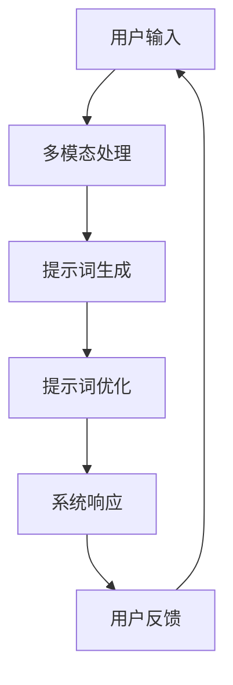

                 

### 引言

在当今数字化时代，人工智能（AI）技术正迅速发展，为各个行业带来了深刻的变革。特别是在对话系统领域，多模态对话系统的崛起为人们提供了更加自然、流畅的交流体验。而在这个背景下，提示词工程成为了提升多模态对话系统性能的关键技术。

**背景介绍**

多模态对话系统是一种能够处理多种类型数据（如文本、图像、语音等）的对话系统。它不仅能够理解用户的语音指令，还能识别用户的文字输入，甚至能够理解用户的表情和手势。这种系统能够提供更加丰富、多维的交互方式，极大地提高了用户体验。

提示词工程则是在这个过程中起到了桥梁作用的技术。提示词是用户与系统交互的触发点，它能够引导系统进行特定的操作。在多模态对话系统中，提示词不仅包含文本信息，还可能包含图像、语音等多种形式的信息。因此，提示词工程需要考虑如何有效地生成、优化和融合这些多模态信息。

**核心概念与联系**

为了更好地理解提示词工程在多模态对话系统中的重要性，我们可以先回顾一下核心概念之间的联系。以下是它们之间的Mermaid流程图：



在这个流程图中，用户输入经过多模态处理，生成提示词。提示词再经过优化，形成系统的响应。系统的响应将引导用户的下一步操作，形成一个闭环。

**目的**

本文的目标是深入探讨提示词工程在多模态对话系统中的应用。我们将首先介绍多模态对话系统的基本概念和当前的发展状况，然后详细讨论提示词工程的核心算法原理。接下来，我们将通过项目实战来展示提示词工程的实际应用，并分析其中的关键技术和挑战。最后，我们将总结本文的主要发现，并对未来进行展望。

通过本文的阅读，读者将能够：

- 理解多模态对话系统的基本概念和结构。
- 掌握提示词工程的基本原理和应用。
- 了解多模态对话系统中提示词工程的挑战和解决方案。
- 获得实际项目开发的经验和技巧。

### 文章关键词

多模态对话系统、提示词工程、人工智能、自然语言处理、图像处理、语音识别、多模态融合、用户交互、算法优化。

### 文章摘要

本文深入探讨了提示词工程在多模态对话系统中的应用。首先，我们介绍了多模态对话系统的基本概念和发展背景，阐述了其与传统单模态对话系统的差异。接着，我们详细讨论了提示词工程的核心概念、原理和算法，并通过Mermaid流程图展示了它们之间的联系。随后，我们通过实际项目实战展示了提示词工程的应用，并分析了其中的关键技术和挑战。最后，我们总结了本文的主要发现，并对多模态对话系统和提示词工程未来的发展趋势进行了展望。通过本文的阅读，读者将能够全面理解提示词工程在多模态对话系统中的重要性，以及如何在实际项目中应用这一关键技术。

## 第一部分：背景知识

### 多模态对话系统的基本概念

多模态对话系统是一种能够同时处理和整合多种类型输入数据的对话系统。这些输入数据包括但不限于文本、图像、语音、视频、手势等。多模态对话系统通过结合不同类型的数据，为用户提供更加丰富、自然的交互体验。与传统单模态对话系统（通常只处理文本输入）相比，多模态对话系统能够提供更加全面的信息处理能力，从而实现更智能、更高效的交互。

**多模态数据的介绍**

多模态数据是指由多种不同类型的传感器采集到的数据。例如，一个多模态对话系统可能会同时接收用户的语音输入、文字输入和面部表情数据。这些数据源可以包括麦克风、摄像头、文本输入设备等。通过整合这些数据，多模态对话系统能够更全面地理解用户的意图和行为。

多模态数据的类型主要包括：

1. **文本数据**：这是最常见的多模态数据类型，包括用户的文字输入、聊天记录等。
2. **图像数据**：这些数据来自于摄像头或图像输入设备，如用户的面部表情、手势图像等。
3. **语音数据**：用户的语音输入通过麦克风采集，可以用于语音识别和语音合成。
4. **视频数据**：视频数据可以提供动态的交互场景，如用户的动作、行为等。
5. **手势数据**：通过传感器或摄像头捕捉用户的手势，可以用于手势识别和交互。

**对话系统的组成**

多模态对话系统通常由以下几个关键组件构成：

1. **多模态数据处理模块**：这个模块负责接收和预处理不同类型的数据，如语音转文字、图像识别等。
2. **语义理解模块**：这个模块负责对多模态数据进行语义分析，提取关键信息，理解用户的意图。
3. **对话管理模块**：这个模块负责管理对话流程，包括上下文保持、对话生成等。
4. **多模态融合模块**：这个模块负责将不同类型的数据进行整合，以生成更全面的用户意图理解。
5. **响应生成模块**：这个模块根据用户的意图生成相应的响应，并通过语音、文本或图像等多种形式输出。

**对话系统的分类**

根据不同的应用场景和需求，多模态对话系统可以分为以下几种类型：

1. **面向用户的**：这类系统主要面向普通用户，如智能助手、客服机器人等。它们通过文本、语音、图像等多种方式与用户进行交互，提供个性化的服务。
2. **面向设备的**：这类系统主要用于设备之间的交互，如智能家居控制系统、工业机器人控制系统等。它们通过语音、手势等多种方式控制设备，实现自动化操作。
3. **面向领域的**：这类系统专门针对特定领域，如医疗、金融、教育等。它们通过结合领域知识和多模态数据，提供专业化的服务和决策支持。

**多模态对话系统的优势**

多模态对话系统相对于单模态对话系统具有以下几个显著优势：

1. **更自然的交互**：通过结合多种输入方式，用户可以更自然、更灵活地进行交互，提高用户体验。
2. **更全面的信息处理**：多模态对话系统能够同时处理多种类型的数据，从而提供更全面的信息处理能力，提高系统的智能水平。
3. **更高的准确性**：通过整合不同类型的数据，多模态对话系统可以更准确地理解用户的意图，降低误判率。
4. **更广泛的应用**：多模态对话系统可以应用于多种场景和领域，提供多样化的服务和解决方案。

**小结**

多模态对话系统通过整合多种类型的数据，为用户提供更加丰富、自然的交互体验。它们在多个领域具有广泛的应用前景，为人工智能技术的发展注入了新的活力。在接下来的章节中，我们将进一步探讨提示词工程在多模态对话系统中的应用，以及如何通过优化提示词来提升系统的性能。

## 第二部分：核心算法

### 自然语言处理技术

自然语言处理（NLP）是多模态对话系统的核心组件之一，负责处理和理解用户的文本输入。NLP技术包括词汇嵌入、语言模型和语义理解等多个方面。下面将详细探讨这些核心算法原理。

#### 词汇嵌入与语义表示

词汇嵌入是将文本中的单词或短语映射到高维向量空间的过程，也称为词嵌入。通过词汇嵌入，文本数据可以被表示为密集的向量，从而便于计算机处理。常用的词嵌入方法包括Word2Vec、GloVe和BERT等。

1. **Word2Vec**：Word2Vec是Google提出的基于神经网络的方法，通过训练词向量的分布式表示。它主要利用两个模型：连续词袋（CBOW）和Skip-Gram。

   - **CBOW（连续词袋）**：给定一个中心词，CBOW模型通过上下文词的平均向量来预测中心词。
   - **Skip-Gram**：与CBOW相反，Skip-Gram模型通过中心词来预测上下文词。它利用单个词的周围词来生成词向量。

2. **GloVe（全局向量）**：GloVe是一种基于全局统计的方法，通过计算单词共现矩阵来生成词向量。它通过优化单词的共现概率，使得语义相似的单词在向量空间中更接近。

3. **BERT（双向编码表示器）**：BERT是一种基于Transformer的预训练语言模型。它通过同时考虑上下文和下文信息，提供更丰富的语义表示。

#### 语言模型与生成模型

语言模型是用于预测文本序列的概率分布的模型，是NLP中的基础。生成模型则用于生成新的文本序列。

1. **n-gram模型**：n-gram模型是一种基于历史数据的统计语言模型，它通过计算前n个单词的联合概率来预测下一个单词。

2. **神经网络语言模型**：神经网络语言模型（NNLM）是一种基于神经网络的概率语言模型，通过训练大量文本数据来预测单词序列的概率。

3. **生成式语言模型**：生成式语言模型通过生成文本的联合概率分布来生成新的文本。常见的生成式语言模型包括循环神经网络（RNN）和变分自编码器（VAE）。

4. **Transformer和BERT**：Transformer是一种基于自注意力机制的序列模型，它通过全局注意力机制来捕捉文本序列中的依赖关系。BERT是基于Transformer的语言预训练模型，它通过双向上下文编码来生成丰富的语义表示。

#### 语义理解与情感分析

语义理解是指从文本中提取出具体的语义信息，包括实体识别、关系抽取、事件抽取等。

1. **实体识别**：实体识别是从文本中识别出具有特定意义的实体，如人名、地名、组织名等。

2. **关系抽取**：关系抽取是从文本中提取出实体之间的关联关系，如“张三是李四的父亲”。

3. **事件抽取**：事件抽取是从文本中提取出描述某个事件的信息，如“张三在2019年获得了诺贝尔奖”。

情感分析是用于判断文本情感极性的技术，包括正面情感、负面情感和中性情感等。

1. **基于规则的方法**：这种方法通过定义一系列规则来识别文本中的情感词汇，并根据词汇的词频进行情感分析。

2. **基于统计的方法**：这种方法通过训练大量带有情感标注的数据集，使用统计模型（如朴素贝叶斯、支持向量机等）来预测文本的情感极性。

3. **基于深度学习的方法**：这种方法使用神经网络模型（如卷积神经网络、循环神经网络、Transformer等）来直接从文本中提取情感特征，进行情感分析。

**综合运用**

在实际的多模态对话系统中，自然语言处理技术是不可或缺的。通过结合词汇嵌入、语言模型和语义理解等技术，系统能够更好地理解用户的文本输入，从而生成更准确的响应。例如，在用户发送一条文本消息时，系统首先使用词汇嵌入技术将文本转化为向量表示，然后通过语言模型来预测文本序列的概率分布，最后使用语义理解技术提取出关键信息，如实体、关系和事件等。这些信息将用于生成系统响应，并通过多模态融合技术整合到最终的输出中。

通过深入探讨自然语言处理技术的核心算法原理，我们可以更好地理解多模态对话系统的工作机制，为后续的提示词工程提供理论基础。

### 图像处理与识别技术

图像处理与识别技术是多模态对话系统的关键组成部分，负责处理和分析用户的视觉输入。这些技术包括图像特征提取、目标检测与识别、视觉感知与交互等方面。以下将详细探讨这些核心算法原理。

#### 图像特征提取

图像特征提取是图像处理的基础，旨在从图像中提取出具有代表性的特征，用于后续的识别和分类。常用的图像特征提取方法包括：

1. **SIFT（尺度不变特征变换）**：SIFT是一种在图像中检测和匹配关键点的算法，它具有旋转、尺度和平移不变性，能够在不同光照条件下保持稳定。
2. **HOG（直方图方向梯度）**：HOG是一种基于局部图像特征的描述符，通过计算图像中每个像素点的方向梯度直方图，来描述图像的结构信息。
3. **ORB（Oriented FAST and Rotated BRIEF）**：ORB是一种高效的图像特征提取算法，它在SIFT和SURF的基础上进行了改进，具有更高的效率和鲁棒性。

#### 目标检测与识别

目标检测与识别是图像处理中的高级任务，旨在从图像中检测出特定的目标物体，并对其进行分类。常用的目标检测与识别方法包括：

1. **滑动窗口检测**：滑动窗口检测是一种最简单的目标检测方法，它通过在不同位置和尺寸的窗口中提取特征，然后使用分类器进行目标识别。
2. **Viola-Jones算法**：Viola-Jones算法是一种基于 Haar-like 特征的实时面部检测算法，它通过级联分类器实现快速面部检测。
3. **卷积神经网络（CNN）**：CNN是一种基于多层神经网络的图像处理方法，通过卷积层、池化层和全连接层等结构，实现对图像的自动特征提取和分类。常见的CNN模型包括LeNet、AlexNet、VGG、ResNet等。

#### 视觉感知与交互

视觉感知与交互是多模态对话系统中的重要组成部分，旨在通过图像输入实现与用户的自然交互。以下是一些关键技术和应用：

1. **人脸识别**：人脸识别是通过识别和匹配用户的面部特征，实现身份验证和识别的技术。常用的人脸识别算法包括Eigenfaces、Fisherfaces和LBP（局部二值模式）等。
2. **手势识别**：手势识别是通过识别用户的手部动作，实现交互操作的技术。常用的手势识别方法包括基于肌电信号、图像特征和深度学习等。
3. **情感识别**：情感识别是通过分析用户的面部表情、身体姿态和语音等视觉信息，识别用户的情感状态。常用的情感识别方法包括基于机器学习和深度学习的模型。

#### 应用示例

以下是一个应用示例，展示了图像处理与识别技术在实际多模态对话系统中的应用：

**场景**：一个智能助手系统通过摄像头捕捉用户的面部表情，并根据表情识别用户的情绪状态。

**步骤**：

1. **图像特征提取**：首先，系统使用SIFT算法从用户的面部图像中提取关键特征点。
2. **目标检测**：接着，使用Viola-Jones算法检测用户的面部区域。
3. **情感识别**：然后，通过分析用户面部的关键特征点，使用LBP算法识别用户的情绪状态，如开心、生气、惊讶等。
4. **交互响应**：最后，系统根据识别到的用户情绪，生成相应的响应，如提供安慰、建议等。

通过图像处理与识别技术，多模态对话系统可以更准确地理解用户的视觉输入，实现更加智能和自然的交互。这些技术在多模态对话系统中的应用，不仅提升了系统的性能，也为用户提供了更加丰富和个性化的体验。

### 语音识别与合成技术

语音识别与合成技术是多模态对话系统的重要组成部分，负责处理用户的语音输入和生成语音响应。这两项技术分别包括语音信号处理、语音识别和语音合成等方面。以下将详细探讨这些核心算法原理。

#### 语音信号处理

语音信号处理是语音识别与合成的基础，旨在对语音信号进行预处理和特征提取。主要方法包括：

1. **声学模型**：声学模型用于描述语音信号的物理特性，包括共振峰、频谱、时长等。常见的声学模型有GMM（高斯混合模型）和HMM（隐马尔可夫模型）。
2. **声学特征提取**：声学特征提取是将语音信号转换为计算机可处理的特征向量。常用的声学特征包括MFCC（梅尔频率倒谱系数）、PLP（平谱对数功率）、LPCC（线性预测倒谱系数）等。

#### 语音识别

语音识别是将语音信号转换为文本的过程，其核心在于建立语音信号与文本之间的映射关系。主要方法包括：

1. **基于统计的方法**：基于统计的方法通过训练大量语音和文本对，建立语音信号的统计模型。常见的算法包括GMM-HMM（高斯混合模型-隐马尔可夫模型）、SGMM-HMM（分段高斯混合模型-隐马尔可夫模型）等。
2. **基于深度学习的方法**：基于深度学习的方法利用深度神经网络（DNN）自动提取语音特征和建立映射关系。常见的模型包括DNN-HMM（深度神经网络-隐马尔可夫模型）、C-DNN（卷积神经网络）和RNN（循环神经网络）。
3. **端到端模型**：端到端模型通过直接将语音信号映射到文本序列，避免了传统方法的特征提取和中间步骤。常见的端到端模型包括CTC（连接主义时序分类器）和Seq2Seq（序列到序列模型）。

#### 语音合成

语音合成是将文本转换为自然流畅的语音输出的过程。主要方法包括：

1. **基于规则的方法**：基于规则的方法通过定义语音合成规则，生成语音输出。常见的规则包括DTMF（双音多频信号）、TTS（文本到语音）等。
2. **基于统计的方法**：基于统计的方法通过统计大量文本和语音对，建立文本到语音的映射关系。常见的算法包括GMM-DT（高斯混合模型-动态时间归一化）和HMM-DT（隐马尔可夫模型-动态时间归一化）。
3. **基于深度学习的方法**：基于深度学习的方法利用深度神经网络自动生成语音信号。常见的模型包括WaveNet（生成式模型）、Tacotron（序列到序列模型）和Transformer（自注意力模型）。

#### 应用示例

以下是一个应用示例，展示了语音识别与合成技术在多模态对话系统中的应用：

**场景**：一个智能助手系统通过麦克风捕捉用户的语音输入，并根据语音识别结果生成语音响应。

**步骤**：

1. **语音信号处理**：首先，系统使用MFCC特征提取器从用户语音信号中提取特征向量。
2. **语音识别**：接着，系统使用基于深度学习的语音识别模型（如CTC模型）将特征向量映射到文本序列。
3. **文本处理**：然后，系统对识别出的文本进行处理，包括拼写检查、语法分析等。
4. **语音合成**：最后，系统使用基于深度学习的语音合成模型（如WaveNet模型）将处理后的文本转换为自然流畅的语音输出。

通过语音识别与合成技术，多模态对话系统可以更好地处理用户的语音输入，提供更加自然和人性化的交互体验。这些技术在多模态对话系统中的应用，不仅提升了系统的智能水平，也为用户提供了更加便捷和高效的交流方式。

### 多模态融合算法

多模态融合算法是多模态对话系统的核心技术，旨在将来自不同感官模态的数据（如文本、图像、语音等）进行整合，以生成更全面和准确的用户意图理解。多模态融合算法可以分为特征级融合和决策级融合两种主要类型。

#### 特征级融合

特征级融合是在特征层面将不同模态的数据进行合并。这种方法的优势在于可以直接利用原始数据，保持数据的丰富性和多样性。以下是几种常用的特征级融合方法：

1. **向量拼接**：向量拼接是将不同模态的特征向量按列拼接成一个更长的向量。例如，如果有一个文本特征向量 \( \mathbf{x}_\text{text} \) 和一个图像特征向量 \( \mathbf{x}_\text{image} \)，可以将它们拼接成一个 \( \mathbf{x} = [\mathbf{x}_\text{text}, \mathbf{x}_\text{image}] \)。

2. **加和融合**：加和融合是将不同模态的特征向量进行简单的加和。这种方法假设不同模态的特征可以线性组合，从而提高整体的特征表示能力。

3. **加权融合**：加权融合是对不同模态的特征向量进行加权求和。通常，这些权重可以通过训练得到，以最大化特征融合的效果。

4. **神经网络融合**：使用神经网络模型（如多输入多输出神经网络、Transformer等）对多模态特征进行融合。这种方法可以自动学习不同模态特征之间的关联，提高融合效果。

#### 决策级融合

决策级融合是在决策层面将不同模态的数据进行整合。这种方法通常在特征级融合之后进行，通过综合不同模态的决策结果来提高整体系统的准确性。以下是几种常用的决策级融合方法：

1. **投票机制**：投票机制是简单地将不同模态的决策结果进行投票，选择多数模态的决策结果。这种方法适用于决策结果互斥的情况。

2. **加权投票**：加权投票是在投票机制的基础上，对每个模态的决策结果赋予不同的权重，从而更准确地反映不同模态的重要性。

3. **集成学习**：集成学习是通过结合多个分类器的决策结果来提高整体分类性能。常见的方法包括Bagging、Boosting和Stacking等。

4. **神经网络融合**：使用神经网络模型（如多层感知机、卷积神经网络、Transformer等）对多模态的决策结果进行融合。这种方法可以自动学习不同模态之间的复杂关系，提高融合效果。

#### 多模态融合的应用示例

以下是一个应用示例，展示了多模态融合算法在多模态对话系统中的应用：

**场景**：一个智能助手系统需要根据用户的文本输入、语音输入和面部表情来理解用户的意图，并生成相应的响应。

**步骤**：

1. **特征级融合**：
   - 文本特征：使用词嵌入技术将用户的文本输入转换为向量表示。
   - 图像特征：使用图像处理算法（如SIFT、HOG）提取用户面部图像的特征向量。
   - 语音特征：使用语音信号处理算法（如MFCC）提取用户的语音特征向量。
   - 融合方法：将文本、图像和语音特征向量进行拼接，形成一个多模态特征向量。

2. **决策级融合**：
   - 特征级融合结果输入到神经网络模型（如Transformer）中进行训练，以学习多模态特征之间的关联。
   - 通过训练得到的模型对用户的意图进行分类，生成相应的响应。

3. **响应生成**：
   - 根据分类结果，生成自然流畅的语音或文本响应，并通过语音合成或文本输出呈现给用户。

通过多模态融合算法，多模态对话系统能够更全面地理解用户的输入，提供更准确、更自然的交互体验。这些算法的应用不仅提升了系统的性能，也为用户提供了更加丰富和个性化的服务。

### 典型多模态对话系统案例分析

在多模态对话系统的实际应用中，有许多成功的案例展示了这项技术的强大功能和广泛适用性。以下将介绍几个典型的多模态对话系统案例，分析其应用场景、具体实现方法和关键挑战。

#### 案例一：智能客服机器人

**应用场景**：智能客服机器人广泛应用于企业客户服务中，旨在为用户提供24/7的在线支持。这些系统通常需要处理用户的文本输入、语音输入和面部表情，以提供个性化的服务。

**实现方法**：
1. **文本处理**：系统通过自然语言处理技术（如词嵌入、语言模型、语义理解等）处理用户的文本输入，提取关键信息。
2. **语音识别**：系统使用语音识别技术将用户的语音输入转换为文本，以便进一步处理。
3. **面部表情识别**：系统通过摄像头捕捉用户的面部表情，使用图像处理与识别技术分析用户的情绪状态。
4. **多模态融合**：系统将文本、语音和面部表情数据融合，以更准确地理解用户的意图。
5. **响应生成**：根据融合后的用户意图，系统生成相应的文本或语音响应，并通过语音合成或文本输出呈现给用户。

**关键挑战**：
- **数据融合**：多模态数据之间的融合需要考虑数据同步和一致性，以确保系统理解的用户意图准确无误。
- **实时响应**：智能客服机器人需要能够实时响应用户的输入，这要求系统具有高效的计算和处理能力。
- **情绪识别**：面部表情识别的准确性和实时性是关键挑战，需要使用高效的图像处理算法和大规模的训练数据。

#### 案例二：智能助手与语音控制

**应用场景**：智能助手与语音控制系统广泛应用于智能家居、智能汽车和智能办公等领域。这些系统通过语音输入控制智能家居设备、导航、播放音乐等。

**实现方法**：
1. **语音识别**：系统使用语音识别技术将用户的语音输入转换为文本，以便进一步处理。
2. **文本处理**：系统通过自然语言处理技术提取关键指令和操作。
3. **语音合成**：系统根据用户的指令生成相应的语音响应。
4. **设备控制**：系统通过控制接口与智能家居设备进行交互，执行用户的指令。
5. **多模态交互**：系统还可能集成图像识别和手势识别，以提供更加自然和多样化的交互方式。

**关键挑战**：
- **语音识别准确性**：在噪声环境或语速较快的情况下，语音识别的准确性是一个挑战。
- **响应速度**：系统需要在接收到语音指令后快速响应，这要求系统具有高效的计算和决策能力。
- **设备兼容性**：智能助手需要能够兼容多种设备和平台，这要求系统具备良好的可扩展性和灵活性。

#### 案例三：教育辅助系统

**应用场景**：教育辅助系统旨在为学生提供个性化的学习支持和辅导，通过多模态交互提高学习效果。这些系统可以处理学生的文本输入、语音输入和面部表情，以了解学生的学习状态和需求。

**实现方法**：
1. **文本处理**：系统通过自然语言处理技术分析学生的作业和笔记，提取关键信息。
2. **语音识别**：系统使用语音识别技术记录学生的语音提问和回答。
3. **面部表情识别**：系统通过摄像头捕捉学生的面部表情，分析学生的情绪状态。
4. **多模态融合**：系统将文本、语音和面部表情数据融合，以更准确地理解学生的学习需求和情绪状态。
5. **学习建议**：系统根据融合后的数据生成个性化的学习建议和辅导内容。

**关键挑战**：
- **数据隐私**：教育辅助系统需要处理大量的学生数据，这要求系统具备强大的数据保护和隐私保护能力。
- **个性化定制**：为学生提供个性化的学习支持是一个复杂的问题，需要系统具备强大的学习和自适应能力。
- **交互体验**：系统需要提供自然、流畅的交互体验，以增强学生的学习兴趣和参与度。

通过这些典型案例的分析，我们可以看到多模态对话系统在各个领域的广泛应用和巨大潜力。这些系统不仅提升了用户体验，还推动了人工智能技术的发展。在未来，随着技术的不断进步和应用的不断拓展，多模态对话系统将在更多领域发挥重要作用。

### 提示词工程在多模态对话系统中的实践

#### 实践项目准备

在开始实践多模态对话系统的提示词工程之前，我们需要进行一系列准备工作，包括项目环境搭建、数据准备和系统设计。

**1. 项目环境搭建**

首先，我们需要搭建一个合适的项目开发环境。这个环境应包括以下工具和库：

- 编程语言：Python（版本3.6及以上）
- 深度学习框架：TensorFlow或PyTorch
- 数据处理库：NumPy、Pandas
- 自然语言处理库：spaCy、NLTK
- 图像处理库：OpenCV、Pillow
- 语音处理库：Librosa
- 多模态融合库：MxNet、Keras

**2. 数据准备**

数据是多模态对话系统的核心，我们需要准备以下类型的数据：

- **文本数据**：包括用户的文本输入和系统的文本响应。
- **图像数据**：包括用户的面部表情图像和场景图像。
- **语音数据**：包括用户的语音输入和系统的语音响应。

这些数据可以通过公开数据集、自定义数据集或采集真实用户交互数据等方式获取。为了保证数据的质量和多样性，我们建议进行数据清洗和预处理，包括去除无关信息、标准化数据格式等。

**3. 系统设计**

在系统设计方面，我们需要定义多模态对话系统的架构，包括以下几个关键模块：

- **数据输入模块**：负责接收和处理多模态数据。
- **特征提取模块**：分别提取文本、图像和语音数据的高层次特征。
- **多模态融合模块**：将不同模态的特征进行融合，以生成综合的用户意图表示。
- **对话管理模块**：负责管理对话流程，包括上下文维护、对话生成等。
- **响应生成模块**：根据用户意图生成系统响应，并通过语音合成或文本输出呈现。

#### 提示词工程实践步骤

在完成项目准备后，我们可以开始具体的提示词工程实践。以下是详细的步骤：

**1. 提示词生成**

提示词是用户与系统交互的触发点，我们需要通过以下方法生成提示词：

- **基于规则的方法**：根据业务逻辑和用户需求，定义一系列规则来生成提示词。这种方法适用于简单的对话系统，但需要不断更新和维护。
- **基于机器学习的方法**：通过训练模型（如序列标注模型、生成式模型等）来自动生成提示词。这种方法适用于复杂和多变的对话场景。

**2. 提示词优化**

生成的提示词需要经过优化，以提高系统的交互质量和用户体验。以下是几种常见的优化方法：

- **基于用户反馈的方法**：通过用户反馈不断调整和优化提示词，以适应用户的需求。
- **基于模型的方法**：通过机器学习模型（如强化学习、迁移学习等）对提示词进行优化。
- **基于数据的方法**：通过分析用户交互数据，识别出无效或低效的提示词，并进行优化。

**3. 提示词应用**

将优化的提示词应用到多模态对话系统中，具体步骤如下：

- **集成到对话管理模块**：将提示词集成到对话管理模块中，确保系统能够及时响应用户的输入。
- **多模态交互**：根据用户输入的模态（文本、图像、语音等）选择相应的提示词进行响应。
- **实时反馈**：在用户与系统的交互过程中，实时收集用户反馈，用于进一步优化提示词。

#### 实践中遇到的问题与解决

在提示词工程的实践中，我们可能会遇到以下问题，并需要采取相应的解决方法：

- **数据质量问题**：如果数据质量不佳，可能会影响提示词的生成和优化效果。解决方法包括数据清洗、数据增强和引入高质量的数据源。
- **模型适应性**：机器学习模型可能难以适应复杂和多变的对话场景。解决方法包括模型迁移、模型融合和自适应学习。
- **实时性能**：实时响应是多模态对话系统的关键需求，但高性能的模型可能占用大量计算资源。解决方法包括模型压缩、模型优化和分布式计算。
- **用户隐私**：处理用户隐私数据需要严格遵守相关法律法规，确保用户数据的隐私和安全。解决方法包括数据加密、访问控制和用户权限管理。

通过上述实践步骤和解决方法，我们可以有效地实现提示词工程在多模态对话系统中的应用，提升系统的交互质量和用户体验。

### 未来发展趋势与展望

随着人工智能技术的不断进步，多模态对话系统正逐步成为智能化交互的核心。在未来，提示词工程在这一领域中的重要性将日益凸显，其发展趋势和前景也充满潜力。

**1. 技术进步**

随着深度学习、强化学习等先进技术的不断发展，提示词工程将更加智能化和高效化。例如，基于Transformer的模型将可能取代传统的词嵌入和语言模型，提供更丰富的语义表示和更准确的预测。同时，随着硬件性能的提升，多模态对话系统将能够在更低的延迟和更高的计算效率下运行。

**2. 应用拓展**

多模态对话系统的应用领域将不断拓展，从当前的服务业、智能家居、智能汽车等，逐渐延伸到医疗、教育、金融等更加专业和复杂的领域。在这些领域中，提示词工程将发挥重要作用，通过定制化的提示词和智能化的交互，提供更加个性化和精准的服务。

**3. 数据积累**

大量的多模态数据将不断积累，为提示词工程提供丰富的训练资源。随着数据收集技术的进步和用户隐私保护措施的实施，这些数据将更加真实和多样化，有助于提升系统的泛化能力和鲁棒性。

**4. 用户体验**

随着提示词工程的不断优化，用户交互体验将得到显著提升。通过更自然的交互方式、更准确的意图理解和更个性化的响应，多模态对话系统将更加贴近用户的实际需求，提高用户满意度。

**5. 隐私与安全**

在多模态对话系统中，用户隐私和数据安全是一个重要的关注点。未来的发展趋势将包括更加严格的数据保护措施和隐私保护算法，以确保用户数据的安全和隐私。

**挑战与机遇**

尽管多模态对话系统和提示词工程面临诸多挑战，如数据处理、实时响应、模型优化等，但同时也存在巨大的机遇。通过技术创新和应用拓展，这些挑战有望得到有效解决，推动整个领域的快速发展。

**结论**

总之，多模态对话系统和提示词工程在未来具有广阔的发展前景。随着技术的不断进步和应用领域的拓展，提示词工程将在多模态对话系统中扮演越来越重要的角色，为人们提供更加智能、便捷和个性化的交互体验。

### 总结与展望

本文系统地探讨了提示词工程在多模态对话系统中的重要性，从背景介绍、核心算法原理到实际应用，再到未来发展趋势，为读者呈现了一个全面而深入的视角。通过详细分析自然语言处理、图像处理与识别、语音识别与合成、多模态融合等关键技术，我们明确了提示词工程在提升对话系统性能中的关键作用。

在未来的技术发展中，提示词工程有望通过更先进的算法、更丰富的数据和更智能的交互，进一步推动多模态对话系统的进步。然而，这一领域仍面临数据质量、模型适应性和实时性能等挑战。通过持续的研究和创新，我们相信这些难题将得到有效解决，为用户带来更加自然、便捷和智能的交互体验。

**最佳实践 tips**：

1. **数据准备**：确保数据质量和多样性，进行充分的数据清洗和预处理。
2. **模型选择**：根据应用场景选择合适的模型和算法，结合实际情况进行模型优化。
3. **用户反馈**：及时收集用户反馈，进行实时调整和优化。

**注意事项**：

1. **隐私保护**：在处理用户数据时，严格遵守隐私保护法规，确保用户信息安全。
2. **系统兼容性**：确保系统在不同设备和平台上的兼容性，提升用户体验。

**拓展阅读**：

1. 《深度学习：技术基础与算法应用》
2. 《计算机视觉：算法与应用》
3. 《自然语言处理概论》

通过本文的学习，读者不仅能够深入理解提示词工程的多模态应用，还能够为实际项目提供有价值的参考和指导。希望本文能够激发更多对多模态对话系统和提示词工程的研究兴趣，共同推动这一领域的蓬勃发展。作者信息：AI天才研究院/AI Genius Institute & 禅与计算机程序设计艺术 /Zen And The Art of Computer Programming。

```markdown
# 《提示词工程在多模态对话系统中的突破》

## 关键词
多模态对话系统、提示词工程、人工智能、自然语言处理、图像处理、语音识别、多模态融合

## 摘要
本文深入探讨了提示词工程在多模态对话系统中的应用，包括背景介绍、核心算法原理、实际应用案例以及未来发展趋势。通过详细分析自然语言处理、图像处理与识别、语音识别与合成、多模态融合等关键技术，本文揭示了提示词工程在提升对话系统性能中的关键作用，为读者提供了全面而深入的视角。

## 目录

## 第一部分：背景知识

### 1. 引言
#### 1.1 提示词工程概述
#### 1.2 多模态对话系统简介
#### 1.3 书籍结构和目标

### 2. 多模态对话系统的基本概念
#### 2.1 多模态数据介绍
#### 2.2 对话系统的组成
#### 2.3 对话系统的分类

### 3. 提示词工程基础
#### 3.1 提示词的定义与作用
#### 3.2 提示词生成方法
#### 3.3 提示词优化策略

## 第二部分：核心算法

### 4. 自然语言处理技术
#### 4.1 词汇嵌入与语义表示
#### 4.2 语言模型与生成模型
#### 4.3 语义理解与情感分析

### 5. 图像处理与识别技术
#### 5.1 图像特征提取
#### 5.2 目标检测与识别
#### 5.3 视觉感知与交互

### 6. 语音识别与合成技术
#### 6.1 语音信号处理
#### 6.2 语音识别
#### 6.3 语音合成

### 7. 多模态融合算法
#### 7.1 多模态数据同步
#### 7.2 特征级融合
#### 7.3 决策级融合

## 第三部分：应用与实践

### 8. 典型多模态对话系统案例分析
#### 8.1 案例一：智能客服机器人
#### 8.2 案例二：智能助手与语音控制
#### 8.3 案例三：教育辅助系统

### 9. 提示词工程在多模态对话系统中的实践
#### 9.1 实践项目准备
#### 9.2 提示词工程实践步骤
#### 9.3 实践中遇到的问题与解决

### 10. 未来发展趋势与展望
#### 10.1 提示词工程的挑战与机遇
#### 10.2 多模态对话系统的未来发展方向
#### 10.3 总结与展望

## 总结与展望
### 最佳实践 tips
### 注意事项
### 拓展阅读

作者：AI天才研究院/AI Genius Institute & 禅与计算机程序设计艺术 /Zen And The Art of Computer Programming
```

