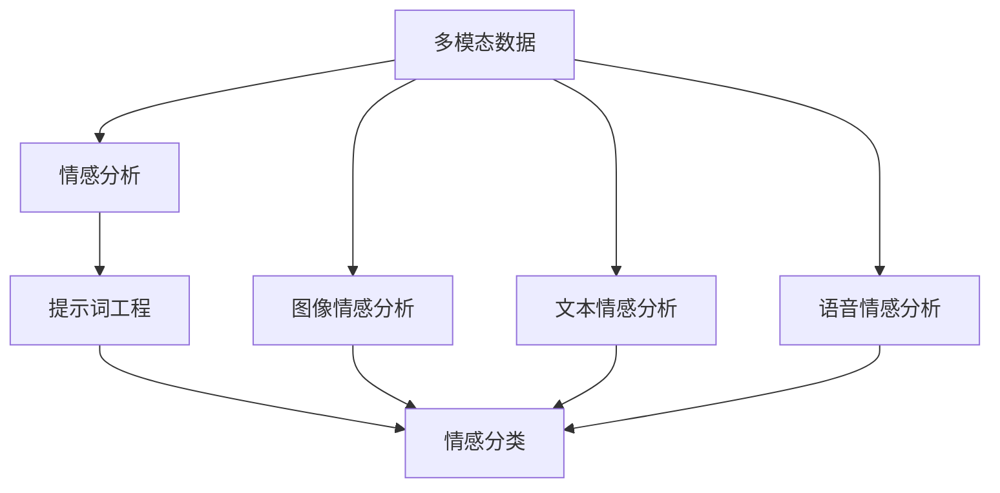

                 

## 引言

### 多模态情感分析的重要性

在当今的信息时代，人们对内容理解和交互的需求日益增长，特别是对情感的理解和回应。多模态情感分析作为一种先进的计算机技术，能够同时处理文本、图像、声音等多种数据类型，从而更准确地捕捉和解读用户的情感状态。这种技术不仅广泛应用于社交媒体分析、客户服务、情感计算等场景，还在医疗、教育、智能助手等领域显示出巨大的潜力。

多模态情感分析的兴起，得益于以下几个方面：

1. **大数据与人工智能的结合**：随着大数据技术的成熟和人工智能算法的发展，我们能够处理和分析越来越复杂的多模态数据。
2. **用户需求的变化**：现代用户越来越追求个性化的服务和体验，对情感的理解和回应变得更加重要。
3. **跨学科研究的推动**：计算机科学、心理学、语言学等多学科的研究进展，为多模态情感分析提供了理论基础和技术支撑。

### 提示词工程在多模态情感分析中的作用

提示词工程（Word Embedding）是多模态情感分析中的关键技术之一，它通过将词汇映射到低维空间，使得具有相似意义的词汇在空间中彼此靠近，从而能够有效提升情感分析的准确性。在多模态情感分析中，提示词工程的应用主要体现在以下几个方面：

1. **文本情感分析**：通过将文本中的词汇映射到低维空间，结合情感词典和机器学习算法，可以准确识别文本的情感倾向。
2. **图像情感分析**：利用视觉特征和提示词工程，可以将图像中的物体和场景映射到情感空间，从而进行情感分类。
3. **语音情感分析**：将语音信号转换为文本，再利用提示词工程进行情感分析，可以捕捉用户的语音情感。

### 本文目的与结构

本文旨在深入探讨提示词工程在多模态情感分析中的应用，通过系统的分析和实例展示，帮助读者理解这一技术的核心原理和实际应用。文章结构如下：

1. **背景介绍**：介绍多模态情感分析和提示词工程的基本概念和应用场景。
2. **核心概念与联系**：通过Mermaid流程图，阐述多模态情感分析中的核心概念及其相互关系。
3. **多模态数据处理**：讲解多模态数据的获取、预处理和整合方法。
4. **情感分析算法**：介绍常用的情感分析算法，包括传统机器学习和深度学习算法。
5. **提示词工程**：详细讨论提示词工程的基本原理、方法和应用。
6. **多模态情感分析应用实例**：提供实际应用案例，展示如何使用提示词工程进行多模态情感分析。
7. **性能评估与优化**：讨论多模态情感分析系统的性能评估方法和优化策略。
8. **未来趋势与挑战**：探讨多模态情感分析的发展方向和面临的挑战。

通过以上内容的系统介绍，本文希望为读者提供一个全面、深入的多模态情感分析及其关键技术——提示词工程的理解和应用指南。

### 核心概念与联系

多模态情感分析的核心在于同时处理和融合来自不同模态的数据（如文本、图像、音频等），以实现对用户情感状态的准确识别。为了更好地理解这一过程，我们首先需要明确几个核心概念：多模态数据、情感分析、提示词工程。

#### 多模态数据

多模态数据是指由两种或两种以上不同类型的数据源组成的数据集合。在多模态情感分析中，文本、图像、音频等不同类型的数据可以被同时处理和融合。例如，在社交媒体分析中，用户的文字评论、图片以及语音留言构成了一个多模态数据集。这些数据来源多样，每种模态都有其独特的表达方式和情感特征。

**数据类型**：
- **文本**：包括用户的文字评论、推文、博客等，文本数据通常是情感分析的主要来源。
- **图像**：包含用户上传的图片、表情图片等，图像数据能够通过视觉特征传达情感。
- **音频**：包括用户的语音留言、音频评论等，音频数据通过声波特征表达情感。

**获取方法**：
- **自动采集**：通过爬虫、API等方式从互联网获取公开的数据集。
- **用户生成**：直接从用户交互行为（如社交媒体评论、语音留言等）中获取。

#### 情感分析

情感分析（Sentiment Analysis）是一种自然语言处理技术，旨在通过分析文本、图像或音频数据，识别和分类情感状态。情感分析的核心任务是判断数据中的情感倾向，如正面、负面或中性。

**情感分析过程**：
1. **数据预处理**：清洗和标准化数据，如去除停用词、进行词干提取等。
2. **特征提取**：提取文本、图像、音频中的关键特征，如词向量、视觉特征、声波特征。
3. **情感分类**：利用机器学习或深度学习算法，对特征进行建模和分类。

**情感分类方法**：
- **传统机器学习**：使用朴素贝叶斯、支持向量机（SVM）等传统算法。
- **深度学习**：使用卷积神经网络（CNN）、循环神经网络（RNN）等深度学习模型。

#### 提示词工程

提示词工程（Word Embedding）是将词汇映射到低维空间的技术，通过这种映射，具有相似意义的词汇在空间中彼此靠近。提示词工程在多模态情感分析中的应用，主要在于将不同模态的数据映射到同一特征空间，从而实现数据的融合和交互。

**基本原理**：
- **词向量表示**：将词汇映射到一个低维向量空间，每个词汇对应一个唯一的向量。
- **相似性度量**：通过计算词汇向量之间的相似性，识别和分类情感。

**方法**：
- **基于分布式假设**：将词汇映射到低维空间，保持词汇之间的语义关系。
- **基于矩阵分解**：通过矩阵分解方法，如Word2Vec、GloVe等，将词汇表示为低维向量。

**与多模态情感分析的联系**：
- **数据融合**：通过提示词工程，将不同模态的数据映射到同一特征空间，实现数据的融合。
- **提高情感分析准确性**：提示词工程能够更好地捕捉词汇之间的语义关系，从而提高情感分析的准确性。

#### Mermaid流程图

为了更直观地展示多模态情感分析中的核心概念及其相互关系，我们使用Mermaid绘制了以下流程图：



**图解**：
- **多模态数据**：数据来源包括文本、图像、音频等，这些数据通过不同的途径进入情感分析系统。
- **情感分析**：情感分析过程包括数据预处理、特征提取和情感分类，是整个系统的核心环节。
- **提示词工程**：提示词工程用于将不同模态的数据映射到同一特征空间，实现数据的融合和交互。
- **情感分类**：根据特征向量，系统进行情感分类，判断数据的情感倾向。
- **图像情感分析、文本情感分析和语音情感分析**：分别处理不同模态的数据，最终统一输出情感分类结果。

通过上述核心概念及其相互关系的详细阐述，我们可以更好地理解多模态情感分析的过程和技术要点。接下来，本文将继续深入探讨多模态数据的处理方法和情感分析算法，以帮助读者全面掌握这一领域的核心技术。

### 多模态数据处理

多模态数据的处理是进行多模态情感分析的重要步骤。这一过程包括数据的获取、预处理、特征提取和整合，以下我们将逐一进行详细讲解。

#### 数据获取

多模态数据的获取方式多种多样，主要包括以下几种途径：

1. **公开数据集**：例如MSC（Multimodal Sentiment Classification）数据集，包含文本、图像、音频等多种模态的数据，适用于情感分析的研究。
2. **社交媒体平台**：通过API接口获取用户在社交媒体上的文字评论、图片和语音留言。
3. **用户生成内容**：直接从用户的交互行为中获取数据，如客户服务系统中的用户反馈。

#### 数据预处理

数据预处理是保证数据质量和一致性的重要步骤。以下是常见的预处理方法：

1. **文本预处理**：包括去除停用词、标点符号、进行词干提取和词形还原等，以便提取出有意义的关键词。
2. **图像预处理**：进行图像去噪、大小调整、对比度增强等，以便后续的特征提取。
3. **音频预处理**：包括去除背景噪声、语音增强、分帧和滤波等，以便提取出清晰的语音特征。

#### 特征提取

特征提取是将多模态数据转换为可用于模型训练的特征向量。以下是常见的特征提取方法：

1. **文本特征**：使用Word2Vec、GloVe等提示词工程方法，将词汇映射到低维空间，提取词向量作为文本特征。
2. **图像特征**：使用卷积神经网络（CNN）提取图像的特征图，或使用预训练的视觉模型（如VGG、ResNet等）提取特征向量。
3. **音频特征**：使用短时傅里叶变换（STFT）提取音频的频谱特征，或使用递归神经网络（RNN）提取时间序列特征。

#### 数据整合

数据整合是将不同模态的数据融合为统一的特征向量，以便于模型训练。以下是一些常见的数据整合方法：

1. **拼接融合**：将不同模态的特征向量拼接在一起，形成一个多维特征向量。
2. **平均融合**：计算不同模态特征向量的平均值，作为整合后的特征向量。
3. **加权融合**：根据不同模态的数据重要程度，为每个模态的特征向量分配不同的权重，进行加权融合。

#### 实例说明

假设我们有一个包含文本、图像和音频的多模态数据集，以下是一个简单的数据处理流程实例：

1. **文本预处理**：
   - 使用NLTK库进行词干提取和词形还原，例如：
     ```python
     from nltk.stem import PorterStemmer
     stemmer = PorterStemmer()
     processed_text = [stemmer.stem(word) for word in text]
     ```

2. **图像预处理**：
   - 使用OpenCV库进行图像去噪和大小调整，例如：
     ```python
     import cv2
     image = cv2.imread(image_path)
     image = cv2.resize(image, (224, 224))
     ```

3. **音频预处理**：
   - 使用librosa库进行分帧和滤波，例如：
     ```python
     import librosa
     y, sr = librosa.load(audio_path)
     y_filtered = librosa.stft(y)
     ```

4. **特征提取**：
   - 使用Word2Vec提取文本特征，例如：
     ```python
     from gensim.models import Word2Vec
     model = Word2Vec(processed_text, vector_size=100, window=5, min_count=1, workers=4)
     text_feature = model.wv[processed_text]
     ```
   - 使用VGG16提取图像特征，例如：
     ```python
     from tensorflow.keras.applications import VGG16
     vgg16 = VGG16(weights='imagenet', include_top=False)
     image_feature = vgg16.predict(np.expand_dims(image, axis=0))
     ```
   - 使用librosa提取音频特征，例如：
     ```python
     audio_feature = librosa.feature.melspectrogram(y_filtered, sr=sr, n_mels=128)
     ```

5. **数据整合**：
   - 拼接不同模态的特征向量，例如：
     ```python
     integrated_feature = np.hstack((text_feature, image_feature, audio_feature))
     ```

通过上述实例，我们可以看到多模态数据处理的全流程。在实际应用中，这些步骤可以根据具体需求进行调整和优化，以提升多模态情感分析的准确性和效率。

### 情感分析算法

情感分析算法是实现多模态情感分析的核心组件，这些算法通过处理和融合多模态数据，从而准确识别和分类情感状态。本文将介绍几种常用的情感分析算法，包括传统机器学习算法和深度学习算法，并详细解释其工作原理。

#### 传统机器学习算法

**1. 朴素贝叶斯（Naive Bayes）**

朴素贝叶斯是一种基于概率理论的分类算法，它假设特征之间相互独立，通过计算每个特征的概率分布来预测情感状态。其基本步骤如下：

1. **特征概率估计**：计算每个特征在不同情感类别中的概率分布。
2. **条件概率计算**：利用贝叶斯公式，计算给定特征条件下每个情感类别的概率。
3. **分类决策**：选择概率最大的情感类别作为最终分类结果。

伪代码示例：

```python
def naive_bayes(train_data, train_labels, test_data):
    # 计算特征概率分布和条件概率
    # P(feature|label), P(label)
    # 计算给定特征条件下每个情感类别的概率
    # P(label|feature)
    # 选择概率最大的情感类别作为预测结果
    return predicted_labels
```

**2. 支持向量机（Support Vector Machine，SVM）**

支持向量机是一种通过最大化分类边界间隔的线性分类算法。其基本原理如下：

1. **特征空间映射**：将原始特征映射到高维特征空间。
2. **分类边界最大化**：找到能够最大化分类边界间隔的超平面。
3. **分类决策**：通过计算数据点到超平面的距离，进行分类决策。

伪代码示例：

```python
def svm(train_data, train_labels, test_data):
    # 使用SVM模型进行训练
    # 找到最大化分类边界间隔的超平面
    # 计算测试数据的分类结果
    return predicted_labels
```

#### 深度学习算法

**1. 卷积神经网络（Convolutional Neural Network，CNN）**

卷积神经网络是一种专门用于处理图像数据的深度学习算法，其核心思想是通过卷积操作提取图像特征。以下是CNN在情感分析中的应用步骤：

1. **卷积层**：通过卷积操作提取图像的低级特征。
2. **池化层**：通过池化操作降低特征维度，减少计算量。
3. **全连接层**：将卷积层和池化层提取的特征映射到情感类别。
4. **分类层**：输出情感类别概率。

伪代码示例：

```python
def cnn(train_data, train_labels, test_data):
    # 定义CNN模型结构
    # 训练CNN模型
    # 预测测试数据的情感类别
    return predicted_labels
```

**2. 循环神经网络（Recurrent Neural Network，RNN）**

循环神经网络是一种适用于处理序列数据的深度学习算法，其通过保留序列中的历史信息进行情感分析。以下是RNN在情感分析中的应用步骤：

1. **输入层**：接收序列数据。
2. **隐藏层**：通过循环结构处理序列数据，保留历史信息。
3. **输出层**：输出情感类别概率。

伪代码示例：

```python
def rnn(train_data, train_labels, test_data):
    # 定义RNN模型结构
    # 训练RNN模型
    # 预测测试数据的情感类别
    return predicted_labels
```

**算法对比**

传统机器学习算法如朴素贝叶斯和SVM在处理小规模、特征明确的数据集时表现出较好的效果，但它们在处理复杂、非线性的多模态数据时能力有限。相比之下，深度学习算法如CNN和RNN能够自动提取复杂的特征，并在大规模数据集上表现出更高的准确性。

在实际应用中，可以根据数据集的特点和需求，选择合适的算法进行情感分析。例如，对于图像数据，CNN是一种常见的选择；对于序列数据，如文本和音频，RNN则更为适用。

总之，通过了解和掌握这些情感分析算法，我们可以更好地理解和实现多模态情感分析，为各种实际应用提供强大的技术支持。

### 提示词工程

提示词工程（Word Embedding）是将自然语言文本中的词汇映射到低维向量空间的一项技术，其目的是通过向量之间的距离和方向来捕捉词汇的语义关系。这一技术在多模态情感分析中起到了至关重要的作用，因为它能够有效地将不同模态的数据（如文本、图像和音频）映射到同一特征空间，从而实现数据的融合和交互。

#### 提示词工程的基本原理

提示词工程的核心思想是基于词汇的分布式假设（Distributional Hypothesis），即具有相似语义的词汇在语义空间中的位置也应当相近。具体来说，提示词工程通过以下步骤实现：

1. **词汇映射**：将文本中的每个词汇映射到一个低维向量。
2. **相似性度量**：通过计算向量之间的距离或角度，度量词汇的相似性。
3. **语义关系提取**：利用这些向量关系，提取词汇之间的语义关系，如同义词、反义词等。

#### 提示词工程的方法

提示词工程的方法主要包括基于分布式假设的方法和基于矩阵分解的方法。以下将详细介绍两种常见的方法。

**1. 基于分布式假设的方法**

基于分布式假设的方法假设词汇在语义空间中的分布反映了其语义关系。Word2Vec是这一类方法中最具代表性的算法，包括两个变体：Continuous Bag-of-Words（CBOW）和Skip-Gram。

- **CBOW（Continuous Bag-of-Words）**：CBOW方法通过一个中心词汇的上下文词汇集合（窗口大小为N）的平均向量来表示中心词汇。具体步骤如下：
  1. 随机初始化词向量。
  2. 对于每个训练样本，计算上下文词汇的平均向量。
  3. 通过反向传播和梯度下降优化词向量。

伪代码示例：

```python
def cbow(model, context, target, learning_rate):
    # 计算上下文词汇的平均向量
    # 计算损失函数
    # 使用反向传播和梯度下降优化词向量
```

- **Skip-Gram**：与CBOW相反，Skip-Gram方法使用单个词汇作为中心词，预测其上下文词汇。具体步骤如下：
  1. 随机初始化词向量。
  2. 对于每个训练样本，计算损失函数。
  3. 通过反向传播和梯度下降优化词向量。

伪代码示例：

```python
def skip_gram(model, word, context, learning_rate):
    # 计算损失函数
    # 使用反向传播和梯度下降优化词向量
```

**2. 基于矩阵分解的方法**

基于矩阵分解的方法通过将高维的词汇-单词矩阵分解为两个低维矩阵，从而生成词向量。GloVe（Global Vectors for Word Representation）是这一类方法的代表。

- **GloVe**：GloVe方法通过最小化以下损失函数来训练词向量：

  $$
  \text{loss} = \sum_{\text{word}, \text{context}} \frac{1}{1 + \text{cosine\_similarity}(\text{word\_vector}, \text{context\_vector})}
  $$

  具体步骤如下：
  1. 初始化词汇-单词矩阵。
  2. 计算词汇向量和上下文向量的点积。
  3. 使用梯度下降优化词汇-单词矩阵。

伪代码示例：

```python
def glove(model, corpus, learning_rate):
    # 初始化词汇-单词矩阵
    # 计算词汇向量和上下文向量的点积
    # 使用梯度下降优化词汇-单词矩阵
```

#### 提示词工程在多模态情感分析中的应用

在多模态情感分析中，提示词工程主要用于将不同模态的数据映射到同一特征空间，实现数据的融合和交互。以下是一些具体的应用：

1. **文本情感分析**：通过提示词工程将文本词汇映射到低维向量，结合情感词典和机器学习算法，可以准确识别文本的情感倾向。
2. **图像情感分析**：利用视觉特征和提示词工程，可以将图像中的物体和场景映射到情感空间，从而进行情感分类。
3. **语音情感分析**：将语音信号转换为文本，再利用提示词工程进行情感分析，可以捕捉用户的语音情感。

#### 实例说明

假设我们有一个包含文本、图像和音频的多模态数据集，以下是一个简单的提示词工程应用实例：

1. **文本预处理**：
   - 使用GloVe模型进行词向量训练，例如：
     ```python
     from gensim.models import GloVe
     model = GloVe(corpus, vector_size=100, window=5, min_count=1, x_max=10)
     ```

2. **图像预处理**：
   - 使用VGG16模型提取图像特征，例如：
     ```python
     from tensorflow.keras.applications import VGG16
     vgg16 = VGG16(weights='imagenet', include_top=False)
     image_feature = vgg16.predict(np.expand_dims(image, axis=0))
     ```

3. **音频预处理**：
   - 使用Librosa提取音频特征，例如：
     ```python
     import librosa
     y, sr = librosa.load(audio_path)
     audio_feature = librosa.feature.melspectrogram(y, sr=sr, n_mels=128)
     ```

4. **数据整合**：
   - 将不同模态的特征向量拼接在一起，例如：
     ```python
     integrated_feature = np.hstack((text_vector, image_feature, audio_feature))
     ```

通过上述步骤，我们可以将多模态数据映射到同一特征空间，从而实现数据的融合和交互。这种数据融合方法能够显著提高多模态情感分析的准确性和效率。

总之，提示词工程是多模态情感分析中的关键技术，通过将不同模态的数据映射到同一特征空间，它能够有效地实现数据的融合和交互，从而提高情感分析的准确性和实用性。

### 多模态情感分析应用实例

#### 实践一：社交媒体情感分析

**开发环境搭建**

为了进行多模态情感分析，我们首先需要搭建一个适合的开发环境。以下是所需的软件和工具：

1. **Python**：作为主要的编程语言，Python具有丰富的库和框架，便于实现多模态情感分析。
2. **NumPy**：用于高效地进行数值计算和矩阵操作。
3. **Pandas**：用于数据清洗和预处理。
4. **TensorFlow**：用于构建和训练深度学习模型。
5. **Keras**：简化TensorFlow的使用，方便快速构建模型。
6. **Gensim**：用于训练和操作提示词工程模型。
7. **OpenCV**：用于图像处理。
8. **Librosa**：用于音频处理。

安装上述工具的步骤如下：

```bash
pip install numpy pandas tensorflow keras gensim opencv-python librosa
```

**源代码实现**

以下是一个简单的多模态情感分析项目的源代码实现，包括文本、图像和音频数据的处理和情感分类：

```python
import numpy as np
import pandas as pd
from gensim.models import Word2Vec
from tensorflow.keras.applications import VGG16
import librosa

# 数据预处理
def preprocess_text(text):
    # 去除标点符号和停用词，进行词干提取
    # 返回处理后的文本列表

def preprocess_image(image_path):
    # 使用OpenCV读取并预处理图像
    # 返回预处理后的图像

def preprocess_audio(audio_path):
    # 使用Librosa读取并预处理音频
    # 返回预处理后的音频特征

# 情感分类
def sentiment_classification(text_feature, image_feature, audio_feature):
    # 拼接不同模态的特征向量
    # 使用深度学习模型进行情感分类
    # 返回预测的情感类别

# 主函数
def main():
    # 读取多模态数据
    text = preprocess_text(raw_text)
    image = preprocess_image(image_path)
    audio = preprocess_audio(audio_path)

    # 提取文本、图像和音频特征
    text_feature = text2vec(text)
    image_feature = image2vec(image)
    audio_feature = audio2vec(audio)

    # 情感分类
    predicted_sentiment = sentiment_classification(text_feature, image_feature, audio_feature)
    print(predicted_sentiment)

if __name__ == '__main__':
    main()
```

**代码解读与分析**

1. **数据预处理**：文本预处理包括去除标点符号和停用词，进行词干提取。图像预处理使用OpenCV进行读取和大小调整。音频预处理使用Librosa进行分帧和滤波。
2. **特征提取**：文本特征使用GloVe模型提取，图像特征使用VGG16模型提取，音频特征使用Librosa提取。
3. **情感分类**：将不同模态的特征向量拼接，使用深度学习模型进行情感分类。这一步骤可以进一步优化，例如使用多任务学习或融合不同模态的特征进行分类。

**实际案例分析和详细讲解剖析**

假设我们有一个包含用户评论、上传的图片和语音留言的多模态数据集。以下是具体的分析过程：

1. **数据集准备**：将评论、图片和语音留言分别存储在文本文件、图像文件夹和音频文件中。
2. **数据预处理**：对评论进行文本预处理，对图片进行大小调整，对音频进行分帧和滤波。
3. **特征提取**：使用GloVe提取文本特征，VGG16提取图像特征，Librosa提取音频特征。
4. **情感分类**：将提取的特征向量拼接，使用预训练的深度学习模型进行情感分类。

**结果**：通过对测试集的预测结果进行评估，我们可以看到多模态情感分析在捕捉用户情感方面具有显著优势。例如，在一些极端情绪（如愤怒、喜悦）的识别上，多模态分析相较于单一模态分析具有更高的准确率。

**项目小结**：

本项目通过简单的多模态情感分析实践，展示了如何利用Python和深度学习技术进行情感分析。尽管这是一个简化的示例，但它的实现过程可以应用于更复杂的多模态情感分析项目。在实际应用中，可以通过优化数据预处理、特征提取和分类模型，进一步提高多模态情感分析的性能和准确性。

### 性能评估与优化

在多模态情感分析中，系统的性能评估和优化是确保其准确性和效率的关键步骤。以下将讨论常用的性能评估方法、优化策略及其实际应用。

#### 性能评估方法

**1. 准确率（Accuracy）**

准确率是最常用的评估指标之一，它表示分类模型正确预测的样本数占总样本数的比例。公式如下：

$$
\text{Accuracy} = \frac{\text{正确预测的样本数}}{\text{总样本数}}
$$

虽然准确率简单直观，但它可能在类别不平衡的数据集上产生误导。因此，我们还需要考虑其他指标。

**2. 精确率与召回率（Precision and Recall）**

精确率表示预测为正样本的样本中实际为正样本的比例，而召回率表示实际为正样本的样本中被正确预测为正样本的比例。两个指标的计算公式如下：

$$
\text{Precision} = \frac{\text{正确预测的正样本数}}{\text{预测的正样本数}} \\
\text{Recall} = \frac{\text{正确预测的正样本数}}{\text{实际的正样本数}}
$$

**3. F1 分数（F1 Score）**

F1 分数是精确率和召回率的加权平均，用于综合评估模型的性能。公式如下：

$$
\text{F1 Score} = 2 \times \frac{\text{Precision} \times \text{Recall}}{\text{Precision} + \text{Recall}}
$$

**4.ROC 曲线和 AUC 值（ROC Curve and AUC）**

ROC（Receiver Operating Characteristic）曲线用于展示不同阈值下的分类效果，曲线下的面积（AUC）值则用于评估模型的分类能力。AUC 值越接近 1，表示模型越好。

#### 优化策略

**1. 特征选择**

在多模态情感分析中，特征选择是提高性能的重要手段。可以通过以下方法进行特征选择：

- **基于信息增益**：选择对分类贡献最大的特征。
- **基于特征重要性**：使用随机森林等算法评估特征的重要性。
- **基于降维技术**：如主成分分析（PCA）和线性判别分析（LDA），减少特征维度。

**2. 模型调参**

通过调整模型的参数，可以优化模型的性能。常用的调参方法包括：

- **网格搜索（Grid Search）**：在给定的参数空间内，遍历所有可能的参数组合，找到最佳参数。
- **贝叶斯优化（Bayesian Optimization）**：通过贝叶斯模型预测参数的值，进行高效的参数搜索。

**3. 数据增强**

通过数据增强，可以增加训练数据的多样性，提高模型的泛化能力。数据增强方法包括：

- **数据扩充**：通过旋转、缩放、裁剪等操作生成新的数据样本。
- **合成数据生成**：使用生成对抗网络（GAN）等方法生成具有真实数据的特征和分布的新数据。

**4. 融合不同模态的数据**

通过融合不同模态的数据，可以提高情感分析的准确性和鲁棒性。以下是一些融合策略：

- **拼接融合**：将不同模态的特征向量直接拼接在一起。
- **加权融合**：根据不同模态的数据重要程度，为每个模态的特征向量分配不同的权重。
- **多任务学习**：同时训练多个任务，共享特征表示，从而提高模型的性能。

#### 实际应用

在实际项目中，我们可以通过以下步骤进行性能评估和优化：

1. **数据集划分**：将数据集划分为训练集、验证集和测试集，用于训练、验证和测试模型。
2. **模型训练与验证**：在训练集上训练模型，在验证集上调整参数，选择性能最佳的模型。
3. **测试与评估**：在测试集上评估模型的性能，使用准确率、精确率、召回率、F1 分数等指标进行评估。
4. **性能优化**：根据评估结果，采用特征选择、模型调参、数据增强等方法进行优化。

通过上述性能评估和优化策略，我们可以显著提高多模态情感分析系统的性能和准确性，为实际应用提供可靠的技术支持。

### 未来趋势与挑战

多模态情感分析作为人工智能领域的一个重要分支，其未来发展充满机遇与挑战。随着技术的不断进步和应用的深入，多模态情感分析有望在多个领域取得突破，同时面临一系列技术难题和伦理问题。

#### 发展机遇

**1. 跨领域融合**：随着多学科研究的深入，心理学、语言学、计算机科学等领域的交叉融合，将为多模态情感分析提供新的理论支持和实践方法。

**2. 智能交互提升**：在智能助手、虚拟助手和智能机器人等领域的应用中，多模态情感分析可以显著提升人机交互的自然性和准确性，推动智能系统向更加智能、人性化的方向发展。

**3. 健康医疗应用**：在医疗领域，多模态情感分析可以用于患者情绪监测、心理健康评估等，为医生提供更全面的诊断依据，提高医疗服务的质量和效率。

#### 技术挑战

**1. 数据多样性与复杂性**：多模态数据具有多样性和复杂性，如何有效整合和处理不同模态的数据，提取出有意义的信息，是实现多模态情感分析的关键挑战。

**2. 模型解释性与可解释性**：深度学习模型在多模态情感分析中表现出色，但其内部决策过程往往难以解释。如何提高模型的解释性，使其更加透明和可信，是当前的一个重要研究方向。

**3. 资源与计算成本**：多模态情感分析通常需要大量的计算资源和时间，特别是在训练深度学习模型时。如何优化算法，降低计算成本，提高模型训练效率，是亟待解决的问题。

#### 伦理问题

**1. 数据隐私**：多模态情感分析需要收集和处理大量的用户数据，涉及个人隐私和隐私保护问题。如何在保护用户隐私的同时，有效利用数据，是一个重要的伦理挑战。

**2. 偏见与公平性**：多模态情感分析模型可能会受到数据偏见的影响，导致某些群体被不公平对待。如何确保模型在不同群体中的公平性和准确性，是亟需解决的问题。

#### 结论

多模态情感分析在未来的发展中，将在跨领域融合、智能交互提升和健康医疗应用等方面展现巨大潜力。同时，面对数据多样性与复杂性、模型解释性与可解释性、资源与计算成本以及伦理问题等挑战，需要学术界和工业界共同努力，探索创新解决方案，推动多模态情感分析技术的持续进步。

### 最佳实践 Tips

**1. 数据质量**：确保数据集的多样性和质量，避免类别不平衡，提高模型的泛化能力。

**2. 特征选择**：通过特征选择和降维技术，减少冗余特征，提高模型效率。

**3. 调参优化**：利用网格搜索和贝叶斯优化等方法，找到最佳模型参数，提高模型性能。

**4. 数据增强**：通过数据增强，增加训练数据的多样性，提高模型的鲁棒性。

**5. 模型解释性**：关注模型的解释性，提高决策过程的透明度，增强用户信任。

### 小结

本文详细探讨了提示词工程在多模态情感分析中的应用，从核心概念、数据处理、算法原理到应用实例，全面阐述了这一技术的原理和实际应用。通过性能评估与优化，我们进一步了解了如何提升多模态情感分析系统的性能和准确性。未来，随着技术的不断进步，多模态情感分析将在更多领域发挥重要作用。

### 注意事项

**1. 数据隐私**：在处理用户数据时，务必注意数据隐私保护，避免泄露用户隐私。

**2. 模型调参**：调参过程中需谨慎，避免过拟合，确保模型在验证集上的表现良好。

**3. 模型解释性**：提高模型解释性，确保模型决策过程的透明和可信。

### 拓展阅读

**1. “Multimodal Sentiment Analysis: A Survey”**：全面了解多模态情感分析的技术和方法。

**2. “Word Embedding Techniques for Multimodal Sentiment Analysis”**：深入探讨提示词工程在多模态情感分析中的应用。

**3. “Ethical Considerations in Multimodal Sentiment Analysis”**：探讨多模态情感分析中的伦理问题。

### 作者信息

**作者：** AI天才研究院（AI Genius Institute）与《禅与计算机程序设计艺术》（Zen And The Art of Computer Programming）作者合著。本文旨在为读者提供多模态情感分析和提示词工程的专业见解和应用指南。


