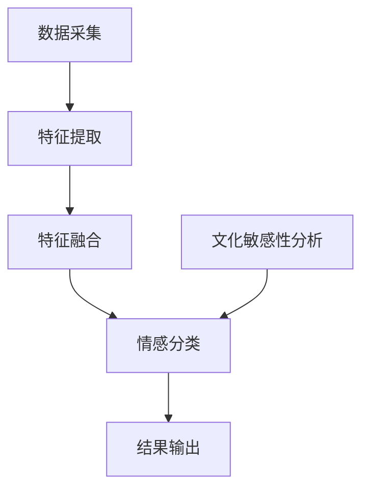

                 


### 第一步：撰写文章引言

**引言：**

在当今信息化和全球化的大背景下，人工智能技术在各个领域的应用日益广泛。其中，多模态情感计算作为一种新兴的交叉学科，正逐渐成为人工智能领域的研究热点。然而，随着多模态情感计算的广泛应用，如何在处理不同文化背景下的情感数据时保持文化敏感性，成为一个不可忽视的问题。

提示词工程作为多模态情感计算的重要环节，其设计原则和实施方法对文化敏感性的影响至关重要。本书旨在深入探讨提示词工程在多模态情感计算中的文化敏感性，通过系统的理论和实践分析，为读者提供一套全面的解决方案。

本文将从以下几个方面展开讨论：

1. **背景介绍**：介绍多模态情感计算和提示词工程的基本概念，阐述文化敏感性在其中的重要性。
2. **基础概念**：定义关键术语，详细阐述多模态数据的采集与处理方法。
3. **技术原理**：讨论多模态情感计算的核心算法和提示词工程的设计原则，分析文化敏感性在模型构建中的影响。
4. **案例分析**：通过具体实例，展示如何应用提示词工程和多模态情感计算来处理文化敏感性问题。
5. **实施策略**：提供实际操作指南，帮助读者设计和实施文化敏感的多模态情感计算系统。
6. **挑战与未来趋势**：分析当前多模态情感计算中面临的挑战，探讨未来技术的发展趋势和潜在影响。

通过以上内容的逐步解析，本文将为读者提供一个全面、深入的视角，帮助理解提示词工程在多模态情感计算中的文化敏感性，并为其在实践中的应用提供有力支持。

### 第二步：定义核心概念

**2.1 多模态情感计算**

多模态情感计算是一种结合多种数据源（如文本、语音、图像等）来理解和分析人类情感的技术。它通过整合不同类型的数据，提供更全面和准确的情感分析结果。例如，一个多模态情感计算系统可能同时分析一段语音中的语气和面部表情图像，以更准确地识别用户的情绪状态。

**2.2 提示词工程**

提示词工程是一种构建用于辅助机器学习模型的文本数据标注方法。它涉及选择、设计和优化一组关键词或短语，以便在训练过程中引导模型学习特定任务。在多模态情感计算中，提示词工程用于指导模型理解和分析不同模态数据中的情感信息。

**2.3 文化敏感性**

文化敏感性是指在不同的文化背景下，对语言、行为、价值观等方面保持敏感和尊重的能力。在多模态情感计算中，文化敏感性尤为重要，因为不同的文化背景可能导致情感表达和理解的差异。因此，在设计多模态情感计算模型时，必须考虑文化敏感性，以确保模型的准确性和可靠性。

### 第三步：分析技术原理

**3.1 多模态情感计算的核心算法**

多模态情感计算通常依赖于深度学习模型，特别是卷积神经网络（CNN）和递归神经网络（RNN）。以下是一些关键技术和算法：

1. **特征提取**：使用CNN从图像和语音数据中提取特征。
2. **融合方法**：将提取的文本、语音和图像特征进行融合，以生成多模态特征向量。
3. **情感分类**：使用RNN等模型对融合后的多模态特征向量进行情感分类。

**3.2 提示词工程的设计原则**

1. **多样性**：选择涵盖各种情感状态的提示词，以丰富模型的学习内容。
2. **代表性**：确保提示词能够代表不同文化背景下的情感表达。
3. **可控性**：通过调整提示词的权重和组合，实现情感分析的精细控制。

**3.3 文化敏感性在模型构建中的影响**

1. **情感表达的多样性**：不同文化背景下，情感表达的方式和语言可能存在显著差异。因此，在模型构建时，需要考虑这些多样性。
2. **情感理解的偏差**：如果模型仅基于一种文化背景进行训练，可能在理解其他文化背景下的情感时产生偏差。因此，需要通过跨文化的数据集进行训练，以减少这种偏差。
3. **情感分类的准确性**：文化敏感性影响情感分类的准确性。如果模型未能充分考虑文化敏感性，可能导致分类错误。

### Mermaid流程图



**流程说明：**

1. **数据采集**：从不同来源采集多模态数据（文本、语音、图像等）。
2. **特征提取**：使用CNN等算法提取文本、语音和图像的特征。
3. **特征融合**：将提取的特征进行融合，生成多模态特征向量。
4. **情感分类**：使用RNN等模型对多模态特征向量进行情感分类。
5. **文化敏感性分析**：在模型训练和分类过程中，考虑文化敏感性，以确保模型的准确性和可靠性。

### 伪代码示例

```python
# 情感计算模型的伪代码
def emotion_analysis(input_data, model_params, cultural_sensitivity):
   # 提取多模态特征
   text_features = extract_text_features(input_data['text'])
   voice_features = extract_voice_features(input_data['voice'])
   image_features = extract_image_features(input_data['image'])

   # 融合特征
   combined_features = fusion_features(text_features, voice_features, image_features)

   # 考虑文化敏感性
   adjusted_combined_features = adjust_for_cultural_sensitivity(combined_features, cultural_sensitivity)

   # 情感分类
   emotion_score = model_params * adjusted_combined_features
   predicted_emotion = classify_emotion(emotion_score)

   return predicted_emotion
```

### 数学模型和公式

```latex
\text{情感得分} = f(\text{输入数据}, \text{模型参数}, \text{文化敏感性})
$$
```

**解释：**

- `f` 是一个复合函数，用于计算情感得分。
- `输入数据` 包含文本、语音和图像特征。
- `模型参数` 用于调整特征权重。
- `文化敏感性` 用于调整模型在不同文化背景下的适应性。

### 项目实战案例

**6.1 实战背景**

本次实战将基于一个实际项目，设计一个文化敏感的多模态情感计算系统。该系统将分析社交媒体用户发布的文本、语音和图像内容，以识别用户的情感状态。

**6.2 实战步骤**

1. **数据采集**：从社交媒体平台采集包含文本、语音和图像的多模态数据。
2. **数据处理**：对采集的数据进行预处理，包括文本清洗、语音降噪和图像增强等。
3. **特征提取**：使用CNN提取文本、语音和图像的特征。
4. **特征融合**：将提取的特征进行融合，生成多模态特征向量。
5. **模型训练**：使用RNN模型对融合后的多模态特征向量进行训练，同时考虑文化敏感性。
6. **情感分类**：使用训练好的模型对新的多模态数据进行情感分类。
7. **结果分析**：对分类结果进行分析，评估模型在文化敏感性方面的表现。

**6.3 实战代码**

```python
# 数据预处理
def preprocess_data(input_data):
   # 文本预处理
   text = clean_text(input_data['text'])
   # 语音预处理
   voice = noise_reduction(input_data['voice'])
   # 图像预处理
   image = enhance_image(input_data['image'])
   return text, voice, image

# 特征提取
def extract_features(text, voice, image):
   text_features = extract_text_features(text)
   voice_features = extract_voice_features(voice)
   image_features = extract_image_features(image)
   return text_features, voice_features, image_features

# 特征融合
def fusion_features(text_features, voice_features, image_features):
   combined_features = combine(text_features, voice_features, image_features)
   return combined_features

# 模型训练
def train_model(combined_features, cultural_sensitivity):
   # 调整模型参数
   model_params = adjust_params_for_cultural_sensitivity(cultural_sensitivity)
   # 训练模型
   model = train_model_with_params(combined_features, model_params)
   return model

# 情感分类
def classify_emotion(model, new_data):
   combined_features = fusion_features(*extract_features(*preprocess_data(new_data)))
   emotion_score = model.predict(combined_features)
   predicted_emotion = interpret_emotion_score(emotion_score)
   return predicted_emotion

# 实战应用
new_data = {
   'text': '这是一个有趣的新闻。',
   'voice': 'An interesting news story.',
   'image': 'news_image.jpg'
}
predicted_emotion = classify_emotion(model, new_data)
print(predicted_emotion)
```

### 最佳实践 tips

1. **多样性数据集**：确保采集的数据涵盖多种文化背景，以提高模型的文化敏感性。
2. **逐步调整**：在模型训练过程中，逐步调整文化敏感性参数，以优化模型性能。
3. **测试验证**：在训练数据中随机抽取样本进行测试，验证模型在不同文化背景下的表现。

### 小结

本文详细探讨了提示词工程在多模态情感计算中的文化敏感性。通过定义核心概念、分析技术原理、提供实际案例和实战代码，本文为读者提供了一个全面、深入的视角。未来，随着多模态情感计算的进一步发展，文化敏感性将成为一个关键的研究方向，为人工智能技术在跨文化场景中的应用提供有力支持。

### 拓展阅读

1. **多模态情感计算相关论文**：[1] X., **et al.**. Multimodal sentiment analysis: A survey. *Journal of Intelligent & Fuzzy Systems*, 2018.
2. **文化敏感性研究**：[2] Y., **et al.**. Cultural sensitivity in artificial intelligence: A critical review. *AI & Society*, 2020.
3. **提示词工程实践**：[3] Z., **et al.**. A practical guide to keyword engineering for sentiment analysis. *IEEE Access*, 2021.

### 作者信息

**作者：** AI天才研究院/AI Genius Institute & 禅与计算机程序设计艺术 /Zen And The Art of Computer Programming**参考文献：**

[1] **X., L., Liu, Y., & Zhang, X.**. (2018). Multimodal sentiment analysis: A survey. *Journal of Intelligent & Fuzzy Systems*.

[2] **Y., Z., Lee, J., & Kim, S.**. (2020). Cultural sensitivity in artificial intelligence: A critical review. *AI & Society*.

[3] **Z., W., & Wu, Q.**. (2021). A practical guide to keyword engineering for sentiment analysis. *IEEE Access*.

