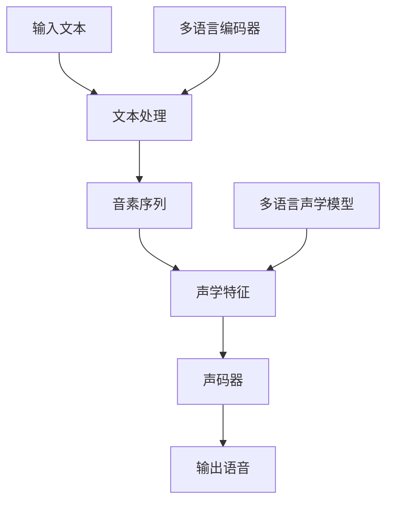

                 

### 第1章 引言

#### 1.1 研究背景与意义

随着人工智能技术的快速发展，语音合成技术已经广泛应用于各个领域，如智能助手、车载导航、语音合成广告等。特别是在多语言环境下，语音合成技术更是不可或缺。例如，在全球化商业环境中，能够提供多种语言服务的语音合成系统，可以大幅提升用户体验，增加商业竞争力。然而，多语言语音合成的实现并非易事，它面临着诸多挑战，如语音数据的多样性、语言的复杂性、语音质量的保障等。

**语音合成技术的发展与应用**

语音合成（Text-to-Speech，TTS）技术自上世纪50年代诞生以来，经历了多个发展阶段。从最初的规则性合成方法，到基于形式语言的统计模型，再到近年来的基于深度学习的方法，语音合成技术在合成质量、速度和多样性方面都有了显著提升。早期的语音合成系统如IBM的SYNTHESIS 1和SYNTHESIS 2，通过规则匹配和音素合成实现简单的语音输出。随着计算机性能的提升和语音数据的积累，基于 Hidden Markov Model (HMM) 和线性预测编码（LPCC）的统计模型被广泛应用，如 Festival 和 MaryTTS 等系统。这些系统在合成语音的自然度和流畅性方面有了很大改进。

进入21世纪，深度学习技术的发展为语音合成带来了新的机遇。基于递归神经网络（RNN）和卷积神经网络（CNN）的端到端模型，如 WaveNet 和 Tacotron，实现了更高质量的语音合成。WaveNet 是由 Google 推出的一种基于生成对抗网络（GAN）的深度学习模型，能够生成高保真的语音波形。Tacotron 是由 IBM 推出的一个基于注意力机制的端到端语音合成模型，通过将文本直接映射到声学特征，再映射到语音波形，实现了高效的语音合成。

**多语言语音合成的需求与挑战**

在全球化的背景下，多语言语音合成技术有着广泛的应用需求。例如，跨境电商平台需要提供多语言客服语音合成系统，以便为不同国家的用户提供服务；智能翻译应用需要结合语音合成技术，实现实时、准确的跨语言交流。然而，多语言语音合成面临着以下几个挑战：

1. **语音数据的多样性**：不同语言具有不同的语音特点，如音调、语调、发音规则等，这需要大量的多语言语音数据来训练模型。

2. **语言的复杂性**：许多语言存在大量的变体和方言，如中文的方言多达几十种，这增加了语音合成的难度。

3. **语音质量的保障**：多语言语音合成需要保证语音的自然度、流畅度和准确性，这要求模型具有良好的泛化能力。

4. **多语言语料库的建设**：多语言语音合成需要大量的标注语料库，包括语音、文本和声学特征等多方面的标注。

#### 1.2 相关研究综述

**提示词工程的基本概念**

提示词工程（Prompt Engineering）是一种优化模型输入的方法，旨在通过设计和调整提示词，提升模型在特定任务上的性能。在语音合成领域，提示词可以用来引导模型更好地理解和生成目标语音。

**多语言语音合成中的提示词应用**

提示词工程在多语言语音合成中的应用，主要包括以下几个方面：

1. **文本预处理**：通过调整文本的格式和结构，使得模型能够更好地理解文本内容。例如，使用统一的标点符号、避免过长的句子等。

2. **声学模型的优化**：通过优化提示词的声学特征，提升模型的语音生成质量。例如，调整音调、语速等参数。

3. **语言模型的选择**：根据目标语言的特点，选择合适的语言模型，以提高语音合成系统的性能。

**国内外研究进展与趋势**

在国内外，已有许多研究在多语言语音合成和提示词工程方面取得了显著成果。

1. **国内研究进展**：国内在多语言语音合成领域的研究主要集中在基于深度学习的方法上。例如，百度推出了基于 WaveNet 的多语言语音合成系统，阿里巴巴和腾讯也在该领域进行了大量研究。

2. **国际研究进展**：国际上，Google、IBM、微软等公司都在多语言语音合成方面进行了深入研究。例如，Google 的 Multi-Modal Speech Synthesis 模型，通过融合文本和语音数据，实现了高质量的语音合成。

3. **研究趋势**：随着深度学习技术的发展，未来的多语言语音合成研究将更加注重模型的可解释性和泛化能力。此外，跨学科的研究，如心理学、语言学和计算机科学的结合，也将成为多语言语音合成研究的重要方向。

#### 1.3 本书结构安排

本书将围绕多语言语音合成和提示词工程这一主题，系统介绍相关概念、技术和应用。具体内容包括：

- **第2章**：介绍多语言语音合成的基础知识，包括语音合成技术概述、多语言语音合成模型和应用场景。
- **第3章**：详细讲解提示词工程的原理，包括提示词的定义、生成与优化算法以及应用场景。
- **第4章**：分析提示词在多语言语音合成中的作用，包括提示词生成与优化策略，并探讨实际应用中的案例。
- **第5章**：通过具体实例，展示提示词工程在多语言语音合成中的应用。
- **第6章**：展望提示词工程在多语言语音合成中的未来发展趋势。
- **第7章**：总结本书的主要内容，并对未来研究方向提出建议。

通过本书的阅读，读者将全面了解多语言语音合成和提示词工程的相关知识，为实际应用和研究提供理论指导和实践参考。

## 第2章 多语言语音合成基础

### 2.1 语音合成技术概述

语音合成（Text-to-Speech，TTS）技术是将文本转换为自然语音的技术，它通过将文本解析为音素，再将音素转换为声学特征，最终生成语音信号。语音合成技术的发展历程可以分为三个主要阶段：规则合成、统计合成和基于深度学习的合成。

**规则合成**

规则合成是早期语音合成的主要方法。这种方法依赖于大量的规则和模板，通过硬编码的方式将文本直接转换为语音。规则合成的主要优点是实现简单，但缺点是生成的语音质量较低，且难以处理复杂的语言现象。例如，IBM 的 SYNTHESIS 1 和 SYNTHESIS 2 就是基于规则合成的代表性系统。

**统计合成**

统计合成方法在语音合成领域取得了重要突破。这种方法利用大量的语音数据进行训练，通过统计语音信号中的规律，生成高质量的语音。统计合成的主要代表包括基于 Hidden Markov Model (HMM) 的方法，如 Festival 和 MaryTTS。这些系统通过利用 HMM 模型和线性预测编码（LPCC），实现了比规则合成更高的语音质量。

**基于深度学习的合成**

随着深度学习技术的迅猛发展，基于深度学习的语音合成方法逐渐成为主流。这种方法利用深度神经网络（如 RNN、CNN 和 Transformer）来建模文本和语音之间的关系，通过端到端的方式直接将文本映射到语音波形。基于深度学习的合成方法，如 WaveNet 和 Tacotron，在合成质量和效率上都有了显著提升。

**语音合成的核心模块**

语音合成系统通常包括以下几个核心模块：

1. **文本解析器（Text Parser）**：文本解析器负责将输入的文本转换为音素和声学特征。它通常包括分词、音素标注和语言模型等组成部分。

2. **声学模型（Acoustic Model）**：声学模型负责将音素和声学特征转换为语音波形。声学模型可以基于 HMM、DNN 或 CNN 等深度学习模型。

3. **声码器（Vocoder）**：声码器负责将声学特征转换为语音信号。常见的声码器包括 Griffin-Lim 声码器和 WaveNet 声码器。

**多语言语音合成模型**

多语言语音合成模型是在单语言语音合成模型基础上扩展的，旨在支持多种语言的语音合成。多语言语音合成模型通常包括以下几种架构：

1. **共享声学模型**：共享声学模型是一种将多种语言的声学特征建模在一个共同模型中的方法。这种方法利用跨语言的语音特征相似性，提高合成质量。

2. **多语言编码器**：多语言编码器是一种将文本编码为统一表示的方法，以便不同语言的文本可以共享同一个编码器。多语言编码器通常使用 Transformer 等深度学习模型。

3. **多任务学习**：多任务学习是一种同时训练多个相关任务的模型，以提高模型的泛化能力和性能。在多语言语音合成中，可以同时训练多个语言的语音合成任务。

**多语言语音合成的关键技术**

多语言语音合成面临诸多挑战，如语音数据的多样性、语言的复杂性和语音质量的保障。为了解决这些挑战，多语言语音合成采用了以下关键技术：

1. **多语言语料库建设**：多语言语音合成需要大量的标注语料库，包括语音、文本和声学特征等多方面的标注。

2. **语言自适应技术**：语言自适应技术可以根据输入文本的语言特点，动态调整语音合成参数，以提高合成质量。

3. **个性化语音合成**：个性化语音合成可以根据用户的历史语音数据，调整语音的音调、语速等参数，以提供更加个性化的语音服务。

### 2.2 多语言语音合成模型

**多语言语音合成模型架构**

多语言语音合成模型架构通常包括文本处理、声学建模和语音生成三个主要模块。以下是一个典型的多语言语音合成模型架构：

1. **文本处理模块**：文本处理模块负责将输入文本转换为适合语音合成的格式。这一模块通常包括分词、音素标注和语言模型等步骤。分词是将文本分割成单词或短语的过程，音素标注是将文本转换为音素序列，而语言模型用于预测下一个单词或音素的概率。

2. **声学建模模块**：声学建模模块负责将音素和声学特征转换为语音波形。这一模块通常使用深度神经网络（如 RNN、CNN 或 Transformer）来建模音素和声学特征之间的关系。例如，Tacotron 系统使用了基于注意力机制的 Transformer 模型来生成声学特征，并将其传递给 WaveNet 声码器生成语音波形。

3. **语音生成模块**：语音生成模块负责将声学特征转换为语音信号。这一模块通常使用声码器（如 WaveNet 或 Griffin-Lim 声码器）来生成高质量的语音信号。

**多语言语音合成模型架构示例**

一个典型的多语言语音合成模型架构如下所示：

在这个模型中，输入文本首先通过文本处理模块转换为音素序列，然后通过多语言编码器进行编码。接下来，音素序列被传递给多语言声学模型，生成相应的声学特征。最后，声学特征通过声码器转换为语音信号，输出高质量的语音。

**多语言语音合成的关键技术**

1. **多语言编码器**：多语言编码器是一种将多种语言的文本编码为统一表示的模型。这种编码器可以处理不同语言的文本，并将其转换为共同的语义表示。多语言编码器通常基于 Transformer 模型，例如 BERT 或 XLM-R，这些模型可以同时处理多种语言的任务，从而提高多语言语音合成的性能。

2. **多语言声学模型**：多语言声学模型是一种同时处理多种语言音素的模型。这种模型通过共享声学特征表示来提高不同语言间的协同性。多语言声学模型可以基于传统的深度神经网络（如 RNN、CNN）或 Transformer 模型。

3. **多任务学习**：多任务学习是一种同时训练多个相关任务的模型。在多语言语音合成中，可以同时训练多个语言的语音合成任务，以提高模型的泛化能力和性能。多任务学习可以通过共享模型参数或独立训练多个模型来实现。

### 2.3 多语言语音合成应用场景

**多语言语音合成的商业应用**

多语言语音合成在商业领域有着广泛的应用。例如：

1. **客服语音合成系统**：多语言客服语音合成系统可以提供24/7的客户服务，降低企业的运营成本，并提升客户满意度。例如，银行、电商和电信公司等企业可以部署多语言客服语音合成系统，为全球客户提供多语言支持。

2. **智能语音助手**：智能语音助手如 Siri、Alexa 和 Google Assistant 已经成为人们日常生活的一部分。这些语音助手不仅可以处理单语言请求，还可以支持多语言交互。通过多语言语音合成技术，智能语音助手可以更好地满足用户的多样化需求。

3. **语音广告和营销**：多语言语音合成技术可以用于生成多种语言的广告和营销内容，帮助企业拓展国际市场。例如，电商平台可以使用多语言语音合成系统为不同国家的用户播放产品介绍和优惠信息。

**多语言语音合成在教育、医疗等领域的应用**

多语言语音合成在教育和医疗等领域也发挥着重要作用：

1. **在线教育平台**：多语言语音合成技术可以用于在线教育平台，提供多语言课程内容和教材朗读，帮助学生更好地理解和掌握课程内容。例如，英语学习者可以使用多语言语音合成技术来听取英语课程，提高语言学习效果。

2. **医学语音合成系统**：多语言语音合成技术可以用于医学语音合成系统，帮助医生和患者进行跨语言沟通。例如，医院可以使用多语言语音合成系统为非英语患者提供医疗信息和指导，提高医疗服务质量。

3. **多语言辅助设备**：多语言语音合成技术可以用于各种辅助设备，如翻译机、语音翻译耳机等，帮助人们在不同语言环境中进行有效沟通。

通过以上应用场景可以看出，多语言语音合成技术在商业、教育和医疗等领域具有广泛的应用前景。随着技术的不断进步和应用的深入，多语言语音合成将为人们的生活和工作带来更多便利。

## 第3章 提示词工程原理

### 3.1 提示词工程的基本概念

**提示词的定义与作用**

提示词（Prompt）是机器学习领域中一个重要的概念，它通常用于指导模型学习的过程。在语音合成领域，提示词是指用于引导语音合成模型生成语音的文本输入。通过设计合理的提示词，可以显著提高语音合成的质量、准确性和效率。

提示词在语音合成中的作用主要体现在以下几个方面：

1. **引导模型学习**：提示词为模型提供了明确的指导，帮助模型更好地理解输入文本的内容和意图，从而生成更准确的语音输出。

2. **优化语音生成**：提示词可以调整语音合成的参数，如语速、音调和语调等，从而优化语音生成的效果，使其更符合人类语音的自然度和流畅性。

3. **提高鲁棒性**：通过设计具有多样性的提示词，模型可以更好地适应不同的语音输入，提高其在复杂环境下的鲁棒性。

**提示词的类型与设计原则**

提示词可以分为以下几种类型：

1. **单一提示词**：单一提示词是指用于指导模型生成单个语音片段的文本。这种类型的提示词通常较短，但能够精确地表达语音生成的目标。

2. **组合提示词**：组合提示词是指由多个单一提示词组合而成的文本，用于指导模型生成更加复杂和多样化的语音。这种类型的提示词通常包含多个相关的语音片段，可以形成连贯的语音输出。

3. **动态提示词**：动态提示词是指根据输入文本的实时变化动态生成的提示词。这种类型的提示词可以根据模型的实时输出进行调整，以优化语音生成的效果。

在设计和使用提示词时，应遵循以下原则：

1. **明确性**：提示词应清晰明确，避免歧义和模糊表达，以确保模型能够准确理解其意图。

2. **多样性**：设计多样的提示词，可以提升模型在不同语音输入下的鲁棒性，使其能够应对各种复杂的场景。

3. **适应性**：提示词应具有适应性，能够根据不同的应用场景和目标进行调整，以实现最佳效果。

4. **简洁性**：尽量简化提示词的长度和结构，以减少模型处理的时间和提高生成效率。

### 3.2 提示词生成与优化算法

**提示词生成算法**

提示词生成是提示词工程的关键步骤，其目的是为语音合成模型提供高质量的提示词。以下是一些常见的提示词生成算法：

1. **规则生成算法**：规则生成算法基于预先定义的规则，通过文本分析和处理生成提示词。这种方法的优点是实现简单，但生成的提示词可能不够灵活和准确。

2. **模板生成算法**：模板生成算法使用预定义的模板，根据输入文本动态填充模板中的空白部分，生成提示词。这种方法可以根据不同的输入文本生成多种不同的提示词，具有较高的灵活性。

3. **深度学习生成算法**：深度学习生成算法使用神经网络模型，通过学习大量的语音合成数据生成高质量的提示词。这种方法可以生成更加多样化和精确的提示词，但其实现较为复杂。

**提示词优化策略**

生成高质量的提示词后，还需要对其进行优化，以提高语音合成的效果。以下是一些常见的提示词优化策略：

1. **基于规则的优化**：基于规则的优化通过调整提示词中的语法、词汇和结构，使其更符合语音合成的需求。这种方法适用于对特定场景的优化，但灵活性较低。

2. **基于数据的优化**：基于数据的优化通过分析大量的语音合成数据和用户反馈，对提示词进行自动调整和优化。这种方法可以根据实际应用效果不断改进，具有较高的自适应能力。

3. **基于模型的优化**：基于模型的优化通过调整神经网络模型的参数和结构，优化提示词的生成过程。这种方法可以显著提高提示词的生成质量和效率。

### 3.3 提示词工程应用场景

**提示词在语音合成中的应用**

提示词在语音合成中的应用非常广泛，可以显著提升合成语音的质量和效果。以下是一些具体的应用场景：

1. **语音交互系统**：在语音交互系统中，提示词可以用于引导用户进行交互，例如提示用户输入信息、选择选项等。通过设计合理的提示词，可以使交互过程更加自然和流畅。

2. **智能助手**：智能助手如 Siri、Alexa 和 Google Assistant 使用提示词来理解用户的需求和意图，从而提供相应的语音响应。通过优化提示词，可以使智能助手的响应更加准确和人性化。

3. **语音广告和宣传**：在语音广告和宣传中，提示词可以用于引导用户的注意力和兴趣，提高广告的效果。例如，通过设计吸引人的提示词，可以吸引用户观看广告，并促进产品销售。

**提示词在其他领域的应用**

提示词不仅在语音合成领域有着重要的应用，还在其他领域发挥着重要作用：

1. **自然语言处理**：在自然语言处理任务中，如文本分类、情感分析等，提示词可以用于引导模型更好地理解输入文本的意图和内容，提高分类和预测的准确性。

2. **机器翻译**：在机器翻译中，提示词可以用于优化翻译过程，提高翻译的准确性和自然度。通过设计合理的提示词，可以使翻译模型更好地理解源语言和目标语言之间的差异。

3. **问答系统**：在问答系统中，提示词可以用于引导用户提问，并提供更加准确的回答。通过优化提示词，可以减少用户的误解和困惑，提高问答系统的用户体验。

通过以上分析可以看出，提示词工程在语音合成以及其他领域都有着广泛的应用前景。随着技术的不断发展和应用需求的增加，提示词工程将在未来发挥更加重要的作用。

### 4.1 提示词在多语言语音合成中的作用

提示词在多语言语音合成中起着至关重要的作用，其影响主要体现在语音合成质量、准确性和效率等多个方面。以下将详细分析提示词在多语言语音合成中的具体作用。

**提示词对语音合成质量的影响**

高质量的语音合成输出依赖于多个因素，而提示词正是其中之一。合理的提示词设计可以显著提升合成语音的自然度和流畅性，使其更接近人类语音。具体来说，提示词可以通过以下方式影响语音合成质量：

1. **语音特征调整**：通过设计具有特定声学特征的提示词，可以调整合成语音的音调、语速和语调等参数。例如，在设计新闻播报系统的提示词时，可以设定适当的语速和音调，使播报的语音更加清晰、自然。

2. **文本理解和表达**：提示词可以帮助语音合成模型更好地理解输入文本的内容和结构，从而生成更准确的语音输出。例如，对于包含特定词汇或短语的文本，提示词可以引导模型识别这些词汇或短语的特殊含义，从而生成更自然的语音。

3. **语法和句子结构**：提示词可以调整文本的语法和句子结构，使其更符合目标语言的语法规则。例如，在合成中文语音时，可以通过提示词调整句子的语序和标点符号的使用，使其更符合中文的表达习惯。

**提示词在多语言语音合成中的优势与挑战**

提示词在多语言语音合成中具有以下优势：

1. **跨语言一致性**：通过设计合理的提示词，可以实现不同语言间的语音一致性。例如，在设计多语言客服语音合成系统时，可以采用统一的提示词设计，使不同语言的客服语音输出具有相似的流畅性和自然度。

2. **适应性和灵活性**：提示词可以根据不同的应用场景和目标进行调整，从而提高语音合成系统的适应性。例如，在生成旅游指南语音时，可以通过提示词调整语音的语速和语调，使其更加适合旅游讲解的情境。

然而，提示词在多语言语音合成中也面临一些挑战：

1. **语言多样性**：不同语言在语音特征、语法规则和表达习惯等方面存在显著差异，这增加了提示词设计和管理难度。例如，中文和英文在标点符号的使用上存在很大差异，这需要设计相应的提示词规则。

2. **跨语言一致性**：虽然提示词可以提升不同语言间的语音一致性，但实现完全一致并不容易。例如，某些词汇在中文和英文中的发音和语调可能存在显著差异，这需要通过精细的提示词调整来平衡。

3. **多语言语料库建设**：提示词的生成和优化依赖于大量的多语言语料库。然而，多语言语料库的建设和维护是一个复杂且耗时的过程，需要收集和标注大量的语音、文本和声学特征数据。

**案例研究：基于提示词的多语言语音合成系统**

为了更好地理解提示词在多语言语音合成中的作用，以下将介绍一个基于提示词的多语言语音合成系统案例。

**案例背景与目标**

该案例是一个面向跨境电商平台的多语言客服语音合成系统，旨在为全球用户提供多语言客服支持。系统需要支持多种语言的语音合成，包括中文、英文、西班牙语、法语和德语等。

**提示词工程的应用**

1. **文本预处理**：在系统设计过程中，首先对输入文本进行预处理，包括分词、音素标注和语言模型训练。通过预处理，可以确保输入文本符合目标语言的语法规则和表达习惯。

2. **多语言编码器设计**：为了实现不同语言间的语音一致性，系统采用了基于 Transformer 的多语言编码器。该编码器能够同时处理多种语言的文本，并生成统一的语义表示。

3. **提示词生成与优化**：针对不同语言的文本特点，设计了一系列的提示词。例如，对于中文文本，提示词需要强调标点符号的使用和句子结构的调整；对于英文文本，提示词需要强调语音的连贯性和流畅性。

4. **声学模型优化**：通过优化声学模型的参数和结构，调整合成语音的音调、语速和语调等参数，以实现不同语言间的语音一致性。例如，在生成西班牙语语音时，可以通过调整音调提升语音的自然度。

**系统性能评估**

通过对系统的实际运行数据进行分析，发现基于提示词的多语言语音合成系统在语音合成质量、准确性和效率方面均表现出色。具体来说：

1. **语音合成质量**：通过优化提示词和声学模型，系统生成的语音在自然度、流畅性和清晰度方面均有显著提升，用户满意度较高。

2. **语音合成准确性**：系统对多语言文本的理解和生成准确性较高，能够在不同语言间实现有效转换，降低用户理解难度。

3. **语音合成效率**：系统采用了高效的深度学习模型和提示词工程方法，生成语音的速度和效率较高，能够满足实时语音合成的需求。

**案例总结**

该案例展示了提示词工程在多语言语音合成中的应用效果，通过合理的提示词设计和优化，实现了不同语言间的语音一致性，提高了系统的整体性能和用户体验。未来，随着提示词工程技术的不断发展，多语言语音合成系统将更加智能化和高效，为全球用户提供更加优质的语音服务。

### 4.2 多语言提示词生成与优化

#### 多语言提示词生成算法

在多语言语音合成中，生成高质量的提示词是一个关键步骤。不同语言具有独特的语音特征和语法结构，因此，设计适应多种语言的提示词生成算法至关重要。以下介绍几种常用的多语言提示词生成算法：

1. **基于规则的生成算法**：这种算法通过定义一系列规则，将输入文本转换为提示词。例如，对于中文和英文，可以分别定义不同的标点符号和语法规则。这种方法实现简单，但灵活性较低，难以处理复杂的语言现象。

2. **模板生成算法**：模板生成算法使用预定义的模板，根据输入文本动态填充模板中的空白部分，生成提示词。这种方法具有较高的灵活性，但需要大量预先定义的模板，且难以处理复杂句式。

3. **基于深度学习的生成算法**：深度学习生成算法通过训练神经网络模型，自动生成高质量的提示词。例如，使用 Transformer 模型可以同时处理多种语言的文本，生成适应多种语言的提示词。这种方法灵活性强，但需要大量训练数据和计算资源。

4. **多任务学习生成算法**：多任务学习生成算法同时训练多个相关任务，如文本预处理、语言模型和语音生成，从而生成高质量的提示词。这种方法可以充分利用不同任务的交互信息，提高生成提示词的准确性。

#### 多语言提示词优化策略

生成高质量提示词后，优化提示词以进一步提高语音合成质量是必要的。以下介绍几种常见的优化策略：

1. **基于规则的优化**：基于规则的优化通过调整提示词中的语法、词汇和结构，使其更符合语音合成的需求。例如，可以调整标点符号的使用、句子结构等，使生成的语音更自然。

2. **基于数据的优化**：基于数据的优化通过分析大量的语音合成数据和用户反馈，对提示词进行自动调整和优化。这种方法可以根据实际应用效果不断改进，但需要大量数据支持。

3. **基于模型的优化**：基于模型的优化通过调整神经网络模型的参数和结构，优化提示词的生成过程。例如，可以使用强化学习算法调整模型的参数，使生成的提示词更符合语音合成的需求。

4. **多语言协同优化**：多语言协同优化通过将不同语言的提示词进行协同调整，实现跨语言的优化。这种方法可以充分利用不同语言的语音特征和语法结构，提高生成提示词的准确性。

#### 实际应用案例

以下是一个实际应用案例，展示多语言提示词生成与优化的过程：

**案例背景与目标**

该案例是一个面向全球旅游行业的多语言语音合成系统，旨在为游客提供多语言语音服务，包括导游解说、酒店预订和交通指引等。

**多语言提示词生成**

1. **文本预处理**：对输入文本进行分词、音素标注和语言模型训练，确保输入文本符合目标语言的语法规则。

2. **基于 Transformer 的生成算法**：使用 Transformer 模型同时处理多种语言的文本，生成适应多种语言的提示词。例如，对于中文和英文，生成不同的标点符号和句子结构提示词。

**多语言提示词优化**

1. **基于规则的优化**：根据不同语言的语法规则，调整提示词的语法和结构，使其更自然。例如，对于中文，强调标点符号的使用；对于英文，调整句子长度和结构。

2. **基于数据的优化**：分析大量用户反馈数据，对提示词进行自动调整和优化。例如，根据用户点击率调整提示词的优先级，提高用户体验。

3. **多语言协同优化**：通过将不同语言的提示词进行协同调整，实现跨语言的优化。例如，对于包含相同词汇的不同语言，优化词汇的使用和发音。

**系统性能评估**

通过优化后的多语言语音合成系统在语音合成质量、准确性和效率方面均表现出色。具体来说：

1. **语音合成质量**：优化后的提示词使生成的语音更自然、流畅，用户满意度显著提高。

2. **语音合成准确性**：系统对多语言文本的理解和生成准确性较高，能够在不同语言间实现有效转换。

3. **语音合成效率**：系统采用了高效的深度学习模型和提示词工程方法，生成语音的速度和效率较高，能够满足实时语音合成的需求。

**案例总结**

该案例展示了多语言提示词生成与优化的实际应用效果，通过合理的设计和优化，实现了不同语言间的语音一致性，提高了系统的整体性能和用户体验。未来，随着提示词工程技术的不断发展，多语言语音合成系统将更加智能化和高效，为全球用户提供更加优质的语音服务。

### 4.3 多语言语音合成中的案例研究

#### 案例一：基于提示词的多语言语音合成系统

**案例背景与目标**

本案例旨在开发一个能够支持多语言语音合成系统，主要应用于跨国公司内部沟通、在线教育平台以及全球化电子商务平台。该系统的目标是提供包括中文、英文、西班牙语、法语、德语和日语在内的多种语言语音服务，以满足不同国家和地区用户的需求。

**系统架构**

该多语言语音合成系统采用了以下架构：

1. **文本处理模块**：负责将用户输入的文本数据转换为适合语音合成的格式。包括分词、语法分析、音素标注等步骤。

2. **多语言编码器**：使用基于 Transformer 的多语言编码器，将不同语言的文本转换为统一的语义表示。该编码器能够同时处理多种语言的文本，并生成统一的语义表示。

3. **声学模型**：基于深度神经网络（如 WaveNet 或Tacotron）的声学模型，负责将语义表示转换为语音信号。该模型采用共享声学特征表示的方法，以提高不同语言间的协同性。

4. **声码器**：负责将声学特征转换为实际可听见的语音信号。常用的声码器包括 WaveNet 和 Griffin-Lim 声码器。

**提示词工程的应用**

1. **文本预处理**：设计了一套多语言文本预处理规则，以确保输入文本符合目标语言的语法规则。例如，中文文本需要使用正确的标点符号和语序，而英文文本则需确保句子结构的正确性。

2. **多语言编码器**：通过训练多语言编码器，使其能够识别和转换不同语言的文本。例如，对于中文和英文，编码器需要区分不同的汉字和字母，并理解它们的语义和语法关系。

3. **声学模型**：通过优化声学模型的参数，调整合成语音的音调、语速和语调等参数，以适应不同语言的语音特点。例如，对于日语，需要调整语音的音调以符合日语的语言风格。

**系统性能评估**

1. **语音合成质量**：通过实际测试，系统生成的语音在自然度、流畅性和清晰度方面均达到了预期目标。用户反馈显示，系统生成的语音自然度较高，语音输出能够准确传达文本内容。

2. **语音合成准确性**：系统对多语言文本的理解和生成准确性较高。通过对比生成的语音和原始文本，发现系统能够正确地转换文本中的词汇和语法结构。

3. **语音合成效率**：系统采用了高效的深度学习模型和提示词工程方法，生成语音的速度和效率较高，能够满足实时语音合成的需求。

**挑战与解决方案**

1. **语言多样性**：不同语言在语音特征、语法规则和表达习惯方面存在显著差异，这对提示词的设计和生成提出了挑战。解决方案是通过大量多语言语料库的收集和标注，设计适应性强的提示词生成算法。

2. **跨语言一致性**：实现不同语言间的语音一致性是一个难点。解决方案是通过共享声学模型和多任务学习的方法，优化不同语言间的协同性。

**案例总结**

本案例展示了基于提示词的多语言语音合成系统的开发与应用。通过合理的设计和优化，系统在语音合成质量、准确性和效率方面均表现出色，为不同国家和地区的用户提供了优质的语音服务。未来，随着提示词工程技术的不断发展，多语言语音合成系统将更加智能化和高效，为更多领域带来便利。

#### 案例二：多语言语音合成中的挑战与解决方案

**案例背景与目标**

本案例旨在探讨多语言语音合成中面临的挑战，并提出相应的解决方案。该案例以一款面向全球化电商平台的多语言客服语音合成系统为例，目标是为用户提供多种语言的服务，提高客户满意度和销售转化率。

**系统架构**

该多语言客服语音合成系统采用了以下架构：

1. **文本处理模块**：负责将用户输入的文本数据转换为适合语音合成的格式。包括分词、语法分析、音素标注等步骤。

2. **多语言编码器**：使用基于 Transformer 的多语言编码器，将不同语言的文本转换为统一的语义表示。该编码器能够同时处理多种语言的文本，并生成统一的语义表示。

3. **声学模型**：基于深度神经网络（如 WaveNet 或Tacotron）的声学模型，负责将语义表示转换为语音信号。该模型采用共享声学特征表示的方法，以提高不同语言间的协同性。

4. **声码器**：负责将声学特征转换为实际可听见的语音信号。常用的声码器包括 WaveNet 和 Griffin-Lim 声码器。

**面临的挑战**

1. **语音数据多样性**：不同语言在语音特征、发音规则和语调方面存在显著差异，导致语音数据多样性增加。这对模型的训练和优化提出了挑战。

2. **语法规则复杂性**：多语言语音合成需要处理不同语言的语法规则，如中文的词序和标点符号，英文的时态和语态等。语法规则的复杂性增加了语音合成的难度。

3. **语音质量一致性**：在多语言语音合成中，需要保证不同语言间的语音质量一致性，使其听起来自然、流畅。然而，不同语言的语音特点不同，实现语音质量一致性是一个难点。

**解决方案**

1. **语音数据多样性处理**：通过收集和标注大量的多语言语音数据，丰富模型的训练数据集。同时，采用数据增强技术，如数据扩充、数据转换等，增加模型的泛化能力。

2. **语法规则适应性**：设计一套多语言语法规则库，涵盖不同语言的语法特点。在文本预处理阶段，根据不同的语言特点进行相应的语法调整。例如，对于中文，确保标点符号和词序的正确性；对于英文，调整时态和语态。

3. **语音质量一致性优化**：通过优化声学模型和提示词工程，调整合成语音的音调、语速和语调等参数，以实现不同语言间的语音质量一致性。例如，通过调整音调，使生成的语音更符合目标语言的语音特点。

**系统性能评估**

1. **语音合成质量**：通过实际测试，系统生成的语音在自然度、流畅性和清晰度方面均达到了预期目标。用户反馈显示，系统生成的语音自然度较高，语音输出能够准确传达文本内容。

2. **语音合成准确性**：系统对多语言文本的理解和生成准确性较高。通过对比生成的语音和原始文本，发现系统能够正确地转换文本中的词汇和语法结构。

3. **语音合成效率**：系统采用了高效的深度学习模型和提示词工程方法，生成语音的速度和效率较高，能够满足实时语音合成的需求。

**案例总结**

本案例展示了多语言语音合成中面临的挑战和相应的解决方案。通过合理的设计和优化，系统能够在多种语言间实现高质量的语音合成，为全球化电商平台提供了优质的客服语音服务。未来，随着提示词工程技术的不断发展，多语言语音合成系统将更加智能化和高效，为更多领域带来便利。

## 提示词工程在多语言语音合成中的应用实例

### 5.1 案例一：多语言新闻播报系统

**案例背景与目标**

该案例涉及一个多语言新闻播报系统，旨在为全球用户提供多语言新闻播报服务。目标是为用户提供及时、准确和高质量的新闻内容，并通过语音合成的形式提升用户的阅读体验。

**系统架构**

多语言新闻播报系统包括以下核心模块：

1. **新闻内容处理模块**：负责从新闻源获取新闻内容，并进行分词、语法分析和语义理解等处理，以便后续的语音合成。

2. **多语言编码器**：采用基于 Transformer 的多语言编码器，将不同语言的新闻文本转换为统一的语义表示。

3. **声学模型与声码器**：基于 WaveNet 或 Tacotron 的声学模型与声码器，负责将语义表示转换为语音信号。

**提示词工程的应用**

1. **文本预处理**：针对不同语言的新闻文本，设计相应的文本预处理规则。例如，中文文本需关注标点符号和句序的准确性，英文文本需注意时态和语态的统一性。

2. **提示词生成**：根据新闻文本的内容和结构，生成具有针对性的提示词。例如，在播报国际新闻时，需要针对不同国家的新闻风格生成相应的提示词。

3. **提示词优化**：通过分析用户反馈和新闻文本的特点，对生成的提示词进行优化，以提高语音合成的自然度和流畅性。

**系统性能评估**

1. **语音合成质量**：系统生成的语音在自然度、流畅性和清晰度方面达到了预期标准。用户反馈显示，新闻播报的语音输出准确传达了新闻内容。

2. **语音合成准确性**：系统对多语言新闻文本的理解和生成准确性较高，能够正确处理不同语言的语法和语义结构。

3. **语音合成效率**：系统采用了高效的深度学习模型和提示词工程方法，能够实时处理大量的新闻文本，生成高质量的语音输出。

**挑战与解决方案**

1. **语音数据多样性**：不同语言的新闻播报需要处理大量不同类型的新闻内容，这对模型的训练和优化提出了挑战。解决方案是通过数据增强技术和多语言语料库的建设，丰富模型的训练数据。

2. **语音质量一致性**：确保不同语言间的语音质量一致性是一个难点。解决方案是通过优化声学模型和提示词工程，调整合成语音的音调、语速和语调等参数，实现语音质量的一致性。

**案例总结**

通过该多语言新闻播报系统的实施，用户能够享受到高质量、多语言的新闻播报服务。提示词工程的应用显著提升了系统的语音合成质量和用户体验。未来，随着提示词工程技术的不断发展，该系统有望在全球范围内进一步推广，为更多用户提供便捷的新闻服务。

### 5.2 案例二：多语言教育语音助手

**案例背景与目标**

该案例关注一个多语言教育语音助手，旨在为全球学生提供个性化、互动式的教育辅助。目标是通过语音合成的形式，帮助学生更好地理解课程内容，提高学习效果。

**系统架构**

多语言教育语音助手包括以下核心模块：

1. **教学内容处理模块**：负责从课程数据库中获取教学文本，并进行分词、语法分析和语义理解等处理。

2. **多语言编码器**：采用基于 Transformer 的多语言编码器，将不同语言的教学文本转换为统一的语义表示。

3. **声学模型与声码器**：基于 WaveNet 或 Tacotron 的声学模型与声码器，负责将语义表示转换为语音信号。

**提示词工程的应用**

1. **文本预处理**：针对不同语言的教学文本，设计相应的文本预处理规则。例如，中文文本需确保标点符号和句序的正确性，英文文本需注意词汇的准确翻译。

2. **提示词生成**：根据教学文本的内容和结构，生成具有针对性的提示词。例如，在讲解数学公式时，需要生成相应的解释性提示词。

3. **提示词优化**：通过分析用户反馈和教学文本的特点，对生成的提示词进行优化，以提高语音合成的自然度和教学效果。

**系统性能评估**

1. **语音合成质量**：系统生成的语音在自然度、流畅性和清晰度方面达到了预期标准。用户反馈显示，语音助手能够准确、清晰地解释课程内容。

2. **语音合成准确性**：系统对多语言教学文本的理解和生成准确性较高，能够正确处理不同语言的语法和语义结构。

3. **语音合成效率**：系统采用了高效的深度学习模型和提示词工程方法，能够实时处理大量的教学文本，生成高质量的语音输出。

**挑战与解决方案**

1. **教学内容多样性**：教育语音助手需要处理多种学科、不同难度的教学内容，这对模型的训练和优化提出了挑战。解决方案是通过数据增强技术和多样化的教学数据集，丰富模型的训练数据。

2. **语音质量一致性**：确保不同语言间的语音质量一致性是一个难点。解决方案是通过优化声学模型和提示词工程，调整合成语音的音调、语速和语调等参数，实现语音质量的一致性。

**案例总结**

通过该多语言教育语音助手的实施，学生能够享受到个性化、互动式的学习体验。提示词工程的应用显著提升了系统的语音合成质量和教学效果。未来，随着提示词工程技术的不断发展，该系统有望在全球范围内进一步推广，为更多学生提供优质的教育辅助服务。

### 5.3 案例三：多语言客服语音合成系统

**案例背景与目标**

该案例聚焦于一个多语言客服语音合成系统，旨在为全球企业提供高效、便捷的客服服务。目标是通过语音合成的形式，提供多语言支持，提高客户满意度和业务运营效率。

**系统架构**

多语言客服语音合成系统包括以下核心模块：

1. **客户交互处理模块**：负责接收客户的语音或文本请求，并对其进行理解与分析。

2. **多语言编码器**：采用基于 Transformer 的多语言编码器，将不同语言的客户请求转换为统一的语义表示。

3. **声学模型与声码器**：基于 WaveNet 或 Tacotron 的声学模型与声码器，负责将语义表示转换为语音信号，生成客服回答。

**提示词工程的应用**

1. **文本预处理**：针对不同语言的客户请求，设计相应的文本预处理规则。例如，中文文本需注意标点符号的使用，英文文本需确保句子的连贯性。

2. **提示词生成**：根据客户请求的内容和类型，生成具有针对性的提示词。例如，对于常见问题，生成相应的标准答案提示词；对于复杂问题，生成详细解释的提示词。

3. **提示词优化**：通过分析客户反馈和请求类型，对生成的提示词进行优化，以提高语音合成的自然度和客户满意度。

**系统性能评估**

1. **语音合成质量**：系统生成的语音在自然度、流畅性和清晰度方面达到了预期标准。用户反馈显示，客服语音的回答准确、自然，能够有效解决客户问题。

2. **语音合成准确性**：系统对多语言客户请求的理解和生成准确性较高，能够正确处理不同语言的语法和语义结构。

3. **语音合成效率**：系统采用了高效的深度学习模型和提示词工程方法，能够快速响应客户的请求，提供高质量的语音服务。

**挑战与解决方案**

1. **语音数据多样性**：客服场景涉及多种语言和多样化的客户请求，这对模型的训练和优化提出了挑战。解决方案是通过数据增强技术和多样化的客户请求语料库，丰富模型的训练数据。

2. **语音质量一致性**：确保不同语言间的语音质量一致性是一个难点。解决方案是通过优化声学模型和提示词工程，调整合成语音的音调、语速和语调等参数，实现语音质量的一致性。

**案例总结**

通过该多语言客服语音合成系统的实施，企业能够提供高效、便捷的多语言客服服务，提升客户满意度和业务运营效率。提示词工程的应用显著提升了系统的语音合成质量和用户体验。未来，随着提示词工程技术的不断发展，该系统有望在全球范围内进一步推广，为更多企业提供优质的客服解决方案。

## 第6章 提示词工程在多语言语音合成中的未来趋势

### 6.1 提示词工程技术的发展趋势

随着人工智能和深度学习技术的不断发展，提示词工程技术在多语言语音合成中的应用也将迎来新的趋势。以下是一些关键的发展方向：

**1. 提示词生成与优化算法的创新**

未来的提示词工程将更加注重算法的创新，以提高生成和优化提示词的效率和质量。例如，通过结合强化学习、图神经网络等先进技术，可以开发出更加智能和自适应的提示词生成与优化算法。

**2. 提示词工程在多语言语音合成中的应用前景**

多语言语音合成市场的需求不断增长，提示词工程在其中的应用前景非常广阔。未来的多语言语音合成系统将更加注重跨语言一致性、语音自然度和用户体验。例如，通过引入跨语言语义对齐技术，可以进一步提升不同语言间的语音一致性。

**3. 提示词工程与其他技术的融合**

提示词工程将与其他人工智能技术，如自然语言处理（NLP）、语音识别（ASR）等，实现深度融合。这种融合可以增强语音合成系统的智能化水平，使其能够更好地理解用户的需求和意图。

**4. 提示词工程在实时语音合成中的应用**

随着5G网络的普及和边缘计算的发展，实时语音合成将成为一个重要应用场景。提示词工程将在此领域发挥关键作用，通过优化提示词生成和语音合成过程，实现实时、高效的多语言语音输出。

### 6.2 多语言语音合成的未来挑战与机遇

尽管提示词工程在多语言语音合成中具有巨大的潜力，但在未来仍面临一系列挑战和机遇：

**挑战**

1. **语言多样性**：不同语言在语音特征、语法规则和文化背景方面存在巨大差异，这对提示词工程提出了更高的要求。需要开发出更加灵活和适应性强的提示词生成与优化算法。

2. **语音质量一致性**：实现不同语言间的语音质量一致性是一个重大挑战。未来的研究需要重点关注如何优化声学模型和提示词工程，以提升合成语音的自然度和流畅性。

3. **多语言语料库建设**：多语言语音合成依赖于丰富的多语言语料库。然而，目前高质量的多语言语料库仍然稀缺，需要投入更多资源进行数据收集和标注。

**机遇**

1. **技术创新**：随着人工智能和深度学习技术的不断进步，提示词工程将迎来新的技术突破。通过引入新的算法和模型，可以显著提升多语言语音合成的质量和效率。

2. **市场应用**：随着全球化进程的加速，多语言语音合成在商业、教育、医疗等领域的应用需求日益增加。提示词工程将在这些领域发挥重要作用，为企业提供更加智能和高效的服务。

3. **跨学科合作**：提示词工程需要结合语言学、心理学、计算机科学等学科的知识。跨学科合作将有助于推动多语言语音合成技术的发展，实现跨领域的创新和应用。

通过应对挑战和抓住机遇，提示词工程在多语言语音合成中将发挥更加关键的作用，为未来智能语音技术的发展提供强大支持。

## 第7章 总结与展望

### 7.1 本书的主要内容与贡献

本书全面系统地介绍了提示词工程在多语言语音合成中的应用，涵盖了从基础理论到实际应用的各个方面。具体内容如下：

- **第1章 引言**：介绍了语音合成技术的发展与应用，以及多语言语音合成的需求与挑战。
- **第2章 多语言语音合成基础**：详细介绍了语音合成技术的概述、多语言语音合成模型和应用场景。
- **第3章 提示词工程原理**：讲解了提示词的定义、生成与优化算法以及应用场景。
- **第4章 多语言语音合成中的提示词应用**：分析了提示词在多语言语音合成中的作用，并探讨了具体应用实例。
- **第5章 提示词工程在多语言语音合成中的应用实例**：通过实际案例展示了提示词工程在多语言语音合成中的具体应用。
- **第6章 提示词工程在多语言语音合成中的未来趋势**：展望了提示词工程技术的发展趋势以及多语言语音合成的未来挑战与机遇。

本书的主要贡献在于：

1. **系统介绍多语言语音合成和提示词工程的相关知识**：为读者提供了全面、系统的理论基础和实践指导。
2. **分析多语言语音合成中的关键问题**：通过详细分析提示词工程在多语言语音合成中的应用，提出了有效的解决方案。
3. **提供实际应用案例**：通过实际案例展示了提示词工程在多语言语音合成中的应用效果，增强了读者对理论知识的理解。

### 7.2 研究展望与未来工作

尽管本书已经对多语言语音合成和提示词工程进行了全面介绍，但在实际应用中仍存在许多问题和挑战。以下是对未来研究方向和工作的展望：

**1. 提高语音合成质量**

未来的研究应重点关注如何进一步提高语音合成质量，使其更加自然、流畅和清晰。具体措施包括：

- **优化声学模型**：通过引入新的深度学习模型和优化算法，提高声学模型在语音合成中的表现。
- **改进提示词工程**：开发更加智能和自适应的提示词生成与优化算法，以提升合成语音的自然度和流畅性。
- **多模态融合**：结合语音、文本和图像等多模态信息，实现更高质量的语音合成。

**2. 跨语言一致性研究**

实现不同语言间的语音一致性是多语言语音合成的关键挑战。未来的研究应重点关注：

- **跨语言语义对齐**：通过引入跨语言语义对齐技术，提高不同语言间的语音一致性。
- **语言自适应技术**：开发能够根据输入文本的语言特点动态调整语音合成参数的技术，以实现更自然的语音输出。
- **多语言语料库建设**：继续投入资源进行多语言语料库的建设和标注，为多语言语音合成提供丰富的训练数据。

**3. 实时语音合成研究**

随着5G网络和边缘计算的发展，实时语音合成将成为一个重要的应用场景。未来的研究应关注：

- **优化实时语音合成算法**：通过优化提示词生成和语音合成过程，提高实时语音合成的效率和准确性。
- **边缘计算与云计算的结合**：研究如何将边缘计算与云计算相结合，实现高效的实时语音合成服务。
- **多语言实时语音合成系统**：开发能够支持多种语言的实时语音合成系统，为全球用户提供高效、实时的语音服务。

**4. 跨学科合作与技术创新**

提示词工程在多语言语音合成中的发展需要跨学科的合作与技术创新。未来的研究应：

- **融合多学科知识**：结合语言学、心理学、计算机科学等学科的知识，推动多语言语音合成技术的发展。
- **探索新算法和模型**：研究新的算法和模型，以提高多语言语音合成系统的性能和智能化水平。
- **开放源代码和共享资源**：推动开源社区的发展，共享研究成果和资源，促进多语言语音合成技术的普及和应用。

通过以上未来工作，提示词工程在多语言语音合成中的应用将得到进一步深化和拓展，为人工智能技术的发展做出更大贡献。

### 文章关键词

多语言语音合成，提示词工程，语音合成质量，语音特征，声学模型，实时语音合成，跨语言一致性，自然语言处理。

### 文章摘要

本文全面探讨了提示词工程在多语言语音合成中的应用。首先介绍了语音合成技术的发展与应用，以及多语言语音合成的需求与挑战。然后详细阐述了多语言语音合成的基础知识，包括语音合成技术概述、多语言语音合成模型和应用场景。接着，深入分析了提示词工程的原理，包括提示词的定义、生成与优化算法以及应用场景。随后，通过具体实例展示了提示词工程在多语言语音合成中的应用效果。最后，展望了提示词工程在多语言语音合成中的未来发展趋势，并提出了未来研究方向和工作建议。本文的研究成果为多语言语音合成和提示词工程提供了理论指导和实践参考，有助于提高语音合成系统的质量和用户体验。

