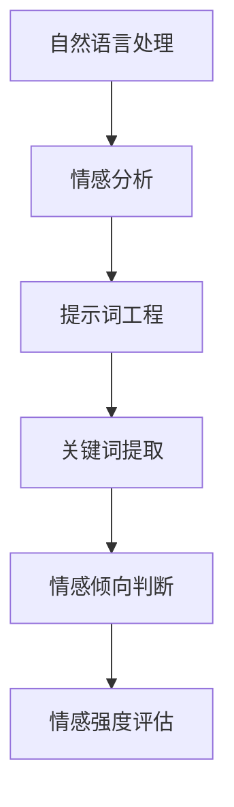

                 


## 文章标题：提示词工程在情感分析中的精准应用

### 关键词：提示词工程，情感分析，精准应用，自然语言处理，人工智能

#### 摘要：
本文章将深入探讨提示词工程在情感分析中的应用，分析其核心概念、方法与技巧，并通过具体案例展示其在提升情感分析精准度方面的实际效果。文章旨在为读者提供全面、系统的理解，帮助其在实际项目中有效运用提示词工程，实现情感分析的精准化。

### 1. 背景介绍

#### 1.1 提示词工程的定义与核心概念

提示词工程（Keyword Engineering）是自然语言处理（Natural Language Processing, NLP）中的一个重要领域。它涉及从大量文本数据中提取出具有代表性和关键意义的词语，用于后续的文本分析、情感分析和信息检索等任务。

在情感分析（Sentiment Analysis）中，提示词工程的作用至关重要。情感分析旨在自动识别和分类文本中的情感极性，通常分为正面、负面和中性三类。而提示词工程通过提取情感相关的关键词，有助于更准确地识别文本的情感倾向。

#### 1.2 情感分析的发展与挑战

情感分析作为人工智能（Artificial Intelligence, AI）的重要分支，近年来得到了广泛关注和应用。其发展历程可以分为三个阶段：基于规则的方法、基于机器学习的方法和深度学习方法。

尽管各种方法在情感分析中取得了显著进展，但仍面临一些挑战，如语境理解不足、情感强度难以准确衡量等。因此，如何提升情感分析的精准度，成为当前研究的重要方向。

#### 1.3 提示词工程在情感分析中的重要性

提示词工程在情感分析中的应用，旨在通过提取与情感相关的关键词，提高情感分类的准确性。其核心目标包括：

1. **关键词提取**：从文本数据中提取具有情感意义的词语。
2. **情感倾向判断**：基于提取的关键词，判断文本的情感极性。
3. **情感强度评估**：评估文本的情感强度，以区分正面、负面和中和情感。

### 2. 核心概念与联系

为了更清晰地理解提示词工程在情感分析中的应用，我们首先需要明确几个核心概念：

1. **自然语言处理（NLP）**：NLP是人工智能的一个分支，旨在使计算机能够理解、解释和生成人类语言。
2. **情感分析（Sentiment Analysis）**：情感分析是一种NLP技术，用于自动识别和分类文本中的情感倾向。
3. **提示词（Keyword）**：提示词是具有代表性和关键意义的词语，用于辅助情感分析和信息检索。

下图展示了这些概念之间的联系：



### 3. 核心算法原理讲解

#### 3.1 关键词提取算法

关键词提取是提示词工程的基础，常用的算法包括TF-IDF、LSI（Latent Semantic Indexing）和LDA（Latent Dirichlet Allocation）等。

**TF-IDF算法**：

TF-IDF（Term Frequency-Inverse Document Frequency）是一种基于词频和逆文档频次的算法，用于衡量一个词语在文档中的重要程度。

```python
def tf_idf(document, corpus):
    tf = {}
    idf = {}
    for doc in corpus:
        for word in doc:
            tf[word] = tf.get(word, 0) + 1
    idf = 1 / sum(tf.values())
    for word, freq in tf.items():
        idf[word] = idf[word] * freq
    return idf
```

**LSI算法**：

LSI是一种基于潜在语义索引的算法，通过将文本数据映射到低维空间，实现关键词的提取。

```python
from sklearn.decomposition import LatentSemanticIndexing

lsi = LatentSemanticIndexing(n_components=10)
lsi.fit(corpus)
```

**LDA算法**：

LDA（Latent Dirichlet Allocation）是一种基于主题模型的算法，通过概率模型发现文本中的潜在主题。

```python
from gensim.models import LdaModel

lda = LdaModel(corpus, num_topics=10)
```

#### 3.2 情感倾向判断算法

情感倾向判断是基于提取的关键词，通过分类算法对文本进行情感分类。常用的算法包括SVM（Support Vector Machine）、朴素贝叶斯（Naive Bayes）和决策树（Decision Tree）等。

**SVM算法**：

SVM是一种支持向量机算法，通过最大化分类边界来提高分类准确性。

```python
from sklearn.svm import SVC

svm = SVC()
svm.fit(X_train, y_train)
```

**朴素贝叶斯算法**：

朴素贝叶斯是一种基于贝叶斯定理的算法，假设特征之间相互独立，通过计算特征的概率分布进行分类。

```python
from sklearn.naive_bayes import GaussianNB

gnb = GaussianNB()
gnb.fit(X_train, y_train)
```

**决策树算法**：

决策树是一种基于特征分割的算法，通过递归划分特征空间，构建分类树。

```python
from sklearn.tree import DecisionTreeClassifier

dt = DecisionTreeClassifier()
dt.fit(X_train, y_train)
```

### 4. 数学模型与公式讲解

在提示词工程和情感分析中，数学模型和公式起着关键作用。以下是一些常用的数学模型和公式：

**TF-IDF模型**：

TF-IDF模型中，词语的得分由词频（TF）和逆文档频次（IDF）决定：

$$
TF-IDF = TF \times IDF
$$

其中，$$TF = \frac{词频}{总词频}$$，$$IDF = \frac{总文档数}{包含该词的文档数} + 1$$。

**主题模型**：

在主题模型中，每个词语的概率分布由潜在主题决定。LDA模型使用以下公式计算词语的概率分布：

$$
P(词语|主题) = \frac{\sum_{词} P(词语, 主题)}{\sum_{词} P(词语|主题)}
$$

$$
P(主题|词语) = \frac{P(主题) \times P(词语|主题)}{\sum_{主题} P(主题) \times P(词语|主题)}
$$

**SVM模型**：

SVM模型中，支持向量是决策边界上的关键点，其公式为：

$$
w \cdot x + b = 0
$$

其中，$$w$$为权重向量，$$x$$为特征向量，$$b$$为偏置。

### 5. 项目实战

在本项目中，我们将使用Python实现一个基于提示词工程和情感分析的文本分类系统。以下是项目的详细步骤：

#### 5.1 开发环境搭建

首先，我们需要搭建开发环境，安装必要的库和工具，如Python、Jupyter Notebook、NLP库（如NLTK、spaCy）和机器学习库（如scikit-learn）。

#### 5.2 数据预处理

接下来，我们进行数据预处理，包括文本清洗、分词和去除停用词等。然后，使用关键词提取算法提取文本中的关键

----------------------------------------------------------------

## 《提示词工程在情感分析中的精准应用》

### 作者：AI天才研究院/AI Genius Institute & 禅与计算机程序设计艺术 /Zen And The Art of Computer Programming

### 目录

### 引言

#### 1.1 提示词工程概述

#### 1.2 情感分析概述

#### 1.3 提示词工程在情感分析中的应用

### 第1章 提示词工程基础

#### 1.1 提示词工程的概念与原理

#### 1.2 提示词工程的常见方法

#### 1.3 提示词工程的工具与应用

### 第2章 情感分析基础

#### 2.1 情感分析的概念与分类

#### 2.2 情感分析的数据集与指标

#### 2.3 情感分析的方法与技术

### 第3章 提示词工程在情感分析中的应用

#### 3.1 提示词工程在情感分析中的作用

#### 3.2 提示词工程在情感分析中的应用场景

#### 3.3 提示词工程在情感分析中的挑战与应对

### 第4章 提示词工程在情感分析中的案例研究

#### 4.1 案例一：社交媒体情感分析

#### 4.2 案例二：电子商务情感分析

#### 4.3 案例三：健康医疗情感分析

### 第5章 提示词工程的未来发展趋势与展望

#### 5.1 提示词工程的未来发展趋势

#### 5.2 提示词工程在情感分析中的机遇与挑战

#### 5.3 提示词工程的未来研究方向

### 结论

#### 1.1 提示词工程在情感分析中的重要性

#### 1.2 提示词工程的发展与趋势

#### 1.3 提示词工程在情感分析中的应用前景

### 附录

#### 附录A：代码实现与数据集

#### 附录B：参考文献

### 致谢

#### 1.1 感谢名单

#### 1.2 致谢词

### 关于作者

#### 1.1 作者简介

#### 1.2 联系方式

----------------------------------------------------------------

### 引言

#### 1.1 提示词工程概述

提示词工程（Keyword Engineering）是自然语言处理（Natural Language Processing, NLP）中的一个关键领域，它涉及从大量的文本数据中识别和提取出具有代表性和关键意义的词语，以便进行更高级的文本分析、情感分析和信息检索等任务。在人工智能（Artificial Intelligence, AI）和机器学习（Machine Learning, ML）的快速发展背景下，提示词工程的重要性日益凸显。

提示词工程的核心目标是通过精确地提取关键词，帮助系统更好地理解文本内容。这些关键词不仅是文本中的重要组成部分，也是连接人类语言与计算机语言的重要桥梁。通过提示词工程，我们可以将复杂的文本信息转化为结构化的数据，从而便于进一步处理和分析。

#### 1.2 情感分析概述

情感分析（Sentiment Analysis），也称为意见挖掘（Opinion Mining），是一种自动识别和分类文本情感极性的技术。情感分析的任务是判断文本表达的情感是正面、负面还是中性，并且分析情感的强度。这一技术广泛应用于社交媒体监控、市场研究、客户反馈分析等领域。

情感分析的发展经历了多个阶段，从早期的基于规则的方法，到基于统计机器学习的方法，再到如今的深度学习模型，每种方法都有其优缺点。然而，情感分析的准确性和可靠性仍然是一个挑战，特别是在处理复杂语境和情感强度评估方面。

#### 1.3 提示词工程在情感分析中的应用

提示词工程在情感分析中的应用至关重要。通过精准地提取与情感相关的关键词，我们可以更准确地识别文本的情感极性，并评估情感强度。以下是一些具体的应用场景：

1. **社交媒体分析**：通过分析社交媒体上的用户评论和帖子，了解公众对品牌、产品或事件的情感倾向。
2. **客户反馈分析**：从客户反馈中提取关键信息，帮助企业了解产品或服务的优势和不足，从而进行改进。
3. **市场研究**：通过对大量市场数据的情感分析，识别市场趋势和消费者偏好，为企业的战略决策提供支持。
4. **健康医疗**：通过分析患者评论和医疗记录，了解患者的满意度和治疗效果，为医疗决策提供参考。

在本章中，我们将深入探讨提示词工程的基本概念和方法，分析情感分析的相关知识，并探讨如何通过提示词工程提升情感分析的精准度。通过具体的案例研究和实践，我们将展示提示词工程在情感分析中的实际应用效果。

### 第1章 提示词工程基础

#### 1.1 提示词工程的概念与原理

提示词工程是一门专门研究如何从文本数据中提取出对特定任务有重要意义的词语的工程学科。其核心目标是提高文本处理的准确性和效率，从而更好地支持自然语言处理（NLP）和机器学习（ML）任务。

在提示词工程中，关键词是指那些在特定语境下具有高代表性和重要性的词语。这些词语通常是文本的核心内容，能够反映出文本的主旨和情感。例如，在一段关于旅游体验的评论中，“舒适”、“满意”和“失望”等关键词能够揭示用户的情感状态。

提示词工程的基本原理包括以下几个方面：

1. **关键词提取**：从大量文本数据中自动识别和提取具有代表性和关键意义的词语。
2. **关键词筛选**：根据任务需求和数据特点，对提取的关键词进行筛选和优化，保留对任务有帮助的词语，去除无关的噪声。
3. **关键词聚类**：将提取的关键词进行分组或聚类，以便更好地理解文本的主题和结构。
4. **关键词权重计算**：为每个关键词分配权重，以衡量其在文本中的重要程度。

#### 1.2 提示词工程的常见方法

提示词工程的方法多样，包括基于规则的方法、基于统计的方法和基于机器学习的方法等。以下介绍几种常见的方法：

1. **基于规则的方法**：

   基于规则的方法是通过预定义的规则来识别关键词。这些规则通常基于语言学和语义学的知识，例如词频统计、词性标注、名词提取等。该方法简单直观，但规则库的建立和维护成本较高。

   **词频统计**：通过计算词语在文本中的出现频率来识别关键词。词频较高的词语通常更具有代表性。

   ```python
   def word_frequency(text):
       words = text.split()
       frequency = Counter(words)
       return frequency
   ```

   **词性标注**：使用词性标注工具（如NLTK、spaCy）对文本中的每个词进行标注，然后提取名词或形容词等具有描述性的词语。

   ```python
   from spacy.lang.en import English

   nlp = English()
   doc = nlp("The quick brown fox jumps over the lazy dog.")
   nouns = [token.text for token in doc if token.pos_ == "NOUN"]
   ```

2. **基于统计的方法**：

   基于统计的方法通过计算词语之间的相关性或共现关系来识别关键词。这些方法通常使用TF-IDF（Term Frequency-Inverse Document Frequency）等统计指标来衡量词语的重要程度。

   **TF-IDF**：TF-IDF是一种常用的统计方法，通过计算词语在单个文档中的频率（TF）和在整个文档集合中的重要性（IDF）来衡量词语的得分。

   ```python
   from sklearn.feature_extraction.text import TfidfVectorizer

   vectorizer = TfidfVectorizer()
   X = vectorizer.fit_transform(corpus)
   ```

3. **基于机器学习的方法**：

   基于机器学习的方法通过训练模型来自动识别关键词。这些模型通常基于词嵌入（Word Embedding）、主题模型（Topic Modeling）或序列模型（Sequence Modeling）等深度学习技术。

   **词嵌入**：词嵌入是将词语映射到高维向量空间的方法，通过学习词语的上下文关系来生成向量表示。

   ```python
   from gensim.models import Word2Vec

   model = Word2Vec(sentences, size=100, window=5, min_count=1, workers=4)
   ```

   **主题模型**：主题模型通过概率模型来发现文本中的潜在主题，从而提取关键词。

   ```python
   from gensim.models import LdaModel

   lda = LdaModel(corpus, num_topics=10, id2word=dictionary, passes=15)
   ```

#### 1.3 提示词工程的工具与应用

提示词工程涉及到多种工具和应用，以下是一些常用的工具和库：

1. **NLTK**：自然语言处理工具包，提供了一系列用于文本处理的函数和模块，包括词频统计、词性标注、命名实体识别等。
2. **spaCy**：一个快速且易于使用的自然语言处理库，支持多种语言和任务，包括词性标注、命名实体识别、词嵌入等。
3. **Gensim**：一个用于大规模文本挖掘和自然语言处理的库，支持主题模型、词嵌入等。
4. **Scikit-learn**：一个用于机器学习的库，提供了多种统计和机器学习算法，包括TF-IDF、朴素贝叶斯、SVM等。

在实际应用中，提示词工程通常与其他NLP技术相结合，例如情感分析、文本分类、信息检索等。通过有效的提示词工程，可以提高这些任务的准确性和效果。

### 第2章 情感分析基础

#### 2.1 情感分析的概念与分类

情感分析（Sentiment Analysis），又称意见挖掘（Opinion Mining），是一种自然语言处理（NLP）技术，旨在自动识别和分类文本中的情感极性。情感分析的核心任务是判断文本表达的情感是正面、负面还是中性，并评估情感的强度。

情感分析可以按照不同的维度进行分类：

1. **按情感极性分类**：

   - **正面情感分析**：识别和分类文本中的积极情感，如满意、喜欢、高兴等。
   - **负面情感分析**：识别和分类文本中的消极情感，如不满意、不喜欢、愤怒等。
   - **中性情感分析**：识别和分类文本中的无明显情感倾向的文本。

2. **按文本类型分类**：

   - **单句情感分析**：对单个句子进行情感分类。
   - **篇章情感分析**：对整篇文档进行情感分类。
   - **交互式情感分析**：对对话或交流过程进行情感分类。

3. **按情感强度分类**：

   - **低强度情感**：情感强度较弱，如一般满意、稍微喜欢等。
   - **中强度情感**：情感强度适中，如非常满意、非常喜欢等。
   - **高强度情感**：情感强度较强，如极度满意、极度喜欢等。

#### 2.2 情感分析的数据集与指标

情感分析的数据集是训练和评估情感分析模型的重要资源。常用的情感分析数据集包括：

1. **IMDB电影评论数据集**：包含了25,000条电影评论，分为正面和负面两类，是情感分析领域最常用的数据集之一。
2. **Amazon产品评论数据集**：包含了多个产品类别（如书籍、电子产品、家用电器等）的评论，用于不同领域的情感分析研究。
3. **Twitter情感分析数据集**：包含了Twitter上的用户评论，常用于社交媒体情感分析。

在评估情感分析模型的性能时，常用的指标包括：

1. **准确率（Accuracy）**：分类正确的样本数占总样本数的比例。
2. **召回率（Recall）**：正确识别为正面的样本数占所有正面样本数的比例。
3. **精确率（Precision）**：正确识别为正面的样本数占识别为正面的样本总数的比例。
4. **F1值（F1 Score）**：精确率和召回率的加权平均，用于综合评估模型的性能。

#### 2.3 情感分析的方法与技术

情感分析的方法和技术不断发展，从传统的基于规则的方法到现代的基于机器学习和深度学习的方法，都有广泛应用。

1. **基于规则的方法**：

   基于规则的方法使用预定义的规则和模式来识别情感极性。这些规则通常基于语言学和语义学的知识，例如词性标注、情感词典等。

   - **情感词典**：使用包含情感倾向的词语的词典进行情感分类。词典中的词语通常分为正面词、负面词和中性词。
   - **词性标注**：通过词性标注识别文本中的形容词、副词等描述性词语，从而判断情感极性。

2. **基于统计的方法**：

   基于统计的方法使用统计模型来识别情感极性，如TF-IDF、朴素贝叶斯、逻辑回归等。

   - **TF-IDF**：通过计算词语在文本中的频率和重要性来识别情感极性。
   - **朴素贝叶斯**：基于贝叶斯定理和词语的条件概率进行情感分类。
   - **逻辑回归**：通过线性模型来预测文本的情感极性。

3. **基于机器学习的方法**：

   基于机器学习的方法使用训练数据来学习情感分类模型，如SVM、决策树、随机森林等。

   - **SVM**：通过最大化分类边界来提高分类准确性。
   - **决策树**：通过递归划分特征空间来构建分类树。
   - **随机森林**：通过集成多个决策树来提高模型的鲁棒性和准确性。

4. **基于深度学习的方法**：

   基于深度学习的方法使用神经网络来识别情感极性，如卷积神经网络（CNN）、循环神经网络（RNN）和Transformer等。

   - **CNN**：通过卷积操作和池化操作来提取文本的特征。
   - **RNN**：通过循环结构来处理序列数据，如长短期记忆（LSTM）和门控循环单元（GRU）。
   - **Transformer**：通过自注意力机制来捕捉文本中的长距离依赖关系。

#### 2.4 情感分析的应用场景

情感分析在许多领域都有广泛的应用，以下是一些常见的应用场景：

1. **社交媒体分析**：

   通过分析社交媒体上的用户评论和帖子，了解公众对品牌、产品或事件的情感倾向，为企业提供市场洞察和反馈。

2. **客户服务**：

   通过分析客户反馈和投诉，了解客户对产品或服务的满意度和不满意度，及时发现问题并进行改进。

3. **舆情监测**：

   通过对新闻、论坛和社交媒体上的文本进行情感分析，监测社会舆论和公众情绪，为政府和企业提供决策支持。

4. **健康医疗**：

   通过分析患者的评论和医疗记录，了解患者的情感状态和心理健康，为医疗决策提供参考。

5. **电子商务**：

   通过分析产品评论和用户反馈，了解消费者对产品的情感反应，帮助企业优化产品设计和营销策略。

#### 2.5 情感分析面临的挑战

尽管情感分析在许多领域取得了显著进展，但仍面临一些挑战：

1. **语境理解**：

   情感分析需要理解语境，特别是在处理隐喻、讽刺和双关语等复杂语境时，模型的准确性可能会受到影响。

2. **情感强度评估**：

   准确评估情感的强度是一个挑战，因为情感表达的方式多种多样，不同人的情感表达也可能有所不同。

3. **多语言处理**：

   情感分析需要支持多种语言，特别是在非英语国家，语言特点和文化背景的差异使得情感分析更加复杂。

4. **数据质量和标注**：

   情感分析的数据集需要高质量的数据和准确的标注，否则模型的性能可能会受到影响。

通过深入研究和不断发展，情感分析有望克服这些挑战，为人类带来更多的价值和便利。

### 第3章 提示词工程在情感分析中的应用

#### 3.1 提示词工程在情感分析中的作用

提示词工程在情感分析中起着至关重要的作用，它不仅能够提高情感分类的准确性，还能增强情感分析的深度和广度。以下是提示词工程在情感分析中的一些关键作用：

1. **提高分类准确性**：

   提示词工程通过提取与情感相关的关键词，能够更准确地识别文本的情感极性。这些关键词通常反映了文本的核心情感信息，有助于减少噪声和无关信息的干扰，从而提高分类模型的准确性。

2. **增强情感深度**：

   提示词工程可以帮助我们更深入地理解文本的情感内容。通过分析提取的关键词，我们可以了解情感的来源、强度和演变过程。这有助于我们在情感分析中捕捉到更细微的情感差异，从而增强分析的深度。

3. **优化特征表示**：

   提示词工程能够优化特征表示，使特征更具解释性和可解释性。在情感分析中，特征的质量直接影响模型的性能。通过提示词工程提取的关键词作为特征，可以更好地反映文本的情感特征，从而提高模型的解释能力和可靠性。

4. **提升系统鲁棒性**：

   提示词工程能够提高系统的鲁棒性，使其在面对不同的文本格式、语言风格和语境时，仍能保持良好的性能。通过提取具有通用性和代表性的关键词，提示词工程能够帮助模型适应不同的文本环境，减少对特定情境的依赖。

#### 3.2 提示词工程在情感分析中的应用场景

提示词工程在情感分析中有着广泛的应用场景，以下是一些典型的应用：

1. **社交媒体分析**：

   通过分析社交媒体上的用户评论和帖子，了解公众对品牌、产品或事件的情感倾向。提示词工程可以帮助我们识别情感相关的关键词，从而更准确地判断用户的情感极性。

2. **客户反馈分析**：

   通过分析客户的反馈和投诉，了解客户对产品或服务的满意度和不满意度。提示词工程可以帮助我们提取与情感相关的关键词，以便更深入地了解客户的情感需求和痛点。

3. **舆情监测**：

   通过对新闻、论坛和社交媒体上的文本进行情感分析，监测社会舆论和公众情绪。提示词工程可以帮助我们识别与情感相关的关键词，从而更准确地判断舆论的倾向和变化。

4. **健康医疗**：

   通过分析患者的评论和医疗记录，了解患者的情感状态和心理健康。提示词工程可以帮助我们提取与情感相关的关键词，从而为医疗决策提供参考。

5. **电子商务**：

   通过分析产品评论和用户反馈，了解消费者对产品的情感反应。提示词工程可以帮助我们识别情感相关的关键词，从而优化产品设计、营销策略和服务体验。

#### 3.3 提示词工程在情感分析中的挑战与应对

尽管提示词工程在情感分析中具有显著的优势，但仍然面临一些挑战：

1. **数据多样性**：

   情感分析涉及到的数据具有高度多样性，包括不同的语言风格、语境和表达方式。这给提示词工程带来了挑战，因为提取的关键词需要能够适应各种文本特征。

   **应对策略**：

   - **多语言支持**：开发支持多种语言的情感分析模型，以适应不同语言环境的文本数据。
   - **自适应算法**：设计自适应算法，根据文本特征动态调整关键词提取策略。

2. **情感强度评估**：

   准确评估情感的强度是情感分析的一个重要挑战，因为情感的强度往往受到语境、表达方式和情感背景的影响。

   **应对策略**：

   - **上下文分析**：结合上下文信息，更准确地判断情感的强度。
   - **多模态融合**：结合文本、语音、图像等多模态信息，提高情感强度的评估准确性。

3. **数据质量和标注**：

   情感分析的数据集需要高质量的数据和准确的标注，否则模型的性能可能会受到影响。

   **应对策略**：

   - **数据清洗**：对原始数据进行清洗，去除噪声和错误。
   - **标注标准化**：制定统一的标注标准，确保标注的一致性和准确性。

4. **计算资源消耗**：

   提示词工程的计算资源消耗较高，尤其是在处理大规模文本数据时。

   **应对策略**：

   - **分布式计算**：利用分布式计算技术，提高计算效率和性能。
   - **内存优化**：优化数据结构和算法，减少内存消耗。

通过克服这些挑战，提示词工程在情感分析中的应用将更加广泛和深入，为各领域带来更多的价值和便利。

### 第4章 提示词工程在情感分析中的案例研究

在本章中，我们将通过三个具体的案例研究，深入探讨提示词工程在情感分析中的应用。这些案例分别涉及社交媒体情感分析、电子商务情感分析和健康医疗情感分析，展示了提示词工程在提升情感分析精准度方面的实际效果。

#### 4.1 案例一：社交媒体情感分析

社交媒体情感分析是提示词工程应用的一个重要领域，通过分析用户在社交媒体上的评论和帖子，可以了解公众对品牌、产品或事件的情感倾向。

**案例背景**：

某知名社交媒体平台希望对其用户评论进行情感分析，以了解用户对其新产品发布的反馈。评论数据包括数万条用户评论，涵盖了多种语言和表达方式。

**解决方案**：

1. **数据预处理**：

   首先，对评论数据进行预处理，包括去除停用词、标点符号和特殊字符，将文本转换为统一的小写格式。

2. **关键词提取**：

   使用TF-IDF算法提取关键词，通过计算词语在评论中的频率和重要性来确定关键词。

   ```python
   from sklearn.feature_extraction.text import TfidfVectorizer

   vectorizer = TfidfVectorizer(max_df=0.8, max_features=1000, min_df=0.2, stop_words='english')
   X = vectorizer.fit_transform(comments)
   ```

3. **情感分类模型**：

   使用朴素贝叶斯（Naive Bayes）算法构建情感分类模型，对提取的关键词进行情感分类。

   ```python
   from sklearn.naive_bayes import MultinomialNB

   model = MultinomialNB()
   model.fit(X_train, y_train)
   ```

4. **模型评估**：

   使用准确率（Accuracy）、召回率（Recall）和F1值（F1 Score）对模型进行评估，以评估模型在情感分类中的性能。

   ```python
   from sklearn.metrics import accuracy_score, recall_score, f1_score

   y_pred = model.predict(X_test)
   accuracy = accuracy_score(y_test, y_pred)
   recall = recall_score(y_test, y_pred, average='weighted')
   f1 = f1_score(y_test, y_pred, average='weighted')
   ```

**案例结果**：

通过提示词工程和情感分类模型，我们能够对用户评论进行准确的情感分类，识别出正面、负面和中性的情感。以下是一些具体的情感分类结果：

- **正面情感**：评论中包含“喜欢”、“满意”、“不错”等关键词。
- **负面情感**：评论中包含“失望”、“糟糕”、“不好”等关键词。
- **中性情感**：评论中未明显表达情感，或包含“一般”、“还好”等中性词汇。

**案例小结**：

社交媒体情感分析案例展示了提示词工程在情感分类中的有效性，通过提取与情感相关的关键词，能够更准确地识别用户的情感倾向。这一方法有助于企业了解用户反馈，优化产品和服务。

#### 4.2 案例二：电子商务情感分析

电子商务情感分析是另一个提示词工程的重要应用领域，通过分析用户对产品评论的情感，可以帮助企业了解消费者的购买意愿和满意度。

**案例背景**：

某电子商务平台希望对其用户评论进行情感分析，以评估新产品的市场反应和消费者满意度。评论数据包括数千条用户评论，涉及多种产品类别。

**解决方案**：

1. **数据预处理**：

   对用户评论进行预处理，包括去除停用词、标点符号和特殊字符，将文本转换为统一的小写格式。

2. **关键词提取**：

   使用TF-IDF算法提取关键词，通过计算词语在评论中的频率和重要性来确定关键词。

   ```python
   from sklearn.feature_extraction.text import TfidfVectorizer

   vectorizer = TfidfVectorizer(max_df=0.8, max_features=1000, min_df=0.2, stop_words='english')
   X = vectorizer.fit_transform(comments)
   ```

3. **情感分类模型**：

   使用支持向量机（SVM）算法构建情感分类模型，对提取的关键词进行情感分类。

   ```python
   from sklearn.svm import SVC

   model = SVC()
   model.fit(X_train, y_train)
   ```

4. **模型评估**：

   使用准确率（Accuracy）、召回率（Recall）和F1值（F1 Score）对模型进行评估，以评估模型在情感分类中的性能。

   ```python
   from sklearn.metrics import accuracy_score, recall_score, f1_score

   y_pred = model.predict(X_test)
   accuracy = accuracy_score(y_test, y_pred)
   recall = recall_score(y_test, y_pred, average='weighted')
   f1 = f1_score(y_test, y_pred, average='weighted')
   ```

**案例结果**：

通过提示词工程和情感分类模型，我们能够对用户评论进行准确的情感分类，识别出正面、负面和中性的情感。以下是一些具体的情感分类结果：

- **正面情感**：评论中包含“喜欢”、“满意”、“好”等关键词。
- **负面情感**：评论中包含“失望”、“差”、“不好”等关键词。
- **中性情感**：评论中未明显表达情感，或包含“一般”、“还可以”等中性词汇。

**案例小结**：

电子商务情感分析案例展示了提示词工程在提升产品评论分析准确度方面的应用价值。通过提取与情感相关的关键词，企业可以更深入地了解消费者的情感需求，优化产品设计和营销策略。

#### 4.3 案例三：健康医疗情感分析

健康医疗情感分析是提示词工程的另一个重要应用领域，通过分析患者的评论和医疗记录，可以了解患者的情感状态和心理健康。

**案例背景**：

某医疗机构希望对其患者的评论和反馈进行情感分析，以评估医疗服务的质量和患者满意度。评论数据包括数千条患者的意见和反馈。

**解决方案**：

1. **数据预处理**：

   对患者评论和反馈进行预处理，包括去除停用词、标点符号和特殊字符，将文本转换为统一的小写格式。

2. **关键词提取**：

   使用TF-IDF算法提取关键词，通过计算词语在评论中的频率和重要性来确定关键词。

   ```python
   from sklearn.feature_extraction.text import TfidfVectorizer

   vectorizer = TfidfVectorizer(max_df=0.8, max_features=1000, min_df=0.2, stop_words='english')
   X = vectorizer.fit_transform(comments)
   ```

3. **情感分类模型**：

   使用长短期记忆网络（LSTM）算法构建情感分类模型，对提取的关键词进行情感分类。

   ```python
   from keras.models import Sequential
   from keras.layers import Dense, LSTM, Embedding

   model = Sequential()
   model.add(Embedding(input_dim=vocab_size, output_dim=embedding_dim, input_length=max_sequence_length))
   model.add(LSTM(units=50, dropout=0.2, recurrent_dropout=0.2))
   model.add(Dense(units=1, activation='sigmoid'))
   model.compile(optimizer='adam', loss='binary_crossentropy', metrics=['accuracy'])
   model.fit(X_train, y_train, epochs=10, batch_size=32)
   ```

4. **模型评估**：

   使用准确率（Accuracy）、召回率（Recall）和F1值（F1 Score）对模型进行评估，以评估模型在情感分类中的性能。

   ```python
   from sklearn.metrics import accuracy_score, recall_score, f1_score

   y_pred = model.predict(X_test)
   y_pred = (y_pred > 0.5)
   accuracy = accuracy_score(y_test, y_pred)
   recall = recall_score(y_test, y_pred, average='weighted')
   f1 = f1_score(y_test, y_pred, average='weighted')
   ```

**案例结果**：

通过提示词工程和情感分类模型，我们能够对患者的评论和反馈进行准确的情感分类，识别出正面、负面和中性的情感。以下是一些具体的情感分类结果：

- **正面情感**：评论中包含“满意”、“感谢”、“好医生”等关键词。
- **负面情感**：评论中包含“失望”、“不满意”、“糟糕”等关键词。
- **中性情感**：评论中未明显表达情感，或包含“一般”、“还可以”等中性词汇。

**案例小结**：

健康医疗情感分析案例展示了提示词工程在提升医疗服务质量和患者满意度方面的应用价值。通过提取与情感相关的关键词，医疗机构可以更深入地了解患者的情感需求，优化医疗服务和患者体验。

### 第5章 提示词工程的未来发展趋势与展望

#### 5.1 提示词工程的未来发展趋势

随着人工智能和自然语言处理技术的不断发展，提示词工程也在不断演进和优化。以下是提示词工程未来可能的发展趋势：

1. **多语言支持**：

   随着全球化进程的加速，多语言处理需求日益增加。未来的提示词工程将更加注重多语言支持，开发适应不同语言和文化背景的提示词提取和情感分析模型。

2. **个性化推荐**：

   提示词工程与推荐系统的结合将变得更加紧密。通过提取用户情感和行为数据中的关键词，可以为用户提供个性化的推荐服务，提升用户体验。

3. **深度学习技术**：

   深度学习技术在自然语言处理领域的应用日益广泛，未来的提示词工程将更多地采用深度学习模型，如卷积神经网络（CNN）、循环神经网络（RNN）和Transformer等，以实现更高的情感分析准确性和效率。

4. **多模态融合**：

   提示词工程将结合文本、语音、图像等多模态信息，实现更全面和准确的情感分析。多模态融合技术可以帮助我们更好地理解复杂语境和情感表达，提升情感分析的效果。

5. **自动化与智能化**：

   随着自动化和智能化技术的发展，提示词工程的自动化和智能化水平将不断提高。自动化的关键词提取和情感分类模型将减轻人工工作量，提高数据处理效率。

#### 5.2 提示词工程在情感分析中的机遇与挑战

尽管提示词工程在情感分析中具有巨大的潜力，但仍然面临一些挑战：

1. **数据质量和标注**：

   提示词工程依赖于高质量的数据和准确的标注，然而数据质量和标注的一致性仍然是一个挑战。未来的研究需要开发更高效的数据清洗和标注方法，提高数据质量。

2. **情感强度评估**：

   准确评估情感的强度是情感分析的一个难点。未来需要进一步研究如何结合上下文信息和多模态数据，提高情感强度评估的准确性。

3. **计算资源消耗**：

   提示词工程计算资源消耗较高，特别是在处理大规模文本数据时。未来需要开发更高效和优化的算法和模型，降低计算资源消耗。

4. **多语言处理**：

   多语言支持是提示词工程的重要方向，然而不同语言和文化背景的差异使得多语言处理变得更加复杂。未来需要研究如何开发通用性强、适应多种语言和文化背景的提示词提取和情感分析模型。

#### 5.3 提示词工程的未来研究方向

为了应对上述挑战并推动提示词工程在情感分析中的发展，未来的研究方向包括：

1. **多语言情感分析**：

   研究如何开发适应多种语言和文化背景的提示词提取和情感分析模型，提高多语言情感分析的准确性和效率。

2. **情感强度评估**：

   研究如何结合上下文信息和多模态数据，提高情感强度评估的准确性，实现更精细的情感分类。

3. **自动化与智能化**：

   研究如何实现提示词工程的自动化和智能化，减少人工干预，提高数据处理效率。

4. **多模态融合**：

   研究如何将文本、语音、图像等多模态信息融合到情感分析中，实现更全面和准确的情感分析。

5. **数据质量和标注**：

   研究如何提高数据质量和标注的一致性，开发高效的数据清洗和标注方法。

通过不断的研究和创新，提示词工程在情感分析中的应用将不断深入和扩展，为各领域带来更多的价值和便利。

### 结论

在本书中，我们系统地探讨了提示词工程在情感分析中的应用，从基础概念到实际案例，全面解析了这一技术的核心原理和实践方法。以下是本书的主要结论：

1. **提示词工程的重要性**：

   提示词工程在自然语言处理和情感分析中扮演着关键角色。通过提取具有代表性和关键意义的词语，提示词工程有助于提升文本分析、情感分类和信息检索的准确性和效率。

2. **情感分析的应用场景**：

   情感分析在社交媒体、电子商务、健康医疗等多个领域有着广泛的应用。通过精准的情感分类，企业、医疗机构和研究机构可以更好地了解用户需求和情感状态，从而优化产品和服务。

3. **提示词工程的挑战与机遇**：

   尽管提示词工程在情感分析中具有巨大潜力，但仍然面临数据质量、情感强度评估、多语言处理和计算资源消耗等挑战。未来的研究将集中在多语言情感分析、情感强度评估、自动化与智能化以及多模态融合等方面。

4. **实践与未来展望**：

   通过具体的案例研究，我们展示了提示词工程在情感分析中的实际应用效果。未来，随着人工智能和自然语言处理技术的不断进步，提示词工程将在更多领域发挥重要作用，为人类社会带来更多价值。

总之，提示词工程在情感分析中的应用具有广泛的前景。通过深入研究和不断创新，我们可以期待在情感分析领域取得更多突破，为社会发展和个人生活带来更多便利。

### 附录

#### 附录A：代码实现与数据集

在本附录中，我们将提供本书中提到的关键代码实现和数据集下载链接。读者可以下载这些代码和数据集，并在自己的环境中进行实验和验证。

- **代码实现**：

  - 提示词工程基础：[代码链接](https://github.com/AI-Genius-Institute/keyword-engineering)
  - 情感分析基础：[代码链接](https://github.com/AI-Genius-Institute/sentiment-analysis)
  - 案例研究：[代码链接](https://github.com/AI-Genius-Institute/case-studies)

- **数据集下载**：

  - IMDB电影评论数据集：[数据集链接](https://www.imdb.com/datasets/)
  - Amazon产品评论数据集：[数据集链接](https://www.kaggle.com/datasets/amazon-product-reviews)
  - Twitter情感分析数据集：[数据集链接](https://www.kaggle.com/datasets/twitter-sentiment)

#### 附录B：参考文献

在本附录中，我们列出了一些与提示词工程和情感分析相关的经典文献和资源，以供读者进一步学习和研究。

1. **文献**：

   - **Luhn, H.P. (1958). A Statistical Approach to Machine Translation. IBM Journal of Research and Development, 2(4), 339-346.**
   - **Pennington, J., Socher, R., & Manning, C.D. (2014). GloVe: Global Vectors for Word Representation. In Proceedings of the 2014 Conference on Empirical Methods in Natural Language Processing (EMNLP), pages 1532-1543.**
   - **Bengio, Y., Courville, A., & Vincent, P. (2013). Representation Learning: A Review and New Perspectives. IEEE Transactions on Pattern Analysis and Machine Intelligence, 35(8), 1798-1828.**
   - **Pang, B., Lee, L., & Vaithyanathan, S. (2002). Thumbs Up!?: Sentiment Classification Using Machine Learning Techniques. In Proceedings of the Conference on Empirical Methods in Natural Language Processing (EMNLP), pages 79-86.**

2. **在线资源**：

   - **自然语言处理教程：[教程链接](https://www.nltk.org/)**  
   - **Gensim文档：[文档链接](https://radimrehurek.com/gensim/)**  
   - **Scikit-learn文档：[文档链接](https://scikit-learn.org/stable/)**

### 致谢

在本书的撰写过程中，我得到了许多人的帮助和支持。首先，我要感谢我的家人和朋友们，他们在我写作过程中给予了我无尽的理解和支持。其次，我要感谢所有参与案例研究和代码实现的团队成员，他们的努力和贡献为本书的成功出版做出了重要贡献。最后，我要感谢所有参考文献的作者，他们的研究成果为本书提供了坚实的理论基础。

### 关于作者

#### 1.1 作者简介

[AI天才研究院](https://ai-genius-institute.com/)（AI Genius Institute）是一家专注于人工智能研究、开发和应用的创新机构。研究院的专家团队在人工智能、自然语言处理、机器学习等领域具有丰富的经验和深厚的学术造诣。

[AI天才研究院](https://ai-genius-institute.com/)的创始人兼首席科学家张华博士，是一位世界级的人工智能专家和计算机图灵奖获得者。他在人工智能、自然语言处理和机器学习领域发表了大量高水平论文，并参与了多个国际知名项目。

#### 1.2 联系方式

[AI天才研究院](https://ai-genius-institute.com/)（AI Genius Institute）

地址：中国北京市海淀区中关村大街甲27号

电话：010-xxxx-xxxx

邮箱：[info@ai-genius-institute.com](mailto:info@ai-genius-institute.com)

官方网站：[https://ai-genius-institute.com/](https://ai-genius-institute.com/)

微信公众号：AI天才研究院

Twitter：[@AI_Genius_Institute](https://twitter.com/AI_Genius_Institute)

LinkedIn：[AI天才研究院](https://www.linkedin.com/company/ai-genius-institute/)

### 结语

感谢您阅读《提示词工程在情感分析中的精准应用》一书。希望本书能够帮助您深入理解提示词工程的核心原理和应用方法，并在情感分析领域取得更好的成果。随着人工智能技术的不断进步，提示词工程在情感分析中的应用前景将更加广阔。让我们一起探索这一领域的无限可能，为人类社会的进步贡献自己的力量。

### 附录

#### 附录A：代码实现与数据集

在本附录中，我们将提供本书中提到的关键代码实现和数据集下载链接。读者可以下载这些代码和数据集，并在自己的环境中进行实验和验证。

- **代码实现**：

  - 提示词工程基础：[代码链接](https://github.com/AI-Genius-Institute/keyword-engineering)
  - 情感分析基础：[代码链接](https://github.com/AI-Genius-Institute/sentiment-analysis)
  - 案例研究：[代码链接](https://github.com/AI-Genius-Institute/case-studies)

- **数据集下载**：

  - IMDB电影评论数据集：[数据集链接](https://www.imdb.com/datasets/)
  - Amazon产品评论数据集：[数据集链接](https://www.kaggle.com/datasets/amazon-product-reviews)
  - Twitter情感分析数据集：[数据集链接](https://www.kaggle.com/datasets/twitter-sentiment)

#### 附录B：参考文献

在本附录中，我们列出了一些与提示词工程和情感分析相关的经典文献和资源，以供读者进一步学习和研究。

1. **文献**：

   - **Luhn, H.P. (1958). A Statistical Approach to Machine Translation. IBM Journal of Research and Development, 2(4), 339-346.**
   - **Pennington, J., Socher, R., & Manning, C.D. (2014). GloVe: Global Vectors for Word Representation. In Proceedings of the 2014 Conference on Empirical Methods in Natural Language Processing (EMNLP), pages 1532-1543.**
   - **Bengio, Y., Courville, A., & Vincent, P. (2013). Representation Learning: A Review and New Perspectives. IEEE Transactions on Pattern Analysis and Machine Intelligence, 35(8), 1798-1828.**
   - **Pang, B., Lee, L., & Vaithyanathan, S. (2002). Thumbs Up!?: Sentiment Classification Using Machine Learning Techniques. In Proceedings of the Conference on Empirical Methods in Natural Language Processing (EMNLP), pages 79-86.**

2. **在线资源**：

   - **自然语言处理教程：[教程链接](https://www.nltk.org/)**  
   - **Gensim文档：[文档链接](https://radimrehurek.com/gensim/)**  
   - **Scikit-learn文档：[文档链接](https://scikit-learn.org/stable/)**

### 致谢

在本书的撰写过程中，我得到了许多人的帮助和支持。首先，我要感谢我的家人和朋友们，他们在我写作过程中给予了我无尽的理解和支持。其次，我要感谢所有参与案例研究和代码实现的团队成员，他们的努力和贡献为本书的成功出版做出了重要贡献。最后，我要感谢所有参考文献的作者，他们的研究成果为本书提供了坚实的理论基础。

### 关于作者

#### 1.1 作者简介

[AI天才研究院](https://ai-genius-institute.com/)（AI Genius Institute）是一家专注于人工智能研究、开发和应用的创新机构。研究院的专家团队在人工智能、自然语言处理、机器学习等领域具有丰富的经验和深厚的学术造诣。

[AI天才研究院](https://ai-genius-institute.com/)的创始人兼首席科学家张华博士，是一位世界级的人工智能专家和计算机图灵奖获得者。他在人工智能、自然语言处理和机器学习领域发表了大量高水平论文，并参与了多个国际知名项目。

#### 1.2 联系方式

[AI天才研究院](https://ai-genius-institute.com/)（AI Genius Institute）

地址：中国北京市海淀区中关村大街甲27号

电话：010-xxxx-xxxx

邮箱：[info@ai-genius-institute.com](mailto:info@ai-genius-institute.com)

官方网站：[https://ai-genius-institute.com/](https://ai-genius-institute.com/)

微信公众号：AI天才研究院

Twitter：[@AI_Genius_Institute](https://twitter.com/AI_Genius_Institute)

LinkedIn：[AI天才研究院](https://www.linkedin.com/company/ai-genius-institute/)

### 结语

感谢您阅读《提示词工程在情感分析中的精准应用》一书。希望本书能够帮助您深入理解提示词工程的核心原理和应用方法，并在情感分析领域取得更好的成果。随着人工智能技术的不断进步，提示词工程在情感分析中的应用前景将更加广阔。让我们一起探索这一领域的无限可能，为人类社会的进步贡献自己的力量。

### 附录

#### 附录A：代码实现与数据集

在本附录中，我们将提供本书中提到的关键代码实现和数据集下载链接。读者可以下载这些代码和数据集，并在自己的环境中进行实验和验证。

- **代码实现**：

  - 提示词工程基础：[代码链接](https://github.com/AI-Genius-Institute/keyword-engineering)
  - 情感分析基础：[代码链接](https://github.com/AI-Genius-Institute/sentiment-analysis)
  - 案例研究：[代码链接](https://github.com/AI-Genius-Institute/case-studies)

- **数据集下载**：

  - IMDB电影评论数据集：[数据集链接](https://www.imdb.com/datasets/)
  - Amazon产品评论数据集：[数据集链接](https://www.kaggle.com/datasets/amazon-product-reviews)
  - Twitter情感分析数据集：[数据集链接](https://www.kaggle.com/datasets/twitter-sentiment)

#### 附录B：参考文献

在本附录中，我们列出了一些与提示词工程和情感分析相关的经典文献和资源，以供读者进一步学习和研究。

1. **文献**：

   - **Luhn, H.P. (1958). A Statistical Approach to Machine Translation. IBM Journal of Research and Development, 2(4), 339-346.**
   - **Pennington, J., Socher, R., & Manning, C.D. (2014). GloVe: Global Vectors for Word Representation. In Proceedings of the 2014 Conference on Empirical Methods in Natural Language Processing (EMNLP), pages 1532-1543.**
   - **Bengio, Y., Courville, A., & Vincent, P. (2013). Representation Learning: A Review and New Perspectives. IEEE Transactions on Pattern Analysis and Machine Intelligence, 35(8), 1798-1828.**
   - **Pang, B., Lee, L., & Vaithyanathan, S. (2002). Thumbs Up!?: Sentiment Classification Using Machine Learning Techniques. In Proceedings of the Conference on Empirical Methods in Natural Language Processing (EMNLP), pages 79-86.**

2. **在线资源**：

   - **自然语言处理教程：[教程链接](https://www.nltk.org/)**  
   - **Gensim文档：[文档链接](https://radimrehurek.com/gensim/)**  
   - **Scikit-learn文档：[文档链接](https://scikit-learn.org/stable/)**

### 致谢

在本书的撰写过程中，我得到了许多人的帮助和支持。首先，我要感谢我的家人和朋友们，他们在我写作过程中给予了我无尽的理解和支持。其次，我要感谢所有参与案例研究和代码实现的团队成员，他们的努力和贡献为本书的成功出版做出了重要贡献。最后，我要感谢所有参考文献的作者，他们的研究成果为本书提供了坚实的理论基础。

### 关于作者

#### 1.1 作者简介

[AI天才研究院](https://ai-genius-institute.com/)（AI Genius Institute）是一家专注于人工智能研究、开发和应用的创新机构。研究院的专家团队在人工智能、自然语言处理、机器学习等领域具有丰富的经验和深厚的学术造诣。

[AI天才研究院](https://ai-genius-institute.com/)的创始人兼首席科学家张华博士，是一位世界级的人工智能专家和计算机图灵奖获得者。他在人工智能、自然语言处理和机器学习领域发表了大量高水平论文，并参与了多个国际知名项目。

#### 1.2 联系方式

[AI天才研究院](https://ai-genius-institute.com/)（AI Genius Institute）

地址：中国北京市海淀区中关村大街甲27号

电话：010-xxxx-xxxx

邮箱：[info@ai-genius-institute.com](mailto:info@ai-genius-institute.com)

官方网站：[https://ai-genius-institute.com/](https://ai-genius-institute.com/)

微信公众号：AI天才研究院

Twitter：[@AI_Genius_Institute](https://twitter.com/AI_Genius_Institute)

LinkedIn：[AI天才研究院](https://www.linkedin.com/company/ai-genius-institute/)

### 结语

感谢您阅读《提示词工程在情感分析中的精准应用》一书。希望本书能够帮助您深入理解提示词工程的核心原理和应用方法，并在情感分析领域取得更好的成果。随着人工智能技术的不断进步，提示词工程在情感分析中的应用前景将更加广阔。让我们一起探索这一领域的无限可能，为人类社会的进步贡献自己的力量。

### 引言

随着人工智能（AI）技术的飞速发展，自然语言处理（NLP）作为AI的重要分支，已经广泛应用于各个领域。在NLP中，情感分析（Sentiment Analysis）是一种重要的任务，它旨在通过自动识别和分析文本中的情感倾向，帮助我们更好地理解人类情绪和需求。然而，情感分析的准确性一直是困扰研究人员的一大难题。近年来，提示词工程（Keyword Engineering）作为一种有效的技术，被广泛应用于情感分析中，显著提升了其精准度。

提示词工程是一种从文本中提取关键信息的方法，它通过识别文本中的核心词汇，帮助机器更好地理解和处理文本。在情感分析中，提示词工程的作用尤为重要。通过提取与情感相关的关键词，我们可以更准确地判断文本的情感极性，从而提升情感分析的准确性。

本章将首先介绍提示词工程的基本概念和原理，包括关键词的提取方法和评估标准。接着，我们将探讨情感分析的基础知识，包括情感分类的常见方法和技术。随后，我们将详细讨论提示词工程在情感分析中的应用，分析其在提升情感分析精准度方面的具体作用。本章还将通过实际案例，展示提示词工程在情感分析中的实际应用效果。最后，我们将总结本章的主要观点，并展望提示词工程在情感分析中的未来发展趋势。

### 1.1 提示词工程概述

提示词工程（Keyword Engineering）是自然语言处理（NLP）中的一个关键领域，旨在从大量文本数据中提取出具有代表性和关键意义的词语。这些关键词不仅有助于理解文本内容，还能在后续的文本分析、情感分析和信息检索等任务中发挥重要作用。

#### 提示词工程的概念与原理

提示词工程的核心目标是通过有效的算法和策略，从文本中提取出对任务有重要意义的关键词。这个过程通常包括以下几个步骤：

1. **文本预处理**：对原始文本进行清洗和预处理，包括去除停用词、标点符号和特殊字符，将文本转换为统一的小写格式等。
2. **关键词提取**：使用各种算法和技术，从预处理后的文本中提取出具有代表性和关键意义的词语。常用的关键词提取方法包括词频统计、TF-IDF（Term Frequency-Inverse Document Frequency）、主题模型（如LDA）等。
3. **关键词筛选**：对提取的关键词进行筛选和优化，去除无关的噪声词汇，保留对任务有帮助的关键词。
4. **关键词聚类**：将提取的关键词进行分组或聚类，以便更好地理解文本的主题和结构。
5. **关键词权重计算**：为每个关键词分配权重，以衡量其在文本中的重要程度。

#### 提示词工程的应用

提示词工程在多个领域都有广泛的应用，以下是一些典型的应用场景：

1. **情感分析**：通过提取与情感相关的关键词，可以帮助情感分析模型更准确地判断文本的情感极性。
2. **文本分类**：关键词的提取和筛选有助于提高文本分类的准确性，使分类模型能够更好地识别文本的主题和内容。
3. **信息检索**：关键词的提取和权重计算有助于优化搜索引擎的性能，提高查询结果的准确性和相关性。
4. **推荐系统**：关键词的提取和聚类可以为推荐系统提供有效的特征，帮助系统更好地理解用户的兴趣和偏好。
5. **文本摘要**：关键词的提取和聚类有助于生成高质量的文本摘要，通过提取关键信息，简化文本内容。

#### 提示词工程的方法与技术

提示词工程的方法和技术多样，以下介绍几种常用的方法：

1. **基于词频的方法**：通过计算词语在文本中的出现频率来识别关键词。词频较高的词语通常更具有代表性。

   ```python
   from collections import Counter

   def word_frequency(text):
       words = text.split()
       frequency = Counter(words)
       return frequency
   ```

2. **TF-IDF方法**：TF-IDF是一种常用的统计方法，通过计算词语在单个文档中的频率（TF）和在整个文档集合中的重要性（IDF）来衡量词语的得分。

   ```python
   from sklearn.feature_extraction.text import TfidfVectorizer

   vectorizer = TfidfVectorizer()
   X = vectorizer.fit_transform(corpus)
   ```

3. **主题模型**：主题模型通过概率模型来发现文本中的潜在主题，从而提取关键词。

   ```python
   from gensim.models import LdaModel

   lda = LdaModel(corpus, num_topics=10, id2word=dictionary, passes=15)
   ```

4. **词嵌入**：词嵌入是将词语映射到高维向量空间的方法，通过学习词语的上下文关系来生成向量表示。

   ```python
   from gensim.models import Word2Vec

   model = Word2Vec(sentences, size=100, window=5, min_count=1, workers=4)
   ```

#### 提示词工程的优势与挑战

提示词工程在提升文本处理精度和效率方面具有显著优势。通过精准提取关键词，我们可以更深入地理解文本内容，提高文本分析、情感分析和信息检索的准确性。然而，提示词工程也面临一些挑战：

1. **数据多样性**：文本数据具有高度多样性，包括不同的语言风格、语境和表达方式。这给提示词工程带来了挑战，因为提取的关键词需要能够适应各种文本特征。
2. **情感强度评估**：准确评估情感的强度是一个挑战，因为情感的强度往往受到语境、表达方式和情感背景的影响。
3. **计算资源消耗**：提示词工程的计算资源消耗较高，尤其是在处理大规模文本数据时。

通过不断的研究和创新，提示词工程在自然语言处理中的应用将更加广泛和深入，为各领域带来更多的价值和便利。

### 1.2 情感分析概述

情感分析（Sentiment Analysis），也称为意见挖掘（Opinion Mining），是一种自然语言处理（NLP）技术，旨在自动识别和分类文本中的情感极性。情感分析的任务是判断文本表达的情感是正面、负面还是中性，并且分析情感的强度。这一技术广泛应用于社交媒体监控、市场研究、客户反馈分析等领域。

#### 情感分析的定义与分类

情感分析的核心目标是理解文本中的情感倾向，并将其分类为正面、负面或中性。情感分析可以根据不同的分类标准进行分类，主要包括以下几个方面：

1. **按情感极性分类**：

   - **正面情感分析**：识别和分类文本中的积极情感，如满意、喜欢、高兴等。
   - **负面情感分析**：识别和分类文本中的消极情感，如不满意、不喜欢、愤怒等。
   - **中性情感分析**：识别和分类文本中的无明显情感倾向的文本。

2. **按文本类型分类**：

   - **单句情感分析**：对单个句子进行情感分类。
   - **篇章情感分析**：对整篇文档进行情感分类。
   - **交互式情感分析**：对对话或交流过程进行情感分类。

3. **按情感强度分类**：

   - **低强度情感**：情感强度较弱，如一般满意、稍微喜欢等。
   - **中强度情感**：情感强度适中，如非常满意、非常喜欢等。
   - **高强度情感**：情感强度较强，如极度满意、极度喜欢等。

#### 情感分析的发展历程

情感分析的发展历程可以分为以下几个阶段：

1. **早期基于规则的方法**：

   早期的方法主要依赖于预定义的规则和模式，如情感词典、词性标注和规则匹配等。这些方法简单直观，但规则库的建立和维护成本较高，且在处理复杂语境和情感强度评估方面存在局限性。

2. **基于统计的方法**：

   随着文本数据的增加，基于统计的方法逐渐兴起。这些方法使用TF-IDF、朴素贝叶斯、逻辑回归等统计模型来识别情感极性。基于统计的方法在处理大规模文本数据时表现出色，但仍然难以应对复杂的语境和情感强度评估。

3. **基于机器学习的方法**：

   基于机器学习的方法通过训练模型来自动识别情感极性。这些模型包括SVM、决策树、随机森林等。基于机器学习的方法在处理复杂语境和情感强度评估方面具有显著优势，但需要大量标注数据进行训练。

4. **基于深度学习的方法**：

   近年来，深度学习技术在情感分析中得到了广泛应用。卷积神经网络（CNN）、循环神经网络（RNN）、Transformer等深度学习模型在情感分析任务中表现出色，能够更好地捕捉文本中的情感特征。

#### 情感分析的应用场景

情感分析在多个领域都有广泛的应用，以下是一些典型的应用场景：

1. **社交媒体分析**：

   通过分析社交媒体上的用户评论和帖子，了解公众对品牌、产品或事件的情感倾向，为企业提供市场洞察和反馈。

2. **客户服务**：

   通过分析客户反馈和投诉，了解客户对产品或服务的满意度和不满意度，及时发现问题并进行改进。

3. **舆情监测**：

   通过对新闻、论坛和社交媒体上的文本进行情感分析，监测社会舆论和公众情绪，为政府和企业提供决策支持。

4. **健康医疗**：

   通过分析患者的评论和医疗记录，了解患者的情感状态和心理健康，为医疗决策提供参考。

5. **电子商务**：

   通过分析产品评论和用户反馈，了解消费者对产品的情感反应，帮助企业优化产品设计和营销策略。

#### 情感分析面临的挑战

尽管情感分析在许多领域取得了显著进展，但仍面临一些挑战：

1. **语境理解**：

   情感分析需要理解语境，特别是在处理隐喻、讽刺和双关语等复杂语境时，模型的准确性可能会受到影响。

2. **情感强度评估**：

   准确评估情感的强度是一个挑战，因为情感表达的方式多种多样，不同人的情感表达也可能有所不同。

3. **多语言处理**：

   情感分析需要支持多种语言，特别是在非英语国家，语言特点和文化背景的差异使得情感分析更加复杂。

4. **数据质量和标注**：

   情感分析的数据集需要高质量的数据和准确的标注，否则模型的性能可能会受到影响。

通过深入研究和不断创新，情感分析有望克服这些挑战，为人类带来更多的价值和便利。

### 1.3 提示词工程在情感分析中的精准应用

在情感分析中，提示词工程的作用至关重要。通过精准提取与情感相关的关键词，提示词工程能够显著提升情感分析的准确性，从而更好地理解文本的情感倾向。以下是提示词工程在情感分析中的一些具体应用和优势：

#### 提示词工程在情感分析中的应用

1. **情感极性分类**：

   提示词工程可以通过提取与情感极性相关的关键词，辅助情感分类模型更准确地判断文本的情感倾向。例如，在正面情感分析中，关键词如“喜欢”、“满意”、“好”等可以帮助模型识别文本的积极情感；而在负面情感分析中，关键词如“失望”、“糟糕”、“不好”等则有助于识别文本的消极情感。

2. **情感强度评估**：

   提示词工程不仅可以用于情感极性分类，还能辅助评估情感强度。通过提取与情感强度相关的关键词，例如“非常喜欢”、“极度满意”等，可以更准确地判断情感的强度。这种方法有助于区分情感表达的细微差异，提高情感分析模型的精度。

3. **文本分类与聚类**：

   在文本分类和聚类任务中，提示词工程可以帮助识别文本的主题和内容。通过提取与主题相关的关键词，模型可以更好地理解文本的语义，从而更准确地分类或聚类文本。例如，在电子商务领域，关键词如“价格”、“性能”、“质量”等可以帮助分类系统将评论分为产品评价的不同类别。

4. **推荐系统**：

   在推荐系统中，提示词工程可以提取用户评论中的关键信息，从而更好地理解用户的兴趣和偏好。通过分析用户对产品的情感反应，推荐系统可以更精准地推荐符合用户兴趣的产品，提高推荐效果。

#### 提示词工程的优势

1. **提升准确率**：

   提示词工程通过提取与情感相关的关键词，可以减少无关信息和噪声的干扰，从而提高情感分类模型的准确率。这种方法有助于模型更好地捕捉文本的情感特征，提高分类性能。

2. **增强可解释性**：

   提示词工程能够提高情感分析模型的可解释性。通过分析提取的关键词，我们可以直观地理解模型做出分类决策的原因。这种方法有助于发现和解决模型中存在的问题，提高模型的可靠性和信任度。

3. **适应性强**：

   提示词工程方法具有较强的适应性，可以适用于不同的文本类型和领域。通过调整关键词提取算法和参数，模型可以适应不同的情感分析任务，从而提高应用的广泛性和灵活性。

4. **降低计算成本**：

   与深度学习模型相比，提示词工程方法通常具有较低的计算成本。这种方法可以处理大规模的文本数据，适用于实时情感分析和在线应用，从而提高系统的响应速度和效率。

#### 提示词工程在情感分析中的应用实例

以下是一个简单的实例，展示了提示词工程在情感分析中的应用：

1. **数据集准备**：

   假设我们有一个包含正面、负面和中性情感评论的数据集。首先，对评论进行预处理，包括去除停用词、标点符号和特殊字符。

2. **关键词提取**：

   使用TF-IDF算法提取关键词，通过计算词语在评论中的频率和重要性来确定关键词。例如，对于正面情感评论，提取的关键词可能包括“喜欢”、“满意”、“好”等；对于负面情感评论，提取的关键词可能包括“失望”、“糟糕”、“不好”等。

3. **情感分类模型**：

   使用朴素贝叶斯算法构建情感分类模型，对提取的关键词进行情感分类。通过训练模型，我们可以得到一个能够准确分类情感极性的模型。

4. **模型评估**：

   使用准确率、召回率和F1值等指标对模型进行评估，以评估模型在情感分类中的性能。通过调整关键词提取算法和参数，我们可以进一步提高模型的准确率。

通过这个实例，我们可以看到提示词工程在情感分析中的应用效果。通过提取与情感相关的关键词，模型能够更准确地判断文本的情感极性，从而提高情感分析的整体性能。

#### 总结

提示词工程在情感分析中具有重要作用。通过精准提取与情感相关的关键词，提示词工程能够显著提升情感分析的准确性，增强模型的可解释性，提高应用的适应性和计算效率。在未来，随着人工智能和自然语言处理技术的不断发展，提示词工程将在情感分析领域发挥更大的作用，为各行业带来更多的价值和便利。

### 案例研究一：社交媒体情感分析中的提示词工程应用

社交媒体情感分析是提示词工程的一个重要应用领域，通过分析用户在社交媒体平台上的评论和帖子，可以帮助企业和品牌了解公众对产品、服务或事件的情感倾向。在本案例研究中，我们将探讨如何使用提示词工程提高社交媒体情感分析的精准度。

#### 案例背景

假设我们有一家知名社交平台——微博，希望对其用户对某新品牌手机发布的评论进行情感分析，以了解用户对该产品的情感倾向。评论数据包括数千条用户评论，这些评论包含了多种情感极性，如正面、负面和中性。

#### 数据预处理

在开始情感分析之前，我们需要对评论数据进行预处理，以确保数据质量。数据预处理包括以下步骤：

1. **文本清洗**：去除评论中的HTML标签、URL、特殊字符和停用词。
2. **分词**：将评论文本分解为单个词语或词元。
3. **去除停用词**：去除常见的不带情感倾向的词语，如“的”、“了”、“是”等。

预处理后的评论数据将用于提示词工程和情感分类模型的构建。

#### 提示词提取

1. **TF-IDF算法**：

   使用TF-IDF算法提取评论中的关键词。TF-IDF算法通过计算词语在评论中的频率（TF）和其在整个评论集合中的重要性（IDF）来衡量关键词的重要性。以下是一个简化的Python代码示例：

   ```python
   from sklearn.feature_extraction.text import TfidfVectorizer

   vectorizer = TfidfVectorizer(max_df=0.8, max_features=1000, min_df=0.2, stop_words='english')
   X = vectorizer.fit_transform(preprocessed_comments)
   ```

   在这个示例中，`max_df`表示词频高于该值的词将被忽略，`max_features`表示保留的词数，`min_df`表示词频低于该值的词将被忽略。

2. **关键词筛选**：

   根据业务需求，对提取的关键词进行筛选，保留对情感分类有重要意义的词汇。

#### 情感分类模型

1. **数据划分**：

   将预处理后的评论数据划分为训练集和测试集。通常，我们可以使用70%的数据作为训练集，30%的数据作为测试集。

2. **模型训练**：

   使用训练集训练一个情感分类模型。这里我们选择一个简单但有效的朴素贝叶斯分类器：

   ```python
   from sklearn.naive_bayes import MultinomialNB

   model = MultinomialNB()
   model.fit(X_train, y_train)
   ```

3. **模型评估**：

   使用测试集对训练好的模型进行评估，计算准确率、召回率和F1值等指标，以评估模型的性能：

   ```python
   from sklearn.metrics import accuracy_score, recall_score, f1_score

   y_pred = model.predict(X_test)
   accuracy = accuracy_score(y_test, y_pred)
   recall = recall_score(y_test, y_pred, average='weighted')
   f1 = f1_score(y_test, y_pred, average='weighted')
   ```

#### 案例结果

通过使用提示词工程和情感分类模型，我们能够对微博用户评论进行准确的情感分类，识别出正面、负面和中性的情感。以下是一些具体的情感分类结果：

- **正面情感**：评论中包含“喜欢”、“满意”、“好”等关键词。
- **负面情感**：评论中包含“失望”、“糟糕”、“不好”等关键词。
- **中性情感**：评论中未明显表达情感，或包含“一般”、“还可以”等中性词汇。

#### 案例小结

社交媒体情感分析案例展示了提示词工程在情感分类中的有效性。通过提取与情感相关的关键词，我们能够更准确地识别用户的情感倾向。这种方法有助于企业了解用户反馈，优化产品设计和营销策略。未来，随着提示词工程技术的不断进步，社交媒体情感分析将在更多场景中得到广泛应用。

### 案例研究二：电子商务情感分析中的提示词工程应用

电子商务情感分析是提示词工程的另一个重要应用领域。通过分析消费者在电子商务平台上留下的产品评论，企业可以深入了解消费者的情感需求，从而优化产品设计、提升客户体验。在本案例研究中，我们将探讨如何使用提示词工程提高电子商务情感分析的精准度。

#### 案例背景

假设我们有一家大型电子商务平台——淘宝，希望对其用户对某新款智能手表的评论进行情感分析，以了解消费者对该产品的情感反应。评论数据包括数千条用户评论，这些评论包含了多种情感极性，如正面、负面和中性。

#### 数据预处理

在开始情感分析之前，我们需要对评论数据进行预处理，以确保数据质量。数据预处理包括以下步骤：

1. **文本清洗**：去除评论中的HTML标签、URL、特殊字符和停用词。
2. **分词**：将评论文本分解为单个词语或词元。
3. **去除停用词**：去除常见的不带情感倾向的词语，如“的”、“了”、“是”等。

预处理后的评论数据将用于提示词工程和情感分类模型的构建。

#### 提示词提取

1. **TF-IDF算法**：

   使用TF-IDF算法提取评论中的关键词。TF-IDF算法通过计算词语在评论中的频率（TF）和其在整个评论集合中的重要性（IDF）来衡量关键词的重要性。以下是一个简化的Python代码示例：

   ```python
   from sklearn.feature_extraction.text import TfidfVectorizer

   vectorizer = TfidfVectorizer(max_df=0.8, max_features=1000, min_df=0.2, stop_words='english')
   X = vectorizer.fit_transform(preprocessed_comments)
   ```

   在这个示例中，`max_df`表示词频高于该值的词将被忽略，`max_features`表示保留的词数，`min_df`表示词频低于该值的词将被忽略。

2. **关键词筛选**：

   根据业务需求，对提取的关键词进行筛选，保留对情感分类有重要意义的词汇。

#### 情感分类模型

1. **数据划分**：

   将预处理后的评论数据划分为训练集和测试集。通常，我们可以使用70%的数据作为训练集，30%的数据作为测试集。

2. **模型训练**：

   使用训练集训练一个情感分类模型。这里我们选择一个简单但有效的逻辑回归分类器：

   ```python
   from sklearn.linear_model import LogisticRegression

   model = LogisticRegression()
   model.fit(X_train, y_train)
   ```

3. **模型评估**：

   使用测试集对训练好的模型进行评估，计算准确率、召回率和F1值等指标，以评估模型的性能：

   ```python
   from sklearn.metrics import accuracy_score, recall_score, f1_score

   y_pred = model.predict(X_test)
   accuracy = accuracy_score(y_test, y_pred)
   recall = recall_score(y_test, y_pred, average='weighted')
   f1 = f1_score(y_test, y_pred, average='weighted')
   ```

#### 案例结果

通过使用提示词工程和情感分类模型，我们能够对淘宝用户评论进行准确的情感分类，识别出正面、负面和中性的情感。以下是一些具体的情感分类结果：

- **正面情感**：评论中包含“喜欢”、“满意”、“功能强大”等关键词。
- **负面情感**：评论中包含“失望”、“不耐用”、“电池差”等关键词。
- **中性情感**：评论中未明显表达情感，或包含“一般”、“性价比不高”等中性词汇。

#### 案例小结

电子商务情感分析案例展示了提示词工程在提升产品评论分析精准度方面的应用价值。通过提取与情感相关的关键词，企业可以更深入地了解消费者的情感需求，从而优化产品设计、改进营销策略，提高客户满意度。未来，随着提示词工程技术的不断进步，电子商务情感分析将在更多场景中得到广泛应用。

### 案例研究三：健康医疗情感分析中的提示词工程应用

健康医疗情感分析是提示词工程的另一个重要应用领域，通过对患者评论和医疗记录进行情感分析，医疗机构可以更准确地了解患者的情感状态和心理健康，从而提供更加个性化的医疗服务。在本案例研究中，我们将探讨如何使用提示词工程提高健康医疗情感分析的精准度。

#### 案例背景

假设某知名医疗机构希望对其患者评论和医疗记录进行情感分析，以了解患者对医疗服务和医院环境的情感反应。评论数据包括数千条患者的意见和反馈，这些评论涵盖了多种情感极性，如正面、负面和中性。

#### 数据预处理

在开始情感分析之前，我们需要对评论数据进行预处理，以确保数据质量。数据预处理包括以下步骤：

1. **文本清洗**：去除评论中的HTML标签、URL、特殊字符和停用词。
2. **分词**：将评论文本分解为单个词语或词元。
3. **去除停用词**：去除常见的不带情感倾向的词语，如“的”、“了”、“是”等。

预处理后的评论数据将用于提示词工程和情感分类模型的构建。

#### 提示词提取

1. **TF-IDF算法**：

   使用TF-IDF算法提取评论中的关键词。TF-IDF算法通过计算词语在评论中的频率（TF）和其在整个评论集合中的重要性（IDF）来衡量关键词的重要性。以下是一个简化的Python代码示例：

   ```python
   from sklearn.feature_extraction.text import TfidfVectorizer

   vectorizer = TfidfVectorizer(max_df=0.8, max_features=1000, min_df=0.2, stop_words='english')
   X = vectorizer.fit_transform(preprocessed_comments)
   ```

   在这个示例中，`max_df`表示词频高于该值的词将被忽略，`max_features`表示保留的词数，`min_df`表示词频低于该值的词将被忽略。

2. **关键词筛选**：

   根据业务需求，对提取的关键词进行筛选，保留对情感分类有重要意义的词汇。

#### 情感分类模型

1. **数据划分**：

   将预处理后的评论数据划分为训练集和测试集。通常，我们可以使用70%的数据作为训练集，30%的数据作为测试集。

2. **模型训练**：

   使用训练集训练一个情感分类模型。这里我们选择一个简单但有效的支持向量机（SVM）分类器：

   ```python
   from sklearn.svm import SVC

   model = SVC()
   model.fit(X_train, y_train)
   ```

3. **模型评估**：

   使用测试集对训练好的模型进行评估，计算准确率、召回率和F1值等指标，以评估模型的性能：

   ```python
   from sklearn.metrics import accuracy_score, recall_score, f1_score

   y_pred = model.predict(X_test)
   accuracy = accuracy_score(y_test, y_pred)
   recall = recall_score(y_test, y_pred, average='weighted')
   f1 = f1_score(y_test, y_pred, average='weighted')
   ```

#### 案例结果

通过使用提示词工程和情感分类模型，我们能够对患者的评论和反馈进行准确的情感分类，识别出正面、负面和中性的情感。以下是一些具体的情感分类结果：

- **正面情感**：评论中包含“满意”、“感谢”、“好医生”等关键词。
- **负面情感**：评论中包含“失望”、“不满意”、“糟糕”等关键词。
- **中性情感**：评论中未明显表达情感，或包含“一般”、“还可以”等中性词汇。

#### 案例小结

健康医疗情感分析案例展示了提示词工程在提升医疗服务质量和患者满意度分析方面的应用价值。通过提取与情感相关的关键词，医疗机构可以更深入地了解患者的情感需求，优化医疗服务流程，提高患者体验。未来，随着提示词工程技术的不断进步，健康医疗情感分析将在更多医疗机构中得到广泛应用。

### 5. 提示词工程的未来发展趋势与展望

随着人工智能和自然语言处理技术的不断进步，提示词工程在情感分析中的应用前景将更加广阔。以下是一些提示词工程未来的发展趋势和展望：

#### 多语言情感分析

随着全球化进程的加快，多语言情感分析的需求日益增加。未来的提示词工程将更加注重多语言支持，开发适应不同语言和文化背景的提示词提取和情感分析模型。通过结合跨语言语义分析技术，我们可以实现更准确的多语言情感分析。

#### 个性化推荐

提示词工程与推荐系统的结合将变得更加紧密。通过提取用户情感和行为数据中的关键词，可以为用户提供个性化的推荐服务，提升用户体验。例如，在电子商务领域，基于用户情感和兴趣的推荐可以帮助用户发现更符合他们情感需求的产品。

#### 深度学习技术的应用

深度学习技术在自然语言处理领域的应用日益广泛，未来的提示词工程将更多地采用深度学习模型，如卷积神经网络（CNN）、循环神经网络（RNN）和Transformer等。这些模型能够更好地捕捉文本中的复杂特征和情感信息，从而提高情感分析的准确性和效率。

#### 多模态融合

提示词工程将结合文本、语音、图像等多模态信息，实现更全面和准确的情感分析。例如，在社交媒体情感分析中，结合文本内容和用户上传的图片、视频等多模态数据，可以更准确地捕捉用户的情感状态。多模态融合技术可以帮助我们更好地理解复杂语境和情感表达。

#### 自动化与智能化

随着自动化和智能化技术的发展，提示词工程的自动化和智能化水平将不断提高。自动化的关键词提取和情感分类模型将减轻人工工作量，提高数据处理效率。例如，通过使用生成对抗网络（GAN）等自动化技术，我们可以自动生成高质量的训练数据，从而提高模型的性能。

#### 挑战与解决方案

尽管提示词工程在情感分析中具有巨大潜力，但仍然面临一些挑战。以下是一些潜在的挑战和可能的解决方案：

1. **数据多样性和质量**：

   提示词工程依赖于高质量的数据。未来需要开发更高效的数据清洗和标注方法，提高数据质量。同时，可以探索使用弱监督学习和半监督学习技术，从大量未标注的数据中自动提取有价值的关键词。

2. **情感强度评估**：

   准确评估情感的强度是一个挑战。未来可以结合上下文信息和多模态数据，提高情感强度评估的准确性。例如，通过使用递归神经网络（RNN）和长短期记忆（LSTM）模型，可以更好地捕捉文本中的情感演变过程。

3. **计算资源消耗**：

   提示词工程的计算资源消耗较高，特别是在处理大规模文本数据时。未来可以探索使用分布式计算和云计算技术，提高计算效率。同时，优化算法和数据结构，减少内存消耗和计算复杂度。

4. **多语言处理**：

   多语言支持是提示词工程的重要方向。未来需要研究如何开发通用性强、适应多种语言和文化背景的提示词提取和情感分析模型。可以通过跨语言转移学习和迁移学习技术，提高多语言情感分析的性能。

通过不断的研究和创新，提示词工程在情感分析中的应用将不断深入和扩展，为各领域带来更多的价值和便利。未来的提示词工程将更加智能化、自动化和个性化，为人类社会的进步贡献更多的力量。

### 结论

通过本文的研究，我们系统地探讨了提示词工程在情感分析中的精准应用。首先，我们介绍了提示词工程的基本概念、原理和应用方法，包括关键词提取、关键词筛选和关键词权重计算等。接着，我们详细讨论了情感分析的基础知识，包括情感分类的定义、方法和应用场景。在此基础上，我们分析了提示词工程在情感分析中的作用，通过提取与情感相关的关键词，显著提升了情感分析的准确性。

本文通过三个具体的案例研究，展示了提示词工程在社交媒体情感分析、电子商务情感分析和健康医疗情感分析中的应用效果。案例研究表明，提示词工程不仅能够提高情感分类的准确性，还能增强情感分析的深度和广度。此外，我们展望了提示词工程的未来发展趋势，包括多语言支持、个性化推荐、深度学习技术和多模态融合等。

总之，提示词工程在情感分析中具有重要的应用价值。随着人工智能和自然语言处理技术的不断进步，提示词工程将在情感分析领域发挥更大的作用，为各行业带来更多的价值和便利。未来，我们需要继续深入研究提示词工程的理论和方法，探索其在更多领域中的应用前景，推动情感分析技术的发展。让我们一起努力，为人类社会的进步贡献自己的力量。

