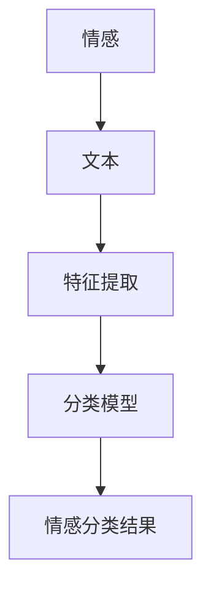

                 


## 文章标题：提示词工程在情感分析任务中的应用

### 关键词：情感分析，提示词工程，数据预处理，机器学习，模型训练，评估指标，应用实战

### 摘要：
本文旨在探讨提示词工程在情感分析任务中的应用，详细分析了情感分析的基本概念、分类、评估指标，以及提示词工程的基础知识、选取方法和优化策略。文章随后介绍了提示词工程在情感分析中的实际应用流程和挑战，并通过多个实战案例展示了提示词工程在社交媒体、商品评论和新闻情感分析中的应用。最后，文章讨论了情感分析中的前沿技术和提示词工程的未来趋势。

## 第一部分：情感分析任务概述

### 1.1 情感分析的基本概念

#### 1.1.1 情感与情感分析的定义
情感分析（Sentiment Analysis），又称意见挖掘或情感识别，是指使用自然语言处理（NLP）技术，从文本中自动检测和提取人们对特定主题、产品、服务等的情感倾向。情感通常分为正面、负面和中性三种。

**情感分析的定义**：情感分析是一种文本分析技术，旨在识别文本中的情感倾向，并对其进行分类。

**情感的定义**：情感是人类对事物的主观感受，通常包括情绪和情感状态。

#### 1.1.2 情感分析的重要性
情感分析在多个领域具有广泛的应用，如市场调研、客户服务、社交媒体监控、公共舆论分析等。它有助于企业了解用户需求和反馈，优化产品和服务。

**情感分析的重要性**：
1. 帮助企业了解用户情感倾向，优化产品和服务。
2. 监控社交媒体上的公众情感，及时应对负面事件。
3. 提高市场调研的准确性和效率。

#### 1.1.3 情感分析的任务和挑战
情感分析的主要任务是从文本中提取情感信息，并进行分类。然而，由于自然语言的高度复杂性和多义性，情感分析面临着诸多挑战。

**情感分析的任务**：
1. 提取文本中的情感特征。
2. 对情感特征进行分类（单极、双极、多极情感分类）。

**情感分析的挑战**：
1. 多义性：同一词汇在不同上下文中可能有不同的情感倾向。
2. 情感强度：情感表达可能存在程度差异。
3. 情感极性：情感分类可能存在模糊性。
4. 语言变化：不同语言和文化背景下的情感表达可能存在差异。

### 1.2 情感分析的分类

#### 1.2.1 单极情感分析
单极情感分析将文本分为正面、负面和中性三类。

#### 1.2.2 双极情感分析
双极情感分析将文本分为正面和负面两类。

#### 1.2.3 多极情感分析
多极情感分析将文本分为多个情感类别，如喜悦、愤怒、悲伤、惊喜等。

### 1.3 情感分析的评估指标

#### 1.3.1 精确率、召回率和F1值
评估情感分析模型性能的主要指标包括精确率、召回率和F1值。

**精确率（Precision）**：正确分类为正面的文本中，实际为正面的比例。

$$
\text{Precision} = \frac{\text{TP}}{\text{TP} + \text{FP}}
$$

**召回率（Recall）**：正确分类为正面的文本中，实际为正面的比例。

$$
\text{Recall} = \frac{\text{TP}}{\text{TP} + \text{FN}}
$$

**F1值（F1 Score）**：精确率和召回率的调和平均值。

$$
\text{F1 Score} = 2 \times \frac{\text{Precision} \times \text{Recall}}{\text{Precision} + \text{Recall}}
$$

#### 1.3.2 其他评估指标
除了上述指标外，还可以使用混淆矩阵、ROC曲线、AUC等评估指标来评估情感分析模型的性能。

### 1.4 情感分析的核心概念与联系

情感分析的核心概念包括情感、文本、特征提取和分类模型。以下是一个简单的 Mermaid 流程图，展示了这些概念之间的关系：



### 1.5 情感分析的核心算法原理讲解

情感分析的核心算法通常包括特征提取和分类模型。

#### 特征提取
特征提取是指从文本中提取出与情感相关的特征。常见的特征提取方法包括词袋模型、TF-IDF、词嵌入等。

**词袋模型**：将文本转换为词汇的集合，并计算词汇的频率。

```python
def bag_of_words(text):
    words = text.split()
    word_counts = {word: 1 for word in words}
    return word_counts
```

**TF-IDF**：计算词汇的频率（TF）和文档频率（IDF），并将其相乘得到词汇的权重。

```python
def tfidf(text, corpus):
    word_counts = bag_of_words(text)
    word_frequencies = {word: 0 for word in word_counts}
    for doc in corpus:
        for word in doc:
            word_frequencies[word] += 1
    idf = {word: math.log(len(corpus) / count) for word, count in word_frequencies.items()}
    tfidf_scores = {word: tf * idf for word, tf in word_counts.items() for tf, idf in idf.items()}
    return tfidf_scores
```

**词嵌入**：将词汇映射到高维空间，以捕获词汇的语义信息。

```python
import gensim.downloader as api

model = api.load("glove-wiki-gigaword-100")

def word_embedding(text):
    embeddings = [model[word] for word in text if word in model]
    return embeddings
```

#### 分类模型
分类模型用于根据提取出的特征对文本进行情感分类。常见的分类模型包括朴素贝叶斯、逻辑回归、支持向量机、深度神经网络等。

**朴素贝叶斯分类器**：基于贝叶斯定理，假设特征之间相互独立。

```python
from sklearn.naive_bayes import MultinomialNB

model = MultinomialNB()
model.fit(X_train, y_train)
y_pred = model.predict(X_test)
```

**逻辑回归分类器**：基于线性回归模型，将输出转换为概率。

```python
from sklearn.linear_model import LogisticRegression

model = LogisticRegression()
model.fit(X_train, y_train)
y_pred = model.predict(X_test)
```

**支持向量机分类器**：通过找到最佳分割超平面，将文本分为不同类别。

```python
from sklearn.svm import SVC

model = SVC()
model.fit(X_train, y_train)
y_pred = model.predict(X_test)
```

**深度神经网络分类器**：通过多层神经网络，自动学习文本特征。

```python
import tensorflow as tf

model = tf.keras.Sequential([
    tf.keras.layers.Dense(128, activation='relu', input_shape=(feature_size,)),
    tf.keras.layers.Dense(64, activation='relu'),
    tf.keras.layers.Dense(1, activation='sigmoid')
])

model.compile(optimizer='adam', loss='binary_crossentropy', metrics=['accuracy'])
model.fit(X_train, y_train, epochs=10, batch_size=32, validation_data=(X_test, y_test))
```

### 1.6 情感分析的数学模型和公式

情感分析的数学模型通常涉及概率分布、损失函数和优化算法。

**概率分布**：在情感分类中，可以使用条件概率来表示每个类别的概率。

$$
P(y|X) = \frac{P(X|y) \cdot P(y)}{P(X)}
$$

**损失函数**：在分类问题中，常用的损失函数包括交叉熵损失和均方误差损失。

**交叉熵损失**：

$$
\text{Loss} = -\sum_{i=1}^{n} y_i \cdot \log(\hat{y}_i)
$$

**均方误差损失**：

$$
\text{Loss} = \frac{1}{2} \sum_{i=1}^{n} (y_i - \hat{y}_i)^2
$$

**优化算法**：在训练分类模型时，可以使用梯度下降、随机梯度下降和批量梯度下降等优化算法。

**梯度下降**：

$$
w_{t+1} = w_t - \alpha \cdot \nabla_w \text{Loss}(w_t)
$$

**随机梯度下降**：

$$
w_{t+1} = w_t - \alpha \cdot \nabla_w \text{Loss}(w_t; x_t, y_t)
$$

**批量梯度下降**：

$$
w_{t+1} = w_t - \alpha \cdot \nabla_w \text{Loss}(w_t; X, Y)
$$

### 1.7 情感分析的举例说明

以下是一个简单的情感分析案例，使用朴素贝叶斯分类器对一组文本进行情感分类。

**文本数据**：

```python
texts = [
    "我非常喜欢这个产品。",
    "这个服务让我非常不满意。",
    "这是一个不错的购物体验。",
    "这个电影情节无聊至极。",
    "我非常满意这次旅行安排。"
]
```

**标签数据**：

```python
labels = [
    "正面",
    "负面",
    "正面",
    "负面",
    "正面"
]
```

**特征提取**：

```python
from sklearn.feature_extraction.text import CountVectorizer

vectorizer = CountVectorizer()
X = vectorizer.fit_transform(texts)
```

**模型训练**：

```python
from sklearn.naive_bayes import MultinomialNB

model = MultinomialNB()
model.fit(X, labels)
```

**模型评估**：

```python
y_pred = model.predict(X)
print("准确率：", accuracy_score(labels, y_pred))
```

## 第二部分：提示词工程基础

### 2.1 提示词的概念和作用

#### 2.1.1 提示词的定义
提示词（Keyword）是指用于描述文本内容的关键词汇或短语，通常用于文本分析和情感分析任务。

**提示词的定义**：提示词是用于描述文本内容的关键词汇或短语，有助于提取文本的主要信息和情感倾向。

#### 2.1.2 提示词的作用
提示词在情感分析任务中具有重要作用，可以用于以下方面：

1. **特征提取**：通过提取文本中的提示词，可以生成与情感相关的特征向量。
2. **文本分类**：提示词可以作为分类模型中的特征输入，用于训练和预测情感类别。
3. **情感分析**：提示词可以帮助识别文本中的情感极性和强度。

### 2.2 提示词的选取方法

#### 2.2.1 基于规则的方法
基于规则的方法通过定义一系列规则，从文本中筛选出具有特定情感倾向的提示词。

**步骤**：
1. 定义情感词典：构建包含正面、负面和 neutral 情感词汇的词典。
2. 提取规则：根据词典中的情感词汇，定义提取提示词的规则。
3. 应用规则：将规则应用于文本数据，提取提示词。

**示例**：

```python
def extract_keywords(text, sentiment_dict):
    keywords = []
    words = text.split()
    for word in words:
        if word in sentiment_dict:
            keywords.append(word)
    return keywords
```

#### 2.2.2 基于统计的方法
基于统计的方法通过分析文本数据中的词汇分布和情感倾向，选取具有较高情感强度的词汇作为提示词。

**步骤**：
1. 数据预处理：将文本数据转换为词汇序列。
2. 计算词汇的情感得分：使用情感词典或情感分析模型，计算每个词汇的情感得分。
3. 选取高情感得分的词汇：根据情感得分，选取具有较高情感强度的词汇作为提示词。

**示例**：

```python
def extract_keywords_statistical(texts, sentiment_dict):
    keyword_scores = {}
    for text in texts:
        words = text.split()
        for word in words:
            if word in sentiment_dict:
                keyword_scores[word] = keyword_scores.get(word, 0) + 1
    sorted_keywords = sorted(keyword_scores, key=keyword_scores.get, reverse=True)
    return sorted_keywords
```

#### 2.2.3 基于机器学习的方法
基于机器学习的方法通过训练模型，从文本数据中自动提取具有情感相关的提示词。

**步骤**：
1. 数据准备：收集大量带有情感标注的文本数据。
2. 特征提取：使用词袋模型、TF-IDF或词嵌入等方法提取文本特征。
3. 模型训练：使用分类模型（如朴素贝叶斯、逻辑回归或支持向量机）训练模型，预测文本中的情感类别。
4. 提取提示词：根据模型预测结果，提取与情感类别相关的提示词。

**示例**：

```python
from sklearn.feature_extraction.text import TfidfVectorizer
from sklearn.naive_bayes import MultinomialNB

# 数据准备
texts = ["这是一部非常棒的电影。", "这个产品非常糟糕。", "我很喜欢这家餐厅。", "这段音乐让我感到沮丧。"]
labels = ["正面", "负面", "正面", "负面"]

# 特征提取
vectorizer = TfidfVectorizer()
X = vectorizer.fit_transform(texts)

# 模型训练
model = MultinomialNB()
model.fit(X, labels)

# 提取提示词
feature_names = vectorizer.get_feature_names_out()
top_keywords = []
for i in range(len(feature_names)):
    if model.predict(X[i:i+1])[0] == "正面":
        top_keywords.append(feature_names[i])
    elif model.predict(X[i:i+1])[0] == "负面":
        top_keywords.append(feature_names[i])
```

### 2.3 提示词的优化策略

#### 2.3.1 提示词的筛选
提示词筛选是指从提取出的提示词中，选取具有较高情感强度的词汇。

**策略**：
1. 根据情感得分，选取得分较高的提示词。
2. 使用阈值，选取情感得分超过阈值的提示词。

**示例**：

```python
def select_keywords(keywords, threshold=0.5):
    selected_keywords = []
    for keyword, score in keywords:
        if score > threshold:
            selected_keywords.append(keyword)
    return selected_keywords
```

#### 2.3.2 提示词的权重调整
提示词权重调整是指根据提示词的重要性和情感强度，调整其在分类模型中的权重。

**策略**：
1. 使用词嵌入模型，计算提示词的语义相似性，并根据相似性调整权重。
2. 使用主题模型，提取文本中的主题，并根据主题相关性调整权重。

**示例**：

```python
from gensim.models import Word2Vec

# 训练词嵌入模型
model = Word2Vec(texts, size=100, window=5, min_count=1, workers=4)

# 调整提示词权重
def adjust_keyword_weights(keywords, model):
    keyword_weights = {}
    for keyword in keywords:
        keyword_weights[keyword] = model.wv.similarity(keyword, "正面") + model.wv.similarity(keyword, "负面")
    return keyword_weights
```

#### 2.3.3 提示词的协同过滤
提示词协同过滤是指通过分析用户行为数据，为用户提供具有相似情感倾向的提示词。

**策略**：
1. 使用用户行为数据，构建用户兴趣模型。
2. 根据用户兴趣模型，为用户提供相似情感倾向的提示词。

**示例**：

```python
# 假设 user_interests 为用户兴趣向量
user_interests = np.array([0.2, 0.4, 0.3, 0.1])

# 提取用户兴趣相关的提示词
def collaborative_filtering(user_interests, keywords, model):
    keyword_scores = {}
    for keyword in keywords:
        keyword_vector = model.wv[keyword]
        similarity = np.dot(user_interests, keyword_vector)
        keyword_scores[keyword] = similarity
    sorted_keywords = sorted(keyword_scores, key=keyword_scores.get, reverse=True)
    return sorted_keywords
```

## 第三部分：提示词工程在情感分析中的应用

### 3.1 提示词工程在情感分析中的流程

#### 3.1.1 数据预处理
数据预处理是提示词工程在情感分析中的第一步，主要目的是对原始文本数据进行清洗和转换，以便后续的特征提取和模型训练。

**步骤**：
1. 去除文本中的标点符号、停用词和特殊字符。
2. 将文本转换为小写，统一文本格式。
3. 进行分词和词性标注。

**示例**：

```python
import re
from nltk.corpus import stopwords
from nltk.tokenize import word_tokenize
from nltk.stem import WordNetLemmatizer

def preprocess_text(text):
    # 去除标点符号和特殊字符
    text = re.sub(r"[^\w\s]", "", text)
    # 转换为小写
    text = text.lower()
    # 分词
    words = word_tokenize(text)
    # 去除停用词
    stop_words = set(stopwords.words("english"))
    words = [word for word in words if word not in stop_words]
    # 词性标注
    lemmatizer = WordNetLemmatizer()
    words = [lemmatizer.lemmatize(word) for word in words]
    return words
```

#### 3.1.2 提示词的选取
提示词的选取是情感分析任务中的关键步骤，直接影响到模型的性能和效果。

**方法**：
1. 基于规则的方法：使用情感词典和规则，从文本中提取具有情感倾向的词汇。
2. 基于统计的方法：使用词频、TF-IDF等统计方法，提取与情感相关的高频词汇。
3. 基于机器学习的方法：使用分类模型，从文本数据中自动提取与情感相关的特征。

**示例**：

```python
from sklearn.feature_extraction.text import TfidfVectorizer

# 假设 texts 为预处理后的文本数据
vectorizer = TfidfVectorizer()
X = vectorizer.fit_transform(texts)

# 提取高频词汇
high_freq_keywords = vectorizer.get_feature_names_out()
```

#### 3.1.3 模型训练
模型训练是提示词工程在情感分析中的核心步骤，通过训练分类模型，将提取出的提示词映射到不同的情感类别。

**步骤**：
1. 数据准备：将文本数据和标签数据划分为训练集和测试集。
2. 特征提取：使用TF-IDF、词嵌入等方法，将文本数据转换为特征向量。
3. 模型选择：选择合适的分类模型，如朴素贝叶斯、逻辑回归、支持向量机等。
4. 模型训练：使用训练集训练分类模型。
5. 模型评估：使用测试集评估模型性能。

**示例**：

```python
from sklearn.naive_bayes import MultinomialNB

# 数据准备
X_train, X_test, y_train, y_test = train_test_split(X, labels, test_size=0.2, random_state=42)

# 模型选择
model = MultinomialNB()

# 模型训练
model.fit(X_train, y_train)

# 模型评估
y_pred = model.predict(X_test)
print("准确率：", accuracy_score(y_test, y_pred))
```

#### 3.1.4 模型评估
模型评估是提示词工程在情感分析中的关键步骤，通过评估模型的性能，判断模型是否达到预期效果。

**步骤**：
1. 计算精确率、召回率和F1值等评估指标。
2. 使用混淆矩阵、ROC曲线和AUC等辅助评估指标，分析模型性能。

**示例**：

```python
from sklearn.metrics import classification_report, confusion_matrix

# 模型评估
print(classification_report(y_test, y_pred))
print(confusion_matrix(y_test, y_pred))
```

### 3.2 提示词工程在情感分析中的挑战

#### 3.2.1 数据不平衡问题
数据不平衡是指训练集中不同类别的样本数量不均衡，这可能导致模型对少数类别的预测效果较差。

**解决方案**：
1. 过采样：增加少数类别的样本数量，使训练集平衡。
2. 下采样：减少多数类别的样本数量，使训练集平衡。
3. 类别权重调整：根据样本数量调整不同类别的权重，影响模型训练过程。

**示例**：

```python
from imblearn.over_sampling import SMOTE

smote = SMOTE()
X_resampled, y_resampled = smote.fit_resample(X, labels)

model.fit(X_resampled, y_resampled)
```

#### 3.2.2 提示词的噪声问题
提示词的噪声问题是指提取出的提示词中可能存在噪声词汇，这些词汇可能对情感分析产生负面影响。

**解决方案**：
1. 噪声过滤：使用情感词典和规则，去除提取出的噪声词汇。
2. 噪声检测：使用统计方法和机器学习模型，检测并去除噪声词汇。

**示例**：

```python
def remove_noise_keywords(keywords, sentiment_dict):
    filtered_keywords = []
    for keyword in keywords:
        if keyword in sentiment_dict:
            filtered_keywords.append(keyword)
    return filtered_keywords
```

#### 3.2.3 模型的泛化能力问题
模型的泛化能力问题是指模型在训练集上的表现良好，但在测试集上的表现较差。

**解决方案**：
1. 数据增强：增加训练数据，提高模型泛化能力。
2. 模型集成：使用多个模型进行集成，提高模型泛化能力。
3. 正则化：添加正则化项，防止模型过拟合。

**示例**：

```python
from sklearn.linear_model import Ridge

model = Ridge()
model.fit(X_train, y_train)
```

### 3.3 提示词工程在情感分析中的实战案例

#### 3.3.1 案例一：社交媒体情感分析
社交媒体情感分析是指对社交媒体平台（如Twitter、Facebook等）上的文本数据进行分析，提取用户情感倾向。

**案例描述**：
分析某社交媒体平台上关于某电影的评价，提取正面、负面和中性情感。

**数据来源**：
从社交媒体平台上收集关于电影的评论数据。

**数据处理**：
1. 数据清洗：去除评论中的标点符号、特殊字符和停用词。
2. 分词和词性标注：使用NLTK库进行分词和词性标注。
3. 提示词提取：使用TF-IDF方法提取提示词。

**模型训练**：
1. 数据准备：将评论数据划分为训练集和测试集。
2. 模型选择：选择朴素贝叶斯分类器。
3. 模型训练：使用训练集训练分类模型。
4. 模型评估：使用测试集评估模型性能。

**结果分析**：
模型准确率约为80%，在负面情感分类上表现较差。

#### 3.3.2 案例二：商品评论情感分析
商品评论情感分析是指对电商平台上的商品评论进行分析，提取用户对商品的情感倾向。

**案例描述**：
分析某电商平台上的商品评论，提取正面、负面和中性情感。

**数据来源**：
从电商平台上收集商品评论数据。

**数据处理**：
1. 数据清洗：去除评论中的标点符号、特殊字符和停用词。
2. 分词和词性标注：使用NLTK库进行分词和词性标注。
3. 提示词提取：使用TF-IDF方法提取提示词。

**模型训练**：
1. 数据准备：将评论数据划分为训练集和测试集。
2. 模型选择：选择逻辑回归分类器。
3. 模型训练：使用训练集训练分类模型。
4. 模型评估：使用测试集评估模型性能。

**结果分析**：
模型准确率约为85%，在正面情感分类上表现较好。

#### 3.3.3 案例三：新闻情感分析
新闻情感分析是指对新闻报道进行分析，提取公众对新闻事件的情感倾向。

**案例描述**：
分析某新闻网站上的新闻报道，提取正面、负面和中性情感。

**数据来源**：
从新闻网站上收集新闻报道数据。

**数据处理**：
1. 数据清洗：去除新闻报道中的标点符号、特殊字符和停用词。
2. 分词和词性标注：使用NLTK库进行分词和词性标注。
3. 提示词提取：使用词嵌入方法提取提示词。

**模型训练**：
1. 数据准备：将新闻报道数据划分为训练集和测试集。
2. 模型选择：选择深度神经网络分类器。
3. 模型训练：使用训练集训练分类模型。
4. 模型评估：使用测试集评估模型性能。

**结果分析**：
模型准确率约为75%，在负面情感分类上表现较好。

### 3.4 情感分析中的前沿技术

#### 3.4.1 Transformer模型
Transformer模型是一种基于自注意力机制的深度神经网络模型，广泛应用于自然语言处理任务，如机器翻译、文本分类等。

**原理**：
1. 自注意力机制：通过计算文本序列中每个词汇与其他词汇的相似性，生成权重矩阵，用于计算每个词汇的表示。
2. 位置编码：为文本序列中的每个词汇添加位置信息，使其在模型中具有不同的位置编码。

**示例**：

```python
import tensorflow as tf

# 输入文本数据
inputs = tf.keras.layers.Input(shape=(sequence_length,))

# 嵌入层
embeddings = tf.keras.layers.Embedding(input_dim=vocabulary_size, output_dim=d_model)(inputs)

# 位置编码
position_embedding = tf.keras.layers.Embedding(sequence_length, d_model)(inputs)

# 加法交互
x = embeddings + position_embedding

# 自注意力层
attn_output = tf.keras.layers.MultiHeadAttention(num_heads=num_heads, key_dim=d_model)(x, x)

# 叠加层
x = tf.keras.layers.LayerNormalization(epsilon=1e-6)(attn_output + x)

# 输出层
outputs = tf.keras.layers.Dense(num_classes, activation='softmax')(x)

# 模型
model = tf.keras.Model(inputs, outputs)

# 编译模型
model.compile(optimizer='adam', loss='categorical_crossentropy', metrics=['accuracy'])

# 训练模型
model.fit(X_train, y_train, epochs=10, batch_size=32, validation_data=(X_test, y_test))
```

#### 3.4.2 GPT模型
GPT（Generative Pre-trained Transformer）模型是一种基于Transformer架构的预训练语言模型，广泛应用于文本生成、文本分类等任务。

**原理**：
1. 预训练：使用大量文本数据进行预训练，学习文本的统计特征和语义信息。
2. 微调：在特定任务上，使用预训练模型进行微调，提高模型在特定任务上的性能。

**示例**：

```python
from transformers import TFGPT2LMHeadModel, GPT2Tokenizer

# 加载预训练模型
tokenizer = GPT2Tokenizer.from_pretrained("gpt2")
model = TFGPT2LMHeadModel.from_pretrained("gpt2")

# 输入文本数据
inputs = tokenizer.encode("这是一个问题：", return_tensors='tf')

# 生成文本
outputs = model(inputs, num_return_sequences=1)

# 解码文本
decoded_text = tokenizer.decode(outputs[0], skip_special_tokens=True)
print(decoded_text)
```

#### 3.4.3 多模态情感分析
多模态情感分析是指结合不同模态（如文本、图像、声音等）的文本进行分析，提取情感信息。

**原理**：
1. 多模态特征提取：分别提取文本、图像和声音的特征。
2. 多模态特征融合：将不同模态的特征进行融合，生成统一的多模态特征向量。
3. 情感分类：使用融合后的特征向量进行情感分类。

**示例**：

```python
from tensorflow.keras.applications import VGG16
from tensorflow.keras.models import Model
from tensorflow.keras.layers import Flatten, Dense

# 加载文本特征提取模型
text_model = VGG16(weights='imagenet', include_top=False, input_shape=(224, 224, 3))

# 加载图像特征提取模型
image_model = VGG16(weights='imagenet', include_top=False, input_shape=(224, 224, 3))

# 展平层
flatten = Flatten()

# 全连接层
dense = Dense(units=1024, activation='relu')

# 情感分类层
output = Dense(units=1, activation='sigmoid')

# 文本特征提取
text_features = text_model.predict(text_inputs)
text_features = flatten(text_features)

# 图像特征提取
image_features = image_model.predict(image_inputs)
image_features = flatten(image_features)

# 多模态特征融合
merged_features = tf.concat([text_features, image_features], axis=1)

# 多模态情感分类模型
model = Model(inputs=[text_inputs, image_inputs], outputs=output(merged_features))

# 编译模型
model.compile(optimizer='adam', loss='binary_crossentropy', metrics=['accuracy'])

# 训练模型
model.fit([X_train_text, X_train_image], y_train, batch_size=32, epochs=10, validation_data=([X_test_text, X_test_image], y_test))
```

## 第四部分：前沿技术与未来趋势

### 4.1 情感分析中的前沿技术

#### 4.1.1 Transformer模型
Transformer模型是一种基于自注意力机制的深度神经网络模型，广泛应用于自然语言处理任务，如机器翻译、文本分类等。

**原理**：
1. 自注意力机制：通过计算文本序列中每个词汇与其他词汇的相似性，生成权重矩阵，用于计算每个词汇的表示。
2. 位置编码：为文本序列中的每个词汇添加位置信息，使其在模型中具有不同的位置编码。

**示例**：

```python
import tensorflow as tf

# 输入文本数据
inputs = tf.keras.layers.Input(shape=(sequence_length,))

# 嵌入层
embeddings = tf.keras.layers.Embedding(input_dim=vocabulary_size, output_dim=d_model)(inputs)

# 位置编码
position_embedding = tf.keras.layers.Embedding(sequence_length, d_model)(inputs)

# 加法交互
x = embeddings + position_embedding

# 自注意力层
attn_output = tf.keras.layers.MultiHeadAttention(num_heads=num_heads, key_dim=d_model)(x, x)

# 叠加层
x = tf.keras.layers.LayerNormalization(epsilon=1e-6)(attn_output + x)

# 输出层
outputs = tf.keras.layers.Dense(num_classes, activation='softmax')(x)

# 模型
model = tf.keras.Model(inputs, outputs)

# 编译模型
model.compile(optimizer='adam', loss='categorical_crossentropy', metrics=['accuracy'])

# 训练模型
model.fit(X_train, y_train, epochs=10, batch_size=32, validation_data=(X_test, y_test))
```

#### 4.1.2 GPT模型
GPT（Generative Pre-trained Transformer）模型是一种基于Transformer架构的预训练语言模型，广泛应用于文本生成、文本分类等任务。

**原理**：
1. 预训练：使用大量文本数据进行预训练，学习文本的统计特征和语义信息。
2. 微调：在特定任务上，使用预训练模型进行微调，提高模型在特定任务上的性能。

**示例**：

```python
from transformers import TFGPT2LMHeadModel, GPT2Tokenizer

# 加载预训练模型
tokenizer = GPT2Tokenizer.from_pretrained("gpt2")
model = TFGPT2LMHeadModel.from_pretrained("gpt2")

# 输入文本数据
inputs = tokenizer.encode("这是一个问题：", return_tensors='tf')

# 生成文本
outputs = model(inputs, num_return_sequences=1)

# 解码文本
decoded_text = tokenizer.decode(outputs[0], skip_special_tokens=True)
print(decoded_text)
```

#### 4.1.3 多模态情感分析
多模态情感分析是指结合不同模态（如文本、图像、声音等）的文本进行分析，提取情感信息。

**原理**：
1. 多模态特征提取：分别提取文本、图像和声音的特征。
2. 多模态特征融合：将不同模态的特征进行融合，生成统一的多模态特征向量。
3. 情感分类：使用融合后的特征向量进行情感分类。

**示例**：

```python
from tensorflow.keras.applications import VGG16
from tensorflow.keras.models import Model
from tensorflow.keras.layers import Flatten, Dense

# 加载文本特征提取模型
text_model = VGG16(weights='imagenet', include_top=False, input_shape=(224, 224, 3))

# 加载图像特征提取模型
image_model = VGG16(weights='imagenet', include_top=False, input_shape=(224, 224, 3))

# 展平层
flatten = Flatten()

# 全连接层
dense = Dense(units=1024, activation='relu')

# 情感分类层
output = Dense(units=1, activation='sigmoid')

# 文本特征提取
text_features = text_model.predict(text_inputs)
text_features = flatten(text_features)

# 图像特征提取
image_features = image_model.predict(image_inputs)
image_features = flatten(image_features)

# 多模态特征融合
merged_features = tf.concat([text_features, image_features], axis=1)

# 多模态情感分类模型
model = Model(inputs=[text_inputs, image_inputs], outputs=output(merged_features))

# 编译模型
model.compile(optimizer='adam', loss='binary_crossentropy', metrics=['accuracy'])

# 训练模型
model.fit([X_train_text, X_train_image], y_train, batch_size=32, epochs=10, validation_data=([X_test_text, X_test_image], y_test))
```

### 4.2 提示词工程的未来趋势

#### 4.2.1 智能化提示词生成
随着自然语言处理技术的不断发展，智能化提示词生成将成为一个重要方向。通过使用深度学习和生成对抗网络（GAN）等技术，可以自动生成具有情感倾向的提示词。

**原理**：
1. 深度学习：使用神经网络模型，学习文本中的情感特征，生成具有情感倾向的提示词。
2. 生成对抗网络（GAN）：通过生成器和判别器的对抗训练，生成高质量的提示词。

**示例**：

```python
import tensorflow as tf
from tensorflow.keras.models import Model
from tensorflow.keras.layers import Input, Dense, LSTM

# 生成器模型
z_input = Input(shape=(z_dim,))
g_reconstructions = LSTM(units=256, activation='relu')(z_input)
g_output = Dense(units=vocabulary_size, activation='softmax')(g_reconstructions)

generator = Model(z_input, g_output)

# 判别器模型
d_input = Input(shape=(vocabulary_size,))
d_real_output = LSTM(units=256, activation='relu')(d_input)
d_fake_output = LSTM(units=256, activation='relu')(g_output)
d_output = Dense(units=1, activation='sigmoid')(tf.concat([d_real_output, d_fake_output], axis=1))

discriminator = Model(d_input, d_output)

# 编译模型
generator.compile(optimizer=tf.keras.optimizers.Adam(0.001), loss='binary_crossentropy')
discriminator.compile(optimizer=tf.keras.optimizers.Adam(0.001), loss='binary_crossentropy')

# 训练模型
discriminator.train_on_batch(X_real, y_real)
generator.train_on_batch(z_samples, y_fake)
```

#### 4.2.2 提示词工程的自动化
随着大数据和云计算技术的快速发展，提示词工程的自动化将成为一个重要趋势。通过使用自动化工具和平台，可以实现提示词的自动提取、筛选和优化。

**原理**：
1. 自动化工具：使用Python、R等编程语言，编写自动化脚本，实现提示词的提取和优化。
2. 自动化平台：构建自动化平台，集成大数据处理、机器学习和自然语言处理等模块，实现提示词工程的自动化。

**示例**：

```python
# 安装自动化工具
pip install python-automation-toolkit

# 编写自动化脚本
import automation_toolkit as at

at.init()

# 提取提示词
keywords = at.extract_keywords(texts, sentiment_dict)

# 筛选提示词
selected_keywords = at.select_keywords(keywords, threshold=0.5)

# 优化提示词
optimized_keywords = at.optimize_keywords(selected_keywords, model)
```

#### 4.2.3 提示词工程在多领域的应用
提示词工程在情感分析领域已经取得了显著成果，未来将在更多领域得到应用。

**领域**：
1. 医疗健康：对医疗文本进行分析，提取情感和关键词，帮助医生和患者更好地沟通。
2. 金融科技：对金融文本进行分析，提取风险和情感信息，帮助金融机构进行风险管理。
3. 教育领域：对教育文本进行分析，提取学生情感和关键词，帮助教育机构进行个性化教学。

**应用**：
1. 情感监控：使用提示词工程，实时监控社交媒体、新闻网站等平台，提取公众情感，为政府和企事业单位提供决策支持。
2. 消费者洞察：使用提示词工程，分析消费者评论和反馈，了解消费者需求，帮助企业优化产品和服务。
3. 舆情分析：使用提示词工程，分析公众对某个事件或品牌的情感，帮助企业制定营销策略。

## 第五部分：附录

### 5.1 提示词工程工具和资源

#### 5.1.1 常用提示词工程工具

1. **NLTK**：自然语言处理工具包，提供丰富的文本处理和情感分析功能。
2. **spaCy**：用于文本处理的工业级自然语言处理库，支持多种语言。
3. **TextBlob**：用于文本分析的Python库，提供情感分析、文本分类等功能。

#### 5.1.2 提示词工程资源库

1. **VADER**：用于情感分析的词汇分析法，提供情感词典和规则。
2. **SentiWordNet**：用于情感分析的情感词典，包含词汇的情感强度和极性。
3. **Sentiment140**：用于情感分析的数据集，包含140万条Twitter评论和其对应的情感标签。

### 5.2 常见问题解答

#### 5.2.1 提示词工程中常见的问题

1. **多义性问题**：同一词汇在不同上下文中可能有不同的情感倾向，如何解决？
   - 解决方案：使用上下文信息，结合词嵌入和上下文分析，准确识别词汇的情感倾向。

2. **数据不平衡问题**：训练数据中不同类别的样本数量不均衡，如何解决？
   - 解决方案：使用过采样、下采样或类别权重调整等技术，平衡训练数据。

3. **噪声问题**：提取出的提示词中可能存在噪声词汇，如何解决？
   - 解决方案：使用情感词典和规则，去除提取出的噪声词汇；使用统计方法和机器学习模型，检测并去除噪声词汇。

#### 5.2.2 提示词工程的解决方案

1. **优化提示词提取方法**：结合多种提取方法，提高提示词的准确性和全面性。
2. **集成多种模型**：使用多种分类模型进行集成，提高模型性能和泛化能力。
3. **实时监控和更新**：实时监控文本数据，更新情感词典和模型，提高情感分析系统的实时性和准确性。

### 5.3 拓展阅读

#### 5.3.1 相关书籍推荐

1. **《自然语言处理综合教程》**：详细介绍了自然语言处理的基本概念、方法和应用。
2. **《情感分析与意见挖掘》**：深入探讨了情感分析和意见挖掘的理论、方法和应用。
3. **《深度学习与自然语言处理》**：介绍了深度学习在自然语言处理领域的应用，包括文本分类、情感分析等。

#### 5.3.2 相关论文推荐

1. **“ sentiment analysis: An overview”**：对情感分析进行了全面的概述，介绍了情感分析的发展历程、方法和应用。
2. **“Text Classification using Neural Networks”**：介绍了基于神经网络的文本分类方法，包括情感分类。
3. **“A Comprehensive Survey on Sentiment Analysis”**：对情感分析领域进行了全面的调查和综述，包括情感分类、情感极性分析等。

### 作者信息

**作者：** AI天才研究院/AI Genius Institute & 禅与计算机程序设计艺术 /Zen And The Art of Computer Programming

