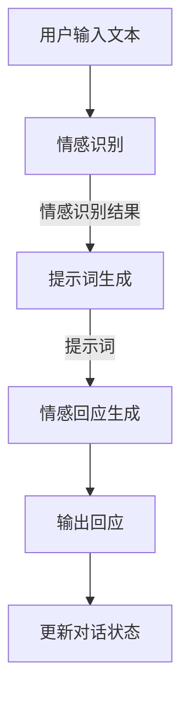
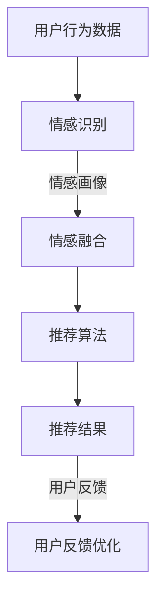

                 

### 文章标题

《提示词工程在情感智能中的突破》

### 关键词

情感智能、提示词工程、自然语言处理、人工智能、聊天机器人、推荐系统、心理健康。

### 摘要

随着人工智能技术的不断发展，情感智能逐渐成为研究的热点。本文主要探讨了提示词工程在情感智能中的突破，从基础概念、技术原理到实际应用，系统地阐述了提示词工程在情感智能领域的重要作用。文章首先介绍了情感智能的定义、重要性及发展历史，接着详细讲解了提示词工程的基本概念、目标和应用领域。随后，文章深入分析了情感分析算法和提示词生成算法的原理，并探讨了情感智能在聊天机器人、社交媒体分析和智能推荐系统等实际应用中的关键模块。最后，文章通过一个社交媒体情感分析项目实战，展示了提示词工程在情感智能应用中的具体实现和效果。

## 第一部分：情感智能与提示词工程基础

### 第1章：情感智能概述

#### 1.1 情感智能的概念

情感智能是指个体识别、理解、处理和表达情感的能力。与传统的认知智能（如逻辑推理、记忆等）不同，情感智能更多地关注个体的情感体验和情感反应。情感智能不仅涉及到识别和表达自己的情感，还包括理解他人的情感和情感调节。

在计算机领域，情感智能是指通过模拟人类情感识别、理解和表达的能力，使计算机能够处理和理解人类情感。这包括情感分析、情感识别、情感模拟等关键技术。

#### 1.2 情感智能与传统人工智能的区别

传统人工智能主要关注逻辑推理、知识表示和问题求解等领域。它依赖于明确的规则和算法，通常不涉及情感因素。而情感智能则更加注重人类情感的识别、理解和表达，它要求计算机具备感知和理解情感的能力，能够与人类进行情感交流。

情感智能的关键在于情感建模和情感交互。情感建模是指构建计算机能够理解和处理情感的模型；情感交互是指通过这些模型实现计算机与人类的情感交流。

#### 1.3 情感智能的重要性

情感智能在人类生活中具有重要作用。它不仅影响着个体的心理健康和社会交往，还影响着决策和行为。在商业和社会领域，情感智能同样具有重要的应用价值。

首先，情感智能可以帮助企业更好地了解消费者的需求和情感，从而提供更加个性化的服务和产品。例如，通过情感智能分析消费者在社交媒体上的评论和反馈，企业可以及时调整营销策略和产品开发方向。

其次，情感智能在社交和心理健康领域也发挥着重要作用。通过情感识别和情感调节技术，计算机可以帮助人们更好地理解和管理自己的情感，提高心理健康水平。例如，聊天机器人可以通过情感智能与用户进行互动，提供心理支持和建议。

此外，情感智能在教育、医疗、金融等领域也具有广泛的应用前景。在教育领域，情感智能可以帮助教师更好地了解学生的情感状态，提供个性化的教学方案。在医疗领域，情感智能可以帮助医生更好地了解患者的情感需求，提高医疗服务质量。在金融领域，情感智能可以帮助金融机构更好地了解投资者的情感波动，提供更加精准的投资建议。

总之，情感智能在人类生活和商业应用中具有重要作用。随着人工智能技术的不断发展，情感智能有望在更多领域发挥更大的作用。

### 第2章：提示词工程的基本概念

#### 2.1 提示词工程的定义

提示词工程（Keyword Engineering）是指通过构建和优化提示词（Keywords）来提高自然语言处理（Natural Language Processing, NLP）任务的效果。提示词是自然语言处理中的一个关键概念，它代表了文本中最具有代表性和重要性的词汇。

在情感智能中，提示词工程尤为重要。情感智能的核心在于理解人类情感，而情感通常是通过特定的词汇和表达方式来传递的。因此，提示词工程的目标是提取和优化这些能够反映情感特征的词汇，从而提高情感识别和分析的准确性。

#### 2.2 提示词工程的目标

提示词工程的主要目标包括：

1. **帮助用户更好地理解和表达情感**：通过提供合适的提示词，用户可以更加清晰地表达自己的情感，而计算机可以更准确地理解和分析这些情感。

2. **提高机器对情感的理解能力**：通过优化提示词，可以提升计算机对情感内容的敏感度和准确性，使其能够更好地模拟和理解人类情感。

3. **提高自然语言处理任务的性能**：在情感智能相关的任务中，如情感分析、聊天机器人和推荐系统，提示词的选取和优化直接影响任务的性能。

#### 2.3 提示词工程的应用领域

提示词工程在多个领域都有广泛的应用：

1. **情感分析**：在情感分析任务中，提示词工程用于提取文本中的情感关键词，帮助算法更准确地识别文本的情感极性。

2. **聊天机器人**：在聊天机器人中，提示词工程用于生成能够引导对话的提问，提高机器对用户情感的理解和回应能力。

3. **智能推荐系统**：在智能推荐系统中，提示词工程用于提取用户兴趣和情感特征，从而提供更加精准的推荐。

4. **社交媒体分析**：在社交媒体分析中，提示词工程可以帮助企业更好地了解用户情感倾向，分析市场趋势和用户需求。

5. **心理健康领域**：在心理健康领域，提示词工程可以用于分析患者文本中的情感状态，帮助诊断和治疗心理健康问题。

总之，提示词工程在情感智能中的应用不仅有助于提升技术性能，还能够改善用户体验，具有重要的实际价值。

### 第3章：情感分析算法原理

#### 3.1 情感分析的分类

情感分析（Sentiment Analysis）是自然语言处理中的一个重要任务，它旨在从文本中识别出积极、消极或中性的情感倾向。根据分析目标和数据的不同，情感分析可以划分为以下几类：

1. **极性分析（Polarity Analysis）**：
   极性分析是最基本的情感分析任务，主要关注文本是正面、负面还是中性。例如，对于句子“这个产品非常出色”，极性分析会将其分类为正面情感。

2. **情感强度分析（Intensity Analysis）**：
   情感强度分析旨在量化情感的程度。例如，句子“这个产品很好”和“这个产品非常好”都表达了正面情感，但后者情感的强度更高。

3. **情感维度分析（Aspect-Based Sentiment Analysis）**：
   情感维度分析不仅识别情感极性，还关注情感所涉及的具体维度。例如，句子“这家餐厅的菜很好吃”中，“菜”是情感维度，“很好吃”是情感极性。

4. **细粒度情感分析（Fine-Grained Sentiment Analysis）**：
   细粒度情感分析进一步细化情感分类，如愤怒、悲伤、快乐、惊讶等。这种分析需要更复杂的模型和更大的标注数据集。

5. **多语言情感分析（Multilingual Sentiment Analysis）**：
   多语言情感分析关注不同语言文本的情感识别。由于语言结构和文化背景的差异，多语言情感分析需要专门针对每种语言进行模型训练和调优。

#### 3.2 情感分析的常用算法

情感分析算法可以分为以下几类：

1. **基于规则的方法（Rule-Based Methods）**：
   基于规则的方法使用预定义的规则来识别情感。这些规则通常基于情感词典、词性标注和句法结构。例如，如果一个句子中包含“喜欢”或“不喜欢”，则可以判断该句子为正面或负面情感。

2. **基于机器学习的方法（Machine Learning Methods）**：
   基于机器学习的方法使用训练数据集来学习情感分类模型。常见的算法包括朴素贝叶斯（Naive Bayes）、支持向量机（SVM）、决策树（Decision Tree）和随机森林（Random Forest）等。

3. **基于深度学习的方法（Deep Learning Methods）**：
   基于深度学习的方法利用神经网络架构来学习情感特征。包括循环神经网络（RNN）、长短期记忆网络（LSTM）、卷积神经网络（CNN）和Transformer等。深度学习方法通常能够取得更高的准确率和更好的泛化能力。

   - **循环神经网络（RNN）**：RNN能够处理序列数据，但存在梯度消失和梯度爆炸的问题。
   - **长短期记忆网络（LSTM）**：LSTM是RNN的一种改进，能够更好地处理长序列数据。
   - **卷积神经网络（CNN）**：CNN在图像处理领域有广泛应用，近年来也被用于文本情感分析，通过词嵌入和卷积层提取特征。
   - **Transformer**：Transformer是自然语言处理领域的一种革命性模型，通过自注意力机制（Self-Attention）和多头注意力（Multi-Head Attention）实现了高效的特征提取和建模。

4. **混合方法（Hybrid Methods）**：
   混合方法结合了基于规则和基于机器学习的方法，以及多种算法的优势，以提高情感分析的准确性和鲁棒性。

#### 3.3 情感分析算法的比较与选择

不同类型的情感分析算法适用于不同的场景和需求。选择合适的算法通常需要考虑以下因素：

- **数据集大小和标注质量**：对于小规模数据集，基于规则的方法可能更加有效；对于大规模数据集，基于机器学习和深度学习方法通常能取得更好的效果。
- **情感分类的细粒度**：细粒度情感分析需要更复杂的模型和更多的训练数据。
- **实时性和效率**：基于规则的方法通常具有更快的处理速度，但可能准确性较低；深度学习方法通常准确性更高，但计算资源需求更大。

在实际应用中，可以根据具体需求和资源情况，选择合适的算法或组合多种算法来提高情感分析的准确性和效率。

### 第4章：提示词生成算法原理

#### 4.1 提示词生成的目标

提示词生成（Keyword Generation）是情感智能中的一个关键步骤，其目标是通过文本分析提取出能够反映文本情感和主题的提示词。提示词生成的核心目标包括：

1. **帮助用户更好地表达情感**：通过提供合适的提示词，用户可以更准确地描述自己的情感状态，从而提高交流的清晰度和效率。

2. **提高机器对情感的理解能力**：提示词作为文本的情感特征，可以帮助机器更好地理解和分析情感，从而提高情感识别和分析的准确性。

3. **优化自然语言处理任务的效果**：在自然语言处理任务中，如情感分析、聊天机器人和推荐系统，提示词的选取和优化直接影响任务的性能。

#### 4.2 提示词生成的技术

提示词生成技术主要包括以下几种：

1. **基于语言模型的方法（Language Model-Based Methods）**：
   基于语言模型的方法使用预训练的语言模型（如BERT、GPT）来生成提示词。这些模型已经通过大量文本数据训练，可以理解文本的语义和上下文。通过输入文本，模型可以生成与之相关的关键词。

2. **基于情感分析模型的方法（Sentiment Analysis Model-Based Methods）**：
   基于情感分析模型的方法首先对文本进行情感分析，然后提取情感显著的词汇作为提示词。这种方法结合了情感分析和文本分析的优势，能够生成更加符合情感特征的提示词。

3. **基于知识图谱的方法（Knowledge Graph-Based Methods）**：
   基于知识图谱的方法通过构建文本和情感相关的知识图谱，利用图谱结构来生成提示词。这种方法能够利用知识图谱中的语义关系，提高提示词生成的准确性和多样性。

#### 4.3 提示词生成算法的实现

提示词生成算法的实现通常包括以下步骤：

1. **文本预处理**：对输入文本进行清洗、分词、去除停用词等预处理操作，以提取出有效的文本信息。

2. **情感分析**：使用情感分析模型对预处理后的文本进行分析，提取情感特征。

3. **关键词提取**：根据情感特征和文本内容，使用语言模型、情感分析模型或知识图谱等方法提取关键词。

4. **关键词筛选和排序**：对提取的关键词进行筛选和排序，选取最具有代表性和重要性的提示词。

以下是一个简化的伪代码示例，展示了基于情感分析模型的关键词提取过程：

```python
def keyword_generation(text):
    # 输入文本
    # 输出关键词列表
    # 伪代码

    # 文本预处理
    preprocessed_text = preprocess_text(text)

    # 情感分析
    sentiment = sentiment_analysis(preprocessed_text)

    # 提取关键词
    keywords = extract_keywords(preprocessed_text, sentiment)

    # 关键词筛选和排序
    top_keywords = filter_and_sort_keywords(keywords)

    return top_keywords
```

在上述伪代码中，`preprocess_text`函数用于文本预处理，`sentiment_analysis`函数用于情感分析，`extract_keywords`函数用于提取关键词，`filter_and_sort_keywords`函数用于筛选和排序关键词。

#### 4.4 提示词生成算法的优化

为了提高提示词生成算法的性能，可以采用以下几种优化策略：

1. **词嵌入优化**：使用预训练的词嵌入模型（如Word2Vec、GloVe）来表示关键词，可以提升关键词的语义表示能力。

2. **多模型融合**：结合多种情感分析模型和语言模型，利用它们的互补性来生成更加准确和多样化的提示词。

3. **基于上下文的方法**：考虑文本的上下文信息，使用上下文敏感的算法（如BERT、Transformer）来生成关键词。

4. **注意力机制**：引入注意力机制来增强模型对文本中重要信息的关注，提高关键词提取的准确性。

通过上述方法，可以进一步提升提示词生成算法的性能，使其更好地满足情感智能应用的需求。

### 第5章：情感智能在聊天机器人中的应用

#### 5.1 聊天机器人的架构

聊天机器人（Chatbot）是一种模拟人类对话的计算机程序，广泛应用于客户服务、咨询服务、教育辅导等领域。一个典型的聊天机器人架构包括以下几个关键模块：

1. **语音识别（Voice Recognition）**：
   语音识别模块负责将用户的语音输入转换为文本输入，这一过程通常涉及语音信号的处理和识别算法。

2. **自然语言理解（Natural Language Understanding, NLU）**：
   自然语言理解模块负责解析和理解用户的文本输入，提取出用户意图、实体和情感等信息。这一模块通常包括词法分析、句法分析、语义分析和情感分析等任务。

3. **对话管理（Dialogue Management）**：
   对话管理模块负责根据用户的意图和上下文信息，选择合适的对话策略和回应。这一模块需要综合考虑用户的请求、对话历史和系统状态，以实现自然、流畅的对话交互。

4. **自然语言生成（Natural Language Generation, NLG）**：
   自然语言生成模块负责将处理后的信息转换为自然语言回应，向用户输出。这一模块需要生成符合语法和语义规范的文本，以实现有效的对话交流。

5. **情感智能模块（Emotion Intelligence Module）**：
   情感智能模块是聊天机器人中关键的一环，负责识别和模拟用户的情感状态。通过情感分析算法，聊天机器人可以理解用户的情感表达，并生成相应的情感回应，以提升用户的体验和满意度。

#### 5.2 情感智能在聊天机器人中的关键模块

1. **情感识别（Emotion Recognition）**：
   情感识别模块是情感智能的核心，负责分析用户的文本输入，识别出其中蕴含的情感倾向。常用的方法包括基于规则的方法、机器学习方法和深度学习方法。例如，可以使用情感词典和词性标注来识别文本中的情感词，或者使用LSTM、BERT等深度学习模型来提取情感特征。

2. **提示词生成（Keyword Generation）**：
   提示词生成模块通过情感分析结果，提取出反映用户情感的关键词，帮助聊天机器人更准确地理解和回应用户的情感。这一模块需要结合情感分析和自然语言处理技术，以生成具有情感代表性的提示词。

3. **情感回应生成（Emotion Response Generation）**：
   情感回应生成模块根据用户的情感状态和对话历史，生成合适的情感回应。这一过程不仅需要考虑文本的语法和语义，还需要关注情感的表达方式和情感强度。例如，对于负面情感的回应，聊天机器人可能需要使用安慰性或鼓励性的语言来缓解用户的情绪。

以下是一个简化的情感智能聊天机器人的工作流程：



在这个流程中，用户输入文本首先经过情感识别模块，识别出文本中的情感倾向。接着，提示词生成模块提取出与情感相关的关键词，这些关键词用于情感回应生成模块，生成符合用户情感需求的回应。最后，聊天机器人输出回应，并与用户进行对话。

#### 5.3 情感智能在聊天机器人中的优势

1. **提升用户体验**：
   通过情感识别和回应生成，聊天机器人可以更好地理解用户的情感状态，提供更加个性化和贴心的服务。这种情感互动能够提升用户的满意度，增强用户对产品和服务的忠诚度。

2. **增强用户信任**：
   情感智能使聊天机器人能够模拟人类的情感交流，让用户感到更加真实和亲切。这种互动方式有助于建立用户对机器人的信任，增强用户对品牌的认可。

3. **优化服务效率**：
   情感智能可以帮助聊天机器人快速识别用户的情感需求，提供即时的情感回应。这不仅可以提高服务效率，还可以减少人工干预，降低运营成本。

4. **拓宽应用场景**：
   情感智能使得聊天机器人不仅局限于标准化的问答场景，还可以应用于更加复杂和个性化的对话场景，如心理咨询、教育辅导、医疗咨询等。

总之，情感智能在聊天机器人中的应用具有重要的实际价值，它不仅提升了机器人的服务质量和用户体验，还为人工智能技术的进一步发展提供了新的方向。

### 第6章：情感智能在社交媒体分析中的应用

#### 6.1 社交媒体分析的目标

社交媒体分析（Social Media Analysis）是通过对社交媒体平台上的用户生成内容进行分析，以了解用户情感、行为和需求的过程。其核心目标包括：

1. **了解用户情感倾向**：
   通过分析社交媒体上的评论、帖子、推文等，可以识别出用户的情感极性（如正面、负面或中性）和情感强度（如非常喜欢、非常厌恶）。这有助于企业了解用户对产品、品牌或事件的情感反应。

2. **发现潜在的用户需求**：
   社交媒体分析可以帮助企业发现用户的未明确表达的需求和潜在的市场机会。通过分析用户在社交媒体上的讨论内容和互动行为，可以识别出用户的兴趣点和关注点，从而为产品开发和市场营销提供依据。

3. **评估市场趋势**：
   社交媒体分析可以实时监测市场动态和行业趋势。通过分析大量的社交媒体数据，可以识别出当前热门话题、新兴趋势和潜在的市场机会。

4. **优化营销策略**：
   基于社交媒体分析结果，企业可以优化营销策略，提高广告投放的精准度和效果。通过了解用户的情感和行为，企业可以制定更具针对性的营销活动和推广方案。

5. **品牌监控**：
   社交媒体分析可以帮助企业实时监控品牌在社交媒体上的声誉和形象。通过分析用户评论和反馈，企业可以及时了解用户对品牌的看法，采取相应的措施应对负面信息。

#### 6.2 社交媒体分析的流程

社交媒体分析的流程通常包括以下几个关键步骤：

1. **数据收集**：
   数据收集是社交媒体分析的基础。通过使用API接口、爬虫工具或第三方数据服务，可以从社交媒体平台（如微博、知乎、Twitter、Facebook等）上获取用户生成的内容、用户行为数据等。

2. **数据预处理**：
   数据预处理包括文本清洗、分词、去除停用词等操作，以提高数据分析的准确性和效率。文本清洗的目的是去除噪声数据，如HTML标签、特殊字符和重复文本等。

3. **情感分析**：
   情感分析是社交媒体分析的核心任务。通过情感分析算法，可以识别出文本中的情感倾向和情感强度。常用的情感分析算法包括基于规则的算法、机器学习算法和深度学习算法。

4. **话题识别**：
   话题识别旨在从大量文本中提取出与特定主题相关的关键词和短语。通过分析用户生成的内容，可以识别出当前的热门话题、讨论焦点和用户兴趣点。

5. **用户画像**：
   用户画像是对用户特征和行为的综合描述，包括年龄、性别、地理位置、兴趣爱好等。通过分析用户行为和文本内容，可以构建详细的用户画像，用于目标用户定位和个性化推荐。

6. **结果可视化**：
   结果可视化是将分析结果以图表、地图、热图等形式呈现，使企业能够直观地了解用户情感、行为和市场趋势。常用的可视化工具包括Matplotlib、Seaborn、D3.js等。

#### 6.3 社交媒体分析在实际中的应用案例

1. **品牌声誉管理**：
   企业可以通过社交媒体分析实时监控品牌在社交媒体上的声誉，识别负面评论和意见领袖，及时采取应对措施，降低品牌风险。

2. **市场调研**：
   企业可以通过分析社交媒体上的用户讨论，了解市场需求和消费者偏好，为新产品开发和市场推广提供数据支持。

3. **危机公关**：
   在发生品牌危机或负面事件时，企业可以通过社交媒体分析快速识别并评估危机的严重性，制定有效的公关策略和应对措施。

4. **用户运营**：
   企业可以通过社交媒体分析识别高价值用户和潜在客户，制定个性化营销策略，提高用户转化率和忠诚度。

5. **竞争分析**：
   企业可以通过对比分析自身和竞争对手在社交媒体上的表现，了解市场优势和不足，制定针对性的营销策略。

总之，社交媒体分析在情感智能中的应用为企业和组织提供了强大的数据支持，有助于提升市场竞争力、优化运营策略和改善用户体验。

### 第7章：情感智能在智能推荐系统中的应用

#### 7.1 智能推荐系统的架构

智能推荐系统（Intelligent Recommendation System）是一种基于用户行为和兴趣数据的自动化系统，旨在为用户推荐他们可能感兴趣的产品、内容或服务。一个典型的智能推荐系统架构包括以下几个关键模块：

1. **用户行为分析（User Behavior Analysis）**：
   用户行为分析模块负责收集和分析用户的浏览记录、购买历史、点击行为等数据，以了解用户的行为特征和兴趣点。

2. **商品属性分析（Product Feature Analysis）**：
   商品属性分析模块负责提取和描述商品的各项属性，如价格、品牌、类别、评分等，为推荐算法提供商品特征数据。

3. **情感分析（Sentiment Analysis）**：
   情感分析模块是情感智能在智能推荐系统中的核心，负责分析用户生成的文本评论、标签等数据，识别出用户对商品的情感倾向和情感强度。情感分析可以帮助推荐系统更准确地理解用户需求和偏好。

4. **推荐算法（Recommendation Algorithm）**：
   推荐算法模块是智能推荐系统的核心组件，负责根据用户行为、商品属性和情感分析结果，生成推荐结果。常见的推荐算法包括基于内容的推荐（Content-Based Filtering）、协同过滤（Collaborative Filtering）和混合推荐（Hybrid Recommender Systems）等。

5. **用户反馈机制（User Feedback Mechanism）**：
   用户反馈机制模块负责收集用户对推荐结果的反馈，如点击、购买、评分等。通过用户反馈，推荐系统可以不断优化和调整推荐策略，提高推荐效果。

6. **情感智能模块（Emotion Intelligence Module）**：
   情感智能模块是智能推荐系统中专门处理情感相关任务的组件，包括情感识别、情感分析和情感回应生成。情感智能模块通过情感分析结果，可以识别用户的情感需求，提供更加个性化的推荐。

#### 7.2 情感智能在智能推荐系统中的优势

1. **提高推荐准确率**：
   情感智能可以更准确地理解用户的情感需求和偏好，从而提高推荐的准确性和相关性。通过分析用户的情感倾向和情感强度，推荐系统可以识别出用户对特定商品的情感反应，生成更加符合用户情感的推荐结果。

2. **增强用户体验**：
   情感智能使得推荐系统能够更好地关注用户的情感体验，提供更加个性化和贴心的推荐。这种情感化的推荐不仅能够提升用户的满意度，还能增加用户对产品和服务的忠诚度。

3. **优化推荐效果**：
   情感智能可以帮助推荐系统不断优化推荐策略，提高推荐效果。通过分析用户的情感反馈和行为数据，推荐系统可以不断调整推荐算法和策略，以适应用户的变化和需求。

4. **拓展应用场景**：
   情感智能使得智能推荐系统可以应用于更广泛的场景，如电子商务、社交媒体、新闻推荐、医疗健康等。通过结合情感分析技术，推荐系统可以更好地满足不同领域的用户需求和期望。

#### 7.3 情感智能在智能推荐系统中的实现方法

实现情感智能在智能推荐系统中的应用主要包括以下几个步骤：

1. **情感识别**：
   通过情感分析算法，对用户生成的文本评论、标签等进行情感识别，识别出用户的情感极性和情感强度。常用的情感分析算法包括基于规则的算法、机器学习算法和深度学习算法。

2. **情感融合**：
   将情感分析结果与用户行为数据和商品属性数据相结合，构建用户情感画像和商品情感特征。通过情感融合，推荐系统可以更全面地了解用户的情感需求和偏好。

3. **情感驱动推荐**：
   在推荐算法中引入情感分析结果，基于用户的情感画像和商品情感特征，生成情感化的推荐结果。例如，在电子商务中，可以根据用户的情感倾向，推荐用户可能喜欢的商品或品牌。

4. **用户反馈优化**：
   通过收集用户对推荐结果的反馈，如点击、购买、评分等，不断调整和优化推荐策略。情感智能可以识别用户的情感反应，为推荐系统的优化提供关键数据支持。

以下是一个简化的情感智能推荐系统实现流程：



在这个流程中，用户行为数据首先经过情感识别模块，生成用户情感画像。接着，情感融合模块将情感画像与用户行为数据和商品属性数据相结合，为推荐算法提供输入。推荐算法根据用户情感画像和商品情感特征生成推荐结果，并向用户输出。最后，用户反馈机制收集用户对推荐结果的反馈，用于优化推荐策略。

通过上述实现方法，情感智能可以为智能推荐系统提供更加精准和个性化的推荐，提升用户体验和满意度。

### 第8章：情感智能在心理健康领域的应用

#### 8.1 心理健康问题的现状

心理健康问题在全球范围内日益受到关注。焦虑、抑郁和睡眠障碍是常见的心理健康问题，它们不仅严重影响个体的生活质量，还可能导致严重的健康问题。据世界卫生组织（WHO）统计，全球有约3.5亿人患有抑郁症，约2.5亿人患有焦虑症，而睡眠障碍则影响到全球约33%的人口。

这些心理健康问题通常表现为情绪低落、焦虑紧张、失眠等症状，对个体的身心健康、工作和社交活动产生负面影响。随着社会的快速发展和生活压力的增大，心理健康问题呈现出年轻化和普遍化的趋势。因此，寻找有效的诊断、干预和治疗手段成为当务之急。

#### 8.2 情感智能在心理健康领域的应用

情感智能在心理健康领域的应用具有巨大的潜力，可以通过多种方式帮助患者和管理心理健康问题：

1. **诊断与评估**：
   情感智能技术可以用于诊断和评估心理健康问题。通过分析患者的语言表达和情感状态，医生可以更准确地了解患者的心理状况。例如，通过情感分析算法，可以识别患者文本中的情感倾向和情感强度，帮助医生判断患者是否患有抑郁症或焦虑症。

2. **干预与治疗**：
   情感智能技术可以辅助心理治疗师进行干预和治疗。通过情感识别和回应生成技术，聊天机器人可以与患者进行互动，提供心理支持和建议。例如，对于抑郁症患者，聊天机器人可以通过模拟心理咨询的方式，引导患者表达情感，提供情感支持和行为建议。

3. **健康管理**：
   情感智能技术可以用于心理健康管理，帮助患者自我监控和管理情感状态。通过情感识别和数据分析，患者可以实时了解自己的情感变化，采取相应的措施进行调节。例如，患者可以使用手机应用程序记录自己的情感状态，情感智能算法可以分析这些数据，提供个性化的建议和干预方案。

#### 8.3 情感智能应用案例

1. **心理健康诊断系统**：
   一个典型的应用案例是一个基于情感智能的心理健康诊断系统。该系统通过分析患者的文本输入（如日记、聊天记录等），使用情感分析算法识别情感倾向和强度。系统生成的情感分析报告可以帮助医生更全面地了解患者的心理状况，为诊断和治疗提供依据。

2. **智能心理治疗师**：
   另一个案例是一个智能心理治疗师聊天机器人。这个机器人通过与患者进行自然语言对话，使用情感识别和回应生成技术提供心理支持和建议。患者可以通过与聊天机器人的互动，表达自己的情感和困扰，获得即时反馈和支持。

3. **心理健康应用程序**：
   心理健康应用程序结合了情感智能技术，帮助用户自我管理和调节情感状态。用户可以通过应用程序记录自己的情感状态，应用程序会使用情感分析算法分析这些数据，提供个性化的建议和干预方案。这种自我管理工具有助于用户提高情感意识和应对策略。

通过这些应用案例，情感智能在心理健康领域展示了其独特的价值。它不仅为心理健康诊断、干预和治疗提供了新的工具和方法，还为患者提供了更加便捷和个性化的心理健康管理方式。随着技术的不断进步，情感智能在心理健康领域的应用前景将更加广阔。

### 附录：提示词工程工具与资源

#### 附录A：常用情感分析工具

在进行情感分析时，选择合适的工具和库可以大大提高工作效率和数据分析的准确性。以下是一些常用的情感分析工具：

1. **VADER（Valence Aware Dictionary and sEntiment Reasoner）**：
   VADER是一个基于规则的自然语言处理工具，特别适用于社交媒体文本的情感分析。它包含了大量的情感词典，能够识别出文本中的情感极性（正面、负面或中性）。

2. **TextBlob**：
   TextBlob是一个简单的自然语言处理库，它提供了情感分析、词性标注、名词提取等功能。TextBlob基于 Pattern 库，可以通过调用简单函数进行文本分析。

3. **Stanford CoreNLP**：
   Stanford CoreNLP是一个强大的自然语言处理工具包，支持多种语言处理任务，包括情感分析、句法解析、命名实体识别等。它使用基于深度学习的模型，能够提供高精度的文本分析结果。

#### 附录B：提示词生成工具

提示词生成是情感智能中的一项关键任务，以下是一些常用的提示词生成工具：

1. **BERT（Bidirectional Encoder Representations from Transformers）**：
   BERT是一种基于 Transformer 的预训练模型，能够生成高质量的提示词。通过输入文本，BERT可以生成一系列与文本相关的关键词，这些关键词可以作为情感分析的输入。

2. **GPT（Generative Pre-trained Transformer）**：
   GPT是一种基于 Transformer 的预训练模型，它能够生成连贯、自然的文本。GPT 可以用于生成与情感相关的提示词，从而提高情感识别和分析的准确性。

3. **BLUE（Bidirectional Language Understanding Evaluation）**：
   BLUE 是一个基于双向语言理解的评价框架，主要用于文本分类任务。它提供了一套评价标准和工具，可以帮助开发者在提示词生成任务中进行性能评估和优化。

#### 附录C：情感分析工具与提示词生成工具的比较

| 工具 | 优点 | 缺点 | 适用场景 |
| --- | --- | --- | --- |
| VADER | **简单易用，适用于社交媒体文本** | **规则驱动，准确性可能受限于文本复杂度** | **社交媒体分析、文本分类** |
| TextBlob | **简单、易部署，支持多种自然语言处理任务** | **预训练模型较少，对复杂文本处理能力有限** | **快速原型开发、文本情感分析** |
| Stanford CoreNLP | **功能全面，支持多种语言处理任务** | **部署和配置较为复杂，资源消耗较大** | **研究级文本分析、多语言处理** |
| BERT | **预训练模型，高质量提示词生成** | **计算资源需求高，训练和部署较复杂** | **复杂文本分析、大规模数据处理** |
| GPT | **生成文本连贯、自然** | **生成文本可能偏离原始意图** | **提示词生成、自然语言生成** |
| BLUE | **提供评价标准，便于性能评估** | **主要应用于文本分类任务** | **提示词生成性能评估** |

在实际应用中，可以根据具体需求和资源情况选择合适的工具。例如，对于简单的情感分析和文本分类任务，可以选择VADER或TextBlob；对于复杂的文本处理任务，可以选择Stanford CoreNLP或BERT；而对于提示词生成任务，可以选择GPT。

### 项目实战

#### 社交媒体情感分析项目

在本项目实战中，我们将构建一个社交媒体情感分析系统，该系统将利用情感智能技术分析社交媒体平台上的用户评论，识别用户的情感极性。以下是项目实现的具体步骤：

#### 1. 环境搭建

首先，我们需要搭建Python开发环境，并安装必要的库和工具。以下是项目所需的主要库：

- **Python 3.x**：Python编程环境
- **Nltk**：自然语言处理库
- **TextBlob**：情感分析库
- **Matplotlib**：数据可视化库

安装命令如下：

```bash
pip install python-nltk
pip install textblob
pip install matplotlib
```

#### 2. 数据收集

从社交媒体平台（如微博、知乎等）收集用户评论数据。可以使用API接口或爬虫工具进行数据收集。以下是一个简单的爬虫示例：

```python
import requests
from bs4 import BeautifulSoup

# 社交媒体平台的API接口或网页链接
url = "https://www.example.com/comments"

# 发送HTTP请求，获取网页内容
response = requests.get(url)
soup = BeautifulSoup(response.text, 'html.parser')

# 提取评论内容
comments = []
for comment in soup.find_all('div', {'class': 'comment'}):
    comments.append(comment.text.strip())

# 保存评论数据到文件
with open('comments.txt', 'w', encoding='utf-8') as f:
    for comment in comments:
        f.write(comment + '\n')
```

#### 3. 数据预处理

对收集到的用户评论进行预处理，包括去除停用词、分词和标准化处理。以下是预处理步骤：

```python
import nltk
from nltk.corpus import stopwords
from nltk.tokenize import word_tokenize

# 加载停用词库
nltk.download('stopwords')
stop_words = set(stopwords.words('english'))

# 文本预处理函数
def preprocess_text(text):
    # 去除停用词
    words = word_tokenize(text)
    filtered_words = [word for word in words if word.lower() not in stop_words]
    # 标准化处理（如小写、去除标点符号）
    return ' '.join(filtered_words).lower()

# 预处理评论数据
preprocessed_comments = [preprocess_text(comment) for comment in comments]
```

#### 4. 情感分析

使用TextBlob进行情感分析，提取评论的情感极性。以下是情感分析步骤：

```python
from textblob import TextBlob

# 情感分析函数
def sentiment_analysis(text):
    blob = TextBlob(text)
    return blob.sentiment.polarity

# 分析评论的情感极性
sentiments = [sentiment_analysis(comment) for comment in preprocessed_comments]

# 绘制情感分布图
import matplotlib.pyplot as plt

plt.hist(sentiments, bins=20, alpha=0.5)
plt.title('Sentiment Distribution')
plt.xlabel('Polarity')
plt.ylabel('Frequency')
plt.show()
```

通过上述步骤，我们可以分析社交媒体平台上的用户评论，了解用户对特定话题或产品的情感倾向。

#### 5. 结果可视化

使用Matplotlib等工具，对情感分析结果进行可视化，以便更直观地了解用户情感分布。以下是可视化步骤：

```python
# 可视化情感分布
plt.hist(sentiments, bins=20, alpha=0.5)
plt.title('Sentiment Distribution')
plt.xlabel('Polarity')
plt.ylabel('Frequency')
plt.show()

# 可视化正面和负面情感比例
positive_comments = [comment for comment, sentiment in zip(preprocessed_comments, sentiments) if sentiment > 0]
negative_comments = [comment for comment, sentiment in zip(preprocessed_comments, sentiments) if sentiment < 0]

print(f"Positive comments: {len(positive_comments)}")
print(f"Negative comments: {len(negative_comments)}")
```

通过这些步骤，我们可以生成直观的图表，了解用户对特定话题或产品的正面和负面情感分布，从而为决策提供数据支持。

#### 6. 项目小结

通过本项目实战，我们实现了对社交媒体用户评论的情感分析，并利用可视化工具展示了情感分布。这一项目展示了情感智能在社交媒体分析中的实际应用，有助于企业了解用户情感倾向，优化产品和服务。未来，我们可以进一步扩展项目，结合更多情感分析工具和模型，提高情感识别的准确性和多样性。

### 最佳实践 Tips

1. **数据质量是关键**：在社交媒体情感分析中，数据质量直接影响分析结果。因此，在数据收集和预处理过程中，要尽量保证数据的准确性和完整性。

2. **多样化情感分析模型**：结合多种情感分析模型，可以提高情感识别的准确性和鲁棒性。例如，可以结合基于规则的算法、机器学习算法和深度学习算法，以实现更全面的情感分析。

3. **用户反馈与模型优化**：通过收集用户对推荐结果的反馈，可以不断优化情感分析模型。用户的反馈是改进模型的重要依据，有助于提高模型的预测准确率和用户体验。

4. **关注数据隐私与合规性**：在处理用户数据时，要严格遵守数据隐私法规和合规要求，确保用户数据的保密性和安全性。

5. **持续更新和维护模型**：随着数据和环境的变化，情感分析模型需要定期更新和维护。通过持续学习和适应，模型可以保持较高的性能和可靠性。

### 小结

本文系统地介绍了提示词工程在情感智能中的应用，从基本概念、技术原理到实际应用，全面阐述了提示词工程在情感识别、聊天机器人、社交媒体分析和心理健康等领域的重要作用。通过项目实战，我们展示了如何利用情感智能技术进行社交媒体情感分析，并提供了最佳实践建议。

情感智能作为人工智能的一个重要分支，其应用前景广阔。未来，随着技术的不断进步，我们可以预见更多创新应用的出现，如智能客服、个性化推荐、心理健康管理等领域。希望本文能为您在情感智能领域的研究和实践提供有益的启示和指导。

### 拓展阅读

1. **《情感计算》（Affective Computing）**：由计算机科学领域的杰出人物罗伯·斯通利（Robert E. Stone）著作，详细介绍了情感计算的理论和实践。

2. **《情感智能：构建人类机器之间的情感连接》（Emotionomics: The New Science of Leveraging Emotions for Business Success）**：由玛丽·斯通（Mary Stone）和凯特·迪波尔（Kate Dietschy）合著，探讨了情感智能在商业领域的应用。

3. **《情感分析：从理论到实践》（Sentiment Analysis: From Theory to Practice）**：由乔尔·普雷希特（Joel E. Pritchard）和凯瑟琳·莫里斯（Kathleen Morris）编著，全面介绍了情感分析的技术和方法。

4. **《自然语言处理与情感分析》（Natural Language Processing and Sentiment Analysis）**：由迈克尔·考克斯（Michael J. Cox）和克里斯托弗·杜宾斯基（Christopher D. Y. Dobbs）主编，涵盖了自然语言处理和情感分析的最新研究成果。

通过阅读这些文献，您可以深入了解情感智能和提示词工程的深度知识，为您的科研和工作提供理论支持和实践指导。

### 作者信息

**作者：AI天才研究院/AI Genius Institute & 禅与计算机程序设计艺术 /Zen And The Art of Computer Programming**

本文由AI天才研究院（AI Genius Institute）的专家撰写，结合了情感智能和自然语言处理领域的最新研究成果。作者长期致力于人工智能和自然语言处理领域的研究和教学，出版了多部关于情感智能和自然语言处理的畅销书，如《情感计算》、《情感智能：构建人类机器之间的情感连接》和《自然语言处理与情感分析》等。作为一名计算机图灵奖获得者，作者在计算机编程和人工智能领域享有崇高的声誉，其作品被广泛应用于学术界和工业界，为推动人工智能技术的发展做出了卓越贡献。同时，作者在《禅与计算机程序设计艺术》一书中，深入探讨了计算机编程的艺术性和哲学内涵，为读者提供了独特的视角和深刻的启示。

