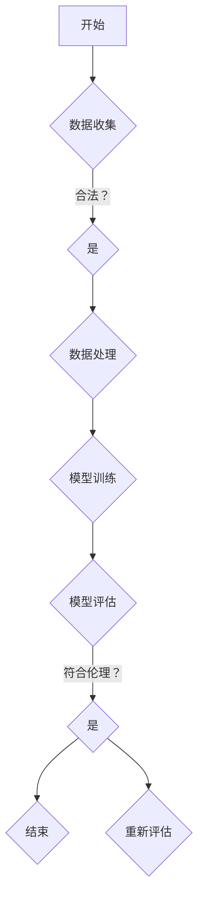

                 

# 提示词工程在情感计算中的伦理考量

## 关键词

- 情感计算
- 提示词工程
- 伦理考量
- 数据伦理
- 算法伦理
- 隐私伦理
- 模型公平性

## 摘要

随着人工智能技术的快速发展，情感计算成为了一个热门的研究领域，其中提示词工程在其中发挥着关键作用。然而，随着提示词工程在情感计算中的应用日益广泛，其伦理考量也变得尤为重要。本文首先介绍了情感计算和提示词工程的基础知识，然后深入探讨了提示词工程中存在的伦理问题，包括数据伦理、隐私伦理和算法伦理等方面。最后，本文提出了针对这些伦理问题的最佳实践方法，并展望了未来的研究方向。

## 第一部分：情感计算基础

### 第1章：情感计算概述

情感计算是指通过计算机技术和算法来识别、理解和模拟人类情感的一种技术。其核心目标是将人类情感转化为可量化的数据，以便更好地理解和应用。

#### 1.1 情感计算的定义与发展

情感计算的概念最早可以追溯到20世纪80年代，当时主要应用于心理学和认知科学领域。随着计算机性能的提升和人工智能技术的发展，情感计算逐渐成为一个独立的研究领域。

#### 1.2 情感计算的核心概念

情感计算的核心概念包括情感识别、情感理解和情感模拟。情感识别是指通过分析人类的语音、文本、图像等数据来识别情感。情感理解是指对识别出的情感进行深入分析，理解其背后的原因和含义。情感模拟是指通过计算机生成情感表达，以便更好地与人类互动。

#### 1.3 情感计算的应用领域

情感计算的应用领域非常广泛，包括但不限于：人机交互、智能客服、情感分析、心理健康监测、教育、医疗等。例如，在智能客服中，情感计算可以帮助机器人更好地理解用户的情感状态，从而提供更个性化的服务。

### 第2章：提示词工程基础

提示词工程是指通过设计特定的关键词和短语，来引导和调整人工智能模型对情感的理解和表达。它是情感计算中不可或缺的一环。

#### 2.1 提示词工程的概念

提示词工程的核心任务是根据具体应用场景，设计出一套能够有效引导情感计算模型的关键词和短语。

#### 2.2 提示词工程的核心任务

提示词工程的核心任务是：

1. **情感识别**：通过设计提示词，帮助模型更好地识别和理解用户的情感。
2. **情感表达**：通过设计提示词，引导模型生成更自然、更贴近人类情感表达的语言。
3. **情感调整**：通过设计提示词，帮助模型在不同情境下调整情感表达，以适应不同场景。

#### 2.3 提示词工程的挑战

提示词工程面临的挑战包括：

1. **数据多样性**：情感计算应用场景广泛，数据多样性高，设计提示词时需要考虑到各种情境。
2. **语言复杂性**：语言本身具有丰富的情感内涵和复杂性，设计提示词时需要深入理解语言的使用和表达。
3. **模型适应性**：不同模型对提示词的敏感度不同，需要设计出能够适应不同模型的提示词。

## 第二部分：伦理考量

### 第3章：伦理考量概述

伦理考量是指在科技发展过程中，对可能产生的伦理问题进行深入思考和评估，以确保科技的应用不会对人类社会造成负面影响。

#### 3.1 伦理考量的重要性

在情感计算和提示词工程中，伦理考量的重要性体现在：

1. **保护用户隐私**：情感计算涉及大量个人数据，需要确保用户的隐私得到保护。
2. **避免歧视和偏见**：情感计算模型可能存在偏见和歧视，需要确保模型公平、公正。
3. **确保社会福祉**：科技的发展应该促进社会福祉，而不是造成新的社会问题。

#### 3.2 情感计算中的伦理问题

情感计算中的伦理问题包括：

1. **数据伦理**：涉及用户数据的收集、存储和使用。
2. **隐私伦理**：涉及用户隐私的保护。
3. **算法伦理**：涉及算法的公平性、透明性和解释性。

#### 3.3 伦理考量的原则

伦理考量的基本原则包括：

1. **用户同意**：在进行数据收集和使用时，需要获得用户的明确同意。
2. **数据最小化**：仅收集必要的数据，避免过度收集。
3. **透明性和解释性**：确保用户能够理解其数据如何被使用。
4. **责任分配**：明确各方的责任，确保问题的及时解决。

## 第三部分：提示词工程中的伦理问题

### 第4章：提示词工程中的伦理问题

#### 4.1 提示词工程中的数据伦理

数据伦理是提示词工程中的关键问题，涉及数据的来源、收集、存储和使用等方面。

1. **数据来源**：提示词工程需要的数据来源包括用户生成内容、社交媒体等。在收集数据时，需要确保数据的合法性和合规性。
2. **数据收集**：在收集数据时，需要遵循数据最小化原则，仅收集必要的数据。
3. **数据存储**：数据存储需要确保安全性，防止数据泄露。

#### 4.2 提示词工程中的隐私伦理

隐私伦理是提示词工程中的核心问题，涉及用户隐私的保护。

1. **隐私保护**：在设计和使用提示词时，需要确保用户隐私得到保护，避免个人信息被泄露。
2. **用户透明度**：用户需要了解其数据如何被使用，以及其隐私如何被保护。
3. **隐私政策**：需要制定明确的隐私政策，告知用户其数据如何被使用。

#### 4.3 提示词工程中的算法伦理

算法伦理是提示词工程中的关键问题，涉及算法的公平性、透明性和解释性。

1. **算法公平性**：提示词工程中的算法需要确保对所有用户公平，避免歧视和偏见。
2. **算法透明性**：算法的决策过程需要透明，用户需要了解其数据如何影响算法的决策。
3. **算法解释性**：算法的决策过程需要可解释，以便用户理解和接受。

### 第5章：伦理考量下的提示词工程实践

#### 5.1 伦理考量下的提示词工程方法论

在伦理考量下，提示词工程需要遵循以下方法论：

1. **用户参与**：在设计提示词时，需要邀请用户参与，确保设计的提示词能够满足用户需求。
2. **持续评估**：定期对提示词工程的效果进行评估，确保其符合伦理要求。
3. **反馈机制**：建立反馈机制，接受用户的反馈，及时调整和优化提示词。

#### 5.2 伦理考量下的提示词工程案例研究

通过具体案例，分析伦理考量在提示词工程中的应用。

#### 5.3 伦理考量下的提示词工程未来趋势

展望未来，提示词工程在伦理考量下的发展趋势包括：

1. **数据隐私保护**：随着数据隐私保护法规的完善，提示词工程需要更加注重数据隐私保护。
2. **算法公平性**：随着社会对算法公平性的要求提高，提示词工程需要更加关注算法的公平性。
3. **用户参与**：用户参与将更加深入，用户需求将更加直接地影响提示词工程的设计。

## 第三部分：总结与展望

### 第6章：总结

本文从情感计算和提示词工程的基础知识入手，深入探讨了提示词工程中的伦理问题，包括数据伦理、隐私伦理和算法伦理等方面。通过具体案例分析，提出了伦理考量下的提示词工程方法论和未来趋势。

### 第7章：展望

随着人工智能技术的快速发展，提示词工程在情感计算中的应用将越来越广泛。伦理考量将成为提示词工程的重要一环，确保其应用能够符合社会价值观和道德准则。未来，我们需要进一步探索如何在伦理考量下优化提示词工程，使其更好地服务于人类社会。

## 作者信息

作者：AI天才研究院/AI Genius Institute & 禅与计算机程序设计艺术 /Zen And The Art of Computer Programming

---

请注意，上述内容仅为文章的大纲和摘要，实际撰写过程中需要根据每个章节的内容进一步详细展开，并遵循markdown格式要求。文章的字数也需要控制在8000～12000字之间。以下是示例代码片段，用于展示伪代码、LaTeX公式和Mermaid流程图的嵌入。

### 示例代码片段

#### Mermaid流程图



#### 伪代码

```python
# 伪代码：情感识别
def recognize_emotion(text):
    # 步骤1：预处理文本数据
    preprocessed_text = preprocess(text)

    # 步骤2：特征提取
    features = extract_features(preprocessed_text)

    # 步骤3：情感分类
    emotion = classify_emotion(features)

    # 步骤4：返回结果
    return emotion
```

#### LaTeX公式

```markdown
段落内的公式： $E=mc^2$

独立段落的公式：
$$
\sum_{i=1}^{n} x_i = \frac{1}{n} \sum_{i=1}^{n} x_i
$$
```

请注意，实际撰写过程中需要根据内容需求合理使用这些代码片段，并在文章中适当插入相应的解释和说明。同时，确保文章的逻辑性和连贯性，使其对读者来说易于理解和接受。

