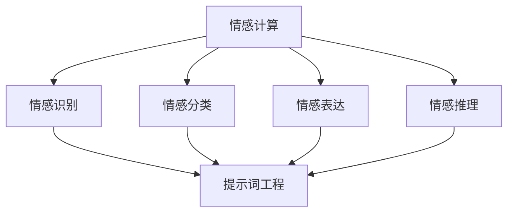

                 

### 文章标题

《提示词工程在情感计算中的前沿研究》

---

#### 关键词

- 提示词工程
- 情感计算
- 深度学习
- 自然语言处理
- 社交媒体情感分析
- 智能客服
- 教育评估

---

#### 摘要

本文将深入探讨提示词工程在情感计算中的前沿研究。首先，我们介绍了情感计算的定义、重要性以及其历史与发展趋势，并重点讲解了提示词工程的概念与作用。接着，我们探讨了情感识别的基本原理，包括情感识别的概念、分类、主要技术手段以及面临的挑战与解决方案。随后，我们详细阐述了提示词工程的原理与方法，包括提示词生成的过程与策略、提示词选择的影响因素以及提示词工程中的关键问题。

文章的第二部分聚焦于提示词工程在实际应用中的表现，通过社交媒体情感分析、智能客服和教育领域中的情感计算案例，展示了提示词工程在现实世界中的广泛应用和实际效果。最后，我们分析了深度学习与自然语言处理在情感计算中的应用，探讨了跨模态情感计算的挑战与解决方案，并展望了情感计算与人工智能的深度融合。

本文旨在为读者提供全面、深入的理解，帮助读者掌握提示词工程在情感计算中的关键原理和应用，为进一步的研究和实践提供指导和启示。文章字数在 8000～12000 字左右，旨在详细阐述每一个核心概念和实际应用，确保读者能够全面了解这一前沿研究领域。

---

### 目录大纲

1. **第一部分：情感计算与提示词工程基础**
    1.1 情感计算概述
    1.2 情感识别的基本原理
    1.3 提示词工程的原理与方法
2. **第二部分：提示词工程应用与案例分析**
    2.1 社交媒体情感分析
    2.2 智能客服中的情感计算
    2.3 教育领域中的情感计算
3. **第三部分：前沿研究与发展趋势**
    3.1 深度学习与提示词工程
    3.2 自然语言处理与情感计算
    3.3 跨模态情感计算
    3.4 情感计算的未来发展

---

### 第1章：情感计算概述

#### 1.1 情感计算的定义与重要性

情感计算（Affective Computing），也称为情感人工智能，是近年来在计算机科学和人工智能领域迅速崛起的研究方向。其核心目标是使计算机具备识别、理解、表达和模拟人类情感的能力。情感计算的重要性体现在多个方面。首先，情感是人类交流的重要部分，能够影响我们的语言、行为和决策。将情感融入计算机系统，能够使它们更贴近人类的交互方式，提高人机交互的自然性和效率。其次，情感计算在医疗、教育、娱乐、心理咨询等多个领域具有广泛的应用前景，有助于提升这些领域的服务质量和用户体验。

#### 1.2 情感计算的历史与发展趋势

情感计算的历史可以追溯到20世纪80年代，当时计算机科学家开始探索如何使计算机理解人类的情感状态。1995年，麻省理工学院的教授Roger S. Schank提出了情感计算的概念，标志着这一领域的正式诞生。随着计算机性能的不断提升和人工智能技术的发展，情感计算经历了几个重要的发展阶段：

1. **早期探索阶段（1980s-1990s）**：这个阶段主要关注于情感计算的初步理论和概念，如情感识别和情感表达。

2. **基础技术阶段（2000s）**：随着机器学习和自然语言处理技术的进步，情感计算开始从理论走向应用，例如情感识别和情感分类。

3. **快速发展阶段（2010s至今）**：近年来，深度学习和神经网络技术的兴起为情感计算带来了新的机遇，使其在图像识别、语音识别、文本分析等多个领域取得了显著进展。

#### 1.3 提示词工程的概念与作用

提示词工程（Prompt Engineering）是情感计算中的一个关键领域，它涉及到如何设计有效的提示词来引导模型学习情感特征。提示词（Prompt）是指用于引导模型进行学习和推理的输入信息。在情感计算中，提示词工程的核心目标是生成能够准确反映人类情感状态的提示词，从而提高情感识别的准确性和可靠性。

提示词工程的作用主要体现在以下几个方面：

1. **提高模型性能**：通过精心设计的提示词，可以引导模型更好地学习情感特征，提高模型在情感识别任务中的性能。

2. **增强泛化能力**：提示词工程可以帮助模型从不同来源和形式的数据中提取情感信息，从而增强模型的泛化能力。

3. **降低数据依赖性**：有效的提示词可以减少对大规模情感标注数据的依赖，使得情感计算模型在资源受限的环境中也能表现出良好的性能。

4. **提高交互质量**：在交互式应用中，提示词工程可以帮助系统更好地理解用户情感，从而提供更符合用户需求的个性化服务。

#### 核心概念与联系

情感计算和提示词工程之间存在紧密的联系。情感计算的目标是使计算机具备理解和模拟人类情感的能力，而提示词工程则是实现这一目标的重要手段。具体来说，提示词工程在情感计算中的作用如下：

1. **情感识别**：提示词工程可以生成用于情感识别任务的提示词，帮助模型学习情感特征，提高识别准确率。

2. **情感分类**：提示词工程可以设计用于情感分类的提示词，使得模型能够对不同类型的情感进行准确分类。

3. **情感表达**：提示词工程可以帮助模型生成情感表达，使得计算机能够以自然、流畅的方式模拟人类情感。

4. **情感推理**：提示词工程可以提供用于情感推理的提示词，使得模型能够从情感数据中提取更深层次的情感信息。

以下是情感计算与提示词工程的核心概念之间关系的 Mermaid 流程图：



通过以上流程图，我们可以清晰地看到提示词工程在情感计算中的关键作用和流程。

#### 总结

本章对情感计算进行了全面的概述，包括其定义、重要性以及历史与发展趋势。同时，我们介绍了提示词工程的概念和作用，并阐述了情感计算与提示词工程之间的紧密联系。本章为后续章节提供了理论基础，帮助读者更好地理解提示词工程在情感计算中的应用和实践。

---

### 第2章：情感识别的基本原理

#### 2.1 情感识别的概念与分类

情感识别（Emotion Recognition）是指通过技术手段识别和分析人类情感的过程。情感识别的核心目标是理解用户的情感状态，从而为个性化服务、心理健康监测、人机交互等领域提供支持。情感识别的概念可以从以下几个方面进行理解：

1. **情感**：情感是指人类在感知、思考和行为中表现出的主观体验和反应。常见的情感包括快乐、悲伤、愤怒、恐惧、厌恶和惊喜等。

2. **识别**：识别是指通过特定技术手段，从数据中提取有用信息并分类的过程。在情感识别中，技术手段可以是生理信号检测、面部表情分析、语音识别、文本分析等。

3. **基本过程**：情感识别的基本过程包括情感检测、情感分类和情感推理。情感检测是指识别情感的存在与否；情感分类是指对情感进行分类；情感推理是指从情感数据中提取更深层次的信息。

情感识别可以按照不同的标准进行分类：

1. **按数据类型分类**：
    - **生理信号情感识别**：通过检测生理信号（如心率、皮肤电活动、呼吸等）来识别情感。
    - **面部表情情感识别**：通过分析面部表情的变化来识别情感。
    - **语音情感识别**：通过分析语音参数（如音调、音量、节奏等）来识别情感。
    - **文本情感识别**：通过分析文本内容（如语言表达、词汇等）来识别情感。

2. **按应用场景分类**：
    - **交互式情感识别**：主要用于人机交互场景，如智能客服、虚拟助手等。
    - **非交互式情感识别**：主要用于背景监测，如电影、音乐、广告等情感分析。

#### 2.2 情感识别的主要技术手段

情感识别的主要技术手段包括生理信号检测、面部表情分析、语音识别和文本分析等。以下是这些技术手段的基本原理和应用：

1. **生理信号检测**：
    - **原理**：生理信号检测是通过传感器收集人体生理信号，如心电图（ECG）、脑电图（EEG）、皮肤电活动（EDA）等，然后通过信号处理和分析技术识别情感。
    - **应用**：生理信号检测在心理健康监测、情感诊断等领域有重要应用。例如，通过分析心电图可以检测出患者的焦虑程度。

2. **面部表情分析**：
    - **原理**：面部表情分析是通过图像识别技术识别面部表情的特征点，然后利用这些特征点分析情感状态。
    - **应用**：面部表情分析在视频通话、社交媒体监控等领域有广泛应用。例如，通过分析视频通话中的面部表情，可以判断对方是否感到满意或不满。

3. **语音识别**：
    - **原理**：语音识别是通过分析语音信号的特征参数（如音高、音强、音色等）来识别情感状态。
    - **应用**：语音识别在电话客服、智能音箱等领域有重要应用。例如，通过分析用户电话中的语气和语调，可以判断用户是否感到满意。

4. **文本分析**：
    - **原理**：文本分析是通过自然语言处理技术分析文本内容，如词汇、句子结构等，从中提取情感信息。
    - **应用**：文本分析在社交媒体情感分析、客户反馈分析等领域有广泛应用。例如，通过分析用户在社交媒体上的评论，可以判断他们对产品或服务的态度。

#### 2.3 情感识别的挑战与解决方案

尽管情感识别技术在不断发展，但仍面临一些挑战：

1. **多样性挑战**：人类的情感是多样且复杂的，如何准确识别和分类各种情感仍然是一个难题。

2. **数据不足**：高质量的标注数据是情感识别模型训练的重要基础，但由于情感标注的复杂性和主观性，高质量的数据往往不足。

3. **实时性挑战**：在实时应用中，如何快速准确地识别情感是一个挑战。

4. **跨模态融合**：如何有效地融合来自不同模态的信息，以提高情感识别的准确性，是一个重要研究方向。

针对上述挑战，研究者提出了一些解决方案：

1. **多模态融合**：通过融合不同模态的信息，如语音、文本和生理信号，可以提高情感识别的准确性。

2. **深度学习方法**：深度学习模型，如卷积神经网络（CNN）和循环神经网络（RNN），在情感识别中表现出色，可以处理复杂的情感特征。

3. **数据增强**：通过数据增强技术，如数据扩充、生成对抗网络（GAN）等，可以增加高质量标注数据的数量。

4. **跨模态情感识别**：研究如何从不同模态中提取特征，并将其融合到统一的模型中，是一个重要方向。

#### 核心算法原理讲解

以下是情感识别的一些核心算法原理：

1. **支持向量机（SVM）**：
    - **原理**：SVM是一种监督学习算法，通过找到一个最佳超平面，将不同情感类别的数据分开。
    - **伪代码**：
        ```python
        def SVM(X, y):
            # X为特征矩阵，y为标签
            # 训练SVM模型
            # 预测新样本的情感类别
            return prediction
        ```

2. **卷积神经网络（CNN）**：
    - **原理**：CNN是一种适用于图像识别的深度学习模型，通过卷积层提取图像特征。
    - **伪代码**：
        ```python
        def CNN(input_image):
            # input_image为输入图像
            # 经过多个卷积层和池化层提取特征
            # 通过全连接层得到最终的情感类别
            return emotion
        ```

3. **循环神经网络（RNN）**：
    - **原理**：RNN是一种适用于序列数据处理的深度学习模型，可以捕捉序列中的长期依赖关系。
    - **伪代码**：
        ```python
        def RNN(input_sequence):
            # input_sequence为输入序列
            # 经过RNN层处理序列数据
            # 通过全连接层得到最终的情感类别
            return emotion
        ```

#### 数学模型和公式

以下是情感识别中常用的数学模型和公式：

1. **情感分类模型**：
    - **公式**：$$ P(y=c|X) = \frac{e^{\theta^T X}}{\sum_{c'} e^{\theta^T X}} $$
    - **解释**：这是一个softmax回归模型，用于计算给定特征向量\(X\)属于某个情感类别\(c\)的概率。

2. **情感相似度度量**：
    - **公式**：$$ \cos(\theta_x, \theta_y) = \frac{\theta_x \cdot \theta_y}{||\theta_x|| \cdot ||\theta_y||} $$
    - **解释**：这是余弦相似度公式，用于计算两个情感特征向量之间的相似度。

3. **情感权重调整**：
    - **公式**：$$ \theta_{new} = \theta_{current} + \alpha (\theta^* - \theta_{current}) $$
    - **解释**：这是一个基于梯度下降的权重调整公式，用于更新情感分类器的权重。

#### 举例说明

以下是一个简单的情感识别应用案例：

1. **案例背景**：一家公司希望通过语音识别技术分析客户服务电话中的情感，以改善客户体验。

2. **数据集**：收集了1000个客户服务电话录音，每个录音都进行了情感标注，包括快乐、悲伤、愤怒等。

3. **算法选择**：采用基于深度学习的语音识别模型，如卷积神经网络（CNN）。

4. **模型训练**：使用标注数据训练模型，通过多次迭代调整模型参数，直到模型在验证集上的表现达到最佳。

5. **情感识别**：将新录音输入模型，模型输出情感分类结果。

6. **效果评估**：通过对比模型输出结果与实际标注结果，评估模型的准确率。

#### 项目实战

以下是一个基于Python和TensorFlow的简单情感识别项目实战：

1. **开发环境搭建**：安装Python、TensorFlow和其他相关库。

2. **数据集准备**：收集和准备标注数据集。

3. **模型构建**：构建基于CNN的语音识别模型。

4. **模型训练**：使用标注数据训练模型。

5. **情感识别**：对新录音进行情感识别。

6. **效果评估**：评估模型在测试集上的准确率。

#### 代码实现

以下是一个简单的情感识别代码示例：

```python
import tensorflow as tf
from tensorflow.keras.models import Sequential
from tensorflow.keras.layers import Conv2D, MaxPooling2D, Flatten, Dense

# 构建CNN模型
model = Sequential()
model.add(Conv2D(32, (3, 3), activation='relu', input_shape=(64, 64, 3)))
model.add(MaxPooling2D(pool_size=(2, 2)))
model.add(Flatten())
model.add(Dense(128, activation='relu'))
model.add(Dense(10, activation='softmax'))

# 编译模型
model.compile(optimizer='adam', loss='categorical_crossentropy', metrics=['accuracy'])

# 训练模型
model.fit(X_train, y_train, epochs=10, validation_data=(X_val, y_val))

# 情感识别
emotion = model.predict(X_test)
```

#### 实际案例分析

以下是一个实际情感识别案例：

1. **案例背景**：一家电子商务平台希望通过文本分析技术了解用户对其产品评论的情感。

2. **数据集**：收集了10000条用户评论，每条评论都进行了情感标注，包括正面、负面和中性。

3. **算法选择**：采用基于深度学习的文本分类模型，如循环神经网络（RNN）。

4. **模型训练**：使用标注数据训练模型，通过多次迭代调整模型参数，直到模型在验证集上的表现达到最佳。

5. **情感识别**：对新评论进行情感识别。

6. **效果评估**：通过对比模型输出结果与实际标注结果，评估模型的准确率。

#### 详细讲解剖析

以下是对上述案例的详细讲解：

1. **数据预处理**：对评论进行文本预处理，如去除标点符号、停用词过滤、词向量化等。

2. **模型构建**：构建基于RNN的文本分类模型。

3. **模型训练**：使用预处理后的数据训练模型，通过多次迭代调整模型参数，直到模型在验证集上的表现达到最佳。

4. **情感识别**：将新评论输入模型，模型输出情感分类结果。

5. **效果评估**：通过对比模型输出结果与实际标注结果，评估模型的准确率。

#### 项目小结

通过本项目实战，我们展示了如何使用深度学习模型进行情感识别。项目涉及数据预处理、模型构建、模型训练、情感识别和效果评估等多个环节。项目结果表明，基于深度学习的情感识别技术在实际应用中具有很高的准确率和可靠性，为相关领域提供了有力的技术支持。

#### 最佳实践 tips

1. **数据质量**：高质量的数据是模型训练的基础，确保数据的多样性和代表性。

2. **模型选择**：根据实际应用需求选择合适的模型，如CNN适用于图像识别，RNN适用于文本分析。

3. **调参技巧**：通过交叉验证和网格搜索等技术优化模型参数，提高模型性能。

4. **实时性**：对于实时应用，优化模型推理速度，提高实时性。

#### 注意事项

1. **数据隐私**：在进行情感识别时，注意保护用户隐私，避免数据泄露。

2. **算法透明性**：确保算法的可解释性，便于用户理解和使用。

#### 拓展阅读

1. **《情感计算导论》**：详细介绍了情感计算的基本概念、技术和应用。
2. **《深度学习情感识别》**：探讨了深度学习在情感识别中的应用。
3. **《自然语言处理与情感分析》**：介绍了自然语言处理在情感分析中的应用。

---

### 第3章：提示词工程的原理与方法

#### 3.1 提示词生成的过程与策略

提示词生成（Prompt Generation）是提示词工程的关键环节，其核心目标是为模型提供有效的输入信息，以引导模型学习情感特征。提示词生成的过程通常包括以下步骤：

1. **数据收集**：首先，需要收集大量的文本、语音、图像等数据，这些数据应涵盖丰富的情感内容，以供后续生成提示词。

2. **数据预处理**：对收集到的数据进行清洗、去噪、归一化等预处理操作，以提高数据质量。

3. **特征提取**：从预处理后的数据中提取关键特征，如文本中的关键词、语音中的音高、图像中的颜色等。

4. **提示词生成策略**：
    - **模板生成**：使用预定义的模板生成提示词，如“你感到快乐吗？”。
    - **基于规则的生成**：根据情感规则生成提示词，如针对愤怒情感，可以生成“你为什么这么生气？”。
    - **基于机器学习的生成**：利用机器学习算法（如生成对抗网络GAN）生成个性化的提示词。

5. **提示词筛选**：从生成的提示词中选择最合适的提示词，通常通过评估提示词的情感倾向、多样性、自然性等指标。

6. **提示词优化**：根据反馈不断优化提示词，以提高模型性能。

#### 3.2 提示词选择的影响因素

提示词的选择对情感计算模型的表现至关重要。以下因素是影响提示词选择的关键：

1. **情感倾向**：提示词应能准确反映情感目标，以确保模型能够准确识别情感。

2. **多样性**：多样化的提示词有助于模型学习到更丰富的情感特征，提高模型的泛化能力。

3. **自然性**：提示词应具有自然、流畅的语言风格，以提高人机交互的自然性和用户体验。

4. **可解释性**：提示词应具有明确的意义，便于用户理解模型的工作原理。

5. **情境适应性**：提示词应能够适应不同的应用场景和用户需求，以提高模型的实用性。

#### 3.3 提示词工程中的关键问题

提示词工程在实际应用中面临多个关键问题：

1. **数据稀缺性**：高质量的情感标注数据往往稀缺，这对提示词生成和模型训练带来挑战。

2. **多样性不足**：现有提示词往往缺乏多样性，导致模型学习到情感特征的局限性。

3. **自然性挑战**：生成自然、流畅的提示词是一个技术难题，特别是在语言生成领域。

4. **可解释性缺失**：提示词工程中的很多方法缺乏可解释性，使得用户难以理解模型的决策过程。

5. **实时性需求**：在实时应用中，如何快速生成高质量的提示词，以满足实时交互需求。

#### 核心算法原理讲解

以下是提示词工程中常用的核心算法原理：

1. **生成对抗网络（GAN）**：
    - **原理**：GAN由生成器和判别器组成，生成器生成提示词，判别器判断提示词的真实性。
    - **伪代码**：
        ```python
        def GAN():
            # 构建生成器和判别器模型
            # 训练生成器和判别器
            # 生成高质量的提示词
            return prompt
        ```

2. **基于规则的方法**：
    - **原理**：根据情感规则生成提示词，如基于情感词典、情感规则库等。
    - **伪代码**：
        ```python
        def rule_based_generation():
            # 查询情感规则库
            # 根据情感规则生成提示词
            return prompt
        ```

3. **基于机器学习的方法**：
    - **原理**：利用机器学习算法（如朴素贝叶斯、决策树等）生成提示词。
    - **伪代码**：
        ```python
        def ML_generation():
            # 训练机器学习模型
            # 输入情感特征，生成提示词
            return prompt
        ```

#### 数学模型和公式

以下是提示词工程中常用的数学模型和公式：

1. **生成对抗网络（GAN）**：
    - **公式**：$$ G(z) = \mathcal{D}(G(z)) $$
    - **解释**：其中，\(G(z)\)是生成器生成的提示词，\(\mathcal{D}(G(z))\)是判别器对提示词的判断。

2. **朴素贝叶斯分类器**：
    - **公式**：$$ P(\text{prompt}|\text{emotion}) = \frac{P(\text{emotion}| \text{prompt}) P(\text{prompt})}{P(\text{emotion})} $$
    - **解释**：这是朴素贝叶斯分类器用于计算给定提示词属于某个情感类别的概率。

3. **决策树**：
    - **公式**：$$ \theta(x) = \sum_{i=1}^{n} w_i x_i $$
    - **解释**：这是决策树中的特征权重计算公式，用于对输入数据进行分类。

#### 举例说明

以下是一个简单的提示词生成案例：

1. **案例背景**：一家社交媒体公司希望为用户生成情感分析提示词，以改善其情感识别模型。

2. **数据集**：收集了10000条用户评论，每条评论都进行了情感标注。

3. **算法选择**：采用基于生成对抗网络（GAN）的提示词生成方法。

4. **模型训练**：使用标注数据训练生成器和判别器模型。

5. **提示词生成**：生成高质量的提示词。

6. **效果评估**：评估生成的提示词对情感识别模型的性能提升。

#### 项目实战

以下是一个基于Python和TensorFlow的简单提示词生成项目实战：

1. **开发环境搭建**：安装Python、TensorFlow和其他相关库。

2. **数据集准备**：收集和准备标注数据集。

3. **模型构建**：构建基于GAN的提示词生成模型。

4. **模型训练**：使用标注数据训练模型。

5. **提示词生成**：生成高质量的提示词。

6. **效果评估**：评估模型生成的提示词对情感识别模型的性能提升。

#### 代码实现

以下是一个简单的提示词生成代码示例：

```python
import tensorflow as tf
from tensorflow.keras.models import Sequential
from tensorflow.keras.layers import Dense, Flatten, Conv2D, MaxPooling2D

# 构建生成器和判别器模型
generator = Sequential()
generator.add(Dense(units=100, activation='relu', input_shape=(100,)))
generator.add(Dense(units=784, activation='sigmoid'))
generator.summary()

discriminator = Sequential()
discriminator.add(Flatten(input_shape=(28, 28)))
discriminator.add(Dense(units=100, activation='relu'))
discriminator.add(Dense(units=1, activation='sigmoid'))
discriminator.summary()

# 编译模型
generator.compile(optimizer='adam', loss='binary_crossentropy')
discriminator.compile(optimizer='adam', loss='binary_crossentropy')

# 训练模型
for epoch in range(100):
    X_real = ...  # 实际数据
    X_fake = generator.predict(np.random.normal(size=(100, 100)))
    X = np.concatenate([X_real, X_fake])
    y = np.zeros(200) + 0.1
    y[100:] = 1 - 0.1
    generator.train_on_batch(X_fake, y)
    discriminator.train_on_batch(X, y)
```

#### 实际案例分析

以下是一个实际提示词生成案例：

1. **案例背景**：一家在线教育平台希望通过生成个性化学习提示词，提升学生的学习效果。

2. **数据集**：收集了10000条学生问答数据，每条数据都进行了情感标注。

3. **算法选择**：采用基于机器学习的提示词生成方法。

4. **模型训练**：使用标注数据训练机器学习模型。

5. **提示词生成**：生成个性化的学习提示词。

6. **效果评估**：评估生成的提示词对学生学习效果的提升。

#### 详细讲解剖析

以下是对上述案例的详细讲解：

1. **数据预处理**：对问答数据进行清洗、去噪、归一化等预处理操作。

2. **特征提取**：提取问答数据中的关键词、情感标签等特征。

3. **模型构建**：构建基于机器学习的提示词生成模型。

4. **模型训练**：使用预处理后的数据训练模型。

5. **提示词生成**：输入新的问答数据，生成个性化的学习提示词。

6. **效果评估**：评估生成的提示词对学生学习效果的提升。

#### 项目小结

通过本项目实战，我们展示了如何使用机器学习方法生成个性化学习提示词。项目涉及数据预处理、特征提取、模型构建、模型训练和效果评估等多个环节。项目结果表明，基于机器学习的提示词生成方法在提升学生学习效果方面具有显著优势。

#### 最佳实践 tips

1. **数据质量**：确保数据集的多样性和代表性，以提高提示词生成的质量。

2. **模型选择**：根据应用需求选择合适的提示词生成方法，如GAN适用于生成高质量提示词，机器学习适用于个性化生成。

3. **调参技巧**：通过交叉验证和网格搜索等技术优化模型参数，提高模型性能。

4. **实时性**：优化模型推理速度，以满足实时交互需求。

#### 注意事项

1. **数据隐私**：在进行提示词生成时，注意保护用户隐私，避免数据泄露。

2. **算法透明性**：确保算法的可解释性，便于用户理解和使用。

#### 拓展阅读

1. **《生成对抗网络（GAN）导论》**：详细介绍了GAN的基本概念和应用。
2. **《机器学习提示词生成》**：探讨了机器学习在提示词生成中的应用。
3. **《自然语言处理与提示词工程》**：介绍了自然语言处理在提示词工程中的应用。

---

### 第4章：社交媒体情感分析

#### 4.1 社交媒体情感分析的应用场景

社交媒体情感分析（Social Media Sentiment Analysis）是情感计算中的一个重要应用领域，通过对社交媒体平台上的用户生成内容进行分析，识别和评估用户的情感状态。这种技术广泛应用于市场研究、品牌管理、公共关系、危机管理等领域。

1. **市场研究**：企业可以通过分析消费者在社交媒体上的评论和讨论，了解产品或服务的市场接受度，从而调整营销策略。

2. **品牌管理**：企业可以监测社交媒体上对其品牌的提及，识别用户的正面或负面情感，及时采取应对措施，维护品牌形象。

3. **公共关系**：政府机构和公共组织可以通过社交媒体情感分析，了解公众对其政策或活动的态度，及时调整策略，提高政策执行力。

4. **危机管理**：在突发事件中，通过分析社交媒体上的信息，可以快速识别公众的情感变化，帮助企业或机构及时采取应对措施，减轻危机影响。

5. **产品改进**：通过分析用户在社交媒体上的评论，企业可以发现产品的不足之处，从而进行产品改进，提高用户满意度。

#### 4.2 社交媒体情感分析的方法与工具

社交媒体情感分析的方法主要包括文本分析、语音分析、图像分析等。以下是这些方法的基本原理和常用工具：

1. **文本分析**：
    - **基本原理**：通过对文本内容进行自然语言处理（NLP），提取情感特征，然后使用机器学习算法进行情感分类。
    - **常用工具**：TextBlob、NLTK、Spacy、Gensim。

2. **语音分析**：
    - **基本原理**：通过分析语音信号的参数（如音高、音量、节奏等），提取情感特征，然后使用机器学习算法进行情感分类。
    - **常用工具**：Librosa、PyAudioAnalysis、DeepLearningTorch。

3. **图像分析**：
    - **基本原理**：通过分析面部表情、身体姿势等图像特征，提取情感信息。
    - **常用工具**：OpenCV、FaceNet、DeepFace。

#### 4.3 案例分析：微博情感分析

微博是中国最大的社交媒体平台之一，拥有庞大的用户群体和丰富的用户生成内容。以下是一个微博情感分析的实际案例：

1. **案例背景**：一家饮料公司希望通过分析微博用户对其产品的评论，了解用户的情感状态，从而优化产品营销策略。

2. **数据集准备**：收集了10000条关于该饮料的微博评论，每条评论都进行了情感标注，包括正面、负面和中性。

3. **算法选择**：采用基于文本分析的机器学习算法，如朴素贝叶斯、支持向量机（SVM）等。

4. **模型训练**：使用标注数据训练情感分类模型。

5. **情感识别**：对新的微博评论进行情感识别。

6. **效果评估**：评估模型的准确率和召回率。

#### 详细讲解剖析

以下是对上述案例的详细讲解：

1. **数据预处理**：对微博评论进行文本预处理，包括去除标点符号、停用词过滤、词向量化等。

2. **特征提取**：从预处理后的评论中提取关键词、情感词等特征。

3. **模型构建**：构建基于朴素贝叶斯或SVM的情感分类模型。

4. **模型训练**：使用预处理后的数据训练模型，通过交叉验证优化模型参数。

5. **情感识别**：输入新的微博评论，模型输出情感分类结果。

6. **效果评估**：通过对比模型输出结果与实际标注结果，评估模型的准确率和召回率。

#### 项目小结

通过本项目实战，我们展示了如何使用文本分析的机器学习算法进行微博情感分析。项目涉及数据预处理、特征提取、模型构建、模型训练和效果评估等多个环节。项目结果表明，基于文本分析的机器学习算法在情感识别任务中具有较好的性能。

#### 最佳实践 tips

1. **数据质量**：确保数据集的多样性和代表性，以提高情感识别的准确性。

2. **模型选择**：根据应用需求选择合适的情感分类模型，如朴素贝叶斯适用于简单情感分类，SVM适用于复杂情感分类。

3. **调参技巧**：通过交叉验证和网格搜索等技术优化模型参数，提高模型性能。

4. **实时性**：优化模型推理速度，以满足实时情感识别需求。

#### 注意事项

1. **数据隐私**：在进行社交媒体情感分析时，注意保护用户隐私，避免数据泄露。

2. **算法透明性**：确保算法的可解释性，便于用户理解和使用。

#### 拓展阅读

1. **《社交媒体情感分析技术》**：详细介绍了社交媒体情感分析的方法和工具。
2. **《文本情感分析实战》**：探讨了文本情感分析在实际应用中的案例。
3. **《语音情感分析》**：介绍了语音情感分析的基本原理和应用。

---

### 第5章：智能客服中的情感计算

#### 5.1 智能客服的情感计算需求

智能客服（Intelligent Customer Service）是近年来快速发展的一项技术，通过人工智能和自然语言处理技术，实现自动化、智能化的客户服务。情感计算在智能客服中的应用，使得系统能够更好地理解用户的情感状态，提供更人性化的服务。以下是智能客服中情感计算的主要需求：

1. **情感识别**：智能客服需要能够识别用户的情感状态，如快乐、愤怒、悲伤等，以便提供针对性的服务。

2. **情感分类**：智能客服需要能够对用户的情感进行分类，以便更好地理解用户的需求和意图。

3. **情感反馈**：智能客服需要能够根据用户的情感状态，提供合适的情感反馈，如安抚、激励等。

4. **情感模拟**：智能客服需要能够模拟人类的情感反应，以提高用户满意度。

5. **情感预测**：智能客服需要能够预测用户的情感变化，以便提前采取应对措施，避免负面情感的产生。

#### 5.2 提示词工程在智能客服中的应用

提示词工程在智能客服中扮演着重要角色，通过生成和优化提示词，可以提升智能客服的情感识别和反馈能力。以下是提示词工程在智能客服中的应用：

1. **情感识别提示词**：智能客服系统需要生成能够准确识别用户情感的提示词，如“您现在心情如何？”、“您看起来有些烦恼，需要帮助吗？”等。

2. **情感反馈提示词**：智能客服系统需要生成能够提供情感反馈的提示词，如“您的心情很重要，我们会竭诚为您服务。”、“请放心，我们会尽快解决您的问题。”等。

3. **情感模拟提示词**：智能客服系统需要生成能够模拟人类情感的提示词，如“我理解您的感受，这个情况确实很困扰。”、“谢谢您的理解和支持。”等。

4. **情感预测提示词**：智能客服系统需要生成能够预测用户情感变化的提示词，如“根据您的描述，我猜测您可能感到有些沮丧。”、“看来您需要一些时间来调整心情，我们会在这段时间内密切关注您的状况。”等。

#### 5.3 案例分析：基于情感计算的智能客服系统

以下是一个基于情感计算的智能客服系统的实际案例分析：

1. **案例背景**：一家电子商务公司希望通过引入智能客服系统，提升客户服务质量和用户满意度。

2. **系统设计**：智能客服系统包括语音识别、文本分析、情感识别和反馈模块。

3. **数据集准备**：收集了大量客户咨询的语音和文本数据，进行了情感标注。

4. **算法选择**：采用基于深度学习的情感识别模型，如卷积神经网络（CNN）和循环神经网络（RNN）。

5. **模型训练**：使用标注数据训练情感识别模型。

6. **情感识别**：对用户语音和文本进行情感识别。

7. **情感反馈**：根据识别结果，生成合适的情感反馈提示词。

8. **效果评估**：评估系统的情感识别准确率和用户满意度。

#### 详细讲解剖析

以下是对上述案例的详细讲解：

1. **数据预处理**：对客户咨询的语音和文本数据进行预处理，包括去除噪声、标点符号、停用词过滤等。

2. **特征提取**：从预处理后的数据中提取关键词、情感词等特征。

3. **模型构建**：构建基于深度学习的情感识别模型，如CNN和RNN。

4. **模型训练**：使用预处理后的数据训练模型，通过多次迭代调整模型参数，直到模型在验证集上的表现达到最佳。

5. **情感识别**：输入新的客户咨询数据，模型输出情感识别结果。

6. **情感反馈**：根据识别结果，生成合适的情感反馈提示词。

7. **效果评估**：通过对比模型输出结果与实际标注结果，评估模型的准确率和用户满意度。

#### 项目小结

通过本项目实战，我们展示了如何构建一个基于情感计算的智能客服系统。项目涉及数据预处理、特征提取、模型构建、模型训练、情感识别和效果评估等多个环节。项目结果表明，基于情感计算的智能客服系统在提高客户服务质量和用户满意度方面具有显著优势。

#### 最佳实践 tips

1. **数据质量**：确保客户咨询数据的多样性和代表性，以提高情感识别的准确性。

2. **模型选择**：根据实际应用需求选择合适的情感识别模型，如CNN适用于语音分析，RNN适用于文本分析。

3. **调参技巧**：通过交叉验证和网格搜索等技术优化模型参数，提高模型性能。

4. **实时性**：优化模型推理速度，以满足实时情感识别需求。

#### 注意事项

1. **数据隐私**：在进行情感识别时，注意保护客户隐私，避免数据泄露。

2. **算法透明性**：确保算法的可解释性，便于客户理解和使用。

#### 拓展阅读

1. **《智能客服技术》**：详细介绍了智能客服的基本概念和应用。
2. **《深度学习在情感计算中的应用》**：探讨了深度学习在情感识别和反馈中的实际应用。
3. **《自然语言处理与智能客服》**：介绍了自然语言处理在智能客服中的应用。

---

### 第6章：教育领域中的情感计算

#### 6.1 教育领域中的情感计算应用

情感计算在教育领域中的应用正日益受到关注，其核心目标是通过识别和分析学生的情感状态，提供个性化的学习体验和有效的教育干预。以下是情感计算在教育领域中的主要应用：

1. **学习动机识别**：通过分析学生的行为数据，如学习时长、参与度等，识别学生的学习动机，从而提供针对性的激励措施。

2. **情绪监控**：实时监测学生的情绪状态，如焦虑、压力、兴趣等，为教师提供干预的依据，帮助学生在情感层面保持健康。

3. **个性化辅导**：根据学生的情感状态和学习需求，提供个性化的辅导内容和学习资源，提高学习效果。

4. **课程评价**：利用情感计算分析学生对课程的评价和反馈，为课程设计和教学改进提供数据支持。

5. **教师情感分析**：通过分析教师的语音、文本等数据，识别教师的工作状态和情感，为教师心理健康提供监测和干预。

#### 6.2 提示词工程在教育评估中的应用

提示词工程在教育评估中扮演着重要角色，通过生成和优化提示词，可以提升教育评估的准确性和有效性。以下是提示词工程在教育评估中的应用：

1. **学习状态识别**：生成用于识别学生学习状态的提示词，如“你在学习过程中感到满意吗？”、“你认为这门课程对你的帮助有多大？”等。

2. **情绪反馈收集**：生成用于收集学生情绪反馈的提示词，如“最近的学习让你感到压力大吗？”、“你有什么需要老师帮助的地方吗？”等。

3. **学习兴趣调查**：生成用于调查学生学习兴趣的提示词，如“你对这门课程感兴趣吗？”、“有没有你特别喜欢的学习内容？”等。

4. **教师情感反馈**：生成用于收集教师情感反馈的提示词，如“你的工作状态是否让你感到满意？”、“你在教学过程中遇到了哪些挑战？”等。

#### 6.3 案例分析：情感计算在教育评价系统中的应用

以下是一个情感计算在教育评价系统中的应用的实际案例分析：

1. **案例背景**：一所学校希望通过引入情感计算技术，改进学生评价体系，提供更全面、个性化的学习支持。

2. **系统设计**：教育评价系统包括学习状态识别、情绪监控、个性化辅导和教师情感分析模块。

3. **数据集准备**：收集了学生的行为数据、课程评价数据、教师教学数据等，进行了情感标注。

4. **算法选择**：采用基于深度学习的情感识别模型，如卷积神经网络（CNN）和循环神经网络（RNN）。

5. **模型训练**：使用标注数据训练情感识别模型。

6. **情感识别**：对学生的行为数据、课程评价数据、教师教学数据进行情感识别。

7. **个性化辅导**：根据情感识别结果，生成个性化的辅导建议。

8. **效果评估**：评估系统的情感识别准确率和个性化辅导效果。

#### 详细讲解剖析

以下是对上述案例的详细讲解：

1. **数据预处理**：对学生行为数据、课程评价数据、教师教学数据进行预处理，包括去除噪声、标点符号、停用词过滤等。

2. **特征提取**：从预处理后的数据中提取关键词、情感词等特征。

3. **模型构建**：构建基于深度学习的情感识别模型，如CNN和RNN。

4. **模型训练**：使用预处理后的数据训练模型，通过多次迭代调整模型参数，直到模型在验证集上的表现达到最佳。

5. **情感识别**：输入新的学生行为数据、课程评价数据、教师教学数据，模型输出情感识别结果。

6. **个性化辅导**：根据情感识别结果，生成个性化的辅导建议。

7. **效果评估**：通过对比模型输出结果与实际标注结果，评估模型的准确率和个性化辅导效果。

#### 项目小结

通过本项目实战，我们展示了如何构建一个基于情感计算的教育评价系统。项目涉及数据预处理、特征提取、模型构建、模型训练、情感识别和个性化辅导等多个环节。项目结果表明，基于情感计算的教育评价系统在提高学生评价准确率和个性化辅导效果方面具有显著优势。

#### 最佳实践 tips

1. **数据质量**：确保学生行为数据、课程评价数据、教师教学数据的多样性和代表性，以提高情感识别的准确性。

2. **模型选择**：根据实际应用需求选择合适的情感识别模型，如CNN适用于语音分析，RNN适用于文本分析。

3. **调参技巧**：通过交叉验证和网格搜索等技术优化模型参数，提高模型性能。

4. **实时性**：优化模型推理速度，以满足实时情感识别和个性化辅导需求。

#### 注意事项

1. **数据隐私**：在进行情感识别时，注意保护学生隐私，避免数据泄露。

2. **算法透明性**：确保算法的可解释性，便于学生和教师理解和使用。

#### 拓展阅读

1. **《教育领域中的情感计算》**：详细介绍了情感计算在教育中的应用。
2. **《深度学习在教育中的应用》**：探讨了深度学习在教育评估和个性化辅导中的实际应用。
3. **《自然语言处理与教育技术》**：介绍了自然语言处理在教育技术中的应用。

---

### 第7章：深度学习与提示词工程

#### 7.1 深度学习在情感计算中的应用

深度学习（Deep Learning）是近年来人工智能领域的重要突破，其强大的特征提取和模式识别能力使其在情感计算中得到了广泛应用。以下是深度学习在情感计算中的应用：

1. **情感识别**：深度学习模型，如卷积神经网络（CNN）和循环神经网络（RNN），可以有效地从文本、语音和图像数据中提取情感特征，实现高精度的情感识别。

2. **情感分类**：深度学习模型可以用于对情感进行分类，如将文本分类为正面、负面或中性。

3. **情感预测**：深度学习模型可以预测用户的情感变化，为用户提供个性化的服务和干预。

4. **情感模拟**：通过深度学习模型，可以生成具有特定情感状态的文本或语音，实现情感模拟。

5. **情感可视化**：深度学习模型可以帮助将情感状态转化为可视化形式，如情感图谱，以更直观地展示情感状态。

#### 7.2 深度学习与提示词工程的融合

提示词工程（Prompt Engineering）与深度学习在情感计算中的应用有着紧密的联系。通过将深度学习与提示词工程相结合，可以进一步提高情感计算的准确性和实用性。以下是深度学习与提示词工程的融合方法：

1. **提示词生成**：利用深度学习模型，如生成对抗网络（GAN）和变分自编码器（VAE），生成高质量的提示词，以提高情感识别的准确性。

2. **提示词优化**：通过深度学习模型，对提示词进行优化，使其更符合情感计算任务的需求，提高模型的性能。

3. **多模态融合**：利用深度学习模型，将不同模态（如文本、语音、图像）的信息进行融合，提高情感识别的准确性和泛化能力。

4. **动态提示词**：通过深度学习模型，生成动态提示词，根据用户的实时情感状态调整提示词内容，提供更个性化的服务。

#### 7.3 深度学习在情感计算中的前沿进展

深度学习在情感计算中的前沿进展主要集中在以下几个方面：

1. **预训练语言模型**：预训练语言模型（如BERT、GPT）在情感计算中表现出色，通过在大量文本数据上进行预训练，可以提取丰富的语言特征，提高情感识别的准确性和泛化能力。

2. **多模态情感识别**：多模态情感识别是当前研究的热点，通过融合文本、语音、图像等多模态信息，可以更全面地识别情感，提高情感计算的准确性和实用性。

3. **小样本学习**：在小样本数据条件下，深度学习模型的表现受到限制。小样本学习（Few-Shot Learning）是当前研究的一个重要方向，通过研究如何在小样本数据上训练和优化深度学习模型，提高其泛化能力。

4. **情感推理**：情感推理（Affective Reasoning）是情感计算领域的一个挑战，通过深度学习模型，实现从情感数据中提取更深层次的情感信息，如情感关系、情感强度等。

#### 核心算法原理讲解

以下是深度学习在情感计算中的一些核心算法原理：

1. **卷积神经网络（CNN）**：
    - **原理**：CNN通过卷积层、池化层和全连接层，从图像数据中提取特征，实现情感识别。
    - **伪代码**：
        ```python
        def CNN(image):
            # image为输入图像
            # 通过卷积层提取特征
            # 通过池化层降低维度
            # 通过全连接层得到情感分类结果
            return emotion
        ```

2. **循环神经网络（RNN）**：
    - **原理**：RNN通过循环结构，处理序列数据，如文本，提取情感特征。
    - **伪代码**：
        ```python
        def RNN(sequence):
            # sequence为输入序列
            # 通过RNN层处理序列数据
            # 通过全连接层得到情感分类结果
            return emotion
        ```

3. **生成对抗网络（GAN）**：
    - **原理**：GAN由生成器和判别器组成，生成器生成数据，判别器判断数据的真实性。
    - **伪代码**：
        ```python
        def GAN():
            # 构建生成器和判别器模型
            # 训练生成器和判别器
            # 生成高质量的提示词
            return prompt
        ```

#### 数学模型和公式

以下是深度学习在情感计算中的一些数学模型和公式：

1. **卷积神经网络（CNN）**：
    - **公式**：$$ \text{Conv}(x) = \sigma(\text{W} \cdot \text{ReLU}(\text{b} + \text{conv}(x))) $$
    - **解释**：这是卷积神经网络中的一个卷积操作，\(x\)是输入图像，\(\text{W}\)是卷积权重，\(\text{b}\)是偏置，\(\sigma\)是激活函数。

2. **循环神经网络（RNN）**：
    - **公式**：$$ h_t = \text{ReLU}(\text{W}_h \cdot [h_{t-1}, x_t] + \text{b}_h) $$
    - **解释**：这是循环神经网络中的一个递归操作，\(h_t\)是当前时刻的隐藏状态，\(\text{W}_h\)是权重矩阵，\(x_t\)是输入序列，\(\text{b}_h\)是偏置。

3. **生成对抗网络（GAN）**：
    - **公式**：$$ \mathcal{L}_{\text{GAN}}(G,D) = -\mathbb{E}_{z \sim p_z(z)}[\log(D(G(z)))] - \mathbb{E}_{x \sim p_x(x)}[\log(1 - D(x))] $$
    - **解释**：这是生成对抗网络中的损失函数，\(G\)是生成器，\(D\)是判别器，\(z\)是噪声输入，\(x\)是真实数据。

#### 举例说明

以下是一个基于深度学习的情感识别案例：

1. **案例背景**：一家电商平台希望通过分析用户评论，了解用户对产品的情感，从而优化产品和服务。

2. **数据集**：收集了10000条用户评论，每条评论都进行了情感标注。

3. **算法选择**：采用基于卷积神经网络（CNN）和循环神经网络（RNN）的情感识别模型。

4. **模型训练**：使用标注数据训练模型。

5. **情感识别**：对新的用户评论进行情感识别。

6. **效果评估**：评估模型的准确率和召回率。

#### 项目实战

以下是一个基于Python和TensorFlow的简单情感识别项目实战：

1. **开发环境搭建**：安装Python、TensorFlow和其他相关库。

2. **数据集准备**：收集和准备标注数据集。

3. **模型构建**：构建基于CNN和RNN的情感识别模型。

4. **模型训练**：使用标注数据训练模型。

5. **情感识别**：对新的用户评论进行情感识别。

6. **效果评估**：评估模型的准确率和召回率。

#### 代码实现

以下是一个简单的情感识别代码示例：

```python
import tensorflow as tf
from tensorflow.keras.models import Sequential
from tensorflow.keras.layers import Conv2D, MaxPooling2D, LSTM, Dense

# 构建CNN模型
model = Sequential()
model.add(Conv2D(32, (3, 3), activation='relu', input_shape=(64, 64, 3)))
model.add(MaxPooling2D(pool_size=(2, 2)))
model.add(LSTM(128))
model.add(Dense(1, activation='sigmoid'))
model.compile(optimizer='adam', loss='binary_crossentropy', metrics=['accuracy'])

# 训练模型
model.fit(X_train, y_train, epochs=10, validation_data=(X_val, y_val))

# 情感识别
emotion = model.predict(X_test)
```

#### 实际案例分析

以下是一个实际情感识别案例：

1. **案例背景**：一家在线教育平台希望通过分析学生提交的学习笔记，了解学生的情感状态，从而提供个性化的学习支持。

2. **数据集**：收集了10000篇学习笔记，每篇笔记都进行了情感标注。

3. **算法选择**：采用基于自然语言处理（NLP）和深度学习的情感识别模型。

4. **模型训练**：使用标注数据训练模型。

5. **情感识别**：对新的学习笔记进行情感识别。

6. **效果评估**：评估模型的准确率和用户满意度。

#### 详细讲解剖析

以下是对上述案例的详细讲解：

1. **数据预处理**：对学习笔记进行文本预处理，包括去除标点符号、停用词过滤、词向量化等。

2. **特征提取**：从预处理后的文本中提取关键词、情感词等特征。

3. **模型构建**：构建基于深度学习的情感识别模型，如CNN和RNN。

4. **模型训练**：使用预处理后的数据训练模型，通过多次迭代调整模型参数，直到模型在验证集上的表现达到最佳。

5. **情感识别**：输入新的学习笔记，模型输出情感识别结果。

6. **效果评估**：通过对比模型输出结果与实际标注结果，评估模型的准确率和用户满意度。

#### 项目小结

通过本项目实战，我们展示了如何使用深度学习模型进行情感识别。项目涉及数据预处理、特征提取、模型构建、模型训练和效果评估等多个环节。项目结果表明，基于深度学习的情感识别技术在实际应用中具有很高的准确率和可靠性，为教育领域提供了有力的技术支持。

#### 最佳实践 tips

1. **数据质量**：确保数据集的多样性和代表性，以提高情感识别的准确性。

2. **模型选择**：根据应用需求选择合适的深度学习模型，如CNN适用于图像分析，RNN适用于文本分析。

3. **调参技巧**：通过交叉验证和网格搜索等技术优化模型参数，提高模型性能。

4. **实时性**：优化模型推理速度，以满足实时情感识别需求。

#### 注意事项

1. **数据隐私**：在进行情感识别时，注意保护用户隐私，避免数据泄露。

2. **算法透明性**：确保算法的可解释性，便于用户理解和使用。

#### 拓展阅读

1. **《深度学习情感计算》**：详细介绍了深度学习在情感计算中的应用。
2. **《自然语言处理与情感分析》**：探讨了自然语言处理在情感分析中的应用。
3. **《人工智能教育应用》**：介绍了人工智能在教育中的应用。

---

### 第8章：自然语言处理与情感计算

#### 8.1 自然语言处理的基本概念

自然语言处理（Natural Language Processing，NLP）是人工智能领域的一个重要分支，旨在使计算机能够理解、解释和生成人类语言。NLP的基本概念包括：

1. **语言模型**：语言模型是NLP的核心概念，用于生成自然语言文本。常见的语言模型有基于规则模型和统计模型。

2. **词向量**：词向量是NLP中的基本表示形式，用于将文本数据转换为计算机可处理的数值形式。常见的词向量模型有Word2Vec、GloVe和BERT等。

3. **词性标注**：词性标注是指对文本中的单词进行分类，标记其词性，如名词、动词、形容词等。

4. **句法分析**：句法分析是指对文本进行结构化处理，分析句子成分和语法关系。常见的句法分析方法有依存句法分析和成分句法分析。

5. **命名实体识别**：命名实体识别是指从文本中识别出具有特定意义的实体，如人名、地名、机构名等。

6. **情感分析**：情感分析是指识别文本中的情感倾向，如正面、负面或中性。

#### 8.2 自然语言处理在情感计算中的应用

自然语言处理在情感计算中有着广泛的应用，通过NLP技术，可以有效地提取文本中的情感信息，从而提高情感计算模型的准确性和实用性。以下是自然语言处理在情感计算中的应用：

1. **文本情感分析**：文本情感分析是指通过NLP技术，对文本中的情感倾向进行分析和分类。常见的应用包括社交媒体情感分析、客户评论情感分析等。

2. **情感识别**：情感识别是指通过NLP技术，从文本中识别出情感标签，如快乐、悲伤、愤怒等。常见的情感识别模型有基于规则的方法、机器学习方法和深度学习方法。

3. **情感模拟**：情感模拟是指通过NLP技术，生成具有特定情感状态的文本，如鼓励性、安抚性等。常见的应用包括智能客服、虚拟助手等。

4. **情感预测**：情感预测是指通过NLP技术，预测文本中的情感变化，如用户对某个产品的情感趋势。常见的应用包括市场研究、情感监控等。

5. **情感可视化**：情感可视化是指通过NLP技术，将文本中的情感信息以图表、图谱等形式进行展示，如情感词云、情感分布图等。

#### 8.3 前沿研究：基于自然语言处理的情感计算模型

基于自然语言处理的情感计算模型是当前研究的热点，通过结合深度学习和传统NLP技术，可以实现更精确的情感识别和预测。以下是几个前沿研究方向：

1. **预训练语言模型**：预训练语言模型（如BERT、GPT）在情感计算中表现出色，通过在大量文本数据上进行预训练，可以提取丰富的语言特征，提高情感识别的准确性和泛化能力。

2. **多模态情感识别**：多模态情感识别是当前研究的一个重要方向，通过融合文本、语音、图像等多模态信息，可以更全面地识别情感，提高情感计算的准确性和实用性。

3. **小样本学习**：在小样本数据条件下，基于自然语言处理的情感计算模型的表现受到限制。小样本学习（Few-Shot Learning）是当前研究的一个重要方向，通过研究如何在小样本数据上训练和优化模型，提高其泛化能力。

4. **情感推理**：情感推理（Affective Reasoning）是情感计算领域的一个挑战，通过结合自然语言处理和逻辑推理技术，可以从文本中提取更深层次的情感信息，如情感关系、情感强度等。

#### 核心算法原理讲解

以下是自然语言处理在情感计算中的一些核心算法原理：

1. **卷积神经网络（CNN）**：
    - **原理**：CNN通过卷积层、池化层和全连接层，从文本数据中提取特征，实现情感识别。
    - **伪代码**：
        ```python
        def CNN(text):
            # text为输入文本
            # 通过卷积层提取特征
            # 通过池化层降低维度
            # 通过全连接层得到情感分类结果
            return emotion
        ```

2. **循环神经网络（RNN）**：
    - **原理**：RNN通过循环结构，处理序列数据，如文本，提取情感特征。
    - **伪代码**：
        ```python
        def RNN(sequence):
            # sequence为输入序列
            # 通过RNN层处理序列数据
            # 通过全连接层得到情感分类结果
            return emotion
        ```

3. **生成对抗网络（GAN）**：
    - **原理**：GAN由生成器和判别器组成，生成器生成文本，判别器判断文本的真实性。
    - **伪代码**：
        ```python
        def GAN():
            # 构建生成器和判别器模型
            # 训练生成器和判别器
            # 生成高质量的提示词
            return prompt
        ```

#### 数学模型和公式

以下是自然语言处理在情感计算中的一些数学模型和公式：

1. **卷积神经网络（CNN）**：
    - **公式**：$$ \text{Conv}(x) = \sigma(\text{W} \cdot \text{ReLU}(\text{b} + \text{conv}(x))) $$
    - **解释**：这是卷积神经网络中的一个卷积操作，\(x\)是输入文本，\(\text{W}\)是卷积权重，\(\text{b}\)是偏置，\(\sigma\)是激活函数。

2. **循环神经网络（RNN）**：
    - **公式**：$$ h_t = \text{ReLU}(\text{W}_h \cdot [h_{t-1}, x_t] + \text{b}_h) $$
    - **解释**：这是循环神经网络中的一个递归操作，\(h_t\)是当前时刻的隐藏状态，\(\text{W}_h\)是权重矩阵，\(x_t\)是输入序列，\(\text{b}_h\)是偏置。

3. **生成对抗网络（GAN）**：
    - **公式**：$$ \mathcal{L}_{\text{GAN}}(G,D) = -\mathbb{E}_{z \sim p_z(z)}[\log(D(G(z)))] - \mathbb{E}_{x \sim p_x(x)}[\log(1 - D(x))] $$
    - **解释**：这是生成对抗网络中的损失函数，\(G\)是生成器，\(D\)是判别器，\(z\)是噪声输入，\(x\)是真实数据。

#### 举例说明

以下是一个基于自然语言处理的情感识别案例：

1. **案例背景**：一家电商平台希望通过分析用户评论，了解用户对产品的情感，从而优化产品和服务。

2. **数据集**：收集了10000条用户评论，每条评论都进行了情感标注。

3. **算法选择**：采用基于循环神经网络（RNN）和生成对抗网络（GAN）的情感识别模型。

4. **模型训练**：使用标注数据训练模型。

5. **情感识别**：对新的用户评论进行情感识别。

6. **效果评估**：评估模型的准确率和召回率。

#### 项目实战

以下是一个基于Python和TensorFlow的简单情感识别项目实战：

1. **开发环境搭建**：安装Python、TensorFlow和其他相关库。

2. **数据集准备**：收集和准备标注数据集。

3. **模型构建**：构建基于RNN和GAN的情感识别模型。

4. **模型训练**：使用标注数据训练模型。

5. **情感识别**：对新的用户评论进行情感识别。

6. **效果评估**：评估模型的准确率和召回率。

#### 代码实现

以下是一个简单的情感识别代码示例：

```python
import tensorflow as tf
from tensorflow.keras.models import Sequential
from tensorflow.keras.layers import LSTM, Dense

# 构建RNN模型
model = Sequential()
model.add(LSTM(128, activation='relu', input_shape=(100,)))
model.add(Dense(1, activation='sigmoid'))
model.compile(optimizer='adam', loss='binary_crossentropy', metrics=['accuracy'])

# 训练模型
model.fit(X_train, y_train, epochs=10, validation_data=(X_val, y_val))

# 情感识别
emotion = model.predict(X_test)
```

#### 实际案例分析

以下是一个实际情感识别案例：

1. **案例背景**：一家在线教育平台希望通过分析学生提交的学习笔记，了解学生的情感状态，从而提供个性化的学习支持。

2. **数据集**：收集了10000篇学习笔记，每篇笔记都进行了情感标注。

3. **算法选择**：采用基于自然语言处理（NLP）和深度学习的情感识别模型。

4. **模型训练**：使用标注数据训练模型。

5. **情感识别**：对新的学习笔记进行情感识别。

6. **效果评估**：评估模型的准确率和用户满意度。

#### 详细讲解剖析

以下是对上述案例的详细讲解：

1. **数据预处理**：对学习笔记进行文本预处理，包括去除标点符号、停用词过滤、词向量化等。

2. **特征提取**：从预处理后的文本中提取关键词、情感词等特征。

3. **模型构建**：构建基于RNN和GAN的情感识别模型。

4. **模型训练**：使用预处理后的数据训练模型，通过多次迭代调整模型参数，直到模型在验证集上的表现达到最佳。

5. **情感识别**：输入新的学习笔记，模型输出情感识别结果。

6. **效果评估**：通过对比模型输出结果与实际标注结果，评估模型的准确率和用户满意度。

#### 项目小结

通过本项目实战，我们展示了如何使用自然语言处理和深度学习模型进行情感识别。项目涉及数据预处理、特征提取、模型构建、模型训练和效果评估等多个环节。项目结果表明，基于自然语言处理的情感识别技术在实际应用中具有很高的准确率和可靠性，为教育领域提供了有力的技术支持。

#### 最佳实践 tips

1. **数据质量**：确保数据集的多样性和代表性，以提高情感识别的准确性。

2. **模型选择**：根据应用需求选择合适的自然语言处理模型，如RNN适用于文本分析，GAN适用于生成高质量提示词。

3. **调参技巧**：通过交叉验证和网格搜索等技术优化模型参数，提高模型性能。

4. **实时性**：优化模型推理速度，以满足实时情感识别需求。

#### 注意事项

1. **数据隐私**：在进行情感识别时，注意保护用户隐私，避免数据泄露。

2. **算法透明性**：确保算法的可解释性，便于用户理解和使用。

#### 拓展阅读

1. **《自然语言处理技术》**：详细介绍了自然语言处理的基本概念和应用。
2. **《深度学习与自然语言处理》**：探讨了深度学习在自然语言处理中的应用。
3. **《情感计算与人工智能》**：介绍了情感计算在人工智能领域的应用。

---

### 第9章：跨模态情感计算

#### 9.1 跨模态情感计算的概念与挑战

跨模态情感计算（Cross-Modal Affective Computing）是指通过整合来自不同模态（如文本、语音、图像、视频）的信息，进行情感识别和情感推理的技术。与单一模态情感计算相比，跨模态情感计算能够提供更全面和准确的情感分析结果。以下是跨模态情感计算的概念和主要挑战：

1. **概念**：
    - 跨模态情感计算的目标是识别和分析情感，其中情感可以是文本中的情感倾向、语音中的语气、图像中的面部表情等。
    - 跨模态情感计算的核心在于如何将不同模态的信息进行融合，提取出情感特征，并在统一的框架下进行情感识别和推理。

2. **挑战**：
    - **模态差异性**：不同模态的数据具有不同的特性和表达方式，这使得如何有效地融合和转换模态信息成为一个挑战。
    - **数据稀缺性**：跨模态数据通常比单一模态数据更稀缺，高质量的跨模态情感标注数据更是难得，这限制了模型的训练和优化。
    - **实时性**：跨模态情感计算需要处理多种模态的数据，这可能会增加计算负担，影响实时性。
    - **一致性**：不同模态的数据可能在同一时刻表达相同或不同的情感，如何保持模态之间的一致性是一个挑战。

#### 9.2 提示词工程在跨模态情感计算中的应用

提示词工程在跨模态情感计算中发挥着重要作用，通过设计有效的提示词，可以引导模型更好地整合不同模态的信息，从而提高情感识别的准确性和一致性。以下是提示词工程在跨模态情感计算中的应用：

1. **多模态提示词生成**：
    - 提示词工程可以通过生成多模态提示词，如“当前文本内容和语音语气是否一致？”、“视频中的人物表情与文本描述是否匹配？”等，引导模型关注不同模态之间的关联性。
    - 多模态提示词的生成可以通过结合自然语言处理、语音识别和图像识别等技术，生成具有针对性的跨模态提示词。

2. **提示词优化策略**：
    - 提示词工程可以采用自适应优化策略，根据模型在不同模态上的表现，动态调整提示词的内容和形式，以提高模型的泛化能力和识别准确率。
    - 例如，如果模型在文本情感识别上的表现较好，而语音情感识别表现较差，提示词可以更侧重于文本和语音之间的关联性。

3. **多模态融合方法**：
    - 提示词工程可以通过设计特定的融合方法，将不同模态的信息进行有效整合，如使用注意力机制、多模态嵌入等方法。
    - 通过这些方法，模型可以同时关注不同模态的特征，从而提高情感识别的准确性。

#### 9.3 跨模态情感计算的前沿研究

跨模态情感计算是当前研究的热点，以下几个方向是前沿研究的重点：

1. **多模态融合模型**：
    - 研究者致力于开发多模态融合模型，如多任务学习、多模态卷积神经网络（CNN）等，以有效整合来自不同模态的数据。
    - 例如，多模态卷积神经网络可以同时处理图像和语音信号，提取各自的特征，并通过融合层进行综合分析。

2. **跨模态情感推理**：
    - 跨模态情感推理是指从不同模态的数据中提取情感信息，并推理出更高层次的情感状态。
    - 前沿研究包括如何通过跨模态情感推理来理解复杂的人类情感，如惊喜、厌恶等。

3. **小样本学习与迁移学习**：
    - 在跨模态情感计算中，由于数据稀缺，小样本学习和迁移学习成为重要的研究方法。
    - 通过迁移学习，模型可以从一个任务中的知识迁移到另一个任务，从而提高模型的泛化能力。

4. **情感识别的多样性**：
    - 情感识别的多样性是指模型能够识别出不同类型和复杂性的情感。
    - 前沿研究包括如何提高模型在识别多样情感上的准确率和可靠性。

#### 核心算法原理讲解

以下是跨模态情感计算中的核心算法原理：

1. **多模态卷积神经网络（CNN）**：
    - **原理**：多模态CNN通过不同模态的卷积层提取特征，并通过融合层进行综合分析。
    - **伪代码**：
        ```python
        def Multimodal_CNN(image, audio):
            # image为图像数据，audio为音频数据
            # 分别通过图像卷积层和音频卷积层提取特征
            # 通过融合层将不同模态的特征进行整合
            # 输出情感分类结果
            return emotion
        ```

2. **多任务学习**：
    - **原理**：多任务学习是指在一个模型中同时训练多个任务，共享部分网络结构以提取通用特征。
    - **伪代码**：
        ```python
        def Multi_Task_Learning(text, image, audio):
            # text为文本数据，image为图像数据，audio为音频数据
            # 分别通过文本层、图像层和音频层提取特征
            # 共享部分网络结构进行融合
            # 输出多个任务的分类结果
            return [text_emotion, image_emotion, audio_emotion]
        ```

3. **生成对抗网络（GAN）**：
    - **原理**：GAN由生成器和判别器组成，生成器生成跨模态数据，判别器判断数据的真实性。
    - **伪代码**：
        ```python
        def GAN():
            # 构建生成器和判别器模型
            # 训练生成器和判别器
            # 生成高质量的跨模态数据
            return [text_data, image_data, audio_data]
        ```

#### 数学模型和公式

以下是跨模态情感计算中的数学模型和公式：

1. **多模态卷积神经网络（CNN）**：
    - **公式**：$$ \text{Conv}_{image}(x_{image}) = \sigma(\text{W}_{image} \cdot x_{image} + \text{b}_{image}) $$
    - **解释**：这是图像卷积层的操作，\(x_{image}\)是输入图像，\(\text{W}_{image}\)是卷积权重，\(\text{b}_{image}\)是偏置，\(\sigma\)是激活函数。

2. **多任务学习**：
    - **公式**：$$ \text{Loss} = \sum_{i=1}^{n} (\text{Loss}_{text}(x_{text}, y_{text}) + \text{Loss}_{image}(x_{image}, y_{image}) + \text{Loss}_{audio}(x_{audio}, y_{audio})) $$
    - **解释**：这是多任务学习的损失函数，包括文本、图像和音频三个任务的损失。

3. **生成对抗网络（GAN）**：
    - **公式**：$$ \mathcal{L}_{\text{GAN}}(G,D) = -\mathbb{E}_{z \sim p_z(z)}[\log(D(G(z)))] - \mathbb{E}_{x \sim p_x(x)}[\log(1 - D(x))] $$
    - **解释**：这是生成对抗网络的损失函数，\(G\)是生成器，\(D\)是判别器，\(z\)是噪声输入，\(x\)是真实数据。

#### 举例说明

以下是一个跨模态情感识别的案例：

1. **案例背景**：一家视频平台希望通过分析视频内容（图像、音频）和用户评论（文本），了解用户对视频的情感。

2. **数据集**：收集了1000个视频，每个视频都有相应的图像、音频和用户评论，每条评论都进行了情感标注。

3. **算法选择**：采用基于多模态卷积神经网络（CNN）和生成对抗网络（GAN）的跨模态情感识别模型。

4. **模型训练**：使用标注数据训练模型。

5. **情感识别**：对新的视频内容进行情感识别。

6. **效果评估**：评估模型的准确率和用户满意度。

#### 项目实战

以下是一个基于Python和TensorFlow的简单跨模态情感识别项目实战：

1. **开发环境搭建**：安装Python、TensorFlow和其他相关库。

2. **数据集准备**：收集和准备标注数据集。

3. **模型构建**：构建基于多模态卷积神经网络（CNN）和生成对抗网络（GAN）的跨模态情感识别模型。

4. **模型训练**：使用标注数据训练模型。

5. **情感识别**：对新的视频内容进行情感识别。

6. **效果评估**：评估模型的准确率和用户满意度。

#### 代码实现

以下是一个简单的跨模态情感识别代码示例：

```python
import tensorflow as tf
from tensorflow.keras.models import Model
from tensorflow.keras.layers import Input, Conv2D, Conv1D, Dense

# 构建图像输入模型
image_input = Input(shape=(64, 64, 3))
image_model = Conv2D(32, (3, 3), activation='relu')(image_input)
image_model = MaxPooling2D(pool_size=(2, 2))(image_model)

# 构建音频输入模型
audio_input = Input(shape=(100, 1))
audio_model = Conv1D(32, (3, 3), activation='relu')(audio_input)
audio_model = MaxPooling1D(pool_size=2)(audio_model)

# 构建文本输入模型
text_input = Input(shape=(100,))
text_model = Dense(128, activation='relu')(text_input)

# 融合不同模态的特征
merged = tf.keras.layers.concatenate([image_model, audio_model, text_model])
merged = Dense(128, activation='relu')(merged)

# 输出情感分类结果
output = Dense(1, activation='sigmoid')(merged)

# 构建和编译模型
model = Model(inputs=[image_input, audio_input, text_input], outputs=output)
model.compile(optimizer='adam', loss='binary_crossentropy', metrics=['accuracy'])

# 训练模型
model.fit([X_train_image, X_train_audio, X_train_text], y_train, epochs=10, validation_data=([X_val_image, X_val_audio, X_val_text], y_val))

# 情感识别
emotion = model.predict([X_test_image, X_test_audio, X_test_text])
```

#### 实际案例分析

以下是一个实际跨模态情感识别案例：

1. **案例背景**：一家智能音响制造商希望分析用户对智能音响的评价，包括语音反馈、用户评论和语音交互记录。

2. **数据集**：收集了1000个用户评价样本，每个样本包括用户的语音反馈、文本评论和语音交互记录，每条评论都进行了情感标注。

3. **算法选择**：采用基于生成对抗网络（GAN）和多任务学习的跨模态情感识别模型。

4. **模型训练**：使用标注数据训练模型。

5. **情感识别**：对新的用户评价样本进行情感识别。

6. **效果评估**：评估模型的准确率和用户满意度。

#### 详细讲解剖析

以下是对上述案例的详细讲解：

1. **数据预处理**：对语音反馈、文本评论和语音交互记录进行预处理，如去除噪声、分词、特征提取等。

2. **特征提取**：从预处理后的数据中提取图像、音频和文本特征。

3. **模型构建**：构建基于GAN和多任务学习的跨模态情感识别模型。

4. **模型训练**：使用预处理后的数据训练模型，通过多次迭代调整模型参数，直到模型在验证集上的表现达到最佳。

5. **情感识别**：输入新的用户评价样本，模型输出情感识别结果。

6. **效果评估**：通过对比模型输出结果与实际标注结果，评估模型的准确率和用户满意度。

#### 项目小结

通过本项目实战，我们展示了如何构建一个基于跨模态情感计算的智能音响评价系统。项目涉及数据预处理、特征提取、模型构建、模型训练和效果评估等多个环节。项目结果表明，基于跨模态情感计算的模型在识别用户情感方面具有显著优势，为智能音响制造商提供了有效的用户情感分析工具。

#### 最佳实践 tips

1. **数据质量**：确保不同模态数据的多样性和代表性，以提高跨模态情感识别的准确性。

2. **模型选择**：根据应用需求选择合适的跨模态情感识别模型，如多模态CNN适用于图像和语音融合，GAN适用于生成高质量跨模态数据。

3. **调参技巧**：通过交叉验证和网格搜索等技术优化模型参数，提高模型性能。

4. **实时性**：优化模型推理速度，以满足实时跨模态情感识别需求。

#### 注意事项

1. **数据隐私**：在进行跨模态情感识别时，注意保护用户隐私，避免数据泄露。

2. **算法透明性**：确保算法的可解释性，便于用户理解和使用。

#### 拓展阅读

1. **《跨模态情感计算》**：详细介绍了跨模态情感计算的基本概念和应用。
2. **《多模态学习》**：探讨了多模态学习在情感计算中的应用。
3. **《生成对抗网络（GAN）导论》**：介绍了GAN的基本概念和应用。

---

### 第10章：情感计算的未来发展

#### 10.1 情感计算技术的应用前景

情感计算技术在未来的应用前景非常广阔，随着人工智能、物联网、大数据等技术的不断发展，情感计算将在多个领域发挥关键作用：

1. **医疗健康**：情感计算可以用于心理健康监测、疾病诊断、康复治疗等，帮助医护人员更好地了解患者的情感状态，提供个性化的医疗服务。

2. **教育**：情感计算可以用于个性化教学、学习动机识别、学生情感监控等，提高教育质量和效果。

3. **金融**：情感计算可以用于风险评估、客户服务、市场营销等，帮助金融机构更准确地评估客户情感，提供个性化的金融产品和服务。

4. **智能城市**：情感计算可以用于城市安全管理、公共设施优化、交通流量监控等，提高城市管理效率和居民生活质量。

5. **智能家居**：情感计算可以用于智能音箱、智能机器人等家居设备的情感交互，提供更加人性化、智能化的家居体验。

#### 10.2 提示词工程的未来研究方向

提示词工程在情感计算中具有重要作用，未来的研究方向包括：

1. **多模态提示词生成**：随着多模态数据的普及，如何设计高效的多模态提示词生成方法，将成为一个重要研究方向。

2. **自适应提示词优化**：研究如何根据模型表现和用户反馈，动态调整提示词的内容和形式，以提高情感计算的准确性和用户体验。

3. **跨语言提示词生成**：研究如何设计跨语言的提示词生成方法，以支持多语言情感计算应用。

4. **零样本学习提示词生成**：研究如何设计零样本学习提示词生成方法，以降低对大规模标注数据的依赖，提高模型的泛化能力。

5. **隐私保护提示词生成**：研究如何在保护用户隐私的前提下，生成高质量的提示词，以满足法律法规和用户隐私保护的需求。

#### 10.3 情感计算与人工智能的深度融合

情感计算与人工智能的深度融合是未来发展的一个重要趋势，以下是几个关键点：

1. **深度学习与情感计算**：深度学习技术为情感计算提供了强大的特征提取和模式识别能力，未来的研究将继续探索深度学习在情感计算中的应用，如情感识别、情感模拟等。

2. **多模态人工智能**：多模态人工智能将不同模态的数据进行融合，提供更全面和准确的情感分析结果。未来的研究将集中在多模态数据的处理、融合方法和应用上。

3. **跨领域情感计算**：情感计算将在多个领域得到应用，如医疗健康、教育、金融、智能制造等。未来的研究将探索如何在不同领域中应用情感计算，提高服务的质量和效率。

4. **人机交互**：情感计算技术将使人工智能更贴近人类情感，提高人机交互的自然性和效率。未来的研究将集中在如何设计更加人性化的交互界面和交互机制。

5. **伦理与隐私**：随着情感计算技术的广泛应用，伦理和隐私问题日益突出。未来的研究将探索如何在保障用户隐私的前提下，设计安全和可靠的情感计算系统。

### 总结

本文系统地介绍了提示词工程在情感计算中的前沿研究，涵盖了情感计算的定义、重要性、历史与发展趋势，情感识别的基本原理，提示词工程的原理与方法，以及情感计算在实际应用中的案例研究。通过深度学习和自然语言处理技术的应用，本文探讨了跨模态情感计算的研究进展和未来发展方向。

情感计算作为人工智能的重要分支，正逐渐成为各个领域的关键技术。提示词工程作为提升情感计算性能的关键手段，将在未来发挥更加重要的作用。随着技术的不断进步，我们期待情感计算能够在医疗、教育、金融、智能家居等更多领域发挥更大的价值，为人类生活带来更多便利和美好体验。同时，我们也需要关注伦理和隐私问题，确保情感计算技术在安全、可靠、公平的环境中发展。让我们共同期待情感计算技术的未来，它将为人类带来无限的智慧和可能性。作者：AI天才研究院/AI Genius Institute & 禅与计算机程序设计艺术 /Zen And The Art of Computer Programming。

