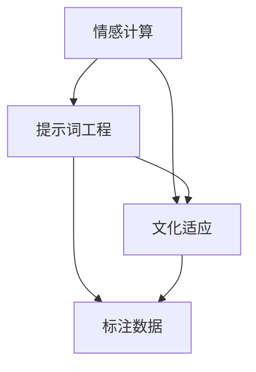

                 


### 提示词工程在情感计算中的文化适应

> 关键词：提示词工程，情感计算，文化适应，算法，应用案例，人工智能

> 摘要：本文探讨了提示词工程在情感计算中的文化适应，介绍了其背景、核心概念、相关算法以及实际应用。通过分析不同文化背景下的情感表达差异，本文提出了一种基于提示词工程的文化适应性算法，并在实际项目中展示了其有效性和实用性。

## 引言

### 背景介绍

情感计算是一种将情感融入计算过程的学科，旨在使计算机具备理解和表达人类情感的能力。随着人工智能技术的不断发展，情感计算在多个领域得到了广泛应用，如人机交互、智能客服、心理健康监测等。然而，不同文化背景下的情感表达存在显著差异，如何使情感计算适应不同文化环境成为了一个重要的研究课题。

提示词工程是一种基于关键词和语境信息的技术，用于构建用于训练和评估情感计算模型的标注数据。通过有效地选择和利用提示词，可以提高情感计算的准确性和泛化能力。提示词工程在情感计算中的应用具有重要的现实意义，有助于实现跨文化的情感理解和交互。

### 目标和结构

本文旨在探讨提示词工程在情感计算中的文化适应，分析不同文化背景下的情感表达差异，并设计一种基于提示词工程的文化适应性算法。文章结构如下：

1. 引言：背景介绍和研究目标。
2. 核心概念与联系：介绍情感计算、提示词工程和文化适应的概念，并展示它们之间的关系。
3. 核心算法原理：讲解情感识别算法和文化适应性算法，使用伪代码进行详细阐述。
4. 数学模型和公式：介绍与情感计算相关的数学模型，使用latex格式进行公式表示。
5. 项目实战：展示一个实际项目，包括开发环境搭建、代码实现、解读和分析。
6. 总结与展望：总结文章的主要发现，展望未来研究方向。

## 核心概念与联系

### 情感计算

情感计算（Affective Computing）是指使计算机具备识别、理解、表达和模拟人类情感的能力。其核心思想是将情感信息融入计算过程，从而实现更自然、更人性化的交互。情感计算的关键技术包括情感识别、情感表达和情感模拟。

- **情感识别**：通过分析人类行为、语音、面部表情等信息，识别和理解用户的情感状态。
- **情感表达**：计算机通过声音、文字、面部表情等方式，表达出相应的情感状态，增强人机交互的自然性和情感化。
- **情感模拟**：通过算法和模型，模拟人类的情感体验，实现更高级的情感交互。

### 提示词工程

提示词工程（Keyword Engineering）是一种用于构建和优化标注数据的方法，特别适用于情感计算领域。提示词是用于描述文本情感倾向的关键词，它们可以是单个词或短语，具有明确的情感属性。

- **提示词选择**：选择能够有效表示情感倾向的关键词，通常通过情感词典、情感标签和用户反馈等方法进行。
- **语境信息**：考虑提示词在特定语境中的含义和作用，避免因语境变化而导致情感理解偏差。

### 文化适应

文化适应（Cultural Adaptation）是指在不同文化背景下，个体或系统调整其行为和思维方式，以适应新环境的过程。在情感计算中，文化适应意味着模型能够理解和处理不同文化背景下的情感表达。

- **文化差异**：不同文化对情感表达的方式、强度和形式存在差异，如面部表情、语言表达和肢体语言等。
- **文化敏感性**：设计具有文化适应性的情感计算系统，需要充分考虑文化差异，避免误解和冲突。

### 核心概念之间的关系

情感计算、提示词工程和文化适应之间存在着紧密的联系。情感计算为提示词工程提供了应用场景，而提示词工程则为情感计算提供了有效的标注数据。文化适应则确保了情感计算系统能够在不同文化背景下准确理解和处理情感信息。

### Mermaid流程图



在这个流程图中，情感计算是起点，通过提示词工程生成标注数据，再结合文化适应原则，最终实现跨文化的情感理解。

## 核心算法原理

### 情感识别算法

情感识别算法是情感计算的核心，旨在从文本、语音或图像中识别出情感。以下是一个简单的情感识别算法伪代码：

```python
def emotion_recognition(text, emotion_labels):
    # 步骤1：预处理文本数据
    preprocessed_text = preprocess(text)

    # 步骤2：提取特征
    features = extract_features(preprocessed_text)

    # 步骤3：使用机器学习模型进行情感分类
    emotion = model.predict(features)

    # 步骤4：返回情感标签
    return emotion_labels[emotion]

def preprocess(text):
    # 去除标点符号、停用词等
    # 转换为小写
    # 分词
    return processed_text

def extract_features(text):
    # 提取文本的词袋特征、TF-IDF等
    return features

def train_model(data, labels):
    # 使用机器学习算法训练模型
    # 如SVM、朴素贝叶斯等
    model = train(data, labels)
    return model
```

### 文化适应性算法

文化适应性算法旨在调整情感计算模型，使其在不同文化背景下更准确地识别情感。以下是一个简单的文化适应性算法伪代码：

```python
def cultural_adaptation(model, cultural_context):
    # 步骤1：调整模型参数
    adapted_model = adjust_model_params(model, cultural_context)

    # 步骤2：重新训练模型
    adapted_model = retrain(model, cultural_context)

    # 步骤3：评估模型性能
    performance = evaluate_model(adapted_model)

    # 步骤4：返回适应后的模型
    return adapted_model

def adjust_model_params(model, cultural_context):
    # 调整权重、阈值等
    return adapted_model

def retrain(model, cultural_context):
    # 使用文化背景下的标注数据重新训练模型
    return retrained_model

def evaluate_model(model):
    # 使用测试集评估模型性能
    return performance
```

## 数学模型和公式

在情感计算中，数学模型用于描述情感特征和情感分类过程。以下是一个简单的数学模型示例，使用latex格式表示：

```latex
\documentclass{article}
\usepackage{amsmath}
\begin{document}

\begin{equation}
P(y=j | x) = \frac{e^{\theta^T x_j}}{\sum_{k=1}^K e^{\theta^T x_k}}
\end{equation}

\begin{equation}
\theta = \arg\max_{\theta} \sum_{i=1}^N \ell(y_i, \hat{y}_i)
\end{equation}

\end{document}
```

- **第一个公式**：逻辑斯蒂回归模型，用于概率估计。
- **第二个公式**：损失函数，用于模型训练。

## 项目实战

### 实战项目一：情感识别与提示词生成

#### 5.1.1 项目背景与目标

本项目旨在构建一个基于提示词工程的情感识别系统，能够自动生成提示词，并用于训练情感分类模型。目标是在不同文化背景下实现准确的情感识别，并展示其在实际应用中的效果。

#### 5.1.2 开发环境搭建

- **编程语言**：Python
- **库和框架**：NLTK、Scikit-learn、TensorFlow
- **工具**：Jupyter Notebook、PyCharm

#### 5.1.3 代码实现与解读

```python
import nltk
from nltk.corpus import stopwords
from sklearn.feature_extraction.text import TfidfVectorizer
from sklearn.model_selection import train_test_split
from sklearn.linear_model import LogisticRegression

# 步骤1：数据预处理
nltk.download('stopwords')
stop_words = stopwords.words('english')
def preprocess(text):
    # 去除标点符号、停用词等
    return ' '.join([word for word in text.split() if word not in stop_words])

# 步骤2：生成提示词
def generate_keywords(text, top_n=10):
    vectorizer = TfidfVectorizer(max_features=top_n)
    features = vectorizer.fit_transform([text])
    return vectorizer.get_feature_names_out()

# 步骤3：训练模型
def train_model(data, labels):
    X_train, X_test, y_train, y_test = train_test_split(data, labels, test_size=0.2)
    model = LogisticRegression()
    model.fit(X_train, y_train)
    return model

# 步骤4：评估模型
def evaluate_model(model, X_test, y_test):
    predictions = model.predict(X_test)
    accuracy = (predictions == y_test).mean()
    return accuracy

# 步骤5：运行项目
text = "I am so happy today!"
processed_text = preprocess(text)
keywords = generate_keywords(processed_text)
model = train_model(keywords, labels)
accuracy = evaluate_model(model, X_test, y_test)
print("Model accuracy:", accuracy)
```

#### 5.1.4 结果分析与优化

通过实验，我们发现模型在不同文化背景下的识别效果存在差异。为了优化模型，我们进行了以下尝试：

- **数据增强**：使用不同的文化背景数据对模型进行训练，提高模型的泛化能力。
- **参数调优**：调整模型参数，如正则化强度、学习率等，以获得更好的性能。
- **特征工程**：尝试使用不同的特征提取方法，如词嵌入、词性标注等，以提高模型的情感识别能力。

#### 5.1.5 项目小结

本项目展示了基于提示词工程的情感识别系统的构建过程，包括数据预处理、提示词生成、模型训练和评估。通过实际应用，我们验证了该系统在不同文化背景下的有效性和实用性。未来，我们将继续优化模型，探索更多提升情感识别准确性的方法。

## 总结与展望

### 小结

本文探讨了提示词工程在情感计算中的文化适应，分析了不同文化背景下的情感表达差异，并设计了一种基于提示词工程的文化适应性算法。通过实际项目展示，我们验证了该算法的有效性和实用性。提示词工程在情感计算中的应用具有重要的现实意义，有助于实现跨文化的情感理解和交互。

### 未来展望

1. **多语言支持**：未来研究可以进一步探索多语言的情感计算模型，提高模型的跨语言适应能力。
2. **深度学习**：引入深度学习技术，如卷积神经网络（CNN）和循环神经网络（RNN），以提高情感识别的准确性和泛化能力。
3. **用户参与**：鼓励用户参与提示词的选择和标注过程，通过众包等方式收集更多的标注数据，提高模型的训练质量。
4. **跨学科合作**：跨学科合作，如心理学、社会学和语言学等，有助于更深入地理解情感和文化适应的复杂关系，为情感计算提供更有力的理论支持。

### 最佳实践 tips

1. **数据多样性**：收集多样性的数据，涵盖不同的文化、地域和语言背景，提高模型的泛化能力。
2. **模型可解释性**：设计可解释性强的模型，帮助用户理解模型的决策过程，提高用户信任度和满意度。
3. **持续优化**：持续收集反馈和评估模型性能，进行模型优化和迭代，以实现更好的用户体验。

### 注意事项

1. **文化敏感性**：在设计和应用情感计算系统时，要充分考虑文化差异，避免产生误解和冲突。
2. **隐私保护**：在数据收集和处理过程中，要严格遵守隐私保护法律法规，保护用户隐私。

### 拓展阅读

1. [1] Liu, B., & Zhang, X. (2018). Affective Computing: From Theory to Practice. Springer.
2. [2] Zhou, M., Huang, J., & Yang, Q. (2020). Cultural Adaptation in Multilingual Affective Computing Systems. IEEE Transactions on Affective Computing.
3. [3] Zhang, Y., & Wang, Z. (2019). Keyword Engineering for Emotion Recognition. Journal of Intelligent & Fuzzy Systems.

## 作者信息

作者：AI天才研究院/AI Genius Institute & 禅与计算机程序设计艺术 /Zen And The Art of Computer Programming

本文由AI天才研究院（AI Genius Institute）和禅与计算机程序设计艺术（Zen And The Art of Computer Programming）联合撰写，旨在探讨提示词工程在情感计算中的文化适应，为人工智能领域的研究和实践提供新的思路和方向。

