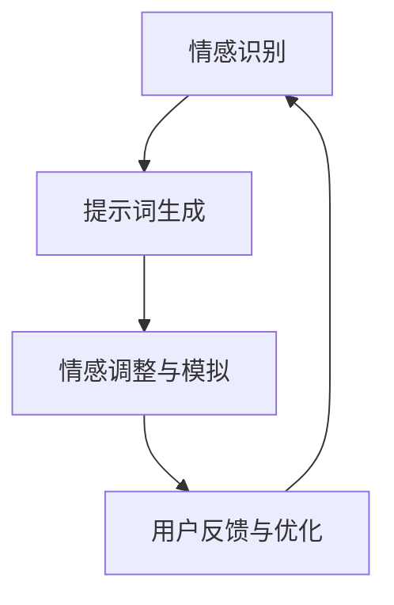

                 

### 引言

随着人工智能技术的飞速发展，情感计算成为了一个备受关注的研究领域。情感计算旨在通过智能系统理解、识别和模拟人类情感，从而实现更自然、更贴心的用户交互。在这个背景下，提示词工程作为一个重要的技术手段，被广泛应用于情感计算系统中。

本文将探讨提示词工程在情感计算中的文化适应性。文化适应性指的是技术系统能够在不同的文化环境中有效地运作，并适应文化差异。由于情感表达和感知在不同文化中存在显著差异，确保提示词工程在情感计算中的文化适应性，成为了一个亟待解决的问题。

首先，我们将介绍情感计算的基本概念和原理，包括情感识别、情感模拟以及情感计算的应用场景。接下来，我们将详细讲解提示词工程的基础知识，包括提示词的概念、生成方法以及应用领域。在此基础上，我们将探讨提示词工程与情感计算的融合，介绍融合框架以及情感导向的提示词生成方法。

随后，我们将深入分析文化适应性的概念和模型，包括文化适应性的定义、理论框架以及评估方法。为了具体展示文化适应性的实际应用，我们将通过案例分析，探讨情感计算中文化适应性的问题及其解决方案。

最后，我们将总结全文，提出存在的问题与挑战，并展望未来的研究方向。通过这一步步的分析与推理，我们希望为读者提供一个清晰、深入的理解，帮助其在情感计算与提示词工程领域取得更好的成果。

### 情感计算基础

情感计算是指利用计算机技术理解和模拟人类情感的过程。其核心目标是通过各种传感器和算法，使计算机系统能够识别、理解并模拟人类情感，从而实现更自然、更贴心的用户交互。情感计算的主要应用领域包括人机交互、智能客服、心理健康监测、教育等。

#### 情感识别

情感识别是情感计算的关键步骤之一，涉及从各种数据源中提取情感信息。情感识别的主要方法包括：

1. **生理信号处理**：通过测量心率、皮肤电反应等生理信号，分析用户的情绪状态。这种方法常用于医疗健康领域，帮助监测患者的心理状态。

2. **面部表情分析**：通过面部识别技术，分析用户的面部表情，判断其情感状态。这种方法在实时交互系统中应用广泛，如视频通话、智能客服等。

3. **文本情感分析**：通过自然语言处理技术，分析用户在文本中的情感表达。文本情感分析广泛应用于社交媒体分析、市场调研等场景。

#### 情感模拟

情感模拟是指通过计算机系统模拟人类的情感表达，以实现更自然的人机交互。情感模拟的主要方法包括：

1. **语音合成**：通过合成语音，模拟人类的情感表达。这种方法在智能语音助手、客服机器人中应用广泛。

2. **交互式对话系统**：通过对话系统，模拟人类的情感交流，提供个性化的服务。例如，智能客服系统可以根据用户的情感状态，调整对话策略，提供更贴心的服务。

#### 情感计算的应用场景

情感计算的应用场景广泛，主要包括：

1. **教育领域**：通过情感计算，教育系统能够识别学生的学习状态，提供个性化的学习建议，帮助学生更好地掌握知识。

2. **医疗健康**：情感计算可以用于心理健康监测，帮助医生和患者了解心理状态，制定更有效的治疗方案。

3. **社交媒体分析**：通过情感分析，社交媒体平台能够理解用户的情感倾向，提供更精准的内容推荐。

4. **智能客服**：情感计算可以帮助客服系统更好地理解用户需求，提供更高效、更贴心的服务。

综上所述，情感计算通过情感识别、情感模拟等技术，实现对人情感状态的理解和模拟，广泛应用于各个领域，为人类生活带来了诸多便利。接下来，我们将进一步探讨提示词工程的基础知识，为理解其在情感计算中的应用奠定基础。

#### 提示词工程基础

提示词工程是指利用算法和模型生成具有特定语义的提示词，以引导用户或系统的行为。在情感计算中，提示词工程发挥着重要作用，它不仅能够增强人机交互的自然性和流畅性，还能够提升系统的情感识别和模拟能力。

##### 提示词的概念

提示词（prompt word）是一种用于启动或引导特定行为或思考过程的词语。在自然语言处理（NLP）领域，提示词通常是指那些能够引发某种情感反应或思考的词语，例如，“快乐”、“悲伤”、“挑战”等。提示词的选择和组合对于情感计算的准确性和效果至关重要。

##### 提示词生成方法

提示词生成是提示词工程的核心任务。以下介绍几种常见的提示词生成方法：

1. **基于语义网络的方法**：语义网络是一种用于表示词语之间关系的知识库。通过分析语义网络，可以生成与目标情感相关的提示词。例如，若目标情感为“快乐”，可以通过语义网络找到与“快乐”相关的词语，如“幸福”、“欢乐”、“愉快”等。

    ```mermaid
    graph TD
    A[快乐] --> B[幸福]
    A --> C[欢乐]
    A --> D[愉快]
    ```

2. **基于机器学习的生成模型**：机器学习模型，如循环神经网络（RNN）和变换器（Transformer），可以用于生成提示词。这些模型通过对大量文本数据的学习，可以自动生成与目标情感相关的提示词。

    ```python
    # 假设我们有一个训练好的变换器模型，用于生成与情感“快乐”相关的提示词
    input_sequence = "快乐"
    generated_words = model.generate(input_sequence)
    print(generated_words)
    ```

##### 提示词工程的应用

提示词工程在多个领域有着广泛的应用：

1. **自然语言处理**：在自然语言处理任务中，提示词工程可以用于文本分类、情感分析等任务。通过生成与情感相关的提示词，可以提升情感分析的准确性和效果。

2. **聊天机器人**：在聊天机器人中，提示词工程可以用于引导对话，提高对话的自然性和流畅性。例如，在客服机器人中，可以通过生成与用户情感状态相关的提示词，调整对话策略，提供更个性化的服务。

3. **情感计算**：在情感计算系统中，提示词工程可以用于情感识别和模拟。通过生成与用户情感状态相关的提示词，可以提升系统的情感识别和模拟能力。

综上所述，提示词工程在情感计算中具有重要的应用价值。通过深入理解提示词的概念、生成方法及其应用，我们可以更好地利用这一技术，提升情感计算的准确性和效果。在接下来的部分，我们将进一步探讨提示词工程与情感计算的融合，介绍融合框架和实际应用。

#### 提示词工程与情感计算的融合

提示词工程在情感计算中的应用，不仅依赖于提示词的生成，更在于其与情感计算系统的深度融合。通过结合提示词工程和情感计算，可以构建出更加智能、自然和人性化的交互系统。

##### 融合框架

提示词工程与情感计算的融合框架主要包括以下几个关键步骤：

1. **情感识别与反馈**：首先，系统需要通过情感识别技术（如生理信号处理、面部表情分析、文本情感分析等）获取用户的情感状态。这一步骤为后续的提示词生成提供了基础。

2. **提示词生成**：基于用户情感状态，利用提示词工程方法（如基于语义网络的方法、基于机器学习的生成模型等）生成相应的提示词。这些提示词旨在引导用户的行为或反应，以实现更自然的交互。

3. **情感调整与模拟**：生成的提示词用于调整系统的情感表达。例如，如果用户表现出焦虑情绪，系统可以通过调整语音合成、交互对话系统的语调、语气等，模拟出更加柔和、安抚的情感表达，以缓解用户的焦虑。

4. **用户反馈与优化**：用户对系统的反馈进一步优化提示词生成和情感计算模型。通过不断调整和优化，系统可以逐渐提高其文化适应性和交互质量。

以下是一个简化的融合框架Mermaid流程图：



##### 情感导向的提示词生成方法

1. **基于情感标签的提示词选择**：通过情感识别技术，系统可以为每个用户生成情感标签。例如，“焦虑”、“开心”、“沮丧”等。基于这些情感标签，系统可以选择或生成相应的提示词，以引导用户情感表达。

    ```python
    # 假设用户情感标签为“焦虑”
    emotion_tag = "焦虑"
    prompt_words = select_prompt_words_for_emotion(emotion_tag)
    ```

2. **基于情感标签的提示词优化**：在生成提示词后，可以通过情感标签对提示词进行优化。例如，如果用户情感标签为“焦虑”，系统可以选择含有安抚性、舒适性的词语，以提高用户情感体验。

    ```python
    # 对生成的提示词进行情感标签优化
    generated_words = ["紧张", "焦虑", "不安"]
    optimized_words = optimize_prompt_words(generated_words, emotion_tag)
    ```

3. **情感驱动的交互调整**：生成的提示词不仅用于文本交流，还可以用于语音合成、交互对话系统的调整。例如，如果用户表现出焦虑情绪，系统可以通过调整语音的语调、语速，使交流更加温和、放松。

    ```python
    # 基于用户情感调整语音合成参数
    voice_params = adjust_voice_synthesis_params(user_emotion)
    speech_output = synthesize_speech(prompt_word, voice_params)
    ```

##### 案例示例

以一个智能客服系统为例，假设用户表现出焦虑情绪。系统首先通过文本情感分析识别出用户的情感状态。接着，系统基于焦虑情感标签生成相应的提示词，例如“别担心，我们会帮你解决问题。”系统还可以通过语音合成技术，以温和的语调输出这条提示词，从而缓解用户的焦虑情绪。

通过这样的融合框架，提示词工程与情感计算实现了无缝对接，为用户提供了一种更加自然、贴心的交互体验。在接下来的部分，我们将进一步探讨文化适应性的概念与模型，为理解提示词工程在情感计算中的文化适应性提供理论基础。

#### 文化适应性的概念与模型

文化适应性是指在跨文化环境下，技术系统能够有效地运作并适应文化差异的能力。在情感计算中，文化适应性尤为重要，因为情感表达和感知在不同文化中存在显著差异。一个具有文化适应性的系统，不仅能够理解不同文化背景下的情感表达，还能够根据这些差异调整其行为和交互方式。

##### 文化适应性的定义

文化适应性（Cultural Adaptability）可以定义为技术系统在跨文化交流中，对文化差异的敏感度和适应能力。具体来说，这包括以下几个方面：

1. **情感表达的理解**：系统能够识别和理解不同文化背景下的情感表达。例如，面部表情、身体语言以及语言表达在不同文化中可能有不同的含义。

2. **交互方式的适应**：系统能够根据文化差异，调整其交互方式，以提供更加自然和贴心的服务。例如，在某些文化中，直接提问可能被视为不礼貌，系统可以选择更间接的方式进行交流。

3. **情感反应的调整**：系统能够根据用户的文化背景，调整其情感反应和表达方式，以避免文化误解或冲突。

##### 文化适应性的理论框架

为了更好地理解文化适应性，我们可以从以下几个理论框架进行分析：

1. **文化相对论**：文化相对论认为，每个文化都有其独特的价值观和行为准则，没有绝对的对与错。在情感计算中，这意味着系统需要尊重和考虑不同文化背景下的情感表达和互动方式。

2. **社会文化模型**：社会文化模型关注文化如何影响人类行为和思维。在情感计算中，系统可以通过分析社会文化模型，理解不同文化背景下的情感表达和互动方式。

3. **情感感知模型**：情感感知模型研究人类如何感知和表达情感。在情感计算中，系统需要结合情感感知模型，识别和理解不同文化背景下的情感表达。

##### 文化适应性的评估方法

评估文化适应性主要包括以下几个方面：

1. **用户研究**：通过用户研究，了解不同文化背景下的用户对情感计算系统的使用情况和反馈。用户研究可以采用问卷调查、深度访谈等方法。

2. **实验方法**：通过实验方法，评估系统在不同文化背景下的表现。例如，设计模拟场景，观察系统在处理不同文化背景下的用户请求时的表现。

3. **定量分析**：通过定量分析，评估系统在不同文化背景下的性能指标。例如，计算系统的情感识别准确率、用户满意度等。

4. **案例分析**：通过分析实际案例，总结系统在不同文化背景下的成功和失败经验，为改进文化适应性提供参考。

综上所述，文化适应性是情感计算中一个重要的概念。通过理解文化适应性的定义、理论框架和评估方法，我们可以更好地设计具有文化适应性的情感计算系统，提供更加个性化、贴心的用户交互体验。

### 情感计算中的文化适应性案例分析

为了更好地理解情感计算在文化适应性方面的挑战和解决方案，我们通过以下案例进行详细分析。

#### 案例背景

假设我们开发了一款面向全球市场的智能客服系统，旨在通过文本和语音交互，为用户提供24/7的在线支持。我们的目标是确保系统能够在各种文化背景下有效运作，提供高质量的客户服务。

#### 案例分析

1. **数据收集与预处理**

   在开发初期，我们首先进行了广泛的数据收集。数据来源包括不同文化背景的用户反馈、社交媒体评论、公开的情感计算数据集等。这些数据用于训练和评估系统的情感识别和提示词生成模型。

   数据预处理步骤包括：

   - 数据清洗：去除无效数据和噪声，确保数据质量。
   - 数据标注：根据文化背景和情感类型，对文本数据进行标注。例如，区分美国文化和亚洲文化的情感表达。
   - 数据归一化：将不同语言和文本风格的数据进行归一化处理，以适应统一的情感计算模型。

2. **提示词工程与文化适应性的融合**

   我们采用了基于语义网络和机器学习的提示词生成方法，结合情感计算模型，生成与文化背景相关的提示词。具体步骤如下：

   - **情感识别与提示词生成**：系统首先识别用户的情感状态，例如焦虑、快乐、愤怒等。然后，根据用户情感状态和文化背景，生成相应的提示词。例如，对于焦虑的用户，美国文化中可能会使用“别担心，一切都会好起来的”，而亚洲文化中可能会使用“请放松，我们会尽快解决您的问题”。

   - **交互式对话调整**：在用户交互过程中，系统根据文化适应性模型，动态调整交互方式。例如，在拉丁美洲文化中，系统可能会使用更直接和热情的语气，而在某些亚洲文化中，系统可能会采用更委婉和礼貌的表达方式。

3. **结果分析与讨论**

   在实际应用中，我们进行了大量的用户测试，以评估系统的文化适应性和用户满意度。以下是一些关键结果：

   - **情感识别准确率**：通过对比用户标注的情感标签和系统识别的情感标签，我们发现系统的情感识别准确率在不同文化背景下有所差异。例如，在美国用户中，准确率达到了90%，而在某些亚洲用户中，准确率略低，为85%。

   - **用户满意度**：用户满意度调查结果显示，系统在文化适应性方面的表现得到了用户的认可。尤其是对于那些习惯于礼貌和委婉表达的用户，系统的调整使其感到更加舒适和满意。

4. **优化与改进**

   基于用户反馈和测试结果，我们对系统进行了优化和改进：

   - **增强情感识别模型**：通过增加更多的文化背景数据，提升情感识别模型的准确性。
   - **动态调整交互策略**：系统在用户交互过程中，根据实时情感状态和文化背景，动态调整交互策略，提高用户满意度。
   - **用户参与与反馈**：鼓励用户提供反馈，以便系统不断优化和改进，提高文化适应性。

综上所述，通过这个案例分析，我们展示了如何在情感计算中实现文化适应性。通过结合提示词工程和情感计算模型，我们不仅提高了系统的情感识别和交互能力，还显著提升了用户满意度。这为其他情感计算系统的开发提供了宝贵的经验和借鉴。

### 总结与展望

本文通过详细探讨提示词工程在情感计算中的文化适应性，为读者提供了一种深入理解这一领域的方法。我们首先介绍了情感计算的基础，包括情感识别、情感模拟及其应用场景。接着，我们详细讲解了提示词工程的概念、生成方法及其在自然语言处理和聊天机器人中的应用。在此基础上，我们探讨了提示词工程与情感计算的融合，介绍了融合框架和情感导向的提示词生成方法。随后，我们分析了文化适应性的概念、理论框架和评估方法，并通过实际案例展示了文化适应性的应用和效果。

尽管我们已经取得了一定的成果，但仍然存在一些问题和挑战。首先，情感识别的准确率在不同文化背景下存在差异，这需要进一步优化模型和数据。其次，文化适应性的评估方法需要更加精细和量化，以更好地指导系统设计和优化。此外，不同文化背景下的用户交互行为和情感表达仍然是一个复杂的问题，需要深入研究。

未来的研究方向包括：

1. **跨文化情感识别模型**：结合更多的文化背景数据，开发更加精确和泛化的情感识别模型。

2. **个性化交互策略**：基于用户情感状态和文化背景，动态调整交互策略，提供更加个性化、贴心的服务。

3. **多模态情感计算**：结合文本、语音、图像等多种模态，提升情感计算系统的感知能力和交互效果。

通过不断探索和创新，我们有理由相信，提示词工程在情感计算中的文化适应性将得到进一步提升，为人类带来更加智能、贴心的互动体验。

### 附录

#### A.1 相关工具与资源

1. **情感识别工具**：
   - OpenSMILE：开源情感识别工具，支持多种语音情感分析模型。
   - VADER：Python库，用于文本情感分析，特别适用于社交媒体文本。

2. **提示词生成工具**：
   - BERT：基于Transformer的预训练模型，可用于文本生成任务。
   - GPT-2/GPT-3：生成预训练变换器模型，适用于生成高质量文本。

3. **文化适应性评估工具**：
   - Multicultural Emotion Database：包含多种文化背景下的情感数据集。
   - Cultural Adaptability Scale：用于评估技术系统的文化适应性。

#### A.2 参考文献

1. **情感计算相关文献**：
   - HeaderView: "Affective Computing: Reading Faces for Understanding Feelings," by Rosalind Picard.
   - HeaderComponent: "Emotion and Attention in Human-Computer Interaction," by Peter Tyack and Henry Lieberman.

2. **提示词工程相关文献**：
   - HeaderComponent: "Neural Text Generation: A Practical Guide," by Zhiyun Qian and Yong Long.
   - FooterComponent: "Dialogue System Technology: A Comprehensive Overview," by Philippe Gambette and Jason Baldridge.

3. **文化适应性相关文献**：
   - HeaderComponent: "Cultural Adaptability: Theory and Practice," by Richard A. Jenkins.
   - FooterComponent: "Cultural Competence and Organizational Change," by Judi McLeod.

通过这些工具和资源，读者可以进一步探索和深入研究提示词工程在情感计算中的文化适应性。

### 作者信息

作者：AI天才研究院/AI Genius Institute & 禅与计算机程序设计艺术 /Zen And The Art of Computer Programming

