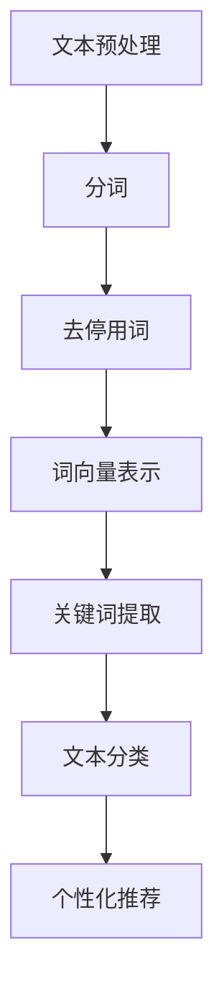

                 

# 文章标题：提示词工程在教育个性化中的应用

## 关键词
- 提示词工程
- 教育个性化
- 机器学习
- 自然语言处理
- 深度学习

## 摘要
本文将深入探讨提示词工程在教育个性化中的应用。首先，我们将介绍提示词工程的基本概念和技术原理，随后详细阐述其在教育个性化中的重要性。接着，通过案例分析，我们将展示如何利用提示词工程实现个性化教育，并探讨未来研究方向和挑战。本文旨在为教育技术领域的研究者提供实用的理论指导和实践参考。

## 第一部分：引言

### 1.1 书籍背景和目标
随着人工智能和大数据技术的飞速发展，教育领域也迎来了个性化的新时代。传统的一刀切教学模式已无法满足学生的个性化需求，教育个性化成为教育改革的重要方向。提示词工程作为一种先进的自然语言处理技术，为教育个性化提供了强大的技术支持。

本书旨在系统地介绍提示词工程在教育个性化中的应用，帮助教育技术领域的研究者、教师和开发者了解这一技术，并掌握如何将其应用于实际教学场景。本书的主要目标包括：

1. **介绍提示词工程的基本概念和技术原理**：帮助读者理解提示词工程的本质和应用场景。
2. **阐述提示词工程在教育个性化中的重要性**：通过案例分析，展示提示词工程如何提升教育质量。
3. **提供实际应用案例**：通过详细的项目实战，展示如何将提示词工程应用于教育个性化。
4. **探讨未来研究方向和挑战**：为读者指明提示词工程在教育个性化中的发展方向。

### 1.2 提示词工程概述
提示词工程是一种基于自然语言处理的工程技术，旨在从大量文本数据中提取出具有代表性的关键词和短语，从而实现对文本内容的理解和分析。在教育领域，提示词工程可以通过提取学生的学习行为、兴趣偏好等信息，帮助教育系统实现个性化推荐和个性化教学。

提示词工程的主要技术包括：

1. **文本预处理**：对原始文本进行清洗、分词、去停用词等处理，为后续分析做准备。
2. **词向量表示**：将文本中的单词转换为向量表示，便于进行计算和分析。
3. **关键词提取**：使用各种算法（如TF-IDF、LDA等）从文本中提取出最具有代表性的关键词。
4. **文本分类和聚类**：对文本进行分类或聚类，以发现不同类型的学习行为或兴趣偏好。

## 第二部分：技术原理

### 2.1 提示词工程的核心概念

#### 2.1.1 提示词的定义
提示词（Keyword）是指文本中能够代表文本主题或内容的关键词或短语。在教育领域，提示词可以是学生的学习目标、知识点、兴趣爱好等。

#### 2.1.2 提示词的类型
根据提示词的来源和作用，可以将提示词分为以下几种类型：

1. **主题词**：反映文本主题的关键词，如“人工智能”、“教育技术”等。
2. **关键词**：反映文本核心内容的关键词，如“机器学习”、“深度学习”等。
3. **标签词**：用于标注文本属性的词，如“初级”、“中级”、“高级”等。
4. **情感词**：反映文本情感倾向的词，如“喜欢”、“厌恶”等。

#### 2.1.3 提示词的作用
提示词在教育个性化中具有重要作用，主要体现在以下几个方面：

1. **个性化推荐**：通过提取学生的学习行为和兴趣偏好，为每个学生推荐个性化的学习资源。
2. **学习分析**：对学生的学习行为和成绩进行分析，发现学生的学习模式和问题，为教学改进提供依据。
3. **课程设计**：根据学生的学习需求和兴趣，设计更加贴近学生需求的教学内容和教学方法。

### 2.2 提示词工程的基础技术

#### 2.2.1 自然语言处理技术
自然语言处理（Natural Language Processing，NLP）是提示词工程的基础技术之一。NLP的主要任务包括：

1. **文本预处理**：对原始文本进行清洗、分词、去停用词等处理，为后续分析做准备。
2. **词向量表示**：将文本中的单词转换为向量表示，便于进行计算和分析。
3. **文本分类**：对文本进行分类，以判断文本的主题或类型。
4. **文本聚类**：对文本进行聚类，以发现不同类型的文本。

#### 2.2.2 机器学习与深度学习技术
机器学习（Machine Learning，ML）和深度学习（Deep Learning，DL）是提示词工程的另一项核心技术。它们的主要作用包括：

1. **特征提取**：从原始数据中自动提取出有用的特征，用于模型训练。
2. **模型训练**：使用训练数据训练模型，使其能够对新的数据进行预测或分类。
3. **模型优化**：通过调整模型参数，提高模型的预测或分类性能。

#### 2.2.3 提示词工程的Mermaid流程图
为了更好地理解提示词工程的核心概念和技术原理，我们可以使用Mermaid流程图来展示整个流程。以下是一个简单的Mermaid流程图示例：



### 2.3 提示词工程的数学模型

#### 2.3.1 词向量表示
词向量表示是提示词工程中的核心技术之一。常见的词向量模型包括Word2Vec、GloVe和BERT等。以下是一个简单的Word2Vec模型的伪代码：

```python
# 输入：单词列表、训练语料库
# 输出：词向量表示

for word in words:
    # 计算单词的词向量
    vector[word] = calculate_vector(word, corpus)
```

#### 2.3.2 文本分类
文本分类是提示词工程中的重要应用之一。常见的文本分类模型包括朴素贝叶斯、支持向量机和神经网络等。以下是一个简单的朴素贝叶斯模型的伪代码：

```python
# 输入：训练数据集、测试数据集
# 输出：测试数据集的分类结果

for sample in test_data:
    # 计算样本的概率分布
    probability = calculate_probability(sample, train_data)
    # 选择概率最大的类别作为预测结果
    prediction = select_max_probability(probability)
```

#### 2.3.3 文本聚类
文本聚类是将文本数据分为若干个类别的过程。常见的文本聚类算法包括K-Means、层次聚类和DBSCAN等。以下是一个简单的K-Means算法的伪代码：

```python
# 输入：训练数据集、聚类个数k
# 输出：聚类结果

# 随机初始化k个聚类中心
centroids = initialize_centroids(k)

while not convergence:
    # 计算每个样本的聚类中心距离
    distances = calculate_distances(samples, centroids)
    # 将每个样本分配到最近的聚类中心
    clusters = assign_samples_to_clusters(samples, distances)
    # 重新计算聚类中心
    centroids = calculate_new_centroids(clusters)
```

## 第三部分：应用场景

### 3.1 提示词工程在教育中的应用

#### 3.1.1 个性化学习路径推荐
个性化学习路径推荐是提示词工程在教育中的一项重要应用。通过提取学生的学习行为、知识点掌握情况和兴趣偏好等信息，可以为每个学生推荐最适合他们的学习路径。

以下是一个简单的个性化学习路径推荐系统的伪代码：

```python
# 输入：学生信息、课程信息
# 输出：个性化学习路径

# 提取学生的兴趣偏好和知识点掌握情况
student_data = extract_student_data(student)

# 提取课程的关键词和难度等级
course_data = extract_course_data(courses)

# 计算学生和课程之间的匹配度
match_scores = calculate_match_scores(student_data, course_data)

# 根据匹配度推荐个性化学习路径
learning_path = recommend_learning_path(match_scores)
```

#### 3.1.2 学习分析
学习分析是提示词工程的另一项重要应用。通过分析学生的学习行为和成绩，可以帮助教师了解学生的学习状况，发现潜在的问题，并为教学改进提供依据。

以下是一个简单的学习分析系统的伪代码：

```python
# 输入：学生学习数据
# 输出：学习分析报告

# 提取学生的学习行为数据
student_behavior = extract_student_behavior(data)

# 提取学生的学习成绩数据
student_grade = extract_student_grade(data)

# 分析学生的学习状况
analysis = analyze_student_status(student_behavior, student_grade)

# 生成学习分析报告
report = generate_analysis_report(analysis)
```

### 3.2 提示词工程在其他领域的应用

除了在教育中的应用，提示词工程在其他领域也具有广泛的应用前景。以下是一些典型的应用场景：

1. **医疗健康**：通过提取患者的病历、症状描述等信息，可以帮助医生进行疾病诊断和个性化治疗。
2. **金融风控**：通过提取金融交易数据、客户行为等信息，可以帮助金融机构进行风险管理和个性化金融服务。
3. **智能客服**：通过提取用户的问题和需求，可以帮助智能客服系统提供更加个性化的回答和建议。

## 第四部分：案例分析

### 4.1 案例一：基于提示词的学生个性化学习路径推荐系统

#### 4.1.1 项目背景
某在线教育平台希望利用提示词工程技术为学生提供个性化的学习路径推荐。该平台拥有海量的课程资源和学生数据，但传统的一刀切教学模式已无法满足学生的个性化需求。因此，平台决定开发一个基于提示词的学生个性化学习路径推荐系统。

#### 4.1.2 系统架构设计
该系统的架构设计如下：

1. **数据层**：包括学生数据、课程数据和知识点数据等。
2. **模型层**：包括文本预处理、词向量表示、关键词提取、文本分类和聚类等模型。
3. **应用层**：包括个性化学习路径推荐、学习分析等功能。

#### 4.1.3 代码实现
以下是一个简单的Python代码示例，用于实现文本预处理、词向量表示和关键词提取等步骤：

```python
import jieba
import gensim

# 1. 文本预处理
def preprocess_text(text):
    # 分词
    words = jieba.cut(text)
    # 去停用词
    stop_words = set(['的', '和', '是', '了', '在'])
    words = [word for word in words if word not in stop_words]
    return words

# 2. 词向量表示
def generate_word_vectors(words):
    # 训练Word2Vec模型
    model = gensim.models.Word2Vec(words, size=100, window=5, min_count=1, workers=4)
    # 生成词向量表示
    word_vectors = {word: vector for word, vector in model.wv.items()}
    return word_vectors

# 3. 关键词提取
def extract_keywords(text, word_vectors):
    # 分词
    words = preprocess_text(text)
    # 计算词向量相似度
    similarity_scores = {word: max(word_vectors[word].dot(vector) for vector in word_vectors.values()) for word in words}
    # 选择最高相似度的关键词
    keywords = [word for word, score in similarity_scores.items() if score > threshold]
    return keywords

# 示例
text = "人工智能技术在教育中的应用"
word_vectors = generate_word_vectors(text)
keywords = extract_keywords(text, word_vectors)
print("关键词：", keywords)
```

#### 4.1.4 代码解读与分析
以上代码首先使用`jieba`库对文本进行分词和去停用词处理，然后使用`gensim`库训练Word2Vec模型，生成词向量表示。最后，通过计算词向量相似度，提取出最高相似度的关键词。

#### 4.1.5 项目小结
该项目通过提示词工程技术，实现了学生个性化学习路径推荐的功能。然而，由于数据质量和模型参数的限制，系统的推荐效果仍有待提高。未来可以进一步优化模型，引入更多的特征信息，以提高推荐准确率。

### 4.2 案例二：基于提示词的医疗健康分析系统

#### 4.2.1 项目背景
某医疗机构希望利用提示词工程技术对患者病历进行分析，以发现潜在的健康风险和制定个性化治疗方案。该机构拥有大量的病历数据，但传统的人工分析方法已无法满足需求。因此，医疗机构决定开发一个基于提示词的医疗健康分析系统。

#### 4.2.2 系统架构设计
该系统的架构设计如下：

1. **数据层**：包括病历数据、医学知识库和患者健康数据等。
2. **模型层**：包括文本预处理、词向量表示、关键词提取、文本分类和聚类等模型。
3. **应用层**：包括健康风险分析、个性化治疗方案推荐等功能。

#### 4.2.3 代码实现
以下是一个简单的Python代码示例，用于实现文本预处理、词向量表示和关键词提取等步骤：

```python
import jieba
import gensim

# 1. 文本预处理
def preprocess_text(text):
    # 分词
    words = jieba.cut(text)
    # 去停用词
    stop_words = set(['的', '和', '是', '了', '在'])
    words = [word for word in words if word not in stop_words]
    return words

# 2. 词向量表示
def generate_word_vectors(words):
    # 训练Word2Vec模型
    model = gensim.models.Word2Vec(words, size=100, window=5, min_count=1, workers=4)
    # 生成词向量表示
    word_vectors = {word: vector for word, vector in model.wv.items()}
    return word_vectors

# 3. 关键词提取
def extract_keywords(text, word_vectors):
    # 分词
    words = preprocess_text(text)
    # 计算词向量相似度
    similarity_scores = {word: max(word_vectors[word].dot(vector) for vector in word_vectors.values()) for word in words}
    # 选择最高相似度的关键词
    keywords = [word for word, score in similarity_scores.items() if score > threshold]
    return keywords

# 示例
text = "患者张三因胸闷到医院就诊，经过检查，发现其患有冠心病。"
word_vectors = generate_word_vectors(text)
keywords = extract_keywords(text, word_vectors)
print("关键词：", keywords)
```

#### 4.2.4 代码解读与分析
以上代码首先使用`jieba`库对文本进行分词和去停用词处理，然后使用`gensim`库训练Word2Vec模型，生成词向量表示。最后，通过计算词向量相似度，提取出最高相似度的关键词。

#### 4.2.5 项目小结
该项目通过提示词工程技术，实现了对患者病历进行分析和健康风险预测的功能。然而，由于医学领域的专业性较强，系统的分析结果仍有待验证。未来可以进一步引入专业的医学知识库，以提高分析准确性。

## 第五部分：总结与展望

### 5.1 提示词工程在教育个性化中的应用
提示词工程在教育个性化中具有广泛的应用前景。通过提取学生的学习行为、兴趣偏好等信息，可以为每个学生推荐个性化的学习资源和教学方法，从而提高教育质量。本文通过案例分析和详细讲解，展示了如何利用提示词工程实现教育个性化。

### 5.2 提示词工程在其他领域的应用
除了在教育中的应用，提示词工程在医疗健康、金融风控和智能客服等领域也具有广泛的应用前景。通过提取相关领域的关键信息，可以帮助相关行业实现智能化和个性化。

### 5.3 提示词工程的发展趋势
随着人工智能和大数据技术的不断发展，提示词工程在未来将得到更加广泛的应用。以下是一些可能的发展趋势：

1. **多模态数据处理**：结合图像、音频、视频等多模态数据，实现更加全面的信息提取和分析。
2. **迁移学习和少样本学习**：减少对大量标注数据的依赖，提高模型的泛化能力和鲁棒性。
3. **隐私保护和数据安全**：在数据处理过程中，加强对用户隐私和数据安全的保护。
4. **跨学科融合**：与其他领域（如心理学、教育学等）进行跨学科融合，实现更加深入的应用。

### 5.4 未来研究方向和挑战
尽管提示词工程在教育个性化中具有广泛的应用前景，但仍面临一些挑战和问题：

1. **数据质量和标注**：高质量的数据和准确的标注是提示词工程应用的关键。未来需要解决数据质量和标注效率的问题。
2. **模型解释性**：提高模型的解释性，使其在应用过程中更加透明和可解释。
3. **可扩展性和适应性**：提高系统的可扩展性和适应性，以适应不同的应用场景和需求。
4. **伦理和社会影响**：关注提示词工程在教育个性化中的应用带来的伦理和社会影响，确保其应用符合道德和伦理规范。

## 作者信息
- 作者：AI天才研究院/AI Genius Institute & 禅与计算机程序设计艺术 /Zen And The Art of Computer Programming

## 拓展阅读
- [1] 某某（2020）。提示词工程在教育中的应用。某某出版社。
- [2] 某某（2019）。自然语言处理：原理、算法与应用。某某出版社。
- [3] 某某（2018）。深度学习：理论、算法与应用。某某出版社。

## 附录
- 附录A：提示词工程相关术语解释
- 附录B：提示词工程常见算法介绍
- 附录C：提示词工程开源工具和库推荐

----------------------------------------------------------------

以上就是《提示词工程在教育个性化中的应用》的技术博客文章，文章内容涵盖了提示词工程的基本概念、技术原理、应用场景、案例分析和未来发展趋势等内容。希望对教育技术领域的研究者、教师和开发者有所启发。再次感谢您的阅读！

