                 

### 第1章 引言

在当今的信息时代，文本修辞生成技术已经成为自然语言处理（NLP）领域中的一个热点研究方向。文本修辞指的是通过特定的语言手法，使文本更具艺术性、感染力和表现力。传统的文本生成方法往往注重信息的传递，而在文本修辞生成中，更强调对语言的美学加工和情感表达。随着人工智能技术的快速发展，提示词工程逐渐成为推动文本修辞生成技术突破的关键力量。

#### 1.1 提示词工程概述

提示词工程，又称提示工程，是一种通过特定规则和算法对文本进行加工和优化的技术。它的核心目标是通过自动生成提示词，辅助作者创作出更具艺术性和表现力的文本。提示词工程不仅涉及文本生成，还包括文本理解和分析，是自然语言处理技术的一个重要分支。

#### 1.2 文本修辞生成背景及意义

文本修辞生成技术的重要性在于它能够将机械化的信息传递转化为具有艺术感染力的表达。这不仅在文学创作中具有重要意义，在广告宣传、产品说明书、新闻报道等多个领域也具有广泛的应用。通过文本修辞生成，可以提升文本的吸引力，增强用户的阅读体验。

#### 1.3 提示词工程在文本修辞生成中的应用前景

随着人工智能技术的不断进步，提示词工程在文本修辞生成中的应用前景十分广阔。它不仅可以用于文学创作，还可以用于广告创意、企业宣传、教育培训等多个领域。未来，随着多模态提示词生成技术的发展，提示词工程有望实现更加智能化和个性化的文本生成。

### 提示词工程在文本修辞生成中的突破

提示词工程在文本修辞生成中的应用，不仅改变了传统的文本生成模式，也为NLP领域带来了新的研究课题。通过深入理解提示词工程的基本原理和应用方法，我们可以更好地把握文本修辞生成的发展方向，推动相关技术的不断进步。

**核心概念与联系架构：**

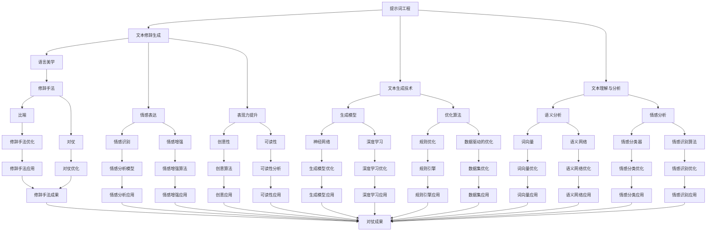

### 第2章 提示词工程基础

#### 2.1 提示词的定义与分类

提示词是指为了引导作者或读者更好地理解文本内容，或者为了实现特定修辞效果而在文本中添加的特定词汇或短语。根据提示词的功能和用途，可以将提示词分为以下几类：

1. **主题提示词**：用于明确文章的主题或内容方向，帮助读者快速把握文章的核心信息。
2. **情感提示词**：用于表达文本的情感色彩，增强文本的感染力和表现力。
3. **修辞提示词**：用于引导作者运用特定的修辞手法，如比喻、对仗等，提升文本的艺术性。
4. **逻辑提示词**：用于连接前后文，使文章逻辑更加严密，条理更加清晰。

#### 2.1.1 提示词的概念

提示词的概念可以从以下几个方面进行理解：

- **功能**：提示词具有引导和提示的功能，它可以帮助作者或读者更好地理解文本内容。
- **形式**：提示词可以是一个单词、一个短语，甚至是一个句子。
- **作用**：提示词可以用来引导情感、逻辑和修辞方向，从而提升文本的表现力。

#### 2.1.2 提示词的分类

根据提示词的不同用途，可以将提示词分为以下几类：

1. **主题提示词**：如“未来科技”、“环境保护”等，用于明确文章的主题或方向。
2. **情感提示词**：如“欣喜”、“忧虑”、“感动”等，用于表达文本的情感色彩。
3. **修辞提示词**：如“犹如”、“仿佛”、“恰似”等，用于引导修辞手法，提升文本的艺术性。
4. **逻辑提示词**：如“因此”、“然而”、“总之”等，用于连接前后文，使文章逻辑更加严密。

#### 2.2 提示词生成方法

提示词的生成方法可以分为数据驱动、知识驱动和混合驱动三种。

##### 2.2.1 数据驱动的提示词生成

数据驱动的提示词生成方法主要通过大规模语料库来学习提示词的生成模式。具体步骤如下：

1. **数据收集**：收集大量含有提示词的文本数据。
2. **预处理**：对收集到的数据进行分析和清洗，去除无关信息。
3. **特征提取**：从预处理后的数据中提取特征，如词频、词向量等。
4. **模型训练**：使用特征数据训练生成模型，如循环神经网络（RNN）、长短时记忆网络（LSTM）等。
5. **生成提示词**：使用训练好的模型生成新的提示词。

##### 2.2.2 知识驱动的提示词生成

知识驱动的提示词生成方法主要通过知识图谱和语义网络来生成提示词。具体步骤如下：

1. **知识图谱构建**：构建包含主题、情感、修辞等信息的知识图谱。
2. **语义分析**：对输入文本进行语义分析，提取文本的主题、情感和修辞信息。
3. **提示词生成**：根据知识图谱和文本语义信息，生成相应的提示词。

##### 2.2.3 混合驱动的提示词生成

混合驱动的提示词生成方法结合了数据驱动和知识驱动的优势，通过融合多种数据源和知识资源来生成提示词。具体步骤如下：

1. **数据源集成**：集成多种数据源，如大规模语料库、知识图谱等。
2. **多源特征融合**：从多种数据源中提取特征，并融合多源特征进行提示词生成。
3. **模型训练**：使用融合后的特征数据训练生成模型。
4. **生成提示词**：使用训练好的模型生成新的提示词。

#### 2.3 提示词优化策略

提示词生成后，需要对其进行优化，以确保生成的提示词在语义一致性、生成效率和文本质量等方面达到预期效果。

##### 2.3.1 语义一致性优化

语义一致性优化旨在确保生成的提示词与文本内容在语义上保持一致。具体策略包括：

1. **语义匹配**：使用语义匹配算法，如词向量相似性度量，确保生成的提示词与文本内容在语义上匹配。
2. **语义修正**：根据文本内容的上下文，对生成的提示词进行语义修正，使其更加符合文本内容。

##### 2.3.2 生成效率优化

生成效率优化旨在提高提示词生成的速度和效率。具体策略包括：

1. **模型优化**：对生成模型进行优化，如使用更高效的网络结构、并行计算等。
2. **数据预处理**：优化数据预处理过程，减少计算量，提高生成速度。

##### 2.3.3 质量评价与改进

质量评价与改进旨在评估生成的提示词质量，并根据评估结果进行改进。具体策略包括：

1. **评价指标**：设定评价指标，如文本质量评分、用户满意度等。
2. **质量评估**：对生成的提示词进行质量评估，识别存在的问题。
3. **改进策略**：根据质量评估结果，制定相应的改进策略，如调整模型参数、优化数据集等。

### 第3章 提示词工程与文本修辞

文本修辞是指通过特定的语言手法，使文本更具艺术性、感染力和表现力。提示词工程在文本修辞中扮演着重要的角色，它不仅能够提高文本的可读性，还能增强文本的感染力和创意性。

#### 3.1 文本修辞的基本概念

文本修辞的基本概念包括修辞手法、修辞要素和修辞效果。

##### 3.1.1 文本修辞的定义

文本修辞是指通过运用特定的语言技巧和修辞手法，使文本更具艺术性、感染力和表现力的一种语言活动。

##### 3.1.2 文本修辞的要素

文本修辞的要素包括：

1. **修辞手法**：如比喻、拟人、夸张、对仗等，是文本修辞的基本手段。
2. **修辞对象**：指文本中需要修辞处理的对象，如词语、句子、段落等。
3. **修辞目的**：指文本修辞想要达到的效果，如增强表达力、感染力、美感等。

##### 3.1.3 文本修辞的效果

文本修辞的效果主要包括：

1. **提升文本可读性**：通过修辞手法，使文本更加生动、形象，提高读者的阅读体验。
2. **增强文本感染力**：通过情感色彩和修辞手法，使文本更具吸引力，增强读者的共鸣。
3. **提升文本创意性**：通过独特的修辞技巧和创意表达，使文本更具创新性和独特性。

#### 3.2 提示词工程在文本修辞中的作用

提示词工程在文本修辞中起着重要的辅助作用，它能够提高文本的可读性、增强文本的感染力和提升文本的创意性。

##### 3.2.1 提高文本可读性

提示词工程通过生成合适的提示词，可以帮助作者更好地组织文本结构，使文本更加清晰、易懂。具体作用包括：

1. **明确主题**：通过主题提示词，使文章的主题更加明确，便于读者理解。
2. **连接段落**：通过逻辑提示词，连接前后文，使文章逻辑更加严密，条理更加清晰。
3. **增强表现力**：通过修辞提示词，使文本更具艺术性和表现力，提高读者的阅读体验。

##### 3.2.2 增强文本感染力

提示词工程通过生成具有情感色彩的提示词，可以帮助作者更好地表达情感，增强文本的感染力。具体作用包括：

1. **表达情感**：通过情感提示词，直接表达文本的情感色彩，增强读者的共鸣。
2. **营造氛围**：通过修辞手法，如比喻、拟人等，营造特定的情感氛围，增强文本的感染力。
3. **增强吸引力**：通过独特的修辞技巧和创意表达，使文本更具吸引力，吸引读者的注意力。

##### 3.2.3 提升文本创意性

提示词工程通过生成具有创意性的提示词，可以帮助作者突破传统思维，提升文本的创意性。具体作用包括：

1. **激发灵感**：通过新颖的提示词，激发作者的创意思维，产生独特的表达方式。
2. **创新表达**：通过运用独特的修辞手法和表达方式，使文本更具创意性和独特性。
3. **丰富文本**：通过多样的修辞手法和表达方式，使文本内容更加丰富，提高文本的艺术价值。

#### 3.3 提示词工程在文本修辞中的挑战与机遇

提示词工程在文本修辞中面临着一系列挑战和机遇。

##### 3.3.1 挑战

1. **语义理解**：准确理解文本的语义是提示词工程的基础，但语义理解本身是一个复杂的问题，存在一定的难度。
2. **情感表达**：情感表达是文本修辞的重要内容，但情感本身具有主观性和复杂性，需要更精细的情感识别和表达技术。
3. **创意生成**：创意生成是文本修辞的高层次任务，需要更高层次的思维能力和创造力。

##### 3.3.2 机遇

1. **人工智能技术**：随着人工智能技术的不断发展，提示词工程在语义理解、情感表达和创意生成等方面有望取得重大突破。
2. **多模态融合**：多模态融合技术的发展，为提示词工程在文本修辞中的应用提供了新的可能性。
3. **个性化需求**：随着个性化需求的增加，提示词工程在文本修辞中的应用将更加广泛，为用户带来更好的阅读体验。

### 第4章 提示词工程与修辞格

修辞格是指在文本中运用特定的语言手法，以达到增强表达效果的目的。提示词工程在修辞格的应用中，不仅能够提高文本的表现力，还能丰富文本的修辞手段。

#### 4.1 修辞格概述

修辞格是一种语言艺术，它通过运用特定的语言技巧，使文本更具艺术性和感染力。常见的修辞格包括比喻、拟人、夸张、对仗、排比等。

##### 4.1.1 修辞格的定义

修辞格是指在文本中运用特定的语言手法，以达到增强表达效果的目的。它通过对语言进行加工和艺术化处理，使文本更具表现力和艺术性。

##### 4.1.2 常见的修辞格

1. **比喻**：通过将一个事物比作另一个事物，使文本更具形象性和生动性。
2. **拟人**：将无生命的事物赋予生命，使其具有人的情感和行为。
3. **夸张**：通过夸大事物的特点或程度，使文本更具感染力和表现力。
4. **对仗**：通过字数、结构、意义等方面的对称，使文本更具韵律美和平衡感。
5. **排比**：通过句式的重复，使文本更具节奏感和力度。

#### 4.2 提示词工程在修辞格中的应用

提示词工程在修辞格中的应用，主要通过生成适合特定修辞格的提示词，帮助作者更好地运用修辞手法，提升文本的表现力。

##### 4.2.1 对偶

对偶是修辞格中的一种，它通过字数、结构、意义等方面的对称，使文本更具韵律美和平衡感。提示词工程可以通过生成对称的提示词，辅助作者创作出优美的对偶句子。

##### 4.2.2 比喻

比喻是通过将一个事物比作另一个事物，使文本更具形象性和生动性。提示词工程可以通过生成具有比喻意义的提示词，帮助作者创作出生动的比喻句子。

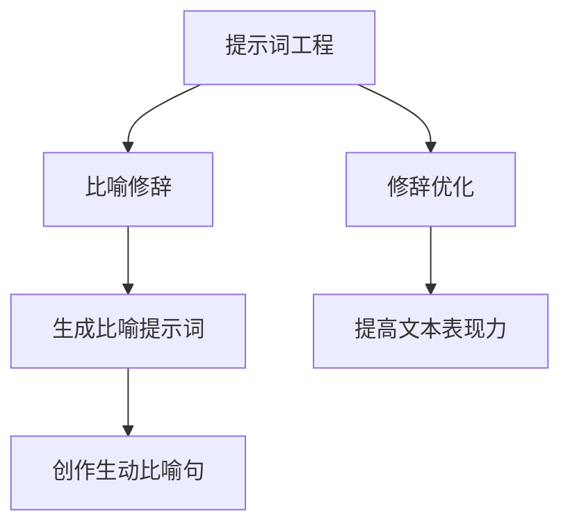

##### 4.2.3 对仗

对仗是修辞格中的一种，它通过字数、结构、意义等方面的对称，使文本更具韵律美和平衡感。提示词工程可以通过生成对称的提示词，辅助作者创作出优美的对仗句子。

#### 4.3 提示词工程在修辞格创作中的实践

在实际创作中，提示词工程可以通过以下步骤来应用修辞格：

1. **识别修辞需求**：根据文本内容和创作目标，确定需要运用的修辞格。
2. **生成提示词**：使用提示词工程生成适合特定修辞格的提示词。
3. **创作修辞句子**：使用生成的提示词创作出符合修辞格要求的句子。
4. **优化修辞效果**：对创作的修辞句子进行优化，确保修辞效果达到预期。

通过以上实践，提示词工程不仅能够提高文本的表现力，还能丰富文本的修辞手段，为创作出高质量的文本提供有力支持。

### 第5章 提示词工程与语言风格

语言风格是指文本在表达方式、语气、情感等方面的独特特征，它对于塑造文本的整体形象和读者感受具有重要作用。提示词工程在语言风格塑造中发挥着关键作用，能够帮助作者创造个性化的语言风格，适应不同的语言环境，并实现风格的转换。

#### 5.1 语言风格概述

语言风格是指文本在表达方式、语气、情感等方面的独特特征。它是语言使用者在长期的语言实践中形成的，反映了作者的思想感情、审美取向和文化背景。语言风格可以分为正式风格、非正式风格、文学风格、口语风格等。

##### 5.1.1 语言风格的概念

语言风格是指在语言表达中，作者通过选择特定的词汇、句式和修辞手法，形成的具有独特特征的文本风格。它不仅反映了作者的语言习惯和个性，还体现了文本的审美价值和文化内涵。

##### 5.1.2 语言风格的特点

1. **独特性**：每个作者都有自己独特的语言风格，这种风格具有鲜明的个性和特点。
2. **稳定性**：语言风格一旦形成，会在较长时间内保持稳定，不易改变。
3. **多样性**：不同的文本类型和语言环境会形成不同的语言风格，具有多样性。

#### 5.2 提示词工程在语言风格塑造中的作用

提示词工程在语言风格塑造中具有重要作用，它可以帮助作者在创作过程中更准确地把握语言风格，实现个性化表达。

##### 5.2.1 个性化语言风格

个性化语言风格是指作者在创作过程中，根据个人特点和创作需求，形成的具有独特风格的语言表达。提示词工程可以通过生成具有个性化特点的提示词，帮助作者塑造个性化的语言风格。

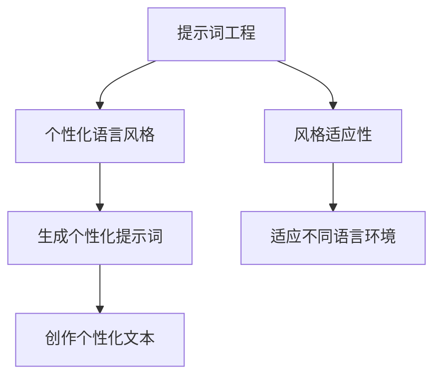

##### 5.2.2 风格适应性

风格适应性是指作者在创作过程中，根据不同的语言环境和读者需求，灵活调整语言风格，以适应不同的情境。提示词工程可以通过生成适应性的提示词，帮助作者实现风格适应性。

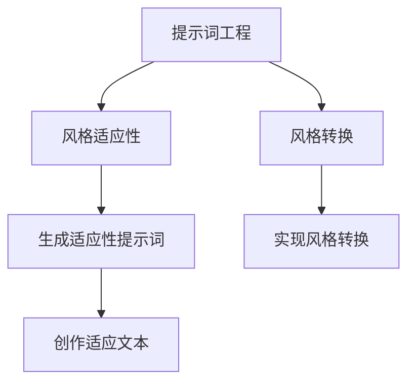

##### 5.2.3 风格转换

风格转换是指作者在创作过程中，通过改变语言风格，使文本呈现出不同的面貌。提示词工程可以通过生成具有不同风格特点的提示词，帮助作者实现风格转换。

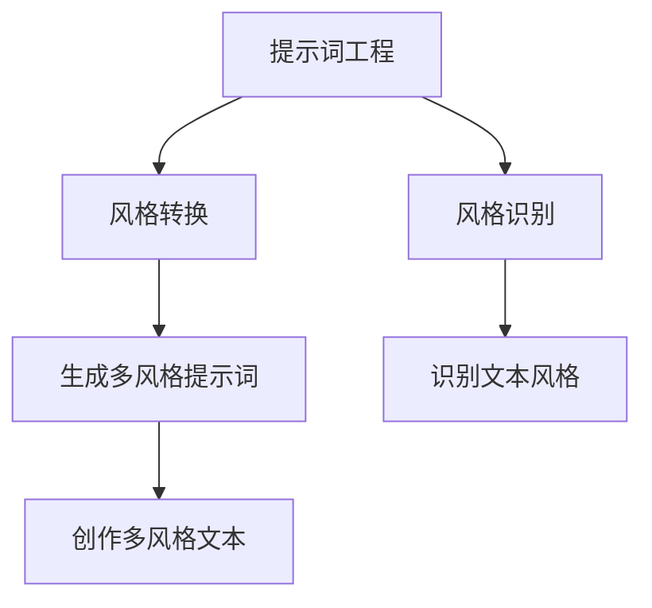

#### 5.3 提示词工程在语言风格分析中的应用

提示词工程在语言风格分析中具有广泛的应用，可以帮助研究人员识别文本风格，实现风格转换，并为文本创作提供风格指导。

##### 5.3.1 风格识别

风格识别是指通过分析文本的语言特征，识别出文本的语言风格。提示词工程可以通过生成与特定风格相关的提示词，辅助风格识别。

##### 5.3.2 风格转换

风格转换是指通过改变文本的语言特征，将文本从一个风格转换成另一个风格。提示词工程可以通过生成具有不同风格特点的提示词，辅助风格转换。

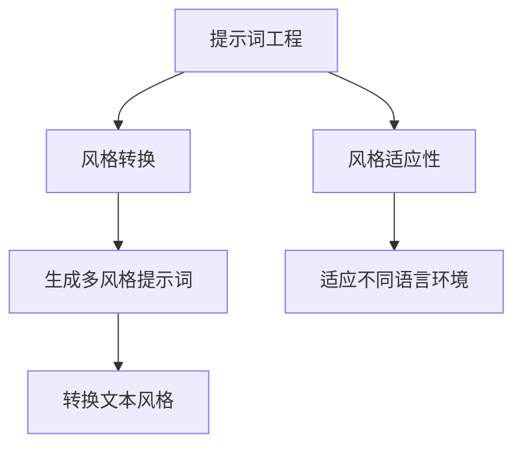

##### 5.3.3 风格生成

风格生成是指通过生成具有特定风格特点的文本，实现风格创作。提示词工程可以通过生成风格提示词，辅助风格生成。

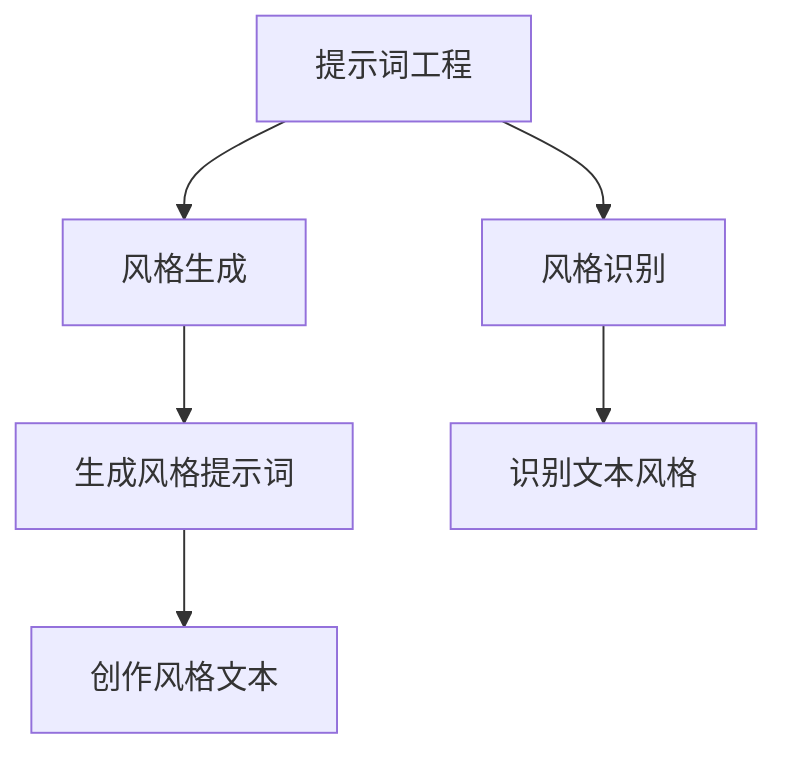

### 第6章 提示词工程与情感表达

情感表达是文本中的重要组成部分，它能够传达作者的情感态度，影响读者的情感体验。提示词工程在情感表达中发挥着重要作用，它能够识别、增强和生成情感，广泛应用于社交媒体情感分析、情感化文本生成和情感广告创作等领域。

#### 6.1 情感表达概述

情感表达是指通过语言和修辞手法，传达作者的情感态度和情绪状态。在文本中，情感表达不仅包括直接的文字描述，还涉及隐喻、象征等修辞手段。情感表达的重要性在于：

1. **增强文本感染力**：通过情感表达，文本能够更好地吸引读者的注意力，引发共鸣。
2. **提升阅读体验**：情感表达使文本更具个性化和生动性，提升读者的阅读体验。
3. **反映作者态度**：情感表达反映了作者的情感态度和价值观，有助于理解作者的思想。

##### 6.1.1 情感表达的定义

情感表达是指通过语言和修辞手段，传达作者的情感态度和情绪状态。它不仅涉及文本中的文字描述，还包括语音、语调、表情等非文字元素。

##### 6.1.2 情感表达的重要性

1. **增强文本感染力**：情感表达使文本更具吸引力，增强读者的阅读兴趣。
2. **提升阅读体验**：情感表达使文本更加生动，提升读者的阅读体验。
3. **反映作者态度**：情感表达反映了作者的情感态度和价值观，有助于理解作者的思想。

#### 6.2 提示词工程在情感表达中的作用

提示词工程在情感表达中扮演着关键角色，它能够通过生成具有情感色彩的提示词，增强文本的情感表达。

##### 6.2.1 情感识别

情感识别是指通过分析文本内容，识别出文本所表达的情感。提示词工程可以通过生成情感识别模型，辅助情感识别。

##### 6.2.2 情感增强

情感增强是指通过在文本中添加具有情感色彩的提示词，增强文本的情感表达。提示词工程可以通过生成情感增强提示词，辅助情感增强。

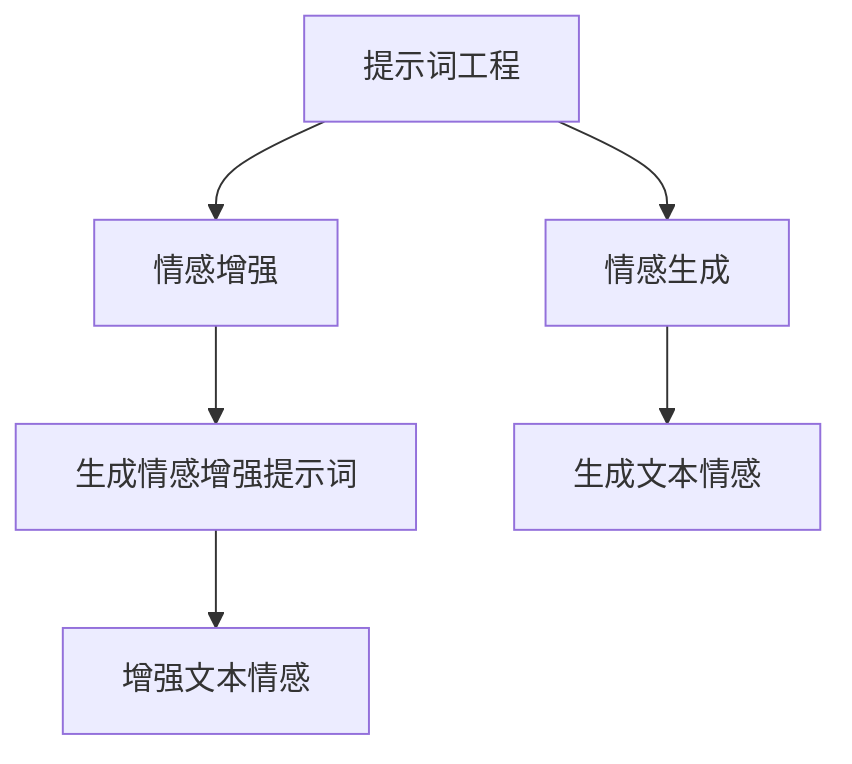

##### 6.2.3 情感生成

情感生成是指通过生成具有情感色彩的文本，传达特定的情感态度。提示词工程可以通过生成情感生成模型，辅助情感生成。

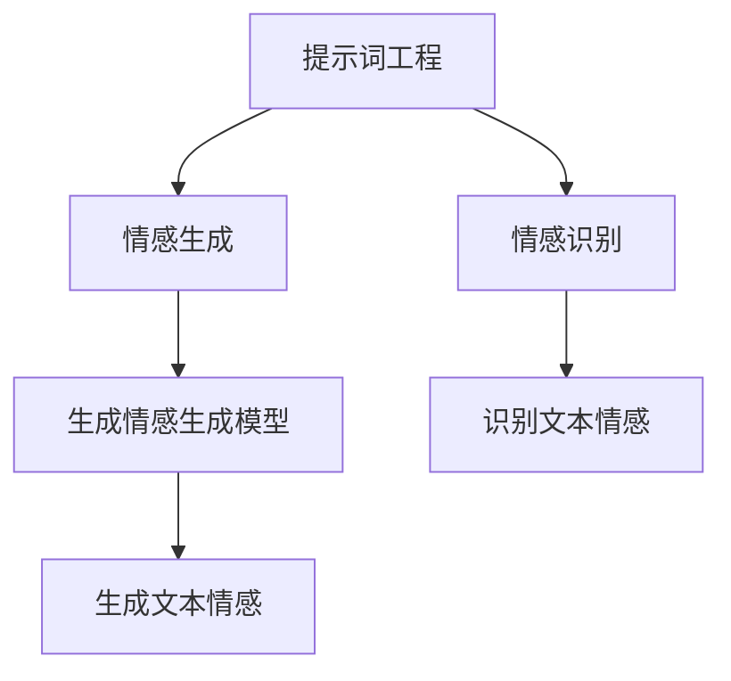

#### 6.3 提示词工程在情感表达中的应用

提示词工程在情感表达中的应用非常广泛，涵盖了社交媒体情感分析、情感化文本生成和情感广告创作等多个领域。

##### 6.3.1 社交媒体情感分析

社交媒体情感分析是指通过分析社交媒体上的文本内容，识别出文本所表达的情感。提示词工程可以通过生成情感识别模型，辅助情感分析。

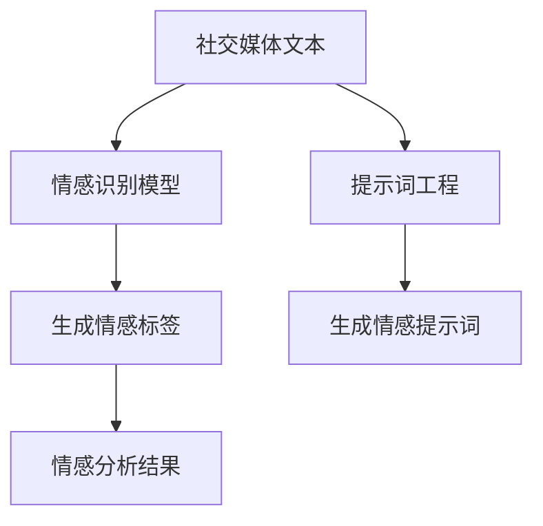

##### 6.3.2 情感化文本生成

情感化文本生成是指通过生成具有特定情感色彩的文本，传达特定的情感态度。提示词工程可以通过生成情感生成模型，辅助情感化文本生成。

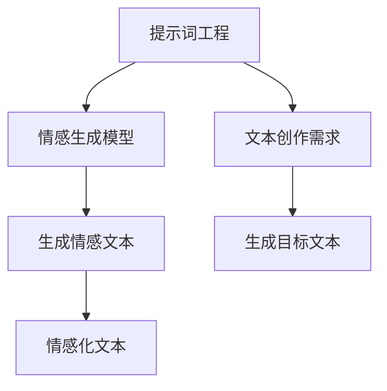

##### 6.3.3 情感广告创作

情感广告创作是指通过在广告中融入情感元素，提高广告的吸引力和效果。提示词工程可以通过生成情感增强提示词，辅助情感广告创作。

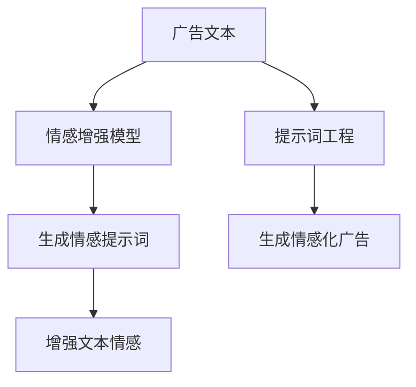

### 第7章 提示词工程与跨领域应用

提示词工程不仅在文本修辞生成领域具有重要作用，还在跨领域应用中展现出强大的潜力。跨领域应用指的是将提示词工程技术应用于不同的领域，如多语言文本生成、文本与图像结合和文本与语音结合等。这些应用不仅丰富了提示词工程的应用场景，也为相关领域的研究和实践提供了新的思路和方法。

#### 7.1 跨领域应用概述

跨领域应用是指将提示词工程技术应用于不同的领域，如自然语言处理、计算机视觉和语音识别等。这些应用包括：

1. **多语言文本生成**：利用提示词工程生成多种语言的文本，实现跨语言的信息传递和交流。
2. **文本与图像结合**：将文本和图像结合，生成更具表达力和创意性的多媒体内容。
3. **文本与语音结合**：利用提示词工程生成语音文本，实现语音信息的自动化生成和传播。

##### 7.1.1 跨领域应用的定义

跨领域应用是指在不同领域之间应用提示词工程技术，实现信息融合和创新。这些应用跨越多个学科领域，包括自然语言处理、计算机视觉、语音识别等。

##### 7.1.2 跨领域应用的意义

1. **促进信息交流**：跨领域应用有助于不同领域之间的信息传递和交流，促进知识的共享和创新。
2. **提高应用价值**：跨领域应用可以拓展提示词工程的应用范围，提高其在实际场景中的价值。
3. **推动技术创新**：跨领域应用促使相关领域的交叉融合，推动新技术的产生和发展。

#### 7.2 提示词工程在跨领域应用中的作用

提示词工程在跨领域应用中发挥着关键作用，它能够通过生成具有特定领域知识的提示词，提升跨领域应用的效果。

##### 7.2.1 多语言文本生成

多语言文本生成是指利用提示词工程生成多种语言的文本，实现跨语言的信息传递和交流。提示词工程可以通过以下步骤实现多语言文本生成：

1. **语言模型训练**：使用多语言语料库训练语言模型，包括文本生成模型和翻译模型。
2. **提示词生成**：使用训练好的语言模型生成目标语言的文本。
3. **优化与调整**：根据目标语言的特点和用户需求，对生成的文本进行优化和调整。

##### 7.2.2 文本与图像结合

文本与图像结合是指将文本和图像信息进行融合，生成更具表达力和创意性的多媒体内容。提示词工程可以通过以下步骤实现文本与图像结合：

1. **图像分析**：使用图像识别技术分析图像内容，提取关键信息。
2. **提示词生成**：根据图像内容生成相关的文本提示词。
3. **内容融合**：将生成的文本提示词与图像内容进行融合，生成多媒体内容。

##### 7.2.3 文本与语音结合

文本与语音结合是指利用提示词工程生成语音文本，实现语音信息的自动化生成和传播。提示词工程可以通过以下步骤实现文本与语音结合：

1. **文本生成**：使用训练好的文本生成模型生成语音文本。
2. **语音合成**：使用语音合成技术将生成的文本文本转化为语音。
3. **语音优化**：根据语音特点和用户需求，对生成的语音进行优化和调整。

#### 7.3 提示词工程在跨领域应用中的实践

在实际应用中，提示词工程在跨领域应用中展现出强大的实践价值，以下是几个跨领域应用的案例：

##### 7.3.1 跨领域文本生成案例

**案例背景**：一家跨国企业需要为其全球员工提供统一的培训材料，但语言和文化的差异使得统一培训变得困难。

**解决方案**：使用提示词工程技术，企业可以生成多语言培训材料。

1. **语言模型训练**：使用企业内部的多语言培训材料训练语言模型。
2. **提示词生成**：根据不同语言的特点，生成相应的文本提示词。
3. **内容生成**：使用训练好的语言模型生成多种语言的培训材料。

**实践效果**：通过提示词工程技术的应用，企业成功生成了多语言培训材料，提高了全球员工的培训效果。

##### 7.3.2 跨领域文本生成技巧

**技巧一：多模态数据融合**：在跨领域文本生成中，融合多种类型的数据（如文本、图像、语音等）可以提升生成效果。

**技巧二：个性化提示词生成**：根据用户的需求和偏好，生成个性化的提示词，可以提高文本生成的针对性和效果。

**技巧三：动态调整策略**：在跨领域文本生成过程中，根据生成效果和用户反馈，动态调整提示词生成策略，可以提升生成效果。

### 第8章 提示词工程的未来发展趋势

随着人工智能技术的快速发展，提示词工程在文本修辞生成中的应用前景十分广阔。未来，提示词工程将朝着个性化、多模态和跨领域的方向发展，并在技术创新和应用推广方面取得重大突破。

#### 8.1 提示词工程在文本修辞生成中的应用前景

1. **个性化文本生成**：随着用户需求的多样化，个性化文本生成将成为提示词工程的重要应用方向。通过深入分析用户偏好和行为，生成符合用户个性化需求的文本。
2. **多模态文本生成**：融合文本、图像、语音等多种模态信息，生成更具表现力和创意性的文本。例如，在广告创作中，将图像、音频和文本信息进行融合，提高广告的吸引力和效果。
3. **跨领域文本生成**：将提示词工程应用于不同领域，如医疗、教育、金融等，生成专业领域的高质量文本。例如，在医疗领域，利用提示词工程生成诊断报告、治疗方案等文本。

#### 8.1.1 技术突破

1. **深度学习与知识图谱的融合**：深度学习在文本生成中的应用已经取得了显著成果，而知识图谱为文本生成提供了丰富的语义信息。将两者结合，有望实现更智能、更精准的文本生成。
2. **多任务学习与强化学习**：多任务学习和强化学习技术可以同时解决多个文本生成任务，提高生成效果。例如，在广告创作中，可以同时优化文本内容和广告效果。
3. **迁移学习与预训练模型**：迁移学习和预训练模型技术可以将一个领域的知识迁移到另一个领域，提高跨领域的文本生成效果。例如，利用在自然语言处理领域预训练的模型，生成专业领域的文本。

#### 8.1.2 行业需求

随着数字化转型的推进，各行各业对高质量文本的需求日益增长。例如：

1. **金融行业**：生成金融报告、投资建议等文本，提高金融服务的效率和质量。
2. **医疗行业**：生成诊断报告、治疗方案等文本，辅助医生诊断和治疗。
3. **教育行业**：生成教育课程、教学材料等文本，提高教学效果和学习体验。

#### 8.1.3 发展挑战

1. **语义理解**：准确理解文本的语义是提示词工程的基础，但语义理解本身是一个复杂的问题，需要更精细的算法和技术。
2. **情感表达**：情感表达是文本修辞的重要内容，但情感本身具有主观性和复杂性，需要更高层次的思维能力和创造力。
3. **数据质量和多样性**：高质量的训练数据和多样化的数据集是提示词工程发展的关键，需要解决数据质量和多样性的问题。

### 8.2 提示词工程的未来研究方向

1. **个性化提示词生成**：研究如何根据用户偏好和需求，生成个性化的提示词，提高用户的满意度和体验。
2. **多模态提示词生成**：研究如何融合文本、图像、语音等多种模态信息，生成更具表现力和创意性的文本。
3. **跨领域提示词生成**：研究如何将提示词工程应用于不同领域，生成专业领域的高质量文本。
4. **情感识别与增强**：研究如何准确识别文本中的情感，并增强文本的情感表达，提高文本的感染力和吸引力。
5. **知识图谱与深度学习的融合**：研究如何将知识图谱与深度学习技术结合，提高文本生成效果和语义理解能力。

### 第9章 总结与展望

#### 9.1 提示词工程在文本修辞生成中的关键作用

提示词工程在文本修辞生成中发挥着关键作用，它通过生成具有特定修辞效果的提示词，提高了文本的表现力、感染力和创意性。在未来，提示词工程将继续推动文本修辞生成技术的发展，为各类应用场景提供更加智能、高效和个性化的文本生成解决方案。

#### 9.2 提示词工程的技术创新与应用

随着人工智能技术的不断进步，提示词工程在技术创新和应用方面取得了显著成果。深度学习、知识图谱、多模态融合等新兴技术为提示词工程提供了强大的支持。在实际应用中，提示词工程在广告创作、教育培训、医疗诊断等领域发挥了重要作用，为相关行业提供了高质量的文本生成服务。

#### 9.3 未来发展与挑战

未来，提示词工程在文本修辞生成领域仍面临诸多挑战，如语义理解、情感表达和跨领域应用等。然而，随着技术的不断进步和研究的深入，提示词工程有望在以下几个方面实现突破：

1. **个性化生成**：通过深入研究用户行为和偏好，实现更加个性化的文本生成。
2. **多模态融合**：融合多种模态信息，生成更具表现力和创意性的文本。
3. **跨领域应用**：拓展应用领域，实现专业领域的高质量文本生成。
4. **情感表达**：提高文本的情感识别和表达能力，增强文本的感染力和吸引力。

在未来的发展中，提示词工程将继续为文本修辞生成领域带来新的机遇和挑战，为人类社会的发展和创新提供有力支持。

**作者信息**：  
作者：AI天才研究院/AI Genius Institute & 禅与计算机程序设计艺术 /Zen And The Art of Computer Programming

---

### 精彩内容总结

在本文中，我们深入探讨了提示词工程在文本修辞生成中的应用。提示词工程通过生成具有特定修辞效果的提示词，提高了文本的表现力、感染力和创意性。以下是本文的关键内容和亮点：

1. **提示词工程概述**：介绍了提示词工程的基本概念、作用和应用前景，为后续内容提供了背景知识。

2. **提示词生成方法**：详细分析了数据驱动、知识驱动和混合驱动的提示词生成方法，阐述了每种方法的优缺点和适用场景。

3. **提示词优化策略**：介绍了语义一致性优化、生成效率优化和质量评价与改进策略，确保生成的提示词在各方面达到预期效果。

4. **文本修辞与提示词工程**：探讨了提示词工程在文本修辞中的作用，包括提高文本可读性、增强文本感染力和提升文本创意性。

5. **修辞格与提示词工程**：分析了提示词工程在修辞格中的应用，如对偶、比喻和对仗等，展示了如何通过提示词工程实现修辞手法的优化。

6. **语言风格与提示词工程**：探讨了提示词工程在语言风格塑造中的作用，包括个性化语言风格、风格适应性和风格转换。

7. **情感表达与提示词工程**：介绍了提示词工程在情感表达中的应用，如情感识别、情感增强和情感生成，以及社交媒体情感分析、情感化文本生成和情感广告创作等实际应用。

8. **跨领域应用**：探讨了提示词工程在跨领域应用中的作用，包括多语言文本生成、文本与图像结合和文本与语音结合等。

9. **未来发展趋势**：展望了提示词工程在文本修辞生成中的未来发展趋势，包括个性化生成、多模态融合、跨领域应用和情感表达等。

10. **总结与展望**：总结了提示词工程在文本修辞生成中的关键作用和技术创新，并对未来发展提出了展望。

通过本文的探讨，我们不仅可以更好地理解提示词工程的基本原理和应用方法，还能看到它在文本修辞生成中的广阔前景和实际价值。希望本文能为读者在相关领域的研究和应用提供有益的参考。

**最佳实践 Tips：**

1. **充分理解文本需求**：在应用提示词工程时，首先要充分理解文本的需求和目标，确保生成的提示词符合文本的修辞要求和表达效果。

2. **选择合适的生成方法**：根据文本特点和生成目标，选择合适的数据驱动、知识驱动或混合驱动方法，以达到最佳生成效果。

3. **优化提示词生成策略**：通过调整语义一致性、生成效率和文本质量等优化策略，不断提升提示词生成效果。

4. **结合多模态信息**：在跨领域应用中，结合文本、图像、语音等多模态信息，可以生成更具表现力和创意性的文本。

5. **持续学习和改进**：随着人工智能技术的不断进步，提示词工程也需要持续学习和改进，以应对新的挑战和需求。

**注意事项：**

1. **数据质量和多样性**：高质量和多样化的数据是提示词工程训练和生成的基础，应确保数据的质量和多样性。

2. **算法选择和优化**：选择合适的算法和优化策略对于提示词工程的性能至关重要，应根据实际应用需求进行选择和调整。

3. **用户反馈和评估**：在实际应用中，收集用户反馈和进行评估，可以帮助改进提示词工程的生成效果和用户体验。

**拓展阅读：**

1. **《自然语言处理概论》**：详细介绍了自然语言处理的基本概念、技术和应用，对理解提示词工程有重要帮助。

2. **《深度学习》**：阐述了深度学习的基本原理和应用，是深入学习提示词工程的重要参考书籍。

3. **《文本生成与修辞》**：探讨了文本生成和修辞的基本原理和方法，对理解提示词工程在文本修辞生成中的应用有指导意义。

4. **《跨学科文本生成》**：介绍了跨学科文本生成的研究进展和应用案例，提供了跨领域应用的参考。

**结束语：**

本文以《提示词工程在文本修辞生成中的突破》为题，深入探讨了提示词工程在文本修辞生成中的应用、基础原理、修辞格应用、情感表达、跨领域应用以及未来发展趋势。通过本文的探讨，我们不仅了解了提示词工程的基本原理和应用方法，还看到了它在文本修辞生成中的广阔前景和实际价值。希望本文能为读者在相关领域的研究和应用提供有益的参考和启示。让我们继续探索提示词工程的更多可能，为文本生成领域带来更多的创新和突破。谢谢大家的阅读！

