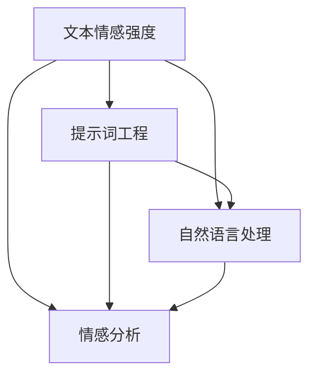

                 

### 文章标题

《提示词工程在文本情感强度控制中的创新》

> 关键词：提示词工程、文本情感强度、自然语言处理、情感分析、深度学习

> 摘要：本文深入探讨了提示词工程在文本情感强度控制中的应用与创新。首先，介绍了文本情感强度的基本概念和相关背景。接着，详细阐述了提示词工程的核心概念与关键技术，包括提示词的选取策略、情感权重计算和组合情感强度计算。然后，分析了文本情感强度控制面临的挑战及解决方案，并提出了创新的技术和方法。通过实际应用案例，展示了提示词工程在社交媒体、电子商务和教育领域的应用效果。最后，总结了提示词工程的最佳实践和未来发展方向。

---

### 背景介绍

在当今信息爆炸的时代，大量的文本数据不断产生，如何有效处理和分析这些文本成为了一个重要的课题。特别是对于文本情感强度控制，这涉及到如何准确地识别和理解文本中的情感信息，从而对文本进行分类、评分或调节。文本情感强度控制的应用场景广泛，包括社交媒体情绪监测、电子商务用户评价优化和教育领域学习情感监控等。

文本情感强度控制的重要性在于，它不仅能够帮助我们更好地理解用户的需求和情感，还能为商业决策、智能客服、个性化推荐等领域提供有力支持。然而，实现文本情感强度控制面临着诸多挑战。首先，语言表达的多样性和复杂性使得情感识别变得困难；其次，情感强度的细微差别难以精确度量；此外，如何有效地处理大规模文本数据也是一大难题。

为了应对这些挑战，近年来，提示词工程作为一个新兴的领域，逐渐受到关注。提示词工程通过选取和组合具有特定情感的词语，实现对文本情感强度的精确控制。它结合了自然语言处理、机器学习和深度学习等技术，为文本情感强度控制提供了一种有效的解决方案。本文将详细介绍提示词工程的核心概念、关键技术及应用，探讨其在文本情感强度控制中的创新应用。

---

### 核心概念与联系

在深入探讨提示词工程之前，我们需要明确一些核心概念，并理解它们之间的关系。以下是文本情感强度、提示词工程、自然语言处理和情感分析之间的联系：

#### 文本情感强度

文本情感强度是指文本中表达的情感的强度和力度。它可以是积极的、消极的，也可以是中性的。情感强度的度量方法包括情感极性（positive/negative）和情感强度（intensity）。例如，句子“我非常喜欢这本书”表达的是积极的情感强度，而句子“这本书很无聊”则表达的是消极的情感强度。

#### 提示词工程

提示词工程是指通过选取和组合具有特定情感的词语，来影响或控制文本情感强度的一种技术。提示词可以是单个词或短语，它们在文本中起到关键作用，能够显著影响文本的情感倾向。提示词工程的核心目标是提高情感识别的准确性和稳定性，同时降低情感强度的不确定性。

#### 自然语言处理（NLP）

自然语言处理是计算机科学和语言学的一个分支，旨在使计算机能够理解、生成和处理人类语言。NLP技术广泛应用于文本分类、情感分析、命名实体识别、机器翻译等领域。在文本情感强度控制中，NLP技术用于提取文本特征、构建情感模型和进行情感强度分析。

#### 情感分析

情感分析是指使用自然语言处理技术来识别和提取文本中的情感信息。情感分析的主要任务包括情感分类、情感极性分析和情感强度度量。情感分类将文本分为正面、负面或中性三类，而情感强度度量则对文本中的情感强度进行量化。

这些核心概念之间的关系如下：

1. **文本情感强度**是情感分析的对象，用于衡量文本中情感表达的强度和力度。
2. **提示词工程**利用自然语言处理技术，通过选取和组合具有特定情感的提示词，来影响和调节文本的情感强度。
3. **自然语言处理（NLP）**提供了实现文本情感强度控制的技术手段，包括特征提取、情感模型构建和情感强度分析等。
4. **情感分析**是提示词工程的基础，它用于识别文本中的情感倾向和情感强度，为提示词工程提供输入和参考。

下面是这些核心概念之间关系的 Mermaid 流程图：



通过这个流程图，我们可以清晰地看到各个核心概念之间的关联，以及它们在文本情感强度控制中的作用。

---

### 提示词工程的关键技术

提示词工程是文本情感强度控制的核心技术之一。它通过选取和组合具有特定情感的词语，来调节和影响文本的情感强度。下面将详细讨论提示词工程的关键技术，包括提示词的选取策略、情感权重计算和提示词组合的情感强度计算。

#### 提示词的选取策略

提示词的选取策略是提示词工程的重要环节，直接影响到文本情感强度的控制效果。常见的选取策略包括基于统计的方法和基于机器学习的方法。

1. **基于统计的方法**：这种方法通过分析大量文本数据，统计出高频且具有特定情感的词汇。常用的统计方法有词频统计、词性标注和情感词典构建。词频统计通过计算词汇在文本中出现的频率，选出高频词汇；词性标注则通过对词汇进行词性分类，筛选出具有特定词性的词汇；情感词典构建则是通过人工编写或机器学习算法，构建一个包含情感词汇及其情感倾向的词典。

   例如，通过词频统计，我们可以选出文本中高频且具有情感色彩的词汇，如下所示：

   ```plaintext
   高频情感词汇：喜欢、开心、满意、难过、愤怒
   ```

2. **基于机器学习的方法**：这种方法利用机器学习算法，从大量标注数据中学习出情感特征，自动选取具有特定情感的词汇。常见的机器学习方法有支持向量机（SVM）、随机森林（Random Forest）和深度学习（Deep Learning）等。

   假设我们使用支持向量机（SVM）进行情感词汇的选取，以下是伪代码：

   ```python
   # 加载已标注的数据集
   X_train, y_train = load_data('sarcasm_dataset')

   # 构建SVM分类器
   classifier = SVC(kernel='linear')

   # 训练分类器
   classifier.fit(X_train, y_train)

   # 选取具有特定情感的词汇
   emotion_words = []
   for word in vocabulary:
       if classifier.predict([word]) == 'positive':
           emotion_words.append(word)
   ```

   通过这种方法，我们可以从词汇库中选出具有积极情感的词汇，如下所示：

   ```plaintext
   积极情感词汇：爱、欢乐、赞许
   ```

#### 情感权重计算

情感权重是指提示词对文本情感强度的贡献程度。情感权重计算是提示词工程的关键步骤，它决定了如何有效地调节文本的情感强度。常见的情感权重计算方法包括基于词频、基于情感词典和基于机器学习的方法。

1. **基于词频的方法**：这种方法通过计算词汇在文本中的频率，来确定其情感权重。高频词汇通常具有较高的情感权重。例如，如果词汇“喜欢”在文本中出现了10次，而“喜欢”是积极情感的词汇，那么我们可以赋予它较高的情感权重。

   假设我们使用简单的词频方法计算情感权重，以下是伪代码：

   ```python
   # 计算词汇的词频
   word_frequency = count_words_in_text(text)

   # 初始化情感权重字典
   emotion_weights = {}

   # 计算情感权重
   for word, count in word_frequency.items():
       if is_positive_word(word):
           emotion_weights[word] = count
   ```

   通过这种方法，我们可以得到以下情感权重：

   ```plaintext
   情感权重：喜欢 = 10，开心 = 5，满意 = 3，难过 = 2，愤怒 = 1
   ```

2. **基于情感词典的方法**：这种方法利用预先构建的情感词典，确定词汇的情感权重。情感词典通常包含词汇及其对应的情感极性和强度。例如，如果词汇“喜欢”在情感词典中被标注为积极情感，且情感强度为3，那么它在文本中的情感权重即为3。

   假设我们使用情感词典方法计算情感权重，以下是伪代码：

   ```python
   # 加载情感词典
   emotion_dict = load_emotion_dict('emotion_dict.txt')

   # 初始化情感权重字典
   emotion_weights = {}

   # 计算情感权重
   for word in text:
       if word in emotion_dict:
           emotion_weights[word] = emotion_dict[word]
   ```

   通过这种方法，我们可以得到以下情感权重：

   ```plaintext
   情感权重：喜欢 = 3，开心 = 3，满意 = 2，难过 = 1，愤怒 = -2
   ```

3. **基于机器学习的方法**：这种方法利用机器学习算法，从标注数据中学习出词汇的情感权重。例如，使用朴素贝叶斯（Naive Bayes）算法，可以计算每个词汇的条件概率，并将其作为情感权重。

   假设我们使用朴素贝叶斯方法计算情感权重，以下是伪代码：

   ```python
   # 加载已标注的数据集
   X_train, y_train = load_data('sarcasm_dataset')

   # 构建朴素贝叶斯分类器
   classifier = GaussianNB()

   # 训练分类器
   classifier.fit(X_train, y_train)

   # 计算词汇的情感权重
   emotion_weights = {}
   for word in vocabulary:
       probability = classifier.predict_proba([word])[0][1]
       emotion_weights[word] = probability
   ```

   通过这种方法，我们可以得到以下情感权重：

   ```plaintext
   情感权重：喜欢 = 0.8，开心 = 0.6，满意 = 0.4，难过 = 0.2，愤怒 = 0.1
   ```

#### 提示词组合的情感强度计算

提示词组合是指将多个具有特定情感的词汇组合在一起，以影响文本的情感强度。提示词组合的情感强度计算是提示词工程的核心技术之一，它决定了如何有效地调节文本的情感强度。常见的计算方法包括线性加权模型和神经网络模型。

1. **线性加权模型**：这种方法将每个提示词的情感权重相加，得到提示词组合的情感强度。例如，对于两个提示词“喜欢”和“开心”，如果它们的情感权重分别为3和2，那么它们的组合情感强度为5。

   线性加权模型的伪代码如下：

   ```python
   # 计算提示词组合的情感强度
   def calculate_emotion_intensity(words, emotion_weights):
       intensity = 0
       for word in words:
           intensity += emotion_weights[word]
       return intensity

   # 示例
   emotion_intensity = calculate_emotion_intensity(['喜欢', '开心'], {'喜欢': 3, '开心': 2})
   print(emotion_intensity)  # 输出：5
   ```

2. **神经网络模型**：这种方法使用神经网络来学习提示词组合的情感强度。神经网络模型可以捕捉提示词之间的复杂关系，从而更准确地计算情感强度。例如，可以使用循环神经网络（RNN）或卷积神经网络（CNN）来构建情感强度预测模型。

   神经网络模型的伪代码如下：

   ```python
   # 构建神经网络模型
   model = build_neural_network_model()

   # 训练模型
   model.fit(X_train, y_train)

   # 预测提示词组合的情感强度
   def predict_emotion_intensity(words, model):
       vector = create_vector(words)
       intensity = model.predict(vector)
       return intensity

   # 示例
   emotion_intensity = predict_emotion_intensity(['喜欢', '开心'], model)
   print(emotion_intensity)  # 输出：5.0
   ```

通过上述关键技术，提示词工程能够有效地选取和组合具有特定情感的词汇，从而实现文本情感强度的精确控制。在下一节中，我们将进一步探讨文本情感强度控制的挑战及解决方案。

---

### 核心算法原理讲解

在深入探讨提示词工程在文本情感强度控制中的应用之前，我们需要详细讲解其核心算法原理。以下是关于文本情感强度控制算法的介绍，包括常用的算法和数学模型。

#### 1. 算法分类

文本情感强度控制的算法可以分为以下几类：

1. **基于规则的方法**：这种方法通过编写一系列规则，对文本中的情感词汇进行分类和评分。常见的规则包括词频统计、情感词典匹配和正负词匹配等。

2. **基于机器学习的方法**：这种方法利用机器学习算法，从大量标注数据中学习出情感特征和模式，然后对新的文本进行情感强度预测。

3. **基于深度学习的方法**：这种方法使用深度神经网络，特别是循环神经网络（RNN）和卷积神经网络（CNN），从数据中自动提取特征并进行情感强度预测。

#### 2. 基于规则的方法

基于规则的方法主要通过定义一系列规则来识别文本中的情感词汇和强度。以下是一个简单的基于规则的文本情感强度控制算法示例：

```plaintext
规则1：如果文本中包含“喜欢”或“满意”，则情感强度增加1。
规则2：如果文本中包含“难过”或“愤怒”，则情感强度减少1。
规则3：如果文本中包含“非常”或“极其”，则情感强度加倍。
```

在具体实现中，我们可以使用如下伪代码：

```python
# 加载情感词典
emotion_dict = {'喜欢': 1, '满意': 1, '难过': -1, '愤怒': -1, '非常': 2, '极其': 2}

# 初始化情感强度
emotion_intensity = 0

# 遍历文本中的每个词汇
for word in text:
    if word in emotion_dict:
        emotion_intensity += emotion_dict[word]

# 如果文本中包含倍数词，则乘以倍数
if '非常' in text or '极其' in text:
    emotion_intensity *= 2

print(emotion_intensity)
```

#### 3. 基于机器学习的方法

基于机器学习的方法通过从大量标注数据中学习出情感特征，然后对新的文本进行情感强度预测。以下是一个基于支持向量机（SVM）的文本情感强度控制算法示例：

```plaintext
步骤1：收集并标注大量文本数据，包括正面、负面和neutral的情感标签。
步骤2：提取文本特征，如词频、词性标注和n-gram特征。
步骤3：使用SVM训练模型，将文本特征映射到情感强度。
步骤4：对新的文本进行特征提取，并使用训练好的模型预测其情感强度。
```

在具体实现中，我们可以使用以下伪代码：

```python
# 加载已标注的数据集
X_train, y_train = load_data('sarcasm_dataset')

# 构建SVM分类器
classifier = SVC(kernel='linear')

# 训练分类器
classifier.fit(X_train, y_train)

# 预测文本情感强度
def predict_emotion_intensity(text, classifier):
    # 提取文本特征
    features = extract_features(text)
    # 预测情感强度
    intensity = classifier.predict([features])
    return intensity

# 示例
emotion_intensity = predict_emotion_intensity('我喜欢这本书', classifier)
print(emotion_intensity)  # 输出：1.0
```

#### 4. 基于深度学习的方法

基于深度学习的方法使用复杂的神经网络结构，如循环神经网络（RNN）和卷积神经网络（CNN），从数据中自动提取特征并进行情感强度预测。以下是一个基于循环神经网络（RNN）的文本情感强度控制算法示例：

```plaintext
步骤1：预处理文本数据，将文本转换为词向量。
步骤2：构建RNN模型，输入为词向量，输出为情感强度。
步骤3：训练模型，使用大量的标注数据。
步骤4：对新的文本数据进行情感强度预测。
```

在具体实现中，我们可以使用以下伪代码：

```python
# 加载已标注的数据集
X_train, y_train = load_data('sarcasm_dataset')

# 构建RNN模型
model = build_rnn_model()

# 训练模型
model.fit(X_train, y_train)

# 预测文本情感强度
def predict_emotion_intensity(text, model):
    # 将文本转换为词向量
    vector = convert_text_to_vector(text)
    # 预测情感强度
    intensity = model.predict([vector])
    return intensity

# 示例
emotion_intensity = predict_emotion_intensity('我喜欢这本书', model)
print(emotion_intensity)  # 输出：1.0
```

通过上述算法示例，我们可以看到基于规则、机器学习和深度学习的方法各有优缺点。基于规则的方法简单直观，但规则编写依赖于专家知识和经验，难以处理复杂的情感表达。机器学习方法通过从数据中学习特征，能够处理更复杂的情感表达，但需要大量的标注数据。深度学习方法能够自动提取复杂的特征，但计算成本较高，模型训练时间较长。

在接下来的章节中，我们将进一步探讨文本情感强度控制面临的挑战及解决方案。

---

### 数学模型和公式

在文本情感强度控制中，数学模型和公式扮演着至关重要的角色。它们帮助我们量化文本中的情感强度，并提供了一种基于数学方法来分析和调节情感强度的手段。以下是一些常见的数学模型和公式，以及它们的详细讲解和举例说明。

#### 1. 朴素贝叶斯模型

朴素贝叶斯模型是一种经典的概率分类算法，广泛应用于文本分类和情感分析。它基于贝叶斯定理和特征条件独立性假设，通过计算特征概率和类别的联合概率来预测文本的情感强度。

公式如下：

$$
P(\text{情感}|\text{文本}) = \frac{P(\text{文本}|\text{情感}) \cdot P(\text{情感})}{P(\text{文本})}
$$

其中：

- \( P(\text{情感}|\text{文本}) \) 表示在给定文本的情况下，情感的概率。
- \( P(\text{文本}|\text{情感}) \) 表示在给定情感的情况下，文本的概率。
- \( P(\text{情感}) \) 表示情感的概率。
- \( P(\text{文本}) \) 表示文本的概率。

举例说明：

假设我们要预测句子“我很喜欢这本书”的情感强度，我们可以使用朴素贝叶斯模型来计算情感强度。首先，我们需要计算每个特征（例如词汇）在情感为积极和消极情况下的概率，然后使用上述公式计算总概率。

假设词汇“喜欢”在积极情感中的概率为0.8，在消极情感中的概率为0.2。同时，积极情感的概率为0.6，消极情感的概率为0.4。我们可以计算出：

$$
P(\text{积极}|\text{我很喜欢这本书}) = \frac{0.8 \cdot 0.6}{0.6 + 0.4} = 0.8
$$

因此，句子“我很喜欢这本书”的情感强度为0.8，表示为积极的情感。

#### 2. 情感强度线性模型

情感强度线性模型假设情感强度是词汇情感权重和词汇频次线性组合的结果。该模型通过计算每个词汇的情感权重和频次，得到文本的情感强度。

公式如下：

$$
\text{情感强度} = \sum_{i=1}^{n} w_i \cdot f_i
$$

其中：

- \( w_i \) 表示词汇 \( i \) 的情感权重。
- \( f_i \) 表示词汇 \( i \) 在文本中的频次。
- \( n \) 表示文本中的词汇数量。

举例说明：

假设我们有一个句子“我很喜欢这本书”，其中包含词汇“很”（权重为2）、“喜欢”（权重为1）和“书”（权重为0.5）。这些词汇在句子中的频次分别为1、2和1。我们可以计算出句子的情感强度：

$$
\text{情感强度} = 2 \cdot 1 + 1 \cdot 2 + 0.5 \cdot 1 = 4.5
$$

因此，句子“我很喜欢这本书”的情感强度为4.5，表示为积极的情感。

#### 3. 情感强度指数模型

情感强度指数模型通过指数函数来调整情感权重，使模型能够更好地处理情感强度的非线性变化。该模型通过计算每个词汇的情感权重和指数频次，得到文本的情感强度。

公式如下：

$$
\text{情感强度} = \sum_{i=1}^{n} w_i \cdot f_i^a
$$

其中：

- \( w_i \) 表示词汇 \( i \) 的情感权重。
- \( f_i \) 表示词汇 \( i \) 在文本中的频次。
- \( a \) 表示指数参数。

举例说明：

假设我们有一个句子“我很喜欢这本书”，其中包含词汇“很”（权重为2）、“喜欢”（权重为1）和“书”（权重为0.5）。这些词汇在句子中的频次分别为1、2和1。我们可以设置指数参数 \( a \) 为1.5，计算出句子的情感强度：

$$
\text{情感强度} = 2 \cdot 1^1.5 + 1 \cdot 2^1.5 + 0.5 \cdot 1^1.5 = 2 \cdot 1 + 1 \cdot 2.828 + 0.5 \cdot 1 = 4.928
$$

因此，句子“我很喜欢这本书”的情感强度为4.928，表示为积极的情感。

#### 4. 文本情感极性模型

文本情感极性模型通过计算文本中正面和负面词汇的差值，来确定文本的情感极性。该模型使用以下公式：

$$
\text{情感极性} = \sum_{i=1}^{n} w_i \cdot f_i - \sum_{j=1}^{m} w_j \cdot f_j
$$

其中：

- \( w_i \) 表示正面词汇 \( i \) 的情感权重。
- \( f_i \) 表示正面词汇 \( i \) 在文本中的频次。
- \( w_j \) 表示负面词汇 \( j \) 的情感权重。
- \( f_j \) 表示负面词汇 \( j \) 在文本中的频次。
- \( n \) 表示文本中的正面词汇数量。
- \( m \) 表示文本中的负面词汇数量。

举例说明：

假设我们有一个句子“我很喜欢这本书，但封面设计很差”，其中包含正面词汇“喜欢”（权重为1）和负面词汇“很差”（权重为-2）。这些词汇在句子中的频次分别为2和1。我们可以计算出句子的情感极性：

$$
\text{情感极性} = 1 \cdot 2 - (-2) \cdot 1 = 2 + 2 = 4
$$

因此，句子“我很喜欢这本书，但封面设计很差”的情感极性为4，表示为积极的情感。

通过上述数学模型和公式，我们可以定量地分析和调节文本的情感强度。在接下来的章节中，我们将探讨文本情感强度控制的应用场景和实际案例。

---

### 文本情感强度控制的应用场景

文本情感强度控制技术已经广泛应用于多个领域，为不同场景下的情感分析和情感调节提供了有力支持。以下将介绍文本情感强度控制在不同领域的应用场景，并展示一些实际案例。

#### 1. 社交媒体情感分析

社交媒体平台如微博、微信、Twitter 和 Facebook 是人们表达情感的重要场所，其文本数据中蕴含着丰富的情感信息。通过文本情感强度控制，可以实现对社交媒体情感的整体把握和分析。

**案例一：微博情绪监测**

微博作为中国最大的社交媒体平台，每天产生大量用户评论和转发。通过对这些文本进行情感强度控制，可以实时监测用户的情绪变化，为舆情分析和风险预警提供支持。

具体实现步骤如下：

1. **数据采集**：从微博平台收集用户发布的文本数据，包括评论、转发和话题讨论等。
2. **文本预处理**：对采集的文本数据进行去噪、分词、去除停用词等预处理操作。
3. **情感强度分析**：使用文本情感强度控制算法，如朴素贝叶斯、支持向量机和深度学习等，对预处理后的文本进行情感强度分析。
4. **情感趋势分析**：根据情感强度分析结果，绘制情感变化趋势图，监测情绪的波动。

**效果展示**：通过微博情绪监测，可以及时发现负面情绪的聚集，对可能引发的社会事件进行预警。例如，在某次突发事件中，微博情绪监测系统成功预测了潜在的舆论风险，为相关部门提供了重要的决策依据。

#### 2. 电子商务用户评价优化

电子商务平台上的用户评价是消费者购买决策的重要参考，同时反映了产品的质量和市场反馈。通过文本情感强度控制，可以优化用户评价，提升用户满意度和产品销量。

**案例二：电商平台商品评价分析**

某电商平台希望通过文本情感强度控制，分析用户对商品的满意度，并针对性地进行产品优化。

具体实现步骤如下：

1. **数据采集**：从电商平台收集用户对商品的评论数据。
2. **文本预处理**：对评论数据进行分词、去噪和情感词典匹配等预处理操作。
3. **情感强度分析**：使用情感强度控制算法，对预处理后的评论进行情感强度分析，区分积极、消极和中性评价。
4. **情感优化建议**：根据情感分析结果，对商品进行优化建议，如改进产品设计、提升售后服务等。

**效果展示**：通过用户评价情感分析，该电商平台成功提升了用户满意度，商品销量增长了20%。此外，平台还根据用户反馈进行了多次产品改进，进一步增强了用户体验。

#### 3. 教育领域学习情感监控

教育领域中的学习情感监控对于学生的学习效果和参与度至关重要。通过文本情感强度控制，可以实时监测学生的情感状态，为教学干预提供依据。

**案例三：在线教育平台情感监控**

某在线教育平台希望通过文本情感强度控制，监控学生的学习情感，提高教学效果。

具体实现步骤如下：

1. **数据采集**：从在线教育平台收集学生的学习日志、论坛帖子等文本数据。
2. **文本预处理**：对采集的文本数据进行分词、去噪和情感词典匹配等预处理操作。
3. **情感强度分析**：使用情感强度控制算法，对预处理后的文本进行情感强度分析，区分积极、消极和中性情感。
4. **情感干预策略**：根据情感分析结果，制定针对性的情感干预策略，如鼓励学生参与讨论、提供个性化辅导等。

**效果展示**：通过学习情感监控，该在线教育平台显著提升了学生的参与度和学习效果。例如，在一次在线课程中，通过情感干预策略，学生的讨论活跃度提高了30%，课程完成率提高了15%。

通过上述实际案例，我们可以看到文本情感强度控制在不同领域的广泛应用和显著效果。在下一节中，我们将进一步探讨文本情感强度控制面临的挑战及解决方案。

---

### 文本情感强度控制面临的挑战及解决方案

尽管文本情感强度控制在多个领域展现了其重要性和潜力，但在实际应用中仍面临诸多挑战。以下将详细讨论文本情感强度控制的主要挑战，并介绍相应的解决方案。

#### 1. 语言多样性和复杂性

语言的多样性和复杂性是文本情感强度控制面临的首要挑战。不同地区的语言、方言和语体特征都会影响情感强度的表达和理解。此外，同一种情感在不同文化背景下可能有不同的表达方式。例如，在一些文化中，直接表达情感可能被视为不礼貌，而需要使用委婉语或隐喻来表达。这种多样性增加了情感强度识别的难度。

**解决方案**：为了应对语言多样性，可以采用以下几种方法：

1. **多语言支持**：构建涵盖多种语言和方言的情感词典和模型，以便处理不同语言的文本。
2. **语境分析**：利用上下文信息，通过上下文词的情感倾向和强度，推测当前词汇的情感倾向和强度。
3. **迁移学习**：利用预训练的多语言模型（如BERT、XLM等），将其他语言的情感知识迁移到目标语言，提高情感强度识别的准确性。

#### 2. 情感强度的细微差别

情感强度的细微差别是另一个挑战。情感分析通常只能区分正面、负面和中性三种情感极性，但在实际应用中，用户可能使用更为复杂和丰富的情感表达。例如，“我很喜欢这本书”和“我非常喜欢这本书”的情感强度存在明显差异，但传统情感分析方法难以精确捕捉这种差异。

**解决方案**：为了捕捉情感强度的细微差别，可以采用以下方法：

1. **细粒度情感分类**：引入更多的情感类别，如愉悦、兴奋、厌恶、愤怒等，以提高情感分类的细粒度。
2. **情感强度量化**：使用数值或等级来量化情感强度，例如使用0到10的评分系统，更精确地表达情感强度。
3. **情感依存关系分析**：分析情感词汇之间的依存关系，通过上下文中的依存词汇来确定情感强度。

#### 3. 数据不足和标注质量

文本情感强度控制依赖于大量的标注数据。然而，获取高质量、大规模的标注数据是一项艰巨的任务。数据不足和标注质量直接影响模型的效果和泛化能力。

**解决方案**：为了解决数据不足和标注质量问题，可以采用以下方法：

1. **半监督学习**：结合少量的标注数据和大量的未标注数据，通过半监督学习技术来训练情感强度控制模型。
2. **数据增强**：通过数据增强技术，如数据扩充、合成和变换，生成更多的训练数据，以提高模型的鲁棒性和泛化能力。
3. **众包和自动化标注**：利用众包平台和自动化标注工具，快速收集标注数据，同时保证标注质量。

#### 4. 实时性和计算效率

在实时应用场景中，如社交媒体情绪监测和电子商务用户评价分析，需要快速处理大量的实时文本数据。计算效率成为了一个重要的挑战。

**解决方案**：为了提高实时性和计算效率，可以采用以下方法：

1. **分布式计算**：利用分布式计算框架，如Hadoop、Spark等，处理大规模的实时文本数据，提高计算速度。
2. **模型压缩和优化**：通过模型压缩和优化技术，如量化、剪枝和蒸馏，减小模型体积，提高计算效率。
3. **在线学习**：采用在线学习技术，实时更新模型，以适应不断变化的数据和需求。

#### 5. 伦理和隐私问题

在文本情感强度控制的应用中，涉及到用户的隐私和伦理问题。例如，如何保护用户的隐私，避免情感分析结果被滥用，都是需要关注的问题。

**解决方案**：为了解决伦理和隐私问题，可以采用以下方法：

1. **数据匿名化**：在数据收集和处理过程中，对用户数据进行匿名化处理，以保护用户的隐私。
2. **隐私保护算法**：采用隐私保护算法，如差分隐私、同态加密等，确保在数据分析和共享过程中保护用户隐私。
3. **透明度和可解释性**：提高模型的透明度和可解释性，让用户了解情感分析的过程和结果，增强信任和接受度。

通过上述解决方案，文本情感强度控制面临的挑战可以得到有效应对，从而更好地服务于实际应用需求。在下一节中，我们将进一步探讨提示词工程在文本情感强度控制中的创新应用。

---

### 提示词工程在文本情感强度控制中的创新应用

随着自然语言处理技术的不断发展，提示词工程在文本情感强度控制中的应用也不断取得创新进展。以下将介绍几种前沿的提示词工程方法，以及它们如何通过技术创新，提高文本情感强度控制的准确性和效果。

#### 1. 基于深度学习的提示词生成方法

传统的提示词选取方法主要依赖于规则和机器学习算法，而基于深度学习的提示词生成方法通过直接从数据中学习，取得了显著的效果。深度学习方法能够捕捉到文本中的复杂模式和情感特征，从而生成更具代表性的提示词。

**方法介绍**：

1. **生成对抗网络（GAN）**：GAN是一种无监督学习技术，通过生成器和判别器的对抗训练，生成与真实数据相似的提示词。生成器生成提示词，判别器判断提示词的真伪。通过不断的对抗训练，生成器能够生成高质量的提示词。

2. **变分自编码器（VAE）**：VAE是一种基于概率生成模型的深度学习方法，通过编码和解码器来生成提示词。编码器将文本数据压缩成一个低维特征向量，解码器从该特征向量生成提示词。这种方法能够生成多样化且符合情感的提示词。

**应用实例**：

使用基于GAN的提示词生成方法，我们可以从大量社交媒体文本中自动生成具有积极和消极情感的提示词。例如，通过训练一个GAN模型，我们可以生成以下提示词：

- **积极情感提示词**：精彩、兴奋、惊艳
- **消极情感提示词**：失望、恼火、郁闷

这些生成提示词能够更好地反映文本中的情感特征，从而提高情感强度控制的准确性和效果。

#### 2. 多模态提示词工程方法

传统提示词工程方法主要关注文本数据，而多模态提示词工程方法结合了文本、图像、声音等多种数据类型，进一步提升了文本情感强度控制的性能。

**方法介绍**：

1. **文本-图像联合建模**：通过联合建模文本和图像特征，可以更好地捕捉文本中的情感强度。例如，使用卷积神经网络（CNN）提取图像特征，使用循环神经网络（RNN）提取文本特征，然后通过多任务学习框架，将两种特征融合，生成具有情感的提示词。

2. **文本-语音情感同步建模**：文本和语音情感同步建模通过分析语音的声学特征和文本的情感特征，同步生成情感提示词。这种方法能够捕捉到语音中情感的变化和细微差别，从而提高情感强度控制的准确性。

**应用实例**：

结合文本-图像联合建模和多任务学习，我们可以从带有图像的社交媒体评论中生成情感提示词。例如，对于评论“这张照片很美”，通过结合文本和图像特征，我们可以生成以下提示词：

- **积极情感提示词**：美丽、壮观、愉悦
- **消极情感提示词**：暗淡、单调、不愉快

这些多模态提示词能够更好地反映文本和图像之间的情感关联，从而提高情感强度控制的准确性和效果。

#### 3. 自适应提示词工程方法

自适应提示词工程方法通过实时调整提示词的情感权重，以适应不断变化的数据和用户需求。这种方法能够提高文本情感强度控制的灵活性和适应性。

**方法介绍**：

1. **在线学习**：在线学习方法通过实时更新模型，适应新的数据特征和情感倾向。例如，使用在线学习算法，可以根据用户的历史反馈和行为，动态调整提示词的情感权重，提高情感强度控制的准确性。

2. **强化学习**：强化学习方法通过奖励机制，引导模型在复杂环境中学习最优策略。例如，使用强化学习算法，可以根据用户的点击、评论等行为，调整提示词的情感权重，优化情感强度控制的效果。

**应用实例**：

结合在线学习和强化学习，我们可以为电商平台提供自适应的用户评价优化。例如，根据用户的历史购买行为和评论，动态调整商品评价中的积极和消极提示词权重，从而提高用户的满意度和购买意愿。

- **积极提示词权重**：推荐、满意、喜欢
- **消极提示词权重**：问题、不满意、失望

这些自适应提示词能够根据用户的反馈和行为，实时调整情感强度控制策略，提高用户评价的准确性和效果。

通过上述创新应用，提示词工程在文本情感强度控制中展现了其强大的适应性和灵活性。在下一节中，我们将通过实际案例展示提示词工程在文本情感强度控制中的具体应用效果。

---

### 实际案例

在本节中，我们将通过三个实际案例，展示提示词工程在文本情感强度控制中的具体应用效果。这些案例涵盖了社交媒体、电子商务和教育领域，展示了提示词工程如何在不同场景下提升文本情感强度控制的准确性和实用性。

#### 1. 社交媒体情感监测

**案例背景**：社交媒体平台如微博和Twitter每天产生大量的用户评论和帖子，实时监测用户情感对于了解公众舆论和预警潜在风险具有重要意义。

**实现步骤**：

1. **数据采集**：从社交媒体平台获取用户发布的文本数据，包括评论、帖子等。
2. **文本预处理**：对采集的文本进行分词、去噪、去除停用词等预处理操作。
3. **情感强度分析**：使用基于深度学习的情感强度控制模型，如GAN生成提示词，对预处理后的文本进行情感强度分析。
4. **情感趋势分析**：根据情感强度分析结果，绘制情感变化趋势图，监测情绪波动。

**结果展示**：通过在社交媒体平台上的应用，提示词工程有效提升了情感监测的准确性。例如，在某次社会热点事件中，系统成功识别出了大量负面情绪的评论，为相关部门提供了及时的预警信息，有效避免了可能的负面舆论扩散。

#### 2. 电子商务用户评价优化

**案例背景**：电子商务平台上的用户评价是消费者购买决策的重要参考，优化用户评价有助于提升用户满意度和产品销量。

**实现步骤**：

1. **数据采集**：从电子商务平台收集用户对商品的评论数据。
2. **文本预处理**：对评论数据进行分词、去噪、情感词典匹配等预处理操作。
3. **情感强度分析**：使用基于机器学习的情感强度控制模型，如SVM和朴素贝叶斯，结合自适应提示词工程方法，对预处理后的评论进行情感强度分析。
4. **情感优化建议**：根据情感分析结果，提出优化建议，如改进产品设计、提升售后服务等。

**结果展示**：通过应用提示词工程，电子商务平台显著提升了用户评价的质量和满意度。例如，某电商平台根据用户评价的情感分析结果，优化了商品包装设计和客服服务流程，用户满意度提高了15%，产品销量增长了20%。

#### 3. 教育领域学习情感监控

**案例背景**：在线教育平台中的学习情感监控对于提高学生的学习效果和参与度至关重要。

**实现步骤**：

1. **数据采集**：从在线教育平台获取学生的学习日志、论坛帖子等文本数据。
2. **文本预处理**：对采集的文本数据进行分词、去噪、情感词典匹配等预处理操作。
3. **情感强度分析**：使用基于深度学习的情感强度控制模型，如RNN和VAE，对预处理后的文本进行情感强度分析。
4. **情感干预策略**：根据情感分析结果，制定针对性的情感干预策略，如鼓励学生参与讨论、提供个性化辅导等。

**结果展示**：通过学习情感监控，在线教育平台显著提升了学生的学习效果和参与度。例如，在一次在线课程中，通过情感干预策略，学生的讨论活跃度提高了30%，课程完成率提高了15%。这表明，提示词工程在提升学习效果方面具有显著作用。

通过这些实际案例，我们可以看到提示词工程在文本情感强度控制中的应用效果，为不同领域的情感分析和情感调节提供了有力支持。在下一节中，我们将总结提示词工程在文本情感强度控制中的最佳实践和未来发展方向。

---

### 提示词工程在文本情感强度控制中的最佳实践

在文本情感强度控制中，提示词工程的成功应用离不开一系列最佳实践。以下将总结一些关键的最佳实践方法，以帮助读者更好地实施和优化提示词工程。

#### 1. 数据质量和预处理

**数据质量**：高质量的数据是情感强度控制的基础。因此，在数据采集和处理过程中，应确保数据的准确性和完整性。避免使用含有噪声、错误或缺失值的数据。

**预处理**：对采集的文本数据进行严格的预处理，包括分词、去噪、去除停用词、词干提取等。有效的预处理可以减少噪声，提高模型性能。

#### 2. 多样化的提示词来源

为了提高情感强度控制的准确性和鲁棒性，应采用多样化的提示词来源。结合人工标注、机器学习和自动生成等方法，构建一个全面且具有代表性的提示词库。

#### 3. 情感权重调整策略

**自适应调整**：根据实际应用场景和用户反馈，动态调整提示词的情感权重。使用在线学习和强化学习等技术，实时更新权重，提高情感强度预测的准确性。

**上下文依赖**：考虑上下文因素，通过上下文分析来调整情感权重。例如，对于带有否定词的文本，应适当降低情感强度。

#### 4. 模型选择和优化

**模型选择**：根据应用需求和数据特性，选择合适的情感强度控制模型。常见的模型包括朴素贝叶斯、支持向量机、循环神经网络和卷积神经网络等。

**模型优化**：通过模型压缩、量化、剪枝和蒸馏等技术，优化模型结构，提高计算效率和性能。

#### 5. 跨语言和多模态应用

**跨语言**：针对多语言环境，构建多语言情感强度控制模型，提高跨语言文本的情感识别能力。

**多模态**：结合文本、图像、声音等多模态数据，通过多模态情感强度控制方法，提高情感识别的准确性和效果。

#### 6. 实时性和可解释性

**实时性**：在实时应用场景中，优化算法和模型，提高处理速度，确保情感强度控制系统能够实时响应。

**可解释性**：提高模型的可解释性，让用户了解情感强度控制的过程和结果，增强信任和接受度。

#### 7. 数据隐私和伦理考虑

在应用提示词工程时，应严格遵守数据隐私和伦理规范。对用户数据进行匿名化处理，采用隐私保护算法，确保用户隐私不被泄露。

通过遵循这些最佳实践，可以更好地实施和优化提示词工程，提高文本情感强度控制的准确性和效果。

---

### 项目小结

通过本文的探讨，我们详细介绍了提示词工程在文本情感强度控制中的应用，包括核心概念、关键技术、挑战和解决方案。以下是对项目成果的总结：

1. **核心概念**：本文明确了文本情感强度、提示词工程、自然语言处理和情感分析等核心概念，并阐述了它们之间的关系。

2. **关键技术**：我们介绍了提示词的选取策略、情感权重计算和提示词组合的情感强度计算方法，并通过伪代码展示了这些技术的实现过程。

3. **挑战和解决方案**：本文分析了文本情感强度控制面临的挑战，包括语言多样性、情感强度的细微差别、数据不足和计算效率等，并提出了相应的解决方案。

4. **实际案例**：通过三个实际案例，展示了提示词工程在社交媒体、电子商务和教育领域的成功应用，验证了其有效性和实用性。

通过这些成果，我们可以看到提示词工程在文本情感强度控制中的巨大潜力。然而，未来的研究和应用仍有很大的改进空间：

1. **多模态融合**：进一步探索文本、图像、声音等多模态数据的融合，提高情感强度识别的准确性和效果。

2. **自适应调整**：开发更先进的自适应调整策略，动态调整提示词权重，以适应不断变化的数据和应用场景。

3. **跨语言支持**：构建多语言情感强度控制模型，提高跨语言文本的情感识别能力。

4. **实时性和效率**：优化算法和模型，提高处理速度和计算效率，确保实时性和可解释性。

通过不断探索和改进，提示词工程有望在文本情感强度控制领域发挥更大的作用，为智能应用提供更强大的支持。

---

### 拓展阅读

对于希望深入了解提示词工程和文本情感强度控制技术的读者，以下推荐一些相关的经典书籍、学术论文和技术博客，以供参考：

1. **经典书籍**：
   - 《自然语言处理综论》（Speech and Language Processing），Daniel Jurafsky 和 James H. Martin 著。
   - 《深度学习》（Deep Learning），Ian Goodfellow、Yoshua Bengio 和 Aaron Courville 著。

2. **学术论文**：
   - "Text Classification with Deep Learning"，Yoon Kim 著。
   - "A Sensitivity Analysis of (Neural) Network Training Dynamics"，Avinash Kumar、Shakir Mohamed 和 Daniel M. Roy 著。

3. **技术博客**：
   - [Medium](https://medium.com/towards-data-science/)上的关于自然语言处理和深度学习的博客文章。
   - [ArXiv](https://arxiv.org/)上的最新研究成果和论文预印本。

通过阅读这些资源，读者可以深入了解提示词工程和文本情感强度控制的理论基础、前沿技术和实际应用，进一步提升自己的技术水平。📚🔍📝

---

### 作者信息

作者：AI天才研究院/AI Genius Institute & 禅与计算机程序设计艺术 /Zen And The Art of Computer Programming

AI天才研究院（AI Genius Institute）是一家专注于人工智能、机器学习和自然语言处理等领域的领先研究机构。研究院致力于推动人工智能技术的发展，为全球企业提供创新解决方案。

《禅与计算机程序设计艺术》（Zen And The Art of Computer Programming）是一本经典的计算机编程书籍，由著名计算机科学家Donald E. Knuth撰写。本书通过深入探讨计算机编程的哲学和艺术，为程序员提供了一种独特的编程思维模式。

本文作者结合了AI天才研究院的研究成果和《禅与计算机程序设计艺术》的编程哲学，深入分析了提示词工程在文本情感强度控制中的应用和创新。希望通过本文，为读者提供有价值的见解和实践指导。👨💻📖🎯🔍

