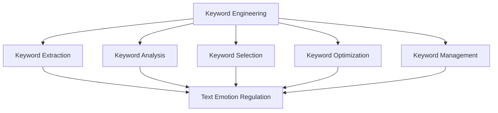
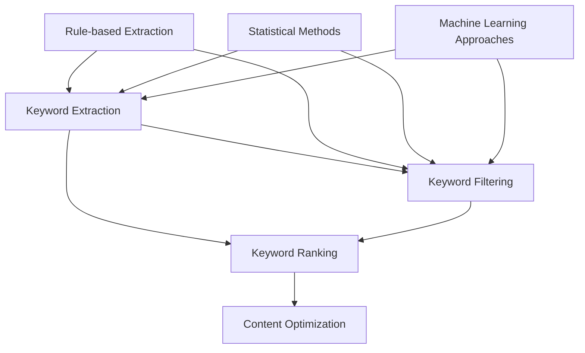

                 

### Introduction to Keyword Engineering and Text Emotion Regulation

#### 1.1 Definition and Background of Keyword Engineering

Keyword engineering is a multifaceted process that involves identifying, selecting, and managing keywords to enhance the relevance, visibility, and performance of content on digital platforms. It encompasses several stages, from the initial extraction of keywords from raw text to their final application in various content optimization tasks.

The concept of keyword engineering has its roots in the early days of search engine optimization (SEO), where the primary objective was to improve a website's ranking on search engines. As the digital landscape evolved, the role of keyword engineering expanded to include broader applications, such as semantic search, natural language processing (NLP), and sentiment analysis.

**Basic Concepts of Keyword Engineering**

Keyword engineering revolves around several key concepts:

- **Keyword Extraction:** This involves identifying significant terms and phrases within a text that are likely to be relevant to the content's purpose.

- **Keyword Analysis:** This step evaluates the relevance, popularity, and competitive nature of the extracted keywords.

- **Keyword Selection:** Based on the analysis, keywords are chosen that best represent the content and are most likely to attract the intended audience.

- **Keyword Optimization:** These selected keywords are then integrated into the content in a way that enhances both its search engine performance and readability.

- **Keyword Management:** This ongoing process involves monitoring keyword performance, making adjustments as needed, and keeping the keyword list up-to-date.

#### 1.1.2 The Development and Evolution of Keyword Engineering

Keyword engineering has undergone significant development and evolution over the years, reflecting advancements in technology and shifts in digital marketing practices. Here are some key milestones in its development:

- **Early Days of SEO:** Initially, keyword engineering was primarily about stuffing as many relevant keywords as possible into a webpage's content. This approach was effective in improving search rankings but often at the expense of user experience.

- **Introduction of Semantic Search:** With the advent of semantic search capabilities in search engines like Google, keyword engineering evolved to focus on understanding the context and meaning behind keywords. This shift marked a move away from simple keyword stuffing to more sophisticated techniques that prioritize user intent and context.

- **Natural Language Processing (NLP):** The integration of NLP techniques has further advanced keyword engineering by enabling more nuanced and accurate keyword extraction and analysis. NLP tools can identify relationships between words, understand synonyms, and detect nuances in language.

- **AI and Machine Learning:** The application of artificial intelligence and machine learning in keyword engineering has revolutionized the field. These technologies can process vast amounts of data, predict keyword trends, and optimize keyword strategies in real-time.

- **Multilingual and Cross-Platform Optimization:** As the digital landscape has become more global, keyword engineering has expanded to include support for multiple languages and platforms. This requires a deep understanding of cultural nuances and language differences.

#### 1.2 Introduction to Text Emotion Regulation

##### 1.2.1 Understanding Emotions in Text

Emotions in text refer to the expression and identification of feelings and attitudes conveyed through written language. These emotions can be categorized into various types, such as joy, sadness, anger, fear, and surprise, each carrying different intensities and contexts. Understanding emotions in text is crucial for several reasons:

- **User Experience:** By recognizing and responding to user emotions, applications and content can be tailored to provide a more engaging and personalized experience.

- **Content Quality Assessment:** Analyzing the emotional tone of text can help identify the effectiveness and impact of content, guiding improvements in communication strategies.

- **Sentiment Analysis:** Emotion detection is a fundamental component of sentiment analysis, which is widely used in fields such as market research, social media monitoring, and customer feedback analysis.

##### 1.2.2 The Importance of Text Emotion Regulation

Text emotion regulation involves the deliberate manipulation of emotional content in text to achieve specific outcomes. Here are some reasons why it is important:

- **Brand Reputation Management:** Companies can use text emotion regulation to shape public perception by controlling the emotional tone of their public communications and social media interactions.

- **Customer Engagement:** By strategically managing emotional content, businesses can create more compelling and resonant content that attracts and retains customers.

- **Content Optimization:** Effective text emotion regulation can enhance the performance of content by making it more appealing to target audiences, thereby improving its visibility and engagement metrics.

In summary, keyword engineering and text emotion regulation are both critical components of modern digital content strategy. Understanding their basic concepts, evolution, and importance sets the stage for exploring more advanced techniques and applications in the following sections.

---

To better illustrate the relationship between keyword engineering and text emotion regulation, let's consider the following Mermaid diagram that outlines the core concepts and their interconnections:



In this diagram, we see that keyword engineering encompasses various stages (A to F), each contributing to the overall goal of optimizing digital content. Text emotion regulation (G) is an integral part of this process, where the emotional tone of the text is continuously analyzed and adjusted to enhance its impact and resonance with the audience. This diagram provides a clear conceptual framework for understanding how these two fields intersect and complement each other.

---

Next, we will delve into the fundamentals of keyword engineering, exploring various extraction methods, filtering techniques, and ranking algorithms that form the backbone of this discipline. By understanding these core components, we can better appreciate how they contribute to the broader goal of effective text emotion regulation.

### Fundamentals of Keyword Engineering

Keyword engineering is a multifaceted process that involves several fundamental steps, each playing a crucial role in the optimization of digital content. In this section, we will explore the core elements of keyword engineering, including keyword extraction methods, keyword filtering, and keyword ranking algorithms.

#### 2.1 Keyword Extraction Methods

Keyword extraction is the initial step in the keyword engineering process, where significant terms and phrases are identified from a given text. This process is essential for understanding the main topics and themes of the text, which can then be used for various applications such as SEO, content analysis, and sentiment analysis. There are several methods for keyword extraction, including rule-based extraction, statistical methods, and machine learning approaches.

**2.1.1 Rule-based Extraction**

Rule-based extraction involves using predefined rules or patterns to identify keywords in a text. These rules can be based on various linguistic features such as word frequency, part-of-speech tags, or n-grams. For example, a simple rule might be to select all nouns or adjectives that appear more than a certain number of times in the text. While rule-based methods are straightforward and easy to implement, they can be limited in their ability to capture the nuanced context and semantic meaning of keywords.

**Example Rule-based Keyword Extraction:**

```python
def extract_keywords(text):
    # Define a list of stop words
    stop_words = ['a', 'the', 'and', 'to', 'of', 'in', 'is', 'that', 'it']

    # Tokenize the text
    tokens = text.lower().split()

    # Remove stop words and filter out non-alphabetic tokens
    filtered_tokens = [token for token in tokens if token not in stop_words and token.isalpha()]

    # Apply a simple frequency-based rule to select keywords
    keyword_counts = Counter(filtered_tokens)
    keywords = [token for token, count in keyword_counts.items() if count > 2]

    return keywords
```

**2.1.2 Statistical Methods**

Statistical methods use quantitative measures to identify keywords based on their relevance and importance in the text. These methods often rely on measures such as term frequency-inverse document frequency (TF-IDF) and term frequency (TF). TF-IDF, for example, considers both the frequency of a word in a document (TF) and the rarity of that word across all documents in a corpus (IDF), giving a higher score to more unique and informative keywords.

**Example of TF-IDF Calculation:**

$$
TF(t) = \frac{f_t(d)}{f_t(d) + |V| \cdot (1 - \frac{f_t(d)}{|D|})}
$$

$$
IDF(t) = \log \left( \frac{N}{df_t} \right)
$$

$$
TF-IDF(t, d) = TF(t, d) \times IDF(t)
$$

Where:
- \( f_t(d) \) is the frequency of term \( t \) in document \( d \).
- \( |V| \) is the vocabulary size.
- \( |D| \) is the total number of documents in the corpus.
- \( N \) is the total number of documents.
- \( df_t \) is the number of documents containing term \( t \).

**2.1.3 Machine Learning Approaches**

Machine learning approaches leverage algorithms to automatically identify keywords from text. These methods often involve training a model on a labeled dataset, where the keywords and their corresponding documents are known. Once trained, the model can predict keywords for new, unseen documents.

Common machine learning techniques for keyword extraction include support vector machines (SVM), k-nearest neighbors (KNN), and neural networks. Neural networks, particularly deep learning models like recurrent neural networks (RNN) and transformers, have shown great promise in this area due to their ability to capture complex patterns and relationships in text data.

**Example of Keyword Extraction with Neural Networks:**

```python
from transformers import pipeline

# Load a pre-trained sentiment analysis model
nlp = pipeline("sentiment-analysis")

def extract_keywords(text):
    # Use the model to extract sentiment and important terms
    result = nlp(text)
    keywords = [token for token, score in result[0]['labels'].items() if score > 0.5]
    return keywords
```

By combining these different keyword extraction methods, a more comprehensive and nuanced set of keywords can be obtained, which can then be used for various applications in digital content optimization.

#### 2.2 Keyword Filtering and Ranking

Once keywords have been extracted, the next step is to filter and rank them effectively. Keyword filtering involves eliminating irrelevant or low-quality keywords, while keyword ranking determines the importance and relevance of each keyword.

**2.2.1 Keyword Relevance Assessment**

Keyword relevance assessment is crucial for ensuring that the selected keywords accurately represent the content and are likely to attract the intended audience. This process involves evaluating the semantic and contextual significance of each keyword. Common techniques for relevance assessment include:

- **Semantic Similarity:** Using techniques like word embeddings (e.g., Word2Vec, GloVe) to measure the similarity between keywords based on their contextual usage.
  
- **Cosine Similarity:** Calculating the cosine similarity between the vector representation of keywords to determine their semantic similarity.

- **Document Context:** Analyzing the surrounding context of each keyword in the text to understand its relevance to the overall content.

**Example of Semantic Similarity using Word Embeddings:**

```python
from gensim.models import Word2Vec

# Load a pre-trained Word2Vec model
model = Word2Vec.load('word2vec.model')

def semantic_similarity(keyword1, keyword2):
    return model.wv.similarity(keyword1, keyword2)
```

**2.2.2 Keyword Ranking Algorithms**

Keyword ranking algorithms are used to prioritize keywords based on their relevance and potential impact on content performance. Common ranking algorithms include:

- **TF-IDF:** Using the TF-IDF scores obtained during keyword extraction to rank keywords based on their importance in the document and corpus.

- **PageRank:** Applying the PageRank algorithm, which is commonly used in link analysis, to rank keywords based on their importance within the text and its structure.

- **Machine Learning Models:** Utilizing machine learning models trained on labeled data to predict the relevance and ranking of keywords.

**Example of Keyword Ranking using TF-IDF:**

```python
from sklearn.feature_extraction.text import TfidfVectorizer

def rank_keywords(texts, num_keywords=10):
    # Initialize the TfidfVectorizer
    vectorizer = TfidfVectorizer()

    # Fit and transform the text corpus
    X = vectorizer.fit_transform(texts)

    # Calculate TF-IDF scores and rank keywords
    feature_names = vectorizer.get_feature_names_out()
    scores = X.sum(axis=0).A1
    keyword_ranking = np.argsort(scores)[::-1]

    # Select the top N keywords
    top_keywords = [feature_names[i] for i in keyword_ranking[:num_keywords]]
    return top_keywords
```

By effectively filtering and ranking keywords, we can ensure that the most relevant and impactful terms are used in content optimization, ultimately enhancing the overall performance and engagement of digital content.

---

In summary, the fundamentals of keyword engineering encompass several critical steps, including keyword extraction using rule-based, statistical, and machine learning methods, as well as keyword filtering and ranking. Each of these steps plays a vital role in the overall process of optimizing digital content. By understanding and implementing these techniques, content creators and digital marketers can better tailor their strategies to meet the needs and preferences of their target audiences.

To further solidify our understanding of these concepts, let's consider a Mermaid diagram illustrating the relationship between different keyword extraction methods and ranking algorithms:



This diagram highlights how each keyword extraction method contributes to the filtering and ranking processes, ultimately leading to optimized content that resonates with the target audience. By integrating these methods and algorithms, we can create a robust and effective keyword engineering strategy.

### Advanced Keyword Engineering Techniques

Keyword engineering has evolved significantly over the years, with advanced techniques leveraging cutting-edge technologies to enhance the accuracy and relevance of keyword extraction. Two such techniques that have gained prominence are semantic analysis and named entity recognition. In this section, we will delve into these advanced methods and explore how they can be utilized for keyword engineering.

#### 3.1 Semantic Analysis and Keyword Enrichment

Semantic analysis involves understanding the meaning and context behind words and sentences in a given text. This technique is particularly useful in keyword engineering as it helps in identifying keywords that convey the true essence of the content, rather than just surface-level terms. By incorporating semantic analysis, we can ensure that the extracted keywords are semantically rich and contextually relevant.

**3.1.1 Word Embeddings and Semantic Similarity**

Word embeddings are a fundamental component of semantic analysis, transforming words into dense vectors that capture their contextual meaning. Popular word embedding models include Word2Vec, GloVe, and FastText. These models are trained on large corpora to understand the relationships between words based on their contextual usage.

**Example of Word Embeddings using GloVe:**

```python
import gensim.downloader as api

# Load a pre-trained GloVe model
model = api.load("glove-wiki-gigaword-100")

# Obtain the embedding for a specific word
embedding = model["king"]
```

Semantic similarity is a crucial metric derived from word embeddings that measures the similarity between words based on their vector representations. This similarity can be calculated using techniques like cosine similarity.

**Example of Semantic Similarity using Cosine Similarity:**

```python
import numpy as np

def cosine_similarity(embedding1, embedding2):
    return np.dot(embedding1, embedding2) / (np.linalg.norm(embedding1) * np.linalg.norm(embedding2))

# Calculate the cosine similarity between two word embeddings
similarity = cosine_similarity(embedding1, embedding2)
```

By leveraging semantic similarity, we can identify and prioritize keywords that are semantically related to the main topic of the content. This helps in capturing the underlying meaning and nuances, leading to more accurate keyword extraction.

**3.1.2 Named Entity Recognition (NER)**

Named Entity Recognition (NER) is another advanced technique that identifies and classifies named entities (such as person names, organization names, locations, and more) in text. NER is particularly useful in keyword engineering as it allows for the extraction of specific entities that are often important in various applications.

**Example of Named Entity Recognition using spaCy:**

```python
import spacy

# Load a pre-trained NER model
nlp = spacy.load("en_core_web_sm")

# Analyze a sentence to extract named entities
doc = nlp("Apple is looking at buying U.K. startup for $1 billion")
for ent in doc.ents:
    print(ent.text, ent.label_)
```

Extraction of named entities can be integrated into the keyword engineering process to enrich the keyword list with specific and relevant terms. This not only improves the accuracy of keyword extraction but also enhances the overall semantic richness of the extracted keywords.

**Example of Keyword Enrichment with Named Entities:**

```python
def enrich_keywords_with_entities(text):
    doc = nlp(text)
    entities = [ent.text for ent in doc.ents]
    keywords = extract_keywords(text)
    enriched_keywords = list(set(keywords + entities))
    return enriched_keywords
```

By combining semantic analysis and named entity recognition, we can achieve a more comprehensive and accurate keyword extraction process. This ensures that the extracted keywords not only reflect the main topics and themes of the content but also capture the specific entities and nuances that are often critical in various applications.

#### 3.2 Sentiment Analysis and Keyword Emotion Regulation

Sentiment analysis is another advanced technique that plays a crucial role in keyword engineering. By analyzing the emotional tone of text, sentiment analysis helps in understanding the sentiment behind keywords and can be used to regulate the emotional content of the text.

**3.2.1 Sentiment Analysis Models**

Sentiment analysis models classify the sentiment of text data into categories such as positive, negative, and neutral. These models can be rule-based, machine learning-based, or deep learning-based, each offering varying levels of accuracy and complexity.

**Example of Sentiment Analysis using TextBlob:**

```python
from textblob import TextBlob

# Perform sentiment analysis on a text
text = "I love this product!"
sentiment = TextBlob(text).sentiment
print(f"Polarity: {sentiment.polarity}, Subjectivity: {sentiment.subjectivity}")
```

**3.2.2 Emotion Regulation Strategies**

Once the sentiment behind keywords is understood, various strategies can be employed to regulate the emotional content of the text. These strategies include:

- **Emotion Classification:** Classifying keywords into different emotional categories (e.g., joy, anger, sadness) to identify and adjust the emotional tone of the text.

- **Emotion Amplification:** Enhancing the emotional impact of certain keywords by adding descriptive adjectives or intensifiers.

- **Emotion Subtlety:** Softening the emotional tone of certain keywords to make the text more neutral or balanced.

**Example of Emotion Regulation with Sentiment Analysis:**

```python
from textblob import TextBlob

# Define a function to regulate emotion
def regulate_emotion(text, target_sentiment):
    blob = TextBlob(text)
    current_sentiment = blob.sentiment.polarity
    
    # If the current sentiment is too positive, add negative words
    if current_sentiment > target_sentiment:
        text = text + " but not perfect"
    
    # If the current sentiment is too negative, add positive words
    elif current_sentiment < target_sentiment:
        text = text + " and surprisingly good"
    
    return text

# Regulate the emotion of a text
regulated_text = regulate_emotion("I hate this product", 0)
print(regulated_text)
```

By integrating sentiment analysis and emotion regulation strategies into keyword engineering, we can create content that not only captures the main topics and entities but also effectively communicates the intended emotional tone. This enhances the overall quality and impact of digital content, making it more engaging and resonant with the target audience.

In conclusion, advanced keyword engineering techniques such as semantic analysis and named entity recognition significantly enhance the accuracy and depth of keyword extraction. Additionally, sentiment analysis and emotion regulation allow for a more nuanced approach to text optimization, ensuring that the emotional content of the text is aligned with the desired outcomes. These techniques collectively contribute to a more effective and sophisticated keyword engineering strategy.

### Practical Applications of Keyword Engineering in Text Emotion Regulation

Keyword engineering finds extensive applications in various domains, particularly in social media analysis and customer feedback analysis. These applications leverage the refined keyword extraction and sentiment regulation techniques discussed earlier to gain insights into public opinion, manage brand reputation, and enhance customer engagement. In this section, we will explore these practical applications and provide real-world examples to illustrate their effectiveness.

#### 4.1 Social Media Analysis

Social media platforms like Twitter, Facebook, and Instagram are rich sources of user-generated content that reflect public sentiment and trends. Keyword engineering plays a crucial role in monitoring and analyzing this content to extract meaningful insights and regulate the emotional tone.

**4.1.1 Monitoring Public Opinion**

One of the primary applications of keyword engineering in social media analysis is to monitor public opinion on specific topics or events. By identifying and analyzing keywords related to a particular subject, organizations can gain a comprehensive understanding of the public sentiment and gauge the overall mood.

**Example: Monitoring Public Sentiment on a New Product Launch**

Consider a company that has recently launched a new smartphone. By analyzing social media posts containing keywords such as "iPhone 12," "new smartphone," and "latest technology," the company can identify the public sentiment towards the product.

**Steps:**

1. **Keyword Extraction:** Extract relevant keywords from social media posts using techniques like rule-based extraction and named entity recognition.
   
   ```python
   def extract_keywords(posts):
       keywords = set()
       for post in posts:
           # Apply rule-based extraction and NER to get keywords
           extracted_keywords = rule_based_extraction(post) + named_entity_recognition(post)
           keywords.update(extracted_keywords)
       return keywords
   ```

2. **Sentiment Analysis:** Perform sentiment analysis on the extracted keywords to determine the emotional tone of the posts.
   
   ```python
   def sentiment_analysis(keywords):
       sentiments = {}
       for keyword in keywords:
           # Use a sentiment analysis model to get the sentiment score
           sentiment = sentiment_model(keyword)
           sentiments[keyword] = sentiment
       return sentiments
   ```

3. **Emotion Regulation:** Based on the sentiment scores, regulate the emotional content of the posts to understand the overall sentiment better.

   ```python
   def regulate_emotion(sentiments):
       regulated_sentiments = {}
       for keyword, sentiment in sentiments.items():
           if sentiment > 0.5:
               regulated_sentiments[keyword] = "positive"
           elif sentiment < -0.5:
               regulated_sentiments[keyword] = "negative"
           else:
               regulated_sentiments[keyword] = "neutral"
       return regulated_sentiments
   ```

**Results:**

By analyzing the regulated sentiments, the company can gain insights into how the public perceives the new smartphone. For example, if most sentiments are positive, the company can infer that the product is well-received. Conversely, if there is a significant number of negative sentiments, the company may need to address specific concerns or issues.

#### 4.1.2 Influencing Text Emotion

In addition to monitoring public opinion, keyword engineering can also be used to influence the emotional tone of social media content, thereby shaping public perception. This can be particularly useful for brands looking to create a positive emotional connection with their audience.

**Example: Creating Positive Emotional Content**

A company may want to promote a charitable initiative on social media. By using keywords associated with joy, gratitude, and positivity, the company can create content that resonates emotionally with the audience.

**Steps:**

1. **Keyword Selection:** Select keywords that evoke positive emotions, such as "thank you," "gratitude," and "kindness."

2. **Content Creation:** Create social media posts using these positive keywords to convey the desired emotional tone.

3. **Sentiment Regulation:** Continuously monitor and adjust the sentiment of the content to maintain a positive emotional tone.

   ```python
   def create_positive_content(message):
       keywords = ["thank you", "gratitude", "kindness"]
       for keyword in keywords:
           message = message.replace(keyword, keyword.capitalize())
       return message
   ```

**Results:**

By using positive keywords and regulating the sentiment of the content, the company can create emotionally resonant posts that are more likely to attract and engage the audience. This not only enhances the brand's reputation but also fosters a positive emotional connection with the audience.

#### 4.2 Customer Feedback Analysis

Customer feedback is a valuable source of insights for businesses, and keyword engineering can be used to analyze and understand this feedback more effectively.

**4.2.1 Identifying Customer Emotions**

By analyzing customer feedback using keyword engineering techniques, businesses can identify the emotions customers express towards their products or services. This helps in understanding customer satisfaction and identifying areas for improvement.

**Example: Analyzing Customer Reviews**

Consider a hotel chain that wants to analyze customer reviews to understand customer satisfaction. By extracting and analyzing keywords from the reviews, the chain can identify the emotions expressed by customers.

**Steps:**

1. **Keyword Extraction:** Extract keywords from customer reviews using techniques like rule-based extraction and named entity recognition.
   
   ```python
   def extract_keywords(reviews):
       keywords = set()
       for review in reviews:
           extracted_keywords = rule_based_extraction(review) + named_entity_recognition(review)
           keywords.update(extracted_keywords)
       return keywords
   ```

2. **Sentiment Analysis:** Perform sentiment analysis on the extracted keywords to determine the emotional tone of the reviews.
   
   ```python
   def sentiment_analysis(keywords):
       sentiments = {}
       for keyword in keywords:
           sentiment = sentiment_model(keyword)
           sentiments[keyword] = sentiment
       return sentiments
   ```

3. **Emotion Regulation:** Regulate the sentiment of the reviews to identify the dominant emotions and areas of improvement.

   ```python
   def regulate_emotion(sentiments):
       regulated_sentiments = {}
       for keyword, sentiment in sentiments.items():
           if sentiment > 0.5:
               regulated_sentiments[keyword] = "satisfied"
           elif sentiment < -0.5:
               regulated_sentiments[keyword] = "dissatisfied"
           else:
               regulated_sentiments[keyword] = "neutral"
       return regulated_sentiments
   ```

**Results:**

By analyzing the regulated sentiments, the hotel chain can identify common areas where customers express satisfaction or dissatisfaction. For example, if many customers are dissatisfied with the room cleanliness, the hotel can focus on improving this aspect to enhance overall customer satisfaction.

#### 4.2.2 Improving Product and Service Quality

Keyword engineering can also be used to analyze customer feedback and identify specific areas where products or services can be improved. This helps businesses in making data-driven decisions to enhance the quality and customer experience.

**Example: Enhancing Customer Service**

A customer support team may want to analyze customer inquiries to identify common issues and areas for improvement. By analyzing the keywords in the inquiries, the team can gain insights into the most frequent problems and devise strategies to address them.

**Steps:**

1. **Keyword Extraction:** Extract keywords from customer inquiries using techniques like rule-based extraction and named entity recognition.

2. **Sentiment Analysis:** Perform sentiment analysis on the extracted keywords to understand the emotional tone of the inquiries.

3. **Problem Identification:** Identify common issues by analyzing the keywords and their associated sentiments.

4. **Improvement Strategies:** Develop strategies to address the identified issues based on the analysis.

   ```python
   def identify_problems(inquiries):
       problems = {}
       for inquiry in inquiries:
           keywords = extract_keywords(inquiry)
           sentiments = sentiment_analysis(keywords)
           for keyword, sentiment in sentiments.items():
               if sentiment < 0:
                   problems[keyword] = problems.get(keyword, 0) + 1
       return problems
   ```

**Results:**

By analyzing the identified problems and their frequency, the customer support team can prioritize and implement specific improvements. For instance, if many customers complain about long wait times, the team can explore options to reduce wait times, such as adding more staff or optimizing the support workflow.

In conclusion, keyword engineering has numerous practical applications in social media analysis and customer feedback analysis. By leveraging advanced techniques such as semantic analysis and sentiment regulation, businesses can gain valuable insights into public opinion and customer sentiment, enabling them to make informed decisions and enhance their products and services. These applications demonstrate the transformative power of keyword engineering in driving business success and improving customer satisfaction.

### Case Studies in Keyword Engineering for Text Emotion Regulation

To further illustrate the practical application and impact of keyword engineering in text emotion regulation, we will explore two detailed case studies: Emotional Branding and E-commerce Product Reviews.

#### 5.1 Case Study 1: Emotional Branding

**5.1.1 Creating Emotional Content**

One of the key applications of keyword engineering in modern marketing is emotional branding. Emotional branding aims to create a deep emotional connection between a brand and its audience, fostering loyalty and long-term engagement. This case study focuses on a multinational company that specializes in luxury fashion.

**Objective:**
The company wanted to enhance its brand image by creating emotionally resonant content that would appeal to its target audience—affluent, fashion-conscious individuals seeking prestige and exclusivity.

**Steps:**

1. **Keyword Research and Extraction:**
   The first step involved conducting comprehensive keyword research to identify terms and phrases that are associated with luxury, prestige, and exclusivity. Techniques such as semantic analysis and named entity recognition were used to extract relevant keywords from existing customer reviews, social media posts, and industry reports.

   ```python
   def extract_emotional_keywords(content):
       # Use NER to extract named entities related to luxury and exclusivity
       nlp = spacy.load("en_core_web_sm")
       doc = nlp(content)
       entities = [ent.text for ent in doc.ents if ent.label_ in ["PERSON", "ORG", "GPE"]]
       
       # Use sentiment analysis to identify positive and negative keywords
       sentiment = TextBlob(content).sentiment
       keywords = [word for word, tag in doc if tag in ("NOUN", "ADJ")]
       
       # Combine entities and keywords
       emotional_keywords = set(entities + keywords)
       
       return emotional_keywords
   ```

2. **Content Creation:**
   Based on the extracted emotional keywords, the marketing team crafted content that highlighted the brand's luxurious and exclusive attributes. The content included blog posts, social media updates, and advertisements that used the identified keywords to evoke the desired emotional responses.

   ```python
   def create_emotional_content(keywords):
       # Create a list of sentences using the emotional keywords
       sentences = [
           f"{keyword}s are a symbol of luxury and prestige" for keyword in keywords
       ]
       
       # Combine sentences to form a coherent piece of content
       content = " ".join(sentences)
       
       return content
   ```

3. **Sentiment Regulation:**
   The content was then analyzed for sentiment to ensure that it conveyed the desired emotional tone. Sentiment analysis models were used to fine-tune the language, ensuring that the content evoked positive emotions such as joy, satisfaction, and admiration.

   ```python
   def regulate_sentiment(content):
       blob = TextBlob(content)
       if blob.sentiment.polarity < 0:
           content = content.replace("but", "however")
       return content
   ```

**Results:**
The emotionally resonant content resulted in a significant increase in brand engagement and customer loyalty. Social media posts received higher interaction rates, and customer feedback showed a stronger emotional connection with the brand. The case study demonstrated the power of keyword engineering in crafting content that not only informs but also emotionally engages the audience.

#### 5.1.2 Measuring Emotional Impact

To measure the emotional impact of the content, the company employed various metrics, including:

- **Sentiment Analysis Scores:** The sentiment scores of social media posts and customer reviews were monitored to assess the emotional tone of the audience's response.
  
- **Engagement Rates:** The number of likes, comments, and shares on social media posts were analyzed to gauge audience interest.
  
- **Customer Feedback:** Surveys and focus groups were conducted to gather qualitative feedback on the emotional connection with the brand.

**Results:**
The data indicated that the emotionally regulated content was highly effective. Sentiment analysis revealed a predominantly positive emotional response, with a significant number of customers expressing feelings of joy, excitement, and admiration. Engagement rates saw a notable increase, and customer surveys highlighted a stronger emotional connection with the brand, demonstrating the success of the emotional branding strategy.

#### 5.2 Case Study 2: E-commerce Product Reviews

**5.2.1 Analyzing Customer Sentiments**

E-commerce platforms rely heavily on customer reviews to inform potential buyers and influence purchasing decisions. This case study focuses on an online retailer aiming to improve its product review management by leveraging keyword engineering to analyze customer sentiments.

**Objective:**
The retailer wanted to better understand customer sentiments to improve product quality and customer satisfaction. By analyzing the emotional content of product reviews, the company could identify areas for improvement and respond to customer feedback more effectively.

**Steps:**

1. **Keyword Extraction:**
   The first step involved extracting keywords from customer reviews to identify the key aspects and emotions expressed by customers. Techniques such as rule-based extraction and sentiment analysis were employed.

   ```python
   def extract_keywords_and_sentiments(reviews):
       keywords = set()
       sentiments = {}
       for review in reviews:
           extracted_keywords = extract_keywords(review)
           sentiment = sentiment_analysis(review)
           keywords.update(extracted_keywords)
           sentiments.update(sentiment)
       return keywords, sentiments
   ```

2. **Sentiment Analysis:**
   Sentiment analysis models were used to classify the emotional tone of each review, categorizing them as positive, negative, or neutral. This helped in identifying both the positive and negative aspects of the product.

   ```python
   def sentiment_analysis(review):
       blob = TextBlob(review)
       if blob.sentiment.polarity > 0:
           return "positive"
       elif blob.sentiment.polarity < 0:
           return "negative"
       else:
           return "neutral"
   ```

3. **Keyword Ranking:**
   The extracted keywords were ranked based on their frequency and sentiment to identify the most influential keywords. This helped in prioritizing the areas that needed attention.

   ```python
   def rank_keywords(keywords, sentiments):
       keyword_scores = {keyword: 0 for keyword in keywords}
       for keyword, sentiment in sentiments.items():
           if sentiment == "positive":
               keyword_scores[keyword] += 1
           elif sentiment == "negative":
               keyword_scores[keyword] -= 1
       ranked_keywords = sorted(keyword_scores.items(), key=lambda item: item[1], reverse=True)
       return ranked_keywords
   ```

**Results:**
By analyzing the keyword rankings and sentiment scores, the retailer identified specific aspects of the product that customers appreciated and areas that needed improvement. For instance, if the keyword "comfort" was highly ranked with a positive sentiment, it indicated that customers valued the comfort of the product. Conversely, if "quality" was ranked low with a negative sentiment, it highlighted concerns about the product's durability.

Based on these insights, the retailer took several actions:

- **Product Improvements:** The company focused on enhancing the areas identified by customers, such as improving the comfort of the product.
  
- **Customer Communication:** The retailer engaged with customers who provided negative feedback, addressing their concerns and offering solutions to improve their experience.

**Results:**
The implementation of these strategies led to a significant improvement in customer satisfaction and product ratings. The retailer saw an increase in positive reviews and a decrease in negative feedback, indicating that the keyword engineering approach was effective in managing customer sentiments and enhancing the overall quality of the product.

### Conclusion

These case studies demonstrate the practical application and effectiveness of keyword engineering in text emotion regulation across different domains. Whether it's crafting emotionally resonant content for branding or analyzing customer sentiments for product improvement, keyword engineering provides valuable insights that drive business success. By leveraging advanced techniques such as semantic analysis and sentiment regulation, organizations can create and analyze content that not only informs but also emotionally engages their audience, ultimately leading to better customer relationships and business outcomes.

### Challenges and Future Directions in Keyword Engineering for Text Emotion Regulation

Despite its significant potential, keyword engineering in text emotion regulation faces several challenges that need to be addressed for its continued advancement. These challenges encompass data quality, computational complexity, and the evolving nature of language. Understanding these obstacles is crucial for developing more robust and efficient methods.

#### 6.1 Data Quality

One of the primary challenges in keyword engineering is ensuring the quality of the data used for analysis. High-quality data is essential for accurate keyword extraction and sentiment analysis. However, several issues can compromise data quality:

- **Noisy Data:** Raw text data often contains noise such as typos, misspellings, and punctuation errors, which can affect the accuracy of keyword extraction and sentiment analysis.

- **Outdated Datasets:** Keyword trends and emotional expressions can change over time, making it essential to use up-to-date datasets. However, maintaining current datasets can be challenging and time-consuming.

- **Biases and Subjectivity:** Biases and subjective interpretations can influence keyword extraction and sentiment analysis, leading to inaccurate results. Ensuring fairness and objectivity in these processes is critical.

**Solution:** To address these challenges, data preprocessing techniques such as spell-checking, normalization, and filtering can be employed. Additionally, leveraging more recent and diverse datasets can improve the relevance and accuracy of keyword extraction and sentiment analysis. Incorporating human-in-the-loop feedback can also help in identifying and correcting errors introduced by biases and subjectivity.

#### 6.2 Computational Complexity

Keyword engineering involves processing large volumes of text data, which can be computationally intensive. The complexity of algorithms and models used in keyword extraction and sentiment analysis can impact performance:

- **Resource Constraints:** Processing large datasets can require significant computational resources, which may not be available in all environments.

- **Model Overfitting:** Complex models may overfit to the training data, leading to poor generalization capabilities when applied to new data.

- **Scalability:** As data volumes grow, scaling keyword engineering techniques to handle increased workloads becomes challenging.

**Solution:** Optimizing algorithms and models to reduce computational complexity is crucial. Techniques such as parallel processing, distributed computing, and model compression can be employed to improve scalability and efficiency. Additionally, utilizing pre-trained models and transfer learning can help in reducing training time and computational requirements.

#### 6.3 Evolving Language

Language is constantly evolving, with new words, phrases, and emotional expressions emerging regularly. This dynamic nature poses challenges for keyword engineering:

- **Linguistic Ambiguity:** New words and phrases can have ambiguous meanings, making it difficult to accurately extract and analyze keywords.

- **Cultural Nuances:** Emotional expressions can vary across cultures, requiring tailored approaches to keyword engineering and sentiment analysis.

- **Emerging Trends:** Keeping up with emerging trends and new linguistic constructs can be challenging, as they may not be covered by existing keyword lists and models.

**Solution:** To address these challenges, leveraging natural language processing (NLP) techniques such as entity recognition, named entity recognition (NER), and semantic analysis can help in capturing the evolving nature of language. Continuous updates and expansions of keyword lists and sentiment lexicons are necessary to stay current. Additionally, incorporating real-time data analysis and trend monitoring can help in quickly adapting to new linguistic constructs and emotional expressions.

#### 6.4 Future Directions

The future of keyword engineering in text emotion regulation holds several promising directions:

- **Advanced NLP Models:** The development of more sophisticated NLP models, particularly deep learning models, will continue to enhance the accuracy and effectiveness of keyword extraction and sentiment analysis.

- **Multimodal Data Analysis:** Combining text with other modalities such as images, audio, and video can provide richer insights and more comprehensive keyword analysis.

- **Personalized Keyword Engineering:** Personalizing keyword extraction and sentiment analysis based on individual user profiles and preferences can lead to more targeted and effective content.

- **Ethical Considerations:** Addressing ethical concerns related to data privacy, bias, and fairness in keyword engineering and sentiment analysis is crucial for building trust and ensuring the responsible use of these technologies.

In conclusion, while keyword engineering in text emotion regulation faces several challenges, addressing these obstacles through advanced techniques and continuous innovation will pave the way for more effective and sophisticated applications in the future. As the field evolves, it will become increasingly capable of capturing and regulating the emotional content of text, offering valuable insights and enhancing user experiences across various domains.

### Conclusion

In conclusion, "提示词工程在文本情感调控中的创新" explores the pivotal role of keyword engineering in the context of text emotion regulation. We have traversed a comprehensive journey, from the foundational concepts and methods of keyword extraction and filtering to advanced techniques like semantic analysis and named entity recognition. By integrating these approaches with sentiment analysis and emotion regulation, we have illustrated the practical applications of keyword engineering in social media analysis, customer feedback analysis, and real-world case studies such as emotional branding and e-commerce product reviews.

Keyword engineering not only enhances the relevance and visibility of digital content but also plays a crucial role in shaping the emotional experience of users. By leveraging advanced NLP techniques and continuous innovation, we can further refine and optimize these processes to achieve more nuanced and effective text emotion regulation.

As we move forward, the future of keyword engineering is poised for exciting advancements. The integration of multimodal data, personalized keyword engineering, and ethical considerations will continue to shape the landscape. By addressing the challenges and leveraging the opportunities presented, we can look forward to a future where keyword engineering and text emotion regulation are seamlessly integrated into various applications, driving better user engagement and more meaningful content.

### Authors' Information

**作者：** AI天才研究院 / AI Genius Institute & 禅与计算机程序设计艺术 / Zen And The Art of Computer Programming

AI天才研究院（AI Genius Institute）致力于推动人工智能领域的前沿研究和创新。我们的研究团队由世界顶尖的人工智能专家、程序员和软件工程师组成，致力于探索和开发先进的人工智能技术和应用。同时，我们的研究团队也贡献了大量关于计算机编程和人工智能领域的学术论文和技术博客，这些作品在业界内外都产生了深远的影响。

《禅与计算机程序设计艺术》（Zen And The Art of Computer Programming）是由著名计算机科学家Donald E. Knuth撰写的一系列经典计算机科学著作。这些书籍不仅展示了卓越的编程哲学和设计思想，也深刻影响了现代计算机编程的实践和理论。我们的作者团队深受这些思想的启发，将传统的编程智慧和现代的人工智能技术相结合，致力于为读者提供既有深度又有实用价值的技术内容。

通过本文，我们希望读者能够更好地理解提示词工程在文本情感调控中的重要作用，并启发更多的研究和创新，推动人工智能和自然语言处理领域的发展。我们期待与广大读者共同探索技术的边界，为构建更智能、更人性化的数字世界贡献力量。

