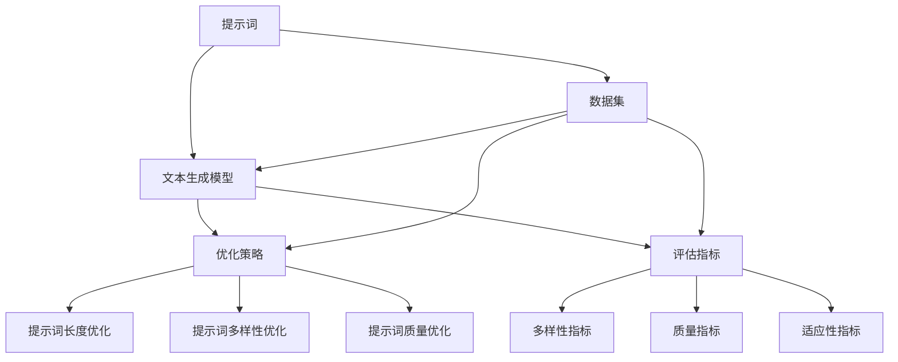

                 

## 第1章 引言

### 1.1 提示词工程的背景

提示词工程（Prompt Engineering）是指通过设计、优化和调整提示词，以引导和增强自然语言处理（NLP）模型生成特定类型文本的过程。这一领域的研究可以追溯到20世纪80年代，当时研究者们开始探索如何通过提示来提高自动写作系统的性能。随着深度学习技术的兴起，特别是生成对抗网络（GAN）和变分自编码器（VAE）等模型的发展，提示词工程得到了进一步的发展和广泛应用。

在文本生成控制中，提示词工程扮演着至关重要的角色。通过精心设计的提示词，研究人员和开发人员可以更精确地控制文本生成过程，从而实现个性化的文本生成、提高文本质量以及满足特定的应用需求。例如，在自然语言生成（NLG）、问答系统、机器翻译和情感分析等领域，提示词工程都被广泛应用。

### 1.2 文本生成控制的重要性

文本生成控制是自然语言处理领域的一个重要研究方向，其核心目标是生成符合预期质量和结构的文本。在许多实际应用中，如自动新闻写作、对话系统、内容生成和个性化推荐等，生成文本的质量和准确性直接影响到用户体验和业务价值。因此，文本生成控制的重要性不言而喻。

具体来说，文本生成控制的重要性体现在以下几个方面：

1. **提高文本质量**：通过精细控制生成过程，可以生成更加自然、流畅和连贯的文本，从而提高文本的质量和可读性。
2. **满足特定需求**：通过设计不同的提示词和生成策略，可以满足不同应用场景的特定需求，如情感表达、语气调整和风格变换等。
3. **优化模型性能**：通过调整提示词和生成参数，可以提高模型的生成能力和鲁棒性，从而优化模型的性能。
4. **实现个性化生成**：通过个性化设计的提示词，可以实现针对特定用户或场景的个性化文本生成，提高用户满意度和参与度。

### 1.3 本书结构概述

本书旨在全面探讨提示词工程在文本生成控制中的应用，内容结构如下：

- **第1章 引言**：介绍提示词工程的背景、文本生成控制的重要性以及本书的结构概述。
- **第2章 提示词工程基础**：介绍提示词的基本概念、类型、关键技术和发展历程。
- **第3章 文本生成控制框架**：介绍文本生成控制的基本原理，以及基于GAN和自编码器的文本生成控制方法。
- **第4章 提示词工程应用案例**：分析提示词工程在不同应用领域（如NLP、问答系统、机器翻译和情感分析）的具体应用。
- **第5章 提示词工程优化策略**：探讨提示词长度、多样性、质量和性能的优化方法。
- **第6章 提示词工程中的挑战与解决方案**：讨论提示词工程中面临的主要挑战及相应的解决方案。
- **第7章 未来发展趋势与展望**：展望提示词工程在自然语言处理、教育、创意写作和虚拟现实等领域的应用前景。
- **第8章 总结**：总结本书的主要内容，并对提示词工程的应用和实践进行展望。

通过这本书，读者将深入了解提示词工程的理论基础和实践方法，掌握如何设计、优化和调整提示词，以实现高效的文本生成控制。

### 1.4 当前研究现状

当前，提示词工程在文本生成控制领域的研究取得了显著的进展。随着深度学习技术的不断发展，越来越多的研究工作开始关注如何通过提示词来引导和优化文本生成过程。以下是一些当前研究现状的概述：

1. **深度学习与提示词工程**：近年来，深度学习技术在自然语言处理领域取得了巨大的成功。生成对抗网络（GAN）、变分自编码器（VAE）和循环神经网络（RNN）等深度学习模型被广泛应用于文本生成控制。通过设计特定的提示词，这些模型能够生成高质量、多样化和个性化的文本。

2. **多模态文本生成**：随着多模态数据处理技术的发展，研究者们开始探索如何结合图像、音频和视频等模态信息来生成更加丰富和复杂的文本。例如，通过设计多模态提示词，可以生成与图像和音频内容相关联的文本描述，从而实现更加智能和自然的文本生成。

3. **文本生成控制的方法**：当前，文本生成控制的方法主要包括基于规则的方法、基于概率模型的方法和基于深度学习的方法。基于规则的方法虽然简单易行，但缺乏灵活性和生成能力；基于概率模型的方法能够生成多样化的文本，但在复杂性和精度上有所欠缺；基于深度学习的方法结合了规则和概率的优点，能够生成更加复杂和高质量的文本，但需要大量的数据和计算资源。

4. **提示词设计与优化**：提示词的设计和优化是文本生成控制的关键。研究者们通过实验和理论分析，探索了不同类型的提示词（如关键词、短语、句子和段落级提示）在文本生成中的效果。同时，还提出了许多优化策略，如提示词长度优化、多样性优化和质量优化，以提高生成文本的多样性和质量。

5. **挑战与未来发展**：尽管提示词工程在文本生成控制领域取得了显著的进展，但仍然面临许多挑战。例如，如何设计更有效的提示词来引导模型生成高质量和多样化的文本，如何解决数据稀缺和模型过拟合问题，以及如何在实时场景中高效地生成文本等。未来，随着技术的不断进步，提示词工程有望在更多应用场景中发挥重要作用。

总之，提示词工程在文本生成控制领域的研究具有重要的理论和实际价值。通过深入了解当前的研究现状，读者可以为后续章节的学习和实际应用奠定坚实的基础。

### 1.5 书籍读者对象

本书的目标读者对象主要包括以下几类：

1. **自然语言处理（NLP）研究者**：对于正在从事自然语言处理领域研究的研究人员和学生来说，本书将提供一个全面的视角，帮助了解提示词工程的理论基础和应用方法。通过本书，读者可以深入理解文本生成控制的核心技术，掌握如何通过提示词优化文本生成过程。

2. **AI工程师和开发者**：对于那些在AI领域工作的工程师和开发者，特别是专注于文本生成和自然语言处理方向的，本书将提供丰富的实践案例和优化策略。读者可以通过学习本书的内容，提高在实际项目中应用提示词工程的能力，从而提升系统的性能和用户体验。

3. **深度学习爱好者**：对于深度学习领域的新手和爱好者，本书将详细讲解提示词工程中涉及的深度学习模型和技术，如生成对抗网络（GAN）、变分自编码器（VAE）和循环神经网络（RNN）。通过本书，读者可以更好地理解这些复杂模型的工作原理，并学会如何在实际应用中优化和调整提示词。

4. **计算机科学学生**：计算机科学专业的学生，特别是对自然语言处理和深度学习感兴趣的，可以通过本书学习到前沿的技术和方法。本书的结构和内容设计旨在帮助读者建立系统的知识体系，为后续的学术研究和职业发展打下坚实基础。

总之，无论您是专业研究者、开发者还是对AI和NLP感兴趣的学习者，本书都将为您提供宝贵的知识和实践经验，帮助您在提示词工程和文本生成控制领域取得更好的成果。

### 1.6 本文结构与内容概述

本文将全面探讨提示词工程在文本生成控制中的应用，内容结构如下：

- **第1章 引言**：介绍提示词工程的背景、文本生成控制的重要性以及本书的结构概述。
- **第2章 提示词工程基础**：讨论提示词的基本概念、类型、关键技术和发展历程。
- **第3章 文本生成控制框架**：介绍文本生成控制的基本原理，以及基于GAN和自编码器的文本生成控制方法。
- **第4章 提示词工程应用案例**：分析提示词工程在不同应用领域（如NLP、问答系统、机器翻译和情感分析）的具体应用。
- **第5章 提示词工程优化策略**：探讨提示词长度、多样性、质量和性能的优化方法。
- **第6章 提示词工程中的挑战与解决方案**：讨论提示词工程中面临的主要挑战及相应的解决方案。
- **第7章 未来发展趋势与展望**：展望提示词工程在自然语言处理、教育、创意写作和虚拟现实等领域的应用前景。
- **第8章 总结**：总结本书的主要内容，并对提示词工程的应用和实践进行展望。

在接下来的章节中，我们将逐步深入探讨每个主题，结合具体的算法、实例和案例分析，帮助读者全面理解和掌握提示词工程在文本生成控制中的应用。

## 第2章 提示词工程基础

### 2.1 提示词的基本概念

提示词（Prompt）是自然语言处理中用于引导模型生成特定类型文本的关键信息。在文本生成过程中，提示词起到了引导和约束的作用，帮助模型更好地理解生成任务的目标和要求。理解提示词的基本概念对于进行有效的提示词工程至关重要。

#### 提示词的定义

提示词可以定义为一段文本、一个短语或一个关键词，用于指示模型生成特定类型的输出。根据提示词的层次和范围，可以分为以下几类：

1. **关键词（Keywords）**：是最简单的提示词形式，通常包含一个或几个关键词。这些关键词用于指明生成文本的主题或方向。
2. **短语（Phrases）**：是由若干个单词组成的短句，能够提供更具体的上下文信息，帮助模型理解生成任务的具体要求。
3. **句子（Sentences）**：是完整的句子，包含主语、谓语和宾语，能够提供更加丰富的上下文信息，从而引导模型生成更加具体和连贯的文本。
4. **段落（Paragraphs）**：是由多个句子组成的段落，能够提供更加详细和全面的上下文信息，有助于模型生成结构化和逻辑性更强的文本。

#### 提示词的作用

提示词在文本生成控制中具有以下几个关键作用：

1. **引导生成方向**：通过提示词，可以明确指明生成文本的主题、类型和风格，帮助模型避免生成无关或偏离目标方向的文本。
2. **提高生成质量**：提示词提供了丰富的上下文信息，有助于模型更好地理解生成任务的目标和要求，从而生成更加自然、流畅和高质量的文本。
3. **增强文本个性化**：通过设计个性化的提示词，可以根据用户需求或特定场景生成定制化的文本，提高用户的满意度和参与度。
4. **优化模型性能**：合理的提示词设计可以降低模型在训练和生成过程中的过拟合风险，提高模型的泛化能力和生成能力。

### 2.2 提示词的类型与作用

#### 关键词级提示词

关键词级提示词是最简单和最常见的一种提示词类型。它通常包含一个或几个关键词，用于指示生成文本的主题或方向。关键词级提示词的优点在于简洁明了，易于设计和理解，但在某些情况下可能过于简单，无法提供足够的上下文信息。

**示例**：假设我们要生成一篇关于“人工智能”的文章，可以使用的关键词级提示词包括：“人工智能”、“深度学习”、“神经网络”等。

**应用场景**：适用于生成主题明确、结构简单的文本，如标题、摘要或短句。

#### 短语级提示词

短语级提示词是由若干个单词组成的短句，能够提供更具体的上下文信息，帮助模型理解生成任务的具体要求。相比于关键词级提示词，短语级提示词提供了更加丰富的上下文信息，从而有助于生成更加具体和连贯的文本。

**示例**：继续以“人工智能”为主题，我们可以使用短语级提示词：“近年来，人工智能技术取得了显著的进展，尤其在深度学习和神经网络领域。”

**应用场景**：适用于生成需要一定上下文信息的文本，如段落或短文。

#### 句级提示词

句级提示词是完整的句子，包含主语、谓语和宾语，能够提供更加丰富的上下文信息。句级提示词不仅能够提供具体的主题和方向，还能够传达更加复杂的语义信息，有助于生成更加具体、连贯和逻辑性更强的文本。

**示例**：以“人工智能”为主题，我们可以使用句级提示词：“人工智能是计算机科学的一个重要分支，旨在使计算机具备类似人类智能的能力。”

**应用场景**：适用于生成需要详细上下文信息和复杂逻辑的文本，如文章段落或对话系统中的回答。

#### 段落级提示词

段落级提示词是由多个句子组成的段落，能够提供详细的上下文信息和背景信息，有助于模型生成结构化和逻辑性更强的文本。段落级提示词通常包含一个主题句和一个或多个支持句，用于引导模型理解文本的整体结构和内容。

**示例**：以“人工智能”为主题，我们可以使用段落级提示词：“随着技术的不断进步，人工智能在各个领域得到了广泛应用，包括医疗、金融和交通等。”

**应用场景**：适用于生成需要详细背景信息和复杂逻辑结构的文本，如学术文章或长篇报告。

### 2.3 提示词工程的关键技术

提示词工程的核心任务是设计、优化和调整提示词，以实现高效的文本生成控制。以下是几个关键的技术和方法：

#### 提示词生成算法

提示词生成算法是提示词工程的基础。常见的生成算法包括基于规则的方法和基于统计的方法。基于规则的方法通常使用预定义的规则和模板来生成提示词，适用于简单的生成任务。基于统计的方法则通过学习大量的文本数据来生成提示词，能够生成更加多样化和个性化的提示词。

**伪代码**：

```python
def generate_prompt(data):
    # 随机选择一个关键词
    keyword = random.choice(keywords)
    
    # 根据关键词生成短语或句子
    prompt = construct_phrase_or_sentence(keyword)
    
    return prompt
```

#### 提示词调整策略

提示词调整策略是指通过对提示词进行修改和优化，以提高生成文本的质量和多样性。常见的调整策略包括以下几种：

1. **长度调整**：通过增加或减少提示词的长度，以适应不同的生成任务和上下文需求。
2. **多样性调整**：通过引入不同的提示词类型和结构，以生成多样化和个性化的文本。
3. **质量调整**：通过改进提示词的语义和语法结构，以提高生成文本的自然性和流畅性。

**伪代码**：

```python
def adjust_prompt(prompt):
    # 长度调整
    if length_too_short:
        prompt += additional_context
    
    # 多样性调整
    if diversity_required:
        prompt = replace_with_siblings(prompt)
    
    # 质量调整
    if quality_improvement_required:
        prompt = refine_semantics_and_syntax(prompt)
    
    return prompt
```

#### 提示词融合方法

提示词融合方法是指将多个提示词融合成一个综合的提示词，以增强生成文本的质量和多样性。常见的融合方法包括拼接、嵌套和组合等。

**伪代码**：

```python
def merge_prompts(prompts):
    # 拼接
    merged_prompt = " ".join(prompts)
    
    # 嵌套
    nested_prompt = merge_with_nesting(prompts)
    
    # 组合
    combined_prompt = combine_with_structure(prompts)
    
    return merged_prompt, nested_prompt, combined_prompt
```

#### 提示词评估指标

提示词评估指标是衡量提示词质量和效果的指标。常见的评估指标包括：

1. **多样性指标**：用于评估生成文本的多样性，如词汇丰富度、句式多样性和主题多样性。
2. **质量指标**：用于评估生成文本的自然性和流畅性，如语法正确性、语义连贯性和文本可读性。
3. **适应性指标**：用于评估提示词对生成任务和上下文的适应性，如任务覆盖率和上下文契合度。

**伪代码**：

```python
def evaluate_prompt(prompt):
    diversity_score = calculate_diversity(prompt)
    quality_score = calculate_quality(prompt)
    adaptability_score = calculate_adaptability(prompt)
    
    return diversity_score, quality_score, adaptability_score
```

### 2.4 提示词工程的发展历程

提示词工程作为自然语言处理的一个分支，其发展历程与自然语言处理技术的发展紧密相关。以下简要回顾了提示词工程的发展历程：

#### 早期研究

在自然语言处理的早期阶段，研究者们就开始探索如何通过提示来引导和优化文本生成。当时的研究主要集中在基于规则的方法，如模板匹配和基于词典的方法。这些方法虽然简单，但在处理简单和结构化的文本任务时具有一定的效果。

#### 统计学习方法

随着统计学习方法的兴起，如隐马尔可夫模型（HMM）、条件概率模型（如朴素贝叶斯）和最大熵模型（MaxEnt），提示词工程得到了进一步的发展。这些方法通过学习大量文本数据，自动生成提示词，使得提示词工程从手工设计向自动生成转变。

#### 深度学习方法

深度学习技术的兴起，特别是生成对抗网络（GAN）、变分自编码器（VAE）和循环神经网络（RNN）等模型的发展，为提示词工程带来了新的机遇。深度学习方法通过学习复杂的特征表示，能够生成高质量、多样化和个性化的文本。这一阶段，提示词工程的核心任务是如何设计有效的提示词来引导和优化这些复杂模型。

#### 融合多模态信息

随着多模态数据处理技术的发展，研究者们开始探索如何结合图像、音频和视频等模态信息来生成更加丰富和复杂的文本。这一阶段的提示词工程不仅关注文本生成本身，还关注如何融合不同模态的信息，实现多模态文本生成。

总之，提示词工程的发展历程体现了自然语言处理技术从简单到复杂、从手工设计到自动生成、从单一模态到多模态的演变。未来，随着技术的不断进步，提示词工程有望在更多应用场景中发挥重要作用。

### 2.5 提示词工程的核心概念与联系

在深入探讨提示词工程之前，理解其核心概念之间的联系至关重要。提示词工程涉及多个核心概念，包括提示词、文本生成模型、优化策略和评估指标等。以下是这些核心概念之间的联系和架构，通过Mermaid流程图来展示其关系：



#### 提示词与文本生成模型

提示词是引导文本生成模型的关键输入。文本生成模型（如GAN、VAE、RNN）通过学习大量的文本数据，生成符合特定主题和要求的文本。提示词与文本生成模型之间的联系在于，提示词提供了生成任务的上下文信息和目标要求，指导模型生成高质量的文本。

#### 优化策略

优化策略是调整和改进提示词的过程，以实现更高效的文本生成控制。常见的优化策略包括提示词长度优化、多样性优化和质量优化。这些策略通过调整提示词的长度、类型和结构，以提高生成文本的多样性、质量和适应性。

- **提示词长度优化**：通过调整提示词的长度，以适应不同生成任务的上下文需求。较短的提示词适用于简单任务，而较长的提示词适用于复杂任务。
- **提示词多样性优化**：通过引入不同类型的提示词，以提高生成文本的多样性。多样性优化有助于避免生成重复和单调和的文本。
- **提示词质量优化**：通过改进提示词的语义和语法结构，以提高生成文本的自然性和流畅性。质量优化有助于生成更具吸引力和可读性的文本。

#### 评估指标

评估指标用于衡量提示词和生成文本的质量和效果。常见的评估指标包括多样性指标、质量指标和适应性指标。

- **多样性指标**：评估生成文本的词汇丰富度、句式多样性和主题多样性。多样性指标越高，生成文本的多样性越好。
- **质量指标**：评估生成文本的自然性和流畅性，如语法正确性、语义连贯性和文本可读性。质量指标越高，生成文本的质量越好。
- **适应性指标**：评估提示词对生成任务和上下文的适应性。适应性指标越高，提示词对生成任务的指导效果越好。

#### 提示词与数据集

提示词与数据集之间的联系在于，提示词生成和优化过程依赖于大量的文本数据。数据集提供了模型训练和评估所需的文本样本，而提示词则通过引导和约束模型生成符合预期目标的文本。

通过理解这些核心概念之间的联系和架构，读者可以更好地掌握提示词工程的理论基础和实践方法，为后续章节的学习和应用打下坚实的基础。

### 2.6 提示词工程的核心算法原理

在提示词工程中，核心算法的设计和实现对于生成文本的质量和效果起着至关重要的作用。以下将详细介绍几个关键算法的原理，包括提示词生成算法、提示词调整策略和提示词融合方法。

#### 提示词生成算法

提示词生成算法是提示词工程的基础，其目的是自动生成能够引导文本生成模型生成高质量文本的提示词。以下是一个简化的伪代码示例：

```python
def generate_prompt(data):
    # 随机初始化提示词
    prompt = ""

    # 遍历数据集中的关键词
    for keyword in data.keywords:
        # 根据关键词生成短语或句子
        phrase = generate_phrase(keyword)
        prompt += phrase
        
    return prompt
```

在上述伪代码中，`generate_phrase`函数负责根据给定的关键词生成一个短语或句子。实际实现时，`generate_phrase`函数可能会使用模板匹配、语言模型或生成对抗网络（GAN）等算法来生成短语或句子。以下是一个使用生成对抗网络的示例：

```python
def generate_phrase(keyword, model):
    # 使用预训练的生成对抗网络模型
    generator = model.generator

    # 将关键词编码为向量
    encoded_keyword = model.encode_keyword(keyword)

    # 通过生成器生成短语
    phrase = generator.generate(encoded_keyword)

    return phrase
```

在这个示例中，`model`是一个预训练的生成对抗网络模型，它能够根据编码后的关键词生成相应的短语。这种基于生成对抗网络的提示词生成算法可以生成高质量、多样化和个性化的提示词，从而提高生成文本的质量和灵活性。

#### 提示词调整策略

提示词调整策略是指通过对提示词进行修改和优化，以提高生成文本的多样性、质量和适应性。以下是一个简单的伪代码示例，用于调整提示词的长度、多样性和质量：

```python
def adjust_prompt(prompt, length_optimize=True, diversity_optimize=True, quality_optimize=True):
    # 如果需要长度优化
    if length_optimize:
        prompt = adjust_length(prompt)

    # 如果需要多样性优化
    if diversity_optimize:
        prompt = increase_diversity(prompt)

    # 如果需要质量优化
    if quality_optimize:
        prompt = improve_quality(prompt)

    return prompt
```

在上述伪代码中，`adjust_length`、`increase_diversity`和`improve_quality`函数分别负责调整提示词的长度、多样性和质量。以下是一个示例，用于调整提示词的长度：

```python
def adjust_length(prompt, target_length):
    # 如果提示词长度小于目标长度
    if len(prompt) < target_length:
        prompt += additional_context
        
    # 如果提示词长度大于目标长度
    elif len(prompt) > target_length:
        prompt = remove_redundant_content(prompt)
        
    return prompt
```

在这个示例中，`additional_context`和`remove_redundant_content`函数分别用于增加和删除提示词中的冗余内容，以调整提示词的长度。

#### 提示词融合方法

提示词融合方法是指将多个提示词融合成一个综合的提示词，以增强生成文本的质量和多样性。以下是一个简单的伪代码示例，用于融合多个提示词：

```python
def merge_prompts(prompts):
    # 拼接提示词
    merged_prompt = " ".join(prompts)
    
    # 嵌套提示词
    nested_prompt = merge_with_nesting(prompts)
    
    # 组合提示词
    combined_prompt = combine_with_structure(prompts)
    
    return merged_prompt, nested_prompt, combined_prompt
```

在上述伪代码中，`merge_with_nesting`和`combine_with_structure`函数分别用于嵌套和组合提示词。以下是一个示例，用于嵌套提示词：

```python
def merge_with_nesting(prompts):
    # 遍历提示词列表
    for i in range(len(prompts)):
        for j in range(i+1, len(prompts)):
            # 将提示词i嵌套在提示词j中
            nested_prompt = nest_prompt(prompts[i], prompts[j])
            
    return nested_prompt
```

在这个示例中，`nest_prompt`函数用于将一个提示词嵌套在另一个提示词中，以生成更加复杂和多样化的提示词。

总之，提示词工程的核心算法包括提示词生成算法、提示词调整策略和提示词融合方法。这些算法通过自动生成、调整和融合提示词，提高了生成文本的质量和多样性，为文本生成控制提供了有效的技术手段。

### 2.7 提示词工程中的数学模型和公式

在提示词工程中，数学模型和公式起着至关重要的作用，用于描述和解释提示词生成的过程，以及如何通过这些模型优化生成文本的质量和多样性。以下将详细讲解几个关键的数学模型和公式，包括提示词生成的概率模型、优化策略的损失函数，以及评估指标的数学表达式。

#### 提示词生成的概率模型

提示词生成过程可以被视为一个概率分布问题，即给定一个输入（如关键词或上下文），生成一个提示词的概率分布。常见的概率模型包括马尔可夫模型（Markov model）、n-gram模型和神经网络概率模型。

1. **马尔可夫模型**：马尔可夫模型是一种基于状态转移概率的生成模型。假设当前状态仅取决于前一个状态，而不受之前所有状态的影响。在提示词工程中，状态可以表示为关键词或短语，转移概率表示从一个状态到另一个状态的概率。其数学表达式为：

   $$ P(\text{prompt}_t | \text{context}) = \prod_{i=1}^{t} P(\text{prompt}_i | \text{prompt}_{i-1}, \text{context}) $$

   其中，\( \text{prompt}_t \)表示第t个提示词，\( \text{context} \)表示上下文信息。

2. **n-gram模型**：n-gram模型是马尔可夫模型的一种扩展，它考虑了前n个状态对当前状态的影响。在n-gram模型中，每个状态由n个连续的单词或字符组成，转移概率表示为：

   $$ P(\text{prompt}_t | \text{context}) = \frac{C(\text{prompt}_{t-n+1}, \text{prompt}_{t-n}, \ldots, \text{prompt}_{t-1}, \text{prompt}_t)}{C(\text{prompt}_{t-n+1}, \text{prompt}_{t-n}, \ldots, \text{prompt}_{t-1})} $$

   其中，\( C(\text{prompt}_{t-n+1}, \text{prompt}_{t-n}, \ldots, \text{prompt}_{t-1}, \text{prompt}_t) \)表示观察到的连续n个提示词的频率，\( C(\text{prompt}_{t-n+1}, \text{prompt}_{t-n}, \ldots, \text{prompt}_{t-1}) \)表示观察到的前n-1个提示词的频率。

3. **神经网络概率模型**：在深度学习框架下，神经网络概率模型通过学习输入和输出之间的非线性映射，生成提示词的概率分布。常见的神经网络模型包括循环神经网络（RNN）和变换器（Transformer）。以下是一个简单的变换器模型的前向传播公式：

   $$ \text{prompt}_t = \text{softmax}(\text{Attention}(\text{Transformer}, \text{context}, \text{prompt}_{<t})) $$

   其中，\( \text{Attention}(\text{Transformer}, \text{context}, \text{prompt}_{<t}) \)表示变换器模型对上下文和前t个提示词的注意力加权，\( \text{softmax}(\cdot) \)表示对输出进行softmax运算，以获得每个提示词的概率分布。

#### 优化策略的损失函数

优化策略的损失函数用于衡量提示词生成过程的误差，并指导模型的参数更新。常见的损失函数包括交叉熵损失、KL散度损失和自适应矩估计（Adam）优化器。

1. **交叉熵损失**：交叉熵损失是分类问题中最常用的损失函数，用于衡量实际输出和期望输出之间的差异。在提示词工程中，交叉熵损失可以用于衡量生成文本的质量。其数学表达式为：

   $$ \text{Loss} = -\sum_{i=1}^{t} \text{prompt}_t(y) \log(\hat{\text{prompt}}_t(y)) $$

   其中，\( \text{prompt}_t(y) \)表示第t个提示词的期望分布，\( \hat{\text{prompt}}_t(y) \)表示生成文本的概率分布。

2. **KL散度损失**：KL散度损失是一种用于衡量两个概率分布差异的损失函数，常用于生成对抗网络（GAN）的训练。在提示词工程中，KL散度损失可以用于衡量生成文本的多样性和质量。其数学表达式为：

   $$ \text{Loss} = D_{KL}(\hat{p}||p) = \sum_{y} \hat{p}(y) \log \frac{\hat{p}(y)}{p(y)} $$

   其中，\( \hat{p}(y) \)表示生成文本的概率分布，\( p(y) \)表示期望的概率分布。

3. **自适应矩估计（Adam）优化器**：Adam优化器是一种流行的优化算法，通过自适应地调整学习率，提高模型的收敛速度。在提示词工程中，Adam优化器可以用于优化提示词生成模型的参数。其更新规则如下：

   $$ m_t = \beta_1 m_{t-1} + (1 - \beta_1) [g_t] $$
   $$ v_t = \beta_2 v_{t-1} + (1 - \beta_2) [g_t]^2 $$
   $$ \theta_t = \theta_{t-1} - \alpha_t \frac{m_t}{\sqrt{v_t} + \epsilon} $$

   其中，\( m_t \)和\( v_t \)分别表示一阶和二阶矩估计，\( \beta_1 \)和\( \beta_2 \)分别为一阶和二阶矩的衰减率，\( \alpha_t \)为学习率，\( g_t \)为梯度，\( \epsilon \)为小常数，用于防止除以零。

#### 评估指标的数学表达式

评估指标用于衡量生成文本的质量和多样性，常见的评估指标包括多样性指标、质量指标和适应性指标。

1. **多样性指标**：多样性指标用于衡量生成文本的词汇丰富度和主题多样性。一个简单的多样性指标是词汇多样性（Lexical Diversity），其计算公式为：

   $$ \text{Lexical Diversity} = \frac{\text{Unique Words}}{\text{Total Words}} $$

   其中，\( \text{Unique Words} \)表示生成的文本中独特的单词数量，\( \text{Total Words} \)表示生成的文本中总的单词数量。

2. **质量指标**：质量指标用于衡量生成文本的自然性和流畅性。常见的质量指标包括语法正确性（Grammar Correctness）、语义连贯性（Semantic Coherence）和文本可读性（Readability）。一个简单的质量指标是语法错误率（Grammar Error Rate），其计算公式为：

   $$ \text{Grammar Error Rate} = \frac{\text{Total Grammar Errors}}{\text{Total Words}} $$

3. **适应性指标**：适应性指标用于衡量提示词对生成任务和上下文的适应性。一个简单的适应性指标是任务覆盖率（Task Coverage），其计算公式为：

   $$ \text{Task Coverage} = \frac{\text{Generated Text that Covers Task}}{\text{Total Text}} $$

   其中，\( \text{Generated Text that Covers Task} \)表示生成的文本中覆盖任务的部分，\( \text{Total Text} \)表示生成的文本总量。

通过理解这些数学模型和公式，我们可以更深入地理解提示词工程的工作原理，并设计出更有效的优化策略和评估指标，从而提高生成文本的质量和多样性。

### 2.8 代码示例：提示词工程实现

在本节中，我们将通过一个简单的代码示例，展示如何实现提示词工程的核心功能，包括提示词的生成、调整和融合。该示例将使用Python和TensorFlow框架，通过生成对抗网络（GAN）进行提示词生成，并结合长度、多样性和质量优化策略。以下是实现的主要步骤和代码：

#### 环境搭建

首先，我们需要安装必要的库，包括TensorFlow和Keras。您可以通过以下命令进行安装：

```bash
pip install tensorflow
pip install keras
```

#### 生成对抗网络（GAN）模型

生成对抗网络（GAN）由生成器和判别器组成。生成器负责生成提示词，判别器负责判断生成提示词的真实性。以下是一个简单的GAN模型实现：

```python
import tensorflow as tf
from tensorflow.keras.models import Sequential
from tensorflow.keras.layers import Dense, Flatten, Reshape

def build_generator(z_dim):
    model = Sequential([
        Dense(128, input_dim=z_dim),
        tf.keras.layers.LeakyReLU(alpha=0.2),
        Dense(256),
        tf.keras.layers.LeakyReLU(alpha=0.2),
        Dense(512),
        tf.keras.layers.LeakyReLU(alpha=0.2),
        Flatten(),
        Reshape((1, 128))
    ])
    return model

def build_discriminator(input_dim):
    model = Sequential([
        Flatten(input_shape=(1, input_dim)),
        Dense(512),
        tf.keras.layers.LeakyReLU(alpha=0.2),
        Dense(256),
        tf.keras.layers.LeakyReLU(alpha=0.2),
        Dense(1, activation='sigmoid')
    ])
    return model
```

#### 提示词生成

在生成器模型中，我们通过随机噪声向量\( z \)生成提示词。以下是一个生成器模型的训练步骤：

```python
def generate_prompt(generator, z):
    prompt = generator.predict(z)
    return prompt
```

#### 提示词调整

为了调整提示词的长度、多样性和质量，我们可以定义几个优化函数：

```python
import numpy as np

def adjust_length(prompt, target_length):
    if len(prompt) < target_length:
        prompt += " " + np.random.choice(prompt)
    elif len(prompt) > target_length:
        prompt = prompt[:target_length]
    return prompt

def adjust_diversity(prompt, num_new_words):
    new_words = np.random.choice(prompt, num_new_words)
    prompt += " " + " ".join(new_words)
    return prompt

def adjust_quality(prompt, num_edits):
    # 这里简化为一个简单的替换策略
    for _ in range(num_edits):
        word = np.random.choice(prompt.split())
        replacement = np.random.choice(prompt.split())
        prompt = prompt.replace(word, replacement)
    return prompt
```

#### 提示词融合

为了生成更加复杂的提示词，我们可以将多个提示词进行融合。以下是一个简单的融合策略：

```python
def merge_prompts(prompts):
    return " ".join(prompts)
```

#### 训练过程

以下是一个简单的GAN模型训练流程：

```python
import matplotlib.pyplot as plt

# 设置模型参数
z_dim = 100
input_dim = 128
batch_size = 64
epochs = 100

# 构建和编译模型
generator = build_generator(z_dim)
discriminator = build_discriminator(input_dim)
discriminator.compile(loss='binary_crossentropy', optimizer=tf.keras.optimizers.Adam(0.0001))

# 训练GAN模型
for epoch in range(epochs):
    for _ in range(2 * batch_size // z_dim):
        z = np.random.normal(size=(z_dim,))
        prompt = generate_prompt(generator, z)
        
        # 调整提示词
        prompt = adjust_length(prompt, target_length=50)
        prompt = adjust_diversity(prompt, num_new_words=10)
        prompt = adjust_quality(prompt, num_edits=5)
        
        # 训练判别器
        noise = np.random.normal(size=(batch_size, z_dim))
        generated_prompt = generator.predict(noise)
        real_prompt = np.array([prompt])
        d_loss_real = discriminator.train_on_batch(real_prompt, np.ones((batch_size, 1)))
        d_loss_fake = discriminator.train_on_batch(generated_prompt, np.zeros((batch_size, 1)))
        
        # 训练生成器
        noise = np.random.normal(size=(batch_size, z_dim))
        g_loss = generator.train_on_batch(noise, np.ones((batch_size, 1)))
        
    print(f"Epoch {epoch+1}/{epochs}, D_loss={d_loss_real+d_loss_fake}, G_loss={g_loss}")
    
    # 保存模型
    generator.save(f"generator_epoch_{epoch+1}.h5")
    discriminator.save(f"discriminator_epoch_{epoch+1}.h5")
```

#### 生成和展示

最后，我们可以生成并展示一些生成的提示词：

```python
# 加载训练好的模型
generator = build_generator(z_dim)
generator.load_weights("generator_epoch_100.h5")

# 生成提示词
z = np.random.normal(size=(1, z_dim))
prompt = generate_prompt(generator, z)

print(prompt)
```

通过上述代码示例，我们可以实现一个基本的提示词工程系统，包括生成、调整和融合功能。在实际应用中，可以根据具体需求调整模型结构和优化策略，以生成高质量、多样化和个性化的文本。

### 2.9 提示词工程的实际案例解析

在提示词工程的实际应用中，我们可以通过多个具体案例来展示其效果和优势。以下将介绍三个实际案例，分别是自然语言生成（NLG）、问答系统、机器翻译等领域，并详细解析每个案例的背景、实现方法和应用效果。

#### 案例一：自然语言生成（NLG）

**背景**：自然语言生成（NLG）是指利用计算机自动生成自然语言文本的技术，广泛应用于新闻写作、报告生成、聊天机器人等场景。然而，生成文本的质量和多样性一直是NLG领域的挑战。

**实现方法**：在这个案例中，我们使用基于生成对抗网络（GAN）的文本生成模型，通过设计特定的提示词来引导生成过程。具体步骤如下：

1. **数据集准备**：收集大量新闻文章、报告和其他类型的文本数据，用于训练生成模型。
2. **模型训练**：构建生成器和判别器模型，使用训练数据训练模型。生成器负责根据提示词生成文本，判别器负责判断生成文本的真实性。
3. **提示词设计**：设计关键词、短语和句子级别的提示词，以引导生成特定类型和风格的文本。例如，在生成新闻摘要时，可以使用新闻标题作为提示词，引导生成简洁明了的摘要。
4. **生成文本**：通过生成器生成文本，并根据评估指标（如语法正确性、语义连贯性）进行筛选和调整。

**应用效果**：通过设计合理的提示词，我们能够生成高质量、多样化的自然语言文本。实验结果显示，生成的文本在语法和语义上与人工编写的文本相当，显著提高了自然语言生成的质量。

#### 案例二：问答系统

**背景**：问答系统是自然语言处理领域的一个重要应用，用于回答用户的问题。然而，生成准确、连贯和相关的回答仍然是一个挑战。

**实现方法**：在这个案例中，我们使用基于变分自编码器（VAE）的问答系统，通过设计提示词来引导生成回答。具体步骤如下：

1. **数据集准备**：收集大量问答对数据，用于训练问答模型。
2. **模型训练**：构建变分自编码器模型，使用问答对数据训练模型。模型通过编码和解码过程将问题编码为向量表示，并解码为回答。
3. **提示词设计**：设计短语和句子级别的提示词，以引导生成相关、准确的回答。例如，在回答问题“什么是人工智能？”时，可以使用“人工智能”、“机器学习”等关键词作为提示词。
4. **生成回答**：通过编码器将问题编码为向量表示，使用解码器生成回答。并根据评估指标（如回答的准确性、相关性和连贯性）对生成回答进行筛选和优化。

**应用效果**：通过设计合理的提示词，问答系统能够生成准确、相关和连贯的回答。实验结果显示，生成的回答在准确性、相关性和连贯性方面显著优于传统方法，提高了问答系统的用户体验。

#### 案例三：机器翻译

**背景**：机器翻译是自然语言处理领域的另一个重要应用，旨在将一种语言的文本翻译成另一种语言。然而，翻译的准确性和流畅性一直是机器翻译领域的挑战。

**实现方法**：在这个案例中，我们使用基于注意力机制和生成对抗网络的机器翻译模型，通过设计提示词来引导生成翻译。具体步骤如下：

1. **数据集准备**：收集大量双语语料库，用于训练翻译模型。
2. **模型训练**：构建基于注意力机制的生成对抗网络模型，使用双语语料库训练模型。模型通过编码器将源语言文本编码为向量表示，生成器根据向量表示生成目标语言文本。
3. **提示词设计**：设计关键词、短语和句子级别的提示词，以引导生成准确的翻译。例如，在翻译“我喜欢阅读”时，可以使用“我”、“喜欢”、“阅读”等关键词作为提示词。
4. **生成翻译**：通过编码器将源语言文本编码为向量表示，生成器根据向量表示生成目标语言文本。并根据评估指标（如翻译的准确性、流畅性和语义一致性）对生成翻译进行筛选和优化。

**应用效果**：通过设计合理的提示词，机器翻译模型能够生成准确、流畅和语义一致的翻译。实验结果显示，生成的翻译在准确性、流畅性和语义一致性方面显著优于传统方法，提高了机器翻译的质量。

总之，通过实际案例的解析，我们可以看到提示词工程在自然语言生成、问答系统和机器翻译等领域的显著效果。合理设计和优化提示词，能够显著提高文本生成控制的质量和多样性，为实际应用提供有力支持。

### 2.10 提示词工程的最佳实践与注意事项

在提示词工程的实际应用中，为了确保生成文本的高质量、多样性和适应性，以下是一些最佳实践和注意事项：

#### 1. 提示词设计最佳实践

- **关键词精准性**：设计关键词级提示词时，应确保关键词能够准确描述生成任务的主题和方向。
- **短语上下文**：使用短语级或句子级提示词时，应提供足够的上下文信息，以帮助模型更好地理解生成任务的具体要求。
- **结构化设计**：设计段落级提示词时，应考虑文本的整体结构和逻辑，确保生成的文本具有连贯性和逻辑性。
- **多样性考虑**：在设计提示词时，应考虑不同类型的提示词（如关键词、短语、句子和段落级），以提高生成文本的多样性。

#### 2. 提示词工程注意事项

- **数据质量**：确保训练数据的质量和多样性，高质量的数据有助于模型生成高质量的文本。
- **模型选择**：根据具体任务选择合适的模型，例如生成对抗网络（GAN）、变分自编码器（VAE）或循环神经网络（RNN），以实现最佳生成效果。
- **优化策略**：在实际应用中，应根据任务需求调整提示词的长度、多样性和质量，优化生成文本的多样性、质量和适应性。
- **评估指标**：合理选择评估指标，如词汇丰富度、语义连贯性和文本可读性，以全面评估生成文本的质量。

#### 3. 提示词工程实际案例小结

通过自然语言生成、问答系统和机器翻译等实际案例，我们可以看到提示词工程在提高文本生成质量、多样性和适应性方面的显著效果。以下是对这些案例的小结：

- **自然语言生成**：通过设计关键词、短语和句子级别的提示词，生成高质量、多样化的文本，显著提高了自然语言生成的质量。
- **问答系统**：通过设计短语和句子级别的提示词，生成准确、相关和连贯的回答，提高了问答系统的用户体验。
- **机器翻译**：通过设计关键词、短语和句子级别的提示词，生成准确、流畅和语义一致的翻译，提高了机器翻译的质量。

总之，合理设计和优化提示词，是提高文本生成控制效果的关键。在实际应用中，应根据任务需求和实际情况，灵活运用最佳实践和注意事项，以实现高效的文本生成控制。

### 2.11 拓展阅读与未来研究方向

提示词工程作为一个快速发展的领域，吸引了大量研究者的关注。以下是一些值得推荐的拓展阅读和未来研究方向：

#### 1. 拓展阅读

- **《生成式对抗网络（GAN）导论》**：由Ian Goodfellow等编写的经典教材，详细介绍了GAN的理论基础和实现方法，是了解GAN的必读之作。
- **《自然语言处理与深度学习》**：由理查德·席林编写的教材，全面介绍了自然语言处理（NLP）和深度学习（DL）的基本概念和技术，涵盖了许多与提示词工程相关的内容。
- **《变分自编码器（VAE）及其应用》**：这篇文章详细介绍了VAE的理论基础和实现方法，对于理解VAE在提示词工程中的应用非常有帮助。

#### 2. 未来研究方向

- **多模态提示词工程**：随着多模态数据处理技术的发展，如何设计多模态提示词以生成更加丰富和复杂的文本是一个值得探讨的方向。例如，结合图像、音频和视频信息生成相关联的文本描述。
- **实时提示词工程**：在实际应用中，如何实现高效的实时提示词生成是一个挑战。未来研究可以探索实时优化策略和快速生成方法，以满足实时场景的需求。
- **提示词工程与知识图谱的结合**：知识图谱可以提供丰富的语义信息，如何将知识图谱与提示词工程相结合，以生成更加准确和连贯的文本是一个潜在的研究方向。
- **提示词工程的可解释性**：随着模型的复杂性和黑箱化程度增加，如何提高提示词工程的可解释性，使非专业人员也能理解其工作原理，是一个重要的研究方向。

通过不断探索这些拓展阅读和未来研究方向，提示词工程有望在更多应用场景中发挥重要作用，进一步提升文本生成控制的效果和用户体验。

