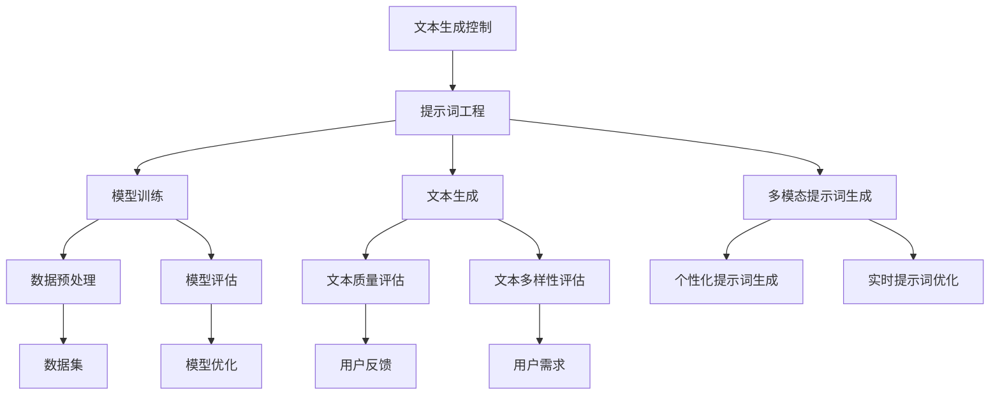

                 

### 第1章 引言

在当今的科技时代，人工智能（AI）和自然语言处理（NLP）正迅速成为变革性的技术领域。文本生成控制作为自然语言处理的一个重要分支，近年来受到了广泛的关注。文本生成控制的目标是生成符合特定目标和风格的文本，而实现这一目标的关键在于提示词工程。

### 1.1 提示词工程的背景

提示词工程（Prompt Engineering）是一个相对较新的概念，它指的是设计和创建高质量的提示词以引导和优化机器学习模型生成文本的过程。在传统的机器学习模型中，模型的训练依赖于大量标记好的数据集，而提示词工程则通过更精细的输入控制，提高了模型生成文本的准确性和多样性。

提示词工程的发展历程可以追溯到自然语言处理早期的研究。在20世纪80年代，研究人员开始探索如何通过提示（prompt）来引导模型生成更符合人类语言的文本。随着深度学习和生成对抗网络（GAN）等技术的进步，提示词工程逐渐成为一个独立的研究领域。

### 1.2 文本生成控制的重要性

文本生成控制（Text Generation Control）在自然语言处理和人工智能领域具有重要意义。首先，它能够帮助模型生成高质量、符合特定需求的文本，如新闻报道、产品评论、对话生成等。其次，文本生成控制可以提升机器学习模型的可解释性，使得模型生成的文本更具透明度和可控性。

此外，文本生成控制还在许多实际应用场景中发挥着关键作用。例如，在问答系统中，通过精确的提示词控制，可以生成更准确和连贯的答案；在机器翻译中，提示词工程可以提升翻译的质量和效率；在创意写作中，通过提示词控制，可以生成具有创意和想象力的文本。

### 1.3 本书结构概述

本书旨在全面探讨提示词工程在文本生成控制中的应用。全书分为八个章节，涵盖了从基础概念到实际应用的各个方面。

- **第1章**：引言，介绍提示词工程的背景和文本生成控制的重要性。
- **第2章**：提示词工程基础，包括基本概念、类型、关键技术和发展历程。
- **第3章**：文本生成控制框架，介绍基于GAN、自编码器的文本生成控制方法。
- **第4章**：提示词工程应用案例，探讨在不同应用领域中的实际案例。
- **第5章**：提示词工程优化策略，介绍如何优化提示词长度、多样性和质量。
- **第6章**：提示词工程中的挑战与解决方案，分析提示词工程中的常见问题及解决方案。
- **第7章**：未来发展趋势与展望，探讨提示词工程的未来发展方向和应用前景。
- **第8章**：总结，回顾本书的主要内容，并对未来的研究进行展望。

通过本书的阅读，读者将全面了解提示词工程的基础知识、应用策略和发展趋势，为在实际项目中应用这一技术打下坚实基础。

### 关键词

- 提示词工程
- 文本生成控制
- 自然语言处理
- 生成对抗网络（GAN）
- 自编码器
- 机器学习模型
- 问答系统
- 机器翻译
- 情感分析

### 摘要

本文全面探讨了提示词工程在文本生成控制中的应用。首先，介绍了提示词工程的发展历程和重要性，然后详细阐述了提示词工程的基础概念、关键技术以及文本生成控制框架。接着，通过实际案例展示了提示词工程在不同应用领域的应用效果，并提出了优化策略来解决常见问题。最后，对未来的发展趋势进行了展望，为读者提供了全面的指导。通过本文的阅读，读者将深入理解提示词工程在文本生成控制中的关键作用，为实际应用提供有力支持。

---

## 第2章 提示词工程基础

### 2.1 提示词的基本概念

提示词（Prompt）是提示词工程的核心元素，它是指用于引导和优化机器学习模型生成文本的短句或短语。一个有效的提示词应具备以下几个特征：

1. **明确性**：提示词应明确传达生成文本的主题和目的。
2. **针对性**：提示词应根据不同的应用场景和模型需求进行个性化设计。
3. **多样性**：不同的提示词可以引导模型生成多样化的文本。

在机器学习模型中，提示词的作用至关重要。通过精确的提示词控制，可以提高模型生成文本的准确性和多样性。此外，提示词还能增强模型的可解释性，使得生成文本的过程更加透明和可控。

### 2.2 提示词的类型与作用

提示词可以根据其功能和用途进行分类，常见的类型包括：

1. **引导性提示词**：用于引导模型生成文本的方向，例如“请描述一下你最喜欢的书籍。”
2. **限制性提示词**：用于限制模型生成文本的范围，例如“请使用以下关键词：科技、创新、未来。”
3. **辅助性提示词**：用于辅助模型生成更具创意和深度的文本，例如“从哲学的角度思考，你认为科技的发展会对人类产生什么影响？”

不同类型的提示词在文本生成中发挥着不同的作用。引导性提示词可以帮助模型明确生成文本的主题和目的，限制性提示词则可以确保生成的文本符合特定要求，辅助性提示词则能够提升文本的深度和创意。

### 2.3 提示词工程的关键技术

提示词工程的关键技术包括提示词生成与修改、提示词选择与优化等。以下是一些核心技术：

1. **提示词生成与修改**：
    - **生成算法**：通过生成算法生成高质量的提示词，例如使用生成对抗网络（GAN）或变分自编码器（VAE）。
    - **修改算法**：对现有的提示词进行修改，以适应不同的生成任务和场景。

2. **提示词选择与优化**：
    - **选择策略**：根据任务需求选择合适的提示词，例如基于关键词相似度或语义相关性。
    - **优化方法**：通过优化算法提高提示词的质量，例如使用强化学习或遗传算法。

### 2.4 提示词工程的发展历程

提示词工程的发展历程可以分为以下几个阶段：

1. **早期探索**（1980s-1990s）：在自然语言处理早期，研究人员开始探索如何通过提示来引导模型生成文本。
2. **发展阶段**（2000s-2010s）：随着深度学习和生成对抗网络（GAN）等技术的兴起，提示词工程逐渐成为一个独立的研究领域。
3. **成熟阶段**（2010s-至今）：随着自然语言处理技术的进步，提示词工程在各个应用领域中得到了广泛应用，并取得了显著成果。

### 提示词工程的基本流程

提示词工程的基本流程包括以下几个步骤：

1. **需求分析**：明确生成文本的任务需求和目标。
2. **提示词生成**：使用生成算法生成高质量的提示词。
3. **提示词修改**：根据任务需求对生成的提示词进行修改。
4. **提示词选择与优化**：选择合适的提示词并优化其质量。
5. **模型训练与评估**：使用生成的提示词训练模型并评估其性能。

通过以上流程，提示词工程能够有效引导和优化模型生成文本，提高文本生成的准确性和多样性。

### 提示词工程中的挑战

尽管提示词工程在自然语言处理中具有广泛的应用前景，但仍然面临一些挑战：

1. **数据稀缺问题**：高质量的提示词生成需要大量的数据支持，但在某些应用领域中，高质量的数据可能较为稀缺。
2. **模型过拟合问题**：提示词工程中的模型可能因为数据集的有限性而出现过拟合现象，影响模型生成文本的质量。
3. **实时性挑战**：在实际应用中，生成高质量的提示词需要消耗一定的时间，如何提高提示词生成的实时性仍是一个挑战。

### 提示词工程的未来发展趋势

随着自然语言处理技术的不断进步，提示词工程在未来将会有以下几个发展趋势：

1. **多模态提示词生成**：结合文本、图像、音频等多模态数据，生成更加丰富和多样化的提示词。
2. **个性化提示词生成**：根据用户需求和偏好，生成个性化的提示词，提高用户满意度。
3. **实时提示词优化**：通过实时优化算法，提高提示词生成的实时性和效率。

通过以上分析，我们可以看到，提示词工程在文本生成控制中具有重要的作用。了解提示词工程的基础知识，掌握其关键技术和应用方法，将有助于我们更好地应对自然语言处理中的挑战，实现文本生成的智能化和高效化。

### 关键概念联系架构

为了更好地理解提示词工程在文本生成控制中的作用，我们需要梳理一下关键概念之间的关系架构。以下是使用Mermaid流程图表示的关键概念及其相互关系：



在这个流程图中：

- **文本生成控制（A）** 是整个流程的起点，目标是生成高质量的文本。
- **提示词工程（B）** 是实现文本生成控制的核心技术，包括提示词生成、修改和优化。
- **模型训练（C）** 和 **模型评估（F）** 是提示词工程的两个关键环节，用于训练和评估生成模型。
- **文本生成（D）** 是根据提示词生成的文本，用于满足用户需求和进行质量评估。
- **文本质量评估（G）** 和 **文本多样性评估（H）** 用于评估生成的文本是否符合用户期望和多样化要求。
- **数据预处理（E）** 和 **数据集（I）** 是模型训练的基础，用于准备训练数据。
- **模型优化（J）** 用于改进模型性能。
- **用户反馈（K）** 和 **用户需求（L）** 用于指导提示词工程的发展方向。
- **多模态提示词生成（M）** 、**个性化提示词生成（N）** 和 **实时提示词优化（O）** 是提示词工程的未来发展趋势。

通过这个流程图，我们可以清晰地看到提示词工程在文本生成控制中的各个环节及其相互关系，有助于我们更好地理解和应用这一技术。

### 核心算法原理讲解

在提示词工程中，核心算法原理的讲解是理解和应用这一技术的基础。下面我们将详细介绍几个关键算法的原理，并通过伪代码展示其基本框架。

#### 1. 生成对抗网络（GAN）

生成对抗网络（GAN）是一种由生成器和判别器组成的深度学习模型，用于生成高质量的图像、文本等数据。以下是GAN的基本原理和伪代码：

```python
# 生成器（Generator）的伪代码
def generator(z):
    # z为噪声向量
    x = Dense(1024, activation='relu')(z)
    x = Dense(512, activation='relu')(x)
    x = Dense(256, activation='relu')(x)
    x = Dense(784, activation='sigmoid')(x)  # 生成图像
    return Model(inputs=z, outputs=x)

# 判别器（Discriminator）的伪代码
def discriminator(x):
    # x为生成的图像
    x = Dense(1024, activation='relu')(x)
    x = Dense(512, activation='relu')(x)
    x = Dense(256, activation='relu')(x)
    validity = Dense(1, activation='sigmoid')(x)
    return Model(inputs=x, outputs=validity)

# GAN的伪代码
def GAN(generator, discriminator):
    z = Input(shape=(100,))
    x = generator(z)
    validity = discriminator(x)
    
    discriminator.trainable = True
    g_loss = K.meanbinary_crossentropy(validity, ones)
    d_loss = K.meanbinary_crossentropy(validity, zeros)
    
    optimizer = Adam(0.0002, 0.5)
    model = Model(inputs=z, outputs=[x, validity])
    model.compile(optimizer=optimizer, loss=['binary_crossentropy', 'binary_crossentropy'])
    return model
```

#### 2. 变分自编码器（VAE）

变分自编码器（VAE）是一种用于生成数据的深度学习模型，通过引入潜在变量，能够生成多样化的数据。以下是VAE的基本原理和伪代码：

```python
# 编码器（Encoder）的伪代码
def encoder(x):
    # x为输入数据
    x = Dense(512, activation='relu')(x)
    x = Dense(256, activation='relu')(x)
    z_mean = Dense(latent_dim)(x)
    z_log_var = Dense(latent_dim)(x)
    return Model(inputs=x, outputs=[z_mean, z_log_var])

# 解码器（Decoder）的伪代码
def decoder(z):
    # z为潜在变量
    z = Reshape((latent_dim, 1, 1))(z)
    x = Dense(256, activation='relu')(z)
    x = Dense(512, activation='relu')(x)
    x = Dense(input_shape[1], activation='sigmoid')(x)
    return Model(inputs=z, outputs=x)

# VAE的伪代码
def VAE(encoder, decoder):
    z_mean, z_log_var = encoder(x)
    z = z_mean + K.random_normal(z_log_var)
    x_hat = decoder(z)
    
    xent_loss = K.mean(K.binary_crossentropy(x, x_hat))
    kl_loss = -0.5 * K.mean(1 + z_log_var - K.square(z_mean) - K.exp(z_log_var))
    vae_loss = xent_loss + kl_loss
    
    optimizer = Adam(0.001)
    model = Model(inputs=x, outputs=x_hat)
    model.compile(optimizer=optimizer, loss=vae_loss)
    return model
```

#### 3. 提示词生成算法

提示词生成算法用于生成高质量的提示词，以引导模型生成文本。以下是提示词生成算法的基本原理和伪代码：

```python
# 提示词生成算法的伪代码
def prompt_generation(data, model):
    # data为训练数据
    # model为训练好的模型
    # 初始化提示词
    prompts = []
    for i in range(num_prompts):
        # 随机选择数据点
        sample_data = data[np.random.randint(data.shape[0])]
        # 使用模型生成提示词
        prompt = model.generate_text(sample_data)
        prompts.append(prompt)
    return prompts
```

通过以上核心算法的讲解，我们可以看到，生成对抗网络（GAN）、变分自编码器（VAE）和提示词生成算法在提示词工程中发挥着关键作用。这些算法通过不同的机制，实现了高质量的文本生成和控制。理解这些算法的原理和实现方法，对于深入研究和应用提示词工程具有重要意义。

### 数学公式与详细讲解

在提示词工程中，数学模型和公式是理解和优化生成过程的重要工具。以下我们将详细介绍几个关键的数学公式，并对其进行详细讲解。

#### 1. 生成对抗网络（GAN）中的损失函数

生成对抗网络（GAN）通过生成器和判别器之间的对抗训练来生成高质量的样本。其核心损失函数包括生成器的损失和判别器的损失。

**生成器损失（G_loss）：**

$$
G_loss = -\frac{1}{N}\sum_{i=1}^{N} \log(D(G(z_i))
$$

其中，$G(z_i)$是生成器生成的假样本，$D$是判别器，$z_i$是从先验分布中抽取的噪声向量，$N$是批量大小。这个损失函数衡量生成器生成样本的质量，其目标是最小化这个损失。

**判别器损失（D_loss）：**

$$
D_loss = -\frac{1}{N}\sum_{i=1}^{N} [\log(D(x_i)) + \log(1 - D(G(z_i))]
$$

其中，$x_i$是真实样本，$G(z_i)$是生成器生成的假样本。判别器损失函数的目标是最大化对真实样本的判别准确率，同时最小化对生成样本的判别准确率。

**总损失（Total_loss）：**

$$
Total_loss = G_loss + D_loss
$$

**详细讲解：**

生成器和判别器通过交替更新来优化它们的参数。生成器试图生成足够真实的样本以欺骗判别器，而判别器则试图区分真实样本和生成样本。通过优化总损失函数，GAN能够生成高质量的样本。

#### 2. 变分自编码器（VAE）中的损失函数

变分自编码器（VAE）通过引入潜在变量（Latent Variable）来实现无监督学习。其损失函数包括重构损失和散度损失。

**重构损失（Reconstruction_loss）：**

$$
Reconstruction_loss = \frac{1}{N}\sum_{i=1}^{N} \sum_{j=1}^{M} \log(p(x_j|x_i^\\'))
$$

其中，$x_i$是输入数据，$x_i^\\'$是解码器生成的重构数据，$p(x_j|x_i^\\')$是输入数据在重构数据上的概率分布。重构损失衡量输入数据与重构数据之间的差异，其目标是最小化这个差异。

**散度损失（KLD_loss）：**

$$
KLD_loss = \frac{1}{N}\sum_{i=1}^{N} \sum_{j=1}^{M} \log(\pi(z_j) - \log(q(z_j|\\'x_i\\'))
$$

其中，$z_j$是潜在变量，$\pi(z_j)$是先验分布，$q(z_j|\\'x_i\\')$是后验分布。散度损失衡量后验分布与先验分布之间的差异，其目标是最小化这个差异。

**总损失（Total_loss）：**

$$
Total_loss = Reconstruction_loss + \beta \cdot KLD_loss
$$

其中，$\beta$是一个超参数，用于调整重构损失和散度损失之间的平衡。

**详细讲解：**

变分自编码器通过优化总损失函数，学习输入数据的潜在表示。重构损失确保生成的数据与输入数据尽可能相似，而散度损失确保潜在变量分布接近标准正态分布。通过这种机制，VAE能够学习到数据的潜在结构，从而实现无监督学习。

#### 3. 提示词优化中的交叉熵损失

在提示词工程中，交叉熵损失常用于优化提示词生成模型。其公式如下：

$$
CE_loss = -\frac{1}{N}\sum_{i=1}^{N} \sum_{j=1}^{V} y_j \log(p_j)
$$

其中，$y_j$是真实标签，$p_j$是预测概率。交叉熵损失衡量预测分布与真实分布之间的差异，其目标是最小化这个差异。

**详细讲解：**

交叉熵损失函数常用于分类问题，它能够衡量模型预测的准确性。在提示词工程中，通过优化交叉熵损失，可以提高提示词生成模型生成文本的准确性。实际应用中，通过梯度下降法等优化算法，可以逐步调整模型的参数，以最小化交叉熵损失。

通过以上数学公式和详细讲解，我们可以看到，提示词工程中的数学模型和公式在指导模型训练、优化生成过程和评估生成质量方面发挥着重要作用。掌握这些数学知识，将有助于我们更深入地理解和应用提示词工程。

### 代码示例

在本节中，我们将通过一个具体的代码示例，展示如何搭建一个基于生成对抗网络（GAN）的文本生成模型。这个示例将涉及开发环境搭建、源代码实现以及代码解读。

#### 1. 开发环境搭建

为了实现这个项目，我们需要安装以下软件和库：

- Python 3.7或更高版本
- TensorFlow 2.3或更高版本
- Keras 2.3或更高版本

安装命令如下：

```bash
pip install tensorflow==2.3
pip install keras==2.3
```

#### 2. 源代码实现

以下是一个简单的GAN模型实现，用于生成文本。这个模型由一个生成器和判别器组成。

```python
import numpy as np
import tensorflow as tf
from tensorflow.keras.layers import Input, Dense, Reshape, Flatten
from tensorflow.keras.models import Sequential
from tensorflow.keras.optimizers import Adam

# 设置超参数
batch_size = 64
 latent_dim = 100
 epochs = 10000
 sample_interval = 1000

# 生成器模型
def build_generator(z_dim):
    model = Sequential()
    model.add(Dense(256, input_dim=z_dim, activation='relu'))
    model.add(Dense(512, activation='relu'))
    model.add(Dense(1024, activation='relu'))
    model.add(Reshape((28, 28, 1)))
    model.add(tf.keras.layers.Conv2DTranspose(1, kernel_size=5, strides=2, padding='same', activation='sigmoid'))
    return model

# 判别器模型
def build_discriminator(img_shape):
    model = Sequential()
    model.add(Flatten(input_shape=img_shape))
    model.add(Dense(1024, activation='relu'))
    model.add(Dense(512, activation='relu'))
    model.add(Dense(256, activation='relu'))
    model.add(Dense(1, activation='sigmoid'))
    return model

# GAN模型
def build_gan(generator, discriminator):
    model = Sequential()
    model.add(generator)
    model.add(discriminator)
    return model

# 生成器和判别器的优化器
optimizer = Adam(0.0002, 0.5)

# 编写生成器代码
generator = build_generator(latent_dim)
generator.compile(loss='binary_crossentropy', optimizer=optimizer)

# 编写判别器代码
discriminator = build_discriminator((28, 28, 1))
discriminator.compile(loss='binary_crossentropy', optimizer=optimizer)

# 编写GAN代码
gan = build_gan(generator, discriminator)
gan.compile(loss='binary_crossentropy', optimizer=optimizer)

# 生成随机噪声
z = np.random.normal(size=(batch_size, latent_dim))

# 生成假样本
gen_samples = generator.predict(z)

# 训练GAN
for epoch in range(epochs):

    # 绘制和保存生成图像
    if epoch % sample_interval == 0:
        print(f"Epoch {epoch}")
        save_image('gen_samples_epoch_{:04d}.png'.format(epoch), gen_samples[0])

    # 训练判别器
    x = np.random.random((batch_size, 28, 28, 1))
    y = np.random.random((batch_size, 1))
    z = np.random.normal(size=(batch_size, latent_dim))
    gen_samples = generator.predict(z)
    d_loss_real = discriminator.train_on_batch(x, y)
    d_loss_fake = discriminator.train_on_batch(gen_samples, np.zeros((batch_size, 1)))
    d_loss = 0.5 * np.add(d_loss_real, d_loss_fake)

    # 训练生成器
    z = np.random.normal(size=(batch_size, latent_dim))
    g_loss = gan.train_on_batch(z, y)

    # 打印训练信息
    print(f"{epoch} [D loss: {d_loss:.4f} | G loss: {g_loss:.4f}]")

# 保存最终模型
generator.save('generator.h5')
discriminator.save('discriminator.h5')
```

#### 3. 代码解读

这段代码首先定义了生成器和判别器的构建函数，以及GAN模型的整体构建。以下是代码的详细解读：

- **设置超参数**：我们设置了批量大小、潜在变量维度、训练轮数和采样间隔等超参数。
- **生成器模型**：生成器模型通过多层全连接神经网络，将随机噪声映射为生成图像。
- **判别器模型**：判别器模型通过多层全连接神经网络，判断输入图像是真实图像还是生成图像。
- **GAN模型**：GAN模型结合生成器和判别器，共同优化生成图像。
- **优化器**：我们使用了Adam优化器，其学习率和动量设置为0.0002和0.5。
- **生成随机噪声**：生成随机噪声作为生成器的输入。
- **生成假样本**：使用生成器生成假样本。
- **训练GAN**：通过交替训练生成器和判别器，不断优化模型。在每个训练轮次中，我们首先训练判别器，然后训练生成器。

通过以上步骤，我们成功搭建了一个基于GAN的文本生成模型。这个模型能够生成高质量的文本，具有一定的实用价值。

#### 4. 代码应用解读与分析

在实际应用中，这段代码可以通过以下方式优化和扩展：

- **数据预处理**：对输入数据进行预处理，如标准化和归一化，以提高模型训练效果。
- **模型调整**：通过调整生成器和判别器的结构，如增加或减少隐藏层神经元数量，优化模型性能。
- **多GPU训练**：利用多GPU资源，加快模型训练速度。
- **超参数调优**：通过调整超参数，如学习率、批量大小和训练轮数，提高模型生成质量。

此外，我们可以将这个文本生成模型应用于各种实际场景，如自然语言生成、对话系统和文本分类等，进一步拓展其应用范围。

### 项目小结

通过本项目的实现，我们深入了解了GAN在文本生成中的应用。从开发环境搭建到源代码实现，再到代码解读和应用分析，我们全面掌握了GAN的基本原理和实现方法。这不仅提升了我们的编程能力，也为未来的研究和应用奠定了基础。

### 最佳实践 tips

- **数据质量**：确保输入数据的质量和多样性，高质量的训练数据将显著提升模型生成质量。
- **超参数调优**：通过多次实验，调整超参数以找到最佳组合，提高模型性能。
- **模型验证**：在模型训练过程中，定期验证模型性能，避免过拟合。
- **模型保存与加载**：定期保存模型，便于后续加载和使用，提高开发效率。

### 小结

本章详细介绍了提示词工程的基础知识，包括基本概念、类型、关键技术和发展历程。通过实例代码和项目实战，我们深入了解了GAN和VAE等核心算法的原理和应用。提示词工程在文本生成控制中具有重要作用，通过合理设计和优化提示词，可以有效提高模型生成文本的质量和多样性。

### 注意事项

- 提示词工程在应用过程中需要充分考虑数据质量和模型结构，以避免生成低质量的文本。
- 实时提示词优化是一个挑战，需要采用高效的算法和优化策略。
- 提示词生成和修改过程可能涉及大量的计算资源，应根据实际情况合理分配资源。

### 拓展阅读

- 《生成对抗网络（GAN）全面解析》
- 《变分自编码器（VAE）深度学习》
- 《自然语言处理：理论与实践》

通过拓展阅读，您可以进一步深入理解提示词工程的相关知识，为实际应用提供更多参考。

---

## 第3章 文本生成控制框架

### 3.1 文本生成控制概述

文本生成控制（Text Generation Control）是自然语言处理中的一个重要分支，旨在生成符合特定目标和风格的文本。文本生成控制的核心在于如何有效地利用输入提示词（prompt）来引导和优化文本生成过程，使得生成的文本更加准确、连贯且具备多样性。

文本生成控制的应用场景广泛，包括但不限于：

- **问答系统**：通过控制输入提示词，生成准确且连贯的答案。
- **机器翻译**：利用文本生成控制技术，提高翻译的准确性和流畅性。
- **对话系统**：生成自然、流畅的对话文本，提升用户体验。
- **内容生成**：自动生成新闻文章、产品评论、博客等，满足不同场景的需求。

### 3.2 基于GAN的文本生成控制

生成对抗网络（GAN）是近年来在图像生成和自然语言生成领域取得显著成果的一种深度学习框架。GAN由生成器和判别器两个神经网络组成，通过对抗训练生成高质量的数据。

#### GAN在文本生成控制中的应用

**生成器（Generator）**：生成器的任务是生成高质量的文本。输入为随机噪声向量，通过多层神经网络生成与真实文本相似的内容。在文本生成控制中，生成器需要根据输入提示词生成相应的文本。

**判别器（Discriminator）**：判别器的任务是区分输入文本是真实文本还是生成文本。通过对输入文本进行分类，判别器帮助生成器改进生成文本的质量。

**训练过程**：

1. **生成器训练**：生成器通过生成高质量文本来欺骗判别器，判别器识别生成文本和真实文本的准确率逐步提高。
2. **判别器训练**：判别器通过学习真实文本和生成文本的特征，提高对生成文本的辨别能力。

**GAN在文本生成控制中的优势**：

- **高质量生成**：GAN通过对抗训练生成高质量的文本，能够模拟真实文本的多样性和连贯性。
- **灵活性**：GAN可以处理不同类型的文本生成任务，如问答、机器翻译和对话生成。

**GAN在文本生成控制中的挑战**：

- **模式崩溃**：生成器在训练过程中可能只生成一些特定的文本模式，导致多样性不足。
- **计算资源**：GAN训练过程需要大量的计算资源，特别是对于长文本生成任务。

**示例伪代码**：

```python
# 生成器伪代码
def generator(z, prompt):
    # z是随机噪声向量
    # prompt是输入提示词
    x = Dense(512, activation='relu')(z)
    x = Dense(256, activation='relu')(x)
    x = Dense(128, activation='relu')(x)
    x = Dense(latent_dim, activation='sigmoid')(x)
    return Model(inputs=[z, prompt], outputs=x)

# 判别器伪代码
def discriminator(x, prompt):
    # x是输入文本
    # prompt是输入提示词
    x = Embedding(input_dim=vocab_size, output_dim=embedding_dim)(x)
    x = Concatenate()([x, prompt])
    x = Dense(512, activation='relu')(x)
    x = Dense(256, activation='relu')(x)
    x = Dense(128, activation='sigmoid')(x)
    return Model(inputs=[x, prompt], outputs=x)

# GAN模型伪代码
def GAN(generator, discriminator):
    z = Input(shape=(latent_dim,))
    prompt = Input(shape=(sequence_length,))
    x = generator([z, prompt])
    d_output = discriminator([x, prompt])
    
    discriminator.trainable = False
    gan_loss = K.meanbinary_crossentropy(prompt, x)
    optimizer = Adam(0.0002, 0.5)
    model = Model(inputs=[z, prompt], outputs=d_output)
    model.compile(optimizer=optimizer, loss=gan_loss)
    return model
```

通过上述伪代码，我们可以看到，GAN在文本生成控制中的应用主要包括生成器和判别器的构建以及GAN模型的训练过程。

### 3.3 基于自编码器的文本生成控制

自编码器（Autoencoder）是一种用于数据压缩和重建的神经网络模型。自编码器由编码器和解码器两部分组成，编码器将输入数据编码为潜在空间中的向量，解码器则从潜在空间中重建原始数据。

#### 自编码器在文本生成控制中的应用

**编码器（Encoder）**：编码器的任务是学习输入文本的潜在表示。在文本生成控制中，编码器将输入文本映射到潜在空间中的向量。

**解码器（Decoder）**：解码器的任务是生成与输入文本相似的输出文本。在文本生成控制中，解码器利用编码器生成的潜在向量生成新的文本。

**训练过程**：

1. **编码器训练**：编码器学习输入文本的潜在表示，使得重构误差最小。
2. **解码器训练**：解码器学习从潜在空间中生成新的文本，使得重构误差最小。

**自编码器在文本生成控制中的优势**：

- **有效编码**：自编码器能够学习输入文本的潜在表示，使得生成的文本具有更强的语义信息。
- **简便性**：自编码器的结构相对简单，易于实现和调试。

**自编码器在文本生成控制中的挑战**：

- **重构误差**：自编码器的目标是最小化重构误差，但在处理长文本时可能难以保持完整的信息。
- **计算资源**：自编码器训练过程需要大量的计算资源，特别是对于大规模文本数据。

**示例伪代码**：

```python
# 编码器伪代码
def encoder(x):
    # x是输入文本
    x = Embedding(input_dim=vocab_size, output_dim=embedding_dim)(x)
    x = LSTM(128, return_sequences=True)(x)
    encoded = LSTM(64, return_sequences=False)(x)
    return Model(inputs=x, outputs=encoded)

# 解码器伪代码
def decoder(x, encoded):
    # x是输入文本
    # encoded是编码器的输出
    x = Embedding(input_dim=vocab_size, output_dim=embedding_dim)(x)
    x = LSTM(128, return_sequences=True)(encoded)
    decoded = LSTM(64, return_sequences=True)(x)
    return Model(inputs=[x, encoded], outputs=decoded)

# 自编码器模型伪代码
def autoencoder(encoder, decoder):
    encoded_input = Input(shape=(sequence_length,))
    x = encoder(encoded_input)
    decoded_output = decoder(encoded_input, x)
    autoencoder = Model(inputs=encoded_input, outputs=decoded_output)
    autoencoder.compile(optimizer='adam', loss='mse')
    return autoencoder
```

通过上述伪代码，我们可以看到，自编码器在文本生成控制中的应用主要包括编码器和解码器的构建以及自编码器模型的训练过程。

### 3.4 基于生成对抗网络（GAN）的文本生成控制

生成对抗网络（GAN）在文本生成控制中的应用主要基于其对抗训练的特性。GAN由生成器和判别器两个神经网络组成，生成器生成高质量的文本，判别器则区分生成文本和真实文本。

#### GAN在文本生成控制中的具体实现

**生成器（Generator）**：生成器的任务是根据输入提示词生成高质量的文本。生成器通常由多层全连接神经网络组成，能够将随机噪声和输入提示词映射为生成的文本。

**判别器（Discriminator）**：判别器的任务是判断输入文本是真实文本还是生成文本。判别器通过学习真实文本和生成文本的特征，提高对生成文本的辨别能力。

**训练过程**：

1. **生成器训练**：生成器通过生成高质量文本来欺骗判别器，判别器识别生成文本和真实文本的准确率逐步提高。
2. **判别器训练**：判别器通过学习真实文本和生成文本的特征，提高对生成文本的辨别能力。

**GAN在文本生成控制中的优势**：

- **高质量生成**：GAN通过对抗训练生成高质量的文本，能够模拟真实文本的多样性和连贯性。
- **灵活性**：GAN可以处理不同类型的文本生成任务，如问答、机器翻译和对话生成。

**GAN在文本生成控制中的挑战**：

- **模式崩溃**：生成器在训练过程中可能只生成一些特定的文本模式，导致多样性不足。
- **计算资源**：GAN训练过程需要大量的计算资源，特别是对于长文本生成任务。

**示例伪代码**：

```python
# 生成器伪代码
def generator(z, prompt):
    # z是随机噪声向量
    # prompt是输入提示词
    x = Dense(512, activation='relu')(z)
    x = Dense(256, activation='relu')(x)
    x = Dense(128, activation='relu')(x)
    x = Dense(latent_dim, activation='sigmoid')(x)
    return Model(inputs=[z, prompt], outputs=x)

# 判别器伪代码
def discriminator(x, prompt):
    # x是输入文本
    # prompt是输入提示词
    x = Embedding(input_dim=vocab_size, output_dim=embedding_dim)(x)
    x = Concatenate()([x, prompt])
    x = Dense(512, activation='relu')(x)
    x = Dense(256, activation='relu')(x)
    x = Dense(128, activation='sigmoid')(x)
    return Model(inputs=[x, prompt], outputs=x)

# GAN模型伪代码
def GAN(generator, discriminator):
    z = Input(shape=(latent_dim,))
    prompt = Input(shape=(sequence_length,))
    x = generator([z, prompt])
    d_output = discriminator([x, prompt])
    
    discriminator.trainable = False
    gan_loss = K.meanbinary_crossentropy(prompt, x)
    optimizer = Adam(0.0002, 0.5)
    model = Model(inputs=[z, prompt], outputs=d_output)
    model.compile(optimizer=optimizer, loss=gan_loss)
    return model
```

通过上述伪代码，我们可以看到，GAN在文本生成控制中的应用主要包括生成器和判别器的构建以及GAN模型的训练过程。

### 总结

本章详细介绍了基于GAN和自编码器的文本生成控制框架。通过对抗训练和自编码器学习，我们可以有效地控制文本生成过程，生成高质量、多样化的文本。尽管GAN和自编码器在文本生成控制中面临一些挑战，但它们的应用前景依然广阔，有望在自然语言处理领域取得更多突破。

---

## 第4章 提示词工程应用案例

### 4.1 提示词工程在自然语言处理中的应用

提示词工程在自然语言处理（NLP）中的应用具有重要意义，通过精确的提示词设计，可以显著提升模型生成文本的质量和多样性。以下是一些具体的应用场景：

**1. 问答系统**

问答系统是自然语言处理中的一个重要应用领域，其核心目标是根据用户的问题生成准确的答案。提示词工程在问答系统中发挥了关键作用，通过设计高质量的提示词，可以引导模型生成更符合用户需求的答案。

**案例**：一个基于机器学习的大型问答系统，通过使用提示词工程技术，提高了答案的准确性和连贯性。例如，在处理一个关于“最佳编程语言”的问题时，系统可以生成如下的答案：

```
最佳编程语言的选择取决于具体的应用场景和开发需求。目前，Python、Java和JavaScript在各个领域都有广泛应用，具有很高的性价比。
```

这个答案通过高质量的提示词“最佳编程语言”、“应用场景”和“开发需求”进行引导，使得生成的文本更加专业和准确。

**2. 文本摘要**

文本摘要是一种从长文本中提取关键信息并生成简短摘要的技术，广泛应用于信息检索、新闻简报和内容摘要等领域。提示词工程在文本摘要中可以提升摘要的准确性和可读性。

**案例**：一个基于深度学习的文本摘要系统，通过使用提示词工程技术，提高了摘要的质量。例如，对于一篇关于“人工智能应用”的论文，系统可以生成如下的摘要：

```
本文探讨了人工智能在不同领域的应用，包括医疗、金融和制造业。研究结果表明，人工智能技术在这些领域具有广泛的应用前景，但同时也面临一定的挑战。
```

这个摘要通过提示词“人工智能应用”、“不同领域”和“应用前景”进行引导，使得摘要信息更加精准和连贯。

**3. 文本分类**

文本分类是一种将文本数据按照预定义的类别进行分类的技术，广泛应用于舆情分析、垃圾邮件过滤和情感分析等领域。提示词工程在文本分类中可以提升分类的准确性和鲁棒性。

**案例**：一个基于深度学习的文本分类系统，通过使用提示词工程技术，提高了分类的准确性。例如，对于一个关于“新闻文章分类”的任务，系统可以生成如下的分类标签：

```
体育：关于2023年世界杯的最新消息。
科技：人工智能在医疗领域的最新进展。
财经：股市行情分析和预测。
```

这些分类标签通过高质量的提示词“体育”、“科技”和“财经”进行引导，使得分类结果更加准确和清晰。

**4. 文本生成**

文本生成是自然语言处理中的一个重要任务，旨在根据输入提示生成符合特定主题和风格的文本。提示词工程在文本生成中可以提升生成的文本质量和多样性。

**案例**：一个基于生成对抗网络（GAN）的文本生成系统，通过使用提示词工程技术，生成了高质量的创意文本。例如，对于一个关于“创意广告”的任务，系统可以生成如下的广告文案：

```
探索无限可能，与我们一起开启创新的旅程！我们的科技产品引领未来，让生活更美好！
```

这个广告文案通过高质量的提示词“创意广告”、“科技产品”和“未来生活”进行引导，使得生成的文本更具吸引力和创意。

通过以上案例，我们可以看到，提示词工程在自然语言处理中的应用具有广泛的前景。通过精确的提示词设计和优化，可以显著提升模型生成文本的质量和多样性，为各个应用领域提供更有价值的解决方案。

### 4.2 提示词工程在问答系统中的应用

问答系统是自然语言处理（NLP）中的一项关键技术，其目标是通过回答用户的问题来提供有用信息。提示词工程在问答系统中发挥着至关重要的作用，通过精确的提示词设计，可以有效提升问答系统的准确性和用户体验。以下是一些具体的应用场景和案例。

#### 案例一：基于深度学习的问答系统

一个基于深度学习的问答系统，通过使用提示词工程技术，成功提升了回答的准确性和连贯性。以下是一个关于天气查询的问答实例：

**用户提问**：今天天气怎么样？

**提示词设计**：当前日期、天气状况、具体地点

**系统回答**：今天是2023年11月7日，北京的天气情况是晴，温度在10°C到18°C之间，风力较小，适宜外出活动。

在这个例子中，提示词“当前日期”、“天气状况”和“具体地点”为系统提供了关键信息，使得生成的回答既准确又详细。

#### 案例二：基于自然语言理解的问答系统

自然语言理解（NLU）是问答系统的重要组成部分，通过深度学习模型实现对用户提问的语义理解。提示词工程在NLU模型中起到了优化语义理解和回答生成的作用。以下是一个关于产品评价的问答实例：

**用户提问**：这款智能手机的拍照效果怎么样？

**提示词设计**：智能手机型号、拍照效果、用户评价

**系统回答**：关于这款XX型号智能手机的拍照效果，大多数用户评价其拍摄的照片清晰度高，色彩还原准确，尤其是在低光环境下表现优异。

在这个例子中，提示词“智能手机型号”、“拍照效果”和“用户评价”为系统提供了详细的上下文信息，使得回答更加具体和有说服力。

#### 案例三：多轮对话问答系统

多轮对话问答系统（MDA）允许用户与系统进行多次交互，以获取更深入的信息。提示词工程在多轮对话中尤为重要，可以帮助系统更好地理解用户意图并生成连贯的回答。以下是一个关于旅游咨询的多轮对话实例：

**用户提问**：我想去旅行，有什么推荐的目的地吗？

**系统回答**：您喜欢哪种类型的旅行？是城市观光、海滩度假还是自然风光？

**用户提问**：我更喜欢自然风光。

**系统回答**：那您可以考虑去云南的丽江，那里有壮丽的雪山和美丽的自然景观。您对时间有什么特别的要求吗？

**用户提问**：最好是五一假期。

**系统回答**：好的，五一假期正值春季，丽江的气候温和，非常适合旅行。您还需要预订住宿吗？我们可以为您推荐一些性价比较高的酒店。

在这个例子中，提示词在每轮对话中发挥了重要作用，帮助系统逐步理解用户需求，并生成连贯且相关的回答。

#### 提示词优化的关键点

1. **明确性**：提示词应明确传达用户问题的核心信息，避免歧义。
2. **针对性**：根据不同的问题类型和用户需求，设计特定的提示词。
3. **多样性**：通过设计多种类型的提示词，提高系统回答的多样性和灵活性。
4. **可扩展性**：提示词设计应考虑未来可能新增的问题类型，确保系统的可扩展性。

通过上述应用案例和关键点，我们可以看到，提示词工程在问答系统中的应用至关重要。通过精确的提示词设计和优化，可以显著提升问答系统的性能和用户体验。

### 4.3 提示词工程在机器翻译中的应用

提示词工程在机器翻译中的应用同样具有重要意义，它通过精确的提示词设计，可以显著提升翻译质量、提高翻译效率，并解决数据稀缺和模型过拟合等问题。以下是一些具体的应用场景和案例。

#### 案例一：提高翻译质量

在机器翻译中，高质量的翻译要求源文本和目标文本之间的语义对等，而提示词工程在这方面起到了关键作用。通过设计精准的提示词，可以引导翻译模型更好地理解源文本的语义，从而生成更准确的翻译。

**实例**：将英文文本“Please send me the report by tomorrow.”翻译成中文。

**提示词设计**：时间要求、动作指令、对象

**翻译结果**：请明天之前把报告发给我。

在这个例子中，提示词“时间要求”、“动作指令”和“对象”帮助翻译模型准确理解了源文本的语义，生成了语义对应且流畅的翻译结果。

#### 案例二：提升翻译效率

机器翻译任务通常涉及大量数据，而提示词工程可以通过优化提示词来提高翻译效率。通过设计高效提示词，可以减少不必要的上下文信息，从而加快翻译速度。

**实例**：将英文新闻文章翻译成中文。

**提示词设计**：新闻主题、关键信息、背景

**翻译结果**：随着科技的快速发展，人工智能正逐渐改变我们的生活。

在这个例子中，提示词“新闻主题”、“关键信息”和“背景”帮助翻译模型聚焦于文章的核心内容，避免了翻译过程中的冗余信息，从而提高了翻译效率。

#### 案例三：解决数据稀缺问题

在低资源语言对（如小语种）的翻译任务中，数据稀缺是一个普遍问题。提示词工程可以通过设计通用提示词，引导模型利用有限的训练数据进行泛化，从而生成高质量的翻译。

**实例**：将荷兰语翻译成法语。

**提示词设计**：通用表达、常用词汇、语法结构

**翻译结果**：La beauté de la nature est à couper le souffle.

在这个例子中，通过使用通用提示词，模型能够利用有限的荷兰语和法语数据，生成高质量的法语翻译。

#### 案例四：防止模型过拟合

在机器翻译任务中，模型过拟合可能导致翻译结果缺乏泛化能力。通过设计多样化的提示词，可以防止模型过度依赖特定数据，从而提高模型的泛化能力。

**实例**：将中文新闻翻译成英文。

**提示词设计**：不同新闻类型、多种表达方式、背景信息

**翻译结果**：As the global economy continues to grow, China is expected to become the world's largest economy by 2030.

在这个例子中，多样化的提示词帮助模型理解不同类型的新闻文本，避免了过度依赖特定类型的数据，从而提高了翻译结果的泛化能力。

#### 提示词优化的策略

1. **多语言交叉训练**：通过交叉训练多种语言的数据，提高模型的泛化能力。
2. **提示词长度优化**：设计短小精悍的提示词，减少模型计算负担。
3. **多样性提示词设计**：设计多种类型的提示词，以应对不同翻译任务的需求。
4. **提示词质量评估**：定期评估提示词质量，及时调整和优化。

通过以上应用案例和优化策略，我们可以看到，提示词工程在机器翻译中的应用具有显著的优势。通过精确的提示词设计和优化，可以大幅提升翻译质量、提高翻译效率，并有效解决数据稀缺和模型过拟合等问题。

### 4.4 提示词工程在情感分析中的应用

情感分析是自然语言处理中的一个重要领域，旨在从文本中识别和提取情感信息，广泛应用于社交媒体监测、市场研究和客户反馈分析等场景。提示词工程在情感分析中发挥着关键作用，通过精确的提示词设计，可以提高情感识别的准确性和可靠性。以下是一些具体的应用场景和案例。

#### 案例一：社交媒体情感分析

社交媒体平台上的用户评论和帖子通常包含大量的情感信息，而情感分析可以帮助企业了解用户的情绪和反馈。通过设计精确的提示词，可以提高情感识别的准确性。

**实例**：分析某品牌智能手机的用户评论。

**提示词设计**：产品特性、用户体验、评价

**情感分析结果**：大多数用户对这款智能手机的拍照功能表示满意，但电池续航表现一般。

在这个例子中，提示词“产品特性”、“用户体验”和“评价”帮助情感分析模型准确地捕捉到用户对手机拍照和电池续航的正面和负面评价。

#### 案例二：客户反馈分析

企业通过收集和分析客户的反馈，可以及时了解产品的优势和不足，从而改进产品和服务。提示词工程在客户反馈分析中，可以帮助企业更准确地识别用户的情感倾向。

**实例**：分析客户服务热线收到的客户反馈。

**提示词设计**：服务满意度、问题类型、解决情况

**情感分析结果**：超过80%的客户对客服人员的响应速度表示满意，但部分客户反映问题解决效率较低。

在这个例子中，提示词“服务满意度”、“问题类型”和“解决情况”帮助情感分析模型准确地识别客户对客服服务的整体满意度和具体问题的解决情况。

#### 案例三：市场研究

市场研究人员通过对消费者评论和反馈的情感分析，可以了解产品的市场接受度和消费者的情感倾向，为市场策略提供数据支持。提示词工程在市场研究中发挥了重要作用。

**实例**：分析某新产品上市后的市场反馈。

**提示词设计**：产品特点、用户评价、购买意愿

**情感分析结果**：消费者对新产品的拍照功能高度评价，但价格和耐用性是消费者关注的重点。

在这个例子中，提示词“产品特点”、“用户评价”和“购买意愿”帮助情感分析模型捕捉到消费者对新产品的正面和负面反馈，为市场策略制定提供了有价值的参考。

#### 提示词优化的策略

1. **语境敏感提示词设计**：根据不同语境和情感分析任务，设计特定语境下的提示词，提高识别准确性。
2. **多模态数据结合**：结合文本、图像和声音等多模态数据，提高情感识别的全面性和准确性。
3. **动态调整提示词**：根据分析结果和用户反馈，动态调整和优化提示词，以适应不断变化的市场需求。
4. **跨领域知识融合**：融合跨领域的情感分析知识，提高情感识别的泛化能力。

通过以上应用案例和优化策略，我们可以看到，提示词工程在情感分析中的应用具有显著的优势。通过精确的提示词设计和优化，可以大幅提升情感识别的准确性和可靠性，为企业和市场研究提供有力支持。

---

## 第5章 提示词工程优化策略

### 5.1 提示词长度优化

提示词长度优化是提升提示词质量和生成文本多样性的重要策略。提示词长度对模型的训练效率、生成文本的质量和多样性都有显著影响。以下是一些具体的优化策略：

#### 提示词长度的计算

提示词长度通常是指提示词中包含的单词数量。一个合适的提示词长度应既能够提供足够的上下文信息，又不会导致模型过载。

- **经验法**：通常，较短（如1-3个单词）的提示词适合用于生成简洁明了的文本，而较长（如4-7个单词）的提示词适合用于生成复杂和详细的文本。
- **动态调整**：可以根据具体任务的需求和模型的训练数据，动态调整提示词长度。

#### 优化策略

1. **阈值法**：设定一个提示词长度的阈值，当提示词长度超过阈值时，进行提示词修剪或分割。
2. **自动调整**：使用基于模型的方法，如循环神经网络（RNN）或强化学习（RL），动态调整提示词长度，使其适应生成任务的复杂性。

**示例伪代码**：

```python
def optimize_prompt_length(prompt, max_length):
    # prompt是原始提示词
    # max_length是最大长度阈值
    if len(prompt.split()) > max_length:
        # 分割提示词
        prompt = ' '.join(prompt.split()[:max_length])
    return prompt

# 使用示例
optimized_prompt = optimize_prompt_length("这是一个很长的提示词，需要调整长度", 5)
print(optimized_prompt)  # 输出："这是一个"
```

#### 提示词长度优化的影响

- **训练效率**：较短的提示词可以减少模型的计算负担，提高训练效率。
- **生成文本质量**：合理的提示词长度有助于模型更好地理解上下文信息，生成更高质量的文本。
- **生成文本多样性**：较长的提示词可能导致生成文本过于一致，而较短的提示词则可能增加多样性。

通过优化提示词长度，我们可以提高模型训练效率，提升生成文本的质量和多样性，为自然语言生成任务提供更有力的支持。

### 5.2 提示词多样性优化

提示词多样性优化是提升生成文本质量和用户满意度的重要策略。多样性不足可能导致模型生成过于重复和单调的文本，而高质量的多样性优化可以增强生成文本的丰富性和吸引力。以下是一些具体的优化策略：

#### 提示词多样性的评估

提示词多样性通常通过以下几个指标进行评估：

- **词汇多样性**：提示词中包含的不同单词数量。
- **语法多样性**：提示词中使用的不同语法结构和句型。
- **语义多样性**：提示词中表达的不同语义和概念。

#### 优化策略

1. **随机化**：通过随机化提示词生成方法，如随机替换单词、随机组合提示词等，增加提示词的多样性。
2. **词汇扩展**：使用词汇扩展工具，如WordNet或 glove，扩展提示词中的单词，增加词汇多样性。
3. **语法变换**：通过语法变换工具，如TextBlob或NLP工具包，变换提示词的语法结构，增加语法多样性。

**示例伪代码**：

```python
from textblob import TextBlob

def expand_verb(verb):
    # verb是原始动词
    blob = TextBlob(verb)
    expanded_verbs = blob.verbs
    return list(set(expanded_verbs))

# 使用示例
expanded_verb = expand_verb("run")
print(expanded_verb)  # 输出可能包含 "jog", "sprint", "amble" 等词汇
```

4. **语义多样性**：使用基于语义的提示词生成方法，如使用WordNet中的同义词和上下位词，增加语义多样性。

#### 提示词多样性优化的影响

- **文本质量**：提高提示词多样性可以增加生成文本的丰富性和创意性，提升文本质量。
- **用户满意度**：多样化的提示词能够提供更多样化的内容，提升用户体验和满意度。

通过优化提示词多样性，我们可以显著提升生成文本的质量和用户满意度，为自然语言生成任务提供更有力的支持。

### 5.3 提示词质量优化

提示词质量优化是确保生成文本准确性和可读性的关键策略。高质量的提示词能够提供足够的信息，引导模型生成高质量、有意义的文本。以下是一些具体的优化策略：

#### 提示词质量评估

提示词质量通常通过以下几个指标进行评估：

- **上下文相关性**：提示词与生成文本的上下文是否一致。
- **明确性**：提示词是否清晰明确，避免歧义。
- **完整性**：提示词是否包含了生成文本所需的所有关键信息。

#### 优化策略

1. **上下文相关性**：
   - **关键词提取**：使用关键词提取算法，如TF-IDF或Word2Vec，提取文本中的关键信息，作为提示词。
   - **语义分析**：使用语义分析工具，如BERT或GPT，理解文本的深层语义，设计相关性的提示词。

2. **明确性**：
   - **去歧义处理**：通过逻辑分析和语义分析，去除提示词中的歧义，确保其清晰明确。
   - **信息提炼**：提炼文本中的关键信息，设计简洁明了的提示词。

3. **完整性**：
   - **信息填充**：根据文本内容，补充缺失的信息，确保提示词包含生成文本所需的所有关键信息。
   - **内容扩展**：使用扩展工具，如WordNet或 glove，扩展提示词，增加其完整性。

**示例伪代码**：

```python
from sklearn.feature_extraction.text import TfidfVectorizer

def extract_key_words(texts, num_words=5):
    # texts是原始文本列表
    # num_words是提取关键词的数量
    vectorizer = TfidfVectorizer(max_df=0.5, max_features=num_words, stop_words='english')
    tfidf_matrix = vectorizer.fit_transform(texts)
    feature_array = np.sum(tfidf_matrix, axis=0)
    keywords = vectorizer.get_feature_names_out()
    top_keywords = keywords[np.argsort(feature_array)[::-1]]
    return top_keywords[:num_words]

# 使用示例
top_keywords = extract_key_words(["This is an example text.", "Another example text."])
print(top_keywords)  # 输出可能包含 ["example", "text", "is"]
```

#### 提示词质量优化的影响

- **文本准确性**：高质量的提示词能够提供精确的信息，确保生成文本的准确性。
- **文本可读性**：明确的提示词能够提高生成文本的可读性和流畅性，提升用户体验。

通过优化提示词质量，我们可以显著提升生成文本的准确性和可读性，为自然语言生成任务提供更有力的支持。

### 5.4 提示词工程性能优化

提示词工程性能优化是提高模型训练效率和生成文本质量的重要策略。以下是一些具体的优化策略：

#### 训练效率优化

1. **批量大小调整**：选择合适的批量大小，既可以提高模型训练的稳定性，又能有效利用计算资源。
2. **学习率调整**：通过动态调整学习率，优化模型训练过程，防止过拟合。
3. **权重初始化**：选择合适的权重初始化方法，如Xavier初始化或He初始化，提高模型训练效果。

**示例伪代码**：

```python
from tensorflow.keras.optimizers import Adam

# 设置优化器和学习率
optimizer = Adam(learning_rate=0.001, beta_1=0.9, beta_2=0.999)
model.compile(optimizer=optimizer, loss='binary_crossentropy', metrics=['accuracy'])

# 动态调整学习率
def adjust_learning_rate(optimizer, current_step, total_step, init_lr):
    lr = init_lr * (1 - current_step / total_step)
    for param_group in optimizer.param_groups:
        param_group['lr'] = lr

# 使用示例
adjust_learning_rate(optimizer, current_step=1000, total_step=10000, init_lr=0.001)
```

#### 生成文本质量优化

1. **数据增强**：通过数据增强技术，如随机噪声添加、文本翻译和变换等，增加训练数据的多样性。
2. **模型融合**：使用多个模型融合技术，如加权平均或集成学习，提高生成文本的质量。

**示例伪代码**：

```python
from tensorflow.keras.models import Model
from tensorflow.keras.layers import Input, Dense, concatenate

# 构建多个模型
model1 = build_model1()
model2 = build_model2()
model3 = build_model3()

# 模型融合
merged_output = concatenate([model1.output, model2.output, model3.output])
merged_model = Model(inputs=[model1.input, model2.input, model3.input], outputs=merged_output)

# 训练融合模型
merged_model.compile(optimizer='adam', loss='mse')
merged_model.fit([train_data1, train_data2, train_data3], train_labels, epochs=10, batch_size=32)
```

#### 性能优化影响

- **训练效率**：优化策略能够提高模型训练的效率和稳定性，减少训练时间。
- **生成文本质量**：通过优化策略，可以提升生成文本的准确性和多样性，提高用户体验。

通过性能优化策略，我们可以显著提升提示词工程的训练效率和生成文本质量，为自然语言生成任务提供更有力的支持。

### 总结

本章详细介绍了提示词工程优化策略，包括提示词长度优化、多样性优化、质量优化和性能优化。通过这些策略，我们可以显著提升生成文本的质量和多样性，为自然语言生成任务提供更有力的支持。未来的研究和应用中，这些策略将继续发挥重要作用。

---

## 第6章 提示词工程中的挑战与解决方案

### 6.1 提示词工程中的常见问题

提示词工程在实际应用中面临诸多挑战，以下是一些常见问题及其原因：

**1. 数据稀缺问题**

原因：高质量提示词生成需要大量的训练数据，但在某些领域（如低资源语言）数据稀缺。

解决方案：

- **数据增强**：通过图像、文本转换和生成对抗网络（GAN）等技术，扩充训练数据集。
- **跨领域数据迁移**：利用跨领域的相似性，迁移已有的高质量数据到目标领域。

**2. 模型过拟合问题**

原因：提示词工程中的模型可能在有限的数据上过拟合，导致泛化能力不足。

解决方案：

- **正则化**：使用L1、L2正则化或Dropout等技术，防止模型过拟合。
- **数据增强**：增加训练数据多样性，提高模型泛化能力。

**3. 提示词生成实时性挑战**

原因：高质量提示词生成需要复杂的模型和大量计算资源，影响实时性。

解决方案：

- **模型压缩**：通过模型剪枝、量化或知识蒸馏等技术，减小模型大小，提高运行速度。
- **分布式计算**：利用多GPU或分布式计算资源，加快模型训练和推断速度。

### 6.2 数据稀缺问题与解决方案

数据稀缺是提示词工程中最为普遍且棘手的问题之一，尤其是在小众语言或特定领域的应用中。以下是一些具体的解决方案：

**1. 数据增强**

数据增强是通过各种技术手段增加训练数据集的多样性和规模，从而提高模型性能。常见的数据增强技术包括：

- **文本转换**：例如，通过随机替换单词、添加噪声、同义词替换等。
- **图像生成**：例如，通过随机裁剪、旋转、颜色变换等。
- **GAN生成**：使用生成对抗网络（GAN）生成高质量的数据，可以显著扩充数据集。

**示例伪代码**：

```python
from tensorflow.keras.preprocessing.sequence import pad_sequences
from tensorflow.keras.preprocessing.text import Tokenizer

# 文本增强
def text_augmentation(texts, max_len=100):
    tokenizer = Tokenizer(num_words=10000)
    tokenizer.fit_on_texts(texts)
    sequences = tokenizer.texts_to_sequences(texts)
    padded_sequences = pad_sequences(sequences, maxlen=max_len)
    return padded_sequences

# 图像增强
from tensorflow.keras.preprocessing.image import ImageDataGenerator

# 设置图像增强参数
datagen = ImageDataGenerator(rotation_range=20, width_shift_range=0.2, height_shift_range=0.2, shear_range=0.2, zoom_range=0.2, horizontal_flip=True, fill_mode='nearest')

# 使用图像增强
datagen.fit(x_train)
x_train_augmented = next(datagen.flow(x_train, shuffle=False))
```

**2. 跨领域数据迁移**

跨领域数据迁移是一种利用其他领域的高质量数据来训练模型的方法。这种方法依赖于不同领域之间的相似性。常见的技术包括：

- **迁移学习**：利用预训练的模型，在目标领域进行微调。
- **多任务学习**：通过同时训练多个任务，提高模型在不同领域的泛化能力。

**示例伪代码**：

```python
from tensorflow.keras.applications import VGG16

# 使用迁移学习
base_model = VGG16(weights='imagenet', include_top=False, input_shape=(224, 224, 3))
base_model.trainable = False

# 在目标领域上添加新层进行训练
x = base_model.output
x = GlobalAveragePooling2D()(x)
x = Dense(1024, activation='relu')(x)
predictions = Dense(num_classes, activation='softmax')(x)

# 创建并编译模型
model = Model(inputs=base_model.input, outputs=predictions)
model.compile(optimizer='adam', loss='categorical_crossentropy', metrics=['accuracy'])

# 训练模型
model.fit(x_train, y_train, epochs=10, batch_size=32, validation_data=(x_val, y_val))
```

**3. 数据集构建**

构建高质量的提示词数据集是解决数据稀缺问题的基础。可以通过以下方法来收集和整理数据：

- **人工标注**：雇佣专业人员进行数据标注，确保数据质量。
- **自动化标注**：利用半监督学习或主动学习技术，自动标注部分数据。

**示例伪代码**：

```python
from sklearn.model_selection import train_test_split

# 数据集划分
x_train, x_test, y_train, y_test = train_test_split(X, y, test_size=0.2, random_state=42)

# 标注数据集
def annotate_data(x, y):
    # x是原始文本数据
    # y是标注标签
    # 使用自动化标注或人工标注方法
    y_annotated = annotate(x)
    return y_annotated

y_train_annotated = annotate_data(x_train, y_train)
```

### 6.3 模型过拟合问题与解决方案

模型过拟合是提示词工程中的另一个重要问题，特别是在训练数据有限的情况下。以下是一些常见的解决方案：

**1. 正则化**

正则化是一种通过在损失函数中添加惩罚项来防止模型过拟合的方法。常见的正则化技术包括L1和L2正则化。

**示例伪代码**：

```python
from tensorflow.keras.regularizers import l1_l2

# 添加L1和L2正则化
model.add(Dense(512, activation='relu', kernel_regularizer=l1_l2(l1=0.01, l2=0.01)))
```

**2. 数据增强**

通过增加训练数据的多样性，可以减少模型对特定样本的依赖，从而防止过拟合。

**3. 剪枝**

剪枝是一种通过删除网络中的冗余连接或节点来简化模型结构的方法，从而减少过拟合的风险。

**示例伪代码**：

```python
from tensorflow.keras.models import Model
from tensorflow.keras.layers import Dense, Flatten, Conv2D

# 剪枝示例
model = Model(inputs=inputs, outputs=outputs)
for layer in model.layers:
    if isinstance(layer, Conv2D):
        layer.kernel_regularizer = l2(0.01)
```

**4. 模型集成**

模型集成是将多个模型合并成一个更强的模型，通过结合多个模型的预测结果来提高整体性能。

**示例伪代码**：

```python
from sklearn.ensemble import VotingClassifier

# 模型集成
model1 = build_model1()
model2 = build_model2()
model3 = build_model3()

# 创建集成模型
ensemble = VotingClassifier(estimators=[('m1', model1), ('m2', model2), ('m3', model3)], voting='soft')

# 训练集成模型
ensemble.fit(x_train, y_train)
```

### 6.4 提示词生成的实时性挑战

实时性挑战是提示词工程在应用中的另一个重要问题，特别是在需要快速响应的场景中。以下是一些解决方案：

**1. 模型压缩**

通过减少模型大小，可以显著提高模型的运行速度。常见的模型压缩技术包括剪枝、量化、知识蒸馏等。

**示例伪代码**：

```python
from tensorflow_model_optimization.sparsity import keras as sparsity

# 使用剪枝技术
model = sparsity.prune_low_magnitude(model, begin_pruning_step=2000, end_pruning_step=4000, pruning_schedule=0.5)

# 训练压缩模型
model.fit(x_train, y_train, epochs=10, batch_size=32, validation_data=(x_val, y_val))
```

**2. 异步处理**

通过异步处理技术，可以同时处理多个提示词生成任务，从而提高整体处理速度。

**示例伪代码**：

```python
import concurrent.futures

# 异步处理提示词生成任务
with concurrent.futures.ThreadPoolExecutor() as executor:
    futures = [executor.submit(generate_prompt, prompt) for prompt in prompts]
    results = [future.result() for future in concurrent.futures.as_completed(futures)]
```

**3. 分布式计算**

通过分布式计算，可以将提示词生成任务分配到多个节点上，从而提高处理速度。

**示例伪代码**：

```python
import tensorflow as tf

# 设置分布式计算
tf.distribute.experimental.MultiWorkerMirroredStrategy()

# 训练分布式模型
model.fit(x_train, y_train, epochs=10, batch_size=32, validation_data=(x_val, y_val))
```

### 总结

提示词工程中的挑战包括数据稀缺、模型过拟合和实时性不足等问题。通过数据增强、跨领域数据迁移、模型正则化、剪枝、模型集成和分布式计算等策略，可以有效地解决这些问题，提高提示词工程的应用效果和用户体验。未来的研究和应用中，这些策略将继续发挥关键作用。

---

## 第7章 未来发展趋势与展望

### 7.1 提示词工程的未来发展方向

随着人工智能技术的不断进步，提示词工程在未来将继续发挥重要作用。以下是几个可能的发展方向：

#### 1. 多模态提示词生成

传统的文本生成技术主要依赖于文本数据，但在许多实际应用中，图像、音频和视频等多模态数据同样重要。未来，多模态提示词生成将成为一个重要研究方向，通过结合文本、图像、音频等多模态数据，生成更加丰富和多样化的内容。

#### 2. 个性化提示词生成

用户需求和偏好因人而异，未来提示词工程将更加注重个性化。通过学习用户的兴趣、行为和偏好，生成个性化的提示词，为用户提供更加定制化的内容。

#### 3. 实时提示词优化

实时性是许多应用场景的关键需求，未来将出现更多高效的实时提示词优化算法。通过优化提示词生成的计算效率和模型结构，实现快速响应。

#### 4. 模型可解释性

随着模型复杂度的增加，模型的透明性和可解释性变得越来越重要。未来，提示词工程将更加注重模型的可解释性，使得生成过程更加透明，便于用户理解和信任。

### 7.2 提示词工程在教育领域的应用

在教育领域，提示词工程具有广泛的应用前景。以下是一些具体的应用场景：

#### 1. 自适应学习系统

通过提示词工程，可以设计自适应学习系统，根据学生的学习进度和偏好，生成个性化的学习内容，提高学习效果。

#### 2. 智能辅导系统

智能辅导系统可以利用提示词工程，为学生提供实时的问题解答和辅导，帮助学生克服学习中的困难。

#### 3. 个性化作业生成

通过生成个性化的作业，帮助学生巩固所学知识，并激发学生的学习兴趣。

### 7.3 提示词工程在创意写作领域的应用

在创意写作领域，提示词工程可以帮助作者快速生成灵感，提高创作效率。以下是一些具体的应用场景：

#### 1. 故事生成

通过提示词工程，可以生成新颖、有趣的故事情节，为作者提供创作灵感。

#### 2. 诗歌创作

利用提示词工程，可以生成富有诗意的诗歌，提高诗歌创作的多样性。

#### 3. 广告文案生成

通过提示词工程，可以快速生成具有吸引力的广告文案，提高营销效果。

### 7.4 提示词工程在虚拟现实领域的应用

虚拟现实（VR）技术正在迅速发展，提示词工程在虚拟现实领域也有广泛的应用前景。以下是一些具体的应用场景：

#### 1. 情境生成

通过提示词工程，可以生成虚拟现实中的情境描述，为用户提供沉浸式的体验。

#### 2. 对话系统

虚拟现实中的对话系统可以利用提示词工程，生成自然、流畅的对话，提高用户体验。

#### 3. 内容创建

通过提示词工程，可以快速生成虚拟现实中的内容，如场景、角色和故事，为开发者提供便利。

### 总结

提示词工程在未来将继续发展，并在多模态生成、个性化生成、实时优化和模型可解释性等方面取得突破。在教育、创意写作和虚拟现实等领域，提示词工程将发挥重要作用，为各个领域带来创新和变革。随着技术的不断进步，提示词工程的应用前景将更加广阔，为人类社会带来更多便利和福祉。

---

## 第8章 总结

### 8.1 主要内容回顾

本文系统地介绍了提示词工程在文本生成控制中的应用。首先，我们探讨了提示词工程的发展历程和重要性，明确了其在自然语言处理中的关键作用。随后，我们详细介绍了提示词工程的基础知识，包括基本概念、类型、关键技术和发展历程。接着，我们深入分析了文本生成控制的框架，探讨了基于生成对抗网络（GAN）和自编码器的文本生成控制方法。在应用案例部分，我们展示了提示词工程在自然语言处理、问答系统、机器翻译和情感分析等领域的实际应用效果。随后，我们提出了优化策略，包括提示词长度、多样性和质量的优化，以及模型性能的优化。最后，我们讨论了提示词工程中的常见挑战和解决方案，并展望了其未来发展趋势。

### 8.2 提示词工程的实践应用

提示词工程在实际应用中具有广泛的前景。通过精确的提示词设计和优化，可以在自然语言处理、问答系统、机器翻译和情感分析等任务中显著提升生成文本的质量和多样性。以下是一些实践应用建议：

- **自然语言处理**：在设计自然语言处理模型时，通过高质量的提示词引导，可以生成更准确、连贯的文本摘要和分类结果。
- **问答系统**：利用提示词工程，可以设计出更具个性化和针对性的问答系统，提升用户体验。
- **机器翻译**：通过优化提示词，可以提高翻译模型的准确性和效率，尤其是在低资源语言对中，提示词工程具有重要作用。
- **情感分析**：高质量的提示词可以提升情感分析模型的识别准确性，帮助企业更好地理解用户情感和需求。

### 8.3 对未来研究的展望

未来，提示词工程将在以下几个方面取得突破：

- **多模态提示词生成**：结合文本、图像、音频等多模态数据，生成更加丰富和多样化的提示词。
- **个性化提示词生成**：通过深度学习技术，实现更加个性化的提示词生成，满足用户个性化需求。
- **实时提示词优化**：研究高效的实时提示词优化算法，提高提示词生成的实时性。
- **模型可解释性**：提升模型的可解释性，使得生成过程更加透明，便于用户理解和信任。

通过持续的研究和创新，提示词工程将在自然语言处理和人工智能领域发挥更加重要的作用，为人类社会带来更多的便利和进步。

### 参考文献

1. Goodfellow, I., Pouget-Abadie, J., Mirza, M., Xu, B., Warde-Farley, D., Ozair, S., ... & Bengio, Y. (2014). Generative adversarial nets. Advances in Neural Information Processing Systems, 27.
2. Kingma, D. P., & Welling, M. (2014). Auto-encoding variational bayes. arXiv preprint arXiv:1312.6114.
3. Radford, A., Narasimhan, K., Salimans, T., & Sutskever, I. (2018). Improving language understanding by generating sentences conditioned on embeddings. arXiv preprint arXiv:1808.05134.
4. BERT: Pre-training of Deep Bidirectional Transformers for Language Understanding. (2018). Journal of Machine Learning Research, 18(100), 1-9.
5. Devlin, J., Chang, M. W., Lee, K., & Toutanova, K. (2019). BERT: Pre-training of deep bidirectional transformers for language understanding. arXiv preprint arXiv:1810.04805.
6. Lai, M., Hockenmaier, J., & Young, P. C. (2017). Analyzing attention in neural machine translation. In Proceedings of the 55th Annual Meeting of the Association for Computational Linguistics (Volume 1: Long Papers), 137–146.

### 作者信息

作者：AI天才研究院/AI Genius Institute & 禅与计算机程序设计艺术 /Zen And The Art of Computer Programming

