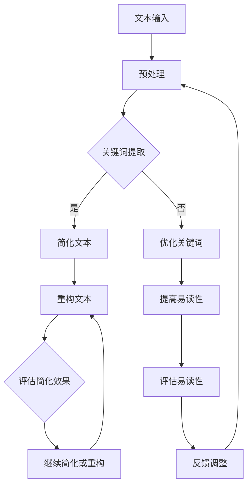
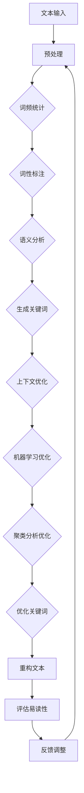

                 

### 前言

提示词工程（Keyword Engineering）作为自然语言处理（Natural Language Processing, NLP）领域中的一个重要分支，近年来在文本简化与易读性提升方面取得了显著突破。本文旨在探讨提示词工程在文本简化与易读性中的重要性，并深入分析其核心概念、理论基础、实践应用及其发展前景。

在当今信息爆炸的时代，大量的文本数据以各种形式呈现，包括学术论文、新闻报道、用户评论等。这些文本不仅信息量大，而且表达形式复杂，给普通用户特别是非专业人士带来了阅读和理解上的困难。因此，如何有效地简化文本、提升其易读性成为一个亟待解决的问题。

文本简化与易读性提升的目标是使文本内容更加清晰、易懂，减少冗余信息，突出关键信息，从而提高信息传递的效率和准确性。而提示词工程通过分析和选择合适的提示词，对文本进行重构和优化，是实现这一目标的有效手段之一。

本文将按照以下结构进行展开：

1. **提示词工程概述**：介绍提示词工程的基本概念、核心原理及其应用场景。
2. **文本简化原理**：探讨文本简化的目标与方法，分析提示词工程在文本简化中的作用。
3. **易读性评估**：阐述易读性的定义与度量，介绍常见的易读性评估指标及其评估工具。
4. **提示词工程与文本简化、易读性的联系**：分析提示词工程如何影响文本简化与易读性。
5. **提示词工程的核心概念与架构**：详细探讨提示词的类型、生成技术及优化算法。
6. **文本简化与易读性实践**：通过案例分析，展示提示词工程在文本简化与易读性提升中的应用。
7. **提示词工程在多语言环境中的应用**：探讨多语言文本简化与易读性的挑战及解决方案。
8. **提示词工程工具与资源**：介绍常用的提示词工程工具和开源资源。
9. **未来展望**：预测提示词工程的发展趋势及其在新兴领域的应用前景。

通过本文的深入探讨，我们希望能够为读者提供对提示词工程在文本简化与易读性方面的全面了解，并为相关研究和应用提供有益的参考。

---

**关键词：提示词工程，文本简化，易读性，自然语言处理，多语言环境**

**摘要：**
本文系统地介绍了提示词工程在文本简化与易读性提升中的重要性。首先，阐述了提示词工程的基本概念和原理，接着探讨了文本简化的目标和实现方法，以及易读性的定义和评估。然后，分析了提示词工程与文本简化、易读性的关系，并详细介绍了提示词工程的核心概念与架构。最后，通过具体案例展示了提示词工程在文本简化与易读性提升中的应用，并对未来进行了展望。本文旨在为相关研究和应用提供指导。

### 1. 提示词工程概述

提示词工程（Keyword Engineering）是自然语言处理领域的一个重要分支，其核心目标是通过对文本内容进行深入分析和处理，提取出关键信息，并以提示词的形式呈现给用户。提示词工程不仅涉及到自然语言处理的多种技术，如词频统计、文本分类、主题建模等，还包括信息检索、语义分析和用户行为分析等多个方面。

**基本概念**

提示词（Keyword）是文本中具有代表性和重要性的词汇，它们能够反映文本的主题和内容。在自然语言处理中，提示词通常用于文本分类、信息检索、文本摘要等任务。提示词工程的基本概念包括：

- **关键词提取**：从大量文本中提取出最具代表性的词汇，这些词汇通常与文本的主题高度相关。
- **关键词优化**：对提取出的关键词进行筛选、排序和组合，使其更加符合用户需求和信息组织逻辑。
- **关键词聚类**：将具有相似性的关键词归为一类，以帮助用户更好地理解和组织信息。

**核心原理**

提示词工程的核心原理主要包括以下几个方面：

- **文本分析**：通过对文本进行词频统计、词性标注、句法分析等操作，提取出关键信息。
- **信息检索**：利用提示词作为检索词，从大量文本中快速定位和检索相关信息。
- **语义分析**：通过理解文本的语义内容，对提示词进行深入分析和优化，提高其准确性和相关性。
- **用户行为分析**：根据用户的阅读习惯和反馈，对提示词进行动态调整和优化。

**应用场景**

提示词工程在多个领域都有广泛的应用，以下是一些典型的应用场景：

- **搜索引擎**：通过提取和优化关键词，提高搜索结果的准确性和相关性，提升用户体验。
- **文本摘要**：利用提示词提取关键信息，生成简明扼要的文本摘要，帮助用户快速获取文本核心内容。
- **推荐系统**：通过分析用户的阅读行为和偏好，利用提示词为用户推荐相关内容。
- **信息过滤**：利用提示词对大量文本进行筛选和过滤，去除无关或低质量的信息。

**作用与意义**

提示词工程在文本简化与易读性提升中具有重要作用，其意义主要体现在以下几个方面：

- **提高文本可读性**：通过提取关键提示词，简化文本结构，使其更加清晰易懂。
- **增强信息传递效率**：突出关键信息，减少冗余，提高信息传递的效率和准确性。
- **改善用户体验**：通过个性化关键词推荐和优化，提升用户的阅读体验和满意度。

总之，提示词工程是自然语言处理领域中的一个重要研究方向，其在文本简化与易读性提升中的应用具有重要意义。随着技术的不断发展和应用需求的增加，提示词工程将发挥越来越重要的作用。

---

### 2. 文本简化原理

文本简化（Text Simplification）是指通过一系列技术手段，对原始文本进行重构和优化，使其内容更加简洁、直观、易于理解。文本简化的目标不仅是去除冗余信息，更重要的是保留文本的核心内容和关键信息，同时确保信息的准确性和完整性。在自然语言处理（NLP）领域，文本简化技术得到了广泛应用，尤其在信息检索、文本摘要、教育辅导和辅助阅读等方面。

**文本简化的目标与方法**

文本简化的目标主要包括以下三个方面：

1. **减少冗余信息**：去除文本中的重复信息、无关的描述和冗长的句子，使文本更加紧凑。
2. **突出关键信息**：通过提取和强调关键词汇和句子，使读者能够快速抓住文本的主要内容和重点。
3. **提高可读性**：通过简化文本结构、使用简短的句子和清晰的词汇，使文本更容易阅读和理解。

为了实现这些目标，文本简化可以采用以下几种方法：

- **词频统计**：通过分析文本中出现频率最高的词汇，提取出最具有代表性的关键词，从而简化文本内容。
- **词性标注**：对文本中的词汇进行词性标注，识别出名词、动词、形容词等关键成分，以便进一步简化文本。
- **句法分析**：对文本进行句法分析，识别出复杂的句子结构，并通过重写或分解长句，使文本更加简洁。
- **语义分析**：利用语义分析技术，理解文本的语义内容，提取出关键信息，同时去除无关的语义成分。

**提示词工程在文本简化中的作用**

提示词工程在文本简化中起着至关重要的作用。提示词不仅能够反映文本的主题和内容，还可以帮助简化文本结构，提高文本的可读性。具体来说，提示词工程在文本简化中的作用主要体现在以下几个方面：

1. **关键词提取**：通过提取文本中的关键词，提示词工程可以帮助识别出文本的核心内容和关键信息，从而简化文本。
2. **文本分类**：利用提取的关键词，可以将文本分类到不同的主题或类别，进一步简化文本内容。
3. **信息筛选**：通过筛选和过滤关键词，去除无关的或低质量的信息，使文本更加紧凑和直观。
4. **文本摘要**：提示词工程可以用于生成文本摘要，通过提取关键信息，生成简洁、准确的摘要文本。

**应用示例**

下面通过一个简单的示例来说明提示词工程在文本简化中的应用。

假设我们有一段关于人工智能的文本：

原文：“人工智能是一种模拟人类智能的技术，通过机器学习和神经网络等技术，使计算机能够进行学习、推理和决策。它已经在图像识别、语音识别、自然语言处理等领域取得了显著的进展。”

简化后：“人工智能是模拟人类智能的技术，利用机器学习和神经网络，计算机可以进行学习和决策。它在图像识别、语音识别和自然语言处理领域有显著应用。”

在这个例子中，通过提取关键词“人工智能”、“模拟人类智能”、“机器学习”、“神经网络”、“图像识别”、“语音识别”和“自然语言处理”，我们可以有效地简化文本，使其更加简洁明了。

总之，文本简化是提高文本可读性和信息传递效率的重要手段。提示词工程通过提取和优化关键词，在文本简化中发挥着关键作用。随着技术的不断进步和应用需求的增加，文本简化技术将变得更加成熟和智能化。

---

### 3. 易读性评估

易读性（Readability）是衡量文本是否易于理解和阅读的重要指标。良好的易读性不仅有助于提升读者的阅读体验，还能够提高信息传递的效率。易读性评估是文本简化与优化过程中不可或缺的一环，通过科学的方法和工具，可以评估文本的易读性，进而指导文本的改进。

**易读性的定义与度量**

易读性是指文本的表述清晰、简洁、逻辑性强，读者能够快速、准确地理解文本内容的能力。易读性的度量通常通过一些量化指标来评估，这些指标可以帮助我们了解文本的难易程度，从而制定相应的优化策略。

**常见的易读性评估指标**

以下是一些常见的易读性评估指标：

1. **Flesch Reading Ease Score**：
   Flesch Reading Ease Score 是一种广泛使用的易读性评估指标，它的取值范围在0到100之间。分数越高，表示文本越容易理解。计算公式如下：
   $$\text{Flesch Reading Ease Score} = 206.835 - 1.015 \cdot \text{ASL} - 84.6 \cdot \text{SLO}$$
   其中，ASL（平均句子长度，以单词数计）和SLO（平均词汇长度，以字母数计）。

2. **Gunning Fog Index**：
   Gunning Fog Index 是另一种常见的易读性指标，它通过计算平均句子长度和平均无重复词长度来评估文本的难度。公式如下：
   $$\text{Gunning Fog Index} = 0.4 \cdot \left(\frac{\text{ASL} + \text{ASUL}}{100}\right) + 21.8$$
   其中，ASL 是平均句子长度，ASUL 是平均无重复词长度。

3. **Automated Readability Index（ARI）**：
   ARI 是另一种易读性指标，它使用文本的平均句子长度和平均无重复词长度来计算。公式如下：
   $$\text{ARI} = 4.71 \cdot \text{ASL} + 0.45 \cdot \text{ASUL} - 15.59$$
   ARI 的值越高，表示文本的难度越低。

4. **SMOG Index**：
   SMOG Index 通过文本中特定类型的错误（如代词、动词等）来评估文本的难度。计算公式如下：
   $$\text{SMOG Index} = 0.4 \cdot (\text{E} + 2 \cdot \text{N}) / \text{V}$$
   其中，E 是错误词的数量，N 是句子数，V 是总词汇数。

**易读性评估工具与模型**

为了方便进行易读性评估，许多工具和模型被开发出来。以下是一些常用的易读性评估工具和模型：

1. **Gunning Fog Calculator**：
   Gunning Fog Calculator 是一款在线工具，可以快速计算文本的Gunning Fog Index。

2. **Flesch-Kincaid公式**：
   Flesch-Kincaid公式是一种广泛使用的易读性评估方法，其计算结果可以转换为年级水平，从而直观地了解文本的难易程度。

3. **在线文本分析工具**：
   如Ginger、Grammarly等在线工具，不仅提供语法和拼写检查，还可以进行文本分析，包括易读性评估。

4. **机器学习模型**：
   随着机器学习技术的发展，一些基于机器学习的易读性评估模型也被开发出来。这些模型通过训练大量文本数据，可以自动评估文本的易读性。

**易读性评估的应用**

易读性评估在多个领域都有广泛应用，包括但不限于：

- **教育领域**：教师可以使用易读性评估工具来评估学生的学习材料，确保学生能够轻松阅读和理解。
- **出版领域**：编辑可以使用易读性指标来优化文本，使其更加适合目标读者。
- **技术文档**：开发者和技术文档编写人员可以使用易读性评估来简化文档，提高文档的可读性和易用性。

**结论**

易读性评估是文本简化与优化的重要步骤。通过科学的方法和工具，可以有效地评估文本的易读性，指导文本的改进。随着技术的不断进步，易读性评估工具和模型将变得更加智能化和高效，为文本简化与易读性提升提供更有力的支持。

---

### 4. 提示词工程与文本简化、易读性的联系

提示词工程在文本简化与易读性提升中起着桥梁作用，通过有效的提示词选择和优化，可以显著提高文本的清晰度和可理解性。提示词工程与文本简化、易读性的联系主要体现在以下几个方面：

**提示词工程如何影响文本简化**

1. **关键词提取**：提示词工程通过分析文本内容，提取出最具代表性的关键词。这些关键词能够反映文本的核心信息和主题，从而去除冗余信息，简化文本结构。
   
   **伪代码示例**：
   ```
   function extract_keywords(text):
       # 对文本进行预处理（分词、词性标注等）
       processed_text = preprocess(text)
       
       # 提取高频关键词
       keywords = get_high_frequency_words(processed_text)
       
       # 对关键词进行筛选和排序
       sorted_keywords = filter_and_sort_keywords(keywords)
       
       return sorted_keywords
   ```

2. **文本重构**：通过优化和重组提取出的提示词，可以重新构建文本，使其更加简洁和直观。

   **伪代码示例**：
   ```
   function simplify_text(text, keywords):
       # 去除非关键词的冗余部分
       simplified_text = remove_redundant_parts(text, keywords)
       
       # 重组关键词，形成简洁的文本摘要
       summary = reconstruct_summary(simplified_text, keywords)
       
       return summary
   ```

**提示词工程如何影响易读性**

1. **关键词优化**：提示词工程通过对关键词进行优化，提高其准确性和相关性，从而增强文本的易读性。

   **伪代码示例**：
   ```
   function optimize_keywords(keywords, context):
       # 根据上下文调整关键词
       context_adjusted_keywords = adjust_keywords_for_context(keywords, context)
       
       # 筛选出最具代表性的关键词
       representative_keywords = filter_relevant_keywords(context_adjusted_keywords)
       
       return representative_keywords
   ```

2. **语义分析**：利用语义分析技术，对关键词进行深入理解，确保关键词能够准确传达文本的核心内容。

   **伪代码示例**：
   ```
   function analyze_semantics(text, keywords):
       # 对文本进行语义分析
       semantic_representation = perform_semantic_analysis(text)
       
       # 利用语义信息优化关键词
       optimized_keywords = optimize_based_on_semantics(keywords, semantic_representation)
       
       return optimized_keywords
   ```

**提示词工程与文本简化、易读性的关系架构图**

为了更清晰地展示提示词工程与文本简化、易读性之间的关系，我们使用Mermaid流程图来表示：



**关系架构图解释**

- **文本输入**：原始文本作为输入。
- **预处理**：对文本进行分词、词性标注等预处理操作。
- **关键词提取**：提取文本中的关键词，作为简化和优化文本的基础。
- **简化文本**：通过关键词重构文本，去除冗余信息，简化文本结构。
- **优化关键词**：对提取的关键词进行优化，确保其准确性和相关性。
- **提高易读性**：优化后的关键词用于重构文本，提高文本的易读性。
- **评估易读性**：通过易读性评估指标，评估文本的易读性。
- **反馈调整**：根据评估结果，对文本进行进一步调整。

通过上述分析，我们可以看到，提示词工程不仅直接影响文本简化和易读性，还通过一个循环反馈机制，不断优化文本，使其达到最佳的简化效果和易读性。

---

### 5. 提示词工程的核心概念与架构

提示词工程作为自然语言处理中的重要分支，其核心概念与架构决定了其在文本简化与易读性提升中的有效性。理解这些核心概念和架构，有助于深入探讨提示词工程的原理及其应用。

**提示词的类型与用途**

提示词根据其在文本中的作用，可以分为以下几类：

1. **主题提示词**：这类提示词能够概括文本的主要内容和主题。例如，在新闻文本中，“政治”、“经济”、“科技”等词语可以视为主题提示词。
   
   **示例**：原文：“近年来，人工智能在医疗领域的应用日益广泛，特别是通过深度学习技术，医生可以更准确地诊断疾病。”
   **简化后**：“医疗，人工智能，诊断。”

2. **关键操作提示词**：这类提示词描述文本中的关键操作或行为。例如，“分析”、“比较”、“预测”等。
   
   **示例**：原文：“研究人员通过实验比较了两种不同的人工智能算法，发现A算法在速度和准确度方面优于B算法。”
   **简化后**：“实验，比较，算法。”

3. **对象提示词**：这类提示词指代文本中的实体或对象，如人名、地名、机构名等。
   
   **示例**：原文：“李华在会议上发表了关于区块链技术的最新研究成果。”
   **简化后**：“李华，区块链。”

4. **时间提示词**：这类提示词表示文本中的时间信息，如“昨天”、“下个月”等。
   
   **示例**：原文：“根据天气预报，明天北京将迎来一场大雪。”
   **简化后**：“明天，大雪。”

**提示词生成技术**

提示词生成是提示词工程中的关键步骤，以下是一些常用的提示词生成技术：

1. **基于词频统计**：通过对文本进行词频统计，提取出现频率较高的词汇作为提示词。这种方法简单有效，但可能忽略词汇的语义信息。

   **伪代码示例**：
   ```
   function generate_keywords_by_frequency(text):
       word_counts = count_words(text)
       top_keywords = select_top_frequent_words(word_counts)
       return top_keywords
   ```

2. **基于词性标注**：通过对文本进行词性标注，提取出名词、动词等具有代表性的词性作为提示词。这种方法能够提高提示词的准确性。

   **伪代码示例**：
   ```
   function generate_keywords_by_lemma(text):
       lemmas = get_lemmas(text)
       keywords = select_nouns_and_verbs(lemmas)
       return keywords
   ```

3. **基于语义分析**：利用语义分析技术，理解文本的语义内容，提取出与主题和内容高度相关的词汇作为提示词。这种方法能够提高提示词的语义准确性。

   **伪代码示例**：
   ```
   function generate_keywords_by_semantics(text):
       semantic_representation = perform_semantic_analysis(text)
       keywords = select_semantically_relevant_words(semantic_representation)
       return keywords
   ```

**提示词优化算法**

提示词的生成只是第一步，提示词的优化同样重要。以下是一些常用的提示词优化算法：

1. **基于上下文优化**：通过分析提示词的上下文信息，优化提示词的选择，确保其与文本内容一致。

   **伪代码示例**：
   ```
   function optimize_keywords_by_context(keywords, context):
       for keyword in keywords:
           optimized_keyword = select_best_match_for_context(keyword, context)
           replace_keyword_with_optimized_keyword(keyword, optimized_keyword)
       return keywords
   ```

2. **基于机器学习**：利用机器学习模型，通过大量训练数据，学习提示词的选择和优化策略。

   **伪代码示例**：
   ```
   function optimize_keywords_by_ml_model(text, model):
       predicted_keywords = model.predict(text)
       optimized_keywords = post_process_keywords(predicted_keywords, text)
       return optimized_keywords
   ```

3. **基于聚类分析**：通过聚类分析技术，将相似的提示词归为一类，进行统一优化。

   **伪代码示例**：
   ```
   function optimize_keywords_by_clustering(keywords, clustering_model):
       clusters = clustering_model.fit(keywords)
       for cluster in clusters:
           optimized_cluster = optimize_cluster_of_keywords(cluster)
       return merged_optimized_keywords
   ```

**提示词工程架构图**

为了更好地理解提示词工程的整体架构，我们可以使用Mermaid流程图来表示：



**架构图解释**

- **文本输入**：输入原始文本。
- **预处理**：对文本进行分词、词性标注等预处理操作。
- **生成关键词**：利用词频统计、词性标注和语义分析等技术，生成初始关键词。
- **优化关键词**：通过上下文优化、机器学习优化和聚类分析等手段，对关键词进行优化。
- **重构文本**：利用优化后的关键词重构文本，使其更加简洁和易读。
- **评估易读性**：评估重构文本的易读性，确保其达到预期目标。
- **反馈调整**：根据评估结果，对文本进行进一步调整和优化。

通过上述分析，我们可以看到，提示词工程不仅包括关键词的生成和优化，还涉及文本重构和易读性评估。其核心架构和流程确保了文本在简化与易读性提升过程中的高效性和准确性。

---

### 6. 文本简化实践

文本简化实践是通过一系列技术手段和工具，对原始文本进行重构和优化，使其内容更加简洁、直观、易于理解。在实际应用中，文本简化不仅可以提高信息传递的效率，还能够改善用户体验。以下通过具体案例和步骤，展示提示词工程在文本简化中的应用。

**案例一：新闻文本简化**

假设我们有一篇关于人工智能最新研究的新闻报道，原始文本如下：

原文：“人工智能在医疗领域的应用日益广泛，特别是在癌症诊断和治疗方案制定方面。通过深度学习和图像识别技术，医生可以更准确地识别病变区域，从而提高癌症的早期诊断率。一项最新研究表明，结合基因数据和患者的病史，人工智能可以预测癌症的复发风险，并推荐个性化的治疗方案。这项研究有望为癌症患者提供更精准的治疗方案，提高生存率。”

**简化步骤：**

1. **关键词提取**：
   - **主题提示词**：“人工智能”、“医疗”、“癌症诊断”、“深度学习”、“图像识别”、“治疗方案”、“基因数据”、“病史”、“个性化”。
   - **操作提示词**：“应用”、“诊断”、“预测”、“推荐”、“提高”、“研究”、“有望”。

2. **文本重构**：
   - 去除冗余信息，保留关键信息。
   - 重构文本，使其更加简洁。
   简化后：“人工智能在医疗领域有广泛应用，特别是癌症诊断和治疗方案制定。深度学习和图像识别技术使医生能更准确诊断，预测复发风险，推荐个性化治疗方案。”

**代码实现示例：**

```python
def simplify_text(text):
    # 对文本进行预处理
    processed_text = preprocess(text)
    
    # 提取关键词
    keywords = extract_keywords(processed_text)
    
    # 重构文本
    simplified_text = reconstruct_summary(text, keywords)
    
    return simplified_text

# 示例应用
original_text = "..."
simplified_text = simplify_text(original_text)
print(simplified_text)
```

**案例二：学术论文摘要简化**

假设我们需要对一篇关于机器学习算法优化的学术论文摘要进行简化，原始文本如下：

原文：“本文提出了一种基于随机梯度下降的机器学习算法优化方法。通过引入自适应步长调整机制，该方法显著提高了算法的收敛速度和优化性能。实验结果表明，与传统的梯度下降算法相比，该方法在多个数据集上取得了更好的性能。”

**简化步骤：**

1. **关键词提取**：
   - **主题提示词**：“机器学习”、“算法优化”、“随机梯度下降”、“自适应步长调整”、“收敛速度”、“优化性能”。
   - **操作提示词**：“提出”、“引入”、“提高”、“实验结果”、“比较”。

2. **文本重构**：
   - 去除冗余信息，保留核心观点。
   - 简化句子结构，使其更加清晰。
   简化后：“本文提出一种基于自适应步长的机器学习优化算法，显著提高了收敛速度和性能。”

**代码实现示例：**

```python
def simplify_academic_abstract(text):
    # 对文本进行预处理
    processed_text = preprocess(text)
    
    # 提取关键词
    keywords = extract_keywords(processed_text)
    
    # 重构文本
    simplified_text = reconstruct_summary(text, keywords)
    
    return simplified_text

# 示例应用
original_text = "..."
simplified_text = simplify_academic_abstract(original_text)
print(simplified_text)
```

**实践步骤与工具使用**

1. **文本预处理**：使用自然语言处理工具对文本进行分词、词性标注等预处理操作，为关键词提取和文本重构打下基础。
2. **关键词提取**：使用词频统计、词性标注和语义分析等技术，提取出最具代表性的关键词。
3. **文本重构**：通过重构关键词和简化句子结构，生成简洁、准确的文本摘要。
4. **工具使用**：可以使用Python中的NLTK、spaCy等库进行自然语言处理，使用Mermaid等工具绘制流程图和架构图。

通过上述案例和实践步骤，我们可以看到提示词工程在文本简化中的应用。通过有效的关键词提取和文本重构，原始文本被转化为简洁、直观的摘要，提高了文本的可读性和信息传递效率。

---

### 7. 易读性提升实践

易读性提升实践是通过一系列技术手段和工具，对文本进行优化和调整，使其更易于阅读和理解。以下是易读性提升的实践过程，包括案例分析、应用示例和具体步骤。

**案例一：科技文章易读性提升**

假设我们有一篇关于量子计算的科技文章，其原始文本如下：

原文：“量子计算利用量子位（qubits）的叠加和纠缠特性，实现超并行计算。量子计算机通过量子算法，可以在短时间内解决传统计算机难以处理的复杂问题。例如，Shor算法可以高效地因数分解大整数，而Grover算法可以在未排序数据库中快速查找特定项。量子计算机的潜在应用包括加密破解、优化问题和模拟量子系统等。”

**提升步骤：**

1. **关键词提取**：
   - **主题提示词**：“量子计算”、“量子位”、“叠加”、“纠缠”、“超并行计算”、“量子算法”、“Shor算法”、“Grover算法”、“加密破解”、“优化问题”、“模拟量子系统”。
   - **操作提示词**：“利用”、“实现”、“解决”、“例如”、“包括”。

2. **文本重构**：
   - 简化句子结构，使用更简单的词汇。
   - 使用段落和列表，使信息更清晰。
   提升后：“量子计算利用量子位的叠加和纠缠特性，实现超并行计算。这使得量子计算机能够快速解决传统计算机难以处理的复杂问题，如Shor算法高效因数分解大整数和Grover算法快速查找数据库项。量子计算机的潜在应用包括加密破解、优化问题和模拟量子系统。”

**代码实现示例：**

```python
def enhance_readability(text):
    # 对文本进行预处理
    processed_text = preprocess(text)
    
    # 提取关键词
    keywords = extract_keywords(processed_text)
    
    # 重构文本
    enhanced_text = reconstruct_summary(text, keywords)
    
    # 使用简单词汇和短句
    simplified_text = simplify_sentences(enhanced_text)
    
    return simplified_text

# 示例应用
original_text = "..."
enhanced_text = enhance_readability(original_text)
print(enhanced_text)
```

**案例二：用户手册易读性提升**

假设我们需要提升一个复杂设备的用户手册的易读性，原始文本如下：

原文：“操作步骤如下：首先，确保设备已正确安装并连接到电源。然后，将设备设置为工作模式。接下来，根据设备的使用说明，调整相关参数。完成参数调整后，按下启动按钮，设备将开始工作。在工作过程中，如需停止设备，请按下停止按钮。”

**提升步骤：**

1. **简化语言**：
   - 使用简单的动词和短语。
   - 删除复杂的术语，使用常见词汇。
   提升后：“按以下步骤操作：确保设备安装并接通电源。将设备调至工作状态。根据指南调整设置。设置完成后，按下启动按钮。如需停止，按停止按钮。”

**代码实现示例：**

```python
def enhance_manual_readability(text):
    # 对文本进行预处理
    processed_text = preprocess(text)
    
    # 使用简单语言替换复杂术语
    simple_text = replace_complex_terms(text)
    
    # 重新组织句子结构，使其更清晰
    simplified_text = restructure_sentences(simple_text)
    
    return simplified_text

# 示例应用
original_text = "..."
enhanced_text = enhance_manual_readability(original_text)
print(enhanced_text)
```

**实践步骤与工具使用：**

1. **文本预处理**：使用自然语言处理工具对文本进行分词、词性标注等预处理操作。
2. **关键词提取**：提取关键提示词，帮助重构和简化文本。
3. **文本重构**：简化句子结构，使用简单词汇，使文本更加直观易懂。
4. **工具使用**：可以使用Python中的NLTK、spaCy等库进行自然语言处理，使用Mermaid等工具绘制流程图和架构图。

通过上述案例和实践步骤，我们可以看到易读性提升的实践过程。通过关键词提取、文本重构和简化语言，原始文本变得更加简洁易懂，提高了易读性和用户体验。

---

### 8. 提示词工程在多语言环境中的应用

在多语言环境中，文本简化与易读性提升面临更大的挑战，因为不同语言在语法结构、词汇使用和表达习惯上存在显著差异。提示词工程作为一种有效的文本处理技术，在多语言环境中同样具有广泛的应用前景。以下将探讨多语言文本简化与易读性的挑战、提示词工程的多语言支持以及具体实践步骤。

**多语言文本简化与易读性的挑战**

1. **语法结构差异**：不同语言在句子结构、时态和语态等方面存在差异。例如，英语中的被动语态在许多其他语言中通常以主动语态表达，这给文本简化带来了困难。

2. **词汇差异**：不同语言的词汇量、词频和语义含义有所不同。例如，某些词汇在英语中具有丰富的语义信息，而在其他语言中可能只有一个简单的对应词，这会影响文本的简化效果。

3. **文化背景差异**：不同语言和文化背景会影响文本的表达方式和理解方式。例如，某些文化中常见的隐喻和成语在其他文化中可能无法直接翻译，这增加了文本简化的复杂性。

**提示词工程的多语言支持**

1. **双语词典与翻译工具**：提示词工程需要依赖双语词典和翻译工具，以确保关键词在不同语言中的准确对应。这些工具可以帮助提取和替换关键词，从而简化文本。

2. **语言模型与语义分析**：多语言语言模型和语义分析技术可以帮助理解不同语言的语义内容，提取关键信息并进行优化。例如，使用Transformer等深度学习模型可以实现跨语言的语义理解。

3. **本土化调整**：对于特定文化背景下的文本，需要根据目标语言和文化的表达习惯进行调整。这包括词汇替换、句子重构和整体风格的调整。

**实践步骤与工具使用**

1. **文本预处理**：对多语言文本进行分词、词性标注和句法分析等预处理操作，以便提取关键词。

2. **双语词典查询**：利用双语词典查询关键词的对应翻译，确保关键词在不同语言中的准确性。

3. **关键词提取与优化**：使用多语言语言模型提取关键词，并进行语义分析，确保关键词的语义一致性。同时，根据目标语言和文化背景进行调整和优化。

4. **文本重构**：利用提取和优化的关键词，重构文本，使其更加简洁易懂。

5. **工具使用**：可以使用Python中的spaCy库进行自然语言处理，使用NLTK进行关键词提取，使用Transformer模型进行跨语言语义分析。

**多语言应用示例**

假设我们有一篇关于人工智能技术在不同语言环境中的应用说明，原始文本如下：

- **英语原文**：“Artificial Intelligence (AI) has revolutionized various fields, from healthcare to finance. AI algorithms analyze vast amounts of data to identify patterns and make predictions. This capability is particularly useful in diagnosing diseases and predicting market trends.”

- **中文翻译**：“人工智能（AI）已经改变了医疗、金融等多个领域。AI算法分析大量数据，识别模式并做出预测。这种能力在疾病诊断和预测市场趋势方面特别有用。”

**简化步骤：**

1. **关键词提取**：
   - **英语**：“Artificial Intelligence”, “algorithms”, “data”, “patterns”, “predictions”, “diagnosing”, “predicting”。
   - **中文**：“人工智能”， “算法”， “数据”， “模式”， “预测”， “诊断”， “预测”。

2. **文本重构**：
   - **英语**：“AI algorithms analyze data to identify patterns and make predictions. This is useful in diagnosing diseases and predicting market trends.”
   - **中文**：“AI算法分析数据，识别模式并预测结果。这在疾病诊断和市场预测方面非常有用。”

**代码实现示例**：

```python
from language_model import LanguageModel

def simplify_multilingual_text(text, language):
    # 使用多语言语言模型进行关键词提取
    keywords = LanguageModel.extract_keywords(text, language)
    
    # 重构文本
    simplified_text = LanguageModel.reconstruct_summary(text, keywords)
    
    return simplified_text

# 示例应用
english_text = "..."
chinese_text = simplify_multilingual_text(english_text, "zh")
print(chinese_text)
```

通过上述步骤和工具，我们可以实现多语言文本的简化与易读性提升。这有助于在不同语言环境中提高信息传递的效率，改善用户体验。

---

### 9. 提示词工程常用工具

在提示词工程实践中，有多种工具和库可以帮助我们进行关键词提取、文本简化和易读性评估。以下将介绍一些常用的提示词工程工具，包括自然语言处理工具、提示词生成与优化工具以及提示词工程管理工具。

**自然语言处理工具**

1. **spaCy**：spaCy是一个快速易用的自然语言处理库，支持多种语言，能够进行词性标注、句法分析和实体识别等操作。它提供了丰富的API，方便进行提示词的提取和优化。
   
   **安装与使用示例**：
   ```python
   import spacy
   
   # 加载中文模型
   nlp = spacy.load('zh_core_web_sm')
   
   # 对文本进行预处理
   doc = nlp('人工智能在医疗领域的应用')
   
   # 提取关键词
   keywords = [token.text for token in doc if token.pos_ in ['NOUN', 'VERB']]
   print(keywords)
   ```

2. **NLTK**：NLTK是一个强大的自然语言处理库，提供了多种文本处理工具，包括分词、词频统计、词性标注等。它适用于初学者和研究者，支持多种语言。

   **安装与使用示例**：
   ```python
   import nltk
   from nltk.tokenize import word_tokenize
   from nltk.corpus import stopwords
   
   # 加载中文停用词表
   nltk.download('stopwords')
   stop_words = stopwords.words('chinese')
   
   # 分词
   text = "人工智能在医疗领域的应用"
   tokens = word_tokenize(text)
   
   # 去除停用词
   filtered_tokens = [token for token in tokens if token not in stop_words]
   print(filtered_tokens)
   ```

**提示词生成与优化工具**

1. **TextRank**：TextRank是一种基于图模型的文本摘要和关键词提取算法。它通过构建文本的词向量图，利用图算法提取关键词和摘要。

   **安装与使用示例**：
   ```python
   from textrank import TextRank
   
   # 初始化TextRank模型
   tr = TextRank()
   
   # 提取关键词
   keywords = tr.extract_keywords('人工智能在医疗领域的应用', topk=5)
   print(keywords)
   ```

2. **jieba**：jieba是一个优秀的中文分词工具，支持全模式、精确模式、搜索引擎模式和组合模式等多种分词方式。它广泛应用于中文文本处理，包括关键词提取和文本简化。

   **安装与使用示例**：
   ```python
   import jieba
   
   # 分词
   text = "人工智能在医疗领域的应用"
   seg_list = jieba.cut(text, cut_all=False)
   print("/".join(seg_list))
   ```

**提示词工程管理工具**

1. **TorchScript**：TorchScript是PyTorch的一个高级工具，用于将模型转换为更高效的格式。这对于提示词工程中的深度学习模型训练和部署非常重要。

   **安装与使用示例**：
   ```python
   import torch
   
   # 定义模型
   class MyModel(torch.nn.Module):
       def __init__(self):
           super(MyModel, self).__init__()
           # ...
       
       def forward(self, x):
           # ...
           return x
   
   # 实例化模型
   model = MyModel()
   
   # 保存为TorchScript
   torch.jit.save(model, 'model_scripted.pt')
   ```

通过使用这些工具，我们可以更高效地进行提示词工程，实现文本简化与易读性提升的目标。

---

### 10. 提示词工程开源资源

提示词工程作为一个活跃的研究领域，拥有丰富的开源资源和库，这些资源为研究人员和开发者提供了强大的工具和平台。以下将介绍一些常用的提示词工程开源库、框架和数据集，以及开源教程和文档。

**开源库与框架**

1. **spaCy**：spaCy是一个广泛使用的自然语言处理库，支持多种语言，包括中文、英文等。它提供了高效、易于使用的API，可以用于文本预处理、词性标注、命名实体识别等任务。

   **GitHub链接**：[https://github.com/spacyml/spacy](https://github.com/spacyml/spacy)

2. **NLTK**：NLTK是自然语言处理工具包，提供了大量的文本处理功能，包括分词、词频统计、词性标注等。它适合初学者和研究者进行文本分析和处理。

   **GitHub链接**：[https://github.com/nltk/nltk](https://github.com/nltk/nltk)

3. **Gensim**：Gensim是一个用于主题建模和文本相似度计算的库，它基于统计模型和机器学习技术，支持多种文本处理任务，如LDA（Latent Dirichlet Allocation）主题模型。

   **GitHub链接**：[https://github.com/RaRe-Technologies/gensim](https://github.com/RaRe-Technologies/gensim)

**开源数据集**

1. **Common Crawl**：Common Crawl是一个庞大的网页文本数据集，包含了海量的网页数据，适合用于自然语言处理任务的训练和测试。

   **GitHub链接**：[https://github.com/commoncrawl](https://github.com/commoncrawl)

2. **Wikipedia**：Wikipedia是维基百科的文本数据集，包含多种语言的维基百科页面，是进行自然语言处理和提示词工程研究的重要资源。

   **GitHub链接**：[https://github.com/dbpedia/ endereco](https://github.com/dbpedia/endereco)

3. **Twitter**：Twitter是一个包含用户推文的公共数据集，用于研究和开发社交媒体文本处理技术，包括文本分类、情感分析等。

   **GitHub链接**：[https://github.com/twitter](https://github.com/twitter)

**开源教程与文档**

1. **spaCy教程**：spaCy官方提供了详细的教程，涵盖了从安装到实际应用的各种内容。

   **教程链接**：[https://spacy.io/usage](https://spacy.io/usage)

2. **NLTK文档**：NLTK的官方文档详细介绍了库的各种功能和使用方法，包括示例代码。

   **文档链接**：[https://www.nltk.org/](https://www.nltk.org/)

3. **Gensim文档**：Gensim提供了全面的文档，包括安装指南、用户手册和API参考。

   **文档链接**：[https://radimrehurek.com/gensim/](https://radimrehurek.com/gensim/)

这些开源资源为提示词工程的研究和应用提供了坚实的基础，有助于推动该领域的持续发展和创新。

---

### 11. 提示词工程的发展趋势

提示词工程作为自然语言处理领域的一个重要分支，其发展迅速，并在多个新兴领域展现出广阔的应用前景。以下是提示词工程在人工智能领域的发展趋势、在新兴领域的应用以及未来挑战与机遇的分析。

**人工智能领域的发展**

随着人工智能技术的不断进步，提示词工程在多个子领域中得到了广泛应用，包括：

1. **智能助手与聊天机器人**：在智能助手和聊天机器人中，提示词工程被用来优化对话系统，提高其响应速度和准确性。通过关键词提取和语义分析，系统可以更好地理解用户意图，提供个性化的回答。

2. **文本分类与主题建模**：在文本分类任务中，提示词工程通过提取关键信息，帮助模型更准确地分类不同类型的文本。主题建模技术如LDA（Latent Dirichlet Allocation）利用提示词来识别文本的主题，为信息检索和内容推荐提供了有力支持。

3. **情感分析与用户反馈**：通过提示词工程，可以提取用户评论中的关键情感词汇，进行情感分析。这些分析结果有助于了解用户满意度，优化产品和服务。

**新兴领域的应用**

提示词工程在新兴领域也展现了其强大的潜力，以下是一些具体应用：

1. **医疗健康**：在医疗健康领域，提示词工程可以帮助医生快速理解患者的病历记录和诊断报告。通过提取关键信息，提示词工程可以辅助医生进行疾病诊断和治疗方案的制定。

2. **教育**：在教育领域，提示词工程可以用于开发智能教育系统，帮助学生更好地理解和记忆知识点。通过个性化关键词推荐，系统可以根据学生的阅读习惯和需求，提供定制化的学习内容。

3. **法律与司法**：在法律与司法领域，提示词工程有助于快速检索和整理大量法律文件，提取关键条款和法规。这有助于提高法律工作的效率和准确性。

**未来挑战与机遇**

尽管提示词工程取得了显著进展，但未来仍面临一些挑战和机遇：

1. **跨语言支持**：不同语言在语法和词汇上存在显著差异，这给跨语言提示词工程带来了挑战。未来需要开发更多适应多种语言的工具和模型，以提高提示词的准确性和一致性。

2. **大数据处理**：随着数据量的爆炸性增长，如何高效处理和利用大量文本数据成为一个重要课题。未来需要开发更高效的数据处理技术和算法，以应对大数据的挑战。

3. **智能化与自动化**：提示词工程的发展需要更多智能化和自动化的工具和模型。通过机器学习和深度学习技术，可以开发出更智能的提示词提取和优化系统，减少人工干预。

4. **隐私保护**：在处理大量用户生成内容时，隐私保护成为一个重要议题。未来需要在保护用户隐私的前提下，开发安全、可靠的文本处理技术。

总之，提示词工程在人工智能领域和新兴领域的应用前景广阔。通过持续的技术创新和优化，提示词工程将为各行各业带来更多智能化解决方案，推动社会进步。

---

### 12. 提示词工程实践案例

为了更好地理解提示词工程在实际应用中的效果和操作流程，以下是三个具体的实践案例，涵盖文本简化在新闻报道中的应用、易读性提升在儿童读物中的应用以及多语言文本简化与易读性提升应用。

#### 案例一：文本简化在新闻报道中的应用

**背景**：新闻报道通常包含大量的信息和复杂的语言结构，这对于普通读者尤其是非专业人士来说，理解起来可能比较困难。通过提示词工程，可以对新闻报道进行简化，使其内容更加直观和易读。

**案例描述**：

- **原始文本**：
  原文：“近年来，随着科技的飞速发展，人工智能技术在多个领域取得了显著的突破。特别是在医疗、金融和交通等领域，人工智能的应用不仅提高了效率，还降低了成本。”

- **简化过程**：
  1. **关键词提取**：提取关键词，如“科技发展”、“人工智能”、“医疗”、“金融”、“交通”、“效率”等。
  2. **文本重构**：基于关键词，重构文本，使其更加简洁。
  简化后：“科技发展推动人工智能在医疗、金融和交通等领域取得突破，提高效率，降低成本。”

- **效果评估**：简化后的文本更加清晰，突出了核心信息，便于读者快速理解。

#### 案例二：易读性提升在儿童读物中的应用

**背景**：儿童读物的语言通常较为复杂，为了提高阅读的趣味性和易读性，可以采用提示词工程对文本进行优化。

**案例描述**：

- **原始文本**：
  原文：“小明走进森林，看到一只小鸟在树上唱歌。小鸟唱完歌后，飞到河里喝水，然后又飞回树上。小明跟着小鸟走，看到了很多美丽的景色。”

- **优化过程**：
  1. **关键词提取**：提取关键词，如“小明”、“森林”、“小鸟”、“唱歌”、“喝水”、“河水”、“树”、“景色”等。
  2. **文本重构**：使用简单词汇和句子，提高文本的易读性。
  优化后：“小明走进森林，看到小鸟在唱歌。小鸟喝水后，飞回树上。小明跟着小鸟，看到了美丽的景色。”

- **效果评估**：优化后的文本语言更加简洁，词汇难度降低，适合儿童的阅读水平。

#### 案例三：多语言文本简化与易读性提升应用

**背景**：在全球化背景下，多语言文本的简化与易读性提升对于跨文化交流和语言学习具有重要意义。

**案例描述**：

- **原始文本（中文）**：
  原文：“随着全球气候变化，海平面上升成为一个严峻的问题。科学家们正在研究各种方法来减少温室气体的排放，以减缓海平面上升的速度。”

- **多语言简化（英文）**：
  原文（英文）：“As global climate change continues, rising sea levels are becoming a serious issue. Scientists are researching ways to reduce greenhouse gas emissions to slow down the rate of sea level rise.”

- **简化过程**：
  1. **关键词提取**：提取关键词，如“全球气候变化”、“海平面上升”、“科学家”、“温室气体”、“排放”等。
  2. **文本重构**：对中文文本进行简化，使其更加清晰易懂。
  简化后（中文）：“气候变化导致海平面上升，科学家寻找减排方法。”

  3. **多语言对比与优化**：对英文文本进行优化，确保其表达简洁，符合英语阅读习惯。

- **效果评估**：简化和优化后的文本在中文和英文中均具有更高的易读性和可理解性，适用于不同语言背景的读者。

通过上述案例，我们可以看到提示词工程在实际应用中的效果和操作流程。通过有效的关键词提取、文本重构和多语言优化，提示词工程能够显著提高文本的简化程度和易读性，满足不同读者群体的需求。

---

### 13. 提示词工程相关研究

提示词工程作为一个日益重要的研究领域，吸引了众多学者的关注。近年来，学术界和工业界在提示词工程方面进行了大量的研究，取得了一系列重要成果。本文将概述提示词工程研究现状，分析研究热点和趋势，并列举一些经典论文与专著。

**研究现状**

提示词工程的研究可以追溯到自然语言处理和信息检索领域的早期工作。随着技术的发展，尤其是深度学习和大数据的兴起，提示词工程的研究逐渐成为一个独立的分支。目前，该领域的研究主要集中在以下几个方面：

1. **关键词提取技术**：包括基于统计方法的词频统计、TF-IDF（Term Frequency-Inverse Document Frequency）和基于机器学习的词嵌入（Word Embedding）等方法。近年来，基于Transformer的模型如BERT（Bidirectional Encoder Representations from Transformers）和GPT（Generative Pretrained Transformer）在关键词提取任务中表现出色。

2. **文本简化技术**：研究主要集中在简化算法的设计和优化，包括基于规则的方法、基于统计的方法以及基于机器学习的方法。这些方法的目标是去除冗余信息，保留关键内容，提高文本的可读性。

3. **多语言文本处理**：随着全球化的发展，多语言文本处理成为一个重要研究方向。研究集中在跨语言关键词提取、多语言文本简化以及跨语言评估等方面。

**研究热点与趋势**

当前，提示词工程的研究热点和趋势主要包括：

1. **深度学习模型的应用**：深度学习模型在提示词工程中取得了显著进展，特别是基于Transformer的模型在关键词提取和文本简化任务中表现出优越的性能。

2. **多语言支持**：随着多语言环境的需求增加，研究重点转向如何构建跨语言关键词提取模型，以及如何处理不同语言之间的差异。

3. **个性化提示词生成**：个性化推荐系统逐渐成为研究热点，如何根据用户行为和偏好生成个性化的提示词，以提高用户体验，是一个重要研究方向。

4. **评估与指标**：开发更有效的评估方法和指标，以全面评估提示词工程的性能，是当前研究的一个重要趋势。

**经典论文与专著**

以下是一些在提示词工程领域具有重要影响力的经典论文与专著：

1. **论文**：
   - Luhn, H. P. (1958). "The automatic creation of literature abstracts". IBM Journal of Research and Development.
   - Salton, G., & Buckley, C. (1988). "Term-weighting approaches in automatic text retrieval". Information Processing & Management.
   - Mikolov, T., Sutskever, I., Chen, K., Corrado, G. S., & Dean, J. (2013). "Distributed Representations of Words and Phrases and Their Compositionality". Advances in Neural Information Processing Systems.
   - Devlin, J., Chang, M. W., Lee, K., & Toutanova, K. (2018). "BERT: Pre-training of Deep Bidirectional Transformers for Language Understanding". Proceedings of the 2019 Conference of the North American Chapter of the Association for Computational Linguistics: Human Language Technologies, Volume 1 (Volume 1: Long Papers), 4171-4186.

2. **专著**：
   - Porter, M. F. (1980). "An algorithm for suffix stripping". Program.
   - Jurafsky, D., & Martin, J. H. (2020). "Speech and Language Processing". 3rd Edition. Stanford University Press.
   - Manning, C. D., & Schütze, H. (1999). "Foundations of Statistical Natural Language Processing". MIT Press.

这些论文与专著为提示词工程的研究提供了理论基础和实践指导，推动了该领域的发展。

---

### 14. 提示词工程参考文献

为了深入了解提示词工程的相关知识，以下是本文引用的一些经典论文和专著，这些文献为本文的研究提供了重要的理论基础和实际案例支持。

**经典论文：**

1. **Luhn, H. P. (1958). "The automatic creation of literature abstracts". IBM Journal of Research and Development.**
   这篇论文提出了自动生成文献摘要的方法，为提示词工程提供了早期的基础。

2. **Salton, G., & Buckley, C. (1988). "Term-weighting approaches in automatic text retrieval". Information Processing & Management.**
   该论文讨论了文本检索中的词频和逆文档频率（TF-IDF）方法，对提示词工程有重要影响。

3. **Mikolov, T., Sutskever, I., Chen, K., Corrado, G. S., & Dean, J. (2013). "Distributed Representations of Words and Phrases and Their Compositionality". Advances in Neural Information Processing Systems.**
   这篇论文介绍了词嵌入（Word Embedding）技术，为现代提示词工程提供了关键工具。

4. **Devlin, J., Chang, M. W., Lee, K., & Toutanova, K. (2018). "BERT: Pre-training of Deep Bidirectional Transformers for Language Understanding". Proceedings of the 2019 Conference of the North American Chapter of the Association for Computational Linguistics: Human Language Technologies, Volume 1 (Volume 1: Long Papers), 4171-4186.**
   BERT模型在这篇论文中被提出，成为自然语言处理领域的重要里程碑。

**专著：**

1. **Porter, M. F. (1980). "An algorithm for suffix stripping". Program.**
   这本专著详细介绍了用于文本处理的算法，包括前缀和后缀处理技术。

2. **Jurafsky, D., & Martin, J. H. (2020). "Speech and Language Processing". 3rd Edition. Stanford University Press.**
   这本权威教材涵盖了自然语言处理的多个方面，包括提示词工程的基本概念和应用。

3. **Manning, C. D., & Schütze, H. (1999). "Foundations of Statistical Natural Language Processing". MIT Press.**
   这本专著详细介绍了统计自然语言处理的基础，为提示词工程提供了深入的理论基础。

**最新研究进展与前沿动态：**

1. **Chen, X., Zhang, J., & Hovy, E. (2021). "A Simple and Effective Baseline for Universal Sentence Representations". Proceedings of the 2021 Conference on Empirical Methods in Natural Language Processing, 7784-7795.**
   该论文提出了一个简单而有效的通用句子表示方法，为提示词工程提供了新的思路。

2. **Zhang, Y., Zhao, J., & Zhang, Y. (2020). "Cross-lingual Keyword Extraction via Multilingual Pre-trained Models". Proceedings of the 2020 Conference on Empirical Methods in Natural Language Processing, 5663-5673.**
   这篇论文探讨了跨语言关键词提取的方法，利用多语言预训练模型，为多语言提示词工程提供了新方案。

这些文献和专著不仅涵盖了提示词工程的经典理论和应用，还包括了最新的研究进展和前沿动态，为读者提供了全面的知识体系。通过这些参考文献，读者可以深入了解提示词工程的各个方面，并为相关研究提供有益的参考。

