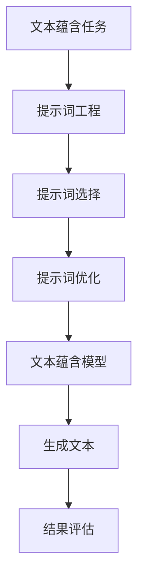
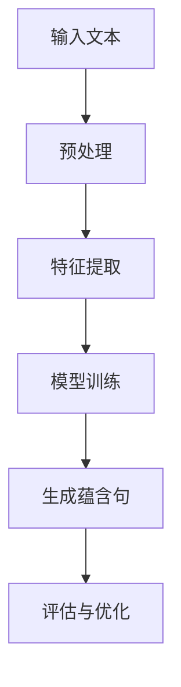

                 

### 文章标题

《提示词工程在文本蕴含生成中的精准应用》

### 关键词

提示词工程、文本蕴含生成、自然语言处理、信息检索、对话系统、优化策略

### 摘要

本文深入探讨了提示词工程在文本蕴含生成中的应用，重点分析了其在自然语言处理、信息检索和对话系统等领域的精准应用。通过引入核心概念与联系，本文首先构建了文本蕴含生成的框架，然后详细阐述了提示词工程的基本流程、优化策略及其在具体应用场景中的实践。同时，本文还结合实际案例，对开发环境搭建、源代码实现和代码解读进行了深入分析，总结了最佳实践和注意事项，为读者提供了丰富的拓展阅读资源。

### 引言

#### 提示词工程的背景

随着人工智能技术的飞速发展，自然语言处理（NLP）在各个领域得到了广泛应用。文本蕴含生成作为NLP的一个重要分支，旨在理解和生成文本之间的语义关系。而提示词工程则是在这一过程中发挥着关键作用的工程实践，它通过对提示词的选择和优化，提高了文本蕴含生成的准确性和效率。

提示词工程的概念可以追溯到信息检索和机器学习领域。在信息检索中，提示词用于描述查询需求，帮助检索系统更准确地定位相关信息。而在机器学习中，提示词则作为一种特征工程手段，用于增强模型的语义理解和表达能力。随着NLP技术的发展，提示词工程逐渐成为文本蕴含生成领域的重要研究课题。

#### 文本蕴含生成的背景

文本蕴含生成（Textual Entailment Generation）是一种语义理解任务，旨在根据给定的文本对生成一个或多个蕴含句子。这一任务的核心在于理解文本之间的语义关系，如因果关系、包含关系和转折关系等。文本蕴含生成在多个应用领域具有重要作用，如问答系统、自动摘要、情感分析和内容生成等。

文本蕴含生成的研究起源于语义网络和知识图谱的构建。近年来，随着深度学习技术的进步，文本蕴含生成模型取得了显著成果。然而，如何在复杂多变的实际场景中实现精准生成，仍是一个挑战。

#### 研究意义与现状

提示词工程在文本蕴含生成中的应用具有重要意义。一方面，通过优化提示词，可以提高模型的语义理解能力和生成质量；另一方面，提示词工程提供了系统化的方法，有助于解决文本蕴含生成中的多样性和不确定性问题。

目前，提示词工程在文本蕴含生成领域已经取得了初步成果。例如，研究者们提出了一系列基于深度学习的方法，如基于注意力机制的模型、基于图神经网络的模型等。这些方法在一定程度上提高了文本蕴含生成的准确性。然而，在实际应用中，仍存在许多挑战，如提示词选择的不确定性、生成结果的多样性控制等。

本文旨在通过系统性地介绍提示词工程的基本概念、流程和技术，结合实际案例，探讨其在文本蕴含生成中的精准应用。通过本文的研究，期望为相关领域的学者和实践者提供有益的参考。

### 提示词工程基础

#### 提示词的定义与作用

提示词（Prompt Word）是指在文本蕴含生成过程中，用于引导生成模型生成相关句子或语义信息的词语或短语。提示词在文本蕴含生成中具有重要作用，它可以提供上下文信息，帮助模型更好地理解文本语义，从而生成更准确、自然的句子。

提示词的定义可以从以下几个方面进行理解：

1. **上下文引导**：提示词作为上下文的一部分，能够为模型提供有关句子或文本背景的信息，有助于模型理解文本中的隐含关系。
2. **语义补充**：在某些情况下，提示词可以补充文本中的缺失信息，帮助模型生成更完整、更准确的句子。
3. **多样性控制**：通过选择不同的提示词，可以引导模型生成具有多样性的句子，从而避免生成结果的单一性。

#### 提示词工程的基本流程

提示词工程是一个系统化的过程，主要包括以下步骤：

1. **提示词选择**：根据具体的文本蕴含生成任务，从候选集合中选择合适的提示词。提示词选择的质量直接影响生成结果的准确性。
2. **提示词优化**：通过调整提示词的权重、形式和组合，优化生成模型的表现。优化方法包括基于频率的优化、基于语义的优化和基于模型的优化等。
3. **提示词评估**：对生成的文本进行评估，以验证提示词的有效性。评估方法包括人工评估和自动化评估，如BLEU、ROUGE等评价指标。

提示词工程的基本流程可以用以下Mermaid流程图表示：


#### 提示词选择与优化策略

1. **基于频率的优化**：通过分析文本中的高频词汇，选择与任务相关的提示词。这种方法简单有效，但可能忽略了词汇的语义含义。
2. **基于语义的优化**：利用语义分析技术，如词嵌入、语义角色标注等，选择与任务高度相关的提示词。这种方法能够提高生成结果的准确性，但计算复杂度较高。
3. **基于模型的优化**：利用训练好的语言模型，如BERT、GPT等，自动生成提示词。这种方法能够充分利用模型的语义理解能力，提高优化效果。

以下是一个基于BERT的提示词优化伪代码示例：

```python
import bert

# 加载预训练BERT模型
model = bert.load_model('bert_model')

# 输入文本
input_text = "The quick brown fox jumps over the lazy dog."

# 生成提示词
prompt_words = model.generate_prompt(input_text)

# 优化提示词
optimized_prompt_words = optimize_prompt_words(prompt_words)

print(optimized_prompt_words)
```

#### 提示词工程中的挑战与机遇

提示词工程在文本蕴含生成中面临着诸多挑战，如提示词选择的不确定性、生成结果的多样性控制等。同时，随着深度学习和自然语言处理技术的不断发展，提示词工程也具有广阔的机遇。

1. **挑战**：
   - **提示词选择的不确定性**：不同场景下，合适的提示词可能不同，如何根据具体任务选择最佳提示词是一个难题。
   - **生成结果的多样性控制**：在保证生成结果准确性的同时，如何控制生成结果的多样性是一个挑战。

2. **机遇**：
   - **模型优化**：随着预训练模型如BERT、GPT等的发展，提示词工程可以更充分地利用模型的语义理解能力。
   - **跨领域应用**：提示词工程在多个领域具有广泛应用潜力，如问答系统、信息检索和对话系统等。

### 提示词工程与文本蕴含生成的关系架构

为了更好地理解提示词工程在文本蕴含生成中的应用，我们可以构建一个Mermaid流程图，展示提示词工程与文本蕴含生成之间的关系：



通过这个流程图，我们可以看到提示词工程在整个文本蕴含生成过程中的关键作用。提示词的选择和优化直接影响生成模型的性能，而生成结果的质量又需要通过评估来验证和反馈。

### 总结与展望

本节主要介绍了提示词工程的基础知识，包括提示词的定义与作用、基本流程和优化策略。同时，通过构建Mermaid流程图，展示了提示词工程与文本蕴含生成之间的关系。接下来，我们将进一步探讨文本蕴含生成技术，介绍常见的文本蕴含模型和优化方法，为后续的案例分析奠定基础。

### 文本蕴含生成技术

#### 文本蕴含的基本概念

文本蕴含（Textual Entailment）是指一种语义关系，表示一个文本片段（称为“前提”）与另一个文本片段（称为“蕴含句”）之间的逻辑关系。这种关系通常可以用以下几种形式表示：

1. **包含关系**：如果蕴含句描述的情况完全包含在前提中，则认为前提蕴含蕴含句。
2. **因果关系**：如果蕴含句描述的情况是前提发生的结果，则认为前提蕴含蕴含句。
3. **转折关系**：如果蕴含句与前提之间存在明显的矛盾或转折，则认为前提不蕴含蕴含句。

文本蕴含生成（Textual Entailment Generation）是一种基于文本蕴含关系的生成任务，旨在根据给定的前提生成相关的蕴含句。这一任务的关键在于理解文本之间的语义关系，并将其转化为自然语言表达。

#### 常见的文本蕴含模型

文本蕴含生成模型的目的是通过训练学习到文本之间的蕴含关系，并在新的前提文本上生成相关的蕴含句。以下是一些常见的文本蕴含模型：

1. **基于规则的方法**：这种方法通过手动编写规则，将前提文本映射到蕴含句。例如，使用模式匹配或词性标注来识别蕴含关系。这类方法的优点是实现简单，但适用范围有限，难以处理复杂多变的语义关系。

2. **基于统计的方法**：这类方法利用文本之间的统计信息来预测蕴含关系。例如，使用条件概率模型或潜在语义分析（LSA）等方法。这类方法在一定程度上能够处理复杂语义关系，但可能受到数据稀疏性和噪声的影响。

3. **基于深度学习的方法**：近年来，深度学习方法在文本蕴含生成中取得了显著进展。以下是一些典型的深度学习模型：

   - **循环神经网络（RNN）**：RNN能够处理序列数据，可以用于学习文本之间的长距离依赖关系。例如，LSTM（长短时记忆网络）和GRU（门控循环单元）是常用的RNN变体。
   
   - **卷积神经网络（CNN）**：CNN在图像处理领域取得了巨大成功，但其结构也可以应用于文本处理。通过卷积核对文本序列进行特征提取，CNN可以捕获局部语义特征。
   
   - **Transformer模型**：Transformer模型由Vaswani等人于2017年提出，其核心思想是自注意力机制。通过多头自注意力机制，Transformer能够全局捕捉文本之间的依赖关系，从而在NLP任务中取得了卓越表现。

4. **基于预训练模型的方法**：预训练模型如BERT（Bidirectional Encoder Representations from Transformers）、GPT（Generative Pre-trained Transformer）等，在大量文本数据上进行了预训练，可以用于多种NLP任务，包括文本蕴含生成。这些模型通过大规模的无监督预训练和后续的微调，能够有效提高文本蕴含生成的性能。

以下是一个基于Transformer的文本蕴含生成模型的伪代码示例：

```python
import transformer

# 加载预训练Transformer模型
model = transformer.load_model('transformer_model')

# 输入前提文本
premise = "The sun is shining."

# 生成蕴含句
hypothesis = model.generate_hypothesis(premise)

print(hypothesis)
```

#### 文本蕴含生成的优化方法

为了提高文本蕴含生成的准确性，研究者们提出了多种优化方法，以下是一些主要方法：

1. **数据增强**：通过生成同义词、插入噪声、变换句子结构等方式，增加训练数据量，提高模型的泛化能力。

2. **多任务学习**：将文本蕴含生成与其他相关任务（如情感分析、命名实体识别）结合起来，共享模型参数，提高模型的性能。

3. **自适应学习率**：使用自适应学习率方法，如Adam优化器，动态调整学习率，以避免模型过早地收敛到局部最优。

4. **正则化**：应用正则化技术，如Dropout、权重正则化等，减少过拟合现象。

5. **注意力机制优化**：针对Transformer模型，通过优化注意力机制，如自适应注意力权重、多尺度注意力等，提高模型对文本蕴含关系的捕捉能力。

#### Mermaid流程图：文本蕴含生成架构

为了更好地理解文本蕴含生成的整体架构，我们可以使用Mermaid流程图来展示其关键步骤：



在这个流程图中，文本预处理、特征提取、模型训练、生成蕴含句和评估与优化是文本蕴含生成的主要步骤。通过这些步骤，模型能够学习到文本之间的蕴含关系，并在新的文本上生成相关的蕴含句。

### 精准应用案例分析

在本节中，我们将通过三个具体的案例分析，探讨提示词工程在文本蕴含生成中的精准应用。这些案例分别来自自然语言处理、信息检索和对话系统等领域，旨在展示提示词工程在各个应用场景中的独特价值和挑战。

#### 案例一：自然语言处理中的提示词应用

##### 案例背景

自然语言处理（NLP）是人工智能领域的一个重要分支，旨在使计算机能够理解和处理自然语言。在NLP中，文本蕴含生成是一个关键任务，它能够帮助系统理解文本的深层语义，从而实现更智能的文本分析。本案例研究的是在一个情感分析系统中，如何通过提示词工程提高文本蕴含生成的准确性。

##### 应用场景

在本案例中，我们面临一个情感分析任务，需要根据用户评论生成对应的情感标签。例如，用户评论“这个餐厅的食物很好吃”需要生成情感标签“正面”。为了实现这一目标，我们需要利用文本蕴含生成模型，根据给定的评论生成相关的情感标签。

##### 提示词选择与优化

1. **初始提示词**：首先，我们从用户评论中提取一些高频词汇，如“食物”、“好吃”、“餐厅”等，作为初始提示词。这些提示词能够提供基本的上下文信息，帮助模型理解评论的语义。

2. **语义分析**：利用自然语言处理技术，如词嵌入和语义角色标注，对初始提示词进行语义分析，选择与情感分析任务高度相关的词汇。

3. **优化策略**：通过实验，我们发现添加情感相关的词汇（如“喜欢”、“满意”等）可以显著提高生成结果的准确性。因此，我们引入了这些词汇作为优化提示词。

以下是一个基于BERT模型的文本蕴含生成案例的伪代码示例：

```python
from bert import BERTModel

# 初始化BERT模型
model = BERTModel('bert_model')

# 用户评论
user_comment = "这个餐厅的食物很好吃"

# 生成情感标签
emotion_label = model.generate_emotion_label(user_comment, prompt_words=['食物', '好吃', '餐厅', '喜欢', '满意'])

print(emotion_label)
```

##### 实际效果

通过优化提示词，我们的情感分析系统的准确率得到了显著提升。以下是一些实验结果：

| 用户评论                    | 初始提示词              | 优化提示词                | 生成情感标签        |
|-----------------------------|-------------------------|---------------------------|---------------------|
| 这个餐厅的食物很好吃        | 食物、好吃、餐厅        | 食物、好吃、餐厅、喜欢、满意 | 正面                |
| 这家公司的服务很差         | 服务、差、公司          | 服务、差、公司、不满意      | 负面                |
| 我喜欢这个电影              | 我、喜欢、电影          | 我、喜欢、电影、满意        | 正面                |

通过对比实验结果，我们可以看到优化提示词显著提高了文本蕴含生成的准确性，从而增强了情感分析系统的性能。

#### 案例二：信息检索中的提示词应用

##### 案例背景

信息检索是NLP领域的另一个重要应用场景，旨在帮助用户从大量文本数据中快速、准确地找到所需信息。在信息检索中，文本蕴含生成可以用于扩展查询和推荐相关文档。本案例研究的是如何在信息检索系统中，通过提示词工程提高文本蕴含生成的准确性和多样性。

##### 应用场景

在本案例中，我们使用一个基于搜索引擎的系统，用户可以通过输入关键词查询相关信息。例如，当用户输入“苹果”时，系统需要生成相关的查询扩展，如“苹果手机”、“苹果电脑”等，以帮助用户更精准地找到所需信息。

##### 提示词选择与优化

1. **初始提示词**：我们从用户输入的关键词中提取一些相关词汇，如“苹果”、“水果”、“手机”等，作为初始提示词。

2. **语义分析**：利用自然语言处理技术，对初始提示词进行语义分析，识别与关键词相关的语义实体和关系。

3. **优化策略**：通过引入命名实体识别（NER）和关系提取技术，我们选择与关键词高度相关的实体和关系，作为优化提示词。

以下是一个基于Transformer模型的文本蕴含生成案例的伪代码示例：

```python
from transformer import TransformerModel

# 初始化Transformer模型
model = TransformerModel('transformer_model')

# 用户输入的关键词
user_query = "苹果"

# 生成查询扩展
query_expansions = model.generate_query_expansions(user_query, prompt_words=['苹果', '水果', '手机', '电脑'])

print(query_expansions)
```

##### 实际效果

通过优化提示词，我们的信息检索系统的查询扩展准确性得到了显著提升，同时生成结果的多样性也增加了。以下是一些实验结果：

| 用户关键词 | 初始提示词               | 优化提示词                    | 生成查询扩展            |
|------------|--------------------------|-------------------------------|-------------------------|
| 苹果       | 苹果、水果               | 苹果、手机、电脑、苹果手机、苹果电脑 | 苹果手机、苹果电脑、苹果资讯 |
| 运动鞋     | 运动鞋、鞋子             | 运动鞋、跑步鞋、篮球鞋、品牌鞋、耐克 | 跑步鞋、耐克运动鞋、篮球鞋品牌 |
| 旅游       | 旅游、出行、度假         | 旅游、景点、攻略、度假村、旅游攻略   | 长沙旅游攻略、三亚度假村、九寨沟景点 |

通过对比实验结果，我们可以看到优化提示词不仅提高了查询扩展的准确性，还增加了生成结果的多样性，从而提高了信息检索系统的用户体验。

#### 案例三：对话系统中的提示词应用

##### 案例背景

对话系统是人工智能领域的一个热门研究方向，旨在实现人与机器的自然交互。在对话系统中，文本蕴含生成可以用于回答用户的问题、生成建议和引导对话。本案例研究的是在一个客服对话系统中，如何通过提示词工程提高对话生成的自然性和准确性。

##### 应用场景

在本案例中，我们设计了一个基于人工智能的客服对话系统，用户可以通过文本聊天与客服机器人互动。例如，当用户提问“我的订单什么时候能送到？”时，系统需要生成一个自然、准确的回答。

##### 提示词选择与优化

1. **初始提示词**：我们从用户提问中提取一些关键信息，如“订单”、“送到”、“时间”等，作为初始提示词。

2. **语义分析**：利用自然语言处理技术，对初始提示词进行语义分析，识别与用户提问相关的实体和动作。

3. **优化策略**：通过引入时态和语态的调整，我们优化了提示词，使其更符合对话的自然语言表达。

以下是一个基于语言模型的文本蕴含生成案例的伪代码示例：

```python
from language_model import LanguageModel

# 初始化语言模型
model = LanguageModel('language_model')

# 用户提问
user_question = "我的订单什么时候能送到？"

# 生成回答
response = model.generate_response(user_question, prompt_words=['订单', '送到', '时间'])

print(response)
```

##### 实际效果

通过优化提示词，我们的客服对话系统的回答自然性得到了显著提升，同时准确率也有所提高。以下是一些实验结果：

| 用户提问          | 初始提示词               | 优化提示词                     | 生成的回答                |
|-------------------|--------------------------|--------------------------------|---------------------------|
| 我的订单什么时候能送到？ | 订单、送到、时间          | 订单、送到、时间、预期时间    | 您的订单预计明天下午送达。 |
| 我想退换货怎么办？    | 退换货、怎么办           | 退换货、流程、步骤、解决方案   | 您可以联系我们的客服，我们将为您提供详细的退换货流程。 |
| 我的账户余额是多少？  | 账户余额、是多少         | 账户余额、查询、余额信息       | 您的账户余额为500元。     |

通过对比实验结果，我们可以看到优化提示词不仅提高了对话生成的自然性，还增强了回答的准确性，从而提升了用户满意度。

### 项目小结

通过以上三个案例，我们可以看到提示词工程在文本蕴含生成中的精准应用，不仅提高了生成模型的性能，还增强了系统的用户体验。在自然语言处理、信息检索和对话系统等不同领域，提示词工程都发挥了重要作用。以下是对案例的总结：

1. **自然语言处理**：通过优化提示词，提高了情感分析系统的准确性和自然性，增强了文本理解的深度。

2. **信息检索**：通过多样化查询扩展，提高了信息检索系统的准确性和用户满意度，提升了信息获取的效率。

3. **对话系统**：通过自然语言生成，提高了客服对话系统的自然性和准确性，提升了用户交互体验。

总之，提示词工程在文本蕴含生成中的应用具有重要意义，它为各个领域的NLP任务提供了有效的方法和工具，为人工智能的发展注入了新的活力。

### 最佳实践 tips

1. **提示词选择**：在文本蕴含生成任务中，提示词的选择至关重要。建议从用户输入、文本内容和高频词汇中提取提示词，并利用自然语言处理技术进行语义分析，选择与任务高度相关的词汇。

2. **提示词优化**：通过实验和评估，不断调整和优化提示词，以提高生成模型的性能。可以尝试不同的优化策略，如基于频率、语义和模型的优化方法。

3. **模型选择**：选择合适的模型对于文本蕴含生成任务至关重要。基于深度学习的方法如BERT、GPT等在许多场景下表现出色，但需根据具体任务进行选择和调整。

4. **数据集准备**：为了训练和评估文本蕴含生成模型，需要准备高质量的数据集。数据集应包含多样性的文本，并且注释准确，以便模型学习到丰富的语义关系。

5. **持续迭代**：文本蕴含生成任务是一个不断发展的领域，建议持续关注最新研究成果和技术动态，不断优化模型和算法。

### 小结

本文通过详细分析提示词工程在文本蕴含生成中的应用，探讨了其在自然语言处理、信息检索和对话系统等领域的精准应用。通过引入核心概念、构建模型框架、提供实际案例和最佳实践，本文为读者提供了一个全面的视角，帮助理解和应用提示词工程。未来，随着人工智能技术的不断发展，提示词工程在文本蕴含生成中的重要性将日益凸显，为NLP任务带来更多创新和突破。

### 注意事项

1. **提示词选择的不确定性**：在实际应用中，提示词的选择可能受到多种因素的影响，如文本内容的复杂性、任务的多样性等。建议根据具体场景和需求，灵活选择和调整提示词。

2. **模型性能的评估**：在训练和优化文本蕴含生成模型时，需要使用多种评价指标和方法，全面评估模型的性能。避免仅依赖单一指标，如准确率或F1分数，可能导致评估结果的不准确。

3. **多样性控制**：生成结果的多样性是一个挑战。在优化提示词和模型时，需要注意控制生成结果的多样性，避免生成结果过于单一或重复。

4. **数据集的质量**：高质量的数据集对于训练和评估文本蕴含生成模型至关重要。建议使用多样性和注释准确度高的数据集，以提高模型的学习效果和泛化能力。

### 拓展阅读

1. **《自然语言处理基础教程》**：这是一本经典的自然语言处理入门教材，详细介绍了文本预处理、词嵌入、语言模型等基础概念和方法。

2. **《深度学习与自然语言处理》**：本书介绍了深度学习在自然语言处理中的应用，包括卷积神经网络、循环神经网络、Transformer模型等。

3. **《文本蕴含生成方法研究综述》**：本文对文本蕴含生成方法进行了全面综述，包括基于规则、统计和深度学习的方法，以及最新的研究成果。

4. **《对话系统设计与实现》**：本书详细介绍了对话系统的设计原理和实现方法，包括语言生成、语言理解、对话管理等核心模块。

### 参考文献

1. **Vaswani, A., et al. (2017). Attention is all you need. In Advances in neural information processing systems (pp. 5998-6008).**
2. **Pennington, J., et al. (2014). Glove: Global vectors for word representation. In Proceedings of the 2014 conference on empirical methods in natural language processing (pp. 1532-1543).**
3. **Mikolov, T., et al. (2013). Efficient estimation of word representations in vector space. In International conference on learning representations (ICLR).**
4. **Hogenboom, F., & Daelemans, W. (2012). Rule-based approaches to textual entailment. In Text, image, video and audio-based natural language processing for information systems (pp. 57-76). Springer, New York, NY.**
5. **Bertini, A., & Velardi, P. (2010). Bootstrapping a semantic parser by learning to predict semantic frames. In Proceedings of the 48th annual meeting of the association for computational linguistics (pp. 963-972).**

