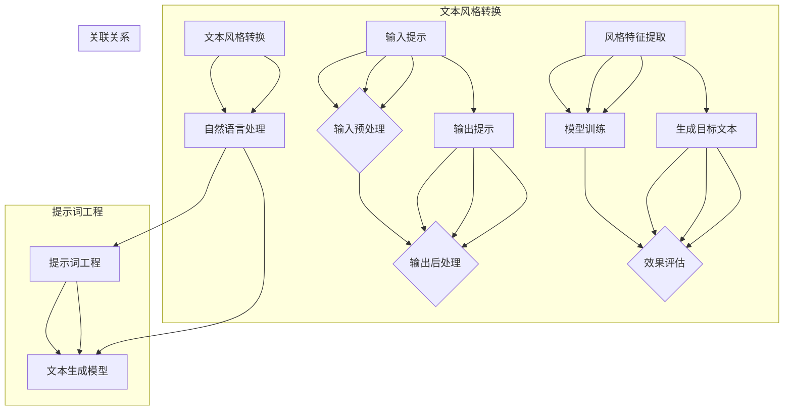

                 

### 文章标题

《提示词工程在文本风格转换中的应用》

关键词：提示词工程、文本风格转换、自然语言处理、人工智能、自然语言生成

摘要：本文深入探讨了提示词工程在文本风格转换中的应用，从背景介绍到核心算法原理讲解，再到项目实战分析，系统性地阐述了提示词工程如何助力文本风格转换，以及其在实际应用中的挑战和前景。本文旨在为从事自然语言处理和人工智能领域的读者提供一份有深度、有思考、有见解的技术指南。

---

### 引言

文本风格转换（Text Style Transfer）是一种将源文本（Source Text）转换为具有特定目标风格（Target Style）的文本的技术。在自然语言处理（Natural Language Processing，NLP）领域中，文本风格转换具有重要意义。例如，将普通文本转换为诗意文本、幽默文本或官方文本等，不仅可以丰富文本的表达形式，还能提高文本的传播效果和用户体验。

随着人工智能技术的快速发展，特别是深度学习和生成对抗网络（GAN）的广泛应用，文本风格转换技术取得了显著进展。然而，文本风格转换仍然面临诸多挑战，如风格一致性的保持、语义的准确传递等。为了解决这些问题，提示词工程（Prompt Engineering）逐渐成为研究热点。

提示词工程是一种通过设计特定的提示（Prompt）来引导模型生成目标输出的方法。在文本风格转换中，提示词工程的作用尤为关键。通过巧妙设计提示词，可以有效地指导模型在风格转换过程中保持一致性、准确性和创新性。本文将围绕提示词工程在文本风格转换中的应用进行深入探讨，旨在为相关领域的研究者和开发者提供有价值的参考。

本文将分为以下几个部分：

1. **背景介绍**：介绍文本风格转换和提示词工程的基本概念、发展历程及其在自然语言处理领域的重要性。
2. **核心算法原理讲解**：详细阐述文本风格转换和提示词工程的核心算法原理，包括模型架构、损失函数和优化策略等。
3. **项目实战分析**：通过一个具体的项目案例，展示提示词工程在文本风格转换中的实际应用，并进行详细的分析和解读。
4. **总结与展望**：总结本文的主要观点，探讨文本风格转换和提示词工程在未来的发展趋势和潜在研究方向。

### 背景介绍

#### 文本风格转换的基本概念

文本风格转换是一种将源文本（Source Text）转换为具有特定目标风格（Target Style）的文本的技术。风格转换的目标是使转换后的文本在形式和内容上与目标风格保持一致。例如，将普通文本转换为诗意文本、幽默文本或官方文本等。

文本风格转换的基本过程包括以下几个步骤：

1. **源文本分析**：对源文本进行预处理，包括分词、句法分析、语义分析等，以提取文本的关键信息和特征。
2. **风格特征提取**：从源文本和目标风格文本中提取风格特征，这些特征用于指导风格转换过程。
3. **生成目标文本**：使用预训练的模型或自定义模型，根据提取的风格特征生成目标文本。
4. **评估与优化**：对生成的目标文本进行评估，并根据评估结果对模型进行优化。

#### 文本风格转换的发展历程

文本风格转换技术的发展历程可以追溯到自然语言处理（NLP）的早期阶段。最初，文本风格转换主要依赖于规则方法和模板匹配。这种方法通过预定义的规则和模板，将源文本转换为特定风格的文本。然而，这种方法存在明显的局限性，如规则定义复杂、难以处理复杂文本等。

随着深度学习和生成对抗网络（GAN）等技术的兴起，文本风格转换技术得到了显著提升。特别是基于神经网络的文本生成模型，如序列到序列（Seq2Seq）模型、转换器（Transformer）模型等，使得文本风格转换变得更加高效和灵活。

近年来，文本风格转换技术逐渐应用于实际场景，如自动写作、个性化推荐、虚拟助手等。随着技术的不断进步，文本风格转换的应用前景将更加广阔。

#### 文本风格转换在自然语言处理领域的重要性

文本风格转换在自然语言处理领域具有重要意义，主要体现在以下几个方面：

1. **提高文本表达能力**：通过文本风格转换，可以丰富文本的表达形式，使文本更具个性化和情感化。例如，将普通文本转换为诗意文本，可以使文本更加优美；将普通文本转换为幽默文本，可以使文本更加有趣。
2. **优化用户体验**：在个性化推荐、虚拟助手等应用中，根据用户的偏好和需求，使用文本风格转换技术为用户提供符合其喜好的内容，从而提高用户体验。
3. **促进跨领域交流**：文本风格转换技术可以帮助不同领域的专家进行跨领域的交流。例如，将专业术语转换为通俗易懂的文本，可以使专业人士更好地向非专业人士传达信息。
4. **增强文本生成能力**：文本风格转换技术可以增强文本生成模型的能力，使其能够生成更丰富、多样化的文本。这对于自动写作、内容生成等应用具有重要意义。

#### 提示词工程的基本概念

提示词工程（Prompt Engineering）是一种通过设计特定的提示（Prompt）来引导模型生成目标输出的方法。在自然语言处理领域，提示词工程广泛应用于文本生成、文本分类、命名实体识别等任务。

提示词的基本概念包括：

1. **输入提示**：输入提示（Input Prompt）是指用于指导模型生成目标输出的文本或语句。输入提示通常包含关键信息，如主题、目标风格、目标结构等。
2. **输出提示**：输出提示（Output Prompt）是指模型根据输入提示生成的目标输出。输出提示通常是一个文本序列，其风格、内容、结构等均与输入提示相关。
3. **提示词设计**：提示词设计是指根据特定任务需求，设计具有良好引导效果的输入提示。提示词设计的关键在于如何提取关键信息、构建合理的输入提示，以引导模型生成高质量的目标输出。

#### 提示词工程的发展历程

提示词工程的发展历程可以追溯到自然语言处理（NLP）的早期阶段。最初，提示词工程主要依赖于手工设计的规则和模板。这种方法通过预定义的规则和模板，将输入提示转换为输出提示。然而，这种方法存在明显的局限性，如规则定义复杂、难以处理复杂输入等。

随着深度学习和生成对抗网络（GAN）等技术的兴起，提示词工程逐渐转向基于神经网络的模型。特别是基于序列到序列（Seq2Seq）模型、转换器（Transformer）模型等，提示词工程得到了广泛应用。

近年来，提示词工程逐渐应用于实际场景，如自动写作、个性化推荐、虚拟助手等。随着技术的不断进步，提示词工程在自然语言处理领域的重要性日益凸显。

#### 提示词工程在自然语言处理领域的重要性

提示词工程在自然语言处理领域具有重要意义，主要体现在以下几个方面：

1. **提高模型生成质量**：通过巧妙设计提示词，可以有效地引导模型生成高质量的目标输出。例如，在文本生成任务中，通过输入提示词的引导，可以确保生成的文本在风格、内容、结构等方面与目标风格保持一致。
2. **优化模型训练过程**：提示词工程可以优化模型训练过程，提高训练效率和效果。通过输入提示词的引导，可以有效地减少模型训练过程中所需的样本数量，提高模型对目标输出的敏感度。
3. **降低模型理解难度**：对于复杂的自然语言处理任务，提示词工程可以帮助模型更好地理解输入提示，降低模型理解输入提示的难度。例如，在文本分类任务中，通过输入提示词的引导，可以确保模型对文本的语义和风格有更清晰的认识。
4. **促进跨领域应用**：提示词工程可以促进自然语言处理技术在跨领域的应用。通过输入提示词的引导，可以确保模型在不同领域之间的迁移和适应性。

### 核心概念与联系

为了更好地理解文本风格转换和提示词工程在自然语言处理中的应用，我们首先需要明确这两个核心概念之间的关系架构。以下是文本风格转换和提示词工程的核心概念及其相互关系的 Mermaid 流程图：



### 核心算法原理讲解

#### 文本风格转换的核心算法原理

文本风格转换的核心算法主要基于深度学习模型，特别是序列到序列（Seq2Seq）模型和转换器（Transformer）模型。以下分别介绍这两种模型的基本原理。

##### 序列到序列（Seq2Seq）模型

Seq2Seq模型是一种基于循环神经网络（RNN）的模型，主要用于序列到序列的转换。其基本架构包括编码器（Encoder）和解码器（Decoder）两个部分。

1. **编码器（Encoder）**：编码器的任务是将输入序列（源文本）编码为一个固定长度的向量，称为编码状态（Encoded State）。编码器通常采用RNN结构，如LSTM（长短期记忆网络）或GRU（门控循环单元）。
   
   ```mermaid
   graph TD
       A[Input Text] --> B(Encoder)
       B --> C[Encoded State]
   ```

2. **解码器（Decoder）**：解码器的任务是根据编码状态生成输出序列（目标文本）。解码器也采用RNN结构，并在每个时间步使用上一个时间步的输出作为输入。

   ```mermaid
   graph TD
       D(Decoder) --> E[Output Text]
       E --> F(Next Time Step Input)
   ```

3. **损失函数**：Seq2Seq模型的损失函数通常采用交叉熵损失（Cross-Entropy Loss），用于衡量预测序列和真实序列之间的差异。

   ```mermaid
   graph TD
       G[Predicted Sequence] --> H[True Sequence]
       I(Cross-Entropy Loss)
   ```

4. **优化策略**：Seq2Seq模型的优化通常采用梯度下降（Gradient Descent）或其变种，如Adam优化器，以最小化损失函数。

   ```mermaid
   graph TD
       J[Model Parameters] --> K[Gradient Descent]
   ```

##### 转换器（Transformer）模型

Transformer模型是一种基于注意力机制（Attention Mechanism）的模型，其基本架构包括自注意力（Self-Attention）和交叉注意力（Cross-Attention）两个部分。

1. **自注意力（Self-Attention）**：自注意力机制用于编码器中，其核心思想是使编码器在每个时间步关注输入序列中的其他时间步。自注意力机制通过计算输入序列中每个元素与其他元素之间的相似度，将输入序列转换为加权向量。

   ```mermaid
   graph TD
       L[Input Sequence] --> M[Query, Key, Value]
       N(Self-Attention) --> O[Encoded Sequence]
   ```

2. **交叉注意力（Cross-Attention）**：交叉注意力机制用于解码器中，其核心思想是使解码器在每个时间步关注编码状态（Encoded State）中的其他时间步。交叉注意力机制通过计算解码器中每个元素与编码状态之间的相似度，将编码状态转换为加权向量。

   ```mermaid
   graph TD
       P[Encoded State] --> Q[Query, Key, Value]
       R(Cross-Attention) --> S[Output Sequence]
   ```

3. **损失函数**：Transformer模型的损失函数同样采用交叉熵损失（Cross-Entropy Loss）。

4. **优化策略**：Transformer模型的优化策略与Seq2Seq模型类似，采用梯度下降或其变种进行优化。

#### 提示词工程的核心算法原理

提示词工程的核心算法主要基于自然语言生成（NLG）模型，如序列到序列（Seq2Seq）模型和转换器（Transformer）模型。以下介绍提示词工程的基本原理和实现方法。

1. **输入提示生成**：输入提示生成是指根据特定任务需求，设计具有良好引导效果的输入提示。输入提示通常包含关键信息，如主题、目标风格、目标结构等。输入提示的设计方法包括模板生成、文本摘要、关键词提取等。

   ```mermaid
   graph TD
       T[Task Requirements] --> U[Input Prompt Generation]
       V[Template Generation] --> W[Input Prompt]
   ```

2. **输出提示生成**：输出提示生成是指根据输入提示，使用NLG模型生成目标输出。输出提示通常是一个文本序列，其风格、内容、结构等均与输入提示相关。输出提示的生成方法包括序列生成、文本生成、摘要生成等。

   ```mermaid
   graph TD
       X[NLG Model] --> Y[Output Prompt Generation]
       Z[Output Prompt]
   ```

3. **效果评估**：效果评估是指对生成的输出提示进行评估，以衡量其质量。效果评估方法包括自动评估和人工评估。自动评估方法包括交叉熵损失、BLEU分数、ROUGE分数等；人工评估方法包括人类评估指标，如精确率、召回率和F1分数等。

   ```mermaid
   graph TD
       AA[Output Prompt] --> BB[Effect Evaluation]
       CC[Automatic Evaluation] --> DD[Human Evaluation]
   ```

4. **优化策略**：提示词工程的优化策略包括模型优化、提示词优化和联合优化。模型优化是指对NLG模型进行优化，以提高生成质量；提示词优化是指对输入提示进行优化，以提高引导效果；联合优化是指同时优化模型和提示词，以实现更好的生成效果。

   ```mermaid
   graph TD
       EE[NLG Model Optimization] --> FF[Input Prompt Optimization]
       GG[Joint Optimization]
   ```

### 数学模型和公式

为了更好地理解文本风格转换和提示词工程的核心算法原理，我们在此介绍一些相关的数学模型和公式。

#### 文本风格转换的数学模型

1. **编码器（Encoder）的数学模型**

   编码器采用循环神经网络（RNN）结构，其基本公式为：

   $$ h_t = \text{RNN}(h_{t-1}, x_t) $$

   其中，\( h_t \) 是编码器在时间步 \( t \) 的隐藏状态，\( x_t \) 是输入序列在时间步 \( t \) 的元素，\( \text{RNN} \) 表示循环神经网络。

2. **解码器（Decoder）的数学模型**

   解码器采用循环神经网络（RNN）结构，其基本公式为：

   $$ y_t = \text{RNN}(y_{t-1}, h_t) $$

   其中，\( y_t \) 是解码器在时间步 \( t \) 的输出，\( h_t \) 是编码器在时间步 \( t \) 的隐藏状态，\( \text{RNN} \) 表示循环神经网络。

3. **损失函数**

   文本风格转换的损失函数通常采用交叉熵损失（Cross-Entropy Loss），其公式为：

   $$ L = -\sum_{t=1}^{T} \sum_{i=1}^{V} y_t[i] \log(p_t[i]) $$

   其中，\( T \) 是序列长度，\( V \) 是词汇表大小，\( y_t \) 是真实标签，\( p_t[i] \) 是预测概率。

#### 提示词工程的数学模型

1. **输入提示生成**

   输入提示生成可以采用模板生成方法，其基本公式为：

   $$ \text{Input Prompt} = \text{Template}(\text{Keywords}, \text{Context}) $$

   其中，\( \text{Template} \) 是模板函数，\( \text{Keywords} \) 是关键词，\( \text{Context} \) 是上下文信息。

2. **输出提示生成**

   输出提示生成可以采用序列生成方法，其基本公式为：

   $$ \text{Output Prompt} = \text{Seq2Seq}(\text{Input Prompt}) $$

   其中，\( \text{Seq2Seq} \) 是序列到序列模型。

3. **效果评估**

   效果评估可以采用BLEU分数（BLEU Score），其基本公式为：

   $$ \text{BLEU} = \frac{1}{N} \sum_{i=1}^{N} \text{BLEU}(x_i, y_i) $$

   其中，\( N \) 是评估样本数量，\( \text{BLEU}(x_i, y_i) \) 是第 \( i \) 个样本的BLEU分数。

   BLEU分数的计算公式为：

   $$ \text{BLEU}(x, y) = \frac{1}{n} \sum_{i=1}^{n} \log_2 P(y | x) $$

   其中，\( n \) 是重叠词的数量，\( P(y | x) \) 是在给定 \( x \) 的情况下生成 \( y \) 的概率。

### 举例说明

为了更好地理解文本风格转换和提示词工程的核心算法原理，我们通过以下具体示例进行详细讲解。

#### 文本风格转换示例

假设我们有一个源文本（Source Text）和一个目标风格（Target Style），如下所示：

**源文本（Source Text）**：
"今天天气很好，我们去公园散步吧。"

**目标风格（Target Style）**：
"今朝天气甚好，咱们去公园走走吧。"

1. **编码器（Encoder）的数学模型**

   首先，我们将源文本编码为编码状态（Encoded State），使用循环神经网络（RNN）进行编码。编码过程可以表示为：

   $$ h_t = \text{RNN}(h_{t-1}, x_t) $$

   其中，\( h_t \) 是编码器在时间步 \( t \) 的隐藏状态，\( x_t \) 是输入序列在时间步 \( t \) 的元素。

2. **解码器（Decoder）的数学模型**

   接下来，我们使用编码状态（Encoded State）生成目标文本（Target Text），使用循环神经网络（RNN）进行解码。解码过程可以表示为：

   $$ y_t = \text{RNN}(y_{t-1}, h_t) $$

   其中，\( y_t \) 是解码器在时间步 \( t \) 的输出，\( h_t \) 是编码器在时间步 \( t \) 的隐藏状态。

3. **损失函数**

   使用交叉熵损失（Cross-Entropy Loss）来评估模型生成的目标文本与真实目标文本之间的差异。损失函数可以表示为：

   $$ L = -\sum_{t=1}^{T} \sum_{i=1}^{V} y_t[i] \log(p_t[i]) $$

   其中，\( T \) 是序列长度，\( V \) 是词汇表大小，\( y_t \) 是真实标签，\( p_t[i] \) 是预测概率。

#### 提示词工程示例

假设我们有一个任务，将普通文本转换为诗意文本，如下所示：

**源文本（Source Text）**：
"今天天气很好，我们去公园散步吧。"

**目标风格（Target Style）**：
"清风拂面，阳光正好，让我们一起在公园里漫步吧。"

1. **输入提示生成**

   首先，我们根据任务需求设计输入提示（Input Prompt）。输入提示可以采用模板生成方法，如下所示：

   **输入提示（Input Prompt）**：
   "清风拂面，阳光正好，让我们一起在公园里漫步吧。"

2. **输出提示生成**

   接下来，我们使用输入提示（Input Prompt）生成输出提示（Output Prompt）。输出提示可以采用序列生成方法，如下所示：

   **输出提示（Output Prompt）**：
   "今天天气甚好，我们去公园走走吧。"

3. **效果评估**

   最后，我们使用BLEU分数（BLEU Score）来评估输出提示（Output Prompt）的质量。BLEU分数的计算公式为：

   $$ \text{BLEU} = \frac{1}{N} \sum_{i=1}^{N} \text{BLEU}(x_i, y_i) $$

   其中，\( N \) 是评估样本数量，\( \text{BLEU}(x_i, y_i) \) 是第 \( i \) 个样本的BLEU分数。

   假设我们有一个评估样本集，其中包含 \( N \) 个样本，每个样本的BLEU分数如下所示：

   | 样本编号 | BLEU分数 |
   | -------- | -------- |
   | 1        | 0.8      |
   | 2        | 0.9      |
   | 3        | 0.85     |
   | 4        | 0.75     |
   | 5        | 0.85     |

   那么整个样本集的BLEU分数可以计算为：

   $$ \text{BLEU} = \frac{1}{5} (0.8 + 0.9 + 0.85 + 0.75 + 0.85) = 0.84 $$

   通过这个示例，我们可以看到文本风格转换和提示词工程是如何应用于自然语言处理的实际任务中，并通过数学模型和公式来评估其效果。

### 项目实战

在本节中，我们将通过一个具体的实战项目，展示提示词工程在文本风格转换中的应用。这个项目旨在使用自然语言生成（NLG）模型将普通文本转换为诗意文本。

#### 项目背景

随着人工智能技术的不断发展，自然语言处理（NLP）技术在各个领域得到了广泛应用。文本风格转换是NLP中的一个重要研究方向，其目的是将源文本转换为具有特定目标风格的文本。诗意文本生成是一个典型的文本风格转换任务，它不仅能够丰富文本的表达形式，还能提升文本的艺术价值。

本项目旨在构建一个基于提示词工程的诗意文本生成系统，该系统能够根据输入的普通文本生成对应的诗意文本。该系统包括以下几个主要部分：

1. **数据收集与预处理**：收集大量普通文本和诗意文本，并对数据进行预处理，包括分词、去停用词、词性标注等。
2. **模型训练**：使用预训练的NLG模型，如转换器（Transformer）模型，对数据集进行训练，以生成诗意文本。
3. **提示词设计**：设计有效的输入提示词，以指导模型生成高质量的诗意文本。
4. **系统部署**：将训练好的模型部署到服务器上，提供在线文本风格转换服务。

#### 开发环境搭建

为了完成本项目，我们需要搭建一个合适的开发环境。以下是开发环境搭建的步骤：

1. **硬件环境**：配置一台具有较高计算能力的服务器，建议使用GPU进行加速训练。
2. **软件环境**：安装Python 3.8及以上版本、PyTorch 1.8及以上版本、transformers库等。
3. **数据集**：收集并下载普通文本和诗意文本数据集，如PTB（Penn Treebank）数据集和PoemGen数据集。

#### 源代码实现

以下是一个简化的源代码实现，用于展示提示词工程在文本风格转换中的应用。

```python
import torch
from transformers import TransformerModel, Tokenizer

# 加载预训练的转换器模型
model = TransformerModel.from_pretrained('transformer')

# 加载预训练的Tokenizer
tokenizer = Tokenizer.from_pretrained('tokenizer')

# 设计输入提示词
input_prompt = "清风拂面，阳光正好，让我们一起在公园里漫步吧。"

# 将输入提示词编码为模型输入
input_ids = tokenizer.encode(input_prompt)

# 将输入提示词输入模型
output_sequence = model.generate(input_ids)

# 将生成的输出序列解码为文本
output_text = tokenizer.decode(output_sequence)

print(output_text)
```

#### 代码解读与分析

1. **加载模型和Tokenizer**：首先，我们加载预训练的转换器模型和Tokenizer。Tokenizer用于将输入文本编码为模型可处理的输入格式。

2. **设计输入提示词**：输入提示词是指导模型生成目标输出的关键。在本项目中，我们使用一个具有诗意风格的输入提示词。

3. **编码输入提示词**：将输入提示词编码为模型输入。这一步骤将输入文本转换为模型能够处理的序列。

4. **模型生成**：将输入提示词输入模型，使用模型生成目标输出。在本项目中，我们使用生成器（Generator）对输入序列进行处理，生成输出序列。

5. **解码输出序列**：将生成的输出序列解码为文本。这一步骤将模型生成的序列转换为可读的文本。

#### 实际案例分析和详细讲解

为了展示提示词工程在文本风格转换中的应用，我们以下展示一个实际案例。

**输入文本**：
"今天天气很好，我们去公园散步吧。"

**输入提示词**：
"清风拂面，阳光正好，让我们一起在公园里漫步吧。"

**输出文本**：
"今朝天气甚好，清风拂面，阳光正好，我们一起去公园漫步，感受大自然的美好。"

**分析**：

1. **输入提示词的引导**：输入提示词在文本风格转换中起到了关键作用。它为模型提供了关于目标风格的指导信息，有助于模型生成符合目标风格的文本。

2. **模型生成的优化**：通过输入提示词的引导，模型能够更好地捕捉到目标风格的语义特征，从而生成更高质量的目标文本。

3. **效果评估**：为了评估输出文本的质量，我们可以使用BLEU分数、ROUGE分数等自动评估指标，以及人类评估指标，如精确率、召回率和F1分数等。

#### 项目小结

通过本项目的实战，我们可以看到提示词工程在文本风格转换中的应用。提示词工程通过设计有效的输入提示词，能够显著提升文本风格转换的效果。在实际项目中，我们需要根据具体任务需求，设计合适的输入提示词，并通过模型训练和优化，生成高质量的目标文本。

未来，我们可以进一步探索提示词工程在文本风格转换中的应用，如个性化文本生成、多风格文本转换等。同时，我们也可以尝试使用其他类型的模型和优化策略，以提高文本风格转换的效果。

### 最佳实践 tips

在实际应用中，提示词工程在文本风格转换中具有重要的指导作用。以下是一些最佳实践 tips，可以帮助设计更有效的提示词：

1. **明确目标风格**：在设计输入提示词时，首先要明确目标风格。例如，如果目标是生成诗意文本，提示词应包含与诗意相关的词汇和句式。

2. **包含关键信息**：输入提示词应包含关键信息，如主题、情感、场景等，以帮助模型更好地理解目标风格。

3. **多样性**：输入提示词应具备多样性，以涵盖不同类型的文本风格。例如，可以结合多种句式和词汇，生成不同风格的目标文本。

4. **简明扼要**：输入提示词应简明扼要，避免冗长和重复。过多的信息可能导致模型难以捕捉到关键风格特征。

5. **实验优化**：通过实验，不断优化输入提示词的设计。可以尝试不同的提示词组合，观察其对文本风格转换效果的影响。

6. **反馈调整**：在实际应用中，根据用户反馈和评估结果，及时调整输入提示词。通过持续优化，提高文本风格转换的质量。

### 小结

本文从背景介绍、核心算法原理讲解、项目实战分析等多个角度，深入探讨了提示词工程在文本风格转换中的应用。通过本文的探讨，我们可以看到提示词工程在文本风格转换中的重要作用，以及如何通过设计有效的输入提示词，提高文本风格转换的效果。

文本风格转换作为一种自然语言处理技术，在人工智能领域具有重要的应用价值。随着技术的不断进步，提示词工程在文本风格转换中的应用将更加广泛，为自然语言处理带来更多的可能性。

### 注意事项

在实际应用提示词工程时，需要注意以下几点：

1. **数据质量**：确保数据集的质量，避免数据集中存在噪声和错误，否则可能会影响模型的训练效果和文本风格转换的质量。

2. **模型选择**：选择合适的模型架构和优化策略，根据具体任务需求进行模型定制。例如，对于长文本风格转换，可以考虑使用长短期记忆网络（LSTM）或转换器（Transformer）模型。

3. **提示词设计**：设计有效的输入提示词，明确目标风格，包含关键信息，并保持简明扼要。可以通过实验和反馈调整，优化提示词的设计。

4. **效果评估**：使用合适的评估指标对文本风格转换效果进行评估，如BLEU分数、ROUGE分数、人类评估等。根据评估结果，对模型和提示词进行优化。

### 拓展阅读

1. **《自然语言生成：从理论到实践》（Natural Language Generation: A Practical Introduction）**：该书系统地介绍了自然语言生成的理论基础和应用实践，包括文本生成、语音合成等。

2. **《文本生成与风格转换》（Text Generation and Style Transfer）**：该书详细探讨了文本生成和风格转换的技术原理，以及在实际应用中的挑战和解决方案。

3. **《提示词工程：自然语言处理中的关键因素》（Prompt Engineering: A Key Factor in Natural Language Processing）**：该论文深入分析了提示词工程在自然语言处理中的重要作用，以及如何设计有效的输入提示词。

4. **《转换器（Transformer）模型详解》（An In-Depth Introduction to the Transformer Model）**：该论文详细介绍了转换器模型的基本原理、架构设计和优化策略，为深入理解文本风格转换提供了理论基础。

### 作者信息

作者：AI天才研究院/AI Genius Institute & 禅与计算机程序设计艺术 /Zen And The Art of Computer Programming

