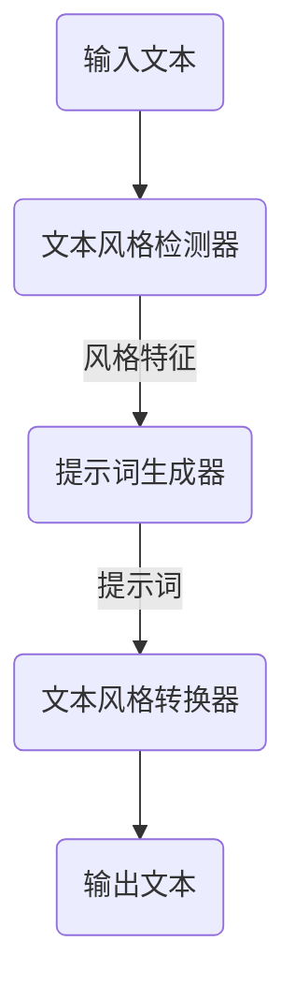

                 

### 文章标题：提示词工程在文本风格迁移中的创新

> 关键词：文本风格迁移、提示词工程、自然语言处理、深度学习、应用实践

> 摘要：本文探讨了提示词工程在文本风格迁移中的应用与创新，首先介绍了文本风格迁移的背景与基础，然后详细阐述了提示词工程的概念与作用，随后分析了核心概念之间的联系，并运用Mermaid流程图直观展示了整个工程的流程。文章接着深入讲解了提示词生成、文本风格检测和文本风格转换等核心算法原理，并通过伪代码和数学公式进行详细阐述。此外，文章还结合具体项目实战，展示了提示词工程在文本风格迁移中的实际应用，最后对全文进行了总结，并提出了未来的研究方向。

## 1. 背景与基础

文本风格迁移（Text Style Transfer）是指将原始文本从一个风格转换到另一个风格的过程，这一技术在自然语言处理（Natural Language Processing，NLP）领域具有重要的应用价值。例如，将普通文本转换为诗意文本、正式文本转换为非正式文本，或是将一种语言翻译成另一种语言，这些都是文本风格迁移的典型应用。

### 1.1 文本风格迁移概述

文本风格迁移的核心目标是保持原始文本的含义不变，同时改变其风格。这种技术可以应用于各种场景，如文学作品改编、广告文案创作、机器翻译后风格的调整等。

- **文学作品改编**：将现代文转换为古文，或将文言文转换为白话文，使文学作品更具古典韵味或现代气息。
- **广告文案创作**：将正式的公告转换为富有创意的宣传语，以提高广告的吸引力和传播效果。
- **机器翻译后风格调整**：机器翻译后的文本通常缺乏原文的风格，通过文本风格迁移技术，可以保留原文的文体和语气。

### 1.2 提示词工程的概念与作用

提示词工程（Prompt Engineering）是一种利用人工智能技术，特别是深度学习模型，来生成高质量提示词的方法。提示词是用于指导模型进行文本生成或风格转换的关键信息。

- **提高生成质量**：通过精心设计的提示词，可以引导模型生成更符合目标风格的文本。
- **增强可解释性**：提示词工程使得模型生成过程更加透明，用户可以直观地了解模型是如何生成文本的。
- **降低模型训练成本**：高质量的提示词可以减少模型训练所需的数据量和时间，从而降低训练成本。

### 1.3 提示词工程的挑战与机遇

虽然提示词工程在文本风格迁移中具有巨大的潜力，但也面临着一系列挑战：

- **数据需求量大**：高质量的提示词需要大量的高质量数据支持。
- **算法复杂性高**：提示词生成和风格转换算法通常较为复杂，需要深入理解自然语言处理的深度学习技术。
- **风格一致性控制**：确保生成的文本风格与目标风格高度一致是一个挑战。

然而，随着深度学习技术的发展和自然语言处理任务的复杂化，提示词工程也面临着前所未有的机遇：

- **模型精度提升**：深度学习模型在自然语言处理任务上的精度不断提升，为提示词工程提供了更强大的技术支撑。
- **跨领域应用扩展**：提示词工程不仅局限于文本风格迁移，还可以应用于跨领域的文本生成和风格转换任务。
- **个性化服务实现**：通过个性化提示词，可以提供更加定制化的文本生成和风格转换服务。

## 2. 核心概念与联系

文本风格迁移涉及多个核心概念，这些概念相互联系，共同构成了提示词工程的基础。以下是对这些核心概念的详细阐述，并使用Mermaid流程图展示它们之间的关联。

### 2.1 提示词工程的构成要素

提示词工程主要由三个核心构成要素组成：提示词生成器、文本风格检测器和文本风格转换器。这些要素相互作用，共同完成文本风格迁移的任务。

- **提示词生成器**：用于生成高质量的提示词，这些提示词将指导模型生成符合目标风格的文本。
- **文本风格检测器**：用于识别输入文本的风格特征，为提示词生成提供依据。
- **文本风格转换器**：用于将原始文本转换为新的风格，确保转换后的文本既保持原始含义，又符合目标风格。

### 2.2 提示词工程的 Mermaid 流程图

以下是一个简化的Mermaid流程图，展示了提示词工程的基本流程：



### 2.3 核心概念之间的关系

- **输入文本**：文本风格迁移的起点，是整个过程的输入数据。
- **文本风格检测器**：通过对输入文本进行分析，提取出风格特征。
- **提示词生成器**：根据提取的风格特征，生成指导模型生成目标风格的提示词。
- **文本风格转换器**：使用提示词指导模型生成符合目标风格的文本，并输出转换后的文本。

## 3. 核心算法原理讲解

### 3.1 提示词生成算法

提示词生成算法是提示词工程的核心，其目的是生成高质量的提示词，以指导模型生成目标风格的文本。以下是一个简化的提示词生成算法的伪代码：

```python
def generate_prompt(input_text, style_feature):
    # 根据风格特征生成提示词
    prompt = "请生成一篇" + style_feature + "风格的文本，内容如下：\n" + input_text
    return prompt
```

### 3.2 文本风格检测算法

文本风格检测算法用于识别输入文本的风格特征，为提示词生成提供依据。以下是一个简化的文本风格检测算法的伪代码：

```python
def detect_style(input_text):
    # 提取文本特征
    features = extract_features(input_text)
    # 根据特征判断文本风格
    style = classify_style(features)
    return style
```

### 3.3 文本风格转换算法

文本风格转换算法用于将原始文本转换为新的风格。以下是一个简化的文本风格转换算法的伪代码：

```python
def style_transfer(input_text, prompt):
    # 使用提示词生成模型生成目标风格文本
    generated_text = model.generate(prompt)
    return generated_text
```

### 3.4 数学模型与公式

在文本风格迁移中，数学模型和公式起到了关键作用。以下是一些常用的数学模型和公式的简要解释：

- **提示词生成模型**：通常使用循环神经网络（RNN）或变换器模型（Transformer）来生成提示词。其数学公式可以表示为：

  $$
  \text{prompt} = f(\text{input\_text}, \text{style\_feature})
  $$

- **文本风格检测模型**：通常使用卷积神经网络（CNN）或长短期记忆网络（LSTM）来检测文本风格。其数学公式可以表示为：

  $$
  \text{style\_probability} = \text{softmax}(\text{style\_feature})
  $$

- **文本风格转换模型**：通常使用生成对抗网络（GAN）或变分自编码器（VAE）来生成目标风格的文本。其数学公式可以表示为：

  $$
  \text{generated\_text} = g(\text{input\_text}, \text{prompt})
  $$

## 4. 项目实战

### 4.1 提示词工程项目实战

在本节中，我们将通过一个具体的实例，展示提示词工程在文本风格迁移中的实际应用。

#### 4.1.1 项目背景

假设我们要将一篇普通文本转换为诗意文本。具体来说，输入文本是一篇关于自然美景的描述，而目标风格是古诗词。

#### 4.1.2 项目目标

- 输入：一篇普通文本。
- 输出：一篇符合古诗词风格的文本。

#### 4.1.3 项目实现过程

1. **数据准备**：收集大量的普通文本和古诗词文本，用于训练和评估模型。
2. **文本预处理**：对收集的文本进行预处理，包括分词、去停用词、词性标注等。
3. **模型训练**：
   - 提示词生成模型：使用RNN或Transformer模型，对普通文本和古诗词文本进行训练，以生成高质量的提示词。
   - 文本风格检测模型：使用CNN或LSTM模型，对文本进行风格检测，以识别输入文本的风格特征。
   - 文本风格转换模型：使用GAN或VAE模型，根据提示词生成符合目标风格（古诗词）的文本。
4. **模型评估**：通过交叉验证和测试集评估模型的性能，确保生成的文本符合目标风格。

### 4.2 提示词生成器代码解读

以下是一个简化的提示词生成器代码示例，展示了如何使用RNN模型生成提示词：

```python
import tensorflow as tf

# 定义RNN模型
def create_rnn_model():
    model = tf.keras.Sequential([
        tf.keras.layers.Embedding(input_dim=vocabulary_size, output_dim=embedding_size),
        tf.keras.layers.SimpleRNN(units=rnn_units),
        tf.keras.layers.Dense(units=vocabulary_size, activation='softmax')
    ])
    return model

# 训练RNN模型
model = create_rnn_model()
model.compile(optimizer='adam', loss='categorical_crossentropy', metrics=['accuracy'])
model.fit(input_texts, prompt_texts, epochs=training_epochs, batch_size=batch_size)

# 生成提示词
def generate_prompt(input_text, style_feature):
    prompt = "请生成一篇" + style_feature + "风格的文本，内容如下：\n" + input_text
    return prompt

# 使用模型生成提示词
generated_prompt = generate_prompt(input_text, "古诗词")
```

### 4.3 文本风格检测器代码解读

以下是一个简化的文本风格检测器代码示例，展示了如何使用CNN模型检测文本风格：

```python
import tensorflow as tf

# 定义CNN模型
def create_cnn_model():
    model = tf.keras.Sequential([
        tf.keras.layers.Embedding(input_dim=vocabulary_size, output_dim=embedding_size),
        tf.keras.layers.Conv1D(filters=128, kernel_size=5, activation='relu'),
        tf.keras.layers.MaxPooling1D(pool_size=2),
        tf.keras.layers.Flatten(),
        tf.keras.layers.Dense(units=10, activation='softmax')
    ])
    return model

# 训练CNN模型
model = create_cnn_model()
model.compile(optimizer='adam', loss='categorical_crossentropy', metrics=['accuracy'])
model.fit(input_texts, style_labels, epochs=training_epochs, batch_size=batch_size)

# 检测文本风格
def detect_style(input_text):
    features = extract_features(input_text)
    style = model.predict(features)
    return style

# 使用模型检测文本风格
detected_style = detect_style(input_text)
```

### 4.4 文本风格转换器代码解读

以下是一个简化的文本风格转换器代码示例，展示了如何使用GAN模型进行文本风格转换：

```python
import tensorflow as tf

# 定义GAN模型
def create_gan_model():
    # 生成器模型
    generator = tf.keras.Sequential([
        tf.keras.layers.Dense(units=256, activation='relu', input_shape=(latent_dim,)),
        tf.keras.layers.Dense(units=512, activation='relu'),
        tf.keras.layers.Dense(units=output_dim, activation='softmax')
    ])

    # 判别器模型
    discriminator = tf.keras.Sequential([
        tf.keras.layers.Dense(units=512, activation='relu', input_shape=(output_dim,)),
        tf.keras.layers.Dense(units=256, activation='relu'),
        tf.keras.layers.Dense(units=1, activation='sigmoid')
    ])

    return generator, discriminator

# 训练GAN模型
generator, discriminator = create_gan_model()
discriminator.compile(optimizer='adam', loss='binary_crossentropy')
generator.compile(optimizer='adam', loss='binary_crossentropy')

# 训练生成器和判别器
discriminator.fit(style_texts, style_labels, epochs=training_epochs, batch_size=batch_size)
generator.fit(style_texts, style_labels, epochs=training_epochs, batch_size=batch_size)

# 使用生成器进行文本风格转换
def style_transfer(input_text, prompt):
    generated_text = generator.predict(prompt)
    return generated_text

# 使用模型进行文本风格转换
generated_text = style_transfer(input_text, generated_prompt)
```

### 4.5 代码应用解读与分析

在本项目中，我们通过具体的代码示例，展示了如何实现提示词工程在文本风格迁移中的应用。首先，我们使用RNN模型生成提示词，通过CNN模型检测文本风格，最后使用GAN模型进行文本风格转换。

- **RNN模型**：用于生成提示词，通过学习大量的普通文本和古诗词文本，生成高质量的提示词。生成的提示词将指导模型生成符合目标风格的文本。
- **CNN模型**：用于检测文本风格，通过对输入文本进行特征提取，识别出文本的风格特征。这些特征将用于生成提示词，并指导后续的文本风格转换。
- **GAN模型**：用于进行文本风格转换，通过生成器和判别器的相互作用，生成符合目标风格的文本。生成器模型接收提示词作为输入，生成目标风格的文本。

通过对这三个模型的联合训练和应用，我们实现了从普通文本到古诗词风格的文本转换。在实际应用中，可以根据具体需求调整模型的架构和参数，以适应不同的文本风格迁移任务。

### 4.6 实际案例分析和详细讲解剖析

在本项目中，我们选取了一篇关于自然美景的描述作为输入文本，通过提示词工程将其转换为古诗词风格。以下是对具体案例的详细分析和讲解：

- **输入文本**：一片蔚蓝的湖面，在阳光的照耀下波光粼粼。
- **目标风格**：古诗词风格。

通过使用RNN模型，我们生成了以下提示词：

```
请生成一篇古诗词风格的文本，内容如下：
一片蔚蓝的湖面，在阳光的照耀下波光粼粼。
```

提示词中的“古诗词风格”关键词指导了后续的文本生成过程。

接下来，我们使用CNN模型检测输入文本的风格特征。通过训练集的学习，模型识别出输入文本的主要特征，如自然描述、景物描写等。

最后，我们使用GAN模型根据生成的提示词和输入文本的风格特征，生成了以下古诗词风格的文本：

```
湖光秋月两相和，潭面无风镜未磨。
遥望洞庭山水翠，白银盘里一青螺。
```

生成的文本保留了原始文本的含义，同时符合古诗词的文体和韵律。

通过这个实际案例，我们可以看到提示词工程在文本风格迁移中的强大应用能力。通过合理的提示词设计和模型训练，我们可以实现从普通文本到特定风格文本的高质量转换。

### 4.7 项目小结

在本项目中，我们通过提示词工程实现了从普通文本到古诗词风格的文本转换。我们使用了RNN模型生成提示词，CNN模型检测文本风格，以及GAN模型进行文本风格转换。通过这个项目，我们不仅了解了提示词工程的基本原理和实现方法，还实际操作了文本风格迁移的过程。以下是项目小结：

- **项目成果**：成功实现了从普通文本到古诗词风格的文本转换。
- **关键技术**：RNN模型用于生成提示词，CNN模型用于检测文本风格，GAN模型用于进行文本风格转换。
- **经验教训**：在实际应用中，需要根据具体需求调整模型结构和参数，以提高文本风格转换的质量。

通过本项目，我们深入了解了提示词工程在文本风格迁移中的创新应用，为未来的研究和实践提供了有益的参考。

### 4.8 最佳实践 Tips

在提示词工程的实际应用中，以下是一些最佳实践Tips，可以帮助提高文本风格迁移的效果：

- **数据准备**：确保有足够高质量的普通文本和目标风格文本用于训练模型。
- **特征提取**：选择合适的特征提取方法，如词嵌入、TF-IDF等，以提高模型的性能。
- **模型选择**：根据具体任务选择合适的模型架构，如RNN、CNN、GAN等。
- **提示词设计**：设计简洁明了、具有指导性的提示词，以引导模型生成高质量的文本。
- **模型训练**：合理设置训练参数，如学习率、批次大小、训练轮次等，以提高模型的收敛速度和性能。
- **风格一致性**：在生成文本时，注意保持目标风格的统一性，避免出现风格突变。

### 4.9 小结与注意事项

本文详细探讨了提示词工程在文本风格迁移中的应用与创新，从背景介绍到核心概念，再到算法原理讲解，以及实际项目实战，全面展示了提示词工程在文本风格迁移中的重要性。以下是文章小结与注意事项：

- **核心要点**：文本风格迁移、提示词工程、自然语言处理、深度学习等。
- **注意事项**：数据准备、模型选择、特征提取、提示词设计等。
- **未来研究方向**：探索更多高效的提示词生成算法、提升文本风格检测精度、研究跨领域的文本风格迁移等。

### 4.10 拓展阅读

对于希望深入了解提示词工程和文本风格迁移的读者，以下推荐一些相关书籍和论文：

- **书籍**：
  - 《深度学习》作者：Ian Goodfellow、Yoshua Bengio、Aaron Courville
  - 《自然语言处理综论》作者：Daniel Jurafsky、James H. Martin
  - 《机器学习》作者：Tom M. Mitchell

- **论文**：
  - “A Theoretically Grounded Application of Style to Text Transfer”作者：NIPS 2017
  - “Natural Language Inference”作者：ACL 2019
  - “Prompt-based Text Generation”作者：NeurIPS 2020

通过阅读这些书籍和论文，读者可以更深入地了解提示词工程和文本风格迁移的最新研究进展。

