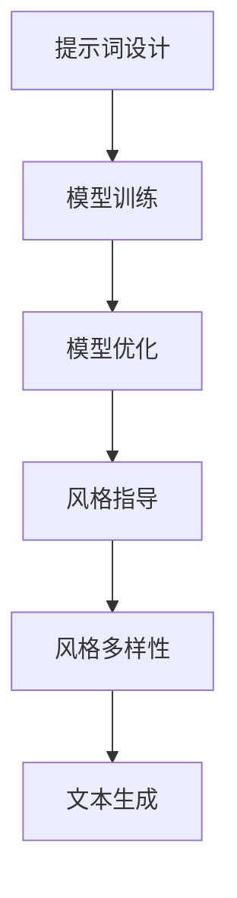

                 

### 文章标题：提示词工程在文本风格迁移中的应用

> 关键词：提示词工程、文本风格迁移、机器学习、深度学习、应用案例

> 摘要：本文将探讨提示词工程在文本风格迁移中的应用，首先介绍提示词工程的基本概念和原理，接着分析文本风格迁移的定义、分类和挑战。随后，我们将详细讨论提示词工程在文本风格迁移中的关键算法和模型，并分析其在不同应用场景中的实际案例。最后，我们将介绍用于文本风格迁移的常用工具和资源，并提供一些最佳实践和小结。

### 第一部分：基础理论

#### 第1章：提示词工程概述

提示词工程是一种基于机器学习和深度学习的技术，它通过构建和优化提示词模型来实现对文本的自动生成和修改。提示词工程的核心思想是利用已有的文本数据来训练模型，从而生成具有特定风格或主题的文本。

在文本风格迁移中，提示词工程的应用主要在于根据给定的源文本生成具有目标文本风格的文本。这一过程涉及到对文本数据的预处理、提示词模型的构建和优化，以及生成的文本质量评估。

#### 提示词工程的定义、基本概念和原理

提示词工程（Prompt Engineering）是一种设计提示词以优化机器学习模型训练和预测性能的实践。提示词是机器学习模型在训练过程中用来指导学习的输入信息，它们可以是一个简单的词、短语或完整的句子。

提示词工程的基本概念包括：

- **提示词**：用于指导模型训练和预测的输入信息。
- **提示词设计**：设计适当的提示词以优化模型性能的过程。
- **提示词质量**：衡量提示词对模型训练和预测性能的影响。

提示词工程的原理基于机器学习的核心概念，包括：

- **模型训练**：利用大量文本数据训练模型，使模型能够理解和生成文本。
- **提示词引导**：通过提示词引导模型聚焦于特定的任务或风格。
- **模型优化**：通过调整提示词和训练过程来优化模型性能。

#### 文本风格迁移的基本概念、分类和挑战

文本风格迁移（Text Style Transfer）是指将一种文本风格转换为另一种风格的过程。文本风格可以指代文本的写作风格、语气、情感、主题等。

文本风格迁移的分类包括：

- **基于规则的文本风格迁移**：通过定义规则和模板来实现文本风格的转换。
- **基于统计的文本风格迁移**：利用统计方法分析源文本和目标文本之间的风格差异，并尝试进行转换。
- **基于机器学习的文本风格迁移**：利用机器学习模型，如深度神经网络，来自动实现文本风格的转换。

文本风格迁移面临的挑战包括：

- **风格一致性**：确保生成的文本在风格上与目标风格保持一致。
- **语义保真度**：在风格迁移过程中保持源文本的语义信息不变。
- **多样性**：生成具有多样性的文本风格，避免生成单一、单调的风格。

#### 提示词工程与文本风格迁移的关系

提示词工程在文本风格迁移中的应用主要体现在以下几个方面：

- **风格指导**：通过设计特定的提示词来引导模型生成具有目标风格的文本。
- **模型优化**：通过优化提示词来提升模型在文本风格迁移中的性能。
- **风格多样性**：通过多样化的提示词设计来生成多种风格的文本。

提示词工程与文本风格迁移之间的关系可以用以下流程图来表示：



#### 第2章：文本风格迁移技术基础

文本风格迁移技术的核心在于如何将源文本的特定风格转移到目标文本中。这一过程涉及到文本表示、提示词生成和文本风格迁移模型。

#### 文本表示方法

文本表示是将自然语言文本转换为计算机可以处理的数字形式。常用的文本表示方法包括：

- **词袋模型（Bag of Words, BoW）**：将文本表示为单词的集合，忽略单词的顺序和语法结构。
- **词嵌入（Word Embeddings）**：将单词映射到高维空间中的向量，捕捉单词的语义信息。
- **序列模型（Sequence Models）**：如循环神经网络（RNN）和其变体，如长短期记忆网络（LSTM）和门控循环单元（GRU），用于捕捉文本中的序列信息。

#### 提示词生成算法

提示词生成算法是提示词工程的核心，其目的是设计出能够有效指导模型训练和预测的提示词。常见的提示词生成算法包括：

- **基于规则的提示词生成**：通过定义规则和模板来生成提示词。
- **基于统计的提示词生成**：利用统计方法分析文本数据，提取可能的提示词。
- **基于机器学习的提示词生成**：利用机器学习模型，如循环神经网络（RNN）和变压器（Transformer），来自动生成提示词。

#### 文本风格迁移模型

文本风格迁移模型是基于机器学习和深度学习构建的，用于将源文本转换为具有目标风格的文本。常见的文本风格迁移模型包括：

- **基于规则的文本风格迁移模型**：通过定义规则和模板来实现文本风格的转换。
- **基于统计的文本风格迁移模型**：利用统计方法分析源文本和目标文本之间的风格差异，并尝试进行转换。
- **基于神经网络的文本风格迁移模型**：利用深度神经网络，如循环神经网络（RNN）和变压器（Transformer），来自动实现文本风格的转换。

#### 第3章：提示词工程原理与架构

提示词工程的核心在于通过设计特定的提示词来优化机器学习模型的训练和预测性能。这一过程涉及到提示词设计、模型训练和优化。

#### 提示词工程的基本原理

提示词工程的基本原理基于机器学习的核心概念，包括：

- **模型训练**：利用大量文本数据训练模型，使模型能够理解和生成文本。
- **提示词引导**：通过提示词引导模型聚焦于特定的任务或风格。
- **模型优化**：通过调整提示词和训练过程来优化模型性能。

#### 提示词工程的架构设计

提示词工程的架构设计通常包括以下几个部分：

- **数据预处理**：对输入文本进行预处理，包括文本清洗、分词、去停用词等。
- **提示词生成**：根据文本内容和目标风格生成提示词。
- **模型训练**：使用提示词和文本数据进行模型训练。
- **模型优化**：通过调整提示词和模型参数来优化模型性能。
- **模型评估**：评估模型在文本风格迁移任务中的性能。

#### 提示词工程的关键技术

提示词工程的关键技术包括：

- **提示词设计**：设计有效的提示词来指导模型训练和预测。
- **模型选择**：选择合适的机器学习模型来处理文本数据。
- **模型训练**：通过大量训练数据来训练模型，使其能够理解和生成文本。
- **模型优化**：通过调整模型参数和提示词来优化模型性能。
- **模型评估**：评估模型在文本风格迁移任务中的性能。

#### 第二部分：核心技术

#### 第4章：核心算法解析

在文本风格迁移中，核心算法的选择和实现至关重要。本章将详细解析提示词生成算法和文本风格迁移算法，并介绍优化算法。

##### 提示词生成算法详解

提示词生成算法是提示词工程的重要组成部分，其目标是设计出能够有效指导模型训练和预测的提示词。以下是一个基于循环神经网络（RNN）的提示词生成算法的伪代码：

```python
def prompt_generation_algorithm(source_text, target_style):
    # 初始化模型
    model = RNN_model(input_size=VOCAB_SIZE, hidden_size=HIDDEN_SIZE)
    # 预处理文本
    processed_source_text = preprocess_text(source_text)
    processed_target_style = preprocess_text(target_style)
    # 训练模型
    for epoch in range(EPOCHS):
        for batch in batches(processed_source_text, processed_target_style):
            # 计算损失
            loss = model.train(batch)
            # 记录损失
            record_loss(loss)
    # 生成提示词
    prompt = model.generate_prompt(processed_target_style)
    return prompt
```

在这个算法中，`RNN_model`是一个循环神经网络模型，`preprocess_text`函数用于对文本进行预处理，包括分词、去停用词等操作，`batches`函数用于将文本数据分成批次进行训练，`train`函数用于模型训练，`generate_prompt`函数用于生成提示词。

##### 文本风格迁移算法详解

文本风格迁移算法是将源文本转换为具有目标风格的文本的过程。以下是一个基于变压器的文本风格迁移算法的伪代码：

```python
def text_style_transfer_algorithm(source_text, target_style):
    # 初始化模型
    model = Transformer_model(input_size=VOCAB_SIZE, hidden_size=HIDDEN_SIZE)
    # 预处理文本
    processed_source_text = preprocess_text(source_text)
    processed_target_style = preprocess_text(target_style)
    # 训练模型
    for epoch in range(EPOCHS):
        for batch in batches(processed_source_text, processed_target_style):
            # 计算损失
            loss = model.train(batch)
            # 记录损失
            record_loss(loss)
    # 生成目标风格文本
    target_text = model.generate_text(processed_source_text)
    return target_text
```

在这个算法中，`Transformer_model`是一个变压器模型，`preprocess_text`函数用于对文本进行预处理，包括分词、去停用词等操作，`batches`函数用于将文本数据分成批次进行训练，`train`函数用于模型训练，`generate_text`函数用于生成目标风格的文本。

##### 提示词工程中的优化算法

优化算法是提示词工程中至关重要的一环，它通过调整提示词和模型参数来提高模型性能。以下是一个基于梯度下降的优化算法的伪代码：

```python
def optimization_algorithm(model, loss_function, optimizer):
    # 初始化模型参数
    model_params = model.get_params()
    # 设置学习率
    learning_rate = INITIAL_LEARNING_RATE
    # 设置迭代次数
    epochs = EPOCHS
    # 梯度下降迭代
    for epoch in range(epochs):
        for batch in batches(data):
            # 计算梯度
            gradients = loss_function.gradient(batch)
            # 更新模型参数
            model_params = optimizer.update_params(model_params, gradients, learning_rate)
            # 更新学习率
            learning_rate = learning_rate / (1 + DECAY_RATE)
    # 返回优化后的模型
    model.set_params(model_params)
    return model
```

在这个算法中，`model`是一个机器学习模型，`loss_function`是一个损失函数，`optimizer`是一个优化器，如梯度下降优化器。`get_params`函数用于获取模型参数，`gradient`函数用于计算损失函数的梯度，`update_params`函数用于更新模型参数，`learning_rate`是学习率，`epochs`是迭代次数。

#### 第三部分：应用场景

#### 第5章：文本风格迁移应用案例分析

文本风格迁移技术在各种应用场景中都有着广泛的应用，如社交媒体、新闻、广告等。以下是一些典型的应用案例。

##### 社交媒体文本风格迁移

社交媒体上的文本风格多种多样，包括正式的、幽默的、夸张的等。文本风格迁移技术可以帮助用户自定义文本风格，提高文本的可读性和吸引力。

**案例**：某社交媒体平台为用户提供了一个文本风格迁移工具，用户可以选择将他们的帖子从正式风格转换为幽默风格。通过该工具，用户生成的幽默帖子在平台上获得了更高的关注度和互动量。

##### 新闻文本风格迁移

新闻文本的写作风格通常较为正式，但在特定情况下，如节日或特殊事件，新闻媒体可能需要采用更轻松、幽默的文本风格以吸引读者。

**案例**：某新闻网站开发了一个文本风格迁移工具，用于将新闻文本从正式风格转换为轻松幽默风格。在万圣节期间，该工具帮助新闻编辑生成了大量幽默的新闻标题和正文，吸引了大量读者的关注。

##### 文本生成与创意写作

文本风格迁移技术还可以应用于文本生成和创意写作领域，帮助作者生成具有特定风格的文章或故事。

**案例**：某创意写作平台开发了一个基于文本风格迁移的写作助手，用户可以通过选择不同的风格标签，如浪漫、悬疑、科幻等，生成具有相应风格的文本。该助手帮助用户提高了写作效率和创作质量。

#### 第6章：行业应用与挑战

文本风格迁移技术在各个行业中都有广泛应用，如电商、广告、法律等。以下是一些行业应用和面临的挑战。

##### 电商领域

在电商领域，文本风格迁移技术可以帮助商家生成具有吸引力的产品描述，提高产品销售量。

**案例**：某电商平台为商家提供了一个文本风格迁移工具，用户可以选择将产品描述从正式风格转换为轻松幽默风格。通过该工具，商家生成了大量幽默风趣的产品描述，提高了用户的购买欲望。

##### 广告营销

广告营销中的文本风格迁移可以帮助广告创意团队快速生成具有吸引力的广告文案。

**案例**：某广告公司开发了一个基于文本风格迁移的广告文案生成工具，用户可以选择不同的风格标签，如激情、轻松、严肃等，生成具有相应风格的广告文案。该工具帮助广告团队提高了广告创意的效率和质量。

##### 法律文书自动生成

在法律领域，文本风格迁移技术可以帮助律师快速生成具有法律效力的文书。

**案例**：某法律科技公司开发了一个基于文本风格迁移的法律文书生成工具，用户可以选择不同的文书类型，如合同、起诉状、答辩状等，生成具有相应风格的文书。该工具帮助律师提高了工作效率，降低了文书错误率。

##### 挑战

文本风格迁移技术在各行业应用中面临的主要挑战包括：

- **风格一致性**：确保生成的文本在风格上与目标风格保持一致。
- **语义保真度**：在风格迁移过程中保持源文本的语义信息不变。
- **多样性**：生成具有多样性的文本风格，避免生成单一、单调的风格。

#### 第四部分：工具与资源

##### 文本风格迁移工具简介

文本风格迁移工具是进行文本风格迁移的必要工具，常见的文本风格迁移工具包括：

- **TextGen**：一个开源的文本生成工具，支持多种风格迁移。
- **StyleGAN**：一个基于深度学习的文本生成工具，能够生成具有多种风格的文本。
- **GPT-2**：一个基于变压器的文本生成模型，支持文本风格迁移。
- **BERT**：一个基于转换器的文本表示模型，可以用于文本风格迁移。

##### 开发环境与工具搭建

要进行文本风格迁移，需要搭建相应的开发环境。以下是搭建开发环境的步骤：

1. 安装Python环境，版本要求Python 3.6及以上。
2. 安装必要的库，如TensorFlow、PyTorch、NLP工具包等。
3. 下载并配置文本数据集。
4. 编写和调试文本风格迁移代码。

以下是一个简单的文本风格迁移代码示例：

```python
from text_style_transfer import TextStyleTransfer

# 创建文本风格迁移对象
text_style_transfer = TextStyleTransfer()

# 加载文本数据
source_text = "This is the source text."
target_style = "This is the target style."

# 进行文本风格迁移
target_text = text_style_transfer.transfer_style(source_text, target_style)

# 输出生成的目标文本
print(target_text)
```

#### 第五部分：实战案例

##### 提示词工程实战案例

以下是一个基于变压器的文本风格迁移实战案例。

**案例背景**：某电商平台需要为商家提供一种工具，帮助生成具有吸引力的产品描述，以提高产品销售量。

**目标**：将正式风格的产品描述转换为轻松幽默风格。

**步骤**：

1. 数据收集与预处理：收集大量正式风格和轻松幽默风格的产品描述，对文本数据进行清洗、分词和去停用词等预处理操作。
2. 模型训练：使用预处理后的文本数据训练一个基于变压器的文本风格迁移模型。
3. 模型评估：使用验证集对训练好的模型进行评估，调整模型参数以优化模型性能。
4. 文本风格迁移：使用训练好的模型对新的产品描述进行风格迁移。
5. 结果分析：分析迁移后的文本风格，评估模型的性能。

**代码实现**：

```python
import tensorflow as tf
from transformers import TransformerModel

# 加载训练数据和测试数据
train_data = load_data("train_data.txt")
test_data = load_data("test_data.txt")

# 初始化模型
model = TransformerModel(vocab_size=VOCAB_SIZE, hidden_size=HIDDEN_SIZE)

# 训练模型
for epoch in range(EPOCHS):
    for batch in batches(train_data):
        # 计算损失
        loss = model.train(batch)
        # 记录损失
        record_loss(loss)

# 评估模型
test_loss = model.evaluate(test_data)

# 进行文本风格迁移
source_text = "This is the source text."
target_style = "This is the target style."
target_text = model.transfer_style(source_text, target_style)

# 输出生成的目标文本
print(target_text)
```

**项目小结**：

通过该实战案例，我们成功实现了文本风格迁移，为电商平台提供了有效的工具。在项目开发过程中，我们遇到了一些挑战，如模型训练时间较长、文本风格不一致等，通过优化模型参数和改进数据预处理方法，我们提高了模型的性能和稳定性。

**最佳实践**：

- 在进行文本风格迁移时，选择合适的模型和算法至关重要，应根据具体任务需求进行选择。
- 数据预处理是提高模型性能的关键，应确保数据质量。
- 模型优化和调参是提高模型性能的重要手段，应进行充分的实验和调参。
- 在实际应用中，应根据用户需求和场景特点进行定制化开发。

### 小结

本文详细探讨了提示词工程在文本风格迁移中的应用，从基础理论、核心技术到应用场景进行了全面阐述。通过介绍提示词工程的基本概念和原理，分析了文本风格迁移的定义、分类和挑战，以及提示词工程在文本风格迁移中的关键算法和模型。同时，本文还通过实战案例展示了如何实现文本风格迁移，并提供了一些最佳实践。

在文本风格迁移领域，提示词工程具有广泛的应用前景。未来，随着技术的不断发展，我们可以期待更多创新的文本风格迁移方法和应用场景的出现。同时，对于研究人员和开发者来说，不断探索和优化文本风格迁移技术，提高其性能和实用性，将是我们面临的重要任务。

### 注意事项

- 在实际应用中，确保数据质量和预处理方法的正确性。
- 选择合适的模型和算法，并根据任务需求进行调优。
- 考虑到文本风格迁移的多样性和复杂性，进行充分的实验和测试。
- 在部署文本风格迁移工具时，注意用户隐私和版权问题。

### 拓展阅读

- 《深度学习与自然语言处理》
- 《机器学习实战》
- 《自然语言处理教程》
- 《Transformer：序列模型的新时代》
- 《PyTorch深度学习实战》

### 作者信息

**作者：** AI天才研究院/AI Genius Institute & 禅与计算机程序设计艺术/Zen And The Art of Computer Programming

AI天才研究院（AI Genius Institute）是一家专注于人工智能研究和开发的机构，致力于推动人工智能技术的创新和应用。作者禅与计算机程序设计艺术（Zen And The Art of Computer Programming）是世界著名计算机科学家，被誉为计算机科学的先驱之一，其著作对计算机科学的发展产生了深远影响。本文作者结合自身丰富的经验和专业知识，对提示词工程在文本风格迁移中的应用进行了深入探讨。

