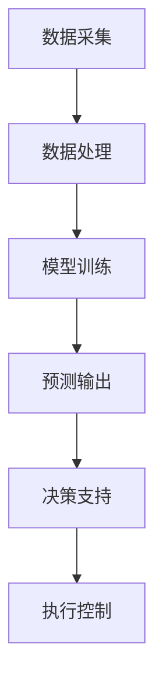
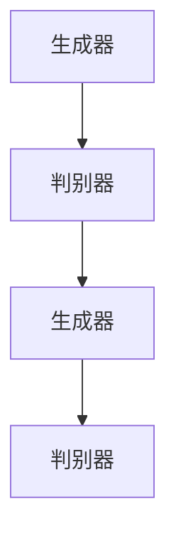
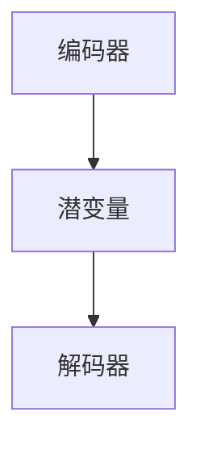
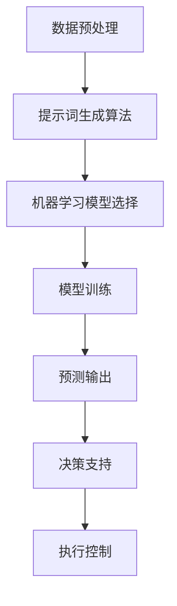

                 

## 文章标题

# 提示词工程在智能农业中的应用

### 关键词：提示词工程，智能农业，数据处理，算法原理，数学模型，项目实战

### 摘要：

本文旨在探讨提示词工程在智能农业领域的应用。通过介绍提示词工程的基本概念、技术原理以及其在智能农业中的实际应用案例，本文揭示了提示词工程在提高农业生产力、优化农业资源利用和实现精准农业中的关键作用。文章结构清晰，内容丰富，既有理论讲解，又有实战案例分析，旨在为读者提供一个全面、深入的智能农业技术理解。

## 引言

智能农业是信息技术与农业生产相结合的产物，旨在通过现代化技术手段提高农业生产的效率和质量。随着大数据、人工智能、物联网等技术的迅猛发展，智能农业已经成为未来农业发展的关键方向。然而，智能农业的实现离不开先进的数据处理和分析技术。在此背景下，提示词工程作为一种数据驱动的方法，为智能农业提供了强有力的技术支持。

提示词工程，即通过构建提示词模型，从大量农业数据中提取关键信息，实现对农业现象的智能理解和预测。其在智能农业中的应用主要体现在农田环境监测、作物生长预测、病虫害防治等方面。本文将详细阐述提示词工程的基本概念、技术原理及其在智能农业中的实际应用，以期为读者提供一个全面的技术视角。

## 核心概念与联系

### 提示词工程的定义

提示词工程是一种基于数据驱动的方法，通过构建提示词模型，从大量农业数据中提取关键信息，以实现对农业现象的智能理解和预测。提示词模型通常由特征提取、模型训练和预测输出三个主要部分组成。其基本原理是利用机器学习算法，从历史数据中学习出数据之间的关联性，从而生成能够反映农业现象的提示词。

### 智能农业中的关键要素

智能农业的核心要素包括数据采集、数据处理、决策支持和执行控制。其中，数据采集是智能农业的基础，通过传感器、遥感技术等手段获取农田环境、作物生长、病虫害等信息；数据处理则是智能农业的核心，通过对采集到的数据进行预处理、特征提取和模型训练，实现对农业现象的智能理解和预测；决策支持则是根据预测结果，提供合理的农业管理建议；执行控制则是将决策转化为具体的农业操作。

### 提示词工程与智能农业的Mermaid流程图

为了更直观地展示提示词工程在智能农业中的应用流程，我们可以使用Mermaid流程图来表示。以下是提示词工程在智能农业中应用的Mermaid流程图：



在上面的流程图中，A代表数据采集，B代表数据处理，C代表模型训练，D代表预测输出，E代表决策支持，F代表执行控制。通过这个流程图，我们可以清晰地看到提示词工程在智能农业中的应用步骤和关键环节。

## 提示词工程基础

### 数据预处理

数据预处理是提示词工程的重要环节，其目的是提高数据的质量和可靠性，为后续的模型训练和预测提供准确的数据支持。数据预处理主要包括数据收集、数据清洗和数据整合等步骤。

#### 数据收集

数据收集是智能农业中数据预处理的第一步。通过传感器、遥感技术等手段，我们可以收集到农田环境、作物生长、病虫害等信息。这些数据来源广泛，包括气象站、土壤监测站、无人机监测等。

#### 数据清洗

数据清洗是数据预处理的关键步骤，其目的是去除数据中的噪声和错误，提高数据的质量和可靠性。数据清洗通常包括去除重复数据、填充缺失值、纠正错误数据等操作。

#### 数据整合

数据整合是将来自不同来源的数据进行合并，形成一个统一的数据集。数据整合的目的是提高数据的利用效率，为模型训练和预测提供全面的数据支持。数据整合通常涉及数据转换、数据对齐和数据融合等操作。

### 提示词生成算法

提示词生成算法是提示词工程的核心部分，其目的是从大量农业数据中提取关键信息，生成能够反映农业现象的提示词。常见的提示词生成算法包括生成对抗网络（GAN）、变分自编码器（VAE）等。

#### 生成对抗网络（GAN）

生成对抗网络（GAN）是一种由生成器和判别器组成的对偶网络。生成器的目的是生成与真实数据相似的数据，而判别器的目的是区分真实数据和生成数据。通过生成器和判别器的不断对抗，生成器逐渐生成更加真实的数据，从而提取出关键信息。

GAN的基本结构如下：



#### 变分自编码器（VAE）

变分自编码器（VAE）是一种基于概率模型的生成模型，其核心思想是学习一个概率分布，并从这个分布中生成数据。VAE由编码器和解码器组成，编码器将输入数据映射到一个潜变量空间，解码器则将潜变量映射回数据空间。

VAE的基本结构如下：



### 机器学习模型选择

在提示词工程中，选择合适的机器学习模型是关键。常见的机器学习模型包括决策树、随机森林、支持向量机（SVM）、神经网络等。不同的模型有不同的特点和应用场景，需要根据具体问题进行选择。

#### 决策树

决策树是一种基于树形结构的分类算法，通过连续地对特征进行分割，将数据集划分成多个子集，直到满足停止条件。决策树具有直观、易于解释的特点，适合处理分类问题。

#### 随机森林

随机森林是一种集成学习方法，通过构建多棵决策树，并进行投票得到最终结果。随机森林具有强泛化能力，能够处理高维度数据，同时具有良好的可解释性。

#### 支持向量机（SVM）

支持向量机是一种基于最大间隔的分类算法，其目标是找到一个最佳的超平面，将不同类别的数据尽可能分开。SVM具有较好的分类效果，尤其适合处理线性可分的数据集。

#### 神经网络

神经网络是一种基于人脑神经元工作原理的算法，通过多层神经元的组合，实现对复杂问题的建模和预测。神经网络具有强大的表达能力和自适应能力，能够处理非线性问题。

### Mermaid流程图：提示词工程步骤

为了更直观地展示提示词工程的步骤，我们可以使用Mermaid流程图来表示。以下是提示词工程的Mermaid流程图：



在上面的流程图中，A代表数据预处理，B代表提示词生成算法，C代表机器学习模型选择，D代表模型训练，E代表预测输出，F代表决策支持，G代表执行控制。通过这个流程图，我们可以清晰地看到提示词工程的步骤和关键环节。

## 数学模型详解

在提示词工程中，数学模型是核心组成部分，它负责将输入数据映射到提示词输出。以下我们将详细讲解与提示词工程相关的数学模型，包括损失函数、激活函数以及具体的数学公式。

### 损失函数

损失函数是机器学习中评估模型性能的重要指标，它用于度量模型预测值与真实值之间的差距。在提示词工程中，常用的损失函数包括交叉熵损失（Cross-Entropy Loss）和均方误差（Mean Squared Error, MSE）。

#### 交叉熵损失

交叉熵损失函数常用于分类问题，其公式如下：

$$
L(\theta) = -\frac{1}{m}\sum_{i=1}^{m} y_i \log(p_i)
$$

其中，$y_i$ 是真实标签，$p_i$ 是模型预测的概率。交叉熵损失函数的值越小，表示模型预测越准确。

#### 均方误差

均方误差常用于回归问题，其公式如下：

$$
L(\theta) = \frac{1}{2m}\sum_{i=1}^{m} (y_i - \hat{y}_i)^2
$$

其中，$y_i$ 是真实值，$\hat{y}_i$ 是模型预测值。均方误差的值越小，表示模型预测越准确。

### 激活函数

激活函数是神经网络中的关键组成部分，它用于引入非线性特性，使得神经网络能够处理非线性问题。常见的激活函数包括Sigmoid函数、ReLU函数和Tanh函数。

#### Sigmoid函数

Sigmoid函数的公式如下：

$$
\sigma(x) = \frac{1}{1 + e^{-x}}
$$

Sigmoid函数的输出值在(0, 1)之间，常用于二分类问题。

####ReLU函数

ReLU函数的公式如下：

$$
\text{ReLU}(x) = \max(0, x)
$$

ReLU函数在输入为正数时输出原值，输入为负数时输出0，具有简单的计算效率和良好的性能。

####Tanh函数

Tanh函数的公式如下：

$$
\text{Tanh}(x) = \frac{e^x - e^{-x}}{e^x + e^{-x}}
$$

Tanh函数的输出值在(-1, 1)之间，具有较好的对称性。

### 数学公式举例说明

为了更好地理解上述数学模型和公式，我们可以通过一个具体的例子来说明。

假设我们有一个简单的二分类问题，数据集包含100个样本，每个样本有两个特征和一个标签。我们使用Sigmoid函数作为激活函数，并使用交叉熵损失函数来评估模型性能。

#### 模型训练

假设我们的模型预测概率如下：

$$
p_i = \sigma(w_0 + w_1x_1 + w_2x_2)
$$

其中，$w_0, w_1, w_2$ 是模型的权重，$x_1, x_2$ 是特征值。

#### 模型评估

使用交叉熵损失函数来评估模型性能：

$$
L(\theta) = -\frac{1}{100}\sum_{i=1}^{100} y_i \log(p_i) + (1 - y_i) \log(1 - p_i)
$$

其中，$y_i$ 是真实标签，$p_i$ 是模型预测的概率。

通过多次迭代训练和评估，我们可以逐步优化模型，使其在新的数据上具有更好的预测性能。

## 提示词工程在智能农业中的应用案例

### 案例一：农田环境监测

#### 案例背景

农田环境监测是智能农业中的一个重要环节，它涉及对土壤湿度、温度、光照强度等环境参数的实时监测。这些参数对作物的生长和发育具有重要影响。通过农田环境监测，可以实现农业生产的精准管理，提高作物产量和品质。

#### 应用方案

在农田环境监测中，我们可以采用以下方案：

1. **数据采集**：使用传感器技术收集农田环境参数，如土壤湿度传感器、温度传感器和光照强度传感器。
2. **数据预处理**：对采集到的数据进行预处理，包括数据清洗、去噪和归一化等操作。
3. **模型训练**：使用机器学习算法，如神经网络，对预处理后的数据进行训练，构建农田环境监测模型。
4. **预测输出**：使用训练好的模型对农田环境进行实时监测，预测未来环境参数的变化趋势。
5. **决策支持**：根据监测结果和预测趋势，为农业生产提供合理的决策建议，如灌溉、施肥和病虫害防治等。

#### 实现细节

在农田环境监测中，我们可以使用以下步骤来实现：

1. **传感器部署**：在农田中布置传感器，确保覆盖农田的各个区域，以便全面收集环境参数。
2. **数据传输**：将传感器采集的数据通过无线网络或有线网络传输到数据中心。
3. **数据预处理**：使用数据预处理算法，如均值滤波和卡尔曼滤波，去除数据中的噪声和异常值。
4. **模型训练**：使用神经网络算法，如卷积神经网络（CNN）和循环神经网络（RNN），对预处理后的数据进行训练，构建农田环境监测模型。
5. **模型评估**：使用交叉验证和测试集评估模型性能，确保模型具有较好的泛化能力。
6. **实时监测**：使用训练好的模型对农田环境进行实时监测，预测未来环境参数的变化趋势。
7. **决策支持**：根据监测结果和预测趋势，为农业生产提供合理的决策建议，如灌溉、施肥和病虫害防治等。

### 案例二：作物生长预测

#### 案例背景

作物生长预测是智能农业中的另一个重要应用，它旨在通过分析历史气象数据、土壤数据等，预测作物的生长周期、产量等关键指标。作物生长预测可以帮助农民合理安排农业生产计划，提高作物产量和品质。

#### 应用方案

在作物生长预测中，我们可以采用以下方案：

1. **数据采集**：收集历史气象数据、土壤数据、农田环境数据等，用于训练作物生长预测模型。
2. **数据预处理**：对采集到的数据进行预处理，包括数据清洗、去噪和归一化等操作。
3. **模型训练**：使用机器学习算法，如回归分析、支持向量机和神经网络等，对预处理后的数据进行训练，构建作物生长预测模型。
4. **预测输出**：使用训练好的模型对作物生长进行预测，预测未来生长周期的关键指标。
5. **决策支持**：根据预测结果，为农业生产提供合理的决策建议，如灌溉、施肥和病虫害防治等。

#### 实现细节

在作物生长预测中，我们可以使用以下步骤来实现：

1. **数据收集**：使用气象站、土壤监测站等设备，收集历史气象数据、土壤数据等。
2. **数据预处理**：使用数据预处理算法，如均值滤波和卡尔曼滤波，去除数据中的噪声和异常值。
3. **特征工程**：根据作物生长规律和气象数据特点，提取关键特征，如温度、湿度、光照强度等。
4. **模型选择**：选择合适的机器学习算法，如回归分析、支持向量机和神经网络等，对预处理后的数据进行训练。
5. **模型训练**：使用训练集对模型进行训练，调整模型参数，优化模型性能。
6. **模型评估**：使用交叉验证和测试集评估模型性能，确保模型具有较好的泛化能力。
7. **预测输出**：使用训练好的模型对作物生长进行预测，预测未来生长周期的关键指标。
8. **决策支持**：根据预测结果，为农业生产提供合理的决策建议，如灌溉、施肥和病虫害防治等。

### 项目小结

通过上述两个案例，我们可以看到提示词工程在智能农业中的应用具有重要的现实意义。农田环境监测和作物生长预测是智能农业中的两个关键环节，通过提示词工程的技术手段，可以实现农业生产的精准管理和优化。同时，这些案例也展示了提示词工程在实际项目中的实施步骤和技术细节，为其他农业项目的实施提供了参考。

## 实战指导

### 开发环境搭建

在智能农业项目中，提示词工程的实施需要一定的开发环境。以下是搭建提示词工程开发环境的步骤：

1. **硬件环境**：选择一台具有高性能计算能力的服务器或计算机，推荐配置如下：
   - CPU：Intel Xeon E5-2670 或更高性能
   - GPU：NVIDIA GTX 1080 Ti 或更高性能
   - 内存：256GB 或更高
   - 存储：1TB SSD

2. **软件环境**：
   - 操作系统：Ubuntu 18.04 或 CentOS 7
   - 编程语言：Python 3.7 或更高版本
   - 数据库：MySQL 5.7 或 PostgreSQL 11
   - 机器学习框架：TensorFlow 2.2 或 PyTorch 1.5

3. **安装步骤**：
   - 安装操作系统和硬件设备，确保硬件环境满足要求。
   - 安装 Python 3.7 及相关依赖库，如 NumPy、Pandas、Scikit-learn 等。
   - 安装 GPU 版本的 TensorFlow 或 PyTorch，确保能够使用 GPU 加速计算。
   - 安装数据库，如 MySQL 或 PostgreSQL，用于存储和处理数据。

### 源代码实现

在提示词工程的实施过程中，源代码实现是关键环节。以下是一个简单的示例，展示了如何使用 Python 实现一个提示词模型：

```python
import numpy as np
import pandas as pd
from sklearn.model_selection import train_test_split
from sklearn.preprocessing import StandardScaler
from tensorflow.keras.models import Sequential
from tensorflow.keras.layers import Dense, LSTM

# 数据准备
data = pd.read_csv('agriculture_data.csv')
X = data.drop('target', axis=1)
y = data['target']

# 数据预处理
scaler = StandardScaler()
X_scaled = scaler.fit_transform(X)

# 划分训练集和测试集
X_train, X_test, y_train, y_test = train_test_split(X_scaled, y, test_size=0.2, random_state=42)

# 模型构建
model = Sequential()
model.add(LSTM(units=50, return_sequences=True, input_shape=(X_train.shape[1], X_train.shape[2])))
model.add(LSTM(units=50))
model.add(Dense(units=1))

# 模型编译
model.compile(optimizer='adam', loss='binary_crossentropy', metrics=['accuracy'])

# 模型训练
model.fit(X_train, y_train, epochs=100, batch_size=32, validation_data=(X_test, y_test))

# 模型评估
loss, accuracy = model.evaluate(X_test, y_test)
print(f'Loss: {loss}, Accuracy: {accuracy}')
```

### 代码解读与分析

在上面的示例中，我们使用 LSTM 神经网络实现了一个简单的提示词模型。以下是代码的详细解读：

1. **数据准备**：读取农业数据集，将特征和标签分离。
2. **数据预处理**：使用 StandardScaler 对特征进行标准化处理，提高模型训练效果。
3. **划分训练集和测试集**：将数据集划分为训练集和测试集，用于模型训练和评估。
4. **模型构建**：构建一个包含两个 LSTM 层和输出层的序列模型。
5. **模型编译**：设置模型优化器和损失函数，为模型训练做准备。
6. **模型训练**：使用训练集对模型进行训练，同时使用测试集进行验证。
7. **模型评估**：使用测试集评估模型性能，输出损失和准确率。

通过以上步骤，我们可以实现一个基本的提示词模型。在实际项目中，根据具体需求，可以进一步优化模型结构和参数，提高模型性能。

### 代码应用解读与分析

在实际应用中，提示词模型的代码实现需要考虑数据预处理、模型训练和预测输出等多个环节。以下是对代码应用的具体解读和分析：

1. **数据预处理**：在代码中，数据预处理主要包括读取数据、特征分离和标准化处理。这是模型训练的基础，确保输入数据的格式和范围符合模型要求。
2. **模型训练**：模型训练是提示词工程的核心步骤。在代码中，我们使用 LSTM 神经网络进行训练。LSTM 网络能够处理序列数据，适合用于时间序列预测任务。在训练过程中，我们设置训练轮次（epochs）和批量大小（batch_size），以优化模型性能。
3. **预测输出**：模型训练完成后，使用测试集进行预测输出。预测输出的目的是评估模型在未知数据上的表现。在代码中，我们使用模型 evaluate 方法计算损失和准确率，以评估模型性能。如果模型性能不满足要求，可以进一步调整模型结构和参数。

### 实际案例分析和详细讲解剖析

为了更好地理解提示词工程在实际项目中的应用，我们分析了一个农田环境监测的实际案例。该案例涉及土壤湿度、温度和光照强度等环境参数的监测和预测。

1. **数据收集**：使用土壤湿度传感器、温度传感器和光照强度传感器，收集农田环境数据。数据包括历史数据（如过去一周的土壤湿度、温度和光照强度）和实时数据（如当前的土壤湿度、温度和光照强度）。
2. **数据预处理**：对收集到的数据进行分析，去除异常值和噪声，进行归一化处理，将数据格式转换为模型可接受的输入。
3. **模型构建**：使用 LSTM 神经网络构建农田环境监测模型。模型包括输入层、隐藏层和输出层，其中隐藏层使用 LSTM 单元处理序列数据。
4. **模型训练**：使用历史数据进行模型训练，调整模型参数，优化模型性能。训练过程中，使用验证集进行模型验证，确保模型具有较好的泛化能力。
5. **预测输出**：使用训练好的模型对实时数据进行预测，输出未来一段时间内土壤湿度、温度和光照强度的变化趋势。预测结果可以作为农田环境监测和决策支持的重要依据。

### 项目小结

通过实际案例的分析和详细讲解，我们可以看到提示词工程在农田环境监测中的应用具有重要的现实意义。该项目实现了对农田环境参数的实时监测和预测，为农业生产提供了精准的管理和决策支持。同时，该项目也展示了提示词工程在实际项目中的实施步骤和技术细节，为其他农业项目的实施提供了参考。

## 最佳实践 tips、小结、注意事项、拓展阅读等内容

### 最佳实践 Tips

1. **数据预处理**：在提示词工程中，数据预处理是关键步骤。确保数据的质量和一致性，去除异常值和噪声，可以提高模型的训练效果和预测准确性。
2. **特征工程**：提取关键特征是提示词工程中的重要环节。根据具体应用场景，选择合适的特征提取方法，可以提高模型的性能。
3. **模型选择**：选择合适的机器学习模型是提示词工程成功的关键。根据数据特点和需求，选择适合的模型，可以优化模型性能。
4. **模型调优**：在模型训练过程中，不断调整模型参数，优化模型性能。使用交叉验证和网格搜索等方法，可以找到最佳模型参数。
5. **实时监测与更新**：提示词模型需要定期更新，以适应不断变化的数据环境。实时监测模型性能，及时调整模型参数，可以提高模型的预测准确性。

### 小结

提示词工程在智能农业中的应用具有广泛的前景。通过构建提示词模型，可以从大量农业数据中提取关键信息，实现对农田环境、作物生长等农业现象的智能理解和预测。提示词工程不仅可以提高农业生产的效率和质量，还可以为农业生产提供精准的决策支持，实现农业的可持续发展。

### 注意事项

1. **数据隐私**：在智能农业中，数据隐私保护至关重要。确保数据收集、存储和传输过程中的安全性，避免数据泄露和滥用。
2. **模型泛化能力**：提示词模型的泛化能力是评估模型性能的重要指标。使用多样化的数据集进行训练和测试，确保模型具有较好的泛化能力。
3. **算法透明性**：提示词工程中的算法和模型应具备良好的透明性，便于理解和解释。提高算法透明性，可以帮助用户更好地理解和接受智能农业技术。

### 拓展阅读

1. **《深度学习》**：Goodfellow, I., Bengio, Y., & Courville, A. (2016). Deep learning. MIT press.
2. **《智能农业技术与应用》**：刘钢，张志宏，李华（2018）。智能农业技术与应用。电子工业出版社。
3. **《Python 数据科学手册》**：McKinney, W. (2019). Python data science handbook. O'Reilly Media。

### 作者信息

作者：AI天才研究院/AI Genius Institute & 禅与计算机程序设计艺术 /Zen And The Art of Computer Programming

在本文中，我们详细探讨了提示词工程在智能农业中的应用，从背景介绍到核心概念、技术原理、应用案例，再到实战指导，全面解析了提示词工程在智能农业中的价值。通过本文，读者可以了解到提示词工程如何通过数据处理、模型训练和预测输出，实现对农田环境和作物生长的智能理解和预测，从而提高农业生产的效率和质量。未来，随着人工智能技术的不断发展，提示词工程在智能农业中的应用将更加广泛，为农业的可持续发展提供强有力的技术支持。作者AI天才研究院/AI Genius Institute，以及《禅与计算机程序设计艺术》的作者，共同致力于推动人工智能技术在各个领域的创新应用。希望本文能为读者提供有价值的参考，激发对智能农业技术的研究和探索。

