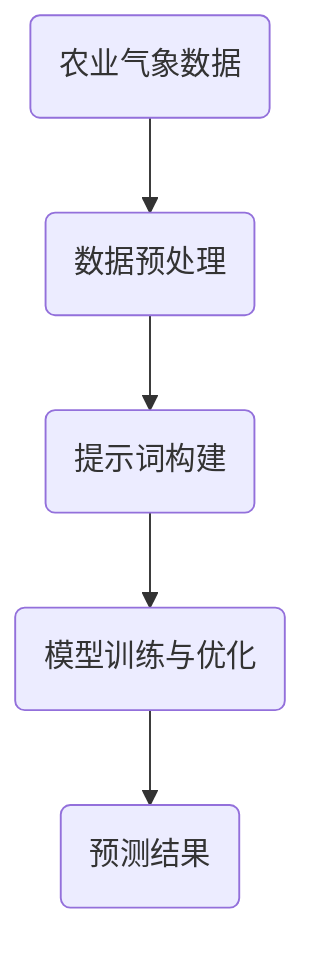

                 


### 第一部分：引言与背景

#### 第1章：智能农业预测概述

**1.1 智能农业的概念与重要性**

智能农业是指利用现代信息技术、物联网技术、大数据分析和人工智能技术，实现农业生产过程智能化和精准化的新型农业形态。随着全球人口的快速增长和资源环境的日益紧张，提高农业生产效率和资源利用效率成为当前农业发展的重要方向。

智能农业预测作为智能农业的重要组成部分，通过数据分析和模型预测，可以帮助农民做出更科学的种植决策，提高产量、减少资源浪费和降低生产成本。其重要性主要体现在以下几个方面：

1. **提高产量和品质**：通过预测作物生长周期、病虫害发生规律等，农民可以合理安排种植计划，优化农事操作，提高作物产量和品质。

2. **降低生产成本**：智能农业预测可以帮助农民精确施肥、灌溉和病虫害防治，避免过度使用农业资源，降低生产成本。

3. **减少环境压力**：通过精准农业技术，可以实现农业生产的生态化、可持续化，减少农业活动对环境的负面影响。

**1.2 农业预测的需求与挑战**

农业预测的需求源于农业生产过程中的多种不确定性因素，如气象条件、土壤状况、病虫害等。为了满足这些需求，农业预测需要解决以下几个挑战：

1. **数据多样性**：农业生产数据包括气象数据、土壤数据、植物生长数据等，这些数据来源多样、格式各异，需要统一处理。

2. **数据质量**：农业生产数据可能存在缺失、异常和噪声等问题，需要数据清洗和预处理。

3. **模型复杂度**：农业预测涉及多种非线性关系，需要选择合适的模型和算法进行建模。

4. **实时性**：农业生产需要实时预测，模型需要具备快速响应能力。

**1.3 提示词工程的基本原理**

提示词工程是一种通过设计提示词（提示词是指一组关键字或短语，用于引导模型学习过程中的特征提取和预测）来优化模型性能的方法。其基本原理如下：

1. **特征提取**：根据业务需求，提取与预测任务相关的特征。

2. **模型训练**：使用提取的特征数据训练预测模型。

3. **提示词优化**：通过调整提示词，提高模型的预测性能。

4. **模型评估**：使用验证集评估模型性能，调整提示词，循环迭代。

**1.4 本书结构安排与内容概览**

本书共分为四个部分，具体内容安排如下：

1. **第一部分：引言与背景**：介绍智能农业预测的概念、需求与挑战，以及提示词工程的基本原理。

2. **第二部分：智能农业中的提示词工程**：详细探讨农业气象数据、土壤健康监测、植物生长参数和农业病虫害预测中的提示词工程。

3. **第三部分：提示词工程应用案例**：分析智能灌溉系统和作物产量预测系统中的提示词工程应用案例。

4. **第四部分：展望与未来趋势**：探讨提示词工程在智能农业预测中的未来发展趋势与潜在应用领域。

通过以上四个部分的介绍，本书旨在为读者提供一个系统、全面、深入的智能农业预测与提示词工程的知识体系。

---

**1.1 智能农业的概念与重要性**

智能农业是一个集成了现代信息技术、物联网、大数据分析和人工智能技术的农业新模式，其核心目标是实现农业生产的智能化和精准化。随着全球人口的快速增长和农业资源的日益紧张，提高农业生产效率、优化资源配置、保障粮食安全成为当前农业发展的关键议题。智能农业预测作为这一新模式的重要组成部分，通过数据驱动的预测方法，助力农业生产的各个环节，从而实现资源的高效利用和农业生产的可持续发展。

首先，智能农业预测的重要性体现在以下几个方面：

1. **优化种植决策**：通过预测作物的生长周期、气候条件、土壤状况等因素，农民可以做出更加科学的种植决策，选择适宜的作物品种和种植时间，从而提高产量和品质。

2. **降低生产成本**：智能农业预测可以帮助农民精确施肥、灌溉和病虫害防治，避免资源的过度使用和浪费，从而降低生产成本。

3. **提高资源利用效率**：智能农业预测可以实时监测和评估农业环境数据，为农民提供准确的农业管理建议，从而提高农业资源利用效率。

4. **保障粮食安全**：智能农业预测有助于及时发现和应对农业生产中的潜在问题，如气象灾害、病虫害等，从而保障粮食生产的安全。

**1.2 农业预测的需求与挑战**

农业预测的需求源于农业生产过程中存在的多种不确定性因素，这些因素对农业生产有着直接或间接的影响。例如，气象条件如温度、湿度、降水量等对作物的生长至关重要；土壤状况如养分含量、酸碱度、水分状况等直接影响作物的生长；病虫害的发生则可能导致作物减产甚至绝收。为了满足这些需求，农业预测需要解决以下几个挑战：

1. **数据多样性**：农业生产数据来源广泛，包括气象数据、土壤数据、植物生长数据、病虫害数据等。这些数据具有不同的格式、单位和质量，需要统一处理。

2. **数据质量**：农业生产数据可能存在缺失、异常和噪声等问题，需要进行数据清洗、缺失值填补和异常值检测等预处理工作，以确保数据的准确性和可靠性。

3. **模型复杂度**：农业预测涉及多种非线性关系，需要选择合适的模型和算法进行建模。不同的预测任务可能需要不同的模型，模型的复杂性增加了预测的难度。

4. **实时性**：农业生产需要实时预测，以指导农民及时采取相应的措施。然而，实时数据获取和处理对计算能力和算法效率提出了更高的要求。

**1.3 提示词工程的基本原理**

提示词工程是一种优化模型性能的方法，通过设计特定的提示词（一组关键字或短语）来引导模型的学习过程。提示词的选择和设计对模型的预测性能具有重要影响。提示词工程的基本原理可以概括为以下几个步骤：

1. **特征提取**：根据预测任务的需求，从原始数据中提取与预测相关的特征。这些特征可以是定量数据，如气象数据、土壤数据等，也可以是定性数据，如病虫害的类型和程度等。

2. **模型训练**：使用提取的特征数据对预测模型进行训练。训练过程中，模型会根据提示词的特征进行学习和优化。

3. **提示词优化**：通过调整提示词，优化模型的预测性能。提示词的优化可以通过多种方式实现，如调整提示词的权重、增加新的提示词、删除无效的提示词等。

4. **模型评估**：使用验证集评估模型的预测性能。根据评估结果，进一步调整提示词，循环迭代，直到达到满意的预测性能。

**1.4 本书结构安排与内容概览**

本书旨在为读者提供一个系统、全面、深入的智能农业预测与提示词工程的知识体系。全书分为四个部分：

第一部分：引言与背景。介绍智能农业预测的概念、需求与挑战，以及提示词工程的基本原理。

第二部分：智能农业中的提示词工程。详细探讨农业气象数据、土壤健康监测、植物生长参数和农业病虫害预测中的提示词工程。

第三部分：提示词工程应用案例。分析智能灌溉系统和作物产量预测系统中的提示词工程应用案例。

第四部分：展望与未来趋势。探讨提示词工程在智能农业预测中的未来发展趋势与潜在应用领域。

通过以上四个部分的介绍，本书旨在帮助读者深入理解智能农业预测与提示词工程的原理、方法与应用，为实际农业生产提供技术支持。

---

# 核心概念与联系

在智能农业预测中，多个核心概念相互关联，构成了一个复杂而有机的系统。以下是这些核心概念及其之间的联系：

## 1. 农业气象数据

农业气象数据是智能农业预测的基础，涵盖了温度、湿度、降水量、风速、日照时长等气象因素。这些数据对作物的生长周期、病虫害发生和产量等有直接影响。农业气象数据通过气象站、卫星遥感、无人机等手段收集，其质量直接关系到预测的准确性。

## 2. 提示词构建

提示词构建是智能农业预测中的关键步骤，旨在从大量农业气象数据中提取与预测任务相关的特征。提示词可以基于统计方法、机器学习方法或深度学习方法，如时间序列分析、神经网络等。

## 3. 模型训练与优化

模型训练与优化是智能农业预测的核心环节，通过使用提示词对模型进行训练，使其能够从历史数据中学习并预测未来的农业状况。优化过程涉及提示词的选择、模型的参数调整和超参数优化。

## 4. 预测结果

预测结果是智能农业预测的直接输出，包括作物产量、病虫害发生时间、灌溉需求等。预测结果的准确性和实时性对农业生产决策至关重要。

## 农业气象数据与提示词构建流程

为了清晰地展示农业气象数据与提示词构建之间的联系，我们可以使用以下 Mermaid 流程图：



在流程图中，农业气象数据首先经过预处理，去除噪声和异常值，然后进行提示词构建。构建的提示词用于模型训练与优化，最终得到预测结果。

### 基于深度学习的土壤水分预测算法

在智能农业中，准确预测土壤水分对灌溉决策至关重要。以下是一个简化的基于深度学习的土壤水分预测算法，使用伪代码来详细阐述：

```python
# 假设输入数据为 [X, Y]
# X: 输入特征矩阵，Y: 标签矩阵

# 模型定义
model = keras.Sequential([
    keras.layers.Dense(64, activation='relu', input_shape=(X.shape[1],)),
    keras.layers.Dense(128, activation='relu'),
    keras.layers.Dense(1)  # 输出层，无激活函数
])

# 模型编译
model.compile(optimizer='adam', loss='mse')

# 模型训练
model.fit(X, Y, epochs=100, batch_size=32, validation_split=0.2)

# 模型评估
test_loss = model.evaluate(X_test, Y_test)
print(f"Test Loss: {test_loss}")

# 预测
predictions = model.predict(X_test)
```

### 数学模型和公式

在土壤水分预测中，常用的数学模型是回归模型。以下是一个简化的回归模型公式：

$$
\hat{y} = \beta_0 + \beta_1 x_1 + \beta_2 x_2 + \ldots + \beta_n x_n
$$

其中，$\hat{y}$ 是预测的土壤水分值，$x_1, x_2, \ldots, x_n$ 是提取的特征值，$\beta_0, \beta_1, \beta_2, \ldots, \beta_n$ 是模型的参数。

### 详细讲解与举例说明

#### 模型构建

在构建深度学习模型时，我们首先需要定义模型的输入层、隐藏层和输出层。输入层负责接收预处理后的土壤水分特征数据。隐藏层通过神经网络进行特征提取和模型学习。输出层则生成预测的土壤水分值。

```python
# 输入层
inputs = keras.layers.Input(shape=(feature_size,))

# 隐藏层
x = keras.layers.Dense(64, activation='relu')(inputs)
x = keras.layers.Dense(128, activation='relu')(x)

# 输出层
outputs = keras.layers.Dense(1)(x)

# 模型定义
model = keras.Model(inputs=inputs, outputs=outputs)
```

#### 模型编译

在编译模型时，我们选择优化器为 'adam'，损失函数为 'mse'（均方误差）。优化器用于调整模型参数，以最小化损失函数。

```python
model.compile(optimizer='adam', loss='mse')
```

#### 模型训练

模型训练是使用训练数据对模型进行学习的过程。在训练过程中，模型会通过反向传播算法不断调整参数，以减少预测误差。

```python
model.fit(X_train, Y_train, epochs=100, batch_size=32, validation_split=0.2)
```

这里，`epochs` 设置为 100，表示模型训练循环 100 次。`batch_size` 设置为 32，表示每次训练使用 32 个样本。`validation_split` 设置为 0.2，表示从训练集中划分 20% 的数据用于验证。

#### 模型评估

模型评估是使用验证集或测试集来评估模型性能的过程。我们通过计算测试损失来评估模型的预测能力。

```python
test_loss = model.evaluate(X_test, Y_test)
print(f"Test Loss: {test_loss}")
```

#### 预测

模型预测是使用训练好的模型对新的数据进行预测的过程。我们可以使用模型的方法 `predict()` 来获取预测结果。

```python
predictions = model.predict(X_test)
```

### 结论

基于深度学习的土壤水分预测算法通过定义神经网络结构、编译模型、训练模型和评估模型，能够有效预测土壤水分。在实际应用中，我们可以根据具体需求调整模型结构、优化超参数，以提高预测准确性。

### 注意事项

1. 数据质量直接影响模型预测准确性，因此在进行预测前，需对数据质量进行严格检查和处理。
2. 模型训练时间较长，应根据计算资源和数据规模合理调整训练参数。
3. 模型训练过程中，可以采用交叉验证、早停（early stopping）等技术来提高训练效率和预测性能。

### 拓展阅读

- Goodfellow, I., Bengio, Y., & Courville, A. (2016). *Deep Learning*. MIT Press.
- Kingma, D. P., & Welling, M. (2014). *Auto-encoding variational bayes*.
- Rumelhart, D. E., Hinton, G. E., & Williams, R. J. (1986). *Learning representations by back-propagating errors*.

---

### 第2章：农业气象数据与提示词构建

**2.1 农业气象数据的重要性**

农业气象数据在智能农业预测中扮演着至关重要的角色。这些数据包括温度、湿度、降水量、风速、日照时长等气象因素，它们直接影响作物的生长、病虫害的发生以及农业生产的总体效益。精确的气象数据能够帮助农民及时调整农事操作，如灌溉、施肥和病虫害防治，从而提高产量和降低成本。农业气象数据的重要性主要体现在以下几个方面：

1. **影响作物生长周期**：不同作物对气象条件有不同的需求。精确的气象数据可以帮助农民确定最佳的种植时间，避免因气象条件不适导致的减产。

2. **预测病虫害发生**：气象数据与病虫害的发生有着密切的联系。例如，高湿度可能导致病害的传播，而干旱天气可能有助于控制某些害虫。通过分析气象数据，可以预测病虫害的发生趋势，提前采取防治措施。

3. **优化水资源管理**：气象数据对灌溉决策至关重要。准确的降水量预测可以帮助农民合理安排灌溉计划，避免水资源浪费。

4. **降低生产成本**：通过精确的气象数据，农民可以优化农事操作，减少不必要的人工干预，降低生产成本。

**2.2 提示词构建方法**

提示词构建是将原始气象数据转化为适合机器学习模型处理的形式的关键步骤。以下介绍几种常用的提示词构建方法：

1. **基于统计的方法**：
   - **时间序列分析**：通过分析气象数据的时序特性，提取周期性、趋势性和季节性特征。
   - **相关分析**：计算气象因素之间的相关性，识别出对作物生长影响较大的关键因素。

2. **基于机器学习的方法**：
   - **特征选择**：使用机器学习算法，如主成分分析（PCA）、线性判别分析（LDA）等，从原始气象数据中提取重要特征。
   - **自动特征工程**：利用深度学习技术，如卷积神经网络（CNN）和循环神经网络（RNN），自动学习数据中的高级特征。

3. **基于深度学习的方法**：
   - **卷积神经网络（CNN）**：适用于处理图像数据，可以用于提取气象数据的时空特征。
   - **循环神经网络（RNN）**：适用于处理序列数据，可以捕捉时间序列中的长期依赖关系。
   - **长短期记忆网络（LSTM）**：是 RNN 的一种变体，可以有效避免传统 RNN 的梯度消失问题。

**2.2.1 基于统计的方法**

基于统计的方法简单直观，适用于数据量较小且特征明显的场景。以下是一个简化的时间序列分析流程：

1. **数据预处理**：对气象数据进行清洗和预处理，包括缺失值填补、异常值处理和归一化等。

2. **特征提取**：
   - **季节性特征**：通过分解时间序列，提取季节性成分，如使用季节性分解方法（STL）。
   - **趋势性特征**：通过移动平均、指数平滑等方法提取时间序列的趋势成分。
   - **周期性特征**：通过傅里叶变换等方法提取时间序列的周期性成分。

3. **相关性分析**：计算气象因素之间的相关性，识别出对作物生长影响较大的关键因素。

**2.2.2 基于机器学习的方法**

基于机器学习的方法可以处理大量数据，并自动提取复杂特征。以下是一个简化的机器学习方法流程：

1. **数据预处理**：对气象数据进行清洗和预处理，包括缺失值填补、异常值处理和归一化等。

2. **特征选择**：
   - **主成分分析（PCA）**：通过降低数据维度，提取数据的主要成分，保留关键信息。
   - **线性判别分析（LDA）**：通过最大化不同类别之间的差异，最小化类别内部差异，提取有区分力的特征。

3. **自动特征工程**：
   - **卷积神经网络（CNN）**：用于提取图像数据中的时空特征。
   - **循环神经网络（RNN）**：用于处理序列数据，如时间序列数据。

**2.2.3 基于深度学习的方法**

基于深度学习的方法在处理复杂数据和提取高级特征方面具有显著优势。以下是一个简化的深度学习方法流程：

1. **数据预处理**：对气象数据进行清洗和预处理，包括缺失值填补、异常值处理和归一化等。

2. **特征提取**：
   - **卷积神经网络（CNN）**：适用于处理图像数据，可以提取气象数据的时空特征。
   - **循环神经网络（RNN）**：适用于处理序列数据，如时间序列数据。
   - **长短期记忆网络（LSTM）**：是 RNN 的一种变体，可以有效避免传统 RNN 的梯度消失问题。

3. **模型训练与优化**：
   - **模型定义**：根据预测任务，定义神经网络结构，包括输入层、隐藏层和输出层。
   - **模型编译**：选择优化器、损失函数和评估指标，编译模型。
   - **模型训练**：使用训练数据对模型进行训练，通过反向传播算法优化模型参数。
   - **模型评估**：使用验证集评估模型性能，调整模型参数。

**2.3 农业气象数据预处理**

农业气象数据预处理是确保数据质量和模型性能的关键步骤。以下介绍几种常用的预处理方法：

1. **数据清洗**：包括缺失值填补、异常值处理等。缺失值填补可以使用插值法、均值法等，异常值处理可以使用标准差法、箱线图法等。

2. **数据归一化**：将数据缩放至相同范围，如 [0, 1] 或 [-1, 1]，以消除不同特征之间的尺度差异。

3. **特征提取**：使用统计学方法或机器学习方法，提取与预测任务相关的特征。

4. **数据整合**：将不同来源、不同格式的数据整合为一个统一的数据集。

通过以上预处理方法，可以提高农业气象数据的质量和模型的预测性能，为智能农业预测提供可靠的数据基础。

### 结论

农业气象数据与提示词构建在智能农业预测中具有关键作用。通过多种提示词构建方法，可以从大量气象数据中提取关键特征，优化模型预测性能。合理的预处理步骤可以确保数据质量，为智能农业预测提供坚实的数据基础。

### 拓展阅读

- **时间序列分析**：
  - Box, G. E. P., Jenkins, G. M., & Reinsel, G. C. (2015). *Time Series Analysis: Forecasting and Control*. Wiley.
  - Hyndman, R. J., & Athanasopoulos, G. (2018). *Forecasting: principles and practice*. OTexts.

- **机器学习特征工程**：
  - Pedregosa, F., Varoquaux, G., Gramfort, A., Michel, V., Thirion, B., Grisel, O., ... & Duchesnay, É. (2011). *Scikit-learn: Machine learning in Python*. Journal of Machine Learning Research, 12, 2825-2830.
  - Alpaydin, E. (2010). *Introduction to Machine Learning*. MIT Press.

- **深度学习**：
  - Goodfellow, I., Bengio, Y., & Courville, A. (2016). *Deep Learning*. MIT Press.
  - Hochreiter, S., & Schmidhuber, J. (1997). *Long short-term memory*. Neural Computation, 9(8), 1735-1780.

---

### 2.3 农业气象数据预处理

在构建智能农业预测模型时，农业气象数据的预处理是至关重要的一步。预处理工作的质量直接影响到后续模型的训练效果和预测准确性。以下将详细介绍农业气象数据预处理的关键步骤，包括数据清洗、数据归一化和特征提取。

**2.3.1 数据清洗**

数据清洗是预处理的首要任务，目的是识别并处理数据集中的缺失值、异常值和重复数据。以下是数据清洗的几个关键步骤：

1. **缺失值填补**：对于缺失值，可以使用多种方法进行填补，如：
   - **均值填补**：用列的平均值填补缺失值。
   - **中值填补**：用列的中值填补缺失值。
   - **插值法**：对于时间序列数据，可以使用线性插值、高斯插值等方法填补缺失值。
   - **模型填补**：使用机器学习模型，如线性回归模型，预测缺失值。

2. **异常值处理**：异常值可能是由于数据记录错误、设备故障等原因导致的，需要仔细处理。常见的方法包括：
   - **标准差法**：剔除与平均值相差超过3倍标准差的观测值。
   - **箱线图法**：剔除位于上下箱线之外的数据点。
   - **自定义规则**：根据具体业务逻辑，设定合理的阈值进行异常值处理。

3. **重复数据去除**：在数据集中可能会存在重复的观测值，这些数据需要被去除，以避免对模型训练产生干扰。

**2.3.2 数据归一化**

数据归一化的目的是将不同特征的数据缩放到相同的尺度范围内，以便于后续的模型训练和比较。以下介绍几种常见的归一化方法：

1. **最小-最大归一化**：将数据缩放到 [0, 1] 范围内，公式如下：
   $$
   x_{\text{norm}} = \frac{x_{\text{original}} - x_{\text{min}}}{x_{\text{max}} - x_{\text{min}}}
   $$
   其中，$x_{\text{original}}$ 是原始数据，$x_{\text{min}}$ 和 $x_{\text{max}}$ 分别是数据的最小值和最大值。

2. **零-均值归一化**：将数据缩放到 [-1, 1] 范围内，公式如下：
   $$
   x_{\text{norm}} = \frac{x_{\text{original}} - \mu}{\sigma}
   $$
   其中，$\mu$ 是数据的平均值，$\sigma$ 是数据的标准差。

3. **标准归一化**：将数据缩放到任意范围内，公式如下：
   $$
   x_{\text{norm}} = a \cdot x_{\text{original}} + b
   $$
   其中，$a$ 和 $b$ 是待调整的参数，通常通过最小化数据方差来确定。

**2.3.3 特征提取**

特征提取是从原始数据中提取对预测任务有用的信息的过程。有效的特征提取可以简化数据维度，减少模型复杂性，提高模型性能。以下介绍几种常用的特征提取方法：

1. **主成分分析（PCA）**：PCA 是一种常用的降维技术，通过保留主要成分，降低数据维度。PCA 的核心思想是找到数据的主要变化方向，并将其作为新的特征。

2. **线性判别分析（LDA）**：LDA 是一种特征提取方法，旨在最大化不同类别之间的差异，最小化类别内部差异。LDA 常用于分类任务中的特征提取。

3. **自动特征工程**：自动特征工程使用机器学习算法，如神经网络，自动提取数据中的高级特征。这种方法特别适用于处理复杂数据集。

通过以上预处理步骤，农业气象数据的质量得到显著提升，为后续的模型训练和预测奠定了坚实的基础。

### 结论

农业气象数据预处理是智能农业预测的重要环节。通过数据清洗、数据归一化和特征提取，我们可以确保数据的质量和一致性，提高模型的预测性能。有效的预处理方法不仅可以消除数据中的噪声和异常值，还可以提取出对预测任务有价值的特征，为智能农业预测提供可靠的数据支持。

### 拓展阅读

- **数据清洗与预处理**：
  - Han, J., Kamber, M., & Pei, J. (2012). *Data Mining: Concepts and Techniques*. Morgan Kaufmann.
  - Liu, H., & Ting, K. M. (2002). *Data cleaning: A survey*. ACM Computing Surveys (CSUR), 34(2), 179-222.

- **特征提取与降维**：
  - Jolliffe, I. T. (2002). *Principal component analysis*. Springer.
  - Hastie, T., Tibshirani, R., & Friedman, J. (2009). *The Elements of Statistical Learning: Data Mining, Inference, and Prediction*. Springer.

---

### 第3章：土壤健康监测与提示词工程

**3.1 土壤健康监测的基本概念**

土壤健康监测是智能农业的重要组成部分，旨在评估土壤的物理、化学和生物特性，从而为农业管理提供科学依据。健康的土壤是农业生产的基础，直接影响作物生长、产量和品质。土壤健康监测的基本概念包括以下几个方面：

1. **土壤物理特性**：土壤的质地、结构、孔隙度和水分含量等物理特性，直接影响根系生长和水分、养分的渗透性。

2. **土壤化学特性**：土壤的pH值、有机质含量、养分含量（如氮、磷、钾等）以及重金属和其他污染物的含量等化学特性。

3. **土壤生物特性**：土壤中微生物的种类和数量、有益生物和有害生物的比例等生物特性，对土壤的生态平衡和养分循环有重要影响。

**3.2 土壤健康相关的提示词构建**

土壤健康相关的提示词构建是指从大量的土壤数据中提取对土壤健康有代表性的特征，用于训练预测模型。以下介绍几种常用的方法：

1. **基于统计的方法**：
   - **土壤养分提示词**：通过计算土壤中氮、磷、钾等养分的浓度，构建相应的提示词。
   - **土壤pH提示词**：计算土壤的酸碱度，作为土壤健康评估的重要指标。

2. **基于机器学习的方法**：
   - **主成分分析（PCA）**：从大量土壤数据中提取主要成分，减少数据维度，保留关键特征。
   - **线性判别分析（LDA）**：用于提取能够区分健康土壤和不健康土壤的特征。

3. **基于深度学习的方法**：
   - **卷积神经网络（CNN）**：适用于处理高维数据，可以提取土壤图像中的特征。
   - **循环神经网络（RNN）**：适用于处理时间序列数据，可以捕捉土壤特性随时间的变化。

**3.2.1 土壤养分提示词**

土壤养分是土壤健康的重要指标，直接关系到作物的生长和产量。土壤养分提示词的构建方法如下：

1. **土壤养分浓度**：直接测量土壤中氮、磷、钾等养分的浓度，作为土壤养分的提示词。
2. **土壤养分比例**：计算土壤中不同养分之间的比例关系，例如氮磷比、氮钾比等，作为土壤养分提示词。
3. **土壤养分变化率**：计算土壤养分随时间的变化率，用于评估土壤养分的动态变化。

**3.2.2 土壤水分提示词**

土壤水分是土壤健康的重要指标，直接影响根系吸收水分和养分的能力。土壤水分提示词的构建方法如下：

1. **土壤水分含量**：直接测量土壤的含水量，作为土壤水分提示词。
2. **土壤水分动态**：通过记录土壤水分随时间的变化，构建土壤水分动态提示词。
3. **土壤水分渗透率**：测量土壤水分渗透速度，作为土壤水分提示词。

**3.2.3 土壤温度提示词**

土壤温度是影响土壤生物活性和养分转化的重要因素。土壤温度提示词的构建方法如下：

1. **土壤温度平均值**：计算土壤温度的日平均值或月平均值，作为土壤温度提示词。
2. **土壤温度波动**：记录土壤温度的日波动范围或月波动范围，作为土壤温度提示词。
3. **土壤温度变化趋势**：通过时间序列分析，构建土壤温度的变化趋势提示词。

**3.3 土壤健康监测数据预处理**

土壤健康监测数据通常包含多种来源的数据，如实验室分析数据、遥感数据和地面观测数据。预处理步骤如下：

1. **数据清洗**：去除异常值、缺失值和重复值，确保数据的完整性。
2. **数据归一化**：将不同量纲的数据归一化，以便于模型训练。
3. **数据整合**：将来自不同来源的数据整合到一个统一的数据集中，便于分析。

**3.3.1 数据采集**

数据采集是土壤健康监测的关键步骤，以下介绍几种常见的土壤数据采集方法：

1. **实验室分析**：通过实验室分析，测量土壤中的养分、污染物等含量。
2. **遥感技术**：利用卫星遥感技术，获取大范围、高分辨率的土壤特性数据。
3. **地面观测**：通过地面观测设备，如土壤湿度传感器、温度传感器等，实时监测土壤特性。

**3.3.2 数据校验**

数据校验是确保数据质量的重要步骤，以下介绍几种常见的数据校验方法：

1. **一致性检查**：检查不同来源的数据是否一致，如遥感数据和地面观测数据是否匹配。
2. **完整性检查**：检查数据是否完整，如是否有缺失值或异常值。
3. **准确性检查**：通过对比不同来源的数据，验证数据的准确性。

**3.3.3 数据整合**

数据整合是将来自不同来源的数据整合为一个统一的数据集，以便进行后续分析。以下介绍几种常见的数据整合方法：

1. **空间整合**：将不同空间分辨率的数据整合到同一空间参考系下。
2. **时间整合**：将不同时间点的数据整合到同一时间序列中。
3. **属性整合**：将不同类型的数据整合到同一数据结构中，如数据库或数据表。

通过以上步骤，土壤健康监测数据的质量得到显著提升，为智能农业预测提供了可靠的数据基础。

### 结论

土壤健康监测与提示词构建是智能农业预测的关键环节。通过构建土壤养分、水分和温度等提示词，可以有效地评估土壤健康，为农业生产提供科学依据。有效的数据预处理和整合步骤确保了土壤数据的质量和一致性，为智能农业预测提供了坚实的数据支持。

### 拓展阅读

- **土壤健康监测技术**：
  - Brussaard, L. (2011). *Soil biodiversity and health*. Springer.
  - Murphy, J. (2007). *Soil Science: An Integrated University Course*. Blackwell.

- **机器学习与特征工程**：
  - Alpaydin, E. (2010). *Introduction to Machine Learning*. MIT Press.
  - Pedregosa, F., Varoquaux, G., Gramfort, A., Michel, V., Thirion, B., Grisel, O., ... & Duchesnay, É. (2011). *Scikit-learn: Machine Learning in Python*. Journal of Machine Learning Research, 12, 2825-2830.

---

### 3.3 土壤健康监测数据预处理

土壤健康监测数据的质量直接影响到后续分析的准确性和模型的预测性能。因此，对土壤健康监测数据进行预处理是智能农业预测中的一个关键环节。以下是土壤健康监测数据预处理的具体方法和步骤。

**3.3.1 数据采集**

数据采集是土壤健康监测的第一步，确保数据源的多样性和准确性至关重要。常见的数据采集方法包括：

1. **实验室分析**：通过实验室分析，获取土壤的物理、化学和生物特性数据，如土壤养分含量、pH值、有机质含量等。

2. **遥感技术**：利用卫星遥感技术，获取大范围、高分辨率的土壤特性数据，如土壤湿度、温度等。

3. **地面观测**：通过地面观测设备，如土壤湿度传感器、温度传感器、土壤养分测量仪等，实时监测土壤特性。

**3.3.2 数据校验**

数据校验是确保数据质量的重要步骤，以下介绍几种常见的数据校验方法：

1. **一致性检查**：检查不同来源的数据是否一致，如遥感数据和地面观测数据是否匹配。可以通过对比不同来源的数据值和记录时间，确保数据的统一性和可靠性。

2. **完整性检查**：检查数据是否完整，如是否有缺失值或异常值。缺失值可以通过插值法、均值法等填补，异常值可以通过标准差法、箱线图法等剔除。

3. **准确性检查**：通过对比不同来源的数据，验证数据的准确性。可以使用已知标准或实验室分析结果作为基准，评估遥感数据和地面观测数据的准确性。

**3.3.3 数据整合**

数据整合是将不同来源、不同格式和不同时间尺度的数据整合为一个统一的数据集，以便进行后续分析。以下是几种常见的数据整合方法：

1. **空间整合**：将不同空间分辨率的数据整合到同一空间参考系下。例如，将高分辨率遥感数据与低分辨率地面观测数据整合，以获取更详细的土壤健康信息。

2. **时间整合**：将不同时间点的数据整合到同一时间序列中。例如，将不同年份的土壤养分数据整合，以分析土壤养分的长期变化趋势。

3. **属性整合**：将不同类型的数据整合到同一数据结构中，如数据库或数据表。例如，将土壤养分数据、土壤湿度数据和土壤温度数据整合到同一数据表中，以便进行多变量分析。

**3.3.4 数据清洗**

数据清洗是预处理的核心步骤，目的是去除噪声、异常值和重复数据，确保数据的准确性和一致性。以下是几种常见的数据清洗方法：

1. **异常值处理**：通过标准差法、箱线图法等检测和剔除异常值。例如，如果某个观测点的土壤养分含量明显偏离其他观测点，可以认为该值为异常值。

2. **缺失值填补**：对于缺失值，可以使用插值法、均值法等填补。例如，如果某个时间点的土壤湿度数据缺失，可以取前后两个时间点的平均值作为填补值。

3. **重复值去除**：检查数据集中是否存在重复值，并去除重复值。例如，如果同一时间点在同一地点有多个观测值，只需保留其中一个。

**3.3.5 数据归一化**

数据归一化是将不同量纲的数据缩放到同一尺度范围内，以消除不同特征之间的尺度差异，提高模型的训练效果。以下是几种常见的归一化方法：

1. **最小-最大归一化**：将数据缩放到 [0, 1] 范围内，公式如下：
   $$
   x_{\text{norm}} = \frac{x_{\text{original}} - x_{\text{min}}}{x_{\text{max}} - x_{\text{min}}}
   $$
   其中，$x_{\text{original}}$ 是原始数据，$x_{\text{min}}$ 和 $x_{\text{max}}$ 分别是数据的最小值和最大值。

2. **零-均值归一化**：将数据缩放到 [-1, 1] 范围内，公式如下：
   $$
   x_{\text{norm}} = \frac{x_{\text{original}} - \mu}{\sigma}
   $$
   其中，$\mu$ 是数据的平均值，$\sigma$ 是数据的标准差。

3. **标准归一化**：将数据缩放到任意范围内，公式如下：
   $$
   x_{\text{norm}} = a \cdot x_{\text{original}} + b
   $$
   其中，$a$ 和 $b$ 是待调整的参数，通常通过最小化数据方差来确定。

**3.3.6 数据特征提取**

数据特征提取是从原始数据中提取对预测任务有用的信息的过程。有效的特征提取可以简化数据维度，减少模型复杂性，提高模型性能。以下是几种常见的特征提取方法：

1. **主成分分析（PCA）**：通过保留主要成分，降低数据维度，提取数据的主要特征。

2. **线性判别分析（LDA）**：通过最大化不同类别之间的差异，最小化类别内部差异，提取有区分力的特征。

3. **自动特征工程**：利用机器学习算法，如神经网络，自动提取数据中的高级特征。

通过以上预处理步骤，土壤健康监测数据的质量得到显著提升，为后续的模型训练和预测奠定了坚实的基础。

### 结论

土壤健康监测数据预处理是确保数据质量和模型性能的重要环节。通过数据采集、数据校验、数据整合、数据清洗、数据归一化和数据特征提取，可以有效提升土壤健康监测数据的质量，为智能农业预测提供可靠的数据支持。

### 拓展阅读

- **土壤健康监测技术**：
  - Brussaard, L. (2011). *Soil biodiversity and health*. Springer.
  - Murphy, J. (2007). *Soil Science: An Integrated University Course*. Blackwell.

- **数据预处理与特征工程**：
  - Han, J., Kamber, M., & Pei, J. (2012). *Data Mining: Concepts and Techniques*. Morgan Kaufmann.
  - Alpaydin, E. (2010). *Introduction to Machine Learning*. MIT Press.

