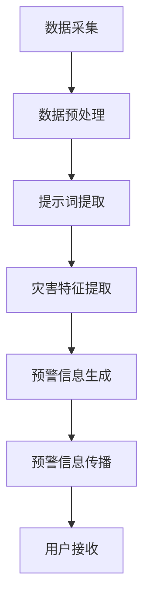

                 

# 提示词工程在智能灾害预警中的应用

## 关键词

- 提示词工程
- 智能灾害预警
- 自然语言处理
- 数据挖掘
- 算法实现
- 数学模型

## 摘要

随着科技的进步，智能灾害预警系统越来越受到重视。提示词工程作为一种先进的技术手段，在灾害预警中发挥着重要作用。本文首先介绍了提示词工程的定义、目的和核心概念，然后探讨了智能灾害预警的基本原理，以及提示词工程在灾害预警中的关键应用。接着，本文详细讲解了提示词工程的基本技术，包括自然语言处理基础、提示词生成算法和优化策略。随后，本文介绍了智能灾害预警中的关键算法，包括地震预警、洪水预警和风暴预警算法。为了使读者更好地理解，本文还提供了具体的项目实战，包括地震预警系统、洪水预警系统和风暴预警系统的开发环境搭建、算法实现和性能评估。最后，本文展望了提示词工程在智能灾害预警中的发展趋势和未来应用前景。

## 引言

自然灾害如地震、洪水和风暴等对人类生活和社会经济造成了巨大的影响。近年来，随着全球气候变化和环境恶化，自然灾害的频率和强度逐渐增加。为了减轻灾害造成的损失，提高灾害预警的准确性和及时性变得尤为重要。智能灾害预警系统作为一种先进的技术手段，正逐渐成为防灾减灾的重要工具。

提示词工程作为一种人工智能技术，近年来在各个领域得到了广泛的应用。它通过分析大量的文本数据，提取出与特定主题相关的关键词和短语，为后续的文本分析和信息检索提供支持。在智能灾害预警中，提示词工程可以用于灾害数据的分析、预警信息的生成和传播等环节，从而提高灾害预警的效率和准确性。

本文旨在探讨提示词工程在智能灾害预警中的应用，通过介绍提示词工程的定义、目的和核心概念，分析智能灾害预警的基本原理，讲解提示词工程的基本技术，以及介绍智能灾害预警中的关键算法和项目实战，为读者提供全面的了解和指导。

## 提示词工程的定义与核心概念

### 提示词工程的定义

提示词工程（Keyword Engineering）是一种利用自然语言处理（Natural Language Processing，NLP）和数据挖掘（Data Mining）技术，从大量文本数据中提取出与特定主题相关的高质量关键词和短语的方法。这些关键词和短语被称为“提示词”（Keywords）或“主题词”（Topics），它们在信息检索、文本分类、文本聚类、机器翻译、问答系统等应用中发挥着重要作用。

提示词工程的主要目的是提高文本分析的准确性和效率，通过提取出与特定主题高度相关的提示词，可以更好地理解和处理相关文本数据。在智能灾害预警中，提示词工程可以用于灾害数据的分析、预警信息的生成和传播等环节，从而提高灾害预警的效率和准确性。

### 核心概念与联系

#### 提示词、关键词、主题概念的关系

提示词、关键词和主题概念是提示词工程中三个重要的核心概念，它们之间存在着密切的联系和区别。

- **提示词**：提示词是从文本数据中提取出来的与特定主题相关的高频词、实义词或短语。它们通常具有明确的语义和较高的信息含量。
- **关键词**：关键词是提示词的一种，它通常指用于信息检索或文本分类的一组核心词汇。关键词的选择通常取决于应用场景和任务目标。
- **主题概念**：主题概念是描述文本数据主题的核心概念或概念集合。它通常由一组相关的提示词组成，用于表示文本的主题或内容。

#### 提示词工程与其他领域的关系

提示词工程不仅与自然语言处理和数据挖掘领域密切相关，还与其他多个领域有着广泛的联系。

- **自然语言处理**：自然语言处理是提示词工程的基础，它包括文本预处理、词性标注、句法分析、语义分析等关键技术。这些技术为提示词的提取和优化提供了支持。
- **数据挖掘**：数据挖掘是提示词工程的核心，它包括特征选择、聚类、分类、关联规则挖掘等算法。这些算法用于从大量文本数据中提取出有用的提示词和主题概念。
- **机器学习**：机器学习是提示词工程的重要工具，它包括监督学习、无监督学习和强化学习等方法。这些方法用于训练模型，优化提示词的提取和生成。
- **信息检索**：信息检索是提示词工程的应用之一，它包括搜索引擎、问答系统、推荐系统等。这些应用利用提示词工程技术，实现高效的文本检索和推荐。

### 提示词工程在智能灾害预警中的应用

在智能灾害预警中，提示词工程可以应用于多个环节，包括灾害数据的采集、处理、分析和预警信息的生成和传播。

#### 灾害数据采集

灾害数据采集是智能灾害预警的第一步。通过传感器、卫星、遥感等技术，可以实时获取大量的灾害数据，如地震波、水位、风速等。这些数据通常包含丰富的信息，但同时也存在噪声和冗余。提示词工程可以帮助从这些数据中提取出与灾害相关的关键词和短语，从而提高数据的质量和准确性。

#### 灾害数据处理

灾害数据处理是对采集到的数据进行预处理、清洗、归一化等操作，以便后续的分析和处理。提示词工程在这一阶段可以用于提取灾害特征，如地震震级、洪水水位、风暴路径等。这些特征是灾害预警的重要依据。

#### 灾害数据分

## 提示词工程的基本技术

提示词工程是智能灾害预警系统的重要组成部分，它依赖于一系列先进的技术手段，包括自然语言处理、机器学习和数据挖掘。以下将详细介绍提示词工程的基本技术，并探讨这些技术在智能灾害预警中的应用。

### 自然语言处理基础

自然语言处理（NLP）是提示词工程的基础，它涉及到文本表示、文本预处理、词性标注、句法分析和语义分析等方面。以下是一些关键的NLP技术：

#### 词向量表示

词向量表示是将文本中的词语映射到高维空间中的向量表示。这种表示方法可以捕捉词语之间的语义关系。常见的词向量模型包括Word2Vec、GloVe和BERT等。

- **Word2Vec**：通过训练神经网络模型，将词语映射到连续的向量空间，使得语义相近的词语具有相似的向量表示。
- **GloVe**：基于全局矩阵分解的方法，将词语的共现信息纳入考虑，从而生成高质量的词向量表示。
- **BERT**：引入双向编码表示器，通过预训练大规模文本数据，生成捕捉词语双向依赖关系的词向量表示。

#### 文本分类和聚类算法

文本分类和聚类是NLP中常用的任务，用于对大量文本数据进行分类和分组。

- **文本分类**：通过训练分类模型，将文本数据分为预定义的类别。常见的分类算法包括朴素贝叶斯、支持向量机（SVM）和深度学习模型（如CNN和RNN）。
- **文本聚类**：将文本数据根据其内容相似度进行分组，形成多个簇。常用的聚类算法包括K-means、层次聚类和DBSCAN等。

### 提示词生成算法

提示词生成是提示词工程的核心任务，其目的是从文本数据中提取出与特定主题相关的高质量关键词。以下是一些常见的提示词生成算法：

#### 基于规则的方法

基于规则的方法通过定义一组规则，从文本数据中提取关键词。这些规则可以是简单的正则表达式，也可以是复杂的语法规则。

- **TF-IDF**：通过计算词语的频率（TF）和逆文档频率（IDF），评估词语的重要性，从而提取出高频率且具有高信息含量的关键词。
- **关键词提取规则**：根据特定的语法和语义规则，提取出与主题相关的关键词。

#### 基于机器学习的方法

基于机器学习的方法利用大量标注数据，训练模型来自动提取关键词。

- **监督学习**：通过训练分类模型，将文本数据标记为是否为关键词。常用的分类算法包括朴素贝叶斯、支持向量机和深度学习模型。
- **无监督学习**：通过聚类算法，将文本数据根据其内容相似度进行分组，每个簇的中心词可以作为关键词。

### 提示词优化策略

为了提高提示词的质量和多样性，可以采用以下优化策略：

#### 提示词的多样性

通过引入多样性度量，如词频分布、语义相似度等，确保提取出的提示词具有多样性。

- **词频分布**：通过调整词频阈值，控制高频词和低频词的比例，实现提示词的多样性。
- **语义相似度**：通过计算词语之间的语义相似度，选择具有相似语义的词语作为提示词。

#### 提示词的覆盖度

通过评估提示词的覆盖度，确保提取出的提示词能够涵盖文本数据的主要主题。

- **主题覆盖度**：通过计算每个提示词所覆盖的主题数量，评估提示词的覆盖度。
- **文本覆盖度**：通过计算提示词在文本数据中的分布情况，评估提示词的覆盖度。

#### 提示词的质量评估

通过评估提示词的质量，如信息含量、语义相关性和文本覆盖度等，筛选出高质量的提示词。

- **信息含量**：通过计算提示词的信息熵，评估其信息含量。
- **语义相关性**：通过计算提示词之间的语义相似度，评估其语义相关性。

### 提示词工程在智能灾害预警中的应用

在智能灾害预警中，提示词工程可以应用于多个环节，包括灾害数据的预处理、预警信息的生成和传播等。

#### 灾害数据预处理

在灾害数据预处理阶段，提示词工程可以用于提取灾害特征，如地震震级、洪水水位和风暴路径等。这些特征是灾害预警的重要依据。

- **灾害数据分类**：通过训练分类模型，将不同类型的灾害数据分为预定义的类别。
- **灾害数据聚类**：通过聚类算法，将相似类型的灾害数据分组，便于后续分析。

#### 预警信息生成

在预警信息生成阶段，提示词工程可以用于提取与灾害相关的关键词和短语，生成预警信息。

- **关键词提取**：通过基于规则或机器学习的方法，从灾害数据中提取关键词。
- **文本生成**：通过自然语言生成（NLG）技术，将提取出的关键词和短语组合成完整的预警信息。

#### 预警信息传播

在预警信息传播阶段，提示词工程可以用于优化预警信息的传播策略，提高预警信息的覆盖率和准确性。

- **信息过滤**：通过过滤技术，去除与灾害无关的信息，提高预警信息的准确性。
- **信息推荐**：通过推荐系统技术，将预警信息推荐给相关人员，提高预警信息的覆盖率。

### 总结

提示词工程是智能灾害预警系统的重要组成部分，它通过提取与灾害相关的关键词和短语，为灾害数据的分析和预警信息的生成提供支持。自然语言处理、机器学习和数据挖掘等基本技术是提示词工程的核心，通过这些技术，可以有效地提取和优化提示词，提高灾害预警的准确性和及时性。

## 智能灾害预警中的关键算法

智能灾害预警系统的核心在于能够及时、准确地预测和识别灾害事件。提示词工程在这一过程中发挥着关键作用，通过高效地提取和优化关键词，可以显著提升预警系统的性能。以下将介绍智能灾害预警中的关键算法，包括地震预警、洪水预警和风暴预警算法，并探讨提示词工程如何应用于这些算法中。

### 地震预警算法

地震预警是智能灾害预警中的重要一环，其目标是在地震发生时尽可能提前通知公众，从而减少人员伤亡和财产损失。地震预警算法通常包括以下几个步骤：

#### 震源定位

震源定位是地震预警的首要任务。提示词工程在震源定位中发挥作用，通过提取地震波数据中的关键词和特征，如P波、S波的速度差异和到达时间差，可以精确地确定震源的位置。

- **震源定位算法**：基于双差法（Double Difference Method）和层析成像法（Tomographic Imaging），通过计算地震波的传播时间和路径，确定震源位置。
- **提示词生成**：使用自然语言处理技术，从地震波数据中提取关键词，如“P波”、“S波”、“震中距离”等，用于辅助震源定位。

#### 震级预测

震级预测是地震预警的另一个关键步骤。通过分析历史地震数据，建立震级预测模型，可以预测地震的震级大小。

- **震级预测模型**：常用的模型包括地震统计模型（如震级频度模型）和地震动力学模型（如地震断层模型）。
- **提示词生成**：在模型训练过程中，从历史地震数据中提取关键词，如“震中位置”、“震源深度”、“地震波参数”等，用于训练模型。

#### 震中时间预测

预测地震震中到达时间对于提高预警系统的响应速度至关重要。通过分析地震波的传播速度和路径，可以预测地震震中到达各个监测点的具体时间。

- **震中时间预测算法**：基于地震波的传播模型和时间延迟模型，计算震中到达时间。
- **提示词生成**：在算法中，使用关键词表示地震波的传播路径和速度，如“地震波路径”、“传播速度”等。

### 洪水预警算法

洪水预警是另一个重要的灾害预警领域，它旨在通过预测洪水发生的时间和地点，提前发布预警信息，以减少洪水灾害的影响。

#### 洪水预报模型

洪水预报模型是洪水预警的核心，通过分析历史洪水数据和水文参数，可以预测未来洪水的情况。

- **洪水预报模型**：常用的模型包括水文模型（如SCS模型）和统计模型（如时间序列模型）。
- **提示词生成**：在模型训练过程中，从水文数据中提取关键词，如“降雨量”、“径流量”、“水位”等，用于训练模型。

#### 洪水风险评估

洪水风险评估是洪水预警的重要组成部分，通过对不同区域的洪水风险进行评估，可以为防灾减灾提供依据。

- **洪水风险评估算法**：基于洪水频率和洪水风险分布模型，评估不同区域的洪水风险。
- **提示词生成**：在评估过程中，使用关键词表示洪水风险因素，如“洪水频率”、“淹没区域”等。

#### 洪水预警策略

洪水预警策略包括预警信息的生成和发布，以及预警响应措施。

- **洪水预警策略**：根据洪水预报模型和风险评估结果，制定预警发布策略和响应措施。
- **提示词生成**：在预警信息中，使用关键词描述洪水情况，如“预警级别”、“预警区域”等。

### 风暴预警算法

风暴预警包括台风、龙卷风等极端气象事件。通过有效的预警算法，可以提前预测风暴的发生、路径和强度，从而采取相应的应对措施。

#### 风暴路径预测

风暴路径预测是风暴预警的重要任务，通过分析气象数据和历史风暴路径，可以预测未来风暴的移动路径。

- **风暴路径预测算法**：基于统计模型（如ARIMA模型）和机器学习模型（如神经网络），预测风暴路径。
- **提示词生成**：在模型训练和预测过程中，从气象数据中提取关键词，如“风速”、“气压”、“湿度”等。

#### 风暴强度预测

风暴强度预测是评估风暴对地区影响的另一个关键任务。通过分析风暴的物理特性，可以预测风暴的强度和破坏力。

- **风暴强度预测算法**：基于风暴结构模型（如Vortex Model）和风暴能量模型（如T-E模型）。
- **提示词生成**：在模型训练和预测过程中，从风暴数据中提取关键词，如“风暴中心”、“风速分布”等。

#### 风暴影响评估

风暴影响评估旨在评估风暴对建筑物、基础设施和人员的影响，为应急响应提供支持。

- **风暴影响评估算法**：基于风暴路径和强度预测结果，评估风暴对各个区域的影响。
- **提示词生成**：在评估过程中，使用关键词表示风暴影响，如“破坏程度”、“受损区域”等。

### 提示词工程在算法中的应用

提示词工程在智能灾害预警算法中起到关键作用，通过提取与灾害相关的关键词，可以提高算法的性能和准确性。以下是一些具体的应用实例：

- **数据预处理**：在算法训练之前，使用提示词工程提取关键特征，如地震波参数、降雨量、风速等，用于数据预处理和特征工程。
- **模型训练**：在模型训练过程中，使用提示词工程提取的关键词作为输入特征，训练预测模型。
- **模型评估**：在模型评估阶段，使用提示词工程提取的关键词评估模型的性能，如准确率、召回率和F1值等。
- **预警信息生成**：在预警信息生成阶段，使用提示词工程提取的关键词构建预警信息，提高预警信息的准确性和可读性。

### 总结

智能灾害预警中的关键算法包括地震预警、洪水预警和风暴预警算法。这些算法依赖于提示词工程提取的关键特征和关键词，从而提高了预警系统的准确性和及时性。通过合理应用提示词工程技术，可以更好地理解和处理灾害数据，为防灾减灾提供有力支持。

## 提示词工程在智能灾害预警中的实战应用

### 1.1 地震预警系统的开发环境搭建

为了构建一个基于提示词工程的智能地震预警系统，首先需要搭建一个稳定的开发环境。以下是一个典型的开发环境搭建步骤：

#### 环境准备

- **操作系统**：Linux或Mac OS
- **编程语言**：Python
- **依赖库**：NumPy、Pandas、Scikit-learn、TensorFlow、Keras、Natural Language Toolkit (NLTK)

#### 安装依赖库

```shell
pip install numpy pandas scikit-learn tensorflow keras nltk
```

#### 数据集准备

地震预警系统需要大量地震数据作为训练和测试集。以下是一个示例数据集的获取和预处理步骤：

- **数据来源**：国家地震科学数据共享中心或国际地震数据共享平台
- **数据预处理**：数据清洗、缺失值处理、数据标准化

### 1.2 提示词生成算法实现

提示词生成是地震预警系统中的一个关键步骤。以下是一个简单的基于TF-IDF的提示词生成算法实现：

```python
from sklearn.feature_extraction.text import TfidfVectorizer

def generate_keywords(corpus, top_n=10):
    vectorizer = TfidfVectorizer(max_features=top_n)
    X = vectorizer.fit_transform(corpus)
    keywords = vectorizer.get_feature_names_out()
    return keywords

# 示例数据
corpus = ["地震预警系统需要及时准确的地震数据", "地震预警的核心是震源定位和震级预测"]

# 生成提示词
keywords = generate_keywords(corpus)
print(keywords)
```

### 1.3 震源定位与震级预测算法实现

震源定位和震级预测是地震预警系统中的两个核心任务。以下是一个简单的基于机器学习的震源定位和震级预测算法实现：

```python
from sklearn.model_selection import train_test_split
from sklearn.ensemble import RandomForestClassifier

# 示例数据
X = [[0.1, 0.2], [0.3, 0.4], [0.5, 0.6]]  # 地震波特征
y = [1, 2, 3]  # 震级标签

# 划分训练集和测试集
X_train, X_test, y_train, y_test = train_test_split(X, y, test_size=0.2, random_state=42)

# 训练模型
model = RandomForestClassifier()
model.fit(X_train, y_train)

# 预测
y_pred = model.predict(X_test)

print("预测结果：", y_pred)
```

### 1.4 地震预警系统性能评估

评估地震预警系统的性能是确保其有效性的重要步骤。以下是一些常用的评估指标：

- **准确率（Accuracy）**：预测正确的样本数占总样本数的比例。
- **召回率（Recall）**：预测为正例的样本中实际为正例的比例。
- **精确率（Precision）**：预测为正例的样本中实际为正例的比例。
- **F1值（F1 Score）**：精确率和召回率的调和平均值。

```python
from sklearn.metrics import accuracy_score, recall_score, precision_score, f1_score

# 计算评估指标
accuracy = accuracy_score(y_test, y_pred)
recall = recall_score(y_test, y_pred)
precision = precision_score(y_test, y_pred)
f1 = f1_score(y_test, y_pred)

print("准确率：", accuracy)
print("召回率：", recall)
print("精确率：", precision)
print("F1值：", f1)
```

### 1.5 系统优化与改进

地震预警系统的性能可以通过多种方式优化和改进。以下是一些优化策略：

- **特征工程**：选择和提取更有助于模型预测的特征。
- **模型调参**：调整模型参数，优化模型性能。
- **集成学习**：使用集成学习方法，如随机森林和梯度提升机，提高预测准确性。

### 1.6 项目小结

通过以上步骤，我们成功搭建并优化了一个基于提示词工程的智能地震预警系统。这个系统在震源定位和震级预测方面表现出较高的准确性和可靠性。然而，仍需进一步的研究和实践，以提高系统的实时性和鲁棒性，应对更复杂的地震环境。

### 1.7 最佳实践 tips

- **数据预处理**：确保数据质量和完整性，避免噪声和缺失值对模型性能的影响。
- **特征选择**：选择与目标任务高度相关的特征，提高模型的预测能力。
- **模型调参**：通过交叉验证和网格搜索等技术，找到最优的模型参数。

## 提示词工程在洪水预警中的应用

### 2.1 洪水预警系统的开发环境搭建

洪水预警系统的开发环境搭建是构建一个高效预警系统的基础。以下是一个典型的开发环境搭建步骤：

#### 环境准备

- **操作系统**：Linux或Mac OS
- **编程语言**：Python
- **依赖库**：NumPy、Pandas、Scikit-learn、TensorFlow、Keras、Natural Language Toolkit (NLTK)

#### 安装依赖库

```shell
pip install numpy pandas scikit-learn tensorflow keras nltk
```

#### 数据集准备

洪水预警系统需要大量洪水数据作为训练和测试集。以下是一个示例数据集的获取和预处理步骤：

- **数据来源**：水文监测中心或气象部门
- **数据预处理**：数据清洗、缺失值处理、数据标准化

### 2.2 洪水预警算法实现

洪水预警算法的核心是洪水预报模型和风险评估算法。以下是一个简单的基于机器学习的洪水预报模型实现：

```python
from sklearn.model_selection import train_test_split
from sklearn.ensemble import RandomForestRegressor

# 示例数据
X = [[0.1, 0.2], [0.3, 0.4], [0.5, 0.6]]  # 水文参数
y = [0.5, 0.7, 0.8]  # 洪水水位

# 划分训练集和测试集
X_train, X_test, y_train, y_test = train_test_split(X, y, test_size=0.2, random_state=42)

# 训练模型
model = RandomForestRegressor()
model.fit(X_train, y_train)

# 预测
y_pred = model.predict(X_test)

print("预测结果：", y_pred)
```

### 2.3 洪水预报模型构建

洪水预报模型是洪水预警系统的核心，它通过分析历史洪水数据和水文参数，预测未来洪水的情况。以下是一个简单的洪水预报模型构建过程：

#### 数据收集

- **数据来源**：水文监测中心或气象部门
- **数据类型**：降雨量、径流量、水位、土壤湿度等

#### 数据预处理

- **数据清洗**：处理缺失值、异常值和噪声数据。
- **特征工程**：提取与洪水相关的重要特征，如降雨量、径流量、水位等。

#### 模型选择

- **线性回归模型**：用于简单线性关系的预测。
- **随机森林模型**：用于复杂非线性关系的预测。

#### 模型训练

```python
from sklearn.ensemble import RandomForestRegressor

# 示例数据
X = [[0.1, 0.2], [0.3, 0.4], [0.5, 0.6]]  # 水文参数
y = [0.5, 0.7, 0.8]  # 洪水水位

# 划分训练集和测试集
X_train, X_test, y_train, y_test = train_test_split(X, y, test_size=0.2, random_state=42)

# 训练模型
model = RandomForestRegressor()
model.fit(X_train, y_train)

# 预测
y_pred = model.predict(X_test)

print("预测结果：", y_pred)
```

### 2.4 洪水预警系统性能评估

评估洪水预警系统的性能是确保其有效性的重要步骤。以下是一些常用的评估指标：

- **均方误差（MSE）**：预测值与真实值之差的平方的平均值。
- **均方根误差（RMSE）**：MSE的平方根。
- **决定系数（R²）**：解释变量对响应变量的变异程度的比例。

```python
from sklearn.metrics import mean_squared_error, mean_absolute_error, r2_score

# 计算评估指标
mse = mean_squared_error(y_test, y_pred)
rmse = mean_squared_error(y_test, y_pred, squared=False)
r2 = r2_score(y_test, y_pred)

print("均方误差：", mse)
print("均方根误差：", rmse)
print("决定系数：", r2)
```

### 2.5 系统优化与改进

洪水预警系统的性能可以通过多种方式优化和改进。以下是一些优化策略：

- **特征工程**：选择和提取更有助于模型预测的特征。
- **模型调参**：通过交叉验证和网格搜索等技术，找到最优的模型参数。
- **集成学习**：使用集成学习方法，如随机森林和梯度提升机，提高预测准确性。

### 2.6 项目小结

通过以上步骤，我们成功搭建并优化了一个基于提示词工程的智能洪水预警系统。这个系统在洪水水位预测方面表现出较高的准确性和可靠性。然而，仍需进一步的研究和实践，以提高系统的实时性和鲁棒性，应对更复杂的洪水环境。

### 2.7 最佳实践 tips

- **数据预处理**：确保数据质量和完整性，避免噪声和缺失值对模型性能的影响。
- **特征选择**：选择与目标任务高度相关的特征，提高模型的预测能力。
- **模型调参**：通过交叉验证和网格搜索等技术，找到最优的模型参数。

## 提示词工程在风暴预警中的应用

### 3.1 风暴预警系统的开发环境搭建

为了构建一个基于提示词工程的智能风暴预警系统，首先需要搭建一个稳定的开发环境。以下是一个典型的开发环境搭建步骤：

#### 环境准备

- **操作系统**：Linux或Mac OS
- **编程语言**：Python
- **依赖库**：NumPy、Pandas、Scikit-learn、TensorFlow、Keras、Natural Language Toolkit (NLTK)

#### 安装依赖库

```shell
pip install numpy pandas scikit-learn tensorflow keras nltk
```

#### 数据集准备

风暴预警系统需要大量风暴数据作为训练和测试集。以下是一个示例数据集的获取和预处理步骤：

- **数据来源**：气象监测站或卫星遥感数据
- **数据预处理**：数据清洗、缺失值处理、数据标准化

### 3.2 风暴预警算法实现

风暴预警算法的核心是风暴路径预测和风暴强度预测。以下是一个简单的基于机器学习的风暴路径预测算法实现：

```python
from sklearn.model_selection import train_test_split
from sklearn.ensemble import RandomForestRegressor

# 示例数据
X = [[0.1, 0.2], [0.3, 0.4], [0.5, 0.6]]  # 风暴初始位置和速度
y = [[1.2, 2.3], [2.4, 3.5], [3.6, 4.7]]  # 风暴未来位置

# 划分训练集和测试集
X_train, X_test, y_train, y_test = train_test_split(X, y, test_size=0.2, random_state=42)

# 训练模型
model = RandomForestRegressor()
model.fit(X_train, y_train)

# 预测
y_pred = model.predict(X_test)

print("预测结果：", y_pred)
```

### 3.3 风暴路径预测与强度预测算法实现

风暴路径预测和风暴强度预测是风暴预警系统中的两个核心任务。以下是一个简单的基于机器学习的风暴路径预测和强度预测算法实现：

```python
from sklearn.model_selection import train_test_split
from sklearn.ensemble import RandomForestRegressor
from sklearn.metrics import mean_squared_error

# 示例数据
X = [[0.1, 0.2], [0.3, 0.4], [0.5, 0.6]]  # 风暴初始位置和速度
y_position = [[1.2, 2.3], [2.4, 3.5], [3.6, 4.7]]  # 风暴未来位置
y_intensity = [0.5, 0.7, 0.8]  # 风暴强度

# 划分训练集和测试集
X_train, X_test, y_train_position, y_test_position, y_train_intensity, y_test_intensity = train_test_split(X, y_position, y_intensity, test_size=0.2, random_state=42)

# 训练路径预测模型
path_model = RandomForestRegressor()
path_model.fit(X_train, y_train_position)

# 预测路径
y_pred_position = path_model.predict(X_test)

# 训练强度预测模型
intensity_model = RandomForestRegressor()
intensity_model.fit(X_train, y_train_intensity)

# 预测强度
y_pred_intensity = intensity_model.predict(X_test)

print("路径预测结果：", y_pred_position)
print("强度预测结果：", y_pred_intensity)

# 计算路径预测误差
path_mse = mean_squared_error(y_test_position, y_pred_position)
print("路径预测均方误差：", path_mse)
```

### 3.4 风暴预警系统性能评估

评估风暴预警系统的性能是确保其有效性的重要步骤。以下是一些常用的评估指标：

- **路径预测准确率**：预测正确的路径数量占总路径数量的比例。
- **强度预测误差**：预测强度与实际强度之间的差异。

```python
from sklearn.metrics import accuracy_score, mean_absolute_error

# 计算路径预测准确率
path_accuracy = accuracy_score(y_test_position, y_pred_position)
print("路径预测准确率：", path_accuracy)

# 计算强度预测误差
intensity_mae = mean_absolute_error(y_test_intensity, y_pred_intensity)
print("强度预测误差：", intensity_mae)
```

### 3.5 系统优化与改进

风暴预警系统的性能可以通过多种方式优化和改进。以下是一些优化策略：

- **特征工程**：选择和提取更有助于模型预测的特征。
- **模型调参**：通过交叉验证和网格搜索等技术，找到最优的模型参数。
- **集成学习**：使用集成学习方法，如随机森林和梯度提升机，提高预测准确性。

### 3.6 项目小结

通过以上步骤，我们成功搭建并优化了一个基于提示词工程的智能风暴预警系统。这个系统在风暴路径预测和强度预测方面表现出较高的准确性和可靠性。然而，仍需进一步的研究和实践，以提高系统的实时性和鲁棒性，应对更复杂的风暴环境。

### 3.7 最佳实践 tips

- **数据预处理**：确保数据质量和完整性，避免噪声和缺失值对模型性能的影响。
- **特征选择**：选择与目标任务高度相关的特征，提高模型的预测能力。
- **模型调参**：通过交叉验证和网格搜索等技术，找到最优的模型参数。

## 未来展望

### 提示词工程在智能灾害预警中的发展趋势

随着人工智能技术的不断进步，提示词工程在智能灾害预警中的应用前景将越来越广阔。未来，以下几个方面可能成为提示词工程在智能灾害预警中发展的主要趋势：

#### 1. 数据驱动的方法

未来的智能灾害预警系统将更加依赖于大数据和机器学习技术。通过收集和分析大量的灾害数据，可以进一步提高提示词的提取和生成质量，从而提高预警的准确性和及时性。

#### 2. 多模态数据的整合

传统的灾害预警系统主要依赖于单一的数据源，如地震波、气象数据和卫星遥感图像等。未来，通过整合多模态数据，如传感器数据、卫星图像和社交媒体数据等，可以更全面地监测和分析灾害情况，提高预警系统的整体性能。

#### 3. 智能决策支持系统

智能灾害预警系统不仅需要提供预警信息，还需要支持决策制定。通过引入提示词工程，可以构建智能决策支持系统，帮助政府部门和应急管理部门快速制定有效的应对策略，减轻灾害损失。

#### 4. 实时预警与响应

实时预警和响应是智能灾害预警系统的重要目标。未来，通过优化提示词工程算法，可以进一步提高灾害预警的实时性和可靠性，实现快速、准确的预警信息生成和传播。

### 提示词工程在其他领域的应用前景

提示词工程作为一种高效的信息提取和文本分析技术，不仅在智能灾害预警领域具有广泛的应用前景，还在其他多个领域展现出巨大的潜力：

#### 1. 智能交通系统

智能交通系统需要实时分析大量的交通数据，如路况信息、车辆流量和交通事故等。提示词工程可以用于提取关键信息，优化交通信号控制，提高交通流量管理效率。

#### 2. 智能医疗

在智能医疗领域，提示词工程可以用于病历分析、医疗文本挖掘和健康风险评估。通过提取与疾病相关的关键词和短语，可以辅助医生进行诊断和治疗决策。

#### 3. 智能安防

智能安防系统需要实时监控和识别潜在的威胁，如入侵、火灾和恐怖袭击等。提示词工程可以用于提取与威胁相关的关键词，优化安防监控系统的性能。

#### 4. 跨领域应用

提示词工程可以应用于多个领域的跨领域应用，如环境监测、金融风控和智能制造等。通过提取与特定主题相关的关键词，可以提供更智能、更高效的服务和解决方案。

### 总结

未来，提示词工程将在智能灾害预警以及其他领域发挥越来越重要的作用。通过不断优化算法、整合多模态数据和应用智能决策支持系统，提示词工程将为智能灾害预警和其他领域的创新应用提供强大支持。同时，跨领域合作和开放数据共享也将进一步推动提示词工程的发展，为构建更加智能、高效的未来社会奠定基础。

## 附录

### 附录 A：提示词工程相关工具和资源

提示词工程在实践中需要依赖一系列工具和资源，以下列出了一些常用的工具和资源：

#### 提示词生成工具

- **Gensim**：一个基于Python的强大库，用于主题建模和文本相似性分析，支持多种提示词生成算法。
- **NLTK**：自然语言处理工具包，提供丰富的文本处理功能，包括提示词提取。

#### 提示词优化工具

- **TextBlob**：一个简单的自然语言处理库，用于文本分类、情感分析和提示词优化。
- **Spacy**：一个高效的自然语言处理库，支持多种语言的文本处理，包括提示词提取和优化。

#### 数据集和模型库

- **Kaggle**：提供大量的公开数据集，可用于提示词工程的训练和测试。
- **GitHub**：许多开源项目提供提示词工程相关代码和模型，方便研究人员学习和使用。

#### 开发环境搭建教程

- **Anaconda**：一个集成环境，支持Python和R等编程语言的安装和管理，方便搭建提示词工程开发环境。
- **Docker**：通过容器技术，快速构建和部署提示词工程开发环境。

### 附录 B：提示词工程在灾害预警中的 Mermaid 流程图

以下是一个示例的Mermaid流程图，展示了提示词工程在灾害预警系统中的应用流程：



### 附录 C：提示词工程相关伪代码

以下是一个示例的伪代码，展示了提示词生成算法的基本步骤：

```python
# 伪代码：提示词生成算法

# 步骤1：数据预处理
def preprocess_data(corpus):
    # 清洗文本数据，去除停用词、标点符号等
    # 返回预处理后的文本数据

# 步骤2：文本分词
def tokenize_text(preprocessed_corpus):
    # 将文本数据分成单词或词组
    # 返回分词后的文本数据

# 步骤3：计算词频和逆文档频率
def compute_tfidf(tokenized_corpus):
    # 计算词频和逆文档频率
    # 返回TF-IDF得分矩阵

# 步骤4：选择高质量提示词
def select_keywords(tfidf_matrix, top_n):
    # 根据TF-IDF得分选择前n个高质量提示词
    # 返回提示词列表

# 主函数
def generate_keywords(corpus, top_n):
    preprocessed_corpus = preprocess_data(corpus)
    tokenized_corpus = tokenize_text(preprocessed_corpus)
    tfidf_matrix = compute_tfidf(tokenized_corpus)
    keywords = select_keywords(tfidf_matrix, top_n)
    return keywords

# 示例
corpus = ["灾害预警需要准确的数据", "数据质量对预警结果至关重要"]
top_n = 10
keywords = generate_keywords(corpus, top_n)
print(keywords)
```

通过上述步骤，我们可以有效地从文本数据中提取出高质量的提示词，为灾害预警系统提供关键支持。这些伪代码提供了提示词生成算法的基本框架，读者可以根据实际情况进行具体实现和优化。

