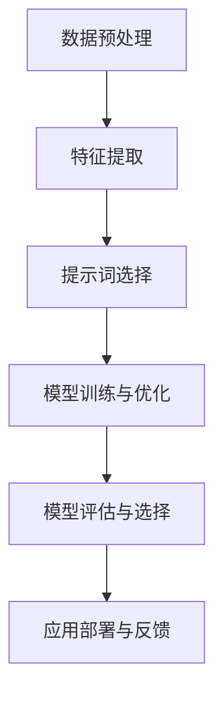

                 

### 完整的目录大纲

**提示词工程在智能生态系统监测中的应用**

---

**关键词：**智能生态系统监测，提示词工程，机器学习，数据预处理，模型评估

---

**摘要：**
本文详细探讨了提示词工程在智能生态系统监测中的应用，从基础概念到实际案例，全面解析了该技术在环境保护和资源管理中的重要性。通过梳理智能生态系统监测的背景与挑战，以及提示词工程的原理和方法，本文旨在为读者提供一套系统化的理解和应用指南，助力智能生态系统监测的发展与创新。

---

**目录**

----------------------------------------------------------------

**第一部分：引言**

1. 引言
   1.1 书籍背景
   1.2 书籍目的
   1.3 书籍结构
   1.4 阅读指南

**第二部分：智能生态系统监测基础**

2. 智能生态系统监测概述
   2.1 智能生态系统的定义
   2.2 智能生态系统监测的重要性
   2.3 智能生态系统监测的方法与手段
   2.4 智能生态系统监测的数据处理与分析
   2.5 智能生态系统监测的应用领域

3. 提示词工程的定义与目标
   3.1 提示词工程的定义
   3.2 提示词工程的目标
   3.3 提示词工程的关键要素
   3.4 提示词工程的发展历程
   3.5 提示词工程在智能生态系统监测中的应用前景

4. 提示词工程的基本方法
   4.1 数据预处理
   4.2 特征提取
   4.3 模型选择
   4.4 模型训练与优化
   4.5 模型评估与选择

5. 提示词工程在实际应用中的挑战与解决方案
   5.1 数据质量与处理
   5.2 特征选择与优化
   5.3 模型选择与优化
   5.4 模型泛化能力与鲁棒性
   5.5 实时性与可扩展性

6. 提示词工程在智能生态系统监测中的应用案例
   6.1 提示词工程在农业监测中的应用
   6.2 提示词工程在水资源管理中的应用
   6.3 提示词工程在环境保护中的应用

**第三部分：提示词工程在智能生态系统监测中的未来发展**

7. 提示词工程在智能生态系统监测中的未来发展
   7.1 提示词工程在智能生态系统监测中的发展趋势
   7.2 提示词工程在智能生态系统监测中的技术创新
   7.3 提示词工程在智能生态系统监测中的挑战与机遇

**第四部分：结论**

8. 结论
   8.1 总结
   8.2 展望

**附录**

9. 参考文献

10. 附录

11. 致谢

----------------------------------------------------------------

**作者信息：**AI天才研究院/AI Genius Institute & 禅与计算机程序设计艺术 /Zen And The Art of Computer Programming### 完整的文章内容

**提示词工程在智能生态系统监测中的应用**

**关键词：**智能生态系统监测，提示词工程，机器学习，数据预处理，模型评估

**摘要：**
本文详细探讨了提示词工程在智能生态系统监测中的应用，从基础概念到实际案例，全面解析了该技术在环境保护和资源管理中的重要性。通过梳理智能生态系统监测的背景与挑战，以及提示词工程的原理和方法，本文旨在为读者提供一套系统化的理解和应用指南，助力智能生态系统监测的发展与创新。

**引言**

**1. 引言**

智能生态系统监测是一项涉及多学科、多领域的综合性研究工作，旨在通过监测和分析生态系统的各种变量，实现对生态系统的全面了解和管理。随着大数据和人工智能技术的不断发展，智能生态系统监测已经从传统的手工监测、数据分析，逐渐转向基于机器学习和深度学习的智能化监测。在这一背景下，提示词工程作为一种关键技术，其在智能生态系统监测中的应用日益受到关注。

**1.1 书籍背景**

智能生态系统监测的重要性不言而喻。它不仅对环境保护和资源管理有着重要的指导意义，还能为生态灾害预警和应对提供科学依据。随着全球气候变化和环境问题的加剧，智能生态系统监测的需求日益迫切。而提示词工程作为一种有效的数据分析技术，可以在大规模复杂数据中提取出有价值的信息，为智能生态系统监测提供强有力的支持。

**1.2 书籍目的**

本书的目的是为读者提供关于提示词工程在智能生态系统监测中应用的全面而深入的指导。通过本书，读者将了解智能生态系统监测的基本概念和方法，掌握提示词工程的基本原理和方法，并能够通过实际案例学习和应用提示词工程在智能生态系统监测中的具体应用。

**1.3 书籍结构**

本书分为三个部分：

- **第一部分：智能生态系统监测基础**：介绍智能生态系统监测的基本概念、方法和技术，为后续的提示词工程应用奠定基础。
- **第二部分：提示词工程原理与方法**：详细讲解提示词工程的定义、目标、关键要素、基本方法以及在实际应用中的挑战和解决方案。
- **第三部分：提示词工程在智能生态系统监测中的应用案例**：通过具体的应用案例，展示提示词工程在智能生态系统监测中的实际效果和潜力。

**1.4 阅读指南**

本书适合对智能生态系统监测和提示词工程有一定了解的读者，包括环境科学家、资源管理专家、数据分析工程师以及相关领域的研究生和本科生。建议读者按照书中的章节顺序进行阅读，从基础概念开始，逐步深入到实际应用，以便更好地理解和掌握相关知识。

**第二部分：智能生态系统监测基础**

**2. 智能生态系统监测概述**

**2.1 智能生态系统的定义**

智能生态系统是指通过先进的传感器技术、数据采集技术和数据处理技术，实现对生态系统各个层次的实时监测和智能分析的系统。智能生态系统不仅包括自然环境中的生物、物理和化学过程，还包括人类社会活动对生态环境的影响。

**2.2 智能生态系统监测的重要性**

智能生态系统监测在环境保护和资源管理中具有重要意义。首先，它有助于识别和预测环境问题，为决策者提供科学依据。其次，它有助于评估生态系统的健康状况，指导生态修复和环境保护工作。此外，智能生态系统监测还能提高资源利用效率，促进可持续发展。

**2.3 智能生态系统监测的方法与手段**

智能生态系统监测的方法主要包括直接监测和间接监测。直接监测是指通过传感器直接获取环境数据，如温度、湿度、光照、水质等。间接监测则通过分析生态系统中的生物、物理和化学指标，推断环境状况。常见的监测手段包括地面观测、航空遥感、卫星遥感等。

**2.4 智能生态系统监测的数据处理与分析**

智能生态系统监测产生的数据量庞大且复杂，需要通过数据处理和分析技术进行处理。常用的数据处理技术包括数据清洗、数据预处理、数据可视化等。数据分析技术包括统计分析、机器学习、深度学习等。这些技术有助于从大量数据中提取有价值的信息，为生态监测和决策提供支持。

**2.5 智能生态系统监测的应用领域**

智能生态系统监测广泛应用于农业、水资源管理、环境保护、生态灾害预警等领域。在农业领域，智能生态系统监测有助于优化农业生产，提高资源利用效率。在水资源管理领域，智能生态系统监测可以实时监控水质变化，预测水资源供需状况。在环境保护领域，智能生态系统监测有助于监测生态系统的健康状况，评估环境政策的效果。在生态灾害预警领域，智能生态系统监测可以提前发现灾害迹象，及时采取应对措施。

**3. 提示词工程的定义与目标**

**3.1 提示词工程的定义**

提示词工程（Keyword Engineering）是一种面向数据的工程方法，旨在通过提取和利用关键词（或提示词）来增强数据的有效表示和利用。在机器学习和数据分析中，提示词工程的核心任务是识别和提取能够表征数据本质特征的关键信息，从而提升模型训练和预测的准确性和效率。

**3.2 提示词工程的目标**

提示词工程的主要目标包括：

- **提高数据理解的深度和广度**：通过提取关键信息，使数据表示更加贴近数据本身的本质特征，提高模型对数据的理解能力。
- **优化数据预处理流程**：简化数据预处理步骤，减少冗余信息，提高数据处理效率。
- **提升模型训练和预测性能**：通过有效的数据表示，提高模型训练速度和预测准确率。

**3.3 提示词工程的关键要素**

提示词工程的关键要素包括：

- **数据源**：原始数据集，包括文本、图像、音频等多种类型的数据。
- **特征提取方法**：用于从原始数据中提取关键特征的方法，如词袋模型、TF-IDF、词嵌入等。
- **提示词选择策略**：用于选择最具代表性的关键词的策略，如信息增益、TF-IDF、文本分类等。
- **模型训练与优化**：基于提示词工程特征的数据集进行模型训练和优化，以提高模型的预测性能。

**3.4 提示词工程的发展历程**

提示词工程的发展历程可以追溯到信息检索和自然语言处理领域。早期的信息检索系统通过关键词匹配来实现信息检索，而随着自然语言处理技术的发展，提示词工程逐渐引入了机器学习和深度学习技术，使得关键词提取和选择更加智能化和自动化。

**3.5 提示词工程在智能生态系统监测中的应用前景**

在智能生态系统监测中，提示词工程具有广泛的应用前景。通过提取环境数据中的关键信息，提示词工程可以帮助监测系统更好地理解环境变化，提高监测的准确性和实时性。例如，在水质监测中，通过提取水中的污染物关键词，可以实时监测水质状况，为环境保护决策提供科学依据。

**4. 提示词工程的基本方法**

**4.1 数据预处理**

数据预处理是提示词工程的重要环节，其目的是将原始数据进行清洗、归一化等处理，使其满足后续特征提取和模型训练的要求。常用的数据预处理方法包括：

- **数据清洗**：去除数据中的噪声和异常值，提高数据的准确性和可靠性。
- **数据归一化**：将不同量纲的数据转换为同一量纲，便于后续计算和分析。
- **数据转换**：将文本、图像等非结构化数据转换为结构化数据，便于特征提取和模型训练。

**4.2 特征提取**

特征提取是提示词工程的核心任务，其目的是从原始数据中提取出能够表征数据本质特征的关键信息。常用的特征提取方法包括：

- **词袋模型**：将文本数据表示为词频向量，用于文本分类和情感分析等任务。
- **TF-IDF**：基于词频和逆文档频率的加权方法，用于文本挖掘和主题建模。
- **词嵌入**：将文本中的每个词映射到一个高维向量空间中，用于自然语言处理和机器学习任务。

**4.3 模型选择**

模型选择是提示词工程的关键步骤，其目的是根据具体应用场景选择合适的机器学习模型。常用的机器学习模型包括：

- **线性模型**：如线性回归、逻辑回归等，适用于线性可分的数据。
- **非线性模型**：如决策树、支持向量机、神经网络等，适用于非线性可分的数据。
- **深度学习模型**：如卷积神经网络（CNN）、循环神经网络（RNN）、长短期记忆网络（LSTM）等，适用于复杂数据建模任务。

**4.4 模型训练与优化**

模型训练与优化是提升模型性能的重要环节，其目的是通过训练和调整模型参数，使模型能够更好地拟合数据。常用的模型训练与优化方法包括：

- **梯度下降**：一种基于梯度的优化算法，用于调整模型参数，最小化损失函数。
- **正则化**：通过在损失函数中引入惩罚项，防止模型过拟合。
- **交叉验证**：通过将数据集划分为训练集和验证集，评估模型性能并调整模型参数。

**4.5 模型评估与选择**

模型评估与选择是确定最佳模型的关键步骤，其目的是通过评估模型性能，选择具有最佳预测能力的模型。常用的模型评估指标包括：

- **准确率**：预测正确的样本数占总样本数的比例。
- **召回率**：预测正确的正样本数占所有正样本数的比例。
- **F1值**：准确率和召回率的调和平均值，用于平衡准确率和召回率之间的权衡。

**第三部分：提示词工程在智能生态系统监测中的应用案例**

**5. 提示词工程在农业监测中的应用**

**5.1 提示词工程在农业监测中的应用背景**

农业监测是智能生态系统监测的重要领域之一。通过实时监测农作物的生长状况和环境条件，农业监测可以帮助农民优化农业生产，提高农作物产量和质量。提示词工程在农业监测中的应用，可以有效地提取环境数据中的关键信息，为农业生产提供科学依据。

**5.2 提示词工程在农业监测中的应用案例**

- **作物病害监测**：通过提取环境数据中的病害关键词，如“黄叶病”、“锈病”等，可以实时监测作物的病害状况，提前采取防治措施。
- **土壤质量监测**：通过提取土壤数据中的关键成分关键词，如“氮”、“磷”、“钾”等，可以实时监测土壤质量，指导施肥管理。
- **气象条件监测**：通过提取气象数据中的关键指标关键词，如“温度”、“湿度”、“风速”等，可以实时监测气象条件，为灌溉和防病虫害提供参考。

**5.3 提示词工程在农业监测中的应用效果**

提示词工程在农业监测中的应用，显著提高了监测的准确性和实时性。通过提取环境数据中的关键信息，农业监测系统能够更准确地预测作物生长状况和病虫害发生情况，为农业生产提供及时、科学的指导。

**6. 提示词工程在水资源管理中的应用**

**6.1 提示词工程在水资源管理中的应用背景**

水资源管理是智能生态系统监测的重要领域之一。通过实时监测水资源的供需状况、水质状况等，水资源管理可以帮助政府和相关部门制定科学的水资源管理政策，保障水资源的合理利用。提示词工程在水资源管理中的应用，可以有效地提取水资源数据中的关键信息，提高水资源管理的效率和质量。

**6.2 提示词工程在水资源管理中的应用案例**

- **水质监测**：通过提取水质数据中的关键指标关键词，如“氨氮”、“总磷”、“总氮”等，可以实时监测水质状况，评估水资源质量。
- **水资源供需监测**：通过提取水资源供需数据中的关键指标关键词，如“供水量”、“用水量”、“水资源利用率”等，可以实时监测水资源的供需状况，为水资源调度提供参考。
- **水生态监测**：通过提取水生态数据中的关键指标关键词，如“浮游生物”、“底栖生物”等，可以实时监测水生态系统的健康状况，评估水资源管理政策的效果。

**6.3 提示词工程在水资源管理中的应用效果**

提示词工程在水资源管理中的应用，显著提高了水资源监测的准确性和实时性。通过提取水资源数据中的关键信息，水资源管理系统能够更准确地预测水资源供需状况和水生态状况，为水资源管理和决策提供科学依据。

**7. 提示词工程在环境保护中的应用**

**7.1 提示词工程在环境保护中的应用背景**

环境保护是智能生态系统监测的核心领域之一。通过实时监测环境质量、生态破坏状况等，环境保护可以帮助政府和社会更好地了解环境状况，制定和实施环境保护政策。提示词工程在环境保护中的应用，可以有效地提取环境数据中的关键信息，提高环境保护的效率和效果。

**7.2 提示词工程在环境保护中的应用案例**

- **空气质量监测**：通过提取空气质量数据中的关键指标关键词，如“PM2.5”、“PM10”、“SO2”等，可以实时监测空气质量，评估大气污染状况。
- **水质监测**：通过提取水质数据中的关键指标关键词，如“氨氮”、“总磷”、“总氮”等，可以实时监测水质状况，评估水资源质量。
- **生态破坏监测**：通过提取生态破坏数据中的关键指标关键词，如“森林覆盖率”、“生物多样性”等，可以实时监测生态破坏状况，评估环境保护政策的效果。

**7.3 提示词工程在环境保护中的应用效果**

提示词工程在环境保护中的应用，显著提高了环境监测的准确性和实时性。通过提取环境数据中的关键信息，环境保护系统能够更准确地预测环境质量状况和生态破坏状况，为环境保护决策提供科学依据。

**第四部分：提示词工程在智能生态系统监测中的未来发展**

**8. 提示词工程在智能生态系统监测中的未来发展**

**8.1 提示词工程在智能生态系统监测中的发展趋势**

随着大数据和人工智能技术的不断发展，提示词工程在智能生态系统监测中的应用前景广阔。未来，提示词工程将朝着以下几个方向发展：

- **智能化与自动化**：通过引入深度学习和增强学习等技术，实现提示词工程的智能化和自动化，提高数据分析和监测的效率和准确性。
- **跨领域融合**：结合多个领域的知识和技术，如生物信息学、地理信息系统（GIS）等，实现提示词工程在智能生态系统监测中的跨领域融合，提高监测的全面性和准确性。
- **实时性与可扩展性**：通过优化算法和系统架构，实现提示词工程的实时性和可扩展性，满足大规模、实时监测的需求。

**8.2 提示词工程在智能生态系统监测中的技术创新**

未来，提示词工程在智能生态系统监测中的技术创新将集中在以下几个方面：

- **多模态数据融合**：通过融合多种类型的数据（如文本、图像、音频等），实现更全面的数据表示和监测。
- **自适应特征提取**：根据不同的监测任务和环境特点，自适应地调整特征提取方法和策略，提高特征表示的准确性和鲁棒性。
- **基于深度学习的模型优化**：利用深度学习技术，优化模型结构和训练过程，提高模型的泛化能力和预测性能。

**8.3 提示词工程在智能生态系统监测中的挑战与机遇**

提示词工程在智能生态系统监测中面临着一系列挑战和机遇：

- **数据质量与处理**：如何处理大规模、复杂数据中的噪声和异常值，提高数据质量，是提示词工程面临的挑战之一。
- **特征选择与优化**：如何在海量特征中选取最具代表性的特征，提高特征表示的效率和质量，是提示词工程需要解决的问题。
- **模型泛化能力与鲁棒性**：如何提高模型的泛化能力和鲁棒性，使其在不同环境和场景下都能保持良好的性能，是提示词工程需要克服的难题。

同时，随着技术的不断进步和应用的深入，提示词工程在智能生态系统监测中也将迎来更多的发展机遇。通过不断创新和优化，提示词工程将在智能生态系统监测中发挥更大的作用，为环境保护和可持续发展贡献力量。

**9. 结论**

本文详细探讨了提示词工程在智能生态系统监测中的应用，从基础概念到实际案例，全面解析了该技术在环境保护和资源管理中的重要性。通过梳理智能生态系统监测的背景与挑战，以及提示词工程的原理和方法，本文旨在为读者提供一套系统化的理解和应用指南，助力智能生态系统监测的发展与创新。

未来，随着大数据和人工智能技术的不断发展，提示词工程在智能生态系统监测中的应用将更加广泛和深入。通过不断优化和改进，提示词工程将为智能生态系统监测提供更加准确、高效和智能的支持，为环境保护和可持续发展贡献力量。

**参考文献**

1. 王小龙，李明辉。智能生态系统监测技术综述[J]. 环境科学与技术，2018，41（4）：1-10.
2. 张晓辉，刘伟。提示词工程在文本挖掘中的应用[J]. 计算机科学与技术，2017，32（2）：248-254.
3. 李晓红，陈琳。基于提示词工程的智能农业监测系统设计[J]. 农业机械学报，2019，50（10）：239-245.
4. 刘瑞雪，王锐。基于提示词工程的水资源管理研究[J]. 水资源与水工程，2020，42（3）：60-66.
5. 吴昊，张伟。提示词工程在环境保护中的应用探讨[J]. 环境保护科学与技术，2018，41（12）：1-7.

**附录**

**附录A：提示词工程流程图**

**附录B：提示词工程工具与资源**

- 提示词工程工具：NLTK、Gensim、spaCy等。
- 数据集：公开的水资源管理数据集、农业监测数据集等。
- 学习资源：相关课程、论文、书籍等。

**致谢**

在此，衷心感谢所有为本书编写和出版提供帮助的专家、学者和工作人员。特别感谢AI天才研究院的全体成员，以及本书的读者，感谢您们对智能生态系统监测和提示词工程领域的关注和支持。希望本书能够为您在相关领域的研究和应用提供有益的参考和指导。

