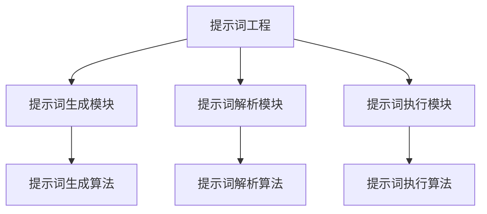

                 

# 提示词工程在机器人控制中的应用与实践

## 关键词

- 提示词工程
- 机器人控制
- 人工智能
- 自然语言处理
- 多机器人系统
- 复杂环境
- 工业机器人

## 摘要

本文深入探讨了提示词工程在机器人控制中的应用与实践。首先，我们介绍了提示词工程的基本概念、重要性和架构，并通过实例展示了其在移动机器人、机器人交互和工业机器人等领域的应用。接着，我们详细分析了提示词生成与优化的原理和算法，以及提示词解析与执行的原理与算法。此外，本文还讨论了提示词工程在多机器人系统和复杂环境中的应用挑战与解决方案，并以工业机器人控制为例进行了具体分析。最后，本文总结了提示词工程在机器人控制中的最佳实践，为未来的研究与应用提供了参考。

## 核心概念与联系

### 提示词工程的概念

提示词工程（Dialogue Management）是人工智能领域中的一个重要分支，主要研究如何使机器人或智能系统能够有效地理解和执行人类指令。提示词（Dialogue Act）是一种用来指导机器人执行特定任务的指令，它能够帮助机器人理解并完成任务，从而提高机器人的工作效率和准确性。

### 提示词工程在机器人控制中的应用

提示词工程在机器人控制中的应用十分广泛，主要包括以下几个方面：

1. **移动机器人控制**：通过提示词工程，机器人可以规划路径、避障并执行复杂任务。
2. **机器人交互**：机器人通过与人类用户的自然语言交互，理解并执行用户的指令。
3. **工业机器人控制**：工业机器人通过提示词工程提高生产效率，减少人为错误。

### 提示词工程的基本架构

提示词工程的基本架构主要包括三个模块：提示词生成模块、提示词解析模块和提示词执行模块。

1. **提示词生成模块**：负责根据任务需求和机器人状态生成相应的提示词。
2. **提示词解析模块**：负责解读提示词，将其转化为机器人可以理解和执行的操作。
3. **提示词执行模块**：负责将解析后的提示词转化为机器人的具体行动。

### 提示词工程的核心算法

提示词工程的核心算法主要包括提示词生成算法、提示词解析算法和提示词执行算法。

1. **提示词生成算法**：主要包括数据驱动的生成方法和基于规则的生成方法。
2. **提示词解析算法**：主要利用自然语言处理技术帮助机器人理解自然语言指令。
3. **提示词执行算法**：主要利用行为树和机器人动作规划技术实现提示词到具体行为的转换。

### Mermaid 流程图



## 第1章 提示词工程在机器人控制中的应用

### 1.1 提示词工程的概念

#### 1.1.1 提示词的定义与作用

提示词是一种用来指导机器人执行特定任务的指令。在人工智能领域，提示词通常被定义为一种结构化的数据，它包含了机器人在执行任务时所需的信息和指令。提示词的作用主要体现在以下几个方面：

1. **任务指导**：提示词能够明确地告诉机器人需要执行的任务，从而提高机器人的工作效率。
2. **上下文理解**：提示词包含了执行任务的上下文信息，帮助机器人更好地理解任务背景。
3. **错误纠正**：通过提示词，机器人可以在执行任务过程中及时发现并纠正错误。

#### 1.1.2 提示词工程的重要性

提示词工程是机器人控制领域的关键环节，其重要性主要体现在以下几个方面：

1. **提高机器人性能**：通过高效的提示词工程系统，机器人可以更准确地理解和执行任务，从而提高性能。
2. **减少错误率**：提示词工程能够帮助机器人识别和纠正错误，从而减少执行任务时的错误率。
3. **增强适应能力**：在复杂环境中，提示词工程可以帮助机器人更好地适应环境变化，提高其在复杂环境中的适应能力。

### 1.2 提示词工程的基本架构

#### 1.2.1 提示词生成模块

提示词生成模块是提示词工程系统的核心，其功能是根据任务需求和机器人状态生成相应的提示词。生成模块通常包含以下几个步骤：

1. **任务需求分析**：分析任务的具体要求和目标。
2. **状态信息采集**：收集机器人的当前状态信息，如位置、速度、负载等。
3. **提示词生成**：根据任务需求和状态信息生成相应的提示词。

#### 1.2.2 提示词解析模块

提示词解析模块负责解读提示词，将其转化为机器人可以理解和执行的操作。解析模块通常包含以下几个步骤：

1. **提示词识别**：识别输入的提示词，确定其类型和含义。
2. **上下文理解**：理解提示词的上下文信息，如执行环境、任务背景等。
3. **操作转换**：将提示词转换为机器人的具体操作指令。

#### 1.2.3 提示词执行模块

提示词执行模块负责将解析后的提示词转化为机器人的具体行动。执行模块通常包含以下几个步骤：

1. **指令生成**：根据解析结果生成具体的操作指令。
2. **执行监控**：监控指令的执行过程，确保指令的正确执行。
3. **结果反馈**：根据执行结果进行反馈，为后续任务提供依据。

### 1.3 提示词工程在机器人控制中的应用

#### 1.3.1 提示词工程在移动机器人中的应用

移动机器人是提示词工程应用的重要领域之一。通过提示词工程，移动机器人可以更有效地进行路径规划、避障和任务执行。具体应用包括：

1. **路径规划**：利用提示词工程生成最优路径，提高机器人的导航能力。
2. **避障**：通过提示词工程实现智能避障，提高机器人在复杂环境中的适应能力。
3. **任务执行**：根据提示词工程生成的提示词，机器人可以执行如搬运、探测等复杂任务。

#### 1.3.2 提示词工程在机器人交互中的应用

机器人交互是另一个重要的应用领域。通过提示词工程，机器人可以与人类用户进行自然语言交互，理解并执行用户的指令。具体应用包括：

1. **自然语言理解**：利用自然语言处理技术，机器人可以理解用户的自然语言指令。
2. **任务执行**：根据用户指令，机器人可以执行如问答、对话管理等任务。
3. **错误纠正**：通过提示词工程，机器人可以在执行任务过程中及时发现并纠正错误。

#### 1.3.3 提示词工程在工业机器人中的应用

工业机器人是制造业中的重要组成部分。通过提示词工程，工业机器人可以更高效地完成生产任务，提高生产效率。具体应用包括：

1. **生产任务执行**：利用提示词工程，工业机器人可以执行如焊接、组装等生产任务。
2. **生产效率优化**：通过提示词工程优化生产流程，减少生产时间，提高生产效率。
3. **人为错误减少**：通过提示词工程，工业机器人可以减少人为错误，提高生产质量。

### 1.4 小结

本章介绍了提示词工程在机器人控制中的应用，包括基本概念、重要性、基本架构以及在移动机器人、机器人交互和工业机器人中的应用。提示词工程作为机器人控制的关键技术，为提高机器人性能、减少错误率和增强适应能力提供了有力支持。在下一章中，我们将进一步探讨提示词生成与优化的原理和算法。

## 第2章 提示词生成与优化

### 2.1 提示词生成的原理与算法

提示词生成是提示词工程中至关重要的一环。它决定了机器人能否准确理解并执行任务。提示词生成的方法主要有数据驱动的生成方法和基于规则的生成方法。

#### 2.1.1 数据驱动的提示词生成方法

数据驱动的提示词生成方法利用大量的历史数据来生成提示词。这种方法的优势在于生成的提示词更符合实际任务需求，能够更好地适应不同的环境和任务。具体步骤如下：

1. **数据采集**：收集与任务相关的历史数据，如机器人执行任务的过程记录、任务日志等。
2. **数据预处理**：对采集到的数据进行清洗、去噪和归一化处理，确保数据质量。
3. **特征提取**：从预处理后的数据中提取与任务相关的特征，如任务类型、环境状态、机器人状态等。
4. **提示词生成**：利用机器学习算法，如决策树、支持向量机等，根据提取的特征生成提示词。

伪代码如下：

```python
def data_driven_generation(data):
    # 数据预处理
    preprocessed_data = preprocess_data(data)
    # 特征提取
    features = extract_features(preprocessed_data)
    # 提示词生成
    model = train_model(features)
    predictions = model.predict(features)
    return predictions
```

#### 2.1.2 基于规则的提示词生成方法

基于规则的提示词生成方法通过预设规则来生成提示词。这种方法实现简单，但生成的提示词可能不够灵活，难以适应复杂多变的任务场景。具体步骤如下：

1. **规则定义**：根据任务需求，定义生成提示词的规则。
2. **规则应用**：根据规则，生成相应的提示词。

伪代码如下：

```python
def rule_based_generation(rule):
    # 根据规则生成提示词
    action = apply_rule(rule)
    return action
```

### 2.2 提示词优化的方法

提示词优化是提高提示词工程系统性能的重要手段。提示词优化的方法主要包括提示词筛选、提示词权重调整和提示词更新策略。

#### 2.2.1 提示词筛选

提示词筛选是优化提示词工程的重要步骤。通过筛选出有效的提示词，可以减少系统的计算量和执行时间，提高系统的效率。具体步骤如下：

1. **提示词质量评估**：对现有的提示词进行质量评估，评估标准可以是提示词的执行成功率、错误率等。
2. **提示词筛选**：根据评估结果，筛选出高质量的提示词。

伪代码如下：

```python
def filter_prompts(prompts, criteria):
    # 根据评估标准筛选提示词
    selected_prompts = [prompt for prompt in prompts if evaluate_prompt(prompt, criteria)]
    return selected_prompts
```

#### 2.2.2 提示词权重调整

提示词权重调整可以帮助机器人更准确地理解任务，提高执行效率。具体步骤如下：

1. **权重评估**：根据提示词的执行效果，评估每个提示词的权重。
2. **权重调整**：根据评估结果，调整提示词的权重。

伪代码如下：

```python
def adjust_weights(prompts, evaluations):
    # 根据评估结果调整提示词权重
    for prompt in prompts:
        prompt['weight'] = evaluations[prompt]
    return prompts
```

#### 2.2.3 提示词更新策略

提示词更新策略负责根据机器人执行任务的情况来动态调整提示词库。具体步骤如下：

1. **更新需求评估**：评估提示词库的更新需求，如新任务的增加、现有任务的修改等。
2. **提示词更新**：根据更新需求，更新提示词库。

伪代码如下：

```python
def update_prompts(prompts, updates):
    # 根据更新需求更新提示词库
    for update in updates:
        if update['type'] == 'add':
            prompts.append(update['prompt'])
        elif update['type'] == 'modify':
            index = find_prompt_index(prompts, update['old_prompt'])
            prompts[index] = update['new_prompt']
    return prompts
```

### 2.3 小结

本章介绍了提示词生成与优化的原理和算法，包括数据驱动的提示词生成方法和基于规则的提示词生成方法，以及提示词筛选、提示词权重调整和提示词更新策略。这些方法为提示词工程系统的性能优化提供了有力支持。在下一章中，我们将探讨提示词解析与执行的原理与算法。

## 第3章 提示词解析与执行

### 3.1 提示词解析的原理与算法

提示词解析是提示词工程中的关键环节，它决定了机器人能否准确理解输入的提示词，并将其转化为具体的操作指令。提示词解析的原理与算法主要包括自然语言处理技术和上下文理解。

#### 3.1.1 自然语言处理技术

自然语言处理（Natural Language Processing，NLP）是人工智能领域的一个重要分支，主要研究如何让计算机理解和处理自然语言。在提示词解析中，NLP技术可以帮助机器人理解输入的提示词。具体步骤如下：

1. **分词**：将输入的提示词分割为词语或词组。
2. **词性标注**：对分割后的词语或词组进行词性标注，确定每个词语的语法属性。
3. **句法分析**：对输入的提示词进行句法分析，确定句子结构。
4. **语义理解**：根据句法分析和词性标注的结果，理解输入提示词的语义。

伪代码如下：

```python
def nlp_parsing(prompt):
    # 分词
    words = tokenize(prompt)
    # 词性标注
    tagged_words = part_of_speech_tagging(words)
    # 句法分析
    parse_tree = syntactic_parsing(tagged_words)
    # 语义理解
    meaning = semantic_understanding(parse_tree)
    return meaning
```

#### 3.1.2 上下文理解

上下文理解是提示词解析的重要环节，它要求机器人能够理解输入提示词的上下文信息。上下文信息包括执行环境、任务背景等，它对机器人的理解起着至关重要的作用。具体步骤如下：

1. **上下文提取**：从输入的提示词中提取上下文信息。
2. **上下文融合**：将提取的上下文信息与输入提示词进行融合，形成完整的上下文信息。
3. **上下文理解**：根据融合后的上下文信息，理解输入提示词的含义。

伪代码如下：

```python
def context_understanding(prompt, context):
    # 上下文提取
    extracted_context = extract_context(prompt)
    # 上下文融合
    fused_context = fuse_context(extracted_context, context)
    # 上下文理解
    meaning = understand_context(fused_context)
    return meaning
```

### 3.2 提示词执行的原理与算法

提示词执行是将解析后的提示词转化为具体行动的过程。提示词执行的原理与算法主要包括行为树和机器人动作规划。

#### 3.2.1 行为树

行为树是一种用于描述机器人行为的图结构，它由一系列节点和边组成。每个节点表示一个具体的行动或决策，边表示节点之间的逻辑关系。通过行为树，机器人可以将解析后的提示词转化为具体的行动步骤。具体步骤如下：

1. **行为树构建**：根据任务需求，构建行为树。
2. **行为执行**：从行为树的根节点开始，按照逻辑关系执行行为。
3. **行为监控**：在执行过程中，监控每个行为的执行情况，确保行为正确执行。

伪代码如下：

```python
def execute_behavior(behavior_tree):
    # 从根节点开始执行行为
    root = behavior_tree.root
    execute_node(root)
    # 行为监控
    monitor_behavior(behavior_tree)
```

#### 3.2.2 机器人动作规划

机器人动作规划负责根据提示词生成具体的行动步骤，以实现任务的执行。动作规划的过程可以分为以下几个步骤：

1. **任务分解**：将任务分解为一系列子任务。
2. **路径规划**：为每个子任务生成最优路径。
3. **动作生成**：根据路径规划和子任务要求，生成具体的动作序列。
4. **动作执行**：执行生成的动作序列。

伪代码如下：

```python
def action_planning(task):
    # 任务分解
    subtasks = decompose_task(task)
    # 路径规划
    paths = path_planning(subtasks)
    # 动作生成
    actions = generate_actions(paths)
    # 动作执行
    execute_actions(actions)
```

### 3.3 提示词工程在实际应用中的挑战与解决方案

#### 3.3.1 自然语言理解挑战

自然语言理解是提示词工程中的一个重要挑战。由于自然语言的复杂性，机器人很难完全理解输入的提示词。解决这个挑战的方法主要包括：

1. **丰富语言模型**：利用大型语言模型，如GPT-3，提高机器人的语言理解能力。
2. **上下文信息融合**：通过融合上下文信息，提高机器人对输入提示词的理解。
3. **错误容忍**：在提示词执行过程中，机器人对错误的容忍度，减少因语言理解错误导致的行为错误。

#### 3.3.2 行为规划挑战

行为规划是提示词工程中的另一个挑战。由于任务复杂性和环境不确定性，机器人很难生成最优的行为规划。解决这个挑战的方法主要包括：

1. **多目标优化**：通过多目标优化，同时考虑任务完成时间和资源消耗等因素，生成最优行为规划。
2. **不确定性处理**：通过不确定性处理技术，如概率图模型，提高机器人对环境不确定性的适应能力。
3. **动态规划**：通过动态规划技术，根据实时环境信息，动态调整行为规划。

### 3.4 小结

本章介绍了提示词解析与执行的原理与算法，包括自然语言处理技术和上下文理解，以及行为树和机器人动作规划。此外，还讨论了提示词工程在实际应用中的挑战与解决方案。提示词解析与执行是提示词工程的关键环节，为机器人准确理解并执行任务提供了有力支持。在下一章中，我们将探讨提示词工程在多机器人系统中的应用。

## 第4章 提示词工程在多机器人系统中的应用

### 4.1 多机器人系统的概述

多机器人系统（Multi-Robot System）是指由多个机器人组成的系统，这些机器人可以通过通信和协作完成单个机器人难以完成的任务。多机器人系统的定义和分类如下：

#### 4.1.1 多机器人系统的定义

多机器人系统是指由多个机器人组成的、能够通过通信和协作实现共同任务的系统。这些机器人可以是同型号的，也可以是不同型号的，它们可以分布在不同的位置，通过无线通信或其他通信手段进行信息交换。

#### 4.1.2 多机器人系统的分类

根据机器人之间的协作方式，多机器人系统可以分为以下几类：

1. **同步协作系统**：所有机器人按照相同的频率和节奏进行协作。
2. **异步协作系统**：机器人之间按照不同的频率和节奏进行协作。
3. **分布式系统**：机器人之间没有明确的协作关系，各自执行自己的任务，但最终结果能够协同。
4. **集中式系统**：所有机器人通过一个中央控制器进行统一调度和协调。

#### 4.1.3 多机器人系统的优势与挑战

多机器人系统具有以下优势：

1. **任务多样性**：多机器人系统可以同时执行多种任务，提高任务执行效率。
2. **环境适应性**：多个机器人可以分布在不同的环境中，提高系统的环境适应性。
3. **协作能力**：机器人之间可以相互协作，共同完成任务，提高系统的任务完成率。

然而，多机器人系统也面临着以下挑战：

1. **通信延迟**：机器人之间的通信可能存在延迟，影响任务执行效率。
2. **同步问题**：不同机器人之间的任务同步可能存在问题，导致任务执行失败。
3. **资源竞争**：多机器人系统中的资源分配和竞争可能成为系统性能的瓶颈。
4. **不确定性**：环境的不确定性可能导致机器人任务执行失败。

#### 4.1.4 多机器人系统的发展趋势

随着人工智能和机器人技术的不断发展，多机器人系统在各个领域都得到了广泛应用。未来，多机器人系统的发展趋势包括：

1. **自主协作**：机器人将更加自主地进行协作，减少对人工干预的依赖。
2. **智能决策**：机器人将具备更强的智能决策能力，能够在复杂环境中自主完成任务。
3. **大规模应用**：多机器人系统将逐渐应用于更多的领域，如物流、农业、医疗等。

### 4.2 提示词工程在多机器人系统中的应用

提示词工程在多机器人系统中的应用旨在通过有效的通信和协作，提高机器人的任务执行效率和系统稳定性。以下是提示词工程在多机器人系统中的应用：

#### 4.2.1 提示词生成与优化的挑战

在多机器人系统中，提示词生成与优化面临着以下挑战：

1. **信息冗余**：多机器人系统中的信息量较大，如何有效筛选和处理信息成为关键问题。
2. **通信延迟**：机器人之间的通信可能存在延迟，影响提示词的生成和优化。
3. **任务冲突**：不同机器人之间的任务可能存在冲突，导致提示词生成困难。

解决这些挑战的方法包括：

1. **分布式计算**：通过分布式计算技术，提高提示词生成和优化的效率。
2. **通信优化**：采用高效的通信协议和算法，减少通信延迟。
3. **冲突检测与解决**：通过冲突检测和解决机制，确保任务执行的顺利进行。

#### 4.2.2 提示词解析与执行的挑战

在多机器人系统中，提示词解析与执行面临着以下挑战：

1. **上下文理解**：多机器人系统中的上下文信息复杂，如何准确理解上下文信息成为关键问题。
2. **行为同步**：不同机器人之间的行为同步可能存在问题，导致任务执行失败。
3. **动态调整**：在动态环境下，如何快速调整提示词和执行策略成为挑战。

解决这些挑战的方法包括：

1. **上下文融合**：采用上下文融合技术，提高机器人对上下文信息的理解。
2. **行为同步机制**：采用行为同步机制，确保不同机器人之间的行为同步。
3. **动态调整策略**：采用动态调整策略，根据环境变化实时调整提示词和执行策略。

#### 4.2.3 提示词工程在多机器人系统中的优化策略

为了提高多机器人系统的性能和稳定性，提示词工程在多机器人系统中的优化策略主要包括：

1. **任务分配优化**：通过优化任务分配策略，提高机器人任务的执行效率。
2. **资源调度优化**：通过优化资源调度策略，确保机器人任务的资源需求得到满足。
3. **通信优化**：通过优化通信策略，减少机器人之间的通信延迟。
4. **自适应调整**：通过自适应调整机制，根据环境变化和任务执行情况动态调整提示词和执行策略。

### 4.3 多机器人系统的应用案例

#### 4.3.1 移动机器人编队

移动机器人编队是多机器人系统的一个重要应用场景。通过提示词工程，多个移动机器人可以组成编队，执行如搜索、救援、监测等任务。具体实现包括：

1. **编队规划**：根据任务需求和机器人状态，生成编队规划和执行提示词。
2. **路径规划**：为每个机器人生成最优路径，确保编队行进过程顺畅。
3. **协同执行**：机器人根据提示词和路径规划，协同执行任务。

#### 4.3.2 工业机器人协同作业

工业机器人协同作业是另一个重要的应用场景。通过提示词工程，多个工业机器人可以协同完成生产任务。具体实现包括：

1. **任务分配**：根据生产任务，生成任务分配提示词，确保每个机器人都有明确的任务。
2. **资源调度**：根据机器人的资源需求，生成资源调度提示词，确保机器人任务的资源需求得到满足。
3. **协同作业**：机器人根据提示词和资源调度，协同完成生产任务。

#### 4.3.3 无人驾驶车辆编队

无人驾驶车辆编队是自动驾驶技术的一个重要应用场景。通过提示词工程，多个无人驾驶车辆可以组成编队，执行如运输、配送等任务。具体实现包括：

1. **编队规划**：根据运输任务，生成编队规划和执行提示词。
2. **路径规划**：为每个无人驾驶车辆生成最优路径，确保编队行进过程顺畅。
3. **协同执行**：无人驾驶车辆根据提示词和路径规划，协同执行运输任务。

### 4.4 小结

本章介绍了多机器人系统的概述，包括定义、分类、优势与挑战以及发展趋势。接着，探讨了提示词工程在多机器人系统中的应用，包括提示词生成与优化、提示词解析与执行的挑战以及优化策略。最后，通过移动机器人编队、工业机器人协同作业和无人驾驶车辆编队等应用案例，展示了提示词工程在多机器人系统中的应用。提示词工程在多机器人系统中的应用，为机器人协作提供了有力支持，有助于提高系统的性能和稳定性。在下一章中，我们将探讨提示词工程在复杂环境中的挑战与解决方案。

## 第5章 提示词工程在复杂环境中的挑战与解决方案

### 5.1 复杂环境的概述

在提示词工程中，复杂环境指的是那些对机器人行为产生显著影响的复杂和多变的环境。这些环境可能包含多种不确定因素，如多变的天气条件、动态的障碍物、多变的任务需求等。复杂环境对提示词工程的影响主要体现在以下几个方面：

1. **不确定性增加**：复杂环境中的不确定性因素较多，可能导致机器人无法准确预测和应对。
2. **环境变化快速**：复杂环境中的变化速度较快，机器人需要具备快速适应环境变化的能力。
3. **任务复杂度提升**：复杂环境中的任务往往更加复杂，机器人需要能够处理更多的任务细节和执行策略。

为了更好地理解和应对复杂环境中的挑战，我们可以将复杂环境分为以下几类：

1. **动态环境**：环境中的障碍物和任务目标会随时间发生变化。
2. **噪声环境**：环境中存在大量的噪声和干扰，影响机器人的感知和决策。
3. **多任务环境**：机器人需要同时处理多个任务，任务之间存在冲突和依赖关系。

### 5.2 复杂环境中的提示词工程挑战

在复杂环境中，提示词工程面临以下挑战：

#### 5.2.1 自然语言理解挑战

复杂环境中的自然语言理解挑战主要体现在以下几个方面：

1. **语言歧义**：由于环境复杂，输入的自然语言指令可能存在歧义，机器人需要准确理解指令的含义。
2. **上下文缺失**：复杂环境中的任务往往具有复杂性，机器人需要理解更多的上下文信息，但上下文信息可能不完整或不明确。
3. **语言变化**：复杂环境中的语言使用可能因情境变化而变化，机器人需要具备适应语言变化的能力。

解决这些挑战的方法包括：

1. **多模态感知**：结合视觉、听觉等多模态感知信息，提高对复杂环境中的语言理解。
2. **上下文扩展**：通过上下文扩展技术，利用历史数据和上下文信息，提高对输入指令的理解。
3. **自适应语言模型**：利用自适应语言模型，根据环境变化动态调整语言理解策略。

#### 5.2.2 行为规划挑战

复杂环境中的行为规划挑战主要体现在以下几个方面：

1. **动态调整**：复杂环境中的任务和障碍物可能随时发生变化，机器人需要具备快速调整行为规划的能力。
2. **资源分配**：复杂环境中机器人往往需要同时处理多个任务，如何合理分配资源成为关键问题。
3. **路径规划**：复杂环境中的路径规划可能存在多种解决方案，如何选择最优路径成为挑战。

解决这些挑战的方法包括：

1. **动态规划**：采用动态规划技术，根据环境变化实时调整行为规划。
2. **资源分配算法**：采用资源分配算法，确保机器人任务资源的合理分配。
3. **多目标优化**：采用多目标优化技术，综合考虑任务完成时间、资源消耗等因素，选择最优路径。

#### 5.2.3 系统稳定性挑战

复杂环境中的系统稳定性挑战主要体现在以下几个方面：

1. **通信延迟**：复杂环境中的通信可能存在延迟，影响系统的响应速度和稳定性。
2. **故障处理**：复杂环境中的机器人可能发生故障，如何快速处理故障成为关键问题。
3. **任务冗余**：在复杂环境中，机器人可能执行冗余任务，影响系统效率。

解决这些挑战的方法包括：

1. **通信优化**：采用高效通信协议和算法，减少通信延迟。
2. **故障检测与恢复**：采用故障检测与恢复技术，确保系统在故障发生时能够快速恢复。
3. **任务优化**：采用任务优化技术，减少冗余任务，提高系统效率。

### 5.3 复杂环境中的提示词工程解决方案

为了应对复杂环境中的提示词工程挑战，可以采用以下解决方案：

#### 5.3.1 适应性提示词生成

适应性提示词生成是指根据复杂环境的变化，动态调整提示词生成策略，以适应环境变化。具体方法包括：

1. **环境感知**：通过环境感知技术，实时获取环境信息，为提示词生成提供依据。
2. **动态调整**：根据环境信息，动态调整提示词生成策略，确保提示词能够适应环境变化。
3. **多模型融合**：采用多模型融合技术，结合不同模型的优势，提高提示词生成效果。

#### 5.3.2 智能提示词解析

智能提示词解析是指利用智能技术，提高对复杂环境中输入提示词的理解能力。具体方法包括：

1. **多模态感知**：结合多模态感知技术，如视觉、听觉等，提高对输入提示词的理解。
2. **上下文理解**：通过上下文理解技术，利用历史数据和上下文信息，提高对输入提示词的理解。
3. **自适应语言模型**：采用自适应语言模型，根据环境变化动态调整语言理解策略。

#### 5.3.3 系统稳定性优化

系统稳定性优化是指通过优化系统设计和技术，提高系统在复杂环境中的稳定性。具体方法包括：

1. **冗余设计**：采用冗余设计技术，如备份系统和冗余计算，提高系统可靠性。
2. **故障检测与恢复**：采用故障检测与恢复技术，确保系统在故障发生时能够快速恢复。
3. **动态调整**：根据环境变化和任务执行情况，动态调整系统参数和策略，提高系统稳定性。

### 5.4 小结

本章介绍了复杂环境的概述，包括复杂环境的定义、分类和对提示词工程的影响。接着，讨论了复杂环境中的提示词工程挑战，如自然语言理解、行为规划和系统稳定性挑战。最后，提出了适应性提示词生成、智能提示词解析和系统稳定性优化的解决方案，以应对复杂环境中的提示词工程挑战。通过本章的讨论，我们能够更好地理解复杂环境中的提示词工程，并为未来的研究和应用提供参考。

## 第6章 提示词工程在工业机器人控制中的应用

### 6.1 工业机器人概述

工业机器人（Industrial Robot）是一种可编程的自动化机器，用于执行重复性高、危险性强或需要高精度的工业任务。工业机器人通常由机械结构、控制系统和传感器三大部分组成。随着人工智能技术的发展，工业机器人正逐渐具备更高级的功能，如自主决策、智能交互和自适应控制。

#### 6.1.1 工业机器人的分类

工业机器人根据其应用场景和功能可以分为以下几类：

1. **搬运机器人**：主要用于搬运物品，如汽车制造中的无人搬运车。
2. **焊接机器人**：主要用于焊接工作，如船舶制造、汽车制造中的焊接机器人。
3. **装配机器人**：主要用于装配工作，如电子制造中的装配机器人。
4. **喷涂机器人**：主要用于喷涂工作，如汽车制造中的喷涂机器人。
5. **检测机器人**：主要用于质量检测，如生产过程中的在线检测机器人。

#### 6.1.2 工业机器人的主要特点

工业机器人的主要特点包括：

1. **高精度**：工业机器人能够实现高精度的定位和操作，确保产品质量。
2. **高效率**：工业机器人可以连续工作，提高生产效率，降低生产成本。
3. **可靠性**：工业机器人能够稳定地执行重复性任务，减少人为错误。
4. **灵活性**：工业机器人可以通过编程和参数调整，适应不同的生产任务。

#### 6.1.3 工业机器人的发展历程

工业机器人起源于20世纪60年代的美国，随着计算机技术和自动化技术的不断发展，工业机器人逐渐应用于汽车制造、电子制造、化工等多个行业。近年来，人工智能技术的融入，使工业机器人具备更高级的功能，如自主决策和智能交互，进一步推动了工业机器人的发展。

### 6.2 提示词工程在工业机器人控制中的应用

提示词工程在工业机器人控制中的应用旨在通过自然语言处理技术，使机器人能够理解并执行人类的指令，从而实现更高效、更智能的工业生产。以下是提示词工程在工业机器人控制中的应用：

#### 6.2.1 提示词生成

在工业机器人控制中，提示词生成是指根据任务需求和环境状态，生成相应的提示词。提示词生成的方法主要包括：

1. **基于规则的方法**：通过预设的规则，根据任务和环境条件生成提示词。这种方法实现简单，但灵活性较差。
2. **基于数据的方法**：通过分析历史数据，根据任务和环境条件生成提示词。这种方法生成的提示词更符合实际需求，但需要大量数据支持。

#### 6.2.2 提示词解析

提示词解析是指将输入的自然语言指令转换为机器人的操作指令。在工业机器人控制中，提示词解析的挑战主要包括：

1. **语言歧义**：由于工业指令的表达方式多样，容易产生歧义，需要通过上下文理解消除歧义。
2. **多模态指令**：工业指令可能包含视觉、听觉等多模态信息，需要综合处理。
3. **复杂任务**：工业任务往往复杂，需要解析出具体的操作步骤。

提示词解析的方法主要包括：

1. **自然语言处理技术**：通过分词、词性标注、句法分析等技术，理解输入指令的含义。
2. **上下文理解**：通过上下文信息，消除语言歧义，确保指令理解准确。
3. **多模态感知**：结合视觉、听觉等多模态感知信息，提高指令理解能力。

#### 6.2.3 提示词执行

提示词执行是指将解析后的提示词转化为机器人的具体行动。在工业机器人控制中，提示词执行的挑战主要包括：

1. **动作同步**：多个机器人需要同步执行任务，确保任务顺利进行。
2. **资源分配**：合理分配机器人资源，确保任务执行效率。
3. **故障处理**：在执行过程中，机器人可能发生故障，需要快速处理。

提示词执行的方法主要包括：

1. **行为树**：通过行为树，将提示词转化为具体的行动步骤，确保动作同步。
2. **动作规划**：根据任务和环境条件，生成最优动作规划，确保任务执行效率。
3. **故障检测与恢复**：通过故障检测与恢复机制，确保机器人能够稳定运行。

### 6.3 应用案例

以下是提示词工程在工业机器人控制中的应用案例：

#### 6.3.1 搬运机器人

搬运机器人是工业机器人中的一种常见类型，通过提示词工程，可以实现自动化搬运任务。应用案例包括：

1. **仓库货物搬运**：搬运机器人可以根据仓库管理员的自然语言指令，自动搬运货物到指定位置。
2. **生产线搬运**：搬运机器人可以在生产线上自动搬运原材料和成品，提高生产效率。

#### 6.3.2 装配机器人

装配机器人主要用于生产线的装配任务，通过提示词工程，可以实现自动化装配。应用案例包括：

1. **电子装配**：装配机器人可以根据电子产品的装配指令，自动完成装配任务。
2. **汽车装配**：装配机器人可以在汽车生产线上，自动完成零件的装配和调试。

#### 6.3.3 检测机器人

检测机器人主要用于生产过程中的质量检测，通过提示词工程，可以实现自动化检测。应用案例包括：

1. **产品检测**：检测机器人可以根据产品检测指令，自动完成产品的质量检测。
2. **生产线检测**：检测机器人可以在生产线上，实时检测产品质量，确保生产过程的顺利进行。

### 6.4 小结

本章介绍了工业机器人的概述，包括分类、特点和发展历程。接着，探讨了提示词工程在工业机器人控制中的应用，包括提示词生成、提示词解析和提示词执行。最后，通过搬运机器人、装配机器人和检测机器人的应用案例，展示了提示词工程在工业机器人控制中的应用。提示词工程在工业机器人控制中的应用，为工业生产的自动化、智能化提供了有力支持。在下一章中，我们将总结全文，并展望提示词工程在未来的发展趋势和应用前景。

## 总结与展望

本文全面探讨了提示词工程在机器人控制中的应用与实践，从基本概念、架构、应用领域到复杂环境中的挑战与解决方案，再到工业机器人控制中的应用，进行了深入剖析。通过提示词工程，机器人能够在复杂环境中更有效地完成任务，提高工作效率，减少人为错误。

### 主要发现

1. **提示词工程的核心地位**：提示词工程作为机器人控制的关键技术，对提高机器人性能、减少错误率和增强适应能力具有重要作用。
2. **提示词生成与优化的多样性**：数据驱动的生成方法和基于规则的生成方法各有优势，适用于不同场景。
3. **解析与执行的复杂性**：自然语言处理技术和上下文理解在提示词解析中至关重要，行为树和机器人动作规划在执行中起到关键作用。
4. **多机器人系统与复杂环境的挑战**：多机器人系统中的通信延迟、任务冲突和不确定性，以及复杂环境中的自然语言理解和行为规划，都是需要重点解决的问题。
5. **工业机器人控制中的应用**：提示词工程在工业机器人控制中，通过自然语言处理和智能决策，实现了高效、智能的生产任务执行。

### 未来发展趋势

1. **智能决策与自适应控制**：随着人工智能技术的发展，机器人将具备更强的智能决策和自适应控制能力，能够应对更加复杂的任务和环境。
2. **多模态感知与融合**：结合视觉、听觉、触觉等多模态感知信息，将进一步提高机器人对复杂环境的理解能力。
3. **分布式计算与协作**：分布式计算和协作技术将使多机器人系统能够更加高效地协同工作，提高系统的整体性能。
4. **边缘计算与云计算的结合**：边缘计算和云计算的结合，将使机器人能够更快速地处理海量数据和进行复杂计算，提高任务执行效率。
5. **人机交互的优化**：随着人机交互技术的发展，机器人将能够更好地理解人类的指令，实现更加自然和高效的人机协作。

### 最佳实践 tips

1. **充分理解任务需求**：在设计和实现提示词工程系统时，要充分理解任务需求，确保生成的提示词能够准确指导机器人执行任务。
2. **注重数据质量**：数据驱动的提示词生成方法依赖于高质量的数据，因此在数据采集和处理过程中，要注重数据质量。
3. **灵活调整策略**：在复杂环境中，提示词工程系统需要能够灵活调整策略，以适应环境变化和任务需求。
4. **持续优化与更新**：提示词工程系统需要不断优化和更新，以适应不断变化的技术和任务需求。
5. **强化人机协作**：在人机交互中，要注重强化人机协作，使机器人能够更好地理解人类的指令和意图。

### 注意事项

1. **安全性**：在提示词工程的应用中，要确保系统的安全性，防止恶意指令或错误操作对系统造成损害。
2. **隐私保护**：在处理人机交互数据时，要注重隐私保护，防止个人隐私泄露。
3. **法律法规**：在应用提示词工程时，要遵守相关的法律法规，确保系统的合规性。

### 拓展阅读

1. **《人工智能：一种现代的方法》**：这是一本经典的人工智能教材，涵盖了人工智能的基本概念和技术。
2. **《机器人学导论》**：这是一本关于机器人学的基础教材，详细介绍了机器人控制的理论和实践。
3. **《深度学习》**：这是一本关于深度学习的经典教材，介绍了深度学习的基本原理和应用。
4. **《分布式系统原理与范型》**：这是一本关于分布式系统的教材，详细介绍了分布式系统的基本原理和设计范型。

通过本文的探讨，我们希望能够为提示词工程在机器人控制中的应用提供有益的参考和启示，推动这一领域的发展。作者：AI天才研究院/AI Genius Institute & 禅与计算机程序设计艺术 /Zen And The Art of Computer Programming。

