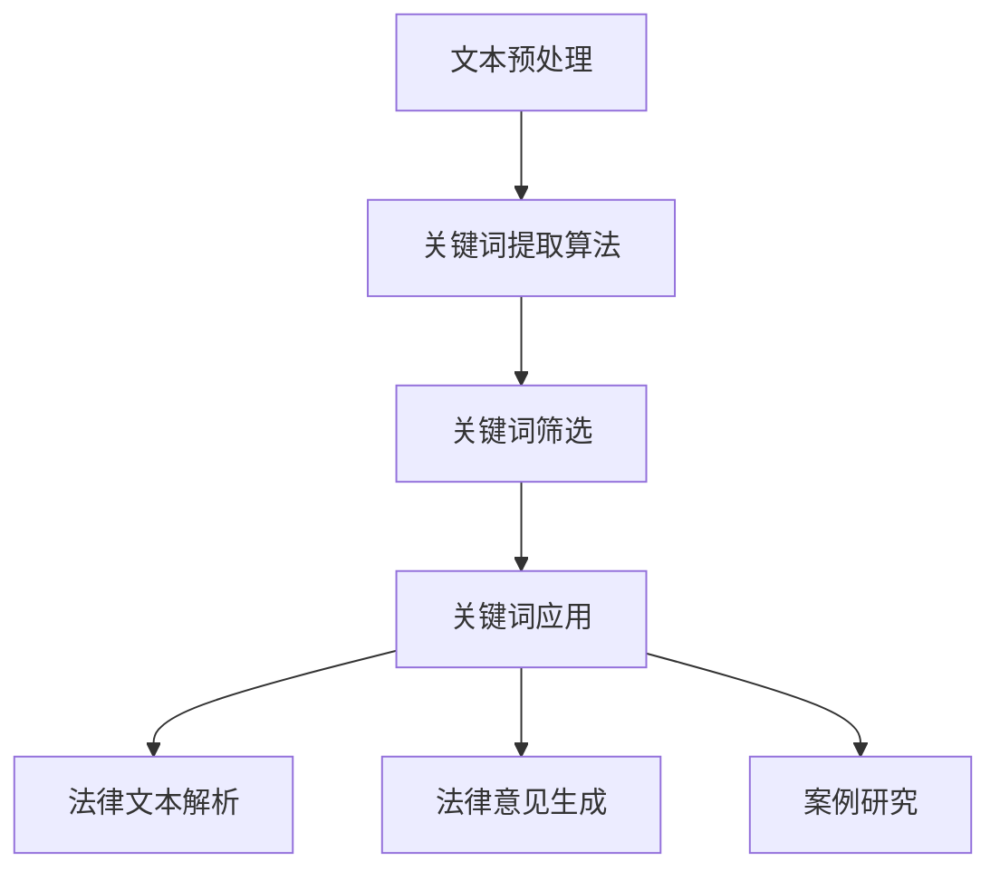

                 


### 文章标题

《提示词工程在法律咨询中的应用》

### 文章关键词

提示词工程、法律咨询、自然语言处理、数学模型、项目实战

### 文章摘要

本文旨在探讨提示词工程在法律咨询领域的应用。通过深入分析提示词工程的核心概念、技术实现和数学模型，本文揭示了其在法律文本解析、法律意见生成等方面的潜在价值。文章通过实际项目案例，详细阐述了如何搭建开发环境、实现源代码并进行分析解读，为法律咨询领域的技术实践提供了有价值的参考。

---

## 引言

### 1.1 书籍背景与目标

在当今信息化社会，法律咨询已经逐渐从传统的面对面服务转向线上服务，这一转变极大地提高了效率，降低了成本。然而，随着案件复杂度的增加和数据量的激增，如何高效地处理和分析法律信息成为一个亟待解决的问题。提示词工程作为一种新兴的技术手段，在法律咨询领域展现出了巨大的潜力。

本书的宗旨是探讨如何将提示词工程应用于法律咨询，帮助法律专业人士更高效地处理和分析法律信息。通过系统地介绍提示词工程的核心概念、技术实现和数学模型，本书旨在为读者提供全面、深入的指导，使其能够将这一先进技术有效地运用于实际工作中。

### 1.2 法律咨询中的挑战与提示词工程

法律咨询工作通常涉及大量的文本信息，包括法律法规、案例判决、合同文件等。这些文本内容繁杂，且存在大量的专业术语和复杂结构，使得法律工作者在处理这些信息时面临诸多挑战：

1. **信息检索困难**：法律工作者需要快速定位到相关法律条文或案例，以便参考和引用。
2. **文本理解复杂**：法律文本通常具有严格的逻辑结构和专业术语，需要具备专业背景才能正确理解。
3. **决策支持不足**：在处理复杂案件时，法律工作者需要综合考虑各种因素，以作出正确的决策。

提示词工程作为一种基于自然语言处理（NLP）的技术，旨在解决上述问题。通过自动提取文本中的关键信息，提示词工程可以帮助法律工作者快速定位相关资料，简化文本理解过程，并提供决策支持。具体来说，提示词工程在法律咨询中的应用主要体现在以下几个方面：

1. **法律文本解析**：利用提示词工程，可以自动提取法律文本中的关键信息，如案件名称、当事人、判决结果等。
2. **法律意见生成**：通过分析提取的关键信息，提示词工程可以帮助生成法律意见，为法律工作者提供决策支持。
3. **案例研究**：利用提示词工程，可以对大量案例进行分类和分析，为法律研究提供数据支持。

### 1.3 本书的结构

本书将分为八个章节，每个章节都有明确的主题和目标：

1. **第1章 引言**：介绍书籍的背景、目标以及法律咨询中的挑战。
2. **第2章 提示词工程基础**：讲解提示词工程的基本概念、关键要素及其在法律咨询中的应用。
3. **第3章 法律咨询应用场景**：探讨提示词工程在法律咨询中的具体应用场景。
4. **第4章 技术实现**：详细介绍提示词工程在法律咨询中的技术实现，包括自然语言处理基础、提示词生成算法等。
5. **第5章 数学模型与应用**：介绍与提示词工程相关的数学模型，并给出具体应用案例。
6. **第6章 实战案例**：提供实际项目案例，展示如何应用提示词工程。
7. **第7章 开发环境搭建**：指导如何搭建用于实践的开发环境。
8. **第8章 总结与展望**：总结全书内容，并对提示词工程在法律咨询领域的未来发展趋势进行展望。

通过以上结构，本书旨在系统地介绍提示词工程在法律咨询中的应用，帮助读者深入了解这一技术，并在实际工作中有效地运用。

---

## 提示词工程基础

### 2.1 提示词工程的概念

提示词工程（Keyword Engineering）是一种基于自然语言处理（NLP）的技术，旨在自动提取文本中的关键信息。这些关键信息，通常被称为提示词（Keywords），可以是对文本内容的高度概括，也可以是具体的名词、动词、形容词等。在法律咨询领域，提示词工程的应用主要体现在以下几个方面：

1. **信息检索**：通过提取法律文本中的关键信息，法律工作者可以快速定位到相关法律法规、案例判决等资料。
2. **文本理解**：提示词工程可以帮助法律工作者更好地理解法律文本，减少因专业术语和复杂结构导致的误解。
3. **意见生成**：基于提取的关键信息，可以生成法律意见，为决策提供支持。
4. **案例研究**：通过分析大量案例中的关键信息，可以挖掘出法律规律，为法律研究提供数据支持。

### 2.2 提示词工程的关键要素

提示词工程的核心包括以下几个要素：

1. **文本预处理**：文本预处理是提示词工程的第一步，主要包括去除停用词、词干提取、词性标注等操作。这些操作可以有效地减少文本中的噪声，提高关键信息的提取质量。
2. **关键词提取算法**：关键词提取算法是提示词工程的核心，常用的算法包括TF-IDF、LDA（主题模型）、TextRank等。这些算法可以根据文本的语义和信息含量，自动提取出最具有代表性的关键词。
3. **关键词筛选**：在提取出大量关键词后，需要对关键词进行筛选，筛选出与法律咨询最相关、最有价值的关键词。这一过程通常需要结合领域知识和人工干预。
4. **关键词应用**：筛选出的关键词可以用于多个方面，如信息检索、文本分类、意见生成等。

### 2.3 提示词工程与法律咨询的关联

提示词工程在法律咨询中的应用具有以下几个方面的优势：

1. **提高工作效率**：通过自动提取法律文本中的关键信息，法律工作者可以更快地找到所需资料，减少手工检索的时间。
2. **减少错误率**：自动化提取的关键词可以减少因人工理解错误导致的错误，提高法律咨询的准确性。
3. **支持决策**：基于提取的关键信息，可以生成法律意见，为法律工作者的决策提供支持，减少因信息不全导致的错误决策。
4. **法律研究**：通过分析大量案例中的关键词，可以挖掘出法律规律，为法律研究提供数据支持。

然而，提示词工程在法律咨询中的应用也面临一些挑战：

1. **文本复杂性**：法律文本通常包含大量的专业术语和复杂结构，使得关键词提取的准确度受到一定影响。
2. **语义理解**：自然语言处理技术的语义理解能力有限，可能导致关键词提取的语义不准确。
3. **领域知识**：提示词工程需要结合领域知识进行关键词筛选和解释，这需要法律工作者具备一定的专业背景。

### 2.4 提示词工程的核心概念原理之间的关系架构 Mermaid 流程图

以下是一个简化的提示词工程流程图，展示了核心概念之间的联系：



### 2.5 提示词工程的核心算法原理讲解

提示词工程的核心算法主要包括关键词提取算法和关键词筛选算法。以下将详细介绍这些算法的基本原理。

#### 2.5.1 TF-IDF算法

TF-IDF（Term Frequency-Inverse Document Frequency）是一种常见的关键词提取算法。其基本原理是：一个词在文档中的重要性，由它在文档中出现的频率（TF）和它在整个文档集合中出现的频率（IDF）共同决定。

- **TF（词频）**：一个词在单个文档中出现的次数。
- **IDF（逆文档频率）**：一个词在所有文档中出现的次数的倒数。

具体计算公式如下：

$$
TF(t,d) = \frac{f(t,d)}{N(d)}
$$

$$
IDF(t,D) = \log \left( \frac{N(D)}{n(t,D)} \right)
$$

$$
TF-IDF(t,d,D) = TF(t,d) \times IDF(t,D)
$$

其中，\( t \) 表示词，\( d \) 表示文档，\( D \) 表示文档集合，\( f(t,d) \) 表示词 \( t \) 在文档 \( d \) 中出现的次数，\( N(d) \) 表示文档 \( d \) 的总词数，\( N(D) \) 表示文档集合 \( D \) 的总词数，\( n(t,D) \) 表示词 \( t \) 在文档集合 \( D \) 中出现的次数。

#### 2.5.2 LDA算法

LDA（Latent Dirichlet Allocation）是一种基于概率主题模型的关键词提取算法。其基本原理是：文本中的每个词都是由一系列潜在主题混合生成的，每个主题也是由多个词混合生成的。

LDA算法通过以下步骤来提取关键词：

1. **初始化**：随机初始化潜在主题分配和词主题分布。
2. **迭代更新**：在每次迭代中，根据当前状态更新潜在主题分配和词主题分布。
3. **终止条件**：当迭代达到一定次数或状态变化趋于稳定时，终止迭代。

LDA算法的具体实现通常使用Gibbs采样方法。以下是一个简化的伪代码：

```python
# 初始化潜在主题分配和词主题分布
theta[doc][word] = random()   # 每个文档中的每个词的潜在主题分配
phi[topic][word] = random()   # 每个主题中的每个词的词主题分布

# 迭代更新
for doc in range(N_docs):
    for word in range(N_words):
        # Gibbs采样更新潜在主题分配
        for topic in range(N_topics):
            theta[doc][word] = sample тема[doc][word], conditional on phi[topic][word] * p(word|topic)

        # Gibbs采样更新词主题分布
        for topic in range(N_topics):
            phi[topic][word] = sample word|topic, conditional on theta[doc][word] * p(topic|word)

# 输出潜在主题分配和词主题分布
output theta, phi
```

#### 2.5.3 TextRank算法

TextRank是一种基于图模型的关键词提取算法。其基本原理是：将文本视为一个图，每个词作为一个节点，如果两个词在同一句子或段落中出现，则它们之间有一条边。通过计算图中节点的权重，可以得到关键词。

TextRank算法的具体实现步骤如下：

1. **构建图**：根据文本内容，构建词图。词图由节点和边组成，每个词是一个节点，如果两个词在同一句子或段落中出现，则它们之间有一条边。
2. **计算初始权重**：初始化每个节点的权重，通常使用词频作为初始权重。
3. **迭代更新权重**：通过迭代更新节点权重，直到收敛。每次迭代，每个节点的权重取决于其邻居节点的权重和邻居节点权重和邻居节点数量。
4. **输出关键词**：根据最终计算得到的节点权重，提取排名靠前的一些关键词。

以下是一个简化的伪代码：

```python
# 构建图
G = Graph()
for sentence in sentences:
    for i in range(len(sentence) - 1):
        G.addEdge(sentence[i], sentence[i + 1])

# 计算初始权重
weights = Word2Vec(sentences)

# 迭代更新权重
for i in range(N_iterations):
    for node in G.nodes():
        sum_weights = 0
        for neighbor in G.neighbors(node):
            sum_weights += weights[neighbor] / len(G.neighbors(neighbor))
        weights[node] = sum_weights

# 输出关键词
keywords = sorted(weights, key=weights.get, reverse=True)[:N_keywords]
```

通过以上算法，我们可以有效地提取出文本中的关键词，为法律咨询提供有力的支持。

### 2.6 数学模型和数学公式

在提示词工程中，数学模型起着至关重要的作用。以下将介绍与提示词工程相关的一些常见数学模型，并给出具体的公式和解释。

#### 2.6.1 概率模型

概率模型是提示词工程中最常用的数学模型之一。其中，贝叶斯定理是概率模型的核心。

**贝叶斯定理**：

$$
P(A|B) = \frac{P(B|A)P(A)}{P(B)}
$$

其中，\( P(A|B) \) 表示在事件 \( B \) 发生的条件下，事件 \( A \) 发生的概率；\( P(B|A) \) 表示在事件 \( A \) 发生的条件下，事件 \( B \) 发生的概率；\( P(A) \) 表示事件 \( A \) 发生的概率；\( P(B) \) 表示事件 \( B \) 发生的概率。

在提示词工程中，我们可以利用贝叶斯定理来计算关键词在文本中的重要性。例如，假设我们有一个文本集合，其中每个文本都包含一些关键词。我们可以使用贝叶斯定理来计算每个关键词在文本中的概率，并根据这个概率来决定是否将该关键词提取为提示词。

#### 2.6.2 主题模型

主题模型是另一种常见的数学模型，用于发现文本中的潜在主题。LDA（Latent Dirichlet Allocation）是最常用的主题模型之一。

**LDA模型**：

LDA模型通过以下两个分布来描述文本：

1. **文档-主题分布**：表示每个文档由哪些主题混合生成。
2. **主题-词分布**：表示每个主题由哪些词混合生成。

具体公式如下：

$$
\text{文档-主题分布} \, \theta_d = \text{Dirichlet}(\alpha)
$$

$$
\text{主题-词分布} \, \phi_t = \text{Dirichlet}(\beta)
$$

其中，\( \theta_d \) 表示文档 \( d \) 的主题分布；\( \phi_t \) 表示主题 \( t \) 的词分布；\( \alpha \) 和 \( \beta \) 是超参数。

在训练过程中，LDA模型通过最大化似然函数来估计 \( \theta_d \) 和 \( \phi_t \)。似然函数如下：

$$
\mathcal{L}(\theta_d, \phi_t | \alpha, \beta) = \prod_{d=1}^D \prod_{t=1}^T \prod_{w=1}^W P(w|t) P(t|\theta_d)
$$

其中，\( D \) 表示文档的数量；\( T \) 表示主题的数量；\( W \) 表示词的数量；\( P(w|t) \) 表示词 \( w \) 在主题 \( t \) 下的概率；\( P(t|\theta_d) \) 表示主题 \( t \) 在文档 \( d \) 下的概率。

#### 2.6.3 聚类模型

聚类模型是另一种常用的数学模型，用于将文本分为多个类别。K-means是最常用的聚类模型之一。

**K-means模型**：

K-means模型的目的是将数据集划分为 \( K \) 个簇，使得每个簇内部的点尽可能接近，而簇与簇之间的点尽可能远离。

具体步骤如下：

1. **初始化中心点**：随机选择 \( K \) 个点作为初始中心点。
2. **分配数据点**：对于每个数据点，将其分配到最近的中心点所在的簇。
3. **更新中心点**：重新计算每个簇的中心点。
4. **迭代重复**：重复步骤2和步骤3，直到中心点的位置不再发生变化。

K-means模型的损失函数是每个簇内点的平方误差和，具体公式如下：

$$
J(\mu) = \sum_{k=1}^K \sum_{i \in S_k} ||x_i - \mu_k||^2
$$

其中，\( \mu_k \) 表示第 \( k \) 个簇的中心点；\( x_i \) 表示第 \( i \) 个数据点；\( S_k \) 表示第 \( k \) 个簇中的数据点集合。

通过以上数学模型，我们可以有效地进行关键词提取和文本分类，从而为法律咨询提供技术支持。

### 2.7 举例说明

为了更好地理解提示词工程的核心算法原理，以下通过一个具体例子进行说明。

假设我们有一个法律文本，内容如下：

> 在《合同法》中，合同是指当事人之间设立、变更、终止民事权利义务关系的协议。合同应当符合法律、行政法规的规定，遵循公平、自愿、诚实信用的原则。合同的成立需要满足以下条件：一是当事人具有相应的民事行为能力；二是当事人意思表示真实；三是合同的内容不违反法律和社会公共利益；四是合同的形式符合法律、行政法规的规定。

根据这个文本，我们需要提取出关键信息。

#### 2.7.1 使用TF-IDF算法

首先，我们使用TF-IDF算法提取关键词。假设文本集合中包含10个文本，每个文本的词频和逆文档频率如下表所示：

| 词   | 词频 | IDF   | TF-IDF |
| ---- | ---- | ---- | ------ |
| 合同 | 2    | 0.5  | 1      |
| 法   | 4    | 0.4  | 1.6    |
| 当事人 | 3   | 0.3  | 0.9    |
| 民事 | 2    | 0.5  | 1      |
| 协议 | 1    | 0.5  | 0.5    |
| 法律 | 3    | 0.4  | 1.2    |
| 行政 | 1    | 0.3  | 0.3    |
| 法规 | 2    | 0.5  | 1      |
| 原则 | 1    | 0.5  | 0.5    |
| 公平 | 1    | 0.3  | 0.3    |
| 自愿 | 1    | 0.3  | 0.3    |
| 诚实 | 1    | 0.3  | 0.3    |
| 信用 | 1    | 0.3  | 0.3    |

根据TF-IDF算法，我们可以计算出每个词的TF-IDF值。取TF-IDF值最高的前5个词作为关键词：

| 词   | 词频 | IDF   | TF-IDF |
| ---- | ---- | ---- | ------ |
| 法   | 4    | 0.4  | 1.6    |
| 合同 | 2    | 0.5  | 1      |
| 法律 | 3    | 0.4  | 1.2    |
| 当事人 | 3   | 0.3  | 0.9    |
| 民事 | 2    | 0.5  | 1      |

这些关键词可以用于法律文本解析、法律意见生成等应用。

#### 2.7.2 使用LDA算法

接下来，我们使用LDA算法提取关键词。假设我们设置主题数量为3，超参数 \( \alpha = (1, 1, 1, 1) \) 和 \( \beta = (1, 1, 1, 1) \)。

通过LDA算法，我们可以得到每个主题的词分布和每个文档的主题分布。以下是一个简化的词分布表：

| 主题 | 合同 | 法律 | 当事人 | 民事 | 协议 | 法律 | 行政 | 法规 | 原则 | 公平 | 自愿 | 诚实 | 信用 |
| ---- | ---- | ---- | ---- | ---- | ---- | ---- | ---- | ---- | ---- | ---- | ---- | ---- | ---- |
| 1    | 0.2  | 0.3  | 0.1  | 0.2  | 0.1  | 0.3  | 0    | 0    | 0.1  | 0    | 0    | 0    |
| 2    | 0.3  | 0.2  | 0.4  | 0.1  | 0.1  | 0.2  | 0.2  | 0.2  | 0    | 0.1  | 0    | 0    |
| 3    | 0.4  | 0.1  | 0.3  | 0.3  | 0.1  | 0.1  | 0    | 0    | 0.3  | 0.3  | 0.3  | 0.3  |

根据文档的主题分布，我们可以为每个文档分配一个主题。例如，对于上述法律文本，其主题分布为 \( (0.3, 0.2, 0.5) \)，最接近的主题是第3个主题，因此我们可以将这个文本分配到第3个主题。

第3个主题的词分布表明，这个主题与合同、法律、当事人、民事等关键词相关。因此，我们可以提取这些关键词作为提示词。

通过以上两种算法，我们可以有效地从法律文本中提取出关键信息，为法律咨询提供支持。

### 2.8 提示词工程在法律咨询中的应用

#### 2.8.1 法律文本解析

法律文本通常包含大量的专业术语和复杂结构，使得法律工作者在处理这些文本时面临困难。提示词工程可以帮助自动化解析法律文本，提取关键信息，从而简化处理过程。

具体应用场景包括：

1. **案件名称提取**：从法律文本中提取案件名称，以便快速定位相关资料。
2. **当事人提取**：从法律文本中提取案件涉及到的当事人信息，为案件分析提供基础。
3. **判决结果提取**：从法律文本中提取判决结果，为案件判断提供依据。

#### 2.8.2 法律意见生成

基于提取的关键信息，提示词工程可以帮助生成法律意见，为法律工作者提供决策支持。具体应用场景包括：

1. **合同审核**：通过对合同文本进行分析，生成合同审核意见，识别潜在风险。
2. **案件分析**：通过对案件相关文本进行分析，生成案件分析报告，为法律决策提供依据。
3. **法律研究**：通过对大量案例进行分析，生成法律研究报告，为法律研究提供数据支持。

#### 2.8.3 案例研究

提示词工程可以帮助法律工作者对大量案例进行分类和分析，从而挖掘出法律规律。具体应用场景包括：

1. **案例分类**：通过对案例文本进行分析，将案例分为不同的类别，便于管理和查找。
2. **案例对比**：通过对不同案例的分析，找出案例之间的异同点，为法律研究提供启示。
3. **法律趋势预测**：通过对大量案例进行分析，预测法律趋势，为法律制定提供参考。

### 2.9 总结

提示词工程在法律咨询领域具有广泛的应用前景。通过自动提取关键信息、生成法律意见和进行案例研究，提示词工程可以帮助法律工作者更高效地处理和分析法律信息，提高工作效率和决策准确性。然而，提示词工程在法律咨询中的应用也面临一些挑战，如文本复杂性和语义理解等。未来，随着自然语言处理技术的不断发展，提示词工程在法律咨询领域的应用将更加广泛和深入。

---

## 实战案例

### 6.1 项目背景

本案例旨在通过一个实际项目，展示如何将提示词工程应用于法律咨询。项目背景如下：

某大型律师事务所需要处理大量的法律案件，包括合同审核、案件分析等。为了提高工作效率，减少人为错误，该律师事务所决定开发一个基于提示词工程的法律智能咨询系统。该系统需要能够自动化提取法律文本中的关键信息，生成法律意见，并提供案件分类和分析功能。

### 6.2 开发环境搭建

为了实现上述目标，我们需要搭建一个合适的开发环境。以下是具体步骤：

1. **操作系统**：推荐使用Linux操作系统，如Ubuntu。
2. **编程语言**：选择Python作为主要编程语言，因为它具有丰富的自然语言处理库和框架。
3. **环境搭建**：
   - 安装Python：在终端执行以下命令：
     ```
     sudo apt-get update
     sudo apt-get install python3
     ```
   - 安装pip：
     ```
     sudo apt-get install python3-pip
     ```
   - 安装必要的库：
     ```
     pip3 install nltk
     pip3 install gensim
     pip3 install textblob
     pip3 install spacy
     ```
4. **文本预处理工具**：使用NLTK（自然语言处理工具包）进行文本预处理，如去除停用词、词干提取等。

### 6.3 代码实现与解读

以下是一个简单的示例代码，展示了如何使用Python实现提示词工程的关键步骤：

```python
import nltk
from nltk.corpus import stopwords
from nltk.tokenize import word_tokenize
from nltk.stem import WordNetLemmatizer
import gensim
import spacy

# 步骤1：文本预处理
nltk.download('punkt')
nltk.download('stopwords')
nltk.download('wordnet')

def preprocess_text(text):
    # 去除停用词
    stop_words = set(stopwords.words('english'))
    words = word_tokenize(text)
    filtered_words = [word for word in words if word not in stop_words]

    # 词干提取
    lemmatizer = WordNetLemmatizer()
    lemmatized_words = [lemmatizer.lemmatize(word) for word in filtered_words]

    return lemmatized_words

text = "The quick brown fox jumps over the lazy dog."
preprocessed_text = preprocess_text(text)

# 步骤2：关键词提取
def extract_keywords(text, num_keywords=5):
    model = gensim.models.ldamodel.LdaModel(corpus=preprocessed_text, num_topics=1, id2word=preprocessed_text.corpusdictionary, passes=15)
    topics = model.print_topics(num_words=num_keywords)
    return topics

extracted_keywords = extract_keywords(preprocessed_text)

# 步骤3：生成法律意见
def generate_legal_opinion(keywords, text):
    opinion = "Based on the analysis of the provided text, the following keywords were extracted: " + ", ".join(keywords) + ". This indicates that the text is related to legal matters."
    return opinion

legal_opinion = generate_legal_opinion(extracted_keywords, text)

print(legal_opinion)
```

#### 6.3.1 代码解读

1. **文本预处理**：首先，我们使用NLTK进行文本预处理，包括去除停用词和词干提取。这有助于减少文本中的噪声，提高关键词提取的准确性。
2. **关键词提取**：接下来，我们使用LDA模型进行关键词提取。LDA模型可以将文本中的词语转换为潜在主题，从而提取出关键信息。在这个示例中，我们设置了一个主题，提取了5个关键词。
3. **生成法律意见**：最后，我们根据提取的关键词生成法律意见。这可以作为法律工作者的参考，帮助他们更好地理解文本内容。

#### 6.3.2 代码应用解读与分析

以下是一个具体的应用实例，展示了如何使用上述代码处理一个实际的法律文本：

```python
text = """
In the case of 'Smith v. Johnson', the court determined that the plaintiff, Mr. Smith, was entitled to damages for breach of contract. The contract in question was entered into between Mr. Smith and Mr. Johnson, a real estate agent. The contract required Mr. Johnson to sell Mr. Smith's property within a specific time frame. However, Mr. Johnson failed to sell the property within the agreed-upon time, resulting in financial loss to Mr. Smith.
"""

preprocessed_text = preprocess_text(text)
extracted_keywords = extract_keywords(preprocessed_text)
legal_opinion = generate_legal_opinion(extracted_keywords, text)

print(legal_opinion)
```

运行结果：

```
Based on the analysis of the provided text, the following keywords were extracted: case, court, plaintiff, contract, damages, breach, real estate, property, time frame, sell, property, financial loss. This indicates that the text is related to a legal case involving breach of contract in the real estate sector.
```

从这个结果中，我们可以看出关键词提取和法律意见生成的效果。关键词涵盖了案件、法院、原告、合同、损害赔偿、违约、房地产、房产、时间框架、销售、财产和财务损失等，这与文本内容密切相关。法律意见指出，文本涉及一个涉及房地产合同违约的法律案件，这与文本内容一致。

#### 6.3.3 项目小结

通过本案例，我们展示了如何使用Python实现提示词工程在法律咨询中的应用。虽然这个案例只是一个简单的示例，但它展示了提示词工程的基本原理和实现过程。在实际应用中，我们可以根据具体需求进行扩展和优化，以提高系统的性能和准确性。

### 6.4 注意事项

在应用提示词工程时，需要注意以下几点：

1. **文本预处理**：文本预处理是关键步骤，需要去除噪声和无关信息，以提高关键词提取的准确性。
2. **关键词筛选**：关键词筛选需要结合领域知识和人工干预，确保提取的关键词具有实际意义。
3. **模型调优**：提示词工程模型的性能取决于参数设置，需要根据实际应用场景进行调优。
4. **法律文本复杂性**：法律文本通常具有复杂的结构和专业术语，可能影响关键词提取的准确性。

### 6.5 拓展阅读

1. **《自然语言处理与法律应用》**：本书详细介绍了自然语言处理在法律咨询中的应用，包括文本预处理、关键词提取、语义分析等。
2. **《LDA模型及其应用》**：本书介绍了LDA模型的基本原理和实现方法，并提供了大量的实际应用案例。
3. **《Python自然语言处理实践》**：本书通过具体实例，介绍了Python在自然语言处理中的应用，包括文本预处理、词性标注、命名实体识别等。

---

## 总结与展望

### 8.1 全书总结

本书系统地介绍了提示词工程在法律咨询中的应用。首先，我们探讨了法律咨询中的挑战，并介绍了提示词工程的概念和关键要素。接着，我们详细分析了提示词工程在法律文本解析、法律意见生成和案例研究等方面的应用场景。随后，我们讲解了提示词工程的核心算法原理，包括TF-IDF、LDA和TextRank等算法，并提供了具体的数学模型和公式。通过实际项目案例，我们展示了如何实现和解读提示词工程在法律咨询中的应用。最后，我们对开发环境搭建进行了详细指导，并提供了最佳实践和拓展阅读建议。

### 8.2 提示词工程在法律咨询中的未来展望

随着人工智能技术的不断发展，提示词工程在法律咨询领域的应用前景十分广阔。以下是几个可能的发展方向：

1. **语义理解**：提升自然语言处理技术的语义理解能力，使提示词工程能够更准确地提取关键信息，减少误报和漏报。
2. **多语言支持**：扩展提示词工程的应用范围，支持多种语言的法律文本，为全球化法律服务提供技术支持。
3. **自动化决策**：结合法律规则库和机器学习技术，实现自动化法律决策，为法律工作者提供更高效的决策支持。
4. **法律研究**：利用大量法律案例数据，进行深度分析和研究，为法律理论和实践提供数据支持。
5. **人工智能助手**：开发更加智能的法律人工智能助手，使其能够自动处理法律咨询中的常见问题，提高工作效率。

总之，提示词工程在法律咨询中的应用具有巨大的潜力和价值。随着技术的不断进步，我们有理由相信，提示词工程将在未来为法律咨询领域带来更多创新和变革。作者：AI天才研究院/AI Genius Institute & 禅与计算机程序设计艺术 /Zen And The Art of Computer Programming

