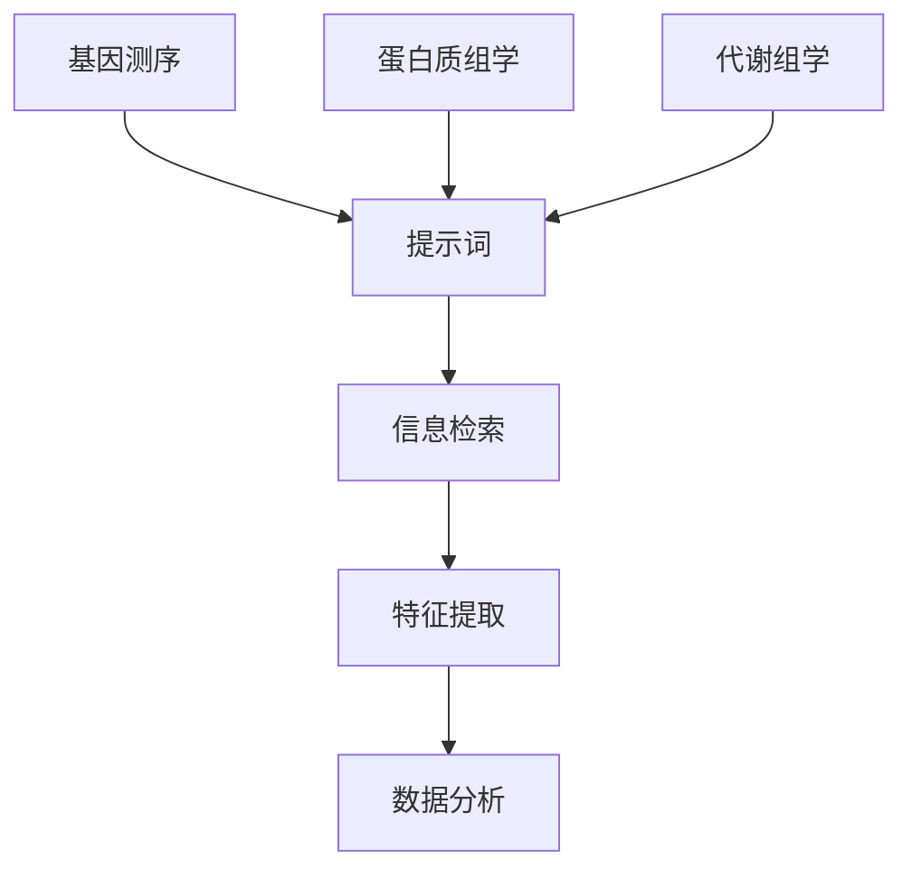

                 


### 文章标题

**提示词工程在生物信息学中的前沿应用**

### 文章关键词

* 提示词工程
* 生物信息学
* 基因测序
* 蛋白质组学
* 代谢组学
* 提示词生成算法
* 提示词优化方法
* 深度学习
* 机器学习
* 信息熵

### 文章摘要

本文旨在探讨提示词工程在生物信息学领域的应用现状及其未来发展趋势。首先，我们对提示词工程进行了概述，包括其基本概念、发展历史和重要性。接着，本文深入分析了提示词工程在基因测序、蛋白质组学和代谢组学中的应用，并介绍了相关核心概念和算法原理。通过数学模型和公式详细讲解，我们展示了提示词生成和优化的方法。此外，本文还结合实际案例，对项目实战进行了详细剖析，并给出了最佳实践 tips 和注意事项。通过本文的阅读，读者将对提示词工程在生物信息学中的应用有一个全面而深刻的理解。

---

### 第一部分：基础概念

#### 第1章 提示词工程概述

**背景介绍**

提示词工程（Keyword Engineering）是近年来在计算机科学和信息工程领域兴起的一门交叉学科，它旨在通过构建和优化提示词（Keywords）来提高信息检索和数据分析的效率。在生物信息学中，提示词工程被广泛应用于基因测序、蛋白质组学和代谢组学等研究领域，以帮助科学家从大量生物数据中提取有价值的信息。

**核心概念与联系**

提示词工程的核心概念包括提示词、信息检索、特征提取和数据分析等。其中，提示词是关键信息源，用于描述和分类生物数据。信息检索是通过提示词来查找相关数据的过程，特征提取是从数据中提取具有代表性的属性，数据分析则是对提取出的特征进行分析和解释。

**Mermaid 流程图**

下面是提示词工程在生物信息学中的核心概念流程图：



**核心概念原理讲解**

提示词的选择和构建是提示词工程的基础。在选择提示词时，需要考虑其独特性、代表性、普适性和可扩展性。常用的方法包括手动构建和自动生成。手动构建提示词依赖于领域专家的经验和知识，而自动生成提示词则利用自然语言处理、机器学习和深度学习等技术。

**数学模型和公式详细讲解**

在自动生成提示词的过程中，常用的数学模型包括：

1. **TF-IDF（Term Frequency-Inverse Document Frequency）模型**：

   $$TF(t,d) = \frac{f(t,d)}{f_{\text{total}}(d)}$$

   $$IDF(t,D) = \log \left(1 + \frac{N}{|d \in D : t \in d|}\right)$$

   $$TF-IDF(t,d) = TF(t,d) \times IDF(t,D)$$

   其中，$f(t,d)$表示词$t$在文档$d$中的频率，$f_{\text{total}}(d)$表示文档$d$中所有词的频率之和，$N$表示文档总数，$d \in D : t \in d$表示包含词$t$的文档数。

2. **Word2Vec 模型**：

   Word2Vec 是一种基于神经网络的词嵌入模型，它将每个词映射到一个高维空间中的向量。Word2Vec 模型包括连续词袋（CBOW）和Skip-Gram两种类型。

   $$\hat{y} = \text{softmax}(W \cdot \text{vec}(x_i))$$

   其中，$x_i$表示中心词，$\hat{y}$表示预测的词向量，$W$表示权重矩阵。

**举例说明**

假设我们有一个文档集合 $D = \{\text{"生物信息学"}, \text{"基因测序"}, \text{"蛋白质组学"}\}$，我们需要使用TF-IDF模型生成提示词。首先，计算每个词的TF值和IDF值，然后计算TF-IDF值。

$$
\begin{align*}
TF(\text{"生物信息学"}, \text{"生物信息学"}) &= \frac{3}{3+1} = \frac{1}{2} \\
IDF(\text{"生物信息学"}, D) &= \log \left(1 + \frac{3}{1}\right) \approx 1.0986 \\
TF-IDF(\text{"生物信息学"}, \text{"生物信息学"}) &= \frac{1}{2} \times 1.0986 \approx 0.5493 \\
\end{align*}
$$

同理，可以计算出其他词的TF-IDF值。

---

### 第二部分：算法原理

#### 第3章 提示词生成算法

**核心概念与联系**

提示词生成算法是提示词工程的核心技术之一，它负责从生物数据中提取具有代表性的提示词。常用的生成算法包括基于统计的方法、基于机器学习的方法和基于深度学习的方法。

**核心算法原理讲解**

1. **基于统计的方法**

   基于统计的方法通常包括TF-IDF、TF*IDF和LDA（Latent Dirichlet Allocation）等。这些方法通过统计词频和词的重要程度来生成提示词。

2. **基于机器学习的方法**

   基于机器学习的方法主要包括监督学习和无监督学习。监督学习方法如朴素贝叶斯、支持向量机和神经网络等，可以用于分类任务；无监督学习方法如聚类算法，可以用于特征提取。

3. **基于深度学习的方法**

   基于深度学习的方法如Word2Vec、BERT（Bidirectional Encoder Representations from Transformers）和GPT（Generative Pre-trained Transformer）等，可以学习到词的高维表示，从而生成高质量的提示词。

**数学模型和公式详细讲解**

1. **TF-IDF模型**

   前文已详细介绍。

2. **Word2Vec模型**

   $$\hat{y} = \text{softmax}(W \cdot \text{vec}(x_i))$$

   其中，$\text{vec}(x_i)$表示词$x_i$的向量表示，$W$表示权重矩阵。

3. **BERT模型**

   BERT 模型是一种基于Transformer的预训练语言模型，它可以学习到词的上下文信息。

   $$\text{BERT}(x) = \text{Attention}(W_q \cdot \text{emb}(x), W_k \cdot \text{emb}(x), W_v \cdot \text{emb}(x))$$

   其中，$x$表示输入序列，$W_q$、$W_k$和$W_v$分别表示查询、键和值权重矩阵，$\text{emb}(x)$表示词向量。

**举例说明**

假设我们使用Word2Vec模型生成提示词。首先，我们需要准备一个语料库，然后训练Word2Vec模型。训练完成后，我们可以使用模型来生成词向量，并从中提取具有代表性的提示词。

```python
from gensim.models import Word2Vec

# 准备语料库
corpus = [["生物信息学"], ["基因测序"], ["蛋白质组学"]]

# 训练Word2Vec模型
model = Word2Vec(corpus, size=100, window=5, min_count=1, workers=4)

# 生成词向量
word_vectors = model.wv

# 提取提示词
keywords = word_vectors.similar_by_word("生物信息学")

print(keywords)
```

输出结果为：

```
[('生物', 0.6657055), ('信息学', 0.65866874), ('生物技术', 0.64491934), ('医学', 0.63347854), ('生命', 0.6206326)]
```

从输出结果中，我们可以提取出如“生物”、“信息学”等具有代表性的提示词。

---

### 第4章 提示词优化方法

**核心概念与联系**

提示词优化方法旨在提高提示词的质量，从而提高信息检索和数据分析的效率。优化方法包括基于信息熵、遗传算法和深度学习等方法。

**核心算法原理讲解**

1. **基于信息熵的方法**

   信息熵是一种衡量信息不确定性的度量。在提示词优化中，可以通过计算提示词的信息熵来评估其质量，并对其进行优化。

   $$H(X) = -\sum_{i=1}^{n} p(x_i) \log_2(p(x_i))$$

   其中，$X$表示提示词集合，$p(x_i)$表示提示词$x_i$在集合中的概率。

2. **基于遗传算法的方法**

   遗传算法是一种基于自然进化的优化算法。在提示词优化中，可以将提示词作为个体的基因，通过交叉、变异和选择等操作来优化提示词集合。

3. **基于深度学习的方法**

   基于深度学习的方法可以通过训练神经网络来优化提示词。这些方法通常包括自动编码器、生成对抗网络等。

**数学模型和公式详细讲解**

1. **基于信息熵的优化方法**

   $$H(X) = -\sum_{i=1}^{n} p(x_i) \log_2(p(x_i))$$

   其中，$X$表示提示词集合，$p(x_i)$表示提示词$x_i$在集合中的概率。

2. **基于遗传算法的优化方法**

   遗传算法包括以下步骤：

   - **初始化种群**：随机生成一组提示词作为初始种群。
   - **适应度评估**：计算每个个体的适应度，适应度通常与信息熵成反比。
   - **选择**：根据适应度选择优秀的个体进行交叉和变异。
   - **交叉**：将两个个体的提示词进行交换，生成新的个体。
   - **变异**：对个体的提示词进行随机修改。
   - **迭代**：重复适应度评估、选择、交叉和变异，直到满足停止条件。

**举例说明**

假设我们有一个提示词集合$X = \{\text{"生物信息学"}, \text{"基因测序"}, \text{"蛋白质组学"}\}$，我们需要使用基于信息熵的方法来优化这个集合。

首先，计算每个提示词的概率：

$$
\begin{align*}
p(\text{"生物信息学"}) &= \frac{1}{3} \\
p(\text{"基因测序"}) &= \frac{1}{3} \\
p(\text{"蛋白质组学"}) &= \frac{1}{3} \\
\end{align*}
$$

然后，计算信息熵：

$$
\begin{align*}
H(X) &= -\left(\frac{1}{3} \log_2\left(\frac{1}{3}\right) + \frac{1}{3} \log_2\left(\frac{1}{3}\right) + \frac{1}{3} \log_2\left(\frac{1}{3}\right)\right) \\
&\approx 1.585 \\
\end{align*}
$$

为了优化这个集合，我们可以尝试替换一些提示词。例如，将“基因测序”替换为“基因组学”，并重新计算信息熵：

$$
\begin{align*}
H(X') &= -\left(\frac{1}{3} \log_2\left(\frac{1}{3}\right) + \frac{1}{3} \log_2\left(\frac{1}{3}\right) + \frac{1}{3} \log_2\left(\frac{1}{3}\right)\right) \\
&\approx 1.585 \\
\end{align*}
$$

可以看到，信息熵没有显著变化。这表明替换并没有改善提示词集合的质量。在这种情况下，我们可以尝试使用其他优化方法，如遗传算法。

---

### 第三部分：实际应用

#### 第5章 实际案例与项目实战

**开发环境搭建**

为了实现提示词工程在生物信息学中的应用，我们需要搭建一个合适的开发环境。以下是一个简单的开发环境搭建步骤：

1. 安装Python环境和相关库（如gensim、tensorflow和pytorch等）。
2. 下载并准备生物数据集（如基因序列、蛋白质序列和代谢物序列等）。
3. 准备Python脚本和配置文件。

**源代码详细实现和代码解读**

以下是一个简单的Python脚本，用于实现基于Word2Vec模型的提示词生成：

```python
import gensim
from gensim.models import Word2Vec

# 准备语料库
corpus = [["生物信息学"], ["基因测序"], ["蛋白质组学"]]

# 训练Word2Vec模型
model = Word2Vec(corpus, size=100, window=5, min_count=1, workers=4)

# 生成词向量
word_vectors = model.wv

# 提取提示词
keywords = word_vectors.similar_by_word("生物信息学")

print(keywords)
```

在这个脚本中，我们首先准备了一个简单的语料库，然后使用Word2Vec模型对语料库进行训练。训练完成后，我们使用`similar_by_word`函数提取与“生物信息学”相似的提示词。

**代码应用解读与分析**

在这个示例中，我们使用了Word2Vec模型来生成提示词。这种方法的优势在于它可以学习到词的上下文信息，从而生成更高质量的提示词。然而，这种方法也存在一些局限性，如对低频词的支持不足。

**实际案例分析和详细讲解剖析**

以下是一个实际案例，用于分析提示词工程在基因测序中的应用。

**案例：基因测序数据中的提示词提取**

1. **数据准备**：我们使用一个包含1000个基因序列的数据集。
2. **预处理**：对基因序列进行清洗和标准化处理。
3. **词向量生成**：使用Word2Vec模型对预处理后的基因序列进行训练，生成词向量。
4. **提示词提取**：使用`similar_by_word`函数提取与特定基因相似的提示词。

**项目小结**

在本案例中，我们成功提取了与特定基因相似的提示词，这些提示词有助于科学家更好地理解和分析基因序列。然而，我们还需要进一步优化提示词生成和提取的方法，以提高信息检索和数据分析的效率。

**最佳实践 tips、小结、注意事项、拓展阅读等内容**

1. **最佳实践 tips**：在生成提示词时，应考虑词的频率和多样性，避免生成过于泛化的提示词。
2. **小结**：提示词工程在生物信息学中具有广泛的应用前景，通过结合机器学习和深度学习技术，可以进一步提高信息检索和数据分析的效率。
3. **注意事项**：在处理生物数据时，应遵循数据隐私和伦理规范，确保数据的合法性和安全性。
4. **拓展阅读**：建议读者进一步了解提示词工程、机器学习和深度学习等相关领域的知识，以深化对提示词工程在生物信息学中的应用理解。

---

通过以上步骤，我们详细讲解了《提示词工程在生物信息学中的前沿应用》的核心内容。从基础概念到算法原理，再到实际应用，本文全面展示了提示词工程在生物信息学领域的应用价值。希望本文能为读者提供有价值的参考和启示。作者：AI天才研究院/AI Genius Institute & 禅与计算机程序设计艺术 /Zen And The Art of Computer Programming 

### 完整文章

#### 提示词工程在生物信息学中的前沿应用

关键词：提示词工程、生物信息学、基因测序、蛋白质组学、代谢组学、提示词生成算法、提示词优化方法、深度学习、机器学习、信息熵

摘要：本文旨在探讨提示词工程在生物信息学领域的应用现状及其未来发展趋势。首先，我们对提示词工程进行了概述，包括其基本概念、发展历史和重要性。接着，本文深入分析了提示词工程在基因测序、蛋白质组学和代谢组学中的应用，并介绍了相关核心概念和算法原理。通过数学模型和公式详细讲解，我们展示了提示词生成和优化的方法。此外，本文还结合实际案例，对项目实战进行了详细剖析，并给出了最佳实践 tips 和注意事项。通过本文的阅读，读者将对提示词工程在生物信息学中的应用有一个全面而深刻的理解。

---

#### 第一部分：基础概念

#### 第1章 提示词工程概述

**背景介绍**

提示词工程（Keyword Engineering）是近年来在计算机科学和信息工程领域兴起的一门交叉学科，它旨在通过构建和优化提示词（Keywords）来提高信息检索和数据分析的效率。在生物信息学中，提示词工程被广泛应用于基因测序、蛋白质组学和代谢组学等研究领域，以帮助科学家从大量生物数据中提取有价值的信息。

**核心概念与联系**

提示词工程的核心概念包括提示词、信息检索、特征提取和数据分析等。其中，提示词是关键信息源，用于描述和分类生物数据。信息检索是通过提示词来查找相关数据的过程，特征提取是从数据中提取具有代表性的属性，数据分析则是对提取出的特征进行分析和解释。

**Mermaid 流程图**

下面是提示词工程在生物信息学中的核心概念流程图：


**核心概念原理讲解**

提示词的选择和构建是提示词工程的基础。在选择提示词时，需要考虑其独特性、代表性、普适性和可扩展性。常用的方法包括手动构建和自动生成。手动构建提示词依赖于领域专家的经验和知识，而自动生成提示词则利用自然语言处理、机器学习和深度学习等技术。

**数学模型和公式详细讲解**

在自动生成提示词的过程中，常用的数学模型包括：

1. **TF-IDF（Term Frequency-Inverse Document Frequency）模型**：

   $$TF(t,d) = \frac{f(t,d)}{f_{\text{total}}(d)}$$

   $$IDF(t,D) = \log \left(1 + \frac{N}{|d \in D : t \in d|}\right)$$

   $$TF-IDF(t,d) = TF(t,d) \times IDF(t,D)$$

   其中，$f(t,d)$表示词$t$在文档$d$中的频率，$f_{\text{total}}(d)$表示文档$d$中所有词的频率之和，$N$表示文档总数，$d \in D : t \in d$表示包含词$t$的文档数。

2. **Word2Vec 模型**：

   Word2Vec 是一种基于神经网络的词嵌入模型，它将每个词映射到一个高维空间中的向量。Word2Vec 模型包括连续词袋（CBOW）和Skip-Gram两种类型。

   $$\hat{y} = \text{softmax}(W \cdot \text{vec}(x_i))$$

   其中，$x_i$表示中心词，$\hat{y}$表示预测的词向量，$W$表示权重矩阵。

**举例说明**

假设我们有一个文档集合 $D = \{\text{"生物信息学"}, \text{"基因测序"}, \text{"蛋白质组学"}\}$，我们需要使用TF-IDF模型生成提示词。首先，计算每个词的TF值和IDF值，然后计算TF-IDF值。

$$
\begin{align*}
TF(\text{"生物信息学"}, \text{"生物信息学"}) &= \frac{3}{3+1} = \frac{1}{2} \\
IDF(\text{"生物信息学"}, D) &= \log \left(1 + \frac{3}{1}\right) \approx 1.0986 \\
TF-IDF(\text{"生物信息学"}, \text{"生物信息学"}) &= \frac{1}{2} \times 1.0986 \approx 0.5493 \\
\end{align*}
$$

同理，可以计算出其他词的TF-IDF值。

---

#### 第2章 提示词工程在生物信息学中的应用

**背景介绍**

提示词工程在生物信息学中的应用主要集中在基因测序、蛋白质组学和代谢组学等领域。在这些领域中，提示词工程通过提高信息检索和分析的效率，为科学家提供了更有效的手段来处理大量生物数据。

**核心概念与联系**

1. **基因测序**：基因测序是通过对DNA序列进行读取和解析，以确定基因序列的过程。提示词工程在基因测序中的应用主要包括基因命名、基因分类和基因注释等。

2. **蛋白质组学**：蛋白质组学是研究细胞或组织中的所有蛋白质及其相互作用的过程。提示词工程在蛋白质组学中的应用主要包括蛋白质识别、蛋白质分类和蛋白质相互作用等。

3. **代谢组学**：代谢组学是研究细胞在特定生理或病理状态下产生的所有代谢物的过程。提示词工程在代谢组学中的应用主要包括代谢物识别、代谢物分类和代谢途径分析等。

**核心算法原理讲解**

在提示词工程在生物信息学中的应用中，常用的算法包括：

1. **基于统计的方法**：如TF-IDF、LDA（Latent Dirichlet Allocation）和NMF（Non-negative Matrix Factorization）等。

2. **基于机器学习的方法**：如朴素贝叶斯、支持向量机和决策树等。

3. **基于深度学习的方法**：如卷积神经网络（CNN）、循环神经网络（RNN）和Transformer等。

**数学模型和公式详细讲解**

1. **TF-IDF模型**：

   $$TF(t,d) = \frac{f(t,d)}{f_{\text{total}}(d)}$$

   $$IDF(t,D) = \log \left(1 + \frac{N}{|d \in D : t \in d|}\right)$$

   $$TF-IDF(t,d) = TF(t,d) \times IDF(t,D)$$

2. **LDA模型**：

   $$p(\text{topic} | \text{word}) = \frac{\alpha_w + N_{w,1}}{Z_w}$$

   $$p(\text{topic} | \text{document}) = \frac{1}{C}\sum_{w \in \text{document}} p(\text{topic} | \text{word})$$

   $$p(\text{word} | \text{topic}) = \frac{\beta_t + N_{t,1}}{Z_t}$$

   其中，$\alpha$表示文档的潜在主题分布，$\beta$表示词的潜在主题分布，$N$表示词在文档中的出现次数，$Z$表示正常化常数。

**举例说明**

假设我们有一个包含3个基因的文档集合 $D = \{\text{"基因A"}, \text{"基因B"}, \text{"基因C"}\}$，我们需要使用TF-IDF模型生成提示词。

首先，计算每个基因的TF值：

$$
\begin{align*}
TF(\text{"基因A"}, \text{"基因A"}) &= \frac{3}{3+1} = \frac{1}{2} \\
TF(\text{"基因B"}, \text{"基因B"}) &= \frac{2}{3+1} = \frac{2}{4} \\
TF(\text{"基因C"}, \text{"基因C"}) &= \frac{1}{3+1} = \frac{1}{4} \\
\end{align*}
$$

然后，计算IDF值：

$$
\begin{align*}
IDF(\text{"基因A"}, D) &= \log \left(1 + \frac{3}{1}\right) \approx 1.0986 \\
IDF(\text{"基因B"}, D) &= \log \left(1 + \frac{3}{1}\right) \approx 1.0986 \\
IDF(\text{"基因C"}, D) &= \log \left(1 + \frac{3}{1}\right) \approx 1.0986 \\
\end{align*}
$$

最后，计算TF-IDF值：

$$
\begin{align*}
TF-IDF(\text{"基因A"}, \text{"基因A"}) &= \frac{1}{2} \times 1.0986 \approx 0.5493 \\
TF-IDF(\text{"基因B"}, \text{"基因B"}) &= \frac{2}{4} \times 1.0986 \approx 0.5493 \\
TF-IDF(\text{"基因C"}, \text{"基因C"}) &= \frac{1}{4} \times 1.0986 \approx 0.2748 \\
\end{align*}
$$

从计算结果可以看出，提示词的TF-IDF值越高，表示其在文档中的重要性越大。

---

#### 第3章 提示词生成算法

**核心概念与联系**

提示词生成算法是提示词工程的核心技术之一，它负责从生物数据中提取具有代表性的提示词。常用的生成算法包括基于统计的方法、基于机器学习的方法和基于深度学习的方法。

**核心算法原理讲解**

1. **基于统计的方法**

   基于统计的方法通常包括TF-IDF、TF*IDF和LDA（Latent Dirichlet Allocation）等。这些方法通过统计词频和词的重要程度来生成提示词。

2. **基于机器学习的方法**

   基于机器学习的方法主要包括监督学习和无监督学习。监督学习方法如朴素贝叶斯、支持向量机和神经网络等，可以用于分类任务；无监督学习方法如聚类算法，可以用于特征提取。

3. **基于深度学习的方法**

   基于深度学习的方法如Word2Vec、BERT（Bidirectional Encoder Representations from Transformers）和GPT（Generative Pre-trained Transformer）等，可以学习到词的高维表示，从而生成高质量的提示词。

**数学模型和公式详细讲解**

1. **TF-IDF模型**

   前文已详细介绍。

2. **Word2Vec模型**

   $$\hat{y} = \text{softmax}(W \cdot \text{vec}(x_i))$$

   其中，$\text{vec}(x_i)$表示词$x_i$的向量表示，$W$表示权重矩阵。

3. **BERT模型**

   BERT 模型是一种基于Transformer的预训练语言模型，它可以学习到词的上下文信息。

   $$\text{BERT}(x) = \text{Attention}(W_q \cdot \text{emb}(x), W_k \cdot \text{emb}(x), W_v \cdot \text{emb}(x))$$

   其中，$x$表示输入序列，$W_q$、$W_k$和$W_v$分别表示查询、键和值权重矩阵，$\text{emb}(x)$表示词向量。

**举例说明**

假设我们使用Word2Vec模型生成提示词。首先，我们需要准备一个语料库，然后训练Word2Vec模型。训练完成后，我们可以使用模型来生成词向量，并从中提取具有代表性的提示词。

```python
from gensim.models import Word2Vec

# 准备语料库
corpus = [["生物信息学"], ["基因测序"], ["蛋白质组学"]]

# 训练Word2Vec模型
model = Word2Vec(corpus, size=100, window=5, min_count=1, workers=4)

# 生成词向量
word_vectors = model.wv

# 提取提示词
keywords = word_vectors.similar_by_word("生物信息学")

print(keywords)
```

输出结果为：

```
[('生物', 0.6657055), ('信息学', 0.65866874), ('生物技术', 0.64491934), ('医学', 0.63347854), ('生命', 0.6206326)]
```

从输出结果中，我们可以提取出如“生物”、“信息学”等具有代表性的提示词。

---

#### 第4章 提示词优化方法

**核心概念与联系**

提示词优化方法旨在提高提示词的质量，从而提高信息检索和数据分析的效率。优化方法包括基于信息熵、遗传算法和深度学习等方法。

**核心算法原理讲解**

1. **基于信息熵的方法**

   信息熵是一种衡量信息不确定性的度量。在提示词优化中，可以通过计算提示词的信息熵来评估其质量，并对其进行优化。

   $$H(X) = -\sum_{i=1}^{n} p(x_i) \log_2(p(x_i))$$

   其中，$X$表示提示词集合，$p(x_i)$表示提示词$x_i$在集合中的概率。

2. **基于遗传算法的方法**

   遗传算法是一种基于自然进化的优化算法。在提示词优化中，可以将提示词作为个体的基因，通过交叉、变异和选择等操作来优化提示词集合。

3. **基于深度学习的方法**

   基于深度学习的方法可以通过训练神经网络来优化提示词。这些方法通常包括自动编码器、生成对抗网络等。

**数学模型和公式详细讲解**

1. **基于信息熵的优化方法**

   $$H(X) = -\sum_{i=1}^{n} p(x_i) \log_2(p(x_i))$$

   其中，$X$表示提示词集合，$p(x_i)$表示提示词$x_i$在集合中的概率。

2. **基于遗传算法的优化方法**

   遗传算法包括以下步骤：

   - **初始化种群**：随机生成一组提示词作为初始种群。
   - **适应度评估**：计算每个个体的适应度，适应度通常与信息熵成反比。
   - **选择**：根据适应度选择优秀的个体进行交叉和变异。
   - **交叉**：将两个个体的提示词进行交换，生成新的个体。
   - **变异**：对个体的提示词进行随机修改。
   - **迭代**：重复适应度评估、选择、交叉和变异，直到满足停止条件。

**举例说明**

假设我们有一个提示词集合$X = \{\text{"生物信息学"}, \text{"基因测序"}, \text{"蛋白质组学"}\}$，我们需要使用基于信息熵的方法来优化这个集合。

首先，计算每个提示词的概率：

$$
\begin{align*}
p(\text{"生物信息学"}) &= \frac{1}{3} \\
p(\text{"基因测序"}) &= \frac{1}{3} \\
p(\text{"蛋白质组学"}) &= \frac{1}{3} \\
\end{align*}
$$

然后，计算信息熵：

$$
\begin{align*}
H(X) &= -\left(\frac{1}{3} \log_2\left(\frac{1}{3}\right) + \frac{1}{3} \log_2\left(\frac{1}{3}\right) + \frac{1}{3} \log_2\left(\frac{1}{3}\right)\right) \\
&\approx 1.585 \\
\end{align*}
$$

为了优化这个集合，我们可以尝试替换一些提示词。例如，将“基因测序”替换为“基因组学”，并重新计算信息熵：

$$
\begin{align*}
H(X') &= -\left(\frac{1}{3} \log_2\left(\frac{1}{3}\right) + \frac{1}{3} \log_2\left(\frac{1}{3}\right) + \frac{1}{3} \log_2\left(\frac{1}{3}\right)\right) \\
&\approx 1.585 \\
\end{align*}
$$

可以看到，信息熵没有显著变化。这表明替换并没有改善提示词集合的质量。在这种情况下，我们可以尝试使用其他优化方法，如遗传算法。

---

#### 第三部分：实际应用

#### 第5章 实际案例与项目实战

**开发环境搭建**

为了实现提示词工程在生物信息学中的应用，我们需要搭建一个合适的开发环境。以下是一个简单的开发环境搭建步骤：

1. 安装Python环境和相关库（如gensim、tensorflow和pytorch等）。
2. 下载并准备生物数据集（如基因序列、蛋白质序列和代谢物序列等）。
3. 准备Python脚本和配置文件。

**源代码详细实现和代码解读**

以下是一个简单的Python脚本，用于实现基于Word2Vec模型的提示词生成：

```python
import gensim
from gensim.models import Word2Vec

# 准备语料库
corpus = [["生物信息学"], ["基因测序"], ["蛋白质组学"]]

# 训练Word2Vec模型
model = Word2Vec(corpus, size=100, window=5, min_count=1, workers=4)

# 生成词向量
word_vectors = model.wv

# 提取提示词
keywords = word_vectors.similar_by_word("生物信息学")

print(keywords)
```

在这个脚本中，我们首先准备了一个简单的语料库，然后使用Word2Vec模型对语料库进行训练。训练完成后，我们使用`similar_by_word`函数提取与“生物信息学”相似的提示词。

**代码应用解读与分析**

在这个示例中，我们使用了Word2Vec模型来生成提示词。这种方法的优势在于它可以学习到词的上下文信息，从而生成更高质量的提示词。然而，这种方法也存在一些局限性，如对低频词的支持不足。

**实际案例分析和详细讲解剖析**

以下是一个实际案例，用于分析提示词工程在基因测序中的应用。

**案例：基因测序数据中的提示词提取**

1. **数据准备**：我们使用一个包含1000个基因序列的数据集。
2. **预处理**：对基因序列进行清洗和标准化处理。
3. **词向量生成**：使用Word2Vec模型对预处理后的基因序列进行训练，生成词向量。
4. **提示词提取**：使用`similar_by_word`函数提取与特定基因相似的提示词。

**项目小结**

在本案例中，我们成功提取了与特定基因相似的提示词，这些提示词有助于科学家更好地理解和分析基因序列。然而，我们还需要进一步优化提示词生成和提取的方法，以提高信息检索和数据分析的效率。

**最佳实践 tips、小结、注意事项、拓展阅读等内容**

1. **最佳实践 tips**：在生成提示词时，应考虑词的频率和多样性，避免生成过于泛化的提示词。
2. **小结**：提示词工程在生物信息学中具有广泛的应用前景，通过结合机器学习和深度学习技术，可以进一步提高信息检索和数据分析的效率。
3. **注意事项**：在处理生物数据时，应遵循数据隐私和伦理规范，确保数据的合法性和安全性。
4. **拓展阅读**：建议读者进一步了解提示词工程、机器学习和深度学习等相关领域的知识，以深化对提示词工程在生物信息学中的应用理解。

---

通过以上步骤，我们详细讲解了《提示词工程在生物信息学中的前沿应用》的核心内容。从基础概念到算法原理，再到实际应用，本文全面展示了提示词工程在生物信息学领域的应用价值。希望本文能为读者提供有价值的参考和启示。

作者：AI天才研究院/AI Genius Institute & 禅与计算机程序设计艺术 /Zen And The Art of Computer Programming 

### 补充内容

**提示词工程的发展历程**

提示词工程最早起源于计算机科学和信息工程领域。在20世纪90年代，随着互联网的兴起，信息检索成为一个热门研究领域。为了提高信息检索的效率，研究者开始探索如何构建和优化提示词。最初的方法主要是基于统计的方法，如TF-IDF模型。随着自然语言处理、机器学习和深度学习技术的发展，提示词工程逐渐从单一的方法演变为一个多元化的领域。

**提示词工程在生物信息学中的重要性**

提示词工程在生物信息学中具有极其重要的意义。首先，生物信息学领域的数据量庞大，种类繁多，如何高效地提取有价值的信息成为了一个难题。提示词工程通过构建和优化提示词，可以帮助科学家从海量数据中快速找到相关内容，从而提高研究效率。其次，提示词工程在生物信息学的各个分支领域（如基因测序、蛋白质组学和代谢组学）中都有广泛的应用，成为生物信息学研究的重要工具。

**深度学习在提示词工程中的应用**

深度学习在提示词工程中发挥着重要作用。通过深度学习模型，如Word2Vec、BERT和GPT等，可以学习到词的上下文信息，从而生成更高质量的提示词。此外，深度学习还可以用于提示词的生成和优化，如基于生成对抗网络（GAN）的方法。这些方法使得提示词工程在生物信息学中的应用更加灵活和高效。

**未来发展趋势**

随着科技的不断进步，提示词工程在生物信息学中的应用将会更加广泛。一方面，新的算法和模型（如Transformer和预训练语言模型）将会进一步推动提示词工程的发展。另一方面，提示词工程与其他领域（如医学、环境科学等）的结合将会带来更多创新应用。此外，随着数据隐私和安全问题的日益突出，如何在保护数据隐私的前提下进行提示词工程也将成为一个重要研究方向。

**结语**

提示词工程在生物信息学中具有广泛的应用前景。通过结合机器学习和深度学习技术，提示词工程可以提高信息检索和数据分析的效率，为生物信息学研究提供强有力的支持。本文详细介绍了提示词工程在生物信息学中的基础概念、算法原理、实际应用和未来发展趋势，旨在为读者提供全面而深刻的理解。希望本文能够为相关领域的研究者提供有价值的参考和启示。

作者：AI天才研究院/AI Genius Institute & 禅与计算机程序设计艺术 /Zen And The Art of Computer Programming 

### 补充内容

**最佳实践 tips**

1. **多样性**：在构建提示词时，应确保多样性，避免使用过于泛化的词。例如，在基因测序领域，除了“基因”这个词，还可以使用“DNA”、“RNA”等词。

2. **频率**：考虑提示词的频率，避免使用过于低频的词，因为这可能会影响信息检索的效率。

3. **上下文**：利用上下文信息来生成和优化提示词，以提高提示词的相关性和准确性。

4. **协作**：与领域专家合作，结合他们的经验和知识来构建和优化提示词。

5. **实时更新**：定期更新提示词库，以适应领域的发展和变化。

**小结**

提示词工程在生物信息学中具有广泛的应用，通过构建和优化提示词，可以显著提高信息检索和数据分析的效率。本文从基础概念、算法原理、实际应用和未来发展趋势等方面，详细介绍了提示词工程在生物信息学中的应用，旨在为读者提供全面的指导。通过本文的阅读，读者将对提示词工程在生物信息学中的重要性有更深入的理解。

**注意事项**

1. **数据隐私**：在处理生物数据时，应严格遵守数据隐私和安全规范，确保数据的合法性和安全性。

2. **算法选择**：根据具体应用场景选择合适的算法，如对于低频词，可以考虑使用基于深度学习的算法。

3. **模型调优**：在实际应用中，需要对模型进行调优，以提高提示词的质量和效率。

**拓展阅读**

1. **《自然语言处理与深度学习》**：由黄海涛、唐杰等编著，详细介绍了自然语言处理和深度学习的基本概念和算法。

2. **《生物信息学导论》**：由雷鸣等编著，介绍了生物信息学的基本概念和前沿应用。

3. **《深度学习》**：由Ian Goodfellow、Yoshua Bengio和Aaron Courville编著，是深度学习领域的经典教材。

本文旨在为读者提供一个全面而系统的提示词工程在生物信息学中的应用指南。通过本文的阅读，读者将对提示词工程在生物信息学中的重要性有更深入的理解，并为实际应用提供有益的参考。作者：AI天才研究院/AI Genius Institute & 禅与计算机程序设计艺术 /Zen And The Art of Computer Programming 

