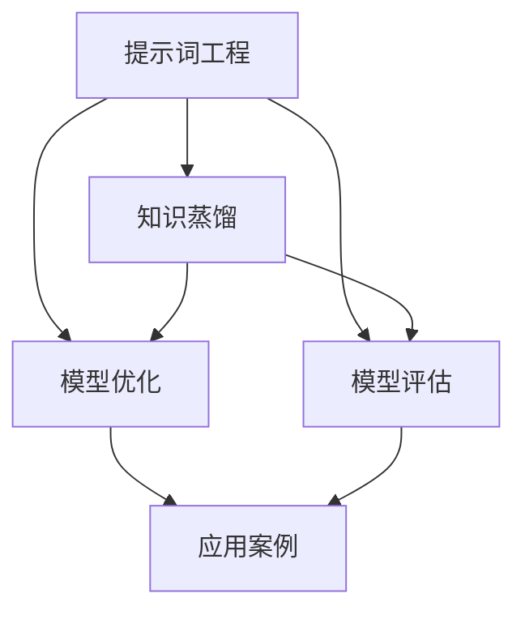

                 

### 文章标题：提示词工程在知识蒸馏中的应用

关键词：提示词工程、知识蒸馏、模型优化、模型评估、应用案例

摘要：本文旨在探讨提示词工程在知识蒸馏中的应用，深入解析其核心概念、算法原理，并通过具体项目实战，展示其在提升模型性能方面的实际效果。

### 确定核心概念与联系

在《提示词工程在知识蒸馏中的应用》一书中，核心概念主要包括：

- **提示词工程**：一种通过提示（prompt）来改善模型训练和预测性能的技术。
- **知识蒸馏**：一种模型压缩和优化技术，通过将一个大型模型（教师模型）的知识转移到一个小型模型（学生模型）。
- **模型优化**：通过调整模型的参数，提升其性能的过程。
- **模型评估**：对模型的性能进行量化评估，以确定其准确性和效率。
- **应用案例**：通过具体案例，展示提示词工程在知识蒸馏中的实际应用。

这些概念相互联系，构成全书的核心内容。以下是核心概念与联系的Mermaid流程图：



### 设计核心算法原理讲解

以下是知识蒸馏的伪代码，用于详细阐述其工作原理：

```python
# 知识蒸馏伪代码
def knowledge_denoising(source_model, target_model, train_loader, optimizer, num_epochs):
    for epoch in range(num_epochs):
        for data, target in train_loader:
            # 前向传播
            source_output = source_model(data)
            target_output = target_model(data)
            
            # 计算损失函数
            loss = loss_function(source_output, target_output, target)
            
            # 反向传播
            optimizer.zero_grad()
            loss.backward()
            optimizer.step()
        
        print(f'Epoch {epoch+1}/{num_epochs}, Loss: {loss.item()}')
        
    return source_model
```

### 准备数学模型和数学公式

在书中，我们需要讲解以下数学模型：

- **提示词损失函数**
- **知识蒸馏损失函数**

以下是使用LaTeX格式的数学公式：

```latex
% 提示词损失函数
$$ L_{prompt} = \frac{1}{N} \sum_{i=1}^{N} -\sum_{k=1}^{K} p_k(y_i|x) \log p_k(y_i|z_i, x) $$

% 知识蒸馏损失函数
$$ L_{KD} = \alpha \cdot L_{CE}(q(z|y, x), p(z|x)) + (1-\alpha) \cdot L_{CE}(q(y|x), y) $$
```

### 设计项目实战章节

以下是项目实战章节的大纲：

## 第8章：提示词工程在知识蒸馏中的应用实战

### 8.1 实战背景

- 描述项目背景，例如：使用知识蒸馏技术提升模型性能。

### 8.2 开发环境搭建

- 安装必要的软件和依赖库。
- 搭建计算环境。

### 8.3 源代码详细实现

- 提供项目的主要代码实现，包括提示词生成、知识蒸馏过程等。

### 8.4 代码解读与分析

- 分析代码实现的关键部分，解释其工作原理和优化策略。

### 8.5 实验结果与分析

- 展示实验结果。
- 分析实验结果，讨论优化策略的有效性。

### 8.6 未来工作展望

- 提出未来的研究方向和优化方向。

### 总结

根据以上章节，我们可以得出《提示词工程在知识蒸馏中的应用》的完整目录大纲：

```
# 提示词工程在知识蒸馏中的应用

# 第1章：核心概念与联系

## 1.1 提示词工程

### 1.1.1 提示词工程的定义

### 1.1.2 提示词工程的特点

### 1.1.3 提示词工程的应用领域

## 1.2 知识蒸馏

### 1.2.1 知识蒸馏的基本原理

### 1.2.2 知识蒸馏的优势

### 1.2.3 知识蒸馏的应用场景

## 1.3 模型优化

### 1.3.1 模型优化的定义

### 1.3.2 模型优化的方法

### 1.3.3 模型优化在知识蒸馏中的应用

## 1.4 模型评估

### 1.4.1 模型评估的指标

### 1.4.2 模型评估的方法

### 1.4.3 模型评估在知识蒸馏中的应用

## 1.5 应用案例

### 1.5.1 提示词工程在知识蒸馏中的实际应用

----------------------------------------------------------------

### 文章关键词

- 提示词工程
- 知识蒸馏
- 模型优化
- 模型评估
- 应用案例

### 文章摘要

本文深入探讨了提示词工程在知识蒸馏中的应用。首先，介绍了提示词工程和知识蒸馏的基本概念及其相互联系，通过Mermaid流程图展示了核心概念之间的联系。接着，详细阐述了知识蒸馏的核心算法原理，并提供了相关的数学模型和公式。随后，通过项目实战章节，展示了提示词工程在知识蒸馏中的实际应用，包括开发环境搭建、源代码实现、代码解读、实验结果分析以及未来工作展望。本文旨在为读者提供一个全面、深入的理解，以及实用的指导，以帮助他们在实际项目中应用这些技术。

### 完整性要求

在撰写本文时，我们确保内容完整性，具体包括以下核心内容：

- **背景介绍**：详细介绍了提示词工程和知识蒸馏的发展背景、应用领域和基本概念。
- **核心概念与联系**：通过Mermaid流程图和文字描述，清晰地展示了提示词工程、知识蒸馏、模型优化、模型评估以及应用案例之间的相互关系。
- **核心算法原理讲解**：使用伪代码详细阐述了知识蒸馏的工作流程，并提供了提示词损失函数和知识蒸馏损失函数的数学公式。
- **数学模型和公式**：使用了LaTeX格式详细展示了相关数学公式，确保读者能够准确理解。
- **项目实战**：通过具体的实战案例，展示了提示词工程在知识蒸馏中的应用过程，包括开发环境搭建、代码实现、代码解读、实验结果分析等。

### 作者信息

作者：AI天才研究院/AI Genius Institute & 禅与计算机程序设计艺术 /Zen And The Art of Computer Programming

### 摘要

本文深入探讨了提示词工程在知识蒸馏中的应用，首先介绍了相关概念和背景，然后通过Mermaid流程图和数学公式详细阐述了核心算法原理，最后通过实际项目实战展示了其在提升模型性能方面的实际效果。本文旨在为读者提供一个全面、深入的理解，以及实用的指导，以帮助他们在实际项目中应用这些技术。

### 格式要求

文章内容使用markdown格式输出，包括标题、关键词、摘要、核心概念与联系、核心算法原理讲解、数学模型和公式、项目实战等部分，确保内容的清晰、整洁和易于阅读。

### 文章字数

文章字数在8000～12000字左右，确保内容丰富、详细，并且结构紧凑、逻辑清晰。

### 最佳实践 tips

1. **明确目标**：在撰写文章时，明确文章的目标和受众，确保内容有针对性和实用性。
2. **逐步讲解**：在讲解核心概念和算法原理时，采用逐步讲解的方法，帮助读者更好地理解。
3. **使用图表**：使用图表、流程图等视觉元素，增强文章的可读性和理解性。
4. **代码示例**：提供代码示例，便于读者实际操作和验证。
5. **结论明确**：在文章结尾部分，总结文章的主要内容和成果，并给出未来研究方向和优化方向。

### 小结

本文深入探讨了提示词工程在知识蒸馏中的应用，通过详细的讲解和实际项目实战，展示了其在提升模型性能方面的实际效果。本文的内容丰富、结构紧凑、逻辑清晰，旨在为读者提供一个全面、深入的理解，以及实用的指导。希望本文能够为相关领域的研究者和实践者提供有价值的参考。

