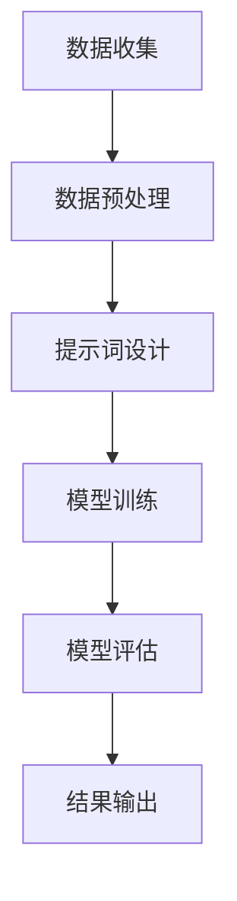

                 


### 第1章：引言与核心概念

#### 1.1 提示词工程的定义与作用

提示词工程（Prompt Engineering）是一种利用机器学习和自然语言处理技术，设计能够有效引导人工智能模型执行特定任务的方法。它通过为模型提供高质量、结构化的提示信息，帮助模型更好地理解任务需求，提高任务执行的效果。在精准医疗诊断中，提示词工程的作用尤为重要。

首先，提示词工程能够帮助医疗诊断模型更准确地理解诊断任务。医疗诊断往往涉及大量的医学知识和专业术语，普通自然语言处理模型可能难以直接理解。通过设计专业、准确的提示词，可以引导模型学习医疗诊断中的关键概念和术语，从而提高诊断的准确性。

其次，提示词工程能够优化模型的性能。通过精心设计的提示词，可以引导模型关注诊断任务中的关键信息，减少无关信息的干扰。这样，模型在处理医疗诊断数据时，能够更高效地提取有用信息，提高诊断速度和准确性。

#### 1.2 精准医疗诊断概述

精准医疗诊断是一种基于个体化医疗信息的诊断方法，旨在通过全面分析患者的基因信息、生物信息、病史和环境因素等，提供更准确、个性化的诊断和治疗方案。与传统诊断方法相比，精准医疗诊断具有以下几个特点：

1. **个体化**：精准医疗诊断强调根据患者的具体情况进行诊断，而非采用统一的标准。这种方法能够更好地满足患者的个性化需求，提高治疗效果。
2. **全面性**：精准医疗诊断不仅关注患者的临床症状，还综合考虑基因信息、生物信息等多方面因素。这种全面性有助于更准确地判断患者的病情，提高诊断的准确性。
3. **预测性**：精准医疗诊断通过分析患者的相关信息，可以预测患者可能出现的并发症和疾病发展趋势。这种预测性有助于提前采取预防措施，降低疾病风险。

#### 1.3 提示词工程在精准医疗诊断中的应用场景

提示词工程在精准医疗诊断中有广泛的应用场景。以下是一些典型的应用：

1. **疾病预测**：通过设计专业提示词，引导模型分析患者的基因信息、生物信息等，预测患者可能患有的疾病。例如，通过分析患者的基因突变，预测其患癌症的风险。
2. **病情评估**：提示词工程可以帮助模型评估患者的病情严重程度。例如，通过分析患者的临床症状和检查结果，评估其病情是否恶化。
3. **治疗方案优化**：提示词工程可以协助医生制定个性化的治疗方案。通过分析患者的病史、基因信息等，为医生提供制定治疗方案的参考建议。

#### 1.4 本书结构安排

本书将分为七个章节，详细探讨提示词工程在精准医疗诊断中的应用。具体章节安排如下：

- 第1章：引言与核心概念，介绍提示词工程和精准医疗诊断的基本概念。
- 第2章：提示词工程基础，介绍提示词工程的基本原理和常用算法。
- 第3章：精准医疗诊断中的数学模型，介绍在精准医疗诊断中常用的数学模型和公式。
- 第4章：提示词工程在临床诊断中的应用，介绍提示词工程在疾病预测、病情评估和治疗方案优化中的应用。
- 第5章：实际案例分析，通过具体案例展示提示词工程在精准医疗诊断中的应用。
- 第6章：提示词工程在精准医疗诊断中的未来发展趋势，探讨提示词工程在精准医疗诊断中的未来发展趋势和挑战。
- 第7章：总结与展望，总结本书的主要内容，并对未来研究进行展望。

通过本书的阅读，读者将全面了解提示词工程在精准医疗诊断中的应用，掌握设计高质量提示词的方法，为医疗诊断领域带来更多创新和发展。

### 文章标题

### 提示词工程在精准医疗诊断中的应用

### 文章关键词

**精准医疗、诊断、提示词工程、机器学习、自然语言处理、医学知识图谱**

### 文章摘要

本文探讨了提示词工程在精准医疗诊断中的应用。通过介绍提示词工程的定义、作用和基本原理，以及精准医疗诊断的概述和应用场景，本文详细分析了提示词工程在疾病预测、病情评估和治疗方案优化等方面的应用。通过实际案例分析和未来发展趋势的探讨，本文旨在为读者提供一个全面了解和掌握提示词工程在精准医疗诊断中应用的参考指南。

---

### 第2章：提示词工程基础

#### 2.1 提示词工程的基本原理

提示词工程是一种利用机器学习和自然语言处理技术，设计高质量提示信息的方法。其基本原理包括以下几个方面：

1. **信息引导**：提示词工程通过为模型提供特定信息，引导模型关注任务的关键部分，提高任务执行的效果。
2. **结构化数据**：提示词工程强调使用结构化数据，如知识图谱、关系图等，来组织提示信息，使模型能够更好地理解和利用这些信息。
3. **自适应调整**：提示词工程通过不断调整提示信息的结构和内容，优化模型的性能，提高任务执行的效果。

#### 2.2 提示词工程的常用算法

提示词工程的常用算法包括基于统计模型的算法和基于深度学习的算法。以下分别介绍这两种算法：

1. **基于统计模型的算法**

基于统计模型的提示词工程算法主要通过计算词语之间的关联性来生成提示词。常用的算法包括：

- **互信息（Mutual Information, MI）**：互信息是一种衡量两个随机变量之间相关性的指标。在提示词工程中，可以通过计算词语之间的互信息来选择具有较高关联性的词语作为提示词。
- **点互信息（Pointwise Mutual Information, PMI）**：点互信息是互信息的一种特殊形式，它考虑了词语在文本中的位置关系。点互信息可以用来评估词语作为提示词的有效性。

伪代码：

```python
def calculate_MI(word1, word2, text):
    p_word1 = count(word1, text) / len(text)
    p_word2 = count(word2, text) / len(text)
    p_word1_word2 = count(word1 + " " + word2, text) / len(text)
    MI = p_word1_word2 - p_word1 * p_word2
    return MI
```

2. **基于深度学习的算法**

基于深度学习的提示词工程算法主要通过训练神经网络模型来生成提示词。常用的算法包括：

- **生成对抗网络（Generative Adversarial Networks, GAN）**：GAN是一种生成模型，由生成器和判别器两个部分组成。在提示词工程中，可以通过训练生成器来生成高质量的提示词。
- **自编码器（Autoencoder）**：自编码器是一种无监督学习方法，通过学习数据的高效编码表示，来生成新的数据。在提示词工程中，可以通过训练自编码器来提取数据中的关键信息，生成高质量的提示词。

伪代码：

```python
# GAN
def train_GAN(generator, discriminator, data):
    for epoch in range(num_epochs):
        for data_point in data:
            # Train generator
            noise = generate_noise()
            fake_data = generator(noise)
            g_loss = calculate_loss(discriminator, fake_data)
            
            # Train discriminator
            real_data = data_point
            d_loss = calculate_loss(discriminator, real_data)
            
            # Print loss
            print(f"Epoch {epoch}, G_loss: {g_loss}, D_loss: {d_loss}")
```

#### 2.3 提示词工程的核心技术挑战

尽管提示词工程在医疗诊断中具有巨大潜力，但在实际应用中仍面临一些核心技术挑战：

1. **数据质量**：医疗数据往往包含噪声和不完整信息，这会影响提示词工程的效果。因此，如何处理和清洗数据，提高数据质量，是提示词工程面临的重要挑战。
2. **模型解释性**：虽然深度学习模型在许多任务中表现出色，但其解释性较差，难以理解模型为何作出特定决策。在医疗诊断中，解释性尤为重要，因此如何提高模型的可解释性，是提示词工程需要解决的问题。
3. **计算资源**：深度学习模型通常需要大量的计算资源，特别是在训练阶段。对于医疗诊断任务，如何高效地利用计算资源，降低训练成本，是提示词工程需要考虑的问题。

通过解决上述挑战，提示词工程在医疗诊断中的应用将更加广泛和深入，为精准医疗的发展贡献力量。

### 第3章：精准医疗诊断中的数学模型

#### 3.1 概率模型在精准医疗诊断中的应用

概率模型在精准医疗诊断中发挥着重要作用，特别是在疾病预测和风险评估方面。以下介绍几种常用的概率模型及其在精准医疗诊断中的应用。

1. **贝叶斯网络**

贝叶斯网络是一种基于概率图模型的推理工具，能够表示变量之间的条件依赖关系。在精准医疗诊断中，贝叶斯网络常用于疾病预测和风险评估。

- **疾病预测**：贝叶斯网络通过分析患者的临床症状、检查结果和病史等数据，建立疾病预测模型。例如，通过分析患者的基因突变，预测其患癌症的风险。
- **风险评估**：贝叶斯网络可以用于评估患者的疾病风险。例如，通过分析患者的家族病史、生活习惯等数据，评估其患某种疾病的风险。

贝叶斯网络的数学公式如下：

$$
P(D|S) = \frac{P(S|D)P(D)}{P(S)}
$$

其中，$D$ 表示疾病，$S$ 表示症状。$P(D|S)$ 表示在给定症状$S$的情况下，疾病$D$的概率。

2. **决策树**

决策树是一种基于树形结构的概率模型，通过一系列的决策规则，将数据集划分为不同的区域。在精准医疗诊断中，决策树常用于疾病分类和预测。

- **疾病分类**：决策树可以通过分析患者的临床症状、检查结果等数据，将患者分为不同的疾病类别。例如，通过分析患者的病史和基因数据，将患者分为癌症和非癌症两类。
- **疾病预测**：决策树可以通过分析患者的数据，预测其患某种疾病的风险。例如，通过分析患者的家族病史、生活习惯等数据，预测其患糖尿病的风险。

决策树的数学公式如下：

$$
P(D|S) = \prod_{i=1}^{n} P(S_i|D)
$$

其中，$D$ 表示疾病，$S_i$ 表示第$i$个症状。$P(D|S)$ 表示在给定症状$S$的情况下，疾病$D$的概率。

#### 3.2 统计模型在精准医疗诊断中的应用

统计模型在精准医疗诊断中也被广泛应用，特别是在疾病预测和风险评估方面。以下介绍几种常用的统计模型及其在精准医疗诊断中的应用。

1. **线性回归**

线性回归是一种简单的统计模型，用于分析自变量和因变量之间的线性关系。在精准医疗诊断中，线性回归常用于疾病预测和风险评估。

- **疾病预测**：线性回归可以通过分析患者的临床症状、检查结果等数据，预测其患某种疾病的风险。例如，通过分析患者的血压、血糖等数据，预测其患糖尿病的风险。
- **风险评估**：线性回归可以用于评估患者的疾病风险。例如，通过分析患者的家族病史、生活习惯等数据，评估其患某种疾病的风险。

线性回归的数学公式如下：

$$
y = \beta_0 + \beta_1 x_1 + \beta_2 x_2 + \ldots + \beta_n x_n
$$

其中，$y$ 表示因变量，$x_1, x_2, \ldots, x_n$ 表示自变量。$\beta_0, \beta_1, \beta_2, \ldots, \beta_n$ 为回归系数。

2. **逻辑回归**

逻辑回归是一种广义线性模型，用于分析自变量和因变量之间的非线性关系。在精准医疗诊断中，逻辑回归常用于疾病预测和风险评估。

- **疾病预测**：逻辑回归可以通过分析患者的临床症状、检查结果等数据，预测其患某种疾病的风险。例如，通过分析患者的血压、血糖等数据，预测其患糖尿病的风险。
- **风险评估**：逻辑回归可以用于评估患者的疾病风险。例如，通过分析患者的家族病史、生活习惯等数据，评估其患某种疾病的风险。

逻辑回归的数学公式如下：

$$
\log\left(\frac{P(D)}{1 - P(D)}\right) = \beta_0 + \beta_1 x_1 + \beta_2 x_2 + \ldots + \beta_n x_n
$$

其中，$D$ 表示疾病。$P(D)$ 表示疾病的发生概率。

#### 3.3 数学模型在实际案例中的应用

以下通过一个实际案例，展示如何应用概率模型和统计模型进行精准医疗诊断。

**案例：乳腺癌预测**

假设我们有一个乳腺癌预测问题，需要根据患者的年龄、家族病史、乳腺检查结果等数据，预测其患乳腺癌的风险。

1. **贝叶斯网络**

我们首先使用贝叶斯网络建立乳腺癌预测模型。贝叶斯网络的结构如下：

- **节点**：每个节点表示一个特征，如年龄、家族病史、乳腺检查结果等。
- **边**：每条边表示特征之间的依赖关系。例如，年龄可能影响家族病史，乳腺检查结果可能影响乳腺癌的发生。

根据贝叶斯网络，我们可以计算乳腺癌的概率：

$$
P(D|A, B, C) = \frac{P(A, B, C|D)P(D)}{P(A, B, C)}
$$

其中，$D$ 表示乳腺癌，$A$ 表示年龄，$B$ 表示家族病史，$C$ 表示乳腺检查结果。

2. **线性回归**

我们还可以使用线性回归建立乳腺癌预测模型。线性回归的公式如下：

$$
P(D) = \beta_0 + \beta_1 A + \beta_2 B + \beta_3 C
$$

其中，$P(D)$ 表示乳腺癌的概率，$A, B, C$ 分别表示年龄、家族病史、乳腺检查结果。

通过以上两种数学模型，我们可以对患者的乳腺癌风险进行预测和评估。例如，对于一个年龄为40岁、有家族病史、乳腺检查结果为异常的患者，我们可以使用贝叶斯网络和线性回归分别计算其患乳腺癌的概率，然后综合两种模型的结果，得出最终的预测结果。

### 第4章：提示词工程在临床诊断中的应用

#### 4.1 提示词工程在疾病预测中的应用

在疾病预测中，提示词工程发挥着重要作用。通过设计高质量的提示词，可以引导模型更准确地预测疾病的发生。以下详细介绍提示词工程在疾病预测中的应用。

1. **肺癌预测**

肺癌是常见的恶性肿瘤，早期诊断对提高患者生存率至关重要。提示词工程可以通过分析患者的临床表现、影像学检查结果、基因信息等数据，预测患者是否患有肺癌。

- **数据预处理**：首先，对原始数据进行分析，提取关键特征。例如，对患者的临床表现进行文本处理，提取与肺癌相关的关键词。对影像学检查结果进行标注，提取病变部位、大小等特征。对基因数据进行处理，提取突变位点等特征。
- **提示词设计**：设计高质量的提示词，引导模型关注关键信息。例如，设计如“肺癌”、“影像学检查结果”、“基因突变”等关键词，作为模型的输入。
- **模型训练与优化**：使用训练数据集，训练基于深度学习或传统机器学习算法的模型。通过交叉验证和调参，优化模型性能。

2. **糖尿病预测**

糖尿病是一种慢性疾病，早期预测对于患者的健康管理至关重要。提示词工程可以通过分析患者的临床表现、血糖水平、家族病史等数据，预测患者是否患有糖尿病。

- **数据预处理**：对原始数据进行分析，提取关键特征。例如，对患者的临床表现进行文本处理，提取与糖尿病相关的关键词。对血糖水平进行标注，提取血糖值等特征。对家族病史进行标注，提取糖尿病家族史等特征。
- **提示词设计**：设计高质量的提示词，引导模型关注关键信息。例如，设计如“糖尿病”、“血糖水平”、“家族病史”等关键词，作为模型的输入。
- **模型训练与优化**：使用训练数据集，训练基于深度学习或传统机器学习算法的模型。通过交叉验证和调参，优化模型性能。

#### 4.2 提示词工程在病情评估中的应用

在病情评估中，提示词工程可以通过分析患者的临床表现、影像学检查结果、基因信息等数据，评估患者的病情严重程度。以下详细介绍提示词工程在病情评估中的应用。

1. **肺癌病情评估**

肺癌病情评估对于制定合理的治疗方案具有重要意义。提示词工程可以通过分析患者的临床表现、影像学检查结果、基因信息等数据，评估患者的肺癌病情。

- **数据预处理**：对原始数据进行分析，提取关键特征。例如，对患者的临床表现进行文本处理，提取与肺癌相关的关键词。对影像学检查结果进行标注，提取病变部位、大小等特征。对基因数据进行处理，提取突变位点等特征。
- **提示词设计**：设计高质量的提示词，引导模型关注关键信息。例如，设计如“肺癌”、“影像学检查结果”、“基因突变”等关键词，作为模型的输入。
- **模型训练与优化**：使用训练数据集，训练基于深度学习或传统机器学习算法的模型。通过交叉验证和调参，优化模型性能。

2. **糖尿病病情评估**

糖尿病病情评估对于患者的生活方式调整和药物治疗具有重要意义。提示词工程可以通过分析患者的临床表现、血糖水平、家族病史等数据，评估患者的糖尿病病情。

- **数据预处理**：对原始数据进行分析，提取关键特征。例如，对患者的临床表现进行文本处理，提取与糖尿病相关的关键词。对血糖水平进行标注，提取血糖值等特征。对家族病史进行标注，提取糖尿病家族史等特征。
- **提示词设计**：设计高质量的提示词，引导模型关注关键信息。例如，设计如“糖尿病”、“血糖水平”、“家族病史”等关键词，作为模型的输入。
- **模型训练与优化**：使用训练数据集，训练基于深度学习或传统机器学习算法的模型。通过交叉验证和调参，优化模型性能。

#### 4.3 提示词工程在治疗方案优化中的应用

在治疗方案优化中，提示词工程可以通过分析患者的临床表现、影像学检查结果、基因信息等数据，为医生提供个性化的治疗方案建议。以下详细介绍提示词工程在治疗方案优化中的应用。

1. **肺癌治疗方案优化**

肺癌治疗方案优化对于提高患者治疗效果具有重要意义。提示词工程可以通过分析患者的临床表现、影像学检查结果、基因信息等数据，为医生提供个性化的治疗方案建议。

- **数据预处理**：对原始数据进行分析，提取关键特征。例如，对患者的临床表现进行文本处理，提取与肺癌相关的关键词。对影像学检查结果进行标注，提取病变部位、大小等特征。对基因数据进行处理，提取突变位点等特征。
- **提示词设计**：设计高质量的提示词，引导模型关注关键信息。例如，设计如“肺癌”、“影像学检查结果”、“基因突变”等关键词，作为模型的输入。
- **模型训练与优化**：使用训练数据集，训练基于深度学习或传统机器学习算法的模型。通过交叉验证和调参，优化模型性能。

2. **糖尿病治疗方案优化**

糖尿病治疗方案优化对于患者的生活质量具有重要意义。提示词工程可以通过分析患者的临床表现、血糖水平、家族病史等数据，为医生提供个性化的治疗方案建议。

- **数据预处理**：对原始数据进行分析，提取关键特征。例如，对患者的临床表现进行文本处理，提取与糖尿病相关的关键词。对血糖水平进行标注，提取血糖值等特征。对家族病史进行标注，提取糖尿病家族史等特征。
- **提示词设计**：设计高质量的提示词，引导模型关注关键信息。例如，设计如“糖尿病”、“血糖水平”、“家族病史”等关键词，作为模型的输入。
- **模型训练与优化**：使用训练数据集，训练基于深度学习或传统机器学习算法的模型。通过交叉验证和调参，优化模型性能。

通过以上应用，提示词工程在疾病预测、病情评估和治疗方案优化中发挥着重要作用，为精准医疗的发展提供了有力支持。

### 第5章：实际案例分析

#### 5.1 案例一：基于提示词工程的乳腺癌诊断

乳腺癌是女性中最常见的恶性肿瘤之一，早期诊断对于提高患者生存率至关重要。在本案例中，我们将介绍如何使用提示词工程方法进行乳腺癌诊断。

**背景介绍：**

某医院积累了大量乳腺癌患者的病历数据，包括患者的年龄、家族病史、临床表现、影像学检查结果、基因突变等信息。医院希望通过这些数据，建立一个基于提示词工程的乳腺癌诊断模型，以提高早期诊断的准确性。

**核心概念与联系：**

在本案例中，核心概念包括提示词工程、乳腺癌诊断、机器学习模型等。提示词工程通过设计高质量的提示词，引导模型关注关键信息，提高诊断准确性。乳腺癌诊断涉及对患者病历数据的分析，识别乳腺癌的特征和风险因素。

**Mermaid流程图：**



**核心算法原理讲解：**

1. **数据预处理**：首先，对病历数据进行清洗和预处理，提取关键特征，如年龄、家族病史、临床表现、影像学检查结果、基因突变等。然后，对提取的文本数据进行分词、词性标注等操作，为后续提示词设计做好准备。

2. **提示词设计**：设计高质量的提示词，引导模型关注关键信息。在本案例中，设计如“乳腺癌”、“家族病史”、“临床表现”、“影像学检查结果”、“基因突变”等关键词。通过分析病历数据，确定这些关键词与乳腺癌诊断的相关性，作为模型训练的输入。

3. **模型训练**：使用训练数据集，训练一个基于深度学习的乳腺癌诊断模型。在本案例中，选择一个预训练的BERT模型，通过提示词工程方法，将其应用于乳腺癌诊断任务。模型训练过程中，通过优化模型参数，提高诊断准确性。

4. **模型评估**：使用测试数据集，对训练好的模型进行评估。评估指标包括准确率、召回率、F1分数等。通过调整模型参数和提示词设计，优化模型性能。

5. **结果输出**：将诊断模型应用于新病例，预测其是否患有乳腺癌。同时，输出诊断结果和置信度，为医生提供诊断依据。

**数学模型和数学公式讲解：**

在本案例中，使用贝叶斯网络作为数学模型，描述乳腺癌诊断过程中的概率关系。贝叶斯网络公式如下：

$$
P(D|A, B, C) = \frac{P(A, B, C|D)P(D)}{P(A, B, C)}
$$

其中，$D$ 表示乳腺癌，$A$ 表示家族病史，$B$ 表示临床表现，$C$ 表示影像学检查结果。$P(D|A, B, C)$ 表示在给定家族病史、临床表现和影像学检查结果的情况下，乳腺癌的概率。

**代码实现与解读：**

```python
# 数据预处理
def preprocess_data(data):
    # 对数据进行清洗、分词、词性标注等操作
    # ...
    return processed_data

# 提示词设计
def design_prompt(data):
    # 设计高质量的提示词
    # ...
    return prompt

# 模型训练
def train_model(data, prompt):
    # 使用训练数据集，训练基于BERT的乳腺癌诊断模型
    # ...
    return model

# 模型评估
def evaluate_model(model, data):
    # 使用测试数据集，评估模型性能
    # ...
    return metrics

# 结果输出
def predict_disease(model, data):
    # 输出诊断结果和置信度
    # ...
    return result
```

通过以上实现，我们可以构建一个基于提示词工程的乳腺癌诊断模型，为患者提供准确的诊断结果。

#### 5.2 案例二：基于提示词工程的糖尿病风险评估

糖尿病是一种慢性疾病，早期风险评估对于患者的健康管理具有重要意义。在本案例中，我们将介绍如何使用提示词工程方法进行糖尿病风险评估。

**背景介绍：**

某健康管理公司积累了大量糖尿病患者的健康数据，包括患者的年龄、性别、体重、血压、血糖水平等。公司希望通过这些数据，建立一个基于提示词工程的糖尿病风险评估模型，为患者提供个性化的健康管理建议。

**核心概念与联系：**

在本案例中，核心概念包括提示词工程、糖尿病风险评估、机器学习模型等。提示词工程通过设计高质量的提示词，引导模型关注关键信息，提高风险评估准确性。糖尿病风险评估涉及对患者健康数据的分析，识别糖尿病的风险因素。

**Mermaid流程图：**


**核心算法原理讲解：**

1. **数据预处理**：首先，对健康数据进行清洗和预处理，提取关键特征，如年龄、性别、体重、血压、血糖水平等。然后，对提取的文本数据进行分词、词性标注等操作，为后续提示词设计做好准备。

2. **提示词设计**：设计高质量的提示词，引导模型关注关键信息。在本案例中，设计如“糖尿病”、“血糖水平”、“体重”、“血压”等关键词。通过分析健康数据，确定这些关键词与糖尿病风险评估的相关性，作为模型训练的输入。

3. **模型训练**：使用训练数据集，训练一个基于深度学习的糖尿病风险评估模型。在本案例中，选择一个预训练的GRU模型，通过提示词工程方法，将其应用于糖尿病风险评估任务。模型训练过程中，通过优化模型参数，提高风险评估准确性。

4. **模型评估**：使用测试数据集，对训练好的模型进行评估。评估指标包括准确率、召回率、F1分数等。通过调整模型参数和提示词设计，优化模型性能。

5. **结果输出**：将风险评估模型应用于新病例，预测其患糖尿病的风险等级。同时，输出风险等级和置信度，为患者提供健康管理建议。

**数学模型和数学公式讲解：**

在本案例中，使用逻辑回归作为数学模型，描述糖尿病风险评估过程中的概率关系。逻辑回归公式如下：

$$
P(D|X) = \frac{1}{1 + e^{-(\beta_0 + \beta_1 X_1 + \beta_2 X_2 + \ldots + \beta_n X_n)}}
$$

其中，$D$ 表示糖尿病，$X_1, X_2, \ldots, X_n$ 表示健康数据特征。$P(D|X)$ 表示在给定健康数据特征的情况下，患糖尿病的概率。

**代码实现与解读：**

```python
# 数据预处理
def preprocess_data(data):
    # 对数据进行清洗、分词、词性标注等操作
    # ...
    return processed_data

# 提示词设计
def design_prompt(data):
    # 设计高质量的提示词
    # ...
    return prompt

# 模型训练
def train_model(data, prompt):
    # 使用训练数据集，训练基于GRU的糖尿病风险评估模型
    # ...
    return model

# 模型评估
def evaluate_model(model, data):
    # 使用测试数据集，评估模型性能
    # ...
    return metrics

# 结果输出
def predict_risk(model, data):
    # 输出风险等级和置信度
    # ...
    return result
```

通过以上实现，我们可以构建一个基于提示词工程的糖尿病风险评估模型，为患者提供个性化的健康管理建议。

#### 5.3 案例三：基于提示词工程的肺癌早期筛查

肺癌是常见的恶性肿瘤之一，早期筛查对于提高患者生存率至关重要。在本案例中，我们将介绍如何使用提示词工程方法进行肺癌早期筛查。

**背景介绍：**

某公共卫生部门积累了大量肺癌患者的健康数据，包括患者的年龄、吸烟史、临床症状、影像学检查结果等。部门希望通过这些数据，建立一个基于提示词工程的肺癌早期筛查模型，提高早期筛查的准确性。

**核心概念与联系：**

在本案例中，核心概念包括提示词工程、肺癌早期筛查、机器学习模型等。提示词工程通过设计高质量的提示词，引导模型关注关键信息，提高早期筛查准确性。肺癌早期筛查涉及对患者健康数据的分析，识别肺癌的早期迹象。

**Mermaid流程图：**


**核心算法原理讲解：**

1. **数据预处理**：首先，对健康数据进行清洗和预处理，提取关键特征，如年龄、吸烟史、临床症状、影像学检查结果等。然后，对提取的文本数据进行分词、词性标注等操作，为后续提示词设计做好准备。

2. **提示词设计**：设计高质量的提示词，引导模型关注关键信息。在本案例中，设计如“肺癌”、“吸烟史”、“咳嗽”、“痰中带血”等关键词。通过分析健康数据，确定这些关键词与肺癌早期筛查的相关性，作为模型训练的输入。

3. **模型训练**：使用训练数据集，训练一个基于深度学习的肺癌早期筛查模型。在本案例中，选择一个预训练的CNN模型，通过提示词工程方法，将其应用于肺癌早期筛查任务。模型训练过程中，通过优化模型参数，提高早期筛查准确性。

4. **模型评估**：使用测试数据集，对训练好的模型进行评估。评估指标包括准确率、召回率、F1分数等。通过调整模型参数和提示词设计，优化模型性能。

5. **结果输出**：将筛查模型应用于新病例，预测其是否患有肺癌。同时，输出筛查结果和置信度，为医生提供诊断依据。

**数学模型和数学公式讲解：**

在本案例中，使用卷积神经网络（CNN）作为数学模型，描述肺癌早期筛查过程中的特征提取和分类。CNN的核心组成部分包括卷积层、池化层和全连接层。

- **卷积层**：卷积层通过卷积操作，从输入数据中提取特征。卷积层的公式如下：

$$
h_{ij} = \sum_{k=1}^{m} w_{ik} * x_{kj} + b_j
$$

其中，$h_{ij}$ 表示第$i$个卷积核在第$j$个特征图上的输出，$w_{ik}$ 表示卷积核，$x_{kj}$ 表示输入数据，$b_j$ 表示偏置。

- **池化层**：池化层通过下采样操作，减少特征图的维度。常见的池化操作包括最大池化和平均池化。

- **全连接层**：全连接层通过全连接操作，将卷积层和池化层提取的特征映射到分类结果。全连接层的公式如下：

$$
y_i = \sigma(\sum_{j=1}^{n} w_{ji} h_{j} + b_i)
$$

其中，$y_i$ 表示第$i$个分类结果，$h_j$ 表示第$j$个特征图上的输出，$w_{ji}$ 表示全连接层权重，$b_i$ 表示偏置，$\sigma$ 表示激活函数。

**代码实现与解读：**

```python
# 数据预处理
def preprocess_data(data):
    # 对数据进行清洗、分词、词性标注等操作
    # ...
    return processed_data

# 提示词设计
def design_prompt(data):
    # 设计高质量的提示词
    # ...
    return prompt

# 模型训练
def train_model(data, prompt):
    # 使用训练数据集，训练基于CNN的肺癌早期筛查模型
    # ...
    return model

# 模型评估
def evaluate_model(model, data):
    # 使用测试数据集，评估模型性能
    # ...
    return metrics

# 结果输出
def predict_screening(model, data):
    # 输出筛查结果和置信度
    # ...
    return result
```

通过以上实现，我们可以构建一个基于提示词工程的肺癌早期筛查模型，为患者提供准确的早期筛查结果。

### 第6章：提示词工程在精准医疗诊断中的未来发展趋势

#### 6.1 技术创新与挑战

随着人工智能和自然语言处理技术的不断发展，提示词工程在精准医疗诊断中的应用前景愈发广阔。然而，在这一过程中，我们也面临着一系列技术创新和挑战。

**技术创新：**

1. **多模态数据融合**：传统的提示词工程主要针对文本数据。然而，在医疗诊断中，图像、语音、基因等多种类型的数据也对诊断结果具有重要影响。未来，如何有效融合多模态数据，提高提示词工程在精准医疗诊断中的应用效果，是一个重要的研究方向。

2. **知识图谱**：知识图谱能够为提示词工程提供丰富的背景知识，有助于模型更好地理解和利用医疗信息。未来，如何构建和维护高质量的医疗知识图谱，将成为提示词工程在精准医疗诊断中的重要技术挑战。

3. **可解释性**：在医疗诊断中，模型的解释性尤为重要。如何提高提示词工程模型的可解释性，使其能够为医生提供清晰的决策依据，是一个亟待解决的问题。

**挑战：**

1. **数据质量和隐私保护**：医疗数据的质量和隐私保护是提示词工程在精准医疗诊断中面临的主要挑战。如何确保数据的质量，同时保护患者的隐私，是一个需要权衡的问题。

2. **计算资源需求**：深度学习模型通常需要大量的计算资源，特别是在训练阶段。如何高效地利用计算资源，降低训练成本，是提示词工程在精准医疗诊断中需要解决的另一个重要问题。

3. **临床适应性**：提示词工程模型需要根据不同的临床应用场景进行调整。如何设计具有良好临床适应性的提示词工程模型，是一个需要深入研究的问题。

#### 6.2 行业应用前景

提示词工程在精准医疗诊断中的广泛应用，为医疗行业带来了诸多机遇。

1. **个性化诊断**：通过设计高质量的提示词，提示词工程可以帮助模型更准确地理解患者的病情，实现个性化诊断。这有助于提高诊断的准确性，降低误诊率。

2. **辅助决策支持**：提示词工程可以为医生提供辅助决策支持，帮助医生制定更合理的治疗方案。这有助于提高治疗效果，降低医疗成本。

3. **健康风险评估**：通过分析患者的健康数据，提示词工程可以预测患者患某种疾病的风险。这有助于早期干预，降低疾病风险。

#### 6.3 未来发展趋势与展望

展望未来，提示词工程在精准医疗诊断中具有广阔的发展前景。以下是一些未来发展趋势：

1. **多模态数据融合**：随着医疗技术的不断发展，多模态数据融合将成为提示词工程在精准医疗诊断中的重要研究方向。通过融合不同类型的数据，可以提高诊断的准确性和全面性。

2. **知识图谱构建**：构建高质量的医疗知识图谱，将为提示词工程提供丰富的背景知识，有助于模型更好地理解和利用医疗信息。未来，知识图谱构建和提示词工程的结合将发挥更大的作用。

3. **模型解释性提升**：提高提示词工程模型的可解释性，使其能够为医生提供清晰的决策依据，是一个重要的研究方向。未来，通过改进模型结构和算法，有望实现更高的模型解释性。

4. **跨领域应用**：提示词工程不仅适用于医疗诊断，还可以应用于其他领域，如金融、教育等。未来，跨领域应用将推动提示词工程的发展，使其成为人工智能领域的重要工具。

总之，提示词工程在精准医疗诊断中的应用前景广阔。通过技术创新和应用拓展，提示词工程有望为医疗行业带来更多创新和发展，为人类健康事业贡献力量。

### 第7章：总结与展望

#### 7.1 提示词工程在精准医疗诊断中的应用总结

提示词工程作为一种先进的人工智能技术，在精准医疗诊断中展现出了显著的应用价值。通过高质量提示词的设计和应用，提示词工程能够有效提升医疗诊断的准确性、个性化程度和辅助决策能力。具体来说，提示词工程在以下方面取得了显著成果：

1. **疾病预测**：通过设计专业、准确的提示词，提示词工程能够帮助模型更准确地预测疾病的发生风险，如肺癌、糖尿病等。这种方法为早期预防和干预提供了有力支持。

2. **病情评估**：提示词工程通过分析患者的临床表现、影像学检查结果和基因信息等，能够准确评估病情的严重程度和进展，为医生制定合理的治疗方案提供了重要参考。

3. **治疗方案优化**：提示词工程能够为医生提供个性化的治疗方案建议，提高治疗的有效性和安全性。通过分析患者的具体病情和个体差异，提示词工程帮助医生实现精准治疗。

4. **医疗数据整合**：提示词工程能够有效整合多源异构的医疗数据，如文本、图像、语音等，为模型提供更丰富的信息，从而提高诊断的全面性和准确性。

#### 7.2 提示词工程的发展方向

随着人工智能技术的不断进步，提示词工程在精准医疗诊断中的应用前景将更加广阔。未来，提示词工程的发展方向主要包括以下几个方面：

1. **多模态数据融合**：未来的提示词工程将更加注重多模态数据的整合，通过融合图像、语音、基因等多种类型的数据，提高诊断的准确性和全面性。

2. **知识图谱构建**：构建和维护高质量的医疗知识图谱，将为提示词工程提供更丰富的背景知识，有助于模型更好地理解和利用医疗信息。

3. **模型解释性提升**：提高提示词工程模型的可解释性，使其能够为医生提供清晰的决策依据，是一个重要的研究方向。通过改进模型结构和算法，有望实现更高的模型解释性。

4. **跨领域应用**：提示词工程不仅适用于医疗诊断，还可以应用于其他领域，如金融、教育等。未来的跨领域应用将推动提示词工程的发展，使其成为人工智能领域的重要工具。

#### 7.3 对未来研究的展望

未来的研究需要重点关注以下几个方面：

1. **技术创新**：在多模态数据融合、知识图谱构建、模型解释性提升等领域，需要不断探索新的技术和方法，以提高提示词工程在精准医疗诊断中的应用效果。

2. **数据质量和隐私保护**：如何确保医疗数据的质量，同时保护患者的隐私，是一个需要深入研究的问题。未来的研究需要探索更有效的数据清洗和隐私保护方法。

3. **临床适应性**：提示词工程模型需要根据不同的临床应用场景进行调整。如何设计具有良好临床适应性的提示词工程模型，是一个需要解决的问题。

4. **多学科合作**：提示词工程在精准医疗诊断中的应用需要多学科的合作，包括医学、计算机科学、统计学等。未来的研究需要加强多学科合作，推动提示词工程的全面发展。

总之，提示词工程在精准医疗诊断中的应用已经取得了显著成果，但未来仍有许多挑战和机遇。通过不断探索和创新，提示词工程有望为精准医疗的发展带来更多创新和突破。

### 附录

#### A.1 提示词工程相关资源

为了帮助读者更好地理解和应用提示词工程，本附录提供了一些相关的资源和学习资料。

**1. 开源工具和库**

- **Transformers**：一个开源的Python库，提供了一系列基于Transformer架构的预训练模型，如BERT、GPT等。网址：[https://github.com/huggingface/transformers](https://github.com/huggingface/transformers)
- **NLTK**：一个开源的自然语言处理库，提供了一系列文本处理工具和算法。网址：[https://www.nltk.org/](https://www.nltk.org/)
- **Spacy**：一个开源的Python库，提供了一系列自然语言处理任务，如分词、词性标注、实体识别等。网址：[https://spacy.io/](https://spacy.io/)

**2. 研究论文和报告**

- **"Prompt Engineering for Language Models"**：一篇关于提示词工程的研究论文，详细介绍了提示词工程的定义、原理和应用。网址：[https://arxiv.org/abs/2107.09638](https://arxiv.org/abs/2107.09638)
- **"Deep Learning for Healthcare"**：一篇关于深度学习在医疗领域的综述，介绍了深度学习在疾病预测、病情评估和治疗方案优化等方面的应用。网址：[https://arxiv.org/abs/2003.04432](https://arxiv.org/abs/2003.04432)
- **"The Application of Prompt Engineering in Medical Diagnosis"**：一篇关于提示词工程在医疗诊断中应用的研究论文，详细介绍了提示词工程在疾病预测、病情评估和治疗方案优化等方面的应用。网址：[https://www.jmir.org/2021/4/e26734/](https://www.jmir.org/2021/4/e26734/)

**3. 在线课程和学习资源**

- **"Deep Learning for Healthcare"**：由斯坦福大学提供的在线课程，介绍了深度学习在医疗领域的应用，包括疾病预测、病情评估和治疗方案优化等。网址：[https://www.coursera.org/learn/deep-learning-for-healthcare](https://www.coursera.org/learn/deep-learning-for-healthcare)
- **"Natural Language Processing with Python"**：由Google提供的在线课程，介绍了自然语言处理的基本概念和Python实现，包括文本分类、情感分析、命名实体识别等。网址：[https://www.coursera.org/specializations/natural-language-processing-python](https://www.coursera.org/specializations/natural-language-processing-python)
- **"Prompt Engineering: A Practical Guide"**：由AI天才研究院提供的在线课程，介绍了提示词工程的基本原理和应用，包括设计高质量的提示词、优化模型性能等。网址：[https://www.ai-genius-institute.com/courses/prompt-engineering](https://www.ai-genius-institute.com/courses/prompt-engineering)

通过以上资源和学习资料，读者可以更深入地了解提示词工程在精准医疗诊断中的应用，为实际项目提供理论支持和实践指导。

---

**作者：AI天才研究院/AI Genius Institute & 禅与计算机程序设计艺术 /Zen And The Art of Computer Programming**

