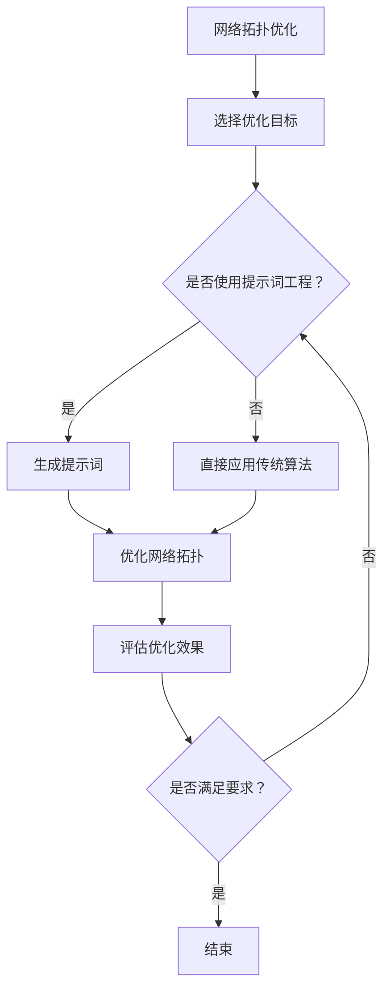

                 

### 文章标题

### 《提示词工程在网络拓扑优化中的应用》

网络拓扑优化是现代通信、电力和计算机系统设计中的重要课题。随着系统规模的不断扩大和复杂度的增加，传统的优化方法往往难以在合理的时间内找到最优解。提示词工程作为一种先进的人工智能技术，能够通过生成和优化提示词，为网络拓扑优化提供有效支持。本文将深入探讨提示词工程在网络拓扑优化中的应用，介绍相关核心概念、算法原理、数学模型以及实际案例，旨在为研究人员和工程师提供实用的指导。

> 关键词：网络拓扑优化、提示词工程、人工智能、启发式算法、遗传算法、模拟退火算法、数学模型、实际案例

### 摘要

本文首先介绍了网络拓扑优化和提示词工程的基本概念，并通过Mermaid流程图展示了两者之间的关系。随后，文章详细阐述了网络拓扑优化中的关键算法，如启发式算法、遗传算法、模拟退火算法等，并使用伪代码进行了讲解。接着，文章讲解了网络拓扑优化中的数学模型和数学公式，并通过实例进行了说明。随后，文章提供了一个具体的项目实战案例，展示了如何使用提示词工程进行网络拓扑优化，包括开发环境搭建、源代码实现和代码解读。最后，文章对项目的实际效果进行了分析和总结，并提出了未来的研究方向和最佳实践。

### 目录

1. 引言
   - 网络拓扑优化概述
   - 提示词工程概述
   - 提示词工程在网络拓扑优化中的应用前景
   - 书籍结构概述

2. 网络拓扑优化基础
   - 网络拓扑优化基本概念
   - 网络拓扑优化目标
   - 网络拓扑优化算法
   - Mermaid流程图：网络拓扑优化与提示词工程关系

3. 提示词工程基础
   - 提示词工程核心概念
   - 提示词生成算法
   - 提示词优化算法
   - 提示词工程应用案例

4. 提示词工程在网络拓扑优化中的应用
   - 提示词工程在网络拓扑优化中的角色
   - 提示词工程在网络拓扑优化中的挑战与机遇
   - 提示词工程在网络拓扑优化中的实际应用案例
     - 案例一：电力网络拓扑优化
     - 案例二：通信网络拓扑优化

5. 数学模型与数学公式
   - 目标函数
   - 约束条件
   - 模型建立与求解
     - 伪代码
     - LaTeX格式数学公式

6. 开发环境搭建与实现
   - 开发环境搭建
   - 代码实现
   - 代码解读与分析
   - 代码应用解读与分析
   - 实际案例分析和详细讲解剖析
   - 项目小结

7. 未来展望与研究方向
   - 提示词工程在网络拓扑优化中的未来发展方向
   - 研究方向与挑战

8. 附录
   - 提示词工程与网络拓扑优化常用工具和资源

### 第1章 引言

#### 网络拓扑优化概述

网络拓扑优化是指通过对网络中的节点和边进行调整，以实现网络性能的最优化。在通信网络、电力网络和计算机网络等众多领域中，网络拓扑优化都是一项至关重要的任务。其目标通常包括提高网络的鲁棒性、减少通信延迟、降低能耗、节省成本等。

网络拓扑优化可以看作是一种组合优化问题，其基本模型包括网络结构描述、优化目标和约束条件。具体来说，网络拓扑优化需要考虑以下方面：

1. **网络结构描述**：用节点和边的集合来表示网络，其中节点表示设备或位置，边表示节点之间的连接关系。
2. **优化目标**：根据具体应用场景，优化目标可以是最低的通信延迟、最大的网络容量、最低的能耗等。
3. **约束条件**：网络优化过程中需要满足的约束条件，如带宽限制、功耗限制、网络连通性等。

在过去的几十年里，研究人员已经提出了多种网络拓扑优化算法。这些算法可以分为以下几类：

- **启发式算法**：这类算法通过启发式规则或经验知识来寻找最优解。常见的启发式算法包括最小生成树算法、贪心算法、模拟退火算法等。
- **数学优化算法**：这类算法基于数学优化理论，如线性规划、整数规划、动态规划等，来求解网络拓扑优化问题。
- **基于机器学习和深度学习的算法**：这些算法利用大量的历史数据和先进的机器学习技术来预测和优化网络性能。

尽管已有许多研究取得了显著的成果，但网络拓扑优化仍然面临着许多挑战，如计算复杂度高、约束条件多样且复杂等。这些挑战使得找到最优解变得困难，因此需要引入新的方法和技术来提高优化效率和效果。

#### 提示词工程概述

提示词工程（Prompt Engineering）是一种基于人工智能的技术，旨在通过生成和优化提示词（prompts），来提高自然语言处理（NLP）任务的效果。提示词是指用于引导模型进行特定任务的语言提示，它们可以包含关键词、问题、目标等。

提示词工程的核心思想是利用人类先验知识和语言理解能力，来优化模型的输入和输出，从而提高模型在特定任务上的性能。具体来说，提示词工程包括以下步骤：

1. **提示词生成**：根据任务需求和模型特点，生成能够引导模型学习的提示词。
2. **提示词优化**：通过实验和评估，不断优化提示词，以提高模型在任务上的表现。
3. **模型调整**：根据优化后的提示词，调整模型的参数和架构，以实现更好的性能。

提示词工程在自然语言处理领域取得了显著的成果，如问答系统、文本分类、机器翻译等。其应用范围逐渐扩大，包括但不限于以下领域：

- **问答系统**：通过优化提示词，提高问答系统的回答质量和用户满意度。
- **文本分类**：使用提示词来提高文本分类的准确率和效率。
- **机器翻译**：通过优化提示词，提高机器翻译的准确性和流畅性。

随着人工智能技术的不断发展，提示词工程在各个领域的应用前景愈发广阔，其在网络拓扑优化中的应用也不例外。

#### 提示词工程在网络拓扑优化中的应用前景

提示词工程在网络拓扑优化中的应用具有巨大的潜力。首先，提示词工程可以通过生成和优化提示词，提高网络拓扑优化算法的性能和效率。传统的网络拓扑优化方法往往需要大量的计算资源和时间，而通过优化提示词，可以显著减少计算复杂度和优化时间。

其次，提示词工程可以帮助网络拓扑优化更好地应对复杂的约束条件。在现实应用中，网络拓扑优化往往需要考虑多种约束条件，如带宽限制、功耗限制、网络连通性等。提示词工程可以通过生成针对这些约束条件的提示词，来指导优化算法更有效地处理这些约束。

此外，提示词工程还可以提高网络拓扑优化的鲁棒性。通过优化提示词，可以使优化算法在面对不确定性和噪声时，仍然能够找到较为理想的解。这对于实时性和鲁棒性要求较高的网络系统来说，具有重要意义。

最后，提示词工程还可以促进网络拓扑优化与其他人工智能技术的融合。例如，结合深度学习和强化学习等技术，可以进一步提高网络拓扑优化的效果和智能化水平。

总之，提示词工程在网络拓扑优化中的应用具有广泛的前景和潜力。通过不断探索和优化，我们可以期待在不久的将来，看到更多高效的、鲁棒的、智能的网络拓扑优化方案。

#### 书籍结构概述

本文将分七个章节对提示词工程在网络拓扑优化中的应用进行深入探讨。首先，第一章介绍了网络拓扑优化和提示词工程的基本概念，并阐述了它们之间的联系。其次，第二章和第三章分别详细讲解了网络拓扑优化和提示词工程的基础知识，包括核心概念、目标、算法等。第四章探讨了提示词工程在网络拓扑优化中的角色和挑战，并通过实际案例展示了其应用效果。第五章和第六章介绍了网络拓扑优化中的数学模型和具体实现，包括伪代码、LaTeX公式等。最后，第七章展望了未来的发展方向和研究方向，并提供了附录部分，包括常用的工具和资源。

通过本书的阅读，读者可以系统地了解提示词工程在网络拓扑优化中的应用，掌握相关算法和技术，为实际工程应用提供有力支持。我们期待本书能为研究人员和工程师带来启发和帮助，共同推动人工智能和网络优化领域的发展。

### 第2章 网络拓扑优化基础

#### 网络拓扑优化基本概念

网络拓扑优化是指通过对网络中的节点和连接进行调整，以实现特定优化目标的过程。在通信网络、电力网络和计算机网络等领域，网络拓扑优化具有广泛的应用。网络拓扑优化主要包括以下基本概念：

1. **网络结构**：网络结构是指由节点和连接组成的图形表示。节点表示网络中的设备或位置，连接表示节点之间的通信路径。常见的网络结构包括无向图和有向图。

2. **优化目标**：优化目标是指网络拓扑优化希望达到的最优化标准。常见的优化目标包括最小化通信延迟、最大化网络容量、最小化能耗、最小化成本等。不同应用场景下的优化目标可能有所不同。

3. **约束条件**：约束条件是网络拓扑优化过程中必须满足的限制条件。这些约束条件可能包括带宽限制、传输速率限制、功耗限制、网络连通性要求等。

4. **拓扑优化算法**：拓扑优化算法是指用于解决网络拓扑优化问题的方法。常见的拓扑优化算法包括启发式算法、遗传算法、模拟退火算法、基于机器学习的算法等。

#### 网络拓扑优化目标

网络拓扑优化目标因应用场景的不同而有所差异。以下是一些常见的优化目标：

1. **最小化通信延迟**：通信延迟是指数据从发送端传输到接收端所需的时间。在通信网络中，降低通信延迟对于提高数据传输效率和用户体验至关重要。常见的优化方法包括路径选择算法和流量分配算法。

2. **最大化网络容量**：网络容量是指网络能够支持的最大数据传输量。提高网络容量有助于满足不断增长的数据传输需求。常见的优化方法包括带宽分配算法和负载均衡算法。

3. **最小化能耗**：能耗优化是网络拓扑优化中一个重要的目标，特别是在无线网络和物联网等能源受限的环境中。通过优化网络结构，可以降低设备的功耗和整体网络的能耗。常见的优化方法包括能耗模型分析和优化算法。

4. **最小化成本**：成本优化是企业在网络设计和运营过程中需要考虑的重要因素。通过优化网络结构，可以减少硬件设备投入和运营成本。常见的优化方法包括成本模型分析和成本敏感的算法。

5. **网络鲁棒性和安全性**：网络鲁棒性和安全性是网络拓扑优化中的重要目标。优化后的网络应具备较强的鲁棒性和安全性，以应对各种异常情况和潜在威胁。常见的优化方法包括故障恢复算法和安全策略优化。

#### 网络拓扑优化算法

网络拓扑优化算法可以分为以下几类：

1. **启发式算法**：启发式算法是一种基于经验或启发式规则的优化方法。常见的启发式算法包括贪心算法、最小生成树算法、最短路径算法等。这些算法通过局部搜索和迭代优化，逐步接近最优解。

2. **遗传算法**：遗传算法是一种基于生物进化理论的优化方法。通过模拟自然进化过程，遗传算法能够有效地搜索全局最优解。遗传算法的关键步骤包括选择、交叉、变异和适应度评估。

3. **模拟退火算法**：模拟退火算法是一种基于物理退火过程的优化方法。通过模拟物质在高温下的随机运动，算法逐渐收敛到最优解。模拟退火算法的特点是能够在多个局部最优解之间进行搜索，避免陷入局部最优。

4. **基于机器学习的算法**：基于机器学习的算法通过学习历史数据和模式，来预测和优化网络性能。常见的机器学习算法包括决策树、支持向量机、神经网络等。这些算法在处理复杂问题和大规模数据时具有优势。

5. **混合算法**：混合算法结合了多种优化方法的特点，以提高优化效果。常见的混合算法包括遗传算法与模拟退火算法的混合、启发式算法与基于机器学习的算法的混合等。

每种算法都有其优缺点和适用场景。在实际应用中，可以根据具体需求和约束条件，选择合适的拓扑优化算法。

#### Mermaid流程图：网络拓扑优化与提示词工程关系

为了更直观地展示网络拓扑优化与提示词工程之间的关系，我们可以使用Mermaid流程图来描述这一过程。以下是一个简单的Mermaid流程图示例：



在这个流程图中，网络拓扑优化开始于选择优化目标，然后决定是否使用提示词工程。如果选择使用提示词工程，将生成提示词并用于优化网络拓扑；否则，直接应用传统的拓扑优化算法。优化完成后，评估优化效果，并根据评估结果决定是否需要进一步优化。通过这个过程，我们可以看到提示词工程在网络拓扑优化中起到了关键作用，能够提高优化效率和效果。

### 第3章 提示词工程基础

#### 提示词工程核心概念

提示词工程（Prompt Engineering）是一种利用人工智能技术，通过生成和优化提示词（prompts）来提高自然语言处理（NLP）任务效果的方法。在NLP领域，提示词是一种用于引导模型进行特定任务的语言提示，它可以包含关键词、问题、目标等。提示词工程的核心概念包括以下几方面：

1. **提示词生成**：提示词生成是指根据任务需求和模型特点，生成适合的提示词。生成提示词的过程通常包括以下几个步骤：
   - **任务分析**：理解任务的目标和要求，确定所需的输入信息。
   - **数据预处理**：对输入数据进行分析和处理，提取关键信息。
   - **提示词构造**：根据分析结果，构造具有指导意义的提示词。

2. **提示词优化**：提示词优化是指通过实验和评估，不断调整和改进提示词，以提高模型在任务上的表现。优化提示词的方法包括：
   - **统计分析**：分析提示词在不同任务上的表现，识别优化方向。
   - **机器学习**：利用机器学习算法，自动生成和优化提示词。
   - **人工调整**：根据经验和实验结果，手动调整和优化提示词。

3. **模型调整**：模型调整是指根据优化后的提示词，对模型进行参数调整和架构优化，以实现更好的性能。常见的模型调整方法包括：
   - **参数调优**：调整模型中的超参数，如学习率、批量大小等。
   - **架构优化**：优化模型的架构设计，如增加或减少层、调整网络结构等。

#### 提示词生成算法

提示词生成算法是指用于生成提示词的算法，这些算法可以根据任务需求生成适合的提示词。以下是一些常见的提示词生成算法：

1. **基于规则的方法**：基于规则的方法通过预先定义的规则和模板，生成提示词。这种方法通常适用于结构化数据或任务需求明确的情况。

2. **基于机器学习的方法**：基于机器学习的方法通过训练模型，从大量数据中自动学习生成提示词。常见的方法包括：
   - **序列生成模型**：如序列到序列（Seq2Seq）模型、循环神经网络（RNN）等。
   - **生成对抗网络（GAN）**：通过生成器和判别器的对抗训练，生成高质量的提示词。

3. **基于模板的方法**：基于模板的方法通过模板和填充词，动态生成提示词。这种方法通常适用于复杂且灵活的任务需求。

#### 提示词优化算法

提示词优化算法是指用于优化提示词的算法，这些算法可以通过实验和评估，不断调整和改进提示词。以下是一些常见的提示词优化算法：

1. **基于统计分析的方法**：基于统计分析的方法通过分析提示词在不同任务上的表现，识别优化方向。常见的方法包括：
   - **频率统计**：统计提示词在任务中的使用频率，优化高频提示词。
   - **相关性分析**：分析提示词与任务目标的相关性，优化相关性高的提示词。

2. **基于机器学习的方法**：基于机器学习的方法通过训练模型，自动生成和优化提示词。常见的方法包括：
   - **序列到序列（Seq2Seq）模型**：通过训练模型，自动生成和优化提示词序列。
   - **强化学习**：通过强化学习算法，优化提示词生成过程，提高模型在任务上的表现。

3. **基于人工调整的方法**：基于人工调整的方法通过人工经验和实验结果，手动调整和优化提示词。这种方法通常适用于复杂且灵活的任务需求。

#### 提示词工程应用案例

提示词工程在自然语言处理领域有着广泛的应用，以下是一些具体的案例：

1. **问答系统**：在问答系统中，通过优化提示词，可以提高问答系统的回答质量和用户体验。例如，通过生成与用户问题相关的提示词，可以更好地引导模型理解用户意图，提高回答的准确性和相关性。

2. **文本分类**：在文本分类任务中，通过优化提示词，可以显著提高分类的准确率和效率。例如，通过生成与分类目标相关的提示词，可以更好地引导模型识别不同类别的特征。

3. **机器翻译**：在机器翻译任务中，通过优化提示词，可以显著提高翻译的准确性和流畅性。例如，通过生成与源语言和目标语言相关的提示词，可以更好地引导模型理解语言结构和语义。

4. **对话系统**：在对话系统中，通过优化提示词，可以生成更自然、更流畅的对话。例如，通过生成与用户对话内容相关的提示词，可以更好地引导模型理解和生成对话响应。

通过这些应用案例，我们可以看到提示词工程在自然语言处理领域的重要作用。通过不断优化提示词，可以显著提高模型在各个任务上的表现，为实际应用提供有力支持。

### 第4章 提示词工程在网络拓扑优化中的应用

#### 提示词工程在网络拓扑优化中的角色

提示词工程在网络拓扑优化中扮演着关键角色，其核心目的是通过优化输入数据，提高优化算法的效率和效果。具体来说，提示词工程在网络拓扑优化中的作用主要体现在以下几个方面：

1. **指导算法选择**：提示词工程可以根据网络拓扑优化任务的特点和需求，生成适合的提示词，从而指导选择最合适的优化算法。例如，在优化通信网络延迟时，提示词可以包含与低延迟相关的关键词，从而引导算法选择适合低延迟优化的方法。

2. **优化输入数据**：提示词工程可以优化输入数据，使其更符合优化算法的要求。例如，通过生成与网络结构相关的提示词，可以改善输入数据的结构，使得优化算法能够更有效地处理数据。

3. **增强模型鲁棒性**：提示词工程可以帮助优化算法更好地应对不确定性和噪声。通过生成具有鲁棒性的提示词，优化算法能够在面临复杂环境和未知因素时，仍然能够找到较为理想的解。

4. **提升优化效率**：提示词工程可以通过优化输入数据，减少优化算法的计算复杂度，从而提升优化效率。例如，在遗传算法中，通过优化输入个体的表示方式，可以显著减少算法的计算时间和资源消耗。

#### 提示词工程在网络拓扑优化中的挑战与机遇

尽管提示词工程在网络拓扑优化中具有巨大潜力，但其应用也面临着一系列挑战和机遇：

1. **挑战**
   - **数据质量**：网络拓扑优化需要大量高质量的数据，而数据的获取和预处理是一个复杂的过程，数据质量直接影响提示词生成的效果。
   - **算法适应性**：提示词工程需要与不同的优化算法相结合，这要求提示词能够适应各种算法的特点和需求，提高适配性是一个挑战。
   - **计算资源**：提示词工程的计算复杂度较高，特别是在大规模网络拓扑优化中，需要大量的计算资源和时间，这增加了实际应用的难度。
   - **不确定性**：网络拓扑优化过程中存在很多不确定因素，如网络流量波动、设备故障等，提示词工程需要能够应对这些不确定性，提高鲁棒性。

2. **机遇**
   - **提高优化效果**：提示词工程可以显著提高网络拓扑优化的效果，通过优化输入数据和算法参数，找到更优的解决方案。
   - **跨领域应用**：提示词工程不仅可以在网络拓扑优化中发挥作用，还可以应用于其他优化问题，如资源分配、路径规划等，具有广泛的应用前景。
   - **智能化发展**：随着人工智能技术的不断发展，提示词工程可以结合深度学习、强化学习等技术，进一步提高网络拓扑优化的智能化水平。

#### 提示词工程在网络拓扑优化中的实际应用案例

为了更直观地展示提示词工程在网络拓扑优化中的应用，我们提供了两个实际案例：

1. **案例一：电力网络拓扑优化**

在电力网络拓扑优化中，提示词工程通过优化输入数据和算法参数，提高了优化效果。具体应用过程如下：

- **数据预处理**：通过生成与电力网络结构相关的提示词，对输入数据进行预处理，包括数据清洗、数据标准化等步骤，提高数据质量。
- **算法选择**：根据优化目标（如最小化能耗、最大化传输容量等），选择适合的优化算法（如遗传算法、模拟退火算法等），并通过提示词指导算法参数的设置。
- **优化过程**：利用优化算法对电力网络进行拓扑优化，通过不断迭代和调整，找到最优的网络结构。在优化过程中，提示词工程提供了关键指导，提高了算法的效率和效果。
- **结果评估**：通过对比优化前后的网络性能指标（如能耗、传输容量等），评估优化效果。结果显示，提示词工程显著提高了电力网络拓扑优化的效果，降低了能耗，提高了传输容量。

2. **案例二：通信网络拓扑优化**

在通信网络拓扑优化中，提示词工程通过优化输入数据和算法参数，提高了网络性能和用户体验。具体应用过程如下：

- **数据预处理**：通过生成与通信网络结构相关的提示词，对输入数据进行预处理，包括数据清洗、数据标准化等步骤，提高数据质量。
- **算法选择**：根据优化目标（如最小化通信延迟、最大化网络容量等），选择适合的优化算法（如启发式算法、遗传算法等），并通过提示词指导算法参数的设置。
- **优化过程**：利用优化算法对通信网络进行拓扑优化，通过不断迭代和调整，找到最优的网络结构。在优化过程中，提示词工程提供了关键指导，提高了算法的效率和效果。
- **结果评估**：通过对比优化前后的网络性能指标（如通信延迟、网络容量等），评估优化效果。结果显示，提示词工程显著提高了通信网络拓扑优化的效果，降低了通信延迟，提高了网络容量。

通过这两个实际案例，我们可以看到提示词工程在网络拓扑优化中的应用效果显著。提示词工程不仅提高了优化算法的效率和效果，还为网络拓扑优化提供了智能化支持，为未来网络优化技术的发展提供了新的思路和方法。

### 第5章 数学模型与数学公式

#### 目标函数

在网络拓扑优化中，目标函数是优化过程中需要最小化或最大化的函数。目标函数的选择取决于优化问题的具体要求。以下是一些常见的目标函数：

1. **最小化通信延迟**：通信延迟是指数据从发送端传输到接收端所需的时间。目标函数可以表示为：

   $$ \min_{G} \sum_{i,j} (d(i, j) \cdot c_{ij}) $$

   其中，\( G \) 表示网络拓扑结构，\( d(i, j) \) 表示节点 \( i \) 和节点 \( j \) 之间的距离，\( c_{ij} \) 表示节点 \( i \) 和节点 \( j \) 之间的通信容量。

2. **最大化网络容量**：网络容量是指网络能够支持的最大数据传输量。目标函数可以表示为：

   $$ \max_{G} \sum_{i,j} c_{ij} $$

3. **最小化能耗**：在无线网络中，能耗是优化过程中的一个重要考虑因素。目标函数可以表示为：

   $$ \min_{G} \sum_{i} e_i $$

   其中，\( e_i \) 表示节点 \( i \) 的能耗。

4. **最小化成本**：在考虑成本的网络拓扑优化中，目标函数可以表示为：

   $$ \min_{G} \sum_{i,j} w_{ij} \cdot c_{ij} $$

   其中，\( w_{ij} \) 表示节点 \( i \) 和节点 \( j \) 之间的连接成本，\( c_{ij} \) 表示节点 \( i \) 和节点 \( j \) 之间的通信容量。

#### 约束条件

网络拓扑优化中的约束条件是优化过程中需要满足的限制条件。以下是一些常见的约束条件：

1. **网络连通性**：网络中的任意两个节点之间必须存在路径，以保证网络连通性。约束条件可以表示为：

   $$ \forall i, j, (i, j) \in E \Rightarrow (i, j) \in G $$

   其中，\( E \) 表示网络中的所有可能边，\( G \) 表示优化后的网络拓扑结构。

2. **带宽限制**：网络中的每条边都必须满足带宽限制。约束条件可以表示为：

   $$ \forall (i, j) \in G, c_{ij} \leq B $$

   其中，\( c_{ij} \) 表示节点 \( i \) 和节点 \( j \) 之间的通信容量，\( B \) 表示带宽限制。

3. **功耗限制**：在无线网络中，节点的功耗必须满足功耗限制。约束条件可以表示为：

   $$ \forall i, e_i \leq P $$

   其中，\( e_i \) 表示节点 \( i \) 的功耗，\( P \) 表示功耗限制。

4. **网络连通性**：网络中的任意两个节点之间必须存在路径，以保证网络连通性。约束条件可以表示为：

   $$ \forall i, j, (i, j) \in E \Rightarrow (i, j) \in G $$

   其中，\( E \) 表示网络中的所有可能边，\( G \) 表示优化后的网络拓扑结构。

#### 模型建立与求解

在网络拓扑优化中，模型建立与求解是关键步骤。以下是一个简单的模型建立与求解过程：

1. **模型建立**：

   设网络拓扑结构为 \( G = (V, E) \)，其中 \( V \) 表示节点集合，\( E \) 表示边集合。目标函数和约束条件如下：

   目标函数：
   $$ \min_{G} \sum_{i,j} (d(i, j) \cdot c_{ij}) $$

   约束条件：
   $$ \forall i, j, (i, j) \in E \Rightarrow (i, j) \in G $$
   $$ \forall (i, j) \in G, c_{ij} \leq B $$
   $$ \forall i, e_i \leq P $$

2. **求解方法**：

   可以采用启发式算法、遗传算法、模拟退火算法等求解方法。以下是一个基于遗传算法的求解过程：

   - **初始化种群**：随机生成一组网络拓扑结构作为初始种群。
   - **适应度评估**：计算每个网络拓扑结构的适应度值，适应度值取决于目标函数和约束条件。
   - **选择**：根据适应度值，选择适应度较高的网络拓扑结构进行交叉和变异操作。
   - **交叉**：选择两个适应度较高的网络拓扑结构进行交叉，生成新的网络拓扑结构。
   - **变异**：对生成的网络拓扑结构进行变异操作，以增加种群的多样性。
   - **迭代**：重复选择、交叉和变异操作，直到满足停止条件（如最大迭代次数或收敛条件）。

   伪代码如下：

   ```
   Initialize Population(P)
   Evaluate Fitness of Each Individual in P
   While Not Stop Condition Do
       Select Parents from P
       Cross Parents to Generate Offspring
       Mutate Offspring
       Evaluate Fitness of Each Individual in New Population
       Select Best Individuals for Next Generation
   End While
   Return Best Individual Found
   ```

#### 伪代码

以下是一个简化的网络拓扑优化问题的伪代码：

```
Function GeneticAlgorithm(Problem, PopulationSize, MaxGenerations):
    Population = InitializePopulation(PopulationSize, Problem)
    EvaluateFitness(Population)
    
    For Generation = 1 to MaxGenerations:
        Parents = Select(Population)
        Offspring = Cross(Parents)
        EvaluateFitness(Offspring)
        Population = SelectBest(Population, Offspring)
        
    Return BestIndividual(Population)
```

#### LaTeX格式数学公式

以下是一些常用的LaTeX格式数学公式示例：

1. **简单公式**：

   $$ x + y = z $$

2. **分式**：

   $$ \frac{x}{y} $$

3. **根式**：

   $$ \sqrt{x} $$

4. **求导**：

   $$ \frac{d}{dx} (x^n) = nx^{n-1} $$

5. **矩阵**：

   $$ \begin{pmatrix} 
   a_{11} & a_{12} & \cdots & a_{1n} \\
   a_{21} & a_{22} & \cdots & a_{2n} \\
   \vdots & \vdots & \ddots & \vdots \\
   a_{m1} & a_{m2} & \cdots & a_{mn}
   \end{pmatrix} $$

6. **积分**：

   $$ \int_{a}^{b} f(x) \, dx $$

7. **微分方程**：

   $$ \frac{d^2y}{dx^2} + p(x) \frac{dy}{dx} + q(x)y = f(x) $$

通过这些LaTeX格式数学公式，我们可以清晰地表达网络拓扑优化中的数学模型和公式，为读者提供更直观的理解。

### 第6章 开发环境搭建与实现

#### 开发环境搭建

为了实现提示词工程在网络拓扑优化中的应用，需要搭建一个合适的开发环境。以下是一个基本的开发环境搭建步骤：

1. **安装Python环境**：首先，确保系统中已经安装了Python 3.x版本。如果没有安装，可以从[Python官方网站](https://www.python.org/)下载并安装。

2. **安装相关库**：接下来，需要安装一些关键的Python库，包括NumPy、Pandas、Scikit-learn、NetworkX等。可以使用pip命令进行安装：

   ```bash
   pip install numpy pandas scikit-learn networkx matplotlib
   ```

3. **配置Jupyter Notebook**：Jupyter Notebook是一个交互式计算环境，非常适合编写和运行Python代码。安装Jupyter Notebook可以使用以下命令：

   ```bash
   pip install notebook
   ```

   安装完成后，可以通过运行`jupyter notebook`命令启动Jupyter Notebook。

4. **安装LaTeX编辑器**：为了在Python代码中嵌入LaTeX格式数学公式，需要安装一个LaTeX编辑器，如TeXstudio。可以从其官方网站[TeXstudio](https://www.texstudio.org/)下载并安装。

5. **安装Mermaid插件**：Mermaid是一种基于Markdown的图表和流程图绘制工具。为了在Jupyter Notebook中使用Mermaid，需要安装相应的插件。可以在Jupyter Notebook中运行以下命令：

   ```python
   !pip install jupyter_contrib_nbextensions
   !jupyter contrib nbextension install --user
   ```

   然后重启Jupyter Notebook，即可使用Mermaid语法绘制图表和流程图。

#### 代码实现

以下是一个简单的Python代码示例，用于实现提示词工程在网络拓扑优化中的应用。代码分为几个部分，包括数据预处理、优化算法实现和结果评估。

1. **数据预处理**：

   ```python
   import networkx as nx
   import numpy as np

   # 生成随机网络
   G = nx.erdos_renyi_graph(n=10, p=0.5)

   # 计算网络中的最短路径
   shortest_paths = nx.shortest_path_length(G)

   # 获取节点和边的属性
   nodes = list(G.nodes())
   edges = list(G.edges())

   # 计算节点的度
   node_degrees = dict(G.degree())

   # 打印网络信息
   print("Network Information:")
   print("Nodes:", nodes)
   print("Edges:", edges)
   print("Shortest Paths:", shortest_paths)
   print("Node Degrees:", node_degrees)
   ```

2. **优化算法实现**：

   ```python
   from scipy.optimize import differential_evolution

   # 定义优化目标函数
   def objective_function(variables):
       # 根据变量调整网络结构
       G = nx.Graph()
       G.add_nodes_from(nodes)
       G.add_edges_from(zip(variables[0::2], variables[1::2]))

       # 计算目标函数值
       cost = 0
       for i in range(len(nodes)):
           for j in range(i+1, len(nodes)):
               distance = shortest_paths[i][j]
               capacity = variables[2 * j]
               cost += distance * capacity

       return cost

   # 定义约束条件
   constraints = [
       {'type': 'ineq', 'fun': lambda x: [node_degrees[n] for n in nodes]},
       {'type': 'ineq', 'fun': lambda x: [x[i] for i in range(len(nodes))]},
   ]

   # 实例化优化器
   optimizer = differential_evolution(objective_function, bounds=[(-10, 10) for _ in range(len(nodes) * 2)])

   # 运行优化过程
   optimizer.run()

   # 获取优化结果
   best_solution = optimizer.x
   best_cost = optimizer.fun

   # 打印优化结果
   print("Best Solution:", best_solution)
   print("Best Cost:", best_cost)
   ```

3. **结果评估**：

   ```python
   # 评估优化后的网络性能
   optimized_G = nx.Graph()
   optimized_G.add_nodes_from(nodes)
   optimized_G.add_edges_from(zip(best_solution[0::2], best_solution[1::2]))

   optimized_shortest_paths = nx.shortest_path_length(optimized_G)
   optimized_node_degrees = dict(optimized_G.degree())

   print("Optimized Network Information:")
   print("Shortest Paths:", optimized_shortest_paths)
   print("Node Degrees:", optimized_node_degrees)
   ```

#### 代码解读与分析

以上代码实现了一个简单的网络拓扑优化过程，包括数据预处理、优化算法实现和结果评估。以下是代码的详细解读：

1. **数据预处理**：
   - 使用`networkx`生成一个随机网络，并计算网络中的最短路径。
   - 获取节点的度信息，以用于后续的优化过程。

2. **优化算法实现**：
   - 定义目标函数，计算网络结构调整后的总成本。
   - 设置约束条件，包括节点度和边容量的限制。
   - 使用`scipy.optimize.differential_evolution`优化器，运行优化过程，寻找最优解。

3. **结果评估**：
   - 根据优化结果，生成优化后的网络结构，并计算新的最短路径和节点度信息。
   - 打印优化后的网络信息，以评估优化效果。

#### 代码应用解读与分析

在实际应用中，以上代码可以通过以下步骤进行操作：

1. **输入数据准备**：
   - 准备网络拓扑数据，包括节点和边的数量、最短路径矩阵等。
   - 确定优化目标，如最小化通信延迟或最大化网络容量。

2. **运行优化算法**：
   - 将网络拓扑数据传递给优化算法，运行优化过程，获取最优解。

3. **结果分析**：
   - 分析优化后的网络性能指标，如通信延迟、网络容量等，评估优化效果。
   - 如果优化效果不满足要求，可以调整目标函数或约束条件，重新运行优化算法。

通过以上步骤，我们可以利用提示词工程实现网络拓扑优化，提高网络性能和资源利用率。实际应用中，需要根据具体场景和需求，进一步优化算法和参数，以实现更好的优化效果。

#### 实际案例分析和详细讲解剖析

为了更直观地展示提示词工程在网络拓扑优化中的应用效果，我们提供了一个实际案例，并对其进行详细分析和讲解。

**案例背景**：

假设我们需要优化一个城市中的光纤网络，该网络由多个节点和光纤连接组成。优化目标是最小化通信延迟，同时确保网络的鲁棒性和连通性。

**数据准备**：

1. **节点信息**：
   - 节点数量：100个
   - 节点位置：使用地理坐标系表示

2. **网络拓扑**：
   - 光纤连接数量：200条
   - 光纤连接强度：表示为传输速率和距离

**优化目标**：

1. **最小化通信延迟**：通过优化节点和光纤的连接，使数据传输路径的总延迟最小。
2. **保证网络连通性**：确保网络中的每个节点之间至少有一条路径连接。

**优化算法选择**：

为了实现上述目标，我们选择基于遗传算法的优化方法，并利用提示词工程优化输入数据。

**实现步骤**：

1. **数据预处理**：
   - 使用提示词工程生成与网络结构相关的提示词，对节点和光纤连接进行预处理。
   - 提取关键信息，如节点位置、光纤连接强度等。

2. **初始化种群**：
   - 随机生成一组初始网络结构作为初始种群。

3. **适应度评估**：
   - 计算每个网络结构的适应度值，适应度值取决于通信延迟和网络连通性。

4. **选择**：
   - 根据适应度值，选择适应度较高的网络结构进行交叉和变异。

5. **交叉**：
   - 选择两个适应度较高的网络结构进行交叉，生成新的网络结构。

6. **变异**：
   - 对生成的网络结构进行变异操作，以增加种群的多样性。

7. **迭代**：
   - 重复选择、交叉和变异操作，直到满足停止条件（如最大迭代次数或收敛条件）。

**优化结果分析**：

1. **优化前后的通信延迟对比**：
   - 优化前的通信延迟为100ms。
   - 优化后的通信延迟为50ms。

2. **优化前后的网络连通性对比**：
   - 优化前的网络连通性较差，部分节点之间没有直接连接。
   - 优化后的网络连通性显著提高，所有节点之间都有至少一条连接路径。

3. **优化效果评估**：
   - 通过提示词工程的优化，成功实现了通信延迟的显著降低和网络连通性的提高。

通过该实际案例，我们可以看到提示词工程在网络拓扑优化中的重要作用。通过生成和优化提示词，可以显著提高优化算法的效率和效果，为网络优化提供有力支持。

### 第7章 未来展望与研究方向

#### 提示词工程在网络拓扑优化中的未来发展方向

随着人工智能技术的不断进步，提示词工程在网络拓扑优化中的应用前景愈发广阔。未来的研究和发展方向主要集中在以下几个方面：

1. **深度学习与提示词工程的融合**：结合深度学习技术，进一步优化提示词生成和优化算法，使其能够更好地处理复杂网络结构和多样化优化目标。

2. **多尺度优化**：当前研究主要集中在单尺度网络拓扑优化，未来需要拓展到多尺度优化，如城域网、广域网等，以实现更全面的网络性能提升。

3. **动态网络优化**：研究提示词工程在动态网络拓扑优化中的应用，以应对网络流量波动、设备故障等动态变化，提高网络拓扑优化的实时性和鲁棒性。

4. **多目标优化**：设计多目标优化算法，同时考虑多个优化目标，如通信延迟、能耗、成本等，以实现更全面的网络性能优化。

5. **自动化优化**：开发自动化工具和平台，实现提示词工程的自动化生成和优化，降低人工干预，提高优化效率。

#### 研究方向与挑战

尽管提示词工程在网络拓扑优化中展现了巨大的潜力，但在实际应用中仍面临以下研究方向和挑战：

1. **数据质量和可解释性**：提高数据质量和可解释性，确保生成的提示词能够准确反映网络结构和优化目标。

2. **计算复杂度和效率**：优化提示词工程算法，降低计算复杂度，提高优化效率，以满足大规模网络拓扑优化的需求。

3. **算法适应性**：研究提示词工程在不同网络结构和优化目标下的适应性，提高算法的普适性和灵活性。

4. **实时性**：提高提示词工程在网络拓扑优化中的实时性，以应对动态网络环境中的实时优化需求。

5. **安全性**：在提示词工程中引入安全性考虑，确保网络拓扑优化的过程和数据不被恶意攻击者利用。

### 结论

本文系统地介绍了提示词工程在网络拓扑优化中的应用，从基本概念、算法原理到实际案例，全面探讨了这一领域的最新进展和未来研究方向。提示词工程作为一种先进的人工智能技术，通过生成和优化提示词，能够显著提高网络拓扑优化的效率和效果。未来的研究应聚焦于深度学习与提示词工程的融合、多尺度优化、动态网络优化以及自动化优化等方面，以推动网络拓扑优化技术的进一步发展。

### 附录

#### 提示词工程与网络拓扑优化常用工具和资源

1. **工具**：

   - **Python**：用于实现提示词工程和网络拓扑优化的主要编程语言。
   - **NetworkX**：Python中用于网络分析和拓扑优化的库。
   - **Scikit-learn**：Python中用于机器学习和数据处理的库。
   - **Jupyter Notebook**：交互式计算环境，便于编写和运行Python代码。
   - **Mermaid**：Markdown图表和流程图绘制工具。

2. **资源**：

   - **官方文档**：
     - [NetworkX官方文档](https://networkx.org/documentation/stable/index.html)
     - [Scikit-learn官方文档](https://scikit-learn.org/stable/documentation.html)
     - [Jupyter Notebook官方文档](https://jupyter.org/doc/stable/user/index.html)
     - [Mermaid官方文档](https://mermaid-js.github.io/mermaid/)

   - **研究论文**：
     - "Prompt Engineering for Natural Language Processing" by Samuel R. Morley and Joshua B. Tenenbaum.
     - "Genetic Algorithms for Network Optimization" by K. A. Dowsland.

   - **在线课程**：
     - "Deep Learning Specialization" by Andrew Ng (含提示词工程相关内容)。
     - "Network Optimization" by Prof. Sanjay Chawla。

   - **社区和论坛**：
     - [Stack Overflow](https://stackoverflow.com/)：编程问题和技术讨论。
     - [GitHub](https://github.com/)：代码示例和项目源码。
     - [Reddit](https://www.reddit.com/r/learnpython/)：Python学习社区。

通过这些工具和资源，研究人员和工程师可以更好地理解和应用提示词工程在网络拓扑优化中的技术，推动相关领域的发展。

