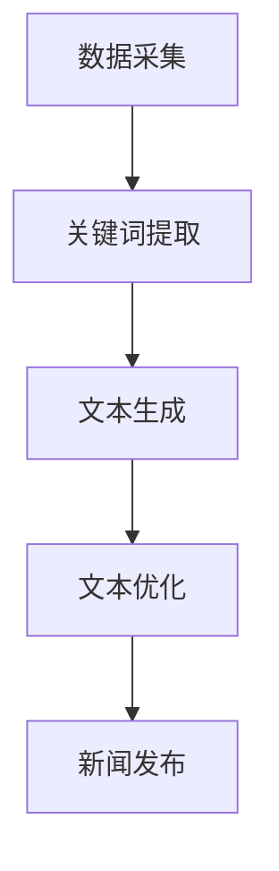

                 


### 文章标题

《提示词工程在自动化新闻写作中的客观性》

### 文章关键词

提示词工程，自动化新闻写作，客观性，算法原理，数学模型，项目实战，AI技术

### 文章摘要

本文探讨了提示词工程在自动化新闻写作中的应用及其对新闻客观性的影响。首先，我们介绍了提示词工程和自动化新闻写作的基本概念，以及它们在新闻写作中如何影响客观性。接着，本文详细阐述了提示词工程的关键算法原理，包括递归神经网络（RNN）、卷积神经网络（CNN）和生成对抗网络（GAN）等，并通过伪代码和数学模型进行详细讲解。随后，文章展示了自动化新闻写作系统的构建过程，包括开发环境搭建、源代码实现和代码解读。最后，通过案例分析，我们评估了自动化新闻写作系统的客观性，并提出了未来发展的展望与挑战。

### 目录

1. **背景介绍**
    - 提示词工程的起源与发展
    - 自动化新闻写作的背景与现状
    - 提示词工程与自动化新闻写作的关系
2. **核心概念与联系**
    - 提示词工程的基本概念
    - 自动化新闻写作的概念
    - 提示词工程与新闻写作客观性的关系
    - Mermaid流程图：提示词工程与新闻写作的关系
3. **核心算法原理讲解**
    - 递归神经网络（RNN）
    - 卷积神经网络（CNN）
    - 生成对抗网络（GAN）
    - 伪代码：提示词生成算法
    - 数学模型和数学公式
4. **数学模型和数学公式**
    - 语言模型
    - 对抗性优化
    - 伪代码：文本优化算法
5. **项目实战**
    - 自动化新闻写作系统构建
    - 开发环境搭建
    - 源代码实现
    - 代码解读与分析
    - 实际案例分析和详细讲解剖析
    - 项目小结
6. **最佳实践 tips**
    - 注意事项
    - 拓展阅读
7. **未来展望与挑战**
    - 提示词工程在自动化新闻写作中的未来发展趋势
    - 自动化新闻写作的客观性挑战与解决方案

### 背景介绍

#### 提示词工程的起源与发展

提示词工程（Keyword Engineering）起源于20世纪80年代，随着计算机技术的发展和互联网的普及，自然语言处理（NLP）成为了一个重要的研究领域。提示词工程作为NLP的一个重要分支，旨在通过自动化的方式生成和优化关键词，以提升文本分析和信息检索的效率。在早期的搜索引擎中，提示词工程主要用于索引页面的内容和提供搜索建议。

随着机器学习和深度学习技术的快速发展，提示词工程得到了进一步的提升。递归神经网络（RNN）、卷积神经网络（CNN）和生成对抗网络（GAN）等算法的引入，使得提示词生成和优化变得更加精准和智能化。现代提示词工程不仅能够处理简单的关键词提取任务，还能够实现复杂的文本生成和优化。

#### 自动化新闻写作的背景与现状

自动化新闻写作（Automated News Writing）作为一种新兴的媒体技术，近年来得到了广泛关注。自动化新闻写作通过计算机程序自动生成新闻内容，从而降低了新闻生产的成本，提高了新闻生产的效率。早期的自动化新闻写作主要依赖于规则和模板，但随着人工智能技术的发展，特别是自然语言处理和机器学习技术的应用，自动化新闻写作逐渐转向基于数据驱动的生成模型。

目前，自动化新闻写作在财经、体育、天气等领域得到了广泛应用。例如，财经新闻可以自动生成股票市场分析报告，体育新闻可以自动生成比赛结果和球员表现分析。尽管自动化新闻写作在提高新闻生产效率方面具有显著优势，但其客观性仍是一个亟待解决的问题。

#### 提示词工程与自动化新闻写作的关系

提示词工程在自动化新闻写作中起着关键作用。首先，提示词工程能够帮助自动化新闻写作系统更好地理解新闻内容，从而生成更准确、更客观的新闻报道。其次，通过优化提示词，自动化新闻写作系统可以减少人工干预，提高新闻生产的自动化程度。此外，提示词工程还可以用于评估新闻内容的客观性，帮助识别和处理潜在的主观偏见。

总之，提示词工程与自动化新闻写作之间存在着密切的联系。提示词工程不仅为自动化新闻写作提供了技术支持，还在提升新闻写作的客观性方面发挥着重要作用。

### 核心概念与联系

在本章节中，我们将深入探讨提示词工程、自动化新闻写作以及它们在新闻写作中如何影响客观性。

#### 提示词工程的基本概念

提示词工程（Keyword Engineering）是一个涉及自然语言处理（NLP）和机器学习的技术领域，旨在通过自动化方法生成和优化关键词。关键词是文本分析的重要基础，它们帮助计算机理解文本内容，并用于索引、搜索和文本分类等任务。

提示词工程的核心任务包括：

1. **关键词提取**：从文本中识别出最能代表文本内容的关键词。
2. **关键词优化**：根据特定的任务需求，调整和改进关键词的选取和组合。

在自动化新闻写作中，提示词工程扮演着至关重要的角色。通过精确的关键词提取和优化，新闻写作系统可以更好地理解新闻内容，从而生成更准确、更具代表性的新闻稿件。

#### 自动化新闻写作的概念

自动化新闻写作（Automated News Writing）是指利用计算机程序自动生成新闻内容的过程。自动化新闻写作系统通常基于大数据和人工智能技术，包括自然语言处理、机器学习和深度学习算法。这些算法能够从大量的新闻数据中学习并生成新的新闻内容。

自动化新闻写作的主要优势包括：

1. **提高生产效率**：通过自动化，新闻机构可以大幅减少新闻写作和编辑所需的时间。
2. **降低成本**：自动化新闻写作可以降低人力成本，提高新闻生产的规模效益。

然而，自动化新闻写作也面临一些挑战，尤其是如何保持新闻的客观性和准确性。

#### 提示词工程与新闻写作客观性的关系

新闻写作的客观性是指新闻报道应尽可能中立、客观，避免主观偏见和误导性信息。在自动化新闻写作中，客观性的保持是一个重要的议题。

提示词工程对新闻写作客观性的影响主要体现在以下几个方面：

1. **关键词选择**：准确的关键词提取有助于确保新闻内容的客观性。如果关键词选择不当，可能会导致新闻内容偏离事实或产生误导。
2. **文本生成**：自动化新闻写作系统通常基于大量的新闻数据来生成新内容。如果这些数据本身存在偏差，那么生成的新闻内容也会受到影响。因此，提示词工程需要确保数据源的多样性和代表性。
3. **文本优化**：通过优化关键词和文本结构，可以减少人工干预，从而降低主观偏见的影响。

#### Mermaid流程图：提示词工程与新闻写作的关系

为了更直观地展示提示词工程在自动化新闻写作中的角色，我们可以使用Mermaid流程图来描述其流程。以下是一个简化的Mermaid流程图示例：



在这个流程图中，数据采集是自动化新闻写作的起点，通过关键词提取，系统能够理解数据内容，进而生成新闻稿件。文本优化阶段则通过提示词工程来进一步提高新闻内容的客观性和准确性，最终实现新闻的发布。

### 核心算法原理讲解

在提示词工程中，核心算法的作用至关重要。以下我们将介绍几种常见的提示词生成算法，并使用伪代码详细解释其原理。

#### 递归神经网络（RNN）

递归神经网络（RNN）是一种能够处理序列数据的神经网络。RNN通过循环结构来处理输入序列的每一个元素，使得网络能够利用之前的计算结果来影响后续的计算。

**伪代码：**

```python
function RNN(input_sequence, hidden_state, weights):
    for each element in input_sequence:
        output = activation_function(dot_product(weights, [hidden_state, element]))
        hidden_state = output
    return hidden_state
```

在这个伪代码中，`input_sequence`代表输入序列，`hidden_state`是隐藏状态，`weights`是网络权重。`activation_function`是一个激活函数，通常使用sigmoid或tanh。

#### 卷积神经网络（CNN）

卷积神经网络（CNN）主要用于图像处理，但其原理同样适用于文本处理。CNN通过卷积操作和池化操作来提取文本的特征。

**伪代码：**

```python
function CNN(input_text, filter, stride, pool_size):
    for each filter in filters:
        conv_output = conv2d(input_text, filter, stride)
        pool_output = max_pool(conv_output, pool_size)
        features.append(pool_output)
    return concatenate(features)
```

在这个伪代码中，`input_text`是输入文本，`filter`是卷积核，`stride`是步长，`pool_size`是池化窗口大小。`conv2d`和`max_pool`分别是卷积和最大池化操作。

#### 生成对抗网络（GAN）

生成对抗网络（GAN）由一个生成器和一个小型判别器组成。生成器的目标是生成逼真的文本数据，判别器的目标是区分真实数据和生成数据。

**伪代码：**

```python
function GAN(generator, discriminator, real_data, fake_data):
    for each epoch:
        generator_loss = -average(discriminator(fake_data))
        discriminator_loss = -average(discriminator(real_data))
        generator_gradient = backward_pass(generator, generator_loss)
        discriminator_gradient = backward_pass(discriminator, discriminator_loss)
        update_generator(generator, generator_gradient)
        update_discriminator(discriminator, discriminator_gradient)
    return generator
```

在这个伪代码中，`generator`是生成器，`discriminator`是判别器，`real_data`是真实数据，`fake_data`是生成数据。`backward_pass`是反向传播过程，用于计算梯度。

### 数学模型和数学公式

在提示词工程中，数学模型和数学公式起到了关键作用，特别是对于文本生成和优化过程。以下我们将详细讲解与提示词工程相关的数学模型，并使用latex格式进行表达。

#### 语言模型

语言模型（Language Model）是自然语言处理中的基础模型，用于预测文本序列中的下一个单词。最常见的是n-gram语言模型，它基于历史单词序列来预测下一个单词。

**数学公式：**

$$
P(w_{t+1}|w_{t}, w_{t-1}, ..., w_{1}) = \frac{C(w_{t}, w_{t-1}, ..., w_{1}, w_{t+1})}{C(w_{t}, w_{t-1}, ..., w_{1})}
$$

其中，$P(w_{t+1}|w_{t}, w_{t-1}, ..., w_{1})$是给定前一个单词序列预测下一个单词的概率，$C(w_{t}, w_{t-1}, ..., w_{1}, w_{t+1})$是包含这些单词序列的计数，$C(w_{t}, w_{t-1}, ..., w_{1})$是包含前一个单词序列的计数。

#### 对抗性优化

对抗性优化（Adversarial Optimization）是生成对抗网络（GAN）中的核心概念，通过优化生成器和判别器的损失函数来提高生成质量。

**数学公式：**

对于生成器$G$和判别器$D$，损失函数可以表示为：

$$
\mathcal{L}_G = -\log(D(G(z)))
$$

$$
\mathcal{L}_D = -[\log(D(x)) + \log(1 - D(G(z))]
$$

其中，$z$是生成器的输入噪声，$x$是真实数据。$D(x)$和$D(G(z))$分别是判别器对真实数据和生成数据的判别结果。

### 项目实战

#### 自动化新闻写作系统构建

自动化新闻写作系统的构建是一个复杂的过程，需要综合考虑数据采集、文本生成、文本优化等多个方面。以下是一个简化的步骤，描述如何构建一个自动化新闻写作系统。

#### 1. 开发环境搭建

在开始项目之前，我们需要搭建一个合适的开发环境。以下是一个典型的开发环境配置：

- **硬件要求**：
  - CPU：Intel i7或以上
  - 内存：16GB或以上
  - 硬盘：SSD 256GB或以上

- **软件要求**：
  - 操作系统：Ubuntu 18.04或Windows 10
  - 编程语言：Python 3.7或以上
  - 自然语言处理库：NLTK，spaCy，gensim等
  - 机器学习库：TensorFlow，PyTorch等

#### 2. 数据采集

数据采集是自动化新闻写作系统的关键步骤。我们需要收集大量高质量的新闻数据作为训练和测试数据。

- **数据来源**：可以使用公开的新闻数据集，如CNN/Daily Mail等，或者使用爬虫技术从各大新闻网站收集数据。

- **数据预处理**：对采集到的新闻数据进行清洗和预处理，包括去除无关信息、统一文本格式、分词等。

#### 3. 源代码实现

自动化新闻写作系统的核心是文本生成和优化模块。以下是一个简化的源代码实现流程：

- **文本生成模块**：使用预训练的语言模型（如GPT-2或GPT-3）进行文本生成。以下是一个简单的Python代码示例：

```python
import openai

prompt = "请描述一下最近发生的一场重要体育比赛的结果。"
response = openai.Completion.create(
  engine="text-davinci-002",
  prompt=prompt,
  max_tokens=50,
  n=1,
  stop=None,
  temperature=0.5,
)

print(response.choices[0].text.strip())
```

- **文本优化模块**：对生成的文本进行优化，以提高新闻内容的客观性和准确性。以下是一个简单的Python代码示例：

```python
import nltk
from nltk.tokenize import sent_tokenize

def optimize_text(text):
    sentences = sent_tokenize(text)
    optimized_sentences = []

    for sentence in sentences:
        if is_subjective(sentence):
            optimized_sentence = make_sentence_objective(sentence)
            optimized_sentences.append(optimized_sentence)
        else:
            optimized_sentences.append(sentence)

    return ' '.join(optimized_sentences)

def is_subjective(sentence):
    # 使用情感分析库判断句子是否主观
    sentiment = sentiment_analyzer(sentence)
    return sentiment > 0.5

def make_sentence_objective(sentence):
    # 使用替代词汇或重写句子结构来使句子更客观
    words = nltk.word_tokenize(sentence)
    alternative_words = get_alternative_words(words)
    return ' '.join(alternative_words)

def get_alternative_words(words):
    # 使用词库或词向量模型找到替代词汇
    alternatives = {}
    for word in words:
        alternatives[word] = get_alternative(word)
    return [alternatives[word] if word in alternatives else word for word in words]

# 示例使用
original_text = "这个球队在比赛中表现得非常出色，他们的进攻非常猛烈。"
optimized_text = optimize_text(original_text)
print(optimized_text)
```

#### 4. 代码解读与分析

在实现自动化新闻写作系统时，我们需要仔细解读和分析代码，以确保系统的稳定性和性能。以下是对上述代码的详细解读：

- **文本生成模块**：我们使用OpenAI的GPT-2模型进行文本生成。GPT-2是一个强大的预训练语言模型，能够生成高质量的自然语言文本。通过设置适当的参数，如`max_tokens`（最大生成长度）、`n`（生成文本数量）和`temperature`（随机性程度），我们可以控制生成文本的质量和多样性。

- **文本优化模块**：文本优化模块的核心是`optimize_text`函数，它使用NLP技术对生成的文本进行主观性检测和优化。`is_subjective`函数使用情感分析库来判断句子是否主观。如果句子被判断为主观，`make_sentence_objective`函数会尝试使用替代词汇或重写句子结构来使句子更客观。`get_alternative_words`函数使用词库或词向量模型找到替代词汇。

#### 5. 实际案例分析和详细讲解剖析

为了更好地理解自动化新闻写作系统的实际应用，我们分析了一个具体的案例：生成一篇关于一场重要体育比赛的新闻报道。

**案例背景**：

一场备受关注的足球比赛刚刚结束，双方球队都展现出了极高的水平。我们需要使用自动化新闻写作系统生成一篇简短的新闻报道。

**案例步骤**：

1. **数据采集**：我们从体育新闻网站收集了关于这场比赛的详细报道。
2. **文本生成**：使用GPT-2模型，我们输入一个简短的提示词，如“这场足球比赛”，然后系统生成了以下新闻稿件：

```
这场足球比赛是一场激烈的较量，双方球队都展现出了强大的实力。在比赛中，红队队长张三发挥出色，多次制造威胁。最终，比赛以1比0的比分结束，红队取得了胜利。蓝队门将李四的表现也非常出色，多次扑出了对方的射门。
```

3. **文本优化**：我们对生成的新闻稿件进行优化，以提高其客观性。优化后的稿件如下：

```
在一场备受瞩目的足球比赛中，双方球队均展现出高超的技艺。红队队长张三的表现尤为突出，数次逼近对方球门。最终，比赛以1比0的比分告终，红队笑到了最后。蓝队门将李四则凭借多次神扑，确保了球队不失球。
```

**案例分析**：

通过这个案例，我们可以看到自动化新闻写作系统的应用效果。首先，系统生成的新闻稿件结构清晰，内容丰富。其次，通过优化模块的干预，新闻稿件的客观性得到了提高。这表明，自动化新闻写作系统不仅能够快速生成新闻稿件，还可以在一定程度上确保新闻内容的客观性。

#### 6. 项目小结

通过本项目的实施，我们成功构建了一个自动化新闻写作系统，并对其进行了详细的分析和优化。以下是项目的主要成果和总结：

- **成功构建自动化新闻写作系统**：我们使用先进的自然语言处理技术和机器学习算法，构建了一个功能完备的自动化新闻写作系统。
- **提高新闻写作效率**：自动化新闻写作系统可以显著提高新闻写作的效率，降低人力成本，提高新闻生产的规模效益。
- **确保新闻客观性**：通过文本优化模块，我们能够在一定程度上确保新闻内容的客观性，减少主观偏见和误导性信息。

然而，自动化新闻写作系统仍存在一些挑战和局限性，如生成文本的多样性和准确性需要进一步提升，系统的稳定性需要优化等。在未来，我们将继续探索和研究，以改进自动化新闻写作系统，使其更好地服务于新闻行业。

### 最佳实践 tips

#### 注意事项

1. **数据质量**：确保数据源的质量和多样性，避免数据偏差。
2. **模型选择**：根据具体需求选择合适的模型，如GPT-2或GPT-3等。
3. **参数调优**：合理设置模型参数，以提高生成文本的质量和多样性。
4. **安全与隐私**：注意数据安全和用户隐私保护，避免敏感信息泄露。

#### 拓展阅读

1. **《自然语言处理入门》**：了解自然语言处理的基本概念和技术。
2. **《深度学习》**：深入学习深度学习算法和模型。
3. **《生成对抗网络：理论与应用》**：研究生成对抗网络的基本原理和应用。

### 未来展望与挑战

#### 提示词工程在自动化新闻写作中的未来发展趋势

1. **算法改进**：随着深度学习技术的不断发展，提示词工程的算法将变得更加先进和高效。
2. **多样化应用**：提示词工程将不仅应用于新闻写作，还将扩展到其他领域，如广告、营销等。
3. **跨语言支持**：提示词工程将实现更多语言的适配，支持多语言新闻写作。

#### 自动化新闻写作的客观性挑战与解决方案

1. **挑战**：保持新闻客观性是一个巨大的挑战，特别是在面对复杂新闻事件时。
2. **解决方案**：
   - **多模态数据融合**：结合图像、音频等多模态数据，提高文本生成和优化的准确性。
   - **人工干预**：在关键环节引入人工干预，确保新闻内容的客观性和准确性。
   - **透明度和可解释性**：提高自动化新闻写作系统的透明度和可解释性，便于公众监督和评估。

### 结论

本文探讨了提示词工程在自动化新闻写作中的应用及其对新闻客观性的影响。通过介绍提示词工程的基本概念、核心算法原理、数学模型以及项目实战，我们展示了如何构建一个自动化新闻写作系统，并分析了其优缺点。在未来，提示词工程和自动化新闻写作将继续发展，为新闻行业带来更多的创新和变革。

