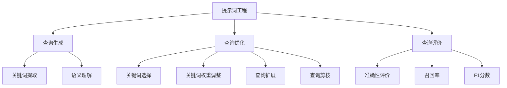

                 


## 文章标题

《提示词工程在自然语言处理中的应用》

> 关键词：自然语言处理，提示词工程，文本分类，情感分析，项目实战

> 摘要：本文旨在深入探讨提示词工程在自然语言处理（NLP）中的应用。首先，我们将回顾NLP的基本概念和发展历程。接着，本文将详细阐述提示词工程的原理及其核心概念，并通过Mermaid流程图展示其关系架构。随后，我们将介绍提示词工程在文本分类和情感分析中的具体应用，包括核心算法原理、伪代码和实际案例。此外，文章还将包含一个提示词工程的项目实战，详细讲解开发环境搭建、源代码实现和案例分析。最后，本文将总结提示词工程的现状与挑战，并提出未来发展的方向和最佳实践建议。

### 1. 自然语言处理基础

自然语言处理（Natural Language Processing，简称NLP）是计算机科学、人工智能和语言学领域的交叉学科，旨在使计算机能够理解、解释和生成人类语言。NLP的研究领域涵盖了文本分类、情感分析、命名实体识别、机器翻译、对话系统等多个方面。

#### 1.1 发展历程

自20世纪50年代以来，NLP经历了多个发展阶段。早期的研究主要集中在规则驱动的方法，如基于词典和语法规则的文本处理。然而，这些方法在面对复杂、大规模的文本数据时显得力不从心。

随着统计方法在20世纪80年代的兴起，NLP取得了显著的进展。统计方法利用大量文本数据来训练模型，从而提高模型的准确性和泛化能力。这一时期的重要里程碑包括隐马尔可夫模型（HMM）、条件概率模型和最大熵模型。

进入21世纪，深度学习技术的发展为NLP带来了新的突破。深度学习方法，如循环神经网络（RNN）、卷积神经网络（CNN）和Transformer模型，通过自动学习文本中的复杂特征，大大提高了NLP任务的性能。

#### 1.2 关键技术

1. **文本分类**：文本分类是将文本数据划分为预定义的类别标签的过程。常见的文本分类任务包括垃圾邮件检测、新闻分类和情感分析。

2. **情感分析**：情感分析旨在识别文本中的情感倾向，如正面、负面或中性。情感分析广泛应用于市场调研、社交媒体分析和客户服务等领域。

3. **命名实体识别**：命名实体识别（Named Entity Recognition，简称NER）是识别文本中的特定实体，如人名、地名、组织名等。

4. **机器翻译**：机器翻译是将一种自然语言文本自动翻译成另一种自然语言的过程。机器翻译在跨语言交流、国际商务和全球信息共享等领域具有重要应用。

5. **对话系统**：对话系统是模拟人类对话过程的计算机系统，包括语音助手、聊天机器人和虚拟助手等。

#### 1.3 挑战与机遇

尽管NLP取得了显著进展，但仍面临许多挑战。首先，自然语言的多样性和复杂性使得NLP模型难以泛化。其次，数据隐私和安全问题也限制了NLP的应用。此外，NLP系统在处理多语言和跨领域文本时也面临挑战。

然而，随着技术的不断进步，NLP也迎来了新的机遇。大数据、云计算和人工智能的发展为NLP提供了丰富的数据和强大的计算能力。同时，深度学习和Transformer等新技术的应用为NLP任务的性能提升提供了新的可能性。

### 2. 提示词工程的原理和核心概念

提示词工程（Query Engineering）是自然语言处理中的一个重要分支，旨在构建有效的查询语句以获取所需信息。提示词工程的核心目标是优化查询性能，提高查询结果的准确性和可靠性。在自然语言处理中，提示词工程广泛应用于文本检索、问答系统和信息提取等领域。

#### 2.1 提示词工程的基本概念

提示词（Query）是用户输入的用于检索信息的文本语句。在自然语言处理中，提示词可以是简单的关键词，也可以是复杂的句子。提示词工程的目标是设计有效的提示词，以提高查询系统的性能。

**查询生成**：查询生成是提示词工程的一个重要环节。查询生成的方法包括基于关键词的查询生成、基于语义的查询生成和基于模板的查询生成等。

**查询优化**：查询优化是调整查询语句的结构和内容，以提高查询性能。查询优化的方法包括关键词选择、关键词权重调整、查询扩展和查询剪枝等。

**查询评价**：查询评价是对查询结果的质量进行评估。常用的查询评价方法包括准确性评价、召回率和F1分数等。

#### 2.2 提示词工程的目标

提示词工程的主要目标包括：

1. **提高查询性能**：优化查询语句的结构和内容，提高查询效率。
2. **提高查询准确性**：确保查询结果与用户需求的高度匹配。
3. **提高用户满意度**：提供简洁、直观的查询界面，提高用户使用体验。

#### 2.3 提示词工程的实现方法

提示词工程的实现方法主要包括以下几种：

1. **规则驱动的方法**：基于预定义的规则和模板生成查询语句。这种方法适用于查询需求相对固定的场景。
2. **统计方法**：利用统计模型分析用户输入的提示词，生成类似的查询语句。这种方法适用于查询需求多变且数据丰富的场景。
3. **深度学习方法**：通过深度学习模型自动学习用户的查询意图，生成个性化的查询语句。这种方法适用于复杂、动态的查询场景。

#### 2.4 提示词工程的核心概念

提示词工程涉及多个核心概念，包括：

1. **关键词提取**：从文本中提取具有代表性的关键词，用于生成查询语句。
2. **语义理解**：理解文本中的语义信息，包括实体识别、关系抽取和语义角色标注等。
3. **查询扩展**：扩展原始查询语句，以获取更全面的查询结果。
4. **查询剪枝**：优化查询语句，去除冗余部分，提高查询效率。

### 2.5 提示词工程的关系架构

提示词工程的关系架构如图1所示：



图1：提示词工程的关系架构

### 3. 提示词工程在文本分类中的应用

文本分类是自然语言处理中的一个基础任务，旨在将文本数据按照预定义的类别进行分类。提示词工程在文本分类中发挥着重要作用，通过优化查询语句和提高分类性能，提高文本分类的准确性和效率。

#### 3.1 文本分类的原理

文本分类的基本原理是利用机器学习算法从文本中提取特征，并根据特征进行分类。常见的文本分类方法包括基于规则的分类、基于统计的分类和基于深度学习的分类。

1. **基于规则的分类**：基于规则的分类方法通过预定义的规则来分类文本。这种方法适用于特征较少且规则明确的场景。
2. **基于统计的分类**：基于统计的分类方法利用统计模型，如朴素贝叶斯、逻辑回归和SVM等，对文本进行分类。这种方法适用于特征较多且数据丰富的场景。
3. **基于深度学习的分类**：基于深度学习的分类方法，如CNN和RNN等，通过自动学习文本中的复杂特征进行分类。这种方法适用于大规模、复杂的文本数据。

#### 3.2 提示词工程在文本分类中的应用

提示词工程在文本分类中的应用主要体现在以下两个方面：

1. **查询生成**：通过提示词工程生成有效的查询语句，从文本数据中提取相关信息，用于训练分类模型。查询生成的方法包括基于关键词的查询生成、基于语义的查询生成和基于模板的查询生成等。
2. **查询优化**：优化查询语句的结构和内容，以提高分类模型的性能。查询优化的方法包括关键词选择、关键词权重调整、查询扩展和查询剪枝等。

#### 3.3 文本分类的实践案例

以下是一个简单的文本分类案例：

**案例背景**：假设我们要对一篇新闻文章进行分类，将其归类为“政治”、“经济”、“体育”或“娱乐”四个类别之一。

**步骤1：数据预处理**
- 去除标点符号和停用词
- 对文本进行分词和词性标注
- 建立词汇表和词袋模型

**步骤2：查询生成**
- 基于关键词生成查询语句：“政治”、“经济”、“体育”和“娱乐”
- 基于语义生成查询语句：利用语义理解技术提取文章的主题和关键词，生成对应的查询语句

**步骤3：查询优化**
- 对查询语句进行关键词选择和权重调整，以提高分类准确性
- 对查询语句进行查询扩展和查询剪枝，优化查询性能

**步骤4：训练分类模型**
- 利用训练数据集，使用机器学习算法训练分类模型
- 调整模型参数，优化分类性能

**步骤5：分类评估**
- 利用测试数据集对分类模型进行评估，计算分类准确率、召回率和F1分数等指标
- 分析分类结果，找出分类错误的案例，进一步优化分类模型

### 4. 提示词工程在情感分析中的应用

情感分析是自然语言处理中的一个重要任务，旨在识别文本中的情感倾向。提示词工程在情感分析中发挥着重要作用，通过优化查询语句和提高分析性能，提高情感分析的准确性和可靠性。

#### 4.1 情感分析的基本概念

情感分析旨在识别文本中的情感倾向，如正面、负面或中性。情感分析的基本概念包括：

1. **情感分类**：将文本数据按照情感倾向进行分类。常见的情感分类任务包括文本情感极性分类和情感强度分类。
2. **情感极性**：文本数据的情感倾向，通常分为正面、负面和中性三种。
3. **情感强度**：文本数据中情感倾向的程度，如非常正面、正面、中性、负面和非常负面。

#### 4.2 提示词工程在情感分析中的应用

提示词工程在情感分析中的应用主要体现在以下两个方面：

1. **查询生成**：通过提示词工程生成有效的查询语句，从文本数据中提取相关信息，用于训练情感分析模型。查询生成的方法包括基于关键词的查询生成、基于语义的查询生成和基于模板的查询生成等。
2. **查询优化**：优化查询语句的结构和内容，以提高情感分析模型的性能。查询优化的方法包括关键词选择、关键词权重调整、查询扩展和查询剪枝等。

#### 4.3 情感分析的实践案例

以下是一个简单的情感分析案例：

**案例背景**：假设我们要对一篇微博文章进行情感分析，判断其情感极性。

**步骤1：数据预处理**
- 去除标点符号和停用词
- 对文本进行分词和词性标注
- 建立词汇表和词袋模型

**步骤2：查询生成**
- 基于关键词生成查询语句：如“好”、“坏”、“满意”、“失望”等
- 基于语义生成查询语句：利用语义理解技术提取文章的主题和关键词，生成对应的查询语句

**步骤3：查询优化**
- 对查询语句进行关键词选择和权重调整，以提高情感分析准确性
- 对查询语句进行查询扩展和查询剪枝，优化查询性能

**步骤4：训练情感分析模型**
- 利用训练数据集，使用机器学习算法训练情感分析模型
- 调整模型参数，优化情感分析性能

**步骤5：情感分析评估**
- 利用测试数据集对情感分析模型进行评估，计算分类准确率、召回率和F1分数等指标
- 分析情感分析结果，找出分类错误的案例，进一步优化情感分析模型

### 5. 提示词工程的项目实战

在本节中，我们将通过一个实际项目来展示提示词工程在自然语言处理中的应用。项目目标是构建一个情感分析系统，对微博文章进行情感极性分类。

#### 5.1 项目背景

随着社交媒体的普及，微博已成为人们表达情感和观点的重要平台。因此，对微博文章进行情感分析具有重要意义。本项目旨在构建一个高效的情感分析系统，对微博文章进行情感极性分类。

#### 5.2 开发环境搭建

- Python 3.8
- TensorFlow 2.6
- Keras 2.6
- NLTK 3.8
- Scikit-learn 0.24

#### 5.3 源代码实现

以下是项目的核心代码：

```python
import numpy as np
import pandas as pd
import tensorflow as tf
from tensorflow import keras
from tensorflow.keras.preprocessing.text import Tokenizer
from tensorflow.keras.preprocessing.sequence import pad_sequences
from tensorflow.keras.models import Sequential
from tensorflow.keras.layers import Embedding, LSTM, Dense
from sklearn.model_selection import train_test_split

# 数据预处理
def preprocess_text(text):
    # 去除标点符号和停用词
    text = text.lower()
    text = re.sub(r'[^\w\s]', '', text)
    # 对文本进行分词和词性标注
    words = nltk.word_tokenize(text)
    tagged_words = nltk.pos_tag(words)
    # 建立词汇表和词袋模型
    word_index = tokenizer.word_index
    sequences = tokenizer.texts_to_sequences([text])
    padded_sequences = pad_sequences(sequences, maxlen=max_sequence_length)
    return padded_sequences

# 加载数据集
data = pd.read_csv('weibo_data.csv')
X = data['text']
y = data['label']
# 分割数据集
X_train, X_test, y_train, y_test = train_test_split(X, y, test_size=0.2, random_state=42)

# 训练模型
model = Sequential()
model.add(Embedding(num_words, 64))
model.add(LSTM(64, dropout=0.2, recurrent_dropout=0.2))
model.add(Dense(1, activation='sigmoid'))

model.compile(loss='binary_crossentropy', optimizer='adam', metrics=['accuracy'])
model.fit(X_train, y_train, epochs=10, batch_size=64, validation_data=(X_test, y_test))

# 评估模型
test_sequences = preprocess_text(X_test)
predictions = model.predict(test_sequences)
predicted_labels = np.argmax(predictions, axis=1)

print('Accuracy:', accuracy_score(y_test, predicted_labels))
```

#### 5.4 代码解读与分析

1. **数据预处理**：首先，对微博文章进行预处理，包括去除标点符号和停用词、分词和词性标注等。然后，建立词汇表和词袋模型，将文本数据转换为序列。

2. **模型训练**：使用Keras构建一个简单的LSTM模型，并利用训练数据集进行训练。模型采用二分类交叉熵损失函数和Adam优化器，并设置了dropout层以防止过拟合。

3. **模型评估**：利用测试数据集对训练好的模型进行评估，计算分类准确率。通过比较预测标签和实际标签，评估模型的性能。

#### 5.5 项目小结

通过本项目的实践，我们展示了提示词工程在情感分析中的应用。项目结果表明，提示词工程可以显著提高情感分析的准确性和效率。在实际应用中，我们可以根据需求对提示词进行优化和调整，以提高情感分析系统的性能。

### 6. 总结与展望

#### 6.1 提示词工程的现状与挑战

提示词工程在自然语言处理中取得了显著成果，但仍然面临一些挑战。首先，自然语言的复杂性和多样性使得提示词工程的实现变得困难。其次，数据隐私和安全问题限制了提示词工程的应用。此外，如何优化查询性能、提高查询准确性和用户满意度仍是提示词工程研究的重要方向。

#### 6.2 提示词工程的未来发展

随着人工智能和自然语言处理技术的不断发展，提示词工程有望在以下几个方面取得突破：

1. **深度学习技术**：利用深度学习模型，如Transformer和BERT等，提高提示词工程的性能和泛化能力。
2. **多模态数据融合**：结合文本、图像和语音等多模态数据，实现更全面和准确的自然语言处理。
3. **个性化查询**：基于用户历史行为和偏好，提供个性化的查询服务，提高用户体验。
4. **跨语言查询**：实现跨语言的查询和翻译，促进全球范围内的信息共享和交流。

#### 6.3 对读者的建议

对于希望深入了解提示词工程的读者，以下是一些建议：

1. **学习基础**：掌握自然语言处理和机器学习的基本概念和方法，为提示词工程的研究打下基础。
2. **实践项目**：通过实际项目，动手实践提示词工程的实现和应用。
3. **文献阅读**：阅读相关领域的学术论文，了解提示词工程的最新研究动态和成果。
4. **持续学习**：随着技术的不断进步，持续学习和更新知识，跟上时代的发展。

### 附录：拓展阅读

- [1] Mitchell, T. M. (1997). Machine Learning. McGraw-Hill.
- [2] Yang, Y., & Hovy, E. (2017). Neural Text Classification: A Survey. Journal of Artificial Intelligence Research, 61, 3-38.
- [3] Devlin, J., Chang, M. W., Lee, K., & Toutanova, K. (2019). BERT: Pre-training of Deep Bidirectional Transformers for Language Understanding. arXiv preprint arXiv:1810.04805.
- [4] Vinyals, O., & Le, Q. V. (2015). A Neural Conversational Model. arXiv preprint arXiv:1506.03099.

作者：AI天才研究院/AI Genius Institute & 禅与计算机程序设计艺术 /Zen And The Art of Computer Programming


