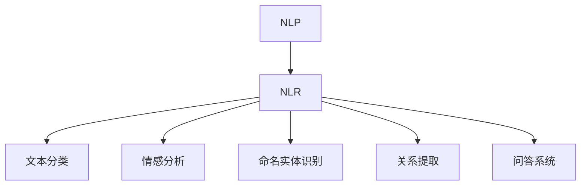

                 

# 提示词工程在自然语言推理任务中的应用

## 关键词
- 提示词工程
- 自然语言推理
- 文本分类
- 情感分析
- 命名实体识别
- 关系提取
- 问答系统

## 摘要
本文将深入探讨提示词工程在自然语言推理任务中的应用。首先，我们将概述自然语言处理和自然语言推理的基础概念，随后详细介绍提示词工程的基础知识和方法。接着，我们将分析提示词工程在文本分类、情感分析、命名实体识别、关系提取和问答系统中的应用。最后，我们将分享一些实践经验和未来发展趋势。

## 引言
自然语言处理（NLP）是计算机科学和人工智能领域的一个重要分支，旨在使计算机能够理解、解释和生成人类语言。自然语言推理（NLR）是NLP的一个子领域，涉及计算机对自然语言中表达的意义和逻辑关系进行理解和分析。

随着深度学习和大数据技术的发展，自然语言处理和自然语言推理在各个领域（如信息检索、机器翻译、问答系统等）取得了显著成果。然而，自然语言推理任务仍然面临许多挑战，如语义歧义、词义变化和长文本理解等。提示词工程作为一种有效的方法，可以提高自然语言推理的性能，减少语义歧义，并增强模型对长文本的理解能力。

## 第一部分：自然语言推理任务概述

### 1.1 自然语言处理与自然语言推理

自然语言处理（NLP）是使计算机能够理解、解释和生成人类语言的一系列技术和方法。自然语言推理（NLR）是NLP的一个子领域，它关注于理解语言中的意义和逻辑关系。

自然语言处理和自然语言推理之间的关系可以用一个简单的Mermaid流程图表示：

### 1.2 自然语言推理的重要性

自然语言推理在许多实际应用中起着关键作用，例如：

- **信息检索**：自然语言推理可以帮助搜索引擎更准确地理解用户查询，从而提供更相关的搜索结果。
- **机器翻译**：自然语言推理可以用于提高机器翻译的质量，特别是在处理多义词和语境依赖的情况下。
- **问答系统**：自然语言推理可以帮助问答系统更好地理解用户的问题，并提供更准确的答案。
- **文本分析**：自然语言推理可以用于情感分析、命名实体识别、关系提取等任务，从而提供对文本内容的深入理解。

### 1.3 自然语言推理的应用场景

自然语言推理在以下应用场景中具有广泛的应用：

- **社交媒体分析**：自然语言推理可以用于分析社交媒体上的用户评论、帖子等，以了解公众对某个话题的看法。
- **金融领域**：自然语言推理可以用于分析和预测股票市场、金融报告等。
- **医疗领域**：自然语言推理可以用于分析和理解医学文献、病例记录等，以辅助医生做出诊断。
- **教育领域**：自然语言推理可以用于个性化教育，帮助学生更好地理解和掌握知识。

## 第二部分：提示词工程基础

### 2.1 提示词的定义与作用

提示词（Prompt）是指用于引导模型学习的一种技术，它可以提供额外的上下文信息，帮助模型更好地理解输入数据。提示词在自然语言推理任务中的作用如下：

- **减少语义歧义**：通过提供上下文信息，提示词可以减少语义歧义，使模型能够更准确地理解输入文本。
- **增强模型理解能力**：提示词可以提供额外的信息，帮助模型更好地理解长文本，提高模型的推理能力。

### 2.2 提示词工程的挑战与机遇

提示词工程面临以下挑战：

- **上下文信息的选择与组合**：如何选择和组合上下文信息，以提高模型的理解能力，是一个重要的挑战。
- **模型适应性**：不同任务和场景下的提示词可能不同，如何使模型具有足够的适应性，是一个重要的挑战。

然而，提示词工程也带来了许多机遇：

- **提高自然语言推理性能**：通过使用提示词，可以显著提高自然语言推理任务的性能，使其在更广泛的场景中具有实用性。
- **促进跨领域应用**：提示词工程可以促进自然语言推理在各个领域的应用，为人类带来更多便利。

### 2.3 提示词工程的常见方法与技术

提示词工程的常见方法和技术包括：

- **固定提示词**：使用预定义的提示词，适用于特定任务或场景。
- **动态提示词**：根据输入数据动态生成提示词，适用于更复杂和多样化的任务。
- **多模态提示词**：结合文本、图像、音频等多种模态的提示词，提高模型的理解能力。
- **迁移学习**：利用预训练模型和已有数据，生成适用于新任务的提示词。

## 第三部分：提示词工程在自然语言推理中的应用

### 3.1 提示词在文本分类任务中的应用

在文本分类任务中，提示词可以用于：

- **增强分类器性能**：通过提供上下文信息，提示词可以提高分类器的性能，减少错误分类率。
- **解决语义歧义**：在处理含有歧义性词汇的文本时，提示词可以提供额外的信息，帮助分类器做出更准确的判断。

### 3.2 提示词在情感分析任务中的应用

在情感分析任务中，提示词可以用于：

- **提高情感分类准确性**：通过提供情感标签的上下文信息，提示词可以提高情感分类的准确性。
- **缓解词义变化影响**：在处理多义词时，提示词可以提供上下文信息，帮助模型理解词义，提高情感分类的稳定性。

### 3.3 提示词在命名实体识别任务中的应用

在命名实体识别任务中，提示词可以用于：

- **提高实体识别精度**：通过提供实体上下文信息，提示词可以提高命名实体识别的精度。
- **解决实体边界歧义**：在处理边界歧义的实体时，提示词可以提供额外信息，帮助模型准确识别实体。

### 3.4 提示词在关系提取任务中的应用

在关系提取任务中，提示词可以用于：

- **提高关系识别准确性**：通过提供关系上下文信息，提示词可以提高关系提取的准确性。
- **缓解实体关系歧义**：在处理含有歧义性关系的实体时，提示词可以提供额外信息，帮助模型准确识别关系。

### 3.5 提示词在问答系统任务中的应用

在问答系统任务中，提示词可以用于：

- **提高答案准确性**：通过提供问题上下文信息，提示词可以提高答案的准确性。
- **缓解语义歧义**：在处理含有歧义性问题的问答系统时，提示词可以提供额外信息，帮助模型准确理解问题，提供更准确的答案。

## 第四部分：提示词工程实践

### 4.1 实践一：构建个性化提示词

个性化提示词的构建过程包括：

- **需求分析**：了解具体任务和应用场景，确定所需的信息和上下文。
- **数据收集**：收集与任务相关的数据，包括文本、图像、音频等。
- **提示词生成**：使用自然语言处理技术和算法，生成适用于任务的个性化提示词。

### 4.2 实践二：优化提示词效果

优化提示词效果的方法包括：

- **模型适应性**：调整模型参数，使模型更适应提示词提供的上下文信息。
- **提示词组合**：通过组合不同的提示词，提高模型对上下文信息的理解能力。
- **数据增强**：增加数据多样性，提高模型对各种上下文信息的适应能力。

### 4.3 实践三：应用提示词于实际项目

在项目实践中，提示词的应用包括：

- **数据预处理**：使用提示词进行数据预处理，提高模型对输入数据的理解能力。
- **模型训练**：将提示词应用于模型训练，提高模型在特定任务上的性能。
- **模型评估**：使用提示词对模型进行评估，验证其在实际应用中的有效性。

## 第五部分：未来发展趋势

### 5.1 提示词工程的发展趋势

提示词工程在未来将呈现以下发展趋势：

- **多模态融合**：随着多模态技术的发展，提示词工程将逐步融合文本、图像、音频等多种模态，提高模型的理解能力。
- **个性化定制**：针对不同任务和应用场景，提示词工程将更加注重个性化定制，提高模型在特定领域的性能。
- **跨领域应用**：提示词工程将在更多领域得到应用，如医疗、金融、教育等，为人类带来更多便利。

### 5.2 自然语言推理任务的未来

自然语言推理任务在未来将朝着以下方向发展：

- **深度学习与提示词工程的结合**：深度学习和提示词工程将相互融合，提高模型在自然语言推理任务中的性能。
- **知识图谱的应用**：知识图谱技术将在自然语言推理任务中得到广泛应用，提高模型对知识的理解和利用能力。
- **跨语言和跨领域推理**：自然语言推理任务将逐步实现跨语言和跨领域的推理能力，为全球范围内的语言和知识交流提供支持。

### 5.3 提示词工程与自然语言推理的结合

提示词工程与自然语言推理的结合将带来以下优势：

- **提高任务性能**：通过提供额外的上下文信息，提示词工程可以提高自然语言推理任务的整体性能。
- **增强模型适应性**：提示词工程可以帮助模型更好地适应不同的任务和应用场景，提高模型的通用性。
- **促进跨领域应用**：提示词工程将为自然语言推理在各个领域的应用提供强有力的支持，推动人工智能技术的发展。

## 结论

本文系统地介绍了提示词工程在自然语言推理任务中的应用，从自然语言处理和自然语言推理的基础概念，到提示词工程的基础知识和方法，再到具体应用和实践，以及未来发展趋势。通过本文的阅读，读者可以深入了解提示词工程在自然语言推理任务中的重要性，掌握提示词工程的常用方法和技术，为实际应用提供指导。

## 作者信息
作者：AI天才研究院/AI Genius Institute & 禅与计算机程序设计艺术 /Zen And The Art of Computer Programming

----------------------------------------------------------------

# 文章结束 #

