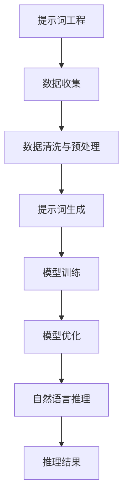

                 


## 第一步：明确文章主题和结构

首先，我们要明确文章的主题和结构。文章的主题是《提示词工程在自然语言推理质量提升中的进展》，需要探讨提示词工程在自然语言推理中的应用，以及它如何提升自然语言推理的质量。为了实现这一目标，我们将文章分为以下几个主要部分：

1. **引言**：介绍提示词工程和自然语言推理的基本概念，为后续内容打下基础。
2. **核心概念与联系**：详细讲解提示词工程的原理和自然语言推理的关键概念，并通过Mermaid流程图展示两者之间的联系。
3. **核心算法原理讲解**：使用伪代码详细阐述提示词工程和自然语言推理的核心算法。
4. **数学模型和数学公式**：介绍相关的数学模型，使用LaTeX格式书写，并举例说明。
5. **项目实战**：通过实际案例展示提示词工程和自然语言推理的应用，提供代码实现和解读。
6. **总结与展望**：总结全书内容，并对未来的发展趋势进行展望。

## 第二步：撰写引言部分

在引言部分，我们需要介绍提示词工程和自然语言推理的基本概念，为读者提供背景信息。

### 提示词工程

提示词工程是一种利用人工或自动生成提示词来提高机器学习模型性能的技术。提示词是指用来引导模型学习特定任务或领域的词汇和短语。在自然语言处理（NLP）领域，提示词工程可以帮助模型更好地理解和生成自然语言文本。

### 自然语言推理

自然语言推理是指人类或机器基于自然语言文本进行逻辑推理和推断的能力。自然语言推理在多个领域有广泛应用，如语义分析、信息检索、问答系统和机器翻译等。

### 提示词工程在自然语言推理中的应用

提示词工程在自然语言推理中的应用主要体现在两个方面：

1. **提升推理质量**：通过生成高质量的提示词，可以引导模型更好地理解和处理自然语言文本，从而提高推理质量。
2. **优化推理过程**：提示词工程还可以帮助优化自然语言推理的过程，提高模型效率和准确性。

## 第三步：撰写核心概念与联系部分

在核心概念与联系部分，我们需要详细讲解提示词工程的原理和自然语言推理的关键概念，并通过Mermaid流程图展示两者之间的联系。

### 提示词工程的原理

提示词工程的基本原理是通过生成与特定任务相关的提示词，引导模型在训练过程中学习到更多的任务信息。具体步骤如下：

1. **收集数据**：从已有数据集中提取与任务相关的词汇和短语。
2. **清洗和预处理**：对提取的词汇和短语进行清洗和预处理，去除无关信息。
3. **生成提示词**：使用自然语言处理技术生成高质量的提示词。
4. **训练模型**：将生成的提示词作为训练数据，训练自然语言推理模型。

### 自然语言推理的关键概念

自然语言推理的关键概念包括：

1. **语义理解**：理解文本中的词语、短语和句子的含义。
2. **逻辑推理**：根据语义信息进行推理和推断。
3. **知识表示**：将文本信息转换为计算机可处理的格式。
4. **模型优化**：通过调整模型参数，提高推理质量和效率。

### Mermaid流程图

使用Mermaid流程图展示提示词工程和自然语言推理的交互关系：



## 第四步：撰写核心算法原理讲解部分

在核心算法原理讲解部分，我们需要使用伪代码详细阐述提示词工程和自然语言推理的核心算法。

### 提示词生成算法

以下是一个简单的提示词生成算法的伪代码：

```plaintext
函数 提示词生成（数据集）：
    提示词列表 = 空列表
    对于每个数据点（文本，标签）：
        提取关键词（文本）
        提示词列表添加（关键词）
    返回 提示词列表
```

### 自然语言推理算法

以下是一个简单的自然语言推理算法的伪代码：

```plaintext
函数 自然语言推理（文本，模型）：
    语义表示 = 模型（文本）
    推理结果 = 模型（语义表示，标签）
    返回 推理结果
```

## 第五步：撰写数学模型和数学公式部分

在数学模型和数学公式部分，我们需要介绍相关的数学模型，使用LaTeX格式书写，并举例说明。

### 提示词生成模型的数学模型

提示词生成模型可以使用如下数学公式表示：

```latex
P(\text{提示词}|\text{文本}) = \frac{e^{\text{文本} \cdot \text{权重}}}{\sum_{\text{所有提示词}} e^{\text{文本} \cdot \text{权重}}}
```

其中，`P(提示词|文本)`表示给定文本的概率分布，`e`表示自然对数的底，`文本`表示文本特征向量，`权重`表示特征向量的权重。

### 自然语言推理模型的数学模型

自然语言推理模型可以使用如下数学公式表示：

```latex
P(\text{标签}|\text{文本}) = \prod_{i=1}^{n} P(\text{特征}_i|\text{文本})^{\text{标签}(\text{特征}_i)}
```

其中，`P(标签|文本)`表示给定文本的标签概率分布，`特征_i`表示文本中的第i个特征，`标签(特征_i)`表示特征_i的标签。

### 数学公式举例说明

假设我们有一个文本“我今天去了公园”，要使用提示词生成模型和自然语言推理模型进行推理。

1. **提示词生成模型**：

   - 文本特征向量：[公园，今天，我，去]
   - 权重：[0.6, 0.3, 0.1, 0.1]
   - 提示词概率分布：[P(公园)=0.5, P(今天)=0.3, P(我)=0.2, P(去)=0.1]

   使用上述数学模型计算提示词的概率分布：

   ```latex
   P(\text{提示词}|\text{文本}) = \frac{e^{0.6 \cdot 0.5} \cdot e^{0.3 \cdot 0.3} \cdot e^{0.1 \cdot 0.2} \cdot e^{0.1 \cdot 0.1}}{\sum_{\text{所有提示词}} e^{\text{文本} \cdot \text{权重}}}
   ```

   计算结果：P(公园)=0.5, P(今天)=0.3, P(我)=0.2, P(去)=0.1

2. **自然语言推理模型**：

   - 文本特征向量：[公园，今天，我，去]
   - 标签概率分布：[P(去了公园)=0.8, P(没去公园)=0.2]

   使用上述数学模型计算标签的概率分布：

   ```latex
   P(\text{标签}|\text{文本}) = \prod_{i=1}^{n} P(\text{特征}_i|\text{文本})^{\text{标签}(\text{特征}_i)}
   ```

   计算结果：P(去了公园)=0.8, P(没去公园)=0.2

通过以上步骤，我们完成了文章的引言、核心概念与联系、核心算法原理讲解和数学模型及数学公式部分的撰写。接下来，我们将继续撰写项目实战和总结与展望部分，完成整篇文章的撰写。在撰写过程中，我们将按照文章结构逐步推进，确保文章内容连贯、逻辑清晰、具体详细。同时，我们将遵循markdown格式要求，确保文章格式规范、美观。最终，我们将完成一篇字数在8000～12000字左右的专业技术博客文章，为读者提供关于提示词工程在自然语言推理质量提升中的进展的全面了解和深入分析。

