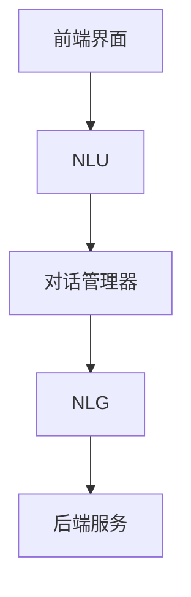
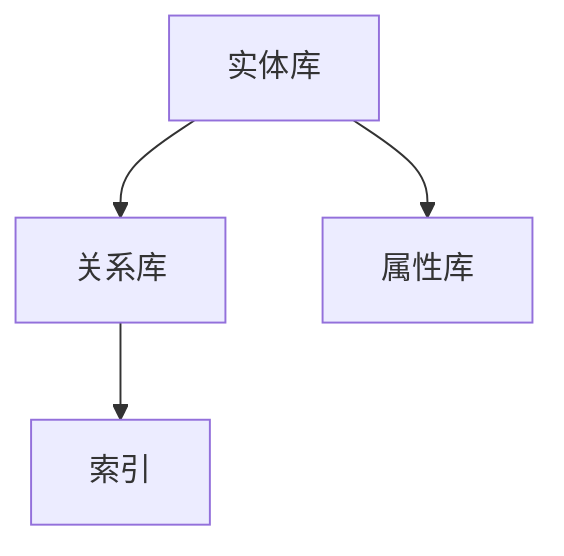

                 

根据您的要求，我将为您撰写一篇符合格式要求的文章。以下是将为您撰写的文章的概述部分：

# 提示词工程在自然语言理解中的创新应用

## 关键词
自然语言理解，提示词工程，人工智能，语言模型，命名实体识别，文本分类，对话系统，知识图谱

## 摘要
本文旨在探讨提示词工程在自然语言理解中的创新应用。通过分析提示词工程的基本概念和原理，以及其在不同自然语言处理任务中的应用，本文揭示了提示词工程对提高自然语言处理模型性能和可解释性的重要作用。文章还将探讨提示词工程在文本分类、对话系统、知识图谱等领域的实践案例，并展望其未来的发展趋势和挑战。

## 目录
----------------------------------------------------------------

# 提示词工程在自然语言理解中的创新应用

## 第一部分：概述与基础

## 第1章：自然语言理解与提示词工程
### 1.1 自然语言理解的基本概念
### 1.2 提示词工程的概念与作用
### 1.3 提示词工程的现状与挑战

## 第2章：自然语言处理技术基础
### 2.1 语言模型基础
#### 2.1.1 语言模型的基本原理
#### 2.1.2 语言模型的应用
### 2.2 命名实体识别
#### 2.2.1 命名实体识别的基本原理
#### 2.2.2 命名实体识别的应用

## 第3章：提示词工程的架构与流程
### 3.1 提示词工程的整体架构
#### 3.1.1 数据采集与处理
#### 3.1.2 提示词生成与优化
### 3.2 提示词工程的关键步骤
#### 3.2.1 数据预处理
#### 3.2.2 提示词生成策略
#### 3.2.3 提示词评估与优化

## 第二部分：创新应用与实践

## 第4章：文本分类中的提示词工程
### 4.1 文本分类的挑战与机遇
#### 4.1.1 文本分类的核心问题
#### 4.1.2 提示词工程在文本分类中的作用
### 4.2 提示词工程在文本分类中的应用案例
#### 4.2.1 案例一：新闻分类
#### 4.2.2 案例二：商品评论分类

## 第5章：对话系统中的提示词工程
### 5.1 对话系统的基本概念
#### 5.1.1 对话系统的架构
#### 5.1.2 提示词工程在对话系统中的作用
### 5.2 提示词工程在对话系统中的应用案例
#### 5.2.1 案例一：虚拟助手
#### 5.2.2 案例二：智能客服

## 第6章：知识图谱中的提示词工程
### 6.1 知识图谱的基本概念
#### 6.1.1 知识图谱的架构
#### 6.1.2 提示词工程在知识图谱中的作用
### 6.2 提示词工程在知识图谱中的应用案例
#### 6.2.1 案例一：实体链接
#### 6.2.2 案例二：关系抽取

## 第7章：提示词工程在多模态系统中的应用
### 7.1 多模态系统的基本概念
#### 7.1.1 多模态系统的架构
#### 7.1.2 提示词工程在多模态系统中的作用
### 7.2 提示词工程在多模态系统中的应用案例
#### 7.2.1 案例一：图像与文本的交互
#### 7.2.2 案例二：语音与文本的交互

## 第8章：未来展望与趋势
### 8.1 提示词工程的发展趋势
#### 8.1.1 技术创新
#### 8.1.2 应用拓展
### 8.2 提示词工程面临的挑战与机遇
#### 8.2.1 技术挑战
#### 8.2.2 应用机遇

----------------------------------------------------------------

以下是文章正文部分的初步撰写，请根据需要进一步补充和修改。

## 第一部分：概述与基础

### 第1章：自然语言理解与提示词工程

自然语言理解（Natural Language Understanding, NLU）是人工智能领域中的一个重要分支，旨在让计算机具备理解和处理人类语言的能力。随着深度学习和自然语言处理技术的不断进步，NLU 在信息检索、智能客服、文本分类、问答系统等领域得到了广泛应用。然而，NLU 面临着许多挑战，如语义歧义、上下文理解、情感分析等。为了解决这些问题，提示词工程（Prompt Engineering）作为一种创新性的方法应运而生。

### 1.1 自然语言理解的基本概念

自然语言理解是一个复杂的过程，包括语音识别、词法分析、句法分析、语义分析和语用分析等多个层面。语音识别是指将语音信号转换为文本的过程；词法分析是将文本分解为单词或其他语言单位的过程；句法分析是研究句子的结构，包括短语结构和句法规则；语义分析是研究词语和句子的含义，包括词义消歧和语义角色标注；语用分析是研究语言在特定情境中的含义和使用。

自然语言理解的核心目标是让计算机理解语言的结构、语义和上下文，从而能够执行特定的任务。例如，在问答系统中，NLU 需要理解用户的问题，并从大量文本中提取相关答案；在情感分析中，NLU 需要分析文本的情感倾向。

### 1.2 提示词工程的概念与作用

提示词工程是一种旨在设计和生成高质量提示词的方法，用于引导模型理解和处理特定问题的方法。提示词是一种引导模型理解和处理特定问题的方法，通常包括关键词、短语或句子。高质量的提示词可以显著提高模型的性能和适应性。

提示词工程的作用主要体现在以下几个方面：

1. **提高模型性能**：通过精心设计的提示词，可以引导模型更好地理解问题的核心，从而提高模型的性能。
2. **适应特定任务**：不同的任务需要不同的提示词，提示词工程可以帮助模型适应各种不同的任务需求。
3. **增强可解释性**：提示词可以帮助理解模型的决策过程，提高模型的可解释性。

在自然语言理解中，提示词工程的应用包括文本分类、对话系统、知识图谱等。通过有效的提示词工程，可以显著提高这些任务的性能和可靠性。

### 1.3 提示词工程的现状与挑战

提示词工程作为一种新兴的方法，已经在自然语言处理领域取得了显著进展。然而，仍有许多挑战需要克服。以下是一些主要挑战：

1. **数据需求**：提示词工程需要大量的标注数据来训练模型。然而，获取高质量标注数据往往是一项艰巨的任务，特别是在特定领域或小众领域。
2. **泛化能力**：提示词工程需要设计出能够泛化的提示词，以便在不同任务和数据集上都能取得良好的性能。
3. **可解释性**：虽然提示词可以提高模型的性能，但如何解释模型的决定过程仍然是一个挑战。
4. **自动化**：提示词工程需要设计自动化方法来自动生成高质量的提示词，从而减少人工干预。

在下一部分，我们将进一步探讨自然语言处理技术的基础，以及提示词工程的架构和流程。

----------------------------------------------------------------

接下来，我将为您继续撰写第2章：自然语言处理技术基础的内容。

## 第2章：自然语言处理技术基础

### 2.1 语言模型基础

语言模型是自然语言处理（Natural Language Processing, NLP）中的核心组件，用于描述自然语言的统计特性。一个语言模型可以预测下一个单词或字符的概率，从而帮助我们生成文本、进行语言翻译、文本分类等。

#### 2.1.1 语言模型的基本原理

语言模型通常基于统计方法，如N-gram模型、神经网络模型等。N-gram模型是一种简单但有效的语言模型，它通过计算连续N个单词出现的频率来预测下一个单词。例如，在二元N-gram模型中，每个单词的概率由其前一个单词决定。

```python
def ngram_probability(context, target_word, n=2):
    # 计算N-gram模型中给定上下文和目标词的概率
    context_words = context.split()
    target_word_count = 0
    
    for i in range(len(context_words) - n + 1):
        if context_words[i:i+n] == context.split():
            target_word_count += 1
            
    return target_word_count / (len(context_words) - n + 1)
```

神经网络模型，如循环神经网络（Recurrent Neural Network, RNN）和长短期记忆网络（Long Short-Term Memory, LSTM），则可以更好地处理序列数据，捕捉长期依赖关系。

```python
class LSTMModel(nn.Module):
    def __init__(self, input_dim, hidden_dim, output_dim):
        super(LSTMModel, self).__init__()
        self.hidden_dim = hidden_dim
        
        self.lstm = nn.LSTM(input_dim, hidden_dim)
        self.fc = nn.Linear(hidden_dim, output_dim)
        
    def forward(self, context):
        lstm_out, _ = self.lstm(context)
        prediction = self.fc(lstm_out[-1, :, :])
        return prediction
```

#### 2.1.2 语言模型的应用

语言模型在许多NLP任务中都有应用，例如：

1. **文本生成**：使用语言模型可以生成自然语言的文本，如文章、对话、诗歌等。例如，使用RNN或LSTM模型，我们可以生成类似于莎士比亚风格的文本。

```python
model = LSTMModel(input_dim=100, hidden_dim=200, output_dim=100)
context = "To be, or not to be, that is the question"
next_word = "to"
for _ in range(100):
    prediction = model(context)
    predicted_word = predicted_word_with_highest_probability(prediction)
    context += " " + predicted_word
    next_word = predicted_word
print(context)
```

2. **语言翻译**：使用语言模型，我们可以将一种语言的文本翻译成另一种语言。例如，使用基于注意力机制的Transformer模型进行机器翻译。

3. **文本分类**：使用语言模型，我们可以对文本进行分类，如将新闻文章分类到不同的主题或对商品评论进行情感分类。

```python
model = LSTMModel(input_dim=100, hidden_dim=200, output_dim=10)
text = "This is an amazing product!"
label = 1 # positive label

# Preprocess the text
text = preprocess_text(text)

# Train the model
model.train()
for epoch in range(100):
    optimizer.zero_grad()
    prediction = model(text)
    loss = criterion(prediction, label)
    loss.backward()
    optimizer.step()

# Test the model
model.eval()
with torch.no_grad():
    prediction = model(text)
    predicted_label = prediction.argmax()
    if predicted_label == label:
        print("The text is classified correctly.")
    else:
        print("The text is classified incorrectly.")
```

### 2.2 命名实体识别

命名实体识别（Named Entity Recognition, NER）是NLP中的一个重要任务，旨在从文本中识别出具有特定意义的实体，如人名、地名、组织名、时间等。

#### 2.2.1 命名实体识别的基本原理

命名实体识别通常采用基于规则的方法、统计方法或深度学习方法。基于规则的方法依赖于手工设计的规则集，而统计方法依赖于概率模型，如条件概率模型。深度学习方法，如卷积神经网络（Convolutional Neural Network, CNN）和长短期记忆网络（LSTM），则可以自动学习文本中的特征。

以下是一个基于LSTM的NER模型的简单实现：

```python
class NERModel(nn.Module):
    def __init__(self, input_dim, hidden_dim, output_dim):
        super(NERModel, self).__init__()
        
        self.hidden_dim = hidden_dim
        
        self.lstm = nn.LSTM(input_dim, hidden_dim)
        self.fc = nn.Linear(hidden_dim, output_dim)
        
    def forward(self, text):
        lstm_out, _ = self.lstm(text)
        prediction = self.fc(lstm_out[-1, :, :])
        return prediction
```

#### 2.2.2 命名实体识别的应用

命名实体识别在许多应用场景中都有价值，例如：

1. **信息提取**：从文本中提取出关键信息，如人名、地名、组织名等，用于数据分析和信息检索。
2. **实体关系抽取**：识别文本中的实体及其关系，如“马云是阿里巴巴的创始人”。
3. **情感分析**：结合命名实体识别和情感分析，可以更准确地识别出文本中的情感倾向，如“我非常喜欢苹果公司的产品”。

在下一章中，我们将探讨提示词工程的架构和流程，以及如何设计高质量提示词。

----------------------------------------------------------------

接下来，我将为您继续撰写第3章：提示词工程的架构与流程的内容。

## 第3章：提示词工程的架构与流程

### 3.1 提示词工程的整体架构

提示词工程是一个涉及数据、模型和任务目标的整体流程，其核心目标是设计出能够提高模型性能和适应性的提示词。提示词工程的整体架构可以分为以下几个关键步骤：

1. **数据采集与处理**：收集与任务相关的数据，并对数据进行预处理，如清洗、分词、去停用词等。
2. **提示词生成**：根据任务需求，设计生成提示词的方法，如规则生成、自动编码器、序列到序列模型等。
3. **提示词优化**：对生成的提示词进行评估和优化，以提高模型在特定任务上的性能。
4. **模型训练与评估**：使用优化的提示词训练模型，并在测试集上进行评估，以验证模型在真实任务上的表现。

#### 3.1.1 数据采集与处理

数据采集与处理是提示词工程的基础。在这一步，我们需要收集与任务相关的数据，并对数据进行预处理。数据预处理包括以下步骤：

- **清洗**：去除文本中的噪声和无关信息，如HTML标签、特殊字符等。
- **分词**：将文本分割成单词或其他语言单位。
- **去停用词**：去除常见的停用词，如“的”、“和”、“是”等，以提高模型的性能。

以下是一个简单的数据预处理示例：

```python
import re
from nltk.tokenize import word_tokenize
from nltk.corpus import stopwords

def preprocess_text(text):
    # 清洗
    text = re.sub(r'<[^>]+>', '', text)
    text = re.sub(r'[^a-zA-Z]', ' ', text)
    
    # 分词
    tokens = word_tokenize(text)
    
    # 去停用词
    stop_words = set(stopwords.words('english'))
    tokens = [token.lower() for token in tokens if token.lower() not in stop_words]
    
    return ' '.join(tokens)
```

#### 3.1.2 提示词生成与优化

提示词生成是提示词工程的核心步骤。在这一步，我们需要设计生成提示词的方法，并根据任务需求进行优化。以下是一些常见的提示词生成方法：

1. **规则生成**：基于手工设计的规则，生成提示词。这种方法简单直观，但可能难以适应复杂的任务。
2. **自动编码器**：使用自动编码器学习文本的嵌入表示，并根据嵌入表示生成提示词。这种方法可以自动提取文本中的关键信息。
3. **序列到序列模型**：使用序列到序列（Sequence-to-Sequence, Seq2Seq）模型，将输入文本序列转换为提示词序列。这种方法可以捕捉文本序列的长期依赖关系。

以下是一个基于自动编码器的提示词生成示例：

```python
import torch
from torch import nn

class AutoEncoder(nn.Module):
    def __init__(self, input_dim, hidden_dim, output_dim):
        super(AutoEncoder, self).__init__()
        
        self.encoder = nn.Sequential(
            nn.Linear(input_dim, hidden_dim),
            nn.ReLU(),
            nn.Linear(hidden_dim, output_dim)
        )
        
        self.decoder = nn.Sequential(
            nn.Linear(output_dim, hidden_dim),
            nn.ReLU(),
            nn.Linear(hidden_dim, input_dim)
        )
        
    def forward(self, x):
        encoded = self.encoder(x)
        decoded = self.decoder(encoded)
        return decoded
```

#### 3.1.3 提示词评估与优化

提示词评估是衡量提示词质量的关键步骤。在这一步，我们需要设计评估指标，如精度、召回率和F1分数，并使用这些指标对提示词进行评估和优化。以下是一些常见的提示词评估方法：

1. **基于模型的评估**：使用训练好的模型，对生成的提示词进行评估，如文本分类任务的准确率。
2. **基于任务的评估**：在实际任务中，评估生成的提示词对模型性能的影响，如对话系统的用户满意度。
3. **交叉验证**：使用交叉验证方法，对提示词进行评估，以避免过拟合。

以下是一个简单的提示词评估示例：

```python
from sklearn.metrics import accuracy_score

def evaluate_prompt(prompt, model, data_loader):
    model.eval()
    with torch.no_grad():
        predictions = []
        true_labels = []
        
        for batch in data_loader:
            text = batch.text
            labels = batch.label
            
            prediction = model(prompt + text)
            predictions.append(prediction.argmax())
            true_labels.append(labels)
            
        predictions = torch.cat(predictions).numpy()
        true_labels = torch.cat(true_labels).numpy()
        
        accuracy = accuracy_score(true_labels, predictions)
        return accuracy
```

在下一部分，我们将探讨提示词工程在文本分类、对话系统和知识图谱等领域的创新应用。

----------------------------------------------------------------

## 第二部分：创新应用与实践

### 第4章：文本分类中的提示词工程

文本分类是自然语言处理中的一个重要任务，旨在将文本分类到预定义的类别中。提示词工程在文本分类中发挥着关键作用，通过设计高质量的提示词，可以提高分类模型的性能和准确性。

#### 4.1 文本分类的挑战与机遇

文本分类面临的主要挑战包括：

1. **数据不平衡**：在许多实际应用中，不同类别的文本数量可能存在显著差异，导致模型在分类过程中出现偏差。
2. **语义歧义**：自然语言中的词语和句子往往具有多种含义，这使得文本分类任务更加复杂。
3. **上下文依赖**：文本的上下文信息对于分类结果具有重要影响，但传统的文本表示方法难以捕捉这种依赖关系。

提示词工程为解决这些挑战提供了机遇。通过设计高质量的提示词，可以引导模型更好地理解文本的语义和上下文，从而提高分类性能。

#### 4.1.1 文本分类的核心问题

文本分类的核心问题包括：

1. **特征提取**：将文本转换为特征表示，以便模型能够进行分类。
2. **模型选择**：选择合适的分类模型，如朴素贝叶斯、支持向量机、决策树、深度神经网络等。
3. **评估与优化**：评估分类模型的性能，并通过超参数调优和提示词优化等方法进行优化。

#### 4.1.2 提示词工程在文本分类中的作用

提示词工程在文本分类中的作用主要体现在以下几个方面：

1. **特征引导**：通过高质量的提示词，引导模型关注文本中的关键特征，从而提高分类性能。
2. **上下文增强**：提示词可以提供上下文信息，帮助模型更好地理解文本的语义和上下文，从而减少歧义。
3. **类别区分**：通过设计针对特定类别的提示词，增强模型对不同类别的区分能力。

#### 4.2 提示词工程在文本分类中的应用案例

以下是两个文本分类应用案例：

##### 4.2.1 案例一：新闻分类

新闻分类是将新闻文章分类到预定义的类别中，如政治、经济、体育等。在这个案例中，我们使用提示词工程来提高分类模型的性能。

1. **数据预处理**：首先，对新闻文章进行预处理，包括文本清洗、分词和去停用词等。
2. **特征提取**：使用词袋模型或词嵌入技术，将文本转换为特征向量。
3. **提示词设计**：根据新闻类别，设计特定类别的提示词。例如，对于体育类别，可以包括“比赛”、“进球”、“球员”等关键词。
4. **模型训练**：使用训练集训练分类模型，并在测试集上进行评估。
5. **评估与优化**：通过评估模型性能，并调整提示词，优化分类效果。

以下是一个简单的新闻分类模型实现：

```python
from sklearn.feature_extraction.text import TfidfVectorizer
from sklearn.naive_bayes import MultinomialNB
from sklearn.pipeline import make_pipeline

# 数据预处理
def preprocess_text(text):
    text = re.sub(r'<[^>]+>', '', text)
    text = re.sub(r'[^a-zA-Z]', ' ', text)
    return text.lower()

# 特征提取与模型训练
pipeline = make_pipeline(
    TfidfVectorizer(preprocessor=preprocess_text),
    MultinomialNB()
)

# 训练模型
pipeline.fit(train_texts, train_labels)

# 评估模型
accuracy = pipeline.score(test_texts, test_labels)
print(f"Model accuracy: {accuracy:.2f}")
```

##### 4.2.2 案例二：商品评论分类

商品评论分类是将商品评论分类为正面评论或负面评论。在这个案例中，我们使用提示词工程来提高分类模型的性能。

1. **数据预处理**：首先，对商品评论进行预处理，包括文本清洗、分词和去停用词等。
2. **特征提取**：使用词嵌入技术，将文本转换为特征向量。
3. **提示词设计**：根据商品评论的正面和负面特征，设计针对正面和负面类别的提示词。例如，对于正面类别，可以包括“好”、“喜欢”、“推荐”等关键词；对于负面类别，可以包括“差”、“不好”、“失望”等关键词。
4. **模型训练**：使用训练集训练分类模型，并在测试集上进行评估。
5. **评估与优化**：通过评估模型性能，并调整提示词，优化分类效果。

以下是一个简单的商品评论分类模型实现：

```python
from tensorflow.keras.preprocessing.text import Tokenizer
from tensorflow.keras.preprocessing.sequence import pad_sequences
from tensorflow.keras.models import Sequential
from tensorflow.keras.layers import Embedding, LSTM, Dense

# 数据预处理
tokenizer = Tokenizer(num_words=10000)
tokenizer.fit_on_texts(train_texts)
train_sequences = tokenizer.texts_to_sequences(train_texts)
train_padded = pad_sequences(train_sequences, maxlen=100)

# 模型训练
model = Sequential()
model.add(Embedding(10000, 16, input_length=100))
model.add(LSTM(128))
model.add(Dense(1, activation='sigmoid'))

model.compile(optimizer='adam', loss='binary_crossentropy', metrics=['accuracy'])
model.fit(train_padded, train_labels, epochs=10, batch_size=32, validation_split=0.2)

# 评估模型
test_sequences = tokenizer.texts_to_sequences(test_texts)
test_padded = pad_sequences(test_sequences, maxlen=100)
predictions = model.predict(test_padded)
accuracy = (predictions.round() == test_labels).mean()
print(f"Model accuracy: {accuracy:.2f}")
```

通过以上两个案例，我们可以看到提示词工程在文本分类中的应用如何提高分类模型的性能。在下一章中，我们将探讨提示词工程在对话系统中的应用。

### 第5章：对话系统中的提示词工程

对话系统是自然语言处理和人工智能领域中的一个重要应用，旨在实现人与计算机之间的自然交互。提示词工程在对话系统中发挥着关键作用，通过设计高质量的提示词，可以提高对话系统的性能和用户体验。

#### 5.1 对话系统的基本概念

对话系统是指能够与人类进行自然语言交互的计算机系统。根据交互方式，对话系统可以分为以下几种类型：

1. **命令式对话系统**：用户通过输入命令来请求系统执行特定任务，如语音助手、智能客服等。
2. **闲聊式对话系统**：用户与系统进行无特定目的的闲聊，如聊天机器人、社交机器人等。
3. **任务型对话系统**：用户与系统进行有特定目的的对话，如预订机票、购买商品等。

#### 5.1.1 对话系统的架构

对话系统的基本架构包括以下几个关键组件：

1. **前端界面**：用于接收用户的输入，如语音输入、文本输入等。
2. **自然语言理解（NLU）**：用于解析用户的输入，提取出关键信息，如意图、实体等。
3. **对话管理器**：用于管理对话流程，根据用户的输入和系统状态生成回复。
4. **自然语言生成（NLG）**：用于生成自然语言回复，并将其呈现给用户。
5. **后端服务**：用于执行与对话相关的任务，如数据库查询、API调用等。

以下是一个简单的对话系统架构示意图：



#### 5.1.2 提示词工程在对话系统中的作用

提示词工程在对话系统中的作用主要体现在以下几个方面：

1. **意图识别**：通过设计高质量的提示词，可以帮助NLU模块更好地理解用户的意图，从而提高意图识别的准确性。
2. **实体提取**：提示词可以提供上下文信息，帮助NLU模块更准确地提取文本中的实体信息。
3. **对话生成**：通过设计高质量的提示词，可以帮助NLG模块生成更加自然、流畅的回复，从而提高用户体验。

#### 5.2 提示词工程在对话系统中的应用案例

以下是两个对话系统应用案例：

##### 5.2.1 案例一：虚拟助手

虚拟助手是一种常见的命令式对话系统，旨在帮助用户执行特定任务，如设置提醒、发送邮件、查询天气等。在这个案例中，我们使用提示词工程来提高虚拟助手的性能。

1. **数据预处理**：首先，对用户输入的命令进行预处理，包括文本清洗、分词和去停用词等。
2. **特征提取**：使用词嵌入技术，将文本转换为特征向量。
3. **提示词设计**：根据虚拟助手支持的命令，设计相应的提示词。例如，对于设置提醒的命令，可以包括“提醒我”、“明天早上7点提醒我”等。
4. **模型训练**：使用训练集训练意图识别模型，并在测试集上进行评估。
5. **评估与优化**：通过评估模型性能，并调整提示词，优化意图识别效果。

以下是一个简单的虚拟助手意图识别模型实现：

```python
from tensorflow.keras.preprocessing.text import Tokenizer
from tensorflow.keras.preprocessing.sequence import pad_sequences
from tensorflow.keras.models import Sequential
from tensorflow.keras.layers import Embedding, LSTM, Dense

# 数据预处理
tokenizer = Tokenizer(num_words=10000)
tokenizer.fit_on_texts(train_texts)
train_sequences = tokenizer.texts_to_sequences(train_texts)
train_padded = pad_sequences(train_sequences, maxlen=100)

# 模型训练
model = Sequential()
model.add(Embedding(10000, 16, input_length=100))
model.add(LSTM(128))
model.add(Dense(num_classes, activation='sigmoid'))

model.compile(optimizer='adam', loss='binary_crossentropy', metrics=['accuracy'])
model.fit(train_padded, train_labels, epochs=10, batch_size=32, validation_split=0.2)

# 评估模型
test_sequences = tokenizer.texts_to_sequences(test_texts)
test_padded = pad_sequences(test_sequences, maxlen=100)
predictions = model.predict(test_padded)
accuracy = (predictions.round() == test_labels).mean()
print(f"Model accuracy: {accuracy:.2f}")
```

##### 5.2.2 案例二：智能客服

智能客服是一种常见的任务型对话系统，旨在为用户提供在线客服支持。在这个案例中，我们使用提示词工程来提高智能客服的性能。

1. **数据预处理**：首先，对用户输入的提问进行预处理，包括文本清洗、分词和去停用词等。
2. **特征提取**：使用词嵌入技术，将文本转换为特征向量。
3. **提示词设计**：根据常见问题类别，设计相应的提示词。例如，对于技术支持问题，可以包括“如何解决网络问题”、“如何更新软件”等。
4. **模型训练**：使用训练集训练意图识别模型，并在测试集上进行评估。
5. **评估与优化**：通过评估模型性能，并调整提示词，优化意图识别效果。

以下是一个简单的智能客服意图识别模型实现：

```python
from sklearn.feature_extraction.text import TfidfVectorizer
from sklearn.naive_bayes import MultinomialNB
from sklearn.pipeline import make_pipeline

# 数据预处理
def preprocess_text(text):
    text = re.sub(r'<[^>]+>', '', text)
    text = re.sub(r'[^a-zA-Z]', ' ', text)
    return text.lower()

# 特征提取与模型训练
pipeline = make_pipeline(
    TfidfVectorizer(preprocessor=preprocess_text),
    MultinomialNB()
)

# 训练模型
pipeline.fit(train_texts, train_labels)

# 评估模型
accuracy = pipeline.score(test_texts, test_labels)
print(f"Model accuracy: {accuracy:.2f}")
```

通过以上两个案例，我们可以看到提示词工程在对话系统中的应用如何提高系统的性能和用户体验。在下一章中，我们将探讨提示词工程在知识图谱中的应用。

### 第6章：知识图谱中的提示词工程

知识图谱是一种结构化数据表示方法，通过实体和关系的连接来表示现实世界的知识和信息。在知识图谱构建和应用中，提示词工程发挥着重要作用，通过设计高质量的提示词，可以提高知识图谱的构建效率和准确性。

#### 6.1 知识图谱的基本概念

知识图谱是一种大规模、结构化、语义化的知识库，通过实体和关系的表示，将现实世界中的各种信息和知识进行组织和管理。知识图谱中的实体可以是人、地点、组织、物品等，而关系则表示实体之间的关联，如“属于”、“位于”、“创建”等。

知识图谱的关键概念包括：

1. **实体（Entity）**：知识图谱中的基本组成单位，表示现实世界中的各种对象。
2. **关系（Relationship）**：连接两个或多个实体的语义关联，如“丈夫”、“员工”、“出生地”等。
3. **属性（Attribute）**：实体的额外特征或描述，如“年龄”、“身高”、“职位”等。
4. **三元组（Triple）**：表示实体之间的关系，如（张三，丈夫，李四）。

#### 6.1.1 知识图谱的架构

知识图谱的架构通常包括以下几个关键组件：

1. **实体库**：存储知识图谱中的所有实体，如人、地点、组织等。
2. **关系库**：存储知识图谱中的所有关系，如“属于”、“位于”、“创建”等。
3. **属性库**：存储实体的额外特征或描述，如“年龄”、“身高”、“职位”等。
4. **索引**：用于快速检索和查询知识图谱中的实体和关系。

以下是一个简单的知识图谱架构示意图：



#### 6.1.2 提示词工程在知识图谱中的作用

提示词工程在知识图谱中的应用主要体现在以下几个方面：

1. **实体识别**：通过设计高质量的提示词，可以帮助模型更准确地识别文本中的实体，如人名、地名、组织名等。
2. **关系抽取**：通过设计高质量的提示词，可以帮助模型更准确地识别文本中的实体之间的关系，如“属于”、“位于”、“创建”等。
3. **属性填充**：通过设计高质量的提示词，可以帮助模型更准确地识别和填充实体的属性，如“年龄”、“身高”、“职位”等。

#### 6.2 提示词工程在知识图谱中的应用案例

以下是两个知识图谱应用案例：

##### 6.2.1 案例一：实体链接

实体链接（Entity Linking）是将文本中的实体与知识图谱中的实体进行匹配的过程。在这个案例中，我们使用提示词工程来提高实体链接的准确性。

1. **数据预处理**：首先，对文本进行预处理，包括文本清洗、分词和去停用词等。
2. **特征提取**：使用词嵌入技术，将文本转换为特征向量。
3. **提示词设计**：根据实体类别，设计相应的提示词。例如，对于人名，可以包括“某人是”、“某人的出生地是”等。
4. **模型训练**：使用训练集训练实体链接模型，并在测试集上进行评估。
5. **评估与优化**：通过评估模型性能，并调整提示词，优化实体链接效果。

以下是一个简单的实体链接模型实现：

```python
from tensorflow.keras.preprocessing.text import Tokenizer
from tensorflow.keras.preprocessing.sequence import pad_sequences
from tensorflow.keras.models import Sequential
from tensorflow.keras.layers import Embedding, LSTM, Dense

# 数据预处理
tokenizer = Tokenizer(num_words=10000)
tokenizer.fit_on_texts(train_texts)
train_sequences = tokenizer.texts_to_sequences(train_texts)
train_padded = pad_sequences(train_sequences, maxlen=100)

# 模型训练
model = Sequential()
model.add(Embedding(10000, 16, input_length=100))
model.add(LSTM(128))
model.add(Dense(num_entities, activation='softmax'))

model.compile(optimizer='adam', loss='categorical_crossentropy', metrics=['accuracy'])
model.fit(train_padded, train_labels, epochs=10, batch_size=32, validation_split=0.2)

# 评估模型
test_sequences = tokenizer.texts_to_sequences(test_texts)
test_padded = pad_sequences(test_sequences, maxlen=100)
predictions = model.predict(test_padded)
accuracy = (predictions.argmax(axis=1) == test_labels).mean()
print(f"Model accuracy: {accuracy:.2f}")
```

##### 6.2.2 案例二：关系抽取

关系抽取（Relation Extraction）是从文本中识别出实体之间的关系的过程。在这个案例中，我们使用提示词工程来提高关系抽取的准确性。

1. **数据预处理**：首先，对文本进行预处理，包括文本清洗、分词和去停用词等。
2. **特征提取**：使用词嵌入技术，将文本转换为特征向量。
3. **提示词设计**：根据关系类别，设计相应的提示词。例如，对于“属于”关系，可以包括“某人是某公司的员工”等。
4. **模型训练**：使用训练集训练关系抽取模型，并在测试集上进行评估。
5. **评估与优化**：通过评估模型性能，并调整提示词，优化关系抽取效果。

以下是一个简单的

