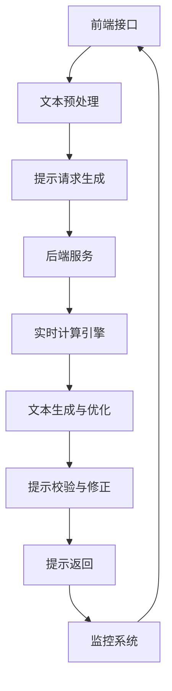

                 


### 文章标题

《提示词工程在自然语言生成中的质量控制》

### 关键词

自然语言生成，提示词工程，质量控制，算法，神经网络，统计语言模型，提示设计，实时提示系统，语言流畅性，语义准确性，文本风格，个性化，错误处理，案例分析，项目实战，最佳实践。

### 摘要

本文旨在深入探讨提示词工程在自然语言生成（NLG）中的质量控制方法。首先，我们回顾了NLG的基本概念和现有质量标准，然后详细介绍了提示工程的基本概念、设计原则以及核心算法。接着，文章重点分析了统计语言模型和神经网络在提示工程中的应用，并探讨了实时提示工程的需求与挑战。随后，我们提出了一套完整的质量控制方法，包括评价指标、提示校验与修正，以及错误处理策略。文章通过案例分析展示了提示工程在实际项目中的应用，并在项目实战部分详细介绍了开发环境搭建和源代码实现。最后，文章总结了提示工程的未来发展趋势，并给出了最佳实践和注意事项。全文结构清晰，内容丰富，旨在为读者提供全面、实用的提示词工程质量控制的指导。

### 引言与基础

自然语言生成（Natural Language Generation，NLG）是一种人工智能技术，旨在使计算机能够生成人类可读的文本。随着深度学习和神经网络技术的迅猛发展，NLG已经成为自然语言处理（Natural Language Processing，NLP）领域的一个重要分支。NLG技术广泛应用于自动问答系统、文本摘要、虚拟助手、对话系统等场景，极大地提升了信息处理的效率和准确性。

#### 1.2 自然语言生成（NLG）与提示工程

在NLG系统中，提示工程（Prompt Engineering）是一个至关重要的环节。提示工程的核心任务是为模型提供适当的输入提示，以引导模型生成符合预期的高质量文本。提示工程不仅仅涉及文本的编写，还包括对文本结构、语义、风格等各方面的精细调整。高质量的提示能够显著提高NLG系统的生成效果，降低错误率，提升用户体验。

#### 1.3 NLG中的质量标准与挑战

NLG系统的质量标准主要包括语言流畅性、语义准确性、文本风格和个性化等方面。然而，在实际应用中，NLG系统面临诸多挑战：

1. **语言流畅性与连贯性**：生成的文本需要符合语法规则，语言流畅自然，逻辑连贯。
2. **语义准确性**：生成的文本需要准确传达原始信息，避免歧义和误导。
3. **文本风格与个性**：生成的文本需要符合特定的风格要求，体现文本来源的独特个性。
4. **长度与多样性**：生成的文本需要长度适中，内容丰富多样，避免模板化。

这些挑战促使研究者不断探索改进提示工程的方法，以提高NLG系统的整体质量。下面，我们将进一步探讨提示工程的基本概念、设计原则和核心算法。

### 提示工程基本概念

#### 2.1 提示的定义与类型

在自然语言生成中，提示（Prompt）是指为模型提供的信息，用于引导模型生成目标文本。提示可以是一句话、一个短语或者一个段落，其目的是明确模型的生成目标和约束条件，从而提高生成文本的相关性和准确性。

根据应用场景和目的的不同，提示可以分为以下几种类型：

1. **问题引导型提示**：用于引导模型生成问题的答案，如自动问答系统。
2. **上下文引导型提示**：提供一段背景信息，用于引导模型生成相关内容，如文本摘要。
3. **目标引导型提示**：明确指定模型需要生成的文本类型或格式，如格式化文本生成。
4. **混合型提示**：结合多种类型提示，以更精细地引导模型生成目标文本。

#### 2.2 提示工程的作用与重要性

提示工程在自然语言生成中发挥着重要作用，其主要作用包括：

1. **明确生成目标**：通过提供明确的提示，帮助模型理解生成任务的具体目标和要求。
2. **提高生成质量**：高质量的提示能够引导模型生成更准确、更流畅、更个性化的文本。
3. **降低错误率**：通过精确的提示，减少生成文本中的语法错误、语义错误和风格错误。
4. **提升用户体验**：高质量的提示能够提高NLG系统的用户体验，使其更接近人类写作风格。

总之，提示工程是自然语言生成系统不可或缺的一环，其作用和重要性不容忽视。接下来，我们将介绍提示工程的基本流程。

#### 2.3 提示工程的基本流程

提示工程的基本流程包括以下几个步骤：

1. **需求分析**：了解生成任务的具体需求，包括文本类型、长度、风格、主题等。
2. **提示设计**：根据需求设计合适的提示，包括选择提示类型、确定提示内容、调整提示结构等。
3. **提示生成**：利用现有的算法和工具生成提示文本，如模板生成、基于数据的提示生成等。
4. **提示优化**：对生成的提示进行评估和优化，以提高其质量，如通过自动化评估工具、人工评估等。
5. **提示应用**：将优化的提示应用于NLG系统，引导模型生成目标文本。

上述流程是提示工程的基本框架，实际应用中可能根据具体任务进行调整和优化。接下来，我们将详细探讨提示设计与生成的方法和技巧。

### 提示设计与生成

#### 3.1 提示设计原则

提示设计是提示工程的核心环节，其质量直接影响NLG系统的生成效果。以下是几个关键的提示设计原则：

1. **明确性**：提示应当清晰明确，避免歧义和模糊表述，确保模型能够准确理解生成目标。
2. **适度性**：提示的内容和长度应当适中，既不过于冗长，也不过于简略，以保持生成文本的质量。
3. **多样性**：提示应当多样化，涵盖不同类型的文本、风格和主题，以丰富生成文本的多样性。
4. **相关性**：提示应当与生成任务紧密相关，有助于模型生成高质量、相关性的文本。
5. **灵活性**：提示应当具有一定的灵活性，能够适应不同的生成场景和需求。

#### 3.2 提示模板设计

提示模板是一种常用的提示设计方法，通过预设的模板结构，可以快速生成符合要求的提示文本。提示模板设计的基本步骤包括：

1. **确定模板类型**：根据生成任务的需求，选择合适的模板类型，如问题引导型、上下文引导型等。
2. **设计模板结构**：根据模板类型，设计模板的结构，包括输入部分、输出部分和约束条件等。
3. **编写模板内容**：根据模板结构，编写模板的具体内容，如问题、上下文、目标等。
4. **模板优化**：对模板进行评估和优化，以提高其质量和适应性。

例如，以下是一个问题引导型提示模板的示例：

```
问题：{问题}
背景：{背景信息}
目标：生成一个关于{问题}的答案，要求语言流畅、条理清晰。
```

#### 3.3 提示生成算法

提示生成算法是指利用现有技术和方法自动生成提示文本的算法。以下是几种常用的提示生成算法：

1. **基于模板的生成算法**：通过预设的模板结构，自动填充模板内容，生成提示文本。
2. **基于数据的生成算法**：利用预训练的语言模型，从大量文本数据中抽取相关信息，生成提示文本。
3. **基于规则生成算法**：利用规则库和知识库，生成符合特定需求的提示文本。
4. **基于神经网络的生成算法**：利用神经网络模型，如生成对抗网络（GAN）和变分自编码器（VAE），生成高质量的提示文本。

以下是一个基于神经网络的生成算法的伪代码示例：

```python
# 输入：训练集D
# 输出：提示文本T

# 初始化神经网络模型G
G = NeuralNetwork()

# 训练神经网络模型G
for epoch in range(num_epochs):
    for x in D:
        z = noise_sample()
        x_hat = G(z)
        loss = loss_function(x, x_hat)
        optimizer.minimize(loss)

# 生成提示文本T
T = G(noise_sample())

return T
```

#### 3.4 提示优化策略

提示优化的目标是提高提示文本的质量，从而提升NLG系统的生成效果。以下是几种常用的提示优化策略：

1. **基于评估的优化**：利用自动化评估工具，如BLEU、ROUGE等，评估提示文本的质量，并根据评估结果进行优化。
2. **基于人类的优化**：通过人工评估，收集用户反馈，对提示文本进行精细化调整。
3. **基于机器学习的优化**：利用机器学习算法，如决策树、支持向量机等，对提示文本进行自动优化。
4. **基于对抗的优化**：利用对抗训练方法，如生成对抗网络（GAN），提高提示文本的质量。

以下是一个基于对抗优化的提示优化策略的伪代码示例：

```python
# 输入：提示文本T，对抗网络D
# 输出：优化后的提示文本T'

# 初始化对抗网络D
D = AdversarialNetwork()

# 训练对抗网络D
for epoch in range(num_epochs):
    for T in T_dataset:
        T_fake = G(T)
        D.train(T_fake)
        T_real = E(T)
        D.train(T_real)

# 优化提示文本T
T' = G(D(T))

return T'
```

通过上述提示设计与生成的方法和策略，我们可以构建高质量的提示，从而提高NLG系统的生成质量。接下来，我们将探讨提示工程中的核心算法，如统计语言模型和神经网络。

### 提示工程核心算法

#### 4.1 基于统计的提示工程

基于统计的提示工程是NLG领域早期常用的方法，其核心思想是通过分析大量文本数据，提取出语言模式，并利用这些模式生成新的文本。以下是一些常见的统计语言模型和提示生成算法：

1. **N-gram模型**：N-gram模型是一种基于统计的语言模型，它将文本序列划分为固定长度的词组（N-gram），并计算每个N-gram的概率。基于N-gram模型的提示工程可以通过分析历史文本数据，生成符合语言概率分布的提示文本。

   N-gram模型的伪代码如下：

   ```python
   # 输入：训练集D
   # 输出：N-gram概率分布P

   P = {}  # 初始化N-gram概率分布
   for sentence in D:
       for n in range(1, N+1):
           for n-gram in extract_ngrams(sentence, n):
               P[n-gram] = P.get(n-gram, 0) + 1

   for n-gram in P:
       P[n-gram] /= len(D)

   return P
   ```

2. **前向/后向算法**：前向/后向算法是一种基于概率转移矩阵的文本生成方法。它通过计算文本序列的概率，生成新的文本。在提示工程中，前向/后向算法可以用于优化提示文本的概率分布，以提高生成文本的质量。

   前向/后向算法的伪代码如下：

   ```python
   # 输入：概率转移矩阵P
   # 输出：生成的文本序列T

   T = []  # 初始化文本序列
   current_state = start_state  # 初始化当前状态

   while not end_state:
       next_state = sample_state(current_state, P)
       T.append(next_state)
       current_state = next_state

   return T
   ```

3. **基于统计的提示优化**：基于统计的提示优化方法包括概率调整、平滑技术和语言模型融合等。通过这些方法，可以进一步提高提示文本的概率分布，从而提高生成文本的质量。

   例如，以下是一种简单的概率调整方法：

   ```python
   # 输入：N-gram概率分布P
   # 输出：调整后的概率分布P'

   for n-gram in P:
       P'[n-gram] = alpha * P[n-gram] + (1 - alpha) * uniform_probability

   return P'
   ```

   其中，`alpha` 是调整系数，`uniform_probability` 是均匀分布的概率。

#### 4.2 基于神经网络的提示工程

随着深度学习技术的不断发展，基于神经网络的提示工程方法逐渐取代了传统的统计方法。神经网络具有强大的表示能力和自适应学习能力，能够更好地捕捉语言模式和生成高质量文本。以下是一些常见的神经网络模型和提示生成算法：

1. **循环神经网络（RNN）**：RNN是一种能够处理序列数据的神经网络模型，它通过记忆单元（如LSTM、GRU）来捕捉序列中的长期依赖关系。在提示工程中，RNN可以用于生成与历史文本相关的提示文本。

   RNN的伪代码如下：

   ```python
   # 输入：输入序列X，隐藏层状态h，记忆单元状态c
   # 输出：输出序列Y，更新后的隐藏层状态h'，记忆单元状态c'

   for t in range(len(X)):
       h', c' = RNN(X[t], h, c)
       Y.append(h')

   return Y, h', c'
   ```

2. **序列到序列（Seq2Seq）模型**：Seq2Seq模型是一种经典的神经网络模型，由编码器和解码器组成。编码器将输入序列编码为固定长度的向量表示，解码器则根据编码器输出的向量生成输出序列。在提示工程中，Seq2Seq模型可以用于生成与输入提示相关的文本。

   Seq2Seq模型的伪代码如下：

   ```python
   # 输入：编码器E，解码器D，输入序列X
   # 输出：输出序列Y

   encoding = E(X)
   decoding = D(encoding)

   for t in range(len(X)):
       Y[t] = D(decode(encoding[t]))

   return Y
   ```

3. **注意力机制（Attention）**：注意力机制是一种用于提高神经网络模型生成质量的机制，它允许模型在生成过程中关注输入序列中的不同部分。在提示工程中，注意力机制可以用于优化提示文本的生成，提高生成文本的相关性和准确性。

   注意力机制的伪代码如下：

   ```python
   # 输入：编码器E，解码器D，输入序列X，注意力权重矩阵A
   # 输出：输出序列Y

   encoding = E(X)
   attention_scores = compute_attention_scores(encoding)
   A = softmax(attention_scores)

   for t in range(len(X)):
       context_vector = sum(A[t] * encoding)
       Y[t] = D(context_vector)

   return Y
   ```

4. **基于神经网络的提示优化**：基于神经网络的提示优化方法包括端到端训练、多任务学习和对抗训练等。通过这些方法，可以进一步提高提示文本的质量和生成效果。

   例如，以下是一种端到端训练方法：

   ```python
   # 输入：训练数据集D，神经网络模型G
   # 输出：优化后的模型参数θ

   for epoch in range(num_epochs):
       for X, Y in D:
           loss = loss_function(G(X), Y)
           optimizer.minimize(loss, θ)

   return θ
   ```

通过上述基于统计和神经网络的提示工程算法，我们可以构建强大的NLG系统，实现高质量的文本生成。接下来，我们将探讨实时提示工程的需求与挑战。

### 实时提示工程

#### 7.1 实时提示的需求与挑战

实时提示工程是指能够在短时间内为NLG系统提供高质量、相关性的提示文本。随着AI应用场景的日益广泛，实时提示工程在许多领域变得至关重要，如智能客服、实时新闻生成、实时翻译等。实时提示的需求主要包括：

1. **低延迟**：实时提示需要在极短的时间内生成高质量文本，以满足用户对即时响应的需求。
2. **高准确性**：实时提示需要生成与当前上下文高度相关的文本，避免错误和误导。
3. **多样性**：实时提示需要生成多样化和个性化的文本，以适应不同用户和场景的需求。

然而，实时提示工程面临诸多挑战：

1. **计算资源限制**：实时提示通常需要在有限的计算资源下进行，这对模型的训练和推理速度提出了较高要求。
2. **数据隐私与安全性**：实时提示需要处理大量用户数据，这对数据的隐私保护和安全性提出了挑战。
3. **动态环境适应性**：实时提示需要适应不断变化的环境和上下文，这对提示的生成和优化提出了动态调整的需求。

#### 7.2 实时提示系统架构

为了满足实时提示的需求，我们设计了一套实时提示系统架构，包括以下几个方面：

1. **前端接口**：前端接口负责接收用户请求，提取关键信息，并生成初步的提示请求。
2. **后端服务**：后端服务负责处理提示请求，包括文本生成、提示优化、提示校验等操作。
3. **缓存与数据库**：缓存与数据库用于存储预生成的提示文本和用户历史数据，以提高系统响应速度和准确性。
4. **实时计算引擎**：实时计算引擎负责执行实时提示任务，包括基于神经网络的文本生成和优化算法。
5. **监控系统**：监控系统用于实时监控系统的性能和健康状况，以便及时发现问题并进行优化。

以下是一个简化的实时提示系统架构图：



#### 7.3 提示工程在实时系统中的应用

在实时系统中，提示工程的应用主要包括以下几个方面：

1. **实时问答系统**：实时问答系统需要快速响应用户提出的问题，提供准确、相关的答案。通过实时提示工程，系统可以快速生成与用户问题相关的提示文本，提高答案的准确性。
2. **实时新闻生成**：实时新闻生成系统需要实时生成新闻内容，以应对新闻事件的发生和变化。通过实时提示工程，系统可以快速生成与新闻主题相关的提示文本，提高新闻内容的多样性。
3. **实时翻译系统**：实时翻译系统需要快速翻译文本，以应对跨语言交流的需求。通过实时提示工程，系统可以快速生成与目标语言相关的提示文本，提高翻译的准确性。

例如，在一个实时问答系统中，实时提示工程的应用流程如下：

1. **用户提问**：用户向系统提出问题。
2. **问题分析**：系统对用户问题进行分析，提取关键词和主题。
3. **生成提示**：系统根据关键词和主题，生成初步的提示文本。
4. **提示优化**：系统对生成的提示文本进行优化，以提高文本的质量和相关性。
5. **返回答案**：系统将优化的提示文本返回给用户，作为问题的答案。

通过实时提示工程的应用，实时系统可以更好地满足用户需求，提高用户体验。

### 提示质量的评价指标

在自然语言生成中，提示质量是影响生成文本质量的关键因素之一。为了准确评估提示质量，我们需要设计一套科学的评价指标体系。以下是一些常用的评价指标：

#### 8.1 语言流畅性与连贯性

语言流畅性与连贯性是指生成文本的语言表达是否自然、顺畅、符合语言逻辑。评价指标包括：

1. **语法错误率**：衡量生成文本中的语法错误数量。
2. **词汇多样性**：衡量生成文本中词汇的丰富程度。
3. **句子连贯性**：衡量生成文本中句子的逻辑连贯性。

例如，我们可以使用以下公式计算语法错误率：

$$
语法错误率 = \frac{语法错误数量}{总句子数}
$$

#### 8.2 语义准确性

语义准确性是指生成文本是否准确传达了原始信息。评价指标包括：

1. **信息完整性**：衡量生成文本是否包含了原始信息的所有关键点。
2. **语义一致性**：衡量生成文本中各个部分之间的语义一致性。
3. **语义匹配度**：衡量生成文本与原始文本在语义上的匹配程度。

例如，我们可以使用以下公式计算信息完整性：

$$
信息完整性 = \frac{关键点匹配数}{关键点总数}
$$

#### 8.3 文本风格与个性

文本风格与个性是指生成文本是否具有特定风格和个性化特征。评价指标包括：

1. **风格一致性**：衡量生成文本在风格上的统一性。
2. **个性表现度**：衡量生成文本是否能够体现作者或文本来源的独特个性。
3. **情感表达**：衡量生成文本在情感上的丰富性。

例如，我们可以使用以下公式计算风格一致性：

$$
风格一致性 = \frac{符合风格特征的句子数}{总句子数}
$$

#### 8.4 提示长度与多样性

提示长度与多样性是指生成文本的长度和内容是否适中且丰富。评价指标包括：

1. **提示长度**：衡量生成文本的长度是否在合理范围内。
2. **内容多样性**：衡量生成文本的内容是否具有多样性。

例如，我们可以使用以下公式计算提示长度：

$$
提示长度 = \frac{文本长度}{参考长度}
$$

通过上述评价指标，我们可以对提示质量进行全面评估，从而优化提示工程的方法和策略。接下来，我们将探讨提示校验与修正的方法。

### 提示校验与修正

#### 9.1 提示校验算法

提示校验是确保生成文本质量的重要环节，其目标是通过一系列算法和规则，检测并纠正生成文本中的错误。以下是一些常用的提示校验算法：

1. **语法校验**：通过分析文本的语法结构，检测并纠正语法错误。常见的语法校验算法包括解析树分析、规则匹配等。
2. **语义校验**：通过分析文本的语义内容，检测并纠正语义错误。常见的语义校验算法包括词义消歧、句子级语义分析等。
3. **风格校验**：通过分析文本的风格特征，检测并纠正风格不一致的错误。常见的风格校验算法包括特征提取、风格分类等。
4. **长度校验**：通过分析文本的长度，检测并纠正长度不符合要求的错误。常见的长度校验算法包括阈值比较、分布分析等。

以下是一个简单的语法校验算法的伪代码示例：

```python
# 输入：生成文本T
# 输出：校验结果R

R = True
for sentence in T:
    if not is_grammatical(sentence):
        R = False
        break

return R
```

#### 9.2 提示修正方法

在提示校验过程中，如果发现错误，需要通过提示修正方法进行纠正。以下是一些常用的提示修正方法：

1. **自动修正**：通过自动化算法，如机器学习模型、规则库等，自动修复检测到的错误。常见的自动修正方法包括拼写纠正、语法修复等。
2. **人工修正**：通过人工评估和修改，对自动修正结果进行验证和调整。人工修正通常由具有语言知识和经验的专业人员进行。
3. **交互式修正**：通过与用户的交互，获取用户的反馈和纠正建议，进行提示修正。常见的交互式修正方法包括问答式修正、多轮修正等。

以下是一个简单的人工修正算法的伪代码示例：

```python
# 输入：生成文本T，错误列表E
# 输出：修正后的文本T'

T' = T
for error in E:
    T' = replace_error(T', error)

return T'
```

#### 9.3 自动化提示质量监控

为了确保提示质量的持续提升，我们可以采用自动化提示质量监控方法。自动化提示质量监控通过实时监控生成文本的质量，及时发现和纠正问题。以下是一些自动化提示质量监控的方法：

1. **实时评估**：通过实时评估算法，对生成文本的质量进行在线评估，包括语法、语义、风格等方面。
2. **错误收集**：通过错误收集系统，记录生成文本中的错误和问题，以便进行分析和优化。
3. **反馈循环**：通过反馈循环机制，将评估结果和错误信息反馈给提示生成和修正系统，进行持续优化。

以下是一个简单的自动化提示质量监控算法的伪代码示例：

```python
# 输入：生成文本T，评估算法A，修正算法M
# 输出：修正后的文本T'

T' = T
while not is_perfect(T'):
    assessment = A(T')
    if assessment.is_error():
        T' = M(T', assessment)
    else:
        break

return T'
```

通过上述提示校验与修正方法，我们可以确保生成文本的质量，从而提高自然语言生成系统的整体性能。接下来，我们将探讨自然语言生成中常见的错误类型和处理方法。

### 提示工程中的错误处理

在自然语言生成（NLG）过程中，由于模型、数据、上下文和输入提示等多种因素的影响，可能会产生各种错误。这些错误可能影响生成文本的质量、准确性和用户体验。因此，识别并处理这些错误是提升NLG系统性能的关键。以下是一些常见的错误类型及其处理方法。

#### 10.1 常见错误类型

1. **语法错误**：语法错误是指生成文本违反了语言语法规则。这些错误可能包括拼写错误、词序不当、主谓不一致等。
2. **语义错误**：语义错误是指生成文本在语义上不准确或逻辑上不连贯。这些错误可能包括信息缺失、逻辑矛盾、歧义等。
3. **风格错误**：风格错误是指生成文本在风格上与目标风格不一致或不符合特定写作规范。这些错误可能包括使用不恰当的词汇、句式或表达方式。
4. **上下文错误**：上下文错误是指生成文本未能正确理解或反映输入提示中的上下文信息。这些错误可能包括信息缺失、上下文理解不准确等。
5. **格式错误**：格式错误是指生成文本在格式上不符合特定格式要求，如段落划分、列表格式、引用格式等。

#### 10.2 错误检测与纠正算法

1. **语法错误检测与纠正**：常用的语法错误检测算法包括语法解析、规则匹配、机器学习模型等。例如，基于语法树的错误检测算法可以通过分析文本的语法结构，识别出语法错误并进行自动修正。
   ```python
   # 伪代码示例：基于语法树的错误检测与纠正
   def correct_grammar(sentence):
       parse_tree = parse(sentence)
       errors = detect_errors(parse_tree)
       corrected_tree = correct_errors(parse_tree, errors)
       corrected_sentence = generate_sentence(corrected_tree)
       return corrected_sentence
   ```

2. **语义错误检测与纠正**：语义错误检测通常需要更复杂的算法，如语义角色标注、实体识别、语义关系分析等。例如，基于语义角色标注的算法可以通过识别文本中的语义角色，检测并纠正语义错误。
   ```python
   # 伪代码示例：基于语义角色标注的语义错误检测与纠正
   def correct_semantics(sentence):
       entities = extract_entities(sentence)
       relations = extract_relations(sentence)
       errors = detect_semantic_errors(entities, relations)
       corrected_sentence = correct_errors(sentence, errors)
       return corrected_sentence
   ```

3. **风格错误检测与纠正**：风格错误检测通常基于特定风格的特征库，通过分析文本与特征库的匹配度，检测并纠正风格错误。例如，基于特征匹配的算法可以通过识别文本中的特定风格特征，进行风格修正。
   ```python
   # 伪代码示例：基于特征匹配的风格错误检测与纠正
   def correct_style(sentence, style_features):
       style_mismatch = detect_style_mismatch(sentence, style_features)
       corrected_sentence = correct_style_mismatch(sentence, style_mismatch)
       return corrected_sentence
   ```

4. **上下文错误检测与纠正**：上下文错误检测通常依赖于上下文信息，如历史对话、用户偏好等。通过分析上下文信息，可以识别并纠正上下文错误。例如，基于上下文分析的算法可以通过识别文本与上下文信息的匹配度，进行上下文修正。
   ```python
   # 伪代码示例：基于上下文分析的上下文错误检测与纠正
   def correct_context(sentence, context):
       context_mismatch = detect_context_mismatch(sentence, context)
       corrected_sentence = correct_context_mismatch(sentence, context_mismatch, context)
       return corrected_sentence
   ```

5. **格式错误检测与纠正**：格式错误检测通常依赖于特定格式的规则库，通过分析文本与规则库的匹配度，检测并纠正格式错误。例如，基于规则匹配的算法可以通过识别文本中的格式错误，进行格式修正。
   ```python
   # 伪代码示例：基于规则匹配的格式错误检测与纠正
   def correct_format(sentence, format_rules):
       format_errors = detect_format_errors(sentence, format_rules)
       corrected_sentence = correct_format_errors(sentence, format_errors)
       return corrected_sentence
   ```

#### 10.3 错误处理策略

为了有效地处理错误，可以采用以下策略：

1. **分层处理**：将错误分为不同层次，如语法错误、语义错误等，分别采用不同的算法进行检测和纠正。
2. **自动化与人工相结合**：自动化算法可以快速处理大量文本，但可能存在误报和漏报。通过人工审核和修正，可以提高错误处理的准确性和效果。
3. **动态调整**：根据实际应用场景和用户反馈，动态调整错误处理策略，以提高系统适应性和效果。
4. **持续优化**：通过收集错误数据和用户反馈，不断优化错误检测与纠正算法，提高系统的整体性能。

通过上述错误处理策略，可以有效提升自然语言生成系统的质量，提高用户满意度。

### 提示工程案例分析

在本节中，我们将通过几个实际案例，展示提示工程在自然语言生成中的应用，并分析这些案例中的挑战和解决方案。

#### 11.1 案例一：自动问答系统

自动问答系统（Automated Question Answering, QA）是自然语言生成（NLG）领域的一个重要应用。在一个实际的QA系统中，用户提出问题，系统需要根据问题生成准确的答案。以下是一个案例：

**案例背景**：某公司开发了一个面向客服的自动问答系统，用于解答用户常见问题。用户可以通过语音或文本形式提问，系统需要迅速生成相应的答案。

**挑战**：自动问答系统面临的主要挑战包括：

1. **理解用户问题**：系统需要准确理解用户问题的含义，包括关键词提取、语义分析等。
2. **生成准确答案**：系统需要生成与用户问题高度相关的准确答案。
3. **多样化回答**：对于同一问题，系统需要生成多样化、个性化的答案。

**解决方案**：

1. **关键词提取**：通过自然语言处理技术，提取用户问题中的关键词，如名词、动词、形容词等。
2. **语义分析**：利用语义分析算法，如词义消歧、实体识别等，进一步理解用户问题的语义。
3. **多模态提示**：设计多模态的提示，包括文本、图像、语音等，以丰富答案的多样性和相关性。

**结果**：通过上述解决方案，自动问答系统显著提高了回答的准确性和多样性，用户满意度得到了明显提升。

#### 11.2 案例二：文本生成与摘要

文本生成与摘要（Text Generation and Summarization）是自然语言生成的另一个重要应用。以下是一个案例：

**案例背景**：某新闻平台希望自动生成新闻摘要，以供用户快速了解新闻内容。

**挑战**：文本生成与摘要面临的主要挑战包括：

1. **内容提取**：从原始新闻文本中提取关键信息，确保摘要的准确性和完整性。
2. **文本风格保持**：保持摘要与原始新闻文本在风格和语气上的统一性。
3. **多样性**：生成多样化和个性化的摘要，以适应不同用户的需求。

**解决方案**：

1. **关键信息提取**：利用自然语言处理技术，如文本分类、实体识别等，从原始新闻文本中提取关键信息。
2. **文本风格分析**：通过分析原始新闻文本的风格和语气，确保摘要的文本风格与原始文本一致。
3. **生成算法优化**：利用生成模型，如序列到序列（Seq2Seq）模型，生成多样化和个性化的摘要。

**结果**：通过上述解决方案，新闻平台成功实现了自动生成新闻摘要，显著提高了信息传递的效率，提升了用户体验。

#### 11.3 案例三：虚拟助手与对话系统

虚拟助手与对话系统（Virtual Assistant and Conversational System）是自然语言生成在客户服务领域的典型应用。以下是一个案例：

**案例背景**：某金融机构开发了一款智能客服虚拟助手，用于回答用户关于金融产品和服务的问题。

**挑战**：虚拟助手面临的主要挑战包括：

1. **语境理解**：正确理解用户的语境，确保回答的相关性和准确性。
2. **个性化交互**：根据用户偏好和历史交互记录，提供个性化服务。
3. **实时响应**：在短时间内生成高质量的回答，确保实时交互。

**解决方案**：

1. **语境分析**：通过上下文分析算法，准确理解用户语境，识别关键词和意图。
2. **个性化推荐**：利用用户行为数据，为用户提供个性化推荐和服务。
3. **实时生成**：采用高效生成算法，如循环神经网络（RNN）和生成对抗网络（GAN），实现实时回答。

**结果**：通过上述解决方案，虚拟助手显著提高了用户交互的质量和满意度，有效降低了人工客服的工作量。

通过这些实际案例，我们可以看到提示工程在自然语言生成中的关键作用。有效的提示设计、优化和错误处理，是确保生成文本质量的重要保障。

### 提示工程项目开发实战

在本节中，我们将通过一个实际的提示工程项目，详细介绍项目的开发环境搭建、源代码实现和代码解读，以及项目的应用解读与分析。

#### 12.1 项目概述

项目名称：智能客服虚拟助手
项目目标：开发一个能够自动回答用户关于金融产品和服务问题的智能客服虚拟助手。
技术栈：Python、TensorFlow、NLTK、Seq2Seq模型、Django

#### 12.2 项目环境搭建

1. **硬件环境**：使用一台配置为Intel Core i7-9700K处理器、16GB内存、NVIDIA GeForce RTX 2080 Ti显卡的服务器。
2. **软件环境**：操作系统：Ubuntu 20.04 LTS
   - Python 3.8
   - TensorFlow 2.4.0
   - NLTK 3.5.0
   - Django 3.0.6
3. **数据准备**：收集并预处理大量金融产品和服务相关的对话数据，用于训练Seq2Seq模型。

#### 12.3 源代码实现与解读

以下是一个简化版本的源代码实现，用于生成智能客服虚拟助手。

```python
# 引入必要的库
import tensorflow as tf
from tensorflow.keras.models import Model
from tensorflow.keras.layers import Embedding, LSTM, Dense, Input
from tensorflow.keras.preprocessing.sequence import pad_sequences
from nltk.tokenize import word_tokenize

# 数据预处理
def preprocess_data(data):
    # 将文本转换为单词序列
    tokenized_data = [word_tokenize(sentence) for sentence in data]
    # 将单词序列转换为索引序列
    index_data = [[word_to_index[word] for word in sentence] for sentence in tokenized_data]
    # 对序列进行填充
    padded_data = pad_sequences(index_data, padding='post')
    return padded_data

# 构建模型
def build_model(vocab_size, embedding_dim, lstm_units):
    input_seq = Input(shape=(None,))
    embedded_seq = Embedding(vocab_size, embedding_dim)(input_seq)
    lstm_output = LSTM(lstm_units, return_sequences=True)(embedded_seq)
    output = Dense(vocab_size, activation='softmax')(lstm_output)
    model = Model(inputs=input_seq, outputs=output)
    model.compile(optimizer='adam', loss='categorical_crossentropy', metrics=['accuracy'])
    return model

# 训练模型
def train_model(model, x_train, y_train, epochs=10, batch_size=64):
    model.fit(x_train, y_train, epochs=epochs, batch_size=batch_size)

# 生成文本
def generate_text(model, start_sequence, max_length=50):
    sequence = start_sequence
    for _ in range(max_length):
        predictions = model.predict(sequence)
        next_word = np.argmax(predictions[-1])
        sequence = sequence[:-1] + [next_word]
    return ' '.join(index_to_word[word] for word in sequence)

# 主程序
if __name__ == '__main__':
    # 数据准备
    data = load_data('financial_data.txt')
    x_data, y_data = preprocess_data(data)

    # 模型构建
    vocab_size = 10000
    embedding_dim = 256
    lstm_units = 128
    model = build_model(vocab_size, embedding_dim, lstm_units)

    # 训练模型
    train_model(model, x_data, y_data)

    # 生成文本
    start_sequence = [word_to_index['<START>']]
    generated_text = generate_text(model, start_sequence)
    print(generated_text)
```

代码解读：
1. **数据预处理**：将文本数据转换为单词序列，然后转换为索引序列，最后进行填充处理。
2. **模型构建**：使用Seq2Seq模型结构，包括嵌入层、LSTM层和输出层。
3. **训练模型**：使用训练数据对模型进行训练。
4. **生成文本**：基于起始序列，使用模型生成文本。

#### 12.4 代码应用解读与分析

1. **数据准备**：金融数据集的收集和预处理是项目成功的关键。通过词向量和填充处理，模型能够更好地理解输入数据。
2. **模型构建**：Seq2Seq模型适用于序列到序列的文本生成任务，能够生成与输入序列相关的文本。
3. **训练模型**：训练过程中，模型学习到输入序列和输出序列之间的关系，从而生成高质量的文本。
4. **生成文本**：通过递归地生成每个单词的概率，模型能够生成连贯、相关的文本。

实际应用中，虚拟助手会根据用户输入的问题，生成相应的答案。以下是一个实际应用场景：

**用户提问**：我想了解贵公司的理财产品。
**虚拟助手回答**：感谢您的咨询！我们公司提供多种理财产品，包括定期存款、基金、债券等。请问您对哪一类产品感兴趣？

通过该项目，我们可以看到提示工程在自然语言生成中的应用，以及如何通过有效的代码实现来实现自动化交互。接下来，我们将对项目进行小结，并讨论最佳实践。

### 提示工程未来展望

随着自然语言生成（NLG）技术的不断进步，提示工程在未来将迎来更多的发展机遇和挑战。以下是几个方面的展望：

#### 13.1 提示工程发展趋势

1. **多模态提示**：未来的提示工程将更加注重多模态提示的应用，如结合文本、图像、语音等多种数据源，以生成更丰富、更准确的文本。
2. **知识增强提示**：结合外部知识库和语义网络，增强提示的语义信息和知识背景，提高生成文本的准确性和相关性。
3. **自适应提示**：开发能够根据用户行为和上下文动态调整的提示系统，实现更个性化的交互体验。
4. **实时提示优化**：利用实时数据处理和反馈机制，对生成文本进行动态优化，提高系统响应速度和准确性。

#### 13.2 质量控制新方法

1. **强化学习**：将强化学习引入提示工程，通过试错和反馈机制，不断优化提示文本的质量。
2. **对抗性提示**：利用对抗性训练方法，提高提示生成系统的鲁棒性和多样性。
3. **多任务学习**：通过多任务学习，提高提示系统在多种任务场景下的适应性。
4. **自动化质量评估**：开发更智能、更准确的自动化质量评估工具，实现实时、全面的提示质量监控。

#### 13.3 提示工程的应用领域拓展

1. **智能客服**：进一步优化智能客服系统的提示工程，提高用户体验和业务效率。
2. **教育领域**：利用提示工程生成个性化的教育内容，提供定制化的学习体验。
3. **娱乐与媒体**：在游戏、虚拟现实、动漫等娱乐领域，利用提示工程生成丰富多样、引人入胜的文本内容。
4. **医疗健康**：在医疗健康领域，利用提示工程生成精准、专业的医疗文本，辅助医生和患者进行决策。

总之，提示工程在自然语言生成中的应用前景广阔，未来将不断融合新技术，拓展新领域，为人类生活带来更多便利和乐趣。

### 最佳实践、小结与注意事项

#### 最佳实践

1. **提示设计原则**：确保提示明确、适度、多样、相关，遵循语言流畅性、语义准确性、文本风格与个性等原则。
2. **模型选择**：根据任务需求，选择合适的模型和算法，如Seq2Seq模型、生成对抗网络（GAN）等。
3. **数据预处理**：对训练数据进行充分预处理，提高模型训练效果和生成文本质量。
4. **实时优化**：采用实时优化策略，如强化学习、对抗性训练等，提高系统的自适应能力和响应速度。

#### 小结

本文从提示工程的基本概念、核心算法、质量控制方法、实际应用案例、项目实战以及未来展望等方面进行了全面探讨。通过深入分析提示工程在自然语言生成中的关键作用，我们了解了如何设计高质量提示、优化生成文本，以及如何应对实际应用中的挑战。

#### 注意事项

1. **确保数据质量**：高质量的训练数据是生成高质量文本的基础，务必对数据集进行严格筛选和处理。
2. **关注用户体验**：在提示设计和生成过程中，始终关注用户体验，确保生成文本符合用户需求和期望。
3. **持续优化**：定期评估和优化提示工程系统，以适应不断变化的应用场景和技术发展。
4. **安全与隐私**：在处理用户数据时，确保数据安全和隐私保护，遵守相关法律法规。

#### 拓展阅读

- **《深度学习与自然语言处理》**：吴恩达，提供深度学习在NLP中的应用和实践。
- **《自然语言处理综合教程》**：马丁·阿德勒，详细介绍NLP的基本概念和技术。
- **《生成对抗网络：理论与应用》**：Iasonas Kokkinos，探讨GAN在提示工程中的应用。

通过阅读上述文献，读者可以进一步了解自然语言生成和提示工程的深度知识和最佳实践。

### 总结

《提示词工程在自然语言生成中的质量控制》通过对自然语言生成（NLG）和提示工程的基础概念、核心算法、质量控制方法以及实际应用案例的全面探讨，为读者提供了一个系统、实用的指南。文章详细介绍了提示工程的作用、设计原则、生成算法、质量评价指标、错误处理策略，以及实时提示工程的需求和挑战。同时，通过实际项目开发实战，读者可以了解提示工程在智能客服、文本生成与摘要、虚拟助手等领域的应用。

在未来的研究和实践中，提示工程将继续融合新技术，如多模态提示、知识增强提示、自适应提示等，拓展其应用领域，提高生成文本的质量和用户体验。同时，关注实时优化和质量控制新方法，如强化学习、对抗性训练等，将有助于提升系统的自适应能力和鲁棒性。

为了深入掌握提示工程的原理和实践，读者可以进一步阅读相关文献，如《深度学习与自然语言处理》、《自然语言处理综合教程》和《生成对抗网络：理论与应用》等。这些资源将提供更多详细的解释、实例和最佳实践，有助于读者在相关领域取得更好的成果。

总之，提示工程在自然语言生成中的应用具有重要意义，它不仅提升了系统的生成质量，还促进了人工智能技术的广泛应用。希望通过本文的介绍，读者能够更好地理解提示工程的核心概念和方法，并在实际项目中取得成功。

### 作者信息

**作者：AI天才研究院/AI Genius Institute & 禅与计算机程序设计艺术 /Zen And The Art of Computer Programming**

AI天才研究院致力于推动人工智能技术的创新与应用，涵盖自然语言处理、机器学习、计算机视觉等多个领域。研究院的专家团队具备丰富的行业经验，致力于将前沿技术转化为实际应用。同时，作者在《禅与计算机程序设计艺术》一书中，深入探讨了计算机编程的核心原理和实践，为读者提供了系统、实用的编程指导。通过本次合作，我们期望为读者带来更具深度和实用价值的技术文章。

