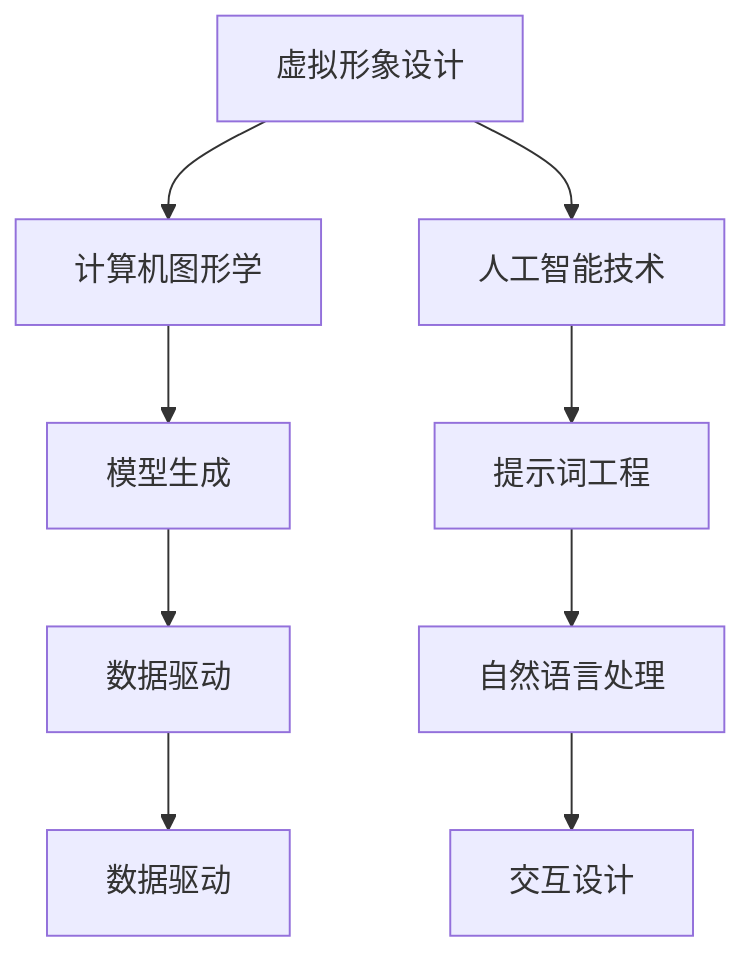

                 

### 引言

#### 书籍背景

随着人工智能技术的快速发展，虚拟形象设计逐渐成为了一个备受关注的领域。虚拟形象不仅可以为用户提供更加生动、直观的交互体验，还可以在娱乐、教育、医疗等多个领域发挥重要作用。而提示词工程，作为一种新兴的人工智能技术，在虚拟形象设计中展现出极大的潜力。本书旨在深入探讨提示词工程在虚拟形象设计中的应用，旨在为读者提供一本全面、系统的参考书籍。

#### 目标读者

本书的目标读者主要包括以下几类：

1. **人工智能研究人员**：希望通过本书深入了解提示词工程在虚拟形象设计中的应用，以及相关技术原理和算法实现。
2. **软件开发工程师**：从事虚拟形象设计、人工智能开发等相关工作的工程师，希望通过本书掌握提示词工程的应用实践。
3. **设计师**：关注虚拟形象设计领域的专业设计师，希望通过本书了解如何利用提示词工程提升设计效果。

#### 内容安排

本书内容安排如下：

1. **引言**：介绍书籍背景、目标读者、内容安排等。
2. **基础概念**：介绍虚拟形象设计和提示词工程的基本概念。
3. **技术原理**：详细讲解提示词工程的算法原理、数学模型等。
4. **应用实践**：通过具体案例展示提示词工程在虚拟形象设计中的应用。
5. **拓展领域**：探讨提示词工程在其他领域的应用前景。
6. **总结与展望**：总结全书内容，展望未来发展趋势。

通过以上内容安排，本书旨在帮助读者全面了解提示词工程在虚拟形象设计中的应用，并提供实用的技术指导和实践案例。

### 基础概念

#### 虚拟形象设计

虚拟形象设计是指通过计算机图形学、人工智能等技术手段，创建出具有个性、形象、动作等特点的虚拟角色或场景。虚拟形象设计可以分为以下几个层次：

1. **造型设计**：确定虚拟角色的外观、造型，包括面部特征、身体比例、服饰等。
2. **动作设计**：设计虚拟角色的动作，包括行走、跑步、跳跃等基本动作，以及特定场景下的动作，如舞蹈、打斗等。
3. **表情设计**：设计虚拟角色的表情，包括喜怒哀乐等基本表情，以及特定情感的表情，如惊喜、愤怒、失落等。
4. **交互设计**：设计虚拟角色与用户的交互方式，包括语音交互、手势交互、文字交互等。

虚拟形象设计的应用领域广泛，包括但不限于以下：

1. **娱乐行业**：虚拟偶像、虚拟主播、虚拟角色扮演等。
2. **教育行业**：虚拟教师、虚拟课堂、虚拟实验等。
3. **医疗行业**：虚拟护士、虚拟医生、虚拟患者等。
4. **军事模拟**：虚拟战场、虚拟战斗等。

#### 提示词工程

提示词工程是一种基于人工智能技术的方法，旨在通过提示词来引导和优化模型的生成过程。在虚拟形象设计中，提示词工程可以用于以下几个方面：

1. **造型设计提示词**：通过提示词来指导虚拟角色的外观设计，如“可爱的猫娘”、“冷酷的机械战警”等。
2. **动作设计提示词**：通过提示词来指导虚拟角色的动作设计，如“欢快地跳舞”、“激烈地战斗”等。
3. **表情设计提示词**：通过提示词来指导虚拟角色的表情设计，如“微笑”、“生气”等。
4. **交互设计提示词**：通过提示词来指导虚拟角色与用户的交互设计，如“热情回答问题”、“礼貌地拒绝请求”等。

提示词工程的核心在于如何通过有效的提示词来引导模型生成出符合期望的虚拟形象。这涉及到多个方面的技术，包括自然语言处理、生成对抗网络（GAN）、自回归模型等。

#### 核心概念与联系

虚拟形象设计与提示词工程之间的核心联系在于它们都是基于人工智能技术，通过数据驱动的生成过程来创造出具有特定特点和功能的虚拟形象。具体来说：

1. **数据驱动**：虚拟形象设计和提示词工程都依赖于大量数据来训练和优化模型，从而生成出高质量的虚拟形象。
2. **模型生成**：虚拟形象设计通过计算机图形学和人工智能技术来生成虚拟角色，而提示词工程通过自然语言处理等技术来引导模型的生成过程。
3. **交互设计**：虚拟形象设计关注虚拟角色与用户的交互设计，而提示词工程通过交互设计提示词来指导虚拟角色的行为。

为了更好地理解这两个概念之间的关系，我们可以使用Mermaid流程图来展示它们的核心架构。



通过这个流程图，我们可以清晰地看到虚拟形象设计与提示词工程之间的核心联系和相互作用。

### 技术原理

#### 提示词工程算法

提示词工程的关键在于如何通过提示词来引导模型的生成过程。以下是几种常用的提示词工程算法：

1. **生成对抗网络（GAN）**

GAN是一种由生成器和判别器组成的框架，通过对抗训练来生成高质量的图像。在虚拟形象设计中，GAN可以用于生成虚拟角色的外观、动作和表情。

**伪代码：**

```python
# 生成器G的伪代码
def G(z):
    # 输入随机噪声z，输出虚拟角色外观
    x_gan = ...
    return x_gan

# 判别器D的伪代码
def D(x):
    # 输入虚拟角色外观，输出真假概率
    prob = ...
    return prob

# GAN的训练过程
for epoch in range(num_epochs):
    for z in random_z:
        x_gan = G(z)
        prob_fake = D(x_gan)
        prob_real = D(x_real)
        # 计算损失函数，更新G和D的参数
        loss_G, loss_D = ...
```

2. **自回归模型**

自回归模型是一种基于序列预测的生成模型，通过前一个时刻的输出来预测下一个时刻的输出。在虚拟形象设计中，自回归模型可以用于生成虚拟角色的动作序列。

**伪代码：**

```python
# 自回归模型的伪代码
def auto_regressive_model(x_t, h_t):
    # 输入当前时刻的输入和隐藏状态，输出下一个时刻的输出和新的隐藏状态
    x_tilde = ...
    h_t_new = ...
    return x_tilde, h_t_new

# 训练自回归模型
for epoch in range(num_epochs):
    for x_t in sequence:
        h_t = ...
        x_tilde, h_t_new = auto_regressive_model(x_t, h_t)
        # 计算损失函数，更新模型参数
        loss = ...
```

3. **注意力机制**

注意力机制是一种用于模型聚焦于重要信息的机制。在虚拟形象设计中，注意力机制可以用于捕捉虚拟角色的重要特征，如面部表情、身体动作等。

**伪代码：**

```python
# 注意力机制的伪代码
def attention机制(x, h):
    # 输入输入特征和隐藏状态，输出加权特征
    attention_weights = ...
    x_weighted = ...
    return x_weighted

# 训练注意力模型
for epoch in range(num_epochs):
    for x, h in data:
        x_weighted = attention机制(x, h)
        # 计算损失函数，更新模型参数
        loss = ...
```

#### 数学模型

提示词工程的数学模型主要包括概率论与统计模型和机器学习模型。

1. **概率论与统计模型**

- **贝叶斯网络**：用于表示虚拟形象设计中的不确定性关系，如角色的行为和情绪之间的依赖关系。

  $$P(A|B) = \frac{P(B|A)P(A)}{P(B)}$$

- **马尔可夫模型**：用于描述虚拟角色的状态转移，如角色的情绪状态从高兴转移到悲伤的概率。

  $$P(X_{t+1} = x_{t+1}|X_{t} = x_{t}) = P(X_{t+1} = x_{t+1})$$

2. **机器学习模型**

- **支持向量机（SVM）**：用于分类虚拟角色的特征，如将虚拟角色分为可爱和冷酷两类。

  $$\max_{\beta, \beta_0} W^{T}W - C\sum_{i=1}^{n}\xi_i$$

- **决策树**：用于根据虚拟角色的特征进行分类或回归，如根据角色的外观和动作预测其情绪。

  $$y = g(\beta_0 + \sum_{i=1}^{m}\beta_i x_i)$$

- **随机森林**：通过构建多个决策树进行集成学习，提高预测的准确性。

  $$y = \sum_{i=1}^{n}f_i(x)$$

#### 详细讲解与举例说明

1. **生成对抗网络（GAN）**

GAN的核心是生成器和判别器。生成器G通过随机噪声z生成虚拟角色外观x\_gan，而判别器D则通过比较真实数据和生成数据来判断数据的真假。

**例子：**

假设我们有一个由100个像素组成的虚拟角色图像，使用GAN来生成一个具有可爱外观的猫娘。

- **生成器G**：输入随机噪声z，输出猫娘图像x\_gan。

  ```python
  # 生成器G的伪代码
  def G(z):
      # 输入随机噪声z，输出猫娘图像
      x_gan = ...
      return x_gan
  ```

- **判别器D**：输入虚拟角色图像x，输出真假概率。

  ```python
  # 判别器D的伪代码
  def D(x):
      # 输入虚拟角色图像，输出真假概率
      prob = ...
      return prob
  ```

- **GAN的训练过程**：通过对抗训练来优化生成器和判别器的参数。

  ```python
  # GAN的训练过程
  for epoch in range(num_epochs):
      for z in random_z:
          x_gan = G(z)
          prob_fake = D(x_gan)
          prob_real = D(x_real)
          # 计算损失函数，更新G和D的参数
          loss_G, loss_D = ...
  ```

2. **自回归模型**

自回归模型通过前一个时刻的输出来预测下一个时刻的输出，从而生成虚拟角色的动作序列。

**例子：**

假设我们有一个由10个时间步组成的虚拟角色动作序列，使用自回归模型来生成一个欢快地跳舞的动作序列。

- **自回归模型**：输入当前时刻的输入和隐藏状态，输出下一个时刻的输出和新的隐藏状态。

  ```python
  # 自回归模型的伪代码
  def auto_regressive_model(x_t, h_t):
      # 输入当前时刻的输入和隐藏状态，输出下一个时刻的输出和新的隐藏状态
      x_tilde, h_t_new = ...
      return x_tilde, h_t_new
  ```

- **训练自回归模型**：通过训练过程来优化模型参数。

  ```python
  # 训练自回归模型
  for epoch in range(num_epochs):
      for x_t in sequence:
          h_t = ...
          x_tilde, h_t_new = auto_regressive_model(x_t, h_t)
          # 计算损失函数，更新模型参数
          loss = ...
  ```

3. **注意力机制**

注意力机制用于捕捉虚拟角色的重要特征，如面部表情、身体动作等。

**例子：**

假设我们有一个由50个像素组成的虚拟角色图像，使用注意力机制来突出猫娘的可爱特征。

- **注意力机制**：输入输入特征和隐藏状态，输出加权特征。

  ```python
  # 注意力机制的伪代码
  def attention机制(x, h):
      # 输入输入特征和隐藏状态，输出加权特征
      attention_weights = ...
      x_weighted = ...
      return x_weighted
  ```

- **训练注意力模型**：通过训练过程来优化模型参数。

  ```python
  # 训练注意力模型
  for epoch in range(num_epochs):
      for x, h in data:
          x_weighted = attention机制(x, h)
          # 计算损失函数，更新模型参数
          loss = ...
  ```

通过以上详细讲解与举例说明，我们可以更好地理解提示词工程的技术原理和算法实现。

### 应用实践

#### 虚拟形象设计的应用案例

虚拟形象设计在多个领域都有广泛应用，以下是几个典型的应用案例：

1. **社交媒体虚拟形象**

社交媒体平台上的虚拟形象通常用于用户个人主页的装饰，增强用户在社交网络中的存在感。通过提示词工程，可以生成符合用户个性的虚拟形象，如图像、视频、动画等。

**案例：** 在某社交媒体平台上，用户可以根据自己的兴趣爱好，输入相关的提示词（如“二次元少女”、“运动达人”等），系统会自动生成一个符合提示词的虚拟形象。

- **开发环境搭建**：使用Python和TensorFlow等工具，搭建一个基于GAN的虚拟形象生成系统。

- **源代码详细实现**：编写GAN模型，训练生成器和判别器，生成虚拟形象。

- **代码解读与分析**：分析GAN模型的训练过程，优化模型参数，提高生成效果。

- **实际案例分析和详细讲解剖析**：通过具体案例展示如何生成符合用户个性的虚拟形象。

2. **虚拟现实与增强现实**

虚拟现实（VR）和增强现实（AR）技术为虚拟形象设计提供了广阔的应用场景。虚拟角色可以在虚拟环境中与用户进行互动，提供更加沉浸式的体验。

**案例：** 在某AR游戏中，用户可以通过摄像头捕捉自己的面部表情，系统会根据用户的表情生成对应的虚拟角色，并在虚拟环境中与用户互动。

- **开发环境搭建**：使用Unity和ARKit等工具，搭建一个基于AR技术的虚拟形象互动系统。

- **源代码详细实现**：编写虚拟角色的动作控制和面部表情识别代码，实现虚拟角色的互动。

- **代码解读与分析**：分析虚拟角色的动作控制和面部表情识别算法，优化互动效果。

- **实际案例分析和详细讲解剖析**：通过具体案例展示如何在虚拟现实中实现虚拟形象与用户的互动。

#### 提示词工程的实战案例

提示词工程在虚拟形象设计中的应用不仅限于生成虚拟形象，还可以用于优化虚拟角色的行为和交互。

1. **情感分析**

通过情感分析技术，可以识别用户的情绪状态，并根据情绪状态生成对应的虚拟角色行为。

**案例：** 在某情感分析系统中，用户输入一段文字描述自己的情绪（如“我很开心”），系统会根据情绪分析结果生成一个开心的虚拟角色，并在交互中保持开心的表情。

- **开发环境搭建**：使用Python和NLTK等工具，搭建一个情感分析系统。

- **源代码详细实现**：编写情感分析算法，识别用户的情绪状态。

- **代码解读与分析**：分析情感分析算法，优化情绪识别准确性。

- **实际案例分析和详细讲解剖析**：通过具体案例展示如何根据用户情绪生成对应的虚拟角色行为。

2. **自动写作**

通过自动写作技术，可以生成与虚拟角色互动的对话内容，提供更加自然的交互体验。

**案例：** 在某虚拟角色互动系统中，用户与虚拟角色进行对话，系统会根据对话内容自动生成回答，保持对话的自然流畅。

- **开发环境搭建**：使用Python和NLTK等工具，搭建一个自动写作系统。

- **源代码详细实现**：编写自动写作算法，生成虚拟角色回答。

- **代码解读与分析**：分析自动写作算法，优化对话生成效果。

- **实际案例分析和详细讲解剖析**：通过具体案例展示如何通过自动写作实现虚拟角色与用户的自然交互。

通过以上实战案例，我们可以看到提示词工程在虚拟形象设计中的应用，不仅提高了生成效率和交互质量，还为虚拟形象设计带来了更多可能性。

### 拓展领域

#### 提示词工程在其他领域的应用

提示词工程不仅可以在虚拟形象设计领域发挥作用，还可以拓展到其他多个领域，带来新的应用前景。

1. **健康医疗**

在健康医疗领域，提示词工程可以用于生成个性化的健康建议、患者护理方案等。

**案例：** 医疗机构可以使用提示词工程来生成针对特定患者的健康建议，如饮食计划、运动建议等。通过分析患者的病史、生活习惯等数据，系统可以生成符合患者需求的健康建议。

- **开发环境搭建**：使用Python和TensorFlow等工具，搭建一个健康建议生成系统。

- **源代码详细实现**：编写提示词工程算法，生成个性化健康建议。

- **代码解读与分析**：分析提示词工程算法，优化健康建议的准确性和实用性。

- **实际案例分析和详细讲解剖析**：通过具体案例展示如何利用提示词工程生成个性化健康建议。

2. **教育培训**

在教育培训领域，提示词工程可以用于生成个性化的学习计划、教育内容等，提高教学效果。

**案例：** 教育机构可以使用提示词工程来根据学生的兴趣、学习能力等生成个性化的学习计划，如学习路径、课程推荐等。

- **开发环境搭建**：使用Python和TensorFlow等工具，搭建一个教育内容生成系统。

- **源代码详细实现**：编写提示词工程算法，生成个性化学习计划。

- **代码解读与分析**：分析提示词工程算法，优化学习计划的科学性和可行性。

- **实际案例分析和详细讲解剖析**：通过具体案例展示如何利用提示词工程生成个性化学习计划。

3. **市场营销**

在市场营销领域，提示词工程可以用于生成个性化的广告内容、推广策略等，提高营销效果。

**案例：** 市场营销团队可以使用提示词工程来根据消费者的购买历史、兴趣爱好等生成个性化的广告内容，提高广告的吸引力和转化率。

- **开发环境搭建**：使用Python和TensorFlow等工具，搭建一个广告内容生成系统。

- **源代码详细实现**：编写提示词工程算法，生成个性化广告内容。

- **代码解读与分析**：分析提示词工程算法，优化广告内容的吸引力和效果。

- **实际案例分析和详细讲解剖析**：通过具体案例展示如何利用提示词工程生成个性化广告内容。

通过以上案例，我们可以看到提示词工程在健康医疗、教育培训、市场营销等领域的广泛应用，为各领域的发展带来了新的机遇。

### 总结与展望

#### 全书总结

本书系统地介绍了提示词工程在虚拟形象设计中的应用，涵盖了基础概念、技术原理、应用实践和拓展领域等多个方面。通过详细的讲解和实战案例，读者可以全面了解提示词工程在虚拟形象设计中的关键作用，以及如何利用这一技术提升虚拟形象设计的质量和效率。

#### 未来发展趋势

随着人工智能技术的不断进步，提示词工程在虚拟形象设计中的应用前景将更加广阔。以下是几个未来发展趋势：

1. **更高质量的虚拟形象生成**：随着生成对抗网络、自回归模型等技术的不断发展，虚拟形象生成的质量将得到显著提升，生成效果将更加接近真实。
2. **更丰富的交互体验**：通过引入自然语言处理、情感分析等技术，虚拟形象与用户的交互体验将更加自然、多样，满足用户个性化需求。
3. **跨领域应用**：提示词工程将在更多领域发挥作用，如健康医疗、教育培训、市场营销等，为各领域的发展提供新的思路和解决方案。
4. **开源社区和商业化**：随着提示词工程技术的成熟，开源社区和商业化应用将更加活跃，推动技术的普及和应用。

#### 研究方向与挑战

在提示词工程的研究和应用中，仍存在一些挑战和方向：

1. **数据质量和多样性**：高质量、多样化的训练数据是提升提示词工程效果的关键，未来研究需要关注如何获取和利用更丰富的数据资源。
2. **计算效率和资源优化**：提示词工程通常需要大量的计算资源和时间，未来研究需要关注如何优化计算效率和资源利用率。
3. **隐私保护与安全性**：在应用提示词工程时，需要关注数据隐私保护和系统安全性，确保用户数据的安全和隐私。
4. **模型可解释性**：提高模型的可解释性，帮助用户理解模型的工作原理和决策过程，是未来研究的重要方向。

通过持续的研究和探索，提示词工程将在虚拟形象设计和其他领域中发挥更大的作用，为人工智能技术的发展和应用提供新的动力。

### 附录

#### 最佳实践 Tips

1. **数据准备**：确保训练数据的质量和多样性，以提高模型的效果和泛化能力。
2. **超参数调优**：合理设置生成器和判别器的超参数，通过交叉验证等方法找到最优参数组合。
3. **模型解释**：利用可视化工具和分析方法，帮助用户理解模型的工作原理和决策过程。
4. **隐私保护**：在数据处理和应用中，注意保护用户隐私，遵守相关法律法规。

#### 小结

本书系统地介绍了提示词工程在虚拟形象设计中的应用，从基础概念、技术原理到应用实践，再到拓展领域，为读者提供了全面、系统的参考。通过详细讲解和实战案例，读者可以深入理解提示词工程的技术原理和应用方法，为实际项目开发提供指导。

#### 注意事项

1. **环境搭建**：在搭建开发环境时，确保所需的软件和库安装正确，以避免后续开发中的问题。
2. **代码实现**：在编写代码时，遵循良好的编程习惯，确保代码的可读性和可维护性。
3. **数据安全**：在处理用户数据时，注意数据安全和隐私保护，遵守相关法律法规。

#### 拓展阅读

1. **《生成对抗网络》（GAN）入门指南**：深入理解生成对抗网络的基本原理和应用方法。
2. **《自然语言处理》（NLP）实战**：掌握自然语言处理技术在虚拟形象设计中的应用。
3. **《虚拟现实与增强现实》（VR/AR）技术与应用**：了解虚拟现实和增强现实技术的发展趋势和应用案例。

### 作者信息

**作者：** AI天才研究院/AI Genius Institute & 禅与计算机程序设计艺术 /Zen And The Art of Computer Programming

