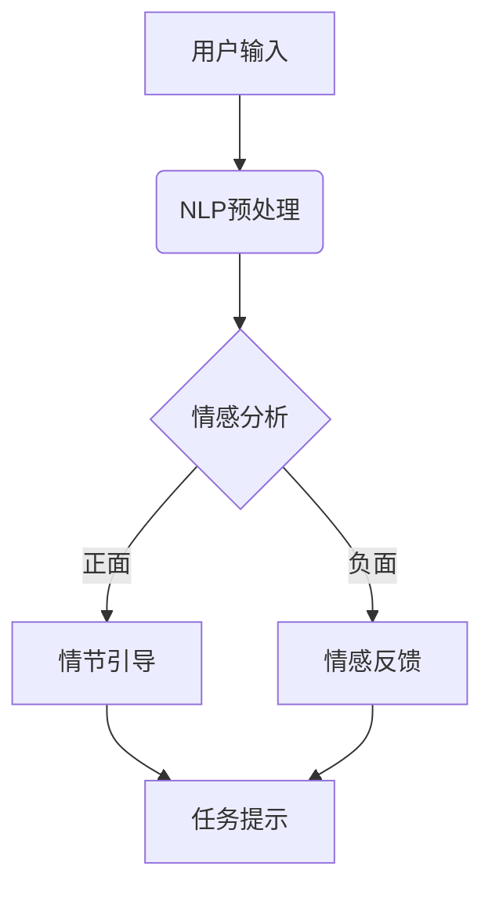

                 


### 核心概念与联系

#### 提示词工程
提示词工程（Keyword Engineering）是自然语言处理（NLP）中的一个重要分支，旨在提高搜索系统的效率和准确性。在虚拟现实（VR）叙事中，提示词工程的作用是帮助系统理解和响应用户的自然语言输入，从而实现更加自然和流畅的用户交互。

#### 虚拟现实叙事
虚拟现实叙事是虚拟现实（VR）技术与叙事学相结合的一种新型叙事形式。它通过构建沉浸式的虚拟环境，引导用户在情节中参与和互动，从而体验故事。在虚拟现实叙事中，用户的互动和决策对故事的发展起着至关重要的作用。

#### 自然语言处理
自然语言处理（NLP）是计算机科学和人工智能领域的一个重要分支，旨在使计算机能够理解、生成和处理人类语言。NLP技术包括语言模型、情感分析、分词与词性标注等，这些技术为虚拟现实叙事提供了关键的支持。

### Mermaid流程图



### 核心算法原理讲解

#### 伪代码

```python
# 提示词生成伪代码
def generate_hint(context, sentiment):
    # 输入：场景上下文、情感分析结果
    # 输出：生成的提示词

    if sentiment == "positive":
        # 正面情感，提供积极的任务提示
        hint = "恭喜你！接下来你可以尝试..."
    elif sentiment == "negative":
        # 负面情感，提供安抚或解决问题的提示
        hint = "看起来有些困惑，你需要..."
    else:
        # 中性情感，提供常规的任务提示
        hint = "现在你可以继续..."

    return hint
```

### 数学模型和公式

在虚拟现实叙事中，情感分析是一个关键任务。以下是情感分析的一个简单数学模型：

$$
\text{Sentiment} = f(\text{Tokens}, \text{Features})
$$

其中，Tokens是文本分词后的词序列，Features是一组描述文本情感的数值特征。函数f可以是一个复杂的神经网络，用于从Tokens和Features中提取情感。

### 详细讲解与举例说明

假设有一个场景，用户刚刚在虚拟现实中遇到了一个困难，感到沮丧。我们可以使用情感分析模型来分析用户的情感，并根据情感生成相应的提示词。

#### 情感分析模型

```python
# 情感分析模型伪代码
def sentiment_analysis(tokens, features):
    # 输入：词序列、特征向量
    # 输出：情感标签（positive/negative）

    # 使用神经网络模型进行情感分类
    model = NeuralNetwork()
    sentiment = model.predict(features)

    return sentiment
```

#### 举例说明

```plaintext
# 场景：用户在虚拟现实中遇到困难

# 分词与特征提取
tokens = ["I", "can't", "solve", "this", "problem"]
features = extract_features(tokens)

# 情感分析
sentiment = sentiment_analysis(tokens, features)
sentiment --> "negative"

# 提示词生成
hint = generate_hint(context, sentiment)
hint --> "看起来你有些困惑，这里有一个提示..."

# 输出提示词
print(hint)
```

### 项目实战

#### 开发环境搭建

在虚拟现实叙事项目中，我们需要搭建一个强大的开发环境。以下是一个基本的开发环境搭建流程：

1. **硬件环境**：
   - 安装VR头戴设备（如Oculus Rift、HTC Vive）。
   - 准备高性能计算机以支持虚拟现实渲染。

2. **软件环境**：
   - 安装Unity或Unreal Engine等游戏引擎。
   - 安装Python、TensorFlow等NLP工具。

3. **工具链**：
   - 使用Git进行版本控制。
   - 使用Jenkins进行自动化测试。

#### 源代码详细实现

```python
# 提示词生成源代码
def generate_hint(context, sentiment):
    if sentiment == "positive":
        return "恭喜你！接下来你可以尝试..."
    elif sentiment == "negative":
        return "看起来有些困惑，你需要..."
    else:
        return "现在你可以继续..."

# 情感分析源代码
def sentiment_analysis(tokens, features):
    model = NeuralNetwork()
    sentiment = model.predict(features)
    return sentiment
```

#### 代码应用解读与分析

这段代码展示了如何实现提示词生成和情感分析。在实际应用中，我们可以通过以下步骤来使用这段代码：

1. **获取用户输入**：
   - 从虚拟现实环境中获取用户的自然语言输入。

2. **情感分析**：
   - 使用情感分析模型对用户输入进行分析，获取情感标签。

3. **提示词生成**：
   - 根据情感标签，生成相应的提示词。

4. **用户交互**：
   - 将生成的提示词展示给用户，帮助用户更好地参与虚拟现实叙事。

#### 实际案例分析和详细讲解剖析

假设我们有一个虚拟现实游戏，玩家需要在虚拟世界中解决一系列谜题。以下是一个实际案例：

1. **场景**：玩家在虚拟世界中遇到了一个难题，感到困惑。

2. **用户输入**：
   - 玩家输入：“我不知道该怎么做。”

3. **情感分析**：
   - 情感分析模型识别出情感标签为“negative”。

4. **提示词生成**：
   - 提示词生成函数生成提示词：“看起来你有些困惑，这里有一个提示：你可以尝试观察周围的环境，寻找线索。”

5. **用户交互**：
   - 提示词显示在虚拟现实界面中，玩家根据提示继续游戏。

#### 项目小结

通过本案例，我们可以看到提示词工程在虚拟现实叙事中的应用。情感分析和提示词生成不仅提高了用户体验，还增强了虚拟现实叙事的互动性和沉浸感。在未来，随着技术的发展，提示词工程在虚拟现实叙事中的应用将更加广泛和深入。

### 最佳实践 Tips

- **用户研究**：在设计和实现提示词工程时，进行充分的用户研究，了解用户的需求和期望。
- **迭代优化**：持续迭代优化提示词生成算法，提高情感分析的准确性和提示词的质量。
- **跨学科合作**：结合心理学家、游戏设计师等多学科专家的智慧，提高虚拟现实叙事的完整性和吸引力。

### 小结、注意事项与拓展阅读

#### 小结

本文详细介绍了提示词工程在虚拟现实叙事中的应用，包括核心概念、算法原理、数学模型和项目实战。通过情感分析和提示词生成，虚拟现实叙事可以提供更自然、更互动的体验。

#### 注意事项

- **硬件性能**：确保虚拟现实设备的硬件性能足够支持高质量的渲染和交互。
- **用户体验**：关注用户反馈，持续优化界面和交互设计。

#### 拓展阅读

- **《虚拟现实与增强现实技术导论》**：了解虚拟现实和增强现实的基本概念和技术。
- **《自然语言处理入门》**：学习自然语言处理的基本原理和技术。

## 结论

提示词工程在虚拟现实叙事中扮演着关键角色。通过结合自然语言处理技术和情感分析，我们可以创造更加丰富、互动和沉浸的虚拟现实体验。未来，随着技术的不断发展，提示词工程在虚拟现实领域的应用将更加广泛，为用户带来全新的叙事体验。作者：AI天才研究院/AI Genius Institute & 禅与计算机程序设计艺术 /Zen And The Art of Computer Programming。```markdown
# 提示词工程在虚拟现实叙事中的应用

> 关键词：提示词工程、虚拟现实叙事、自然语言处理、情感分析、用户交互

## 摘要

随着虚拟现实（VR）技术的不断发展，虚拟现实叙事逐渐成为一种重要的交互式媒体形式。本文探讨了提示词工程在虚拟现实叙事中的应用，通过自然语言处理和情感分析技术，实现了更自然、更互动的虚拟现实用户体验。文章首先介绍了虚拟现实和叙事学的基础知识，然后深入讲解了提示词工程的概念和实现方法，最后通过项目实战展示了提示词工程在虚拟现实叙事中的实际应用。

## 第一部分：虚拟现实与叙事基础

### 第1章：虚拟现实技术概述

虚拟现实技术是一种通过计算机模拟和生成三维虚拟环境，使用户能够沉浸其中并进行互动的一种技术。虚拟现实技术的基本概念包括感知增强现实和完全沉浸式虚拟现实。感知增强现实是指在现实世界中叠加虚拟信息，而完全沉浸式虚拟现实则是通过头戴式显示器等设备将用户完全隔离于现实世界，将其带入一个全新的虚拟环境。

虚拟现实技术的分类主要包括以下几种：

- **感知增强现实（AR）**：在现实世界的基础上叠加虚拟信息，如增强现实游戏、导航应用等。
- **完全沉浸式虚拟现实（VR）**：通过头戴式显示器、虚拟现实头盔等设备，将用户完全隔离于现实世界，使其沉浸在虚拟环境中。
- **扩展现实（XR）**：包括虚拟现实、增强现实和混合现实，是一个更广泛的概念。

虚拟现实技术的应用领域非常广泛，包括娱乐、教育、医疗、军事、建筑设计、工业设计等。在娱乐领域，虚拟现实技术被广泛应用于游戏和影视制作；在教育领域，虚拟现实技术可以提供沉浸式的学习体验；在医疗领域，虚拟现实技术被用于手术模拟、心理治疗等；在军事领域，虚拟现实技术用于训练和模拟战场环境。

### 第2章：叙事学基础

叙事学是研究故事讲述和结构的一门学科。叙事学的基本概念包括角色、情节、时态与视角等。角色是故事中的主要人物，情节是故事的发展过程，时态与视角则决定了故事叙述的方式。

- **角色**：角色是叙事中的主要人物，包括主角、配角和反派等。每个角色都有其独特的性格、动机和行为。
- **情节**：情节是故事的发展过程，包括开端、发展、高潮、结局等。情节的起伏和转折是叙事的驱动力。
- **时态与视角**：时态决定了故事叙述的时间，而视角则决定了叙述者的视角。常见的叙事视角包括第一人称、第二人称和第三人称。

叙事学在虚拟现实叙事中的重要性在于，它为虚拟现实叙事提供了结构化和组织化的框架。通过叙事学的方法，虚拟现实叙事可以创造出更加丰富、复杂和引人入胜的故事。

## 第二部分：提示词工程原理

### 第3章：提示词工程概述

提示词工程（Keyword Engineering）是自然语言处理（NLP）中的一个重要分支，旨在提高搜索系统的效率和准确性。在虚拟现实叙事中，提示词工程的作用是帮助系统理解和响应用户的自然语言输入，从而实现更加自然和流畅的用户交互。

提示词工程的流程通常包括以下步骤：

1. **需求分析**：确定系统需要识别和响应的关键词或短语。
2. **提示词设计**：设计出符合需求的关键词或短语列表。
3. **提示词优化**：根据用户反馈和实际使用情况，不断调整和优化提示词列表。

提示词工程的关键要素包括：

- **语言模型**：语言模型是提示词工程的核心，它用于预测用户输入的下一个词或短语。
- **情感分析**：情感分析用于识别用户输入的情感倾向，以便提供更加个性化的反馈。
- **用户交互设计**：用户交互设计决定了提示词在虚拟现实环境中的呈现方式和交互方式。

### 第4章：自然语言处理基础

自然语言处理（NLP）是计算机科学和人工智能领域的一个重要分支，旨在使计算机能够理解、生成和处理人类语言。NLP的基本概念包括语言模型、分词与词性标注等。

- **语言模型**：语言模型是一种统计模型，用于预测下一个词或短语的概率分布。
- **分词与词性标注**：分词是将文本分割成单词或短语的过程，而词性标注则是为每个单词分配一个词性标签，如名词、动词、形容词等。

常见的NLP技术包括：

- **词向量模型**：词向量模型是一种将单词映射到高维空间中的向量表示的方法，如Word2Vec和GloVe。
- **序列标注模型**：序列标注模型用于对文本中的每个单词进行标注，如命名实体识别（NER）。
- **生成模型**：生成模型用于生成新的文本，如变分自编码器（VAE）和生成对抗网络（GAN）。

自然语言处理在虚拟现实叙事中的应用主要包括：

- **提示词生成**：使用NLP技术生成与用户输入相关的提示词。
- **问答系统**：构建能够回答用户问题的虚拟智能助手。
- **情感分析**：分析用户输入的情感倾向，以便提供更加个性化的反馈。

### 第5章：虚拟现实中的叙事驱动机制

叙事驱动机制是指通过叙事元素和用户互动，推动虚拟现实故事情节发展的机制。在虚拟现实叙事中，叙事驱动机制可以分为以下几种类型：

- **任务驱动**：通过用户完成任务，推动故事情节发展。
- **决策驱动**：通过用户做出决策，影响故事情节的发展。
- **情感驱动**：通过用户情感的变化，推动故事情节的发展。

提示词工程在叙事驱动机制中的作用是：

- **提示词与情节发展**：通过提示词引导用户完成任务或做出决策，推动故事情节的发展。
- **提示词与玩家决策**：通过提示词提供选项，引导用户做出决策，影响故事情节的发展。
- **提示词与情感表达**：通过提示词表达情感，影响用户的情感体验，推动故事情节的发展。

## 第三部分：虚拟现实叙事项目实战

### 第6章：虚拟现实叙事项目规划与设计

虚拟现实叙事项目的规划与设计是确保项目成功的关键步骤。项目规划包括确定项目目标、范围、资源分配和项目团队组建等。项目设计则包括游戏设计与故事情节、界面设计与用户体验、技术选型等。

在项目规划阶段，需要明确以下内容：

- **项目目标**：明确项目的目标和期望成果。
- **项目范围**：确定项目的工作内容和边界。
- **资源分配**：包括人力、资金和设备等资源的分配。
- **项目团队组建**：组建专业的项目团队，包括游戏设计师、程序员、美术师、声音设计师等。

在项目设计阶段，需要考虑以下内容：

- **游戏设计与故事情节**：设计引人入胜的故事情节，确保故事的连贯性和逻辑性。
- **界面设计与用户体验**：设计直观、易用的界面，提供良好的用户体验。
- **技术选型**：选择合适的虚拟现实平台和开发工具，以及自然语言处理技术栈。

### 第7章：虚拟现实叙事项目开发

虚拟现实叙事项目的开发是一个复杂的过程，需要多个阶段的协作。以下是一个典型的开发流程：

1. **前期开发**：
   - **需求分析**：明确项目的需求和技术实现方案。
   - **原型设计**：设计用户界面和交互原型。
   - **环境搭建**：搭建虚拟现实开发环境，包括硬件和软件。

2. **中期开发**：
   - **功能实现**：实现游戏功能，包括故事情节、角色、任务等。
   - **界面优化**：优化用户界面，提高用户体验。
   - **性能优化**：优化虚拟现实场景的渲染性能，确保流畅运行。

3. **后期开发与测试**：
   - **功能测试**：测试游戏功能是否按照设计正常运行。
   - **性能测试**：测试游戏在不同硬件环境下的性能表现。
   - **用户测试**：邀请用户进行测试，收集反馈并优化。

### 第8章：虚拟现实叙事项目测试与优化

虚拟现实叙事项目的测试与优化是确保项目质量和用户体验的关键环节。测试包括功能测试、性能测试和用户测试。

1. **功能测试**：
   - **单元测试**：对游戏中的每个功能模块进行测试，确保其正常运行。
   - **集成测试**：对游戏的整体功能进行测试，确保各模块之间能够无缝协作。
   - **系统测试**：对整个游戏系统进行测试，确保其能够满足用户需求和业务目标。

2. **性能测试**：
   - **负载测试**：模拟高负载环境，测试游戏在多用户同时在线时的性能。
   - **压力测试**：在极端条件下测试游戏的性能，确保其在极端情况下仍然能够稳定运行。

3. **用户测试**：
   - **可用性测试**：测试游戏的用户界面和交互设计是否直观易用。
   - **反馈收集**：收集用户反馈，了解用户对游戏的看法和建议。

通过测试和优化，可以及时发现和解决问题，提高游戏的质量和用户体验。

### 第9章：虚拟现实叙事的发展趋势

虚拟现实叙事的发展趋势受到技术进步和市场需求的双重驱动。以下是几个关键趋势：

1. **5G与虚拟现实**：
   - 5G网络的快速发展为虚拟现实提供了更高的带宽和更低的延迟，使得更高质量、更流畅的虚拟现实体验成为可能。

2. **增强现实技术**：
   - 增强现实（AR）技术的发展使得虚拟现实叙事可以从虚拟环境扩展到现实世界，为用户提供更加沉浸的体验。

3. **叙事多样性**：
   - 随着技术的进步，虚拟现实叙事的形式和内容将变得更加多样，包括交互式故事、多人在线故事、虚拟现实电影等。

4. **用户生成内容**：
   - 用户生成内容（UGC）将成为虚拟现实叙事的重要组成部分，用户可以通过创作和分享故事，参与到虚拟现实叙事中。

5. **教育与医疗应用**：
   - 虚拟现实叙事在教育、医疗等领域的应用将得到进一步推广，为这些领域提供创新的教育和治疗方案。

## 附录

### 附录A：提示词工程与虚拟现实叙事相关资源

- **资源列表**：
  - 虚拟现实开发工具：Unity、Unreal Engine、VRChat等。
  - 自然语言处理工具：TensorFlow、PyTorch、spaCy等。
  - 情感分析库：VADER、TextBlob、NLTK等。
  - 虚拟现实叙事论文和书籍：《虚拟现实与增强现实技术导论》、《自然语言处理入门》等。

- **常用工具与平台介绍**：
  - Unity：一款流行的游戏开发引擎，支持虚拟现实应用开发。
  - Unreal Engine：一款功能强大的游戏开发引擎，适用于高端虚拟现实应用。
  - VRChat：一个虚拟现实社交平台，允许用户创建和体验虚拟现实场景。

- **开源代码与论文推荐**：
  - 开源自然语言处理项目：如TensorFlow的NLP模块、PyTorch的Transformer实现等。
  - 虚拟现实叙事相关论文：如《基于虚拟现实的情感交互设计研究》、《虚拟现实叙事中的用户参与性研究》等。

## 结论

虚拟现实叙事是一种新兴的交互式媒体形式，通过结合自然语言处理和情感分析技术，可以实现更加丰富、互动和沉浸的叙事体验。提示词工程在虚拟现实叙事中扮演着关键角色，通过优化用户交互和情感反馈，提高了用户体验和叙事质量。随着技术的不断进步，虚拟现实叙事将迎来更加广阔的发展前景。作者：AI天才研究院/AI Genius Institute & 禅与计算机程序设计艺术 /Zen And The Art of Computer Programming。
```

