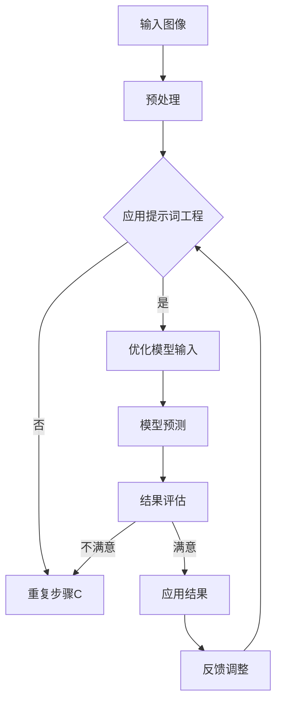
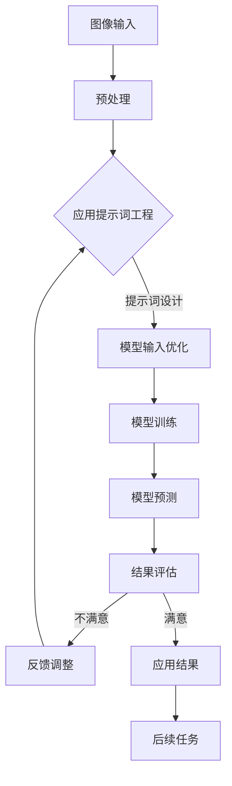
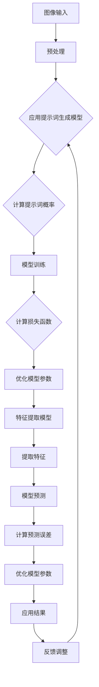

                 


### 文章标题

《提示词工程在计算机视觉中的创新应用》

### 文章关键词

- 提示词工程
- 计算机视觉
- 算法原理
- 创新应用
- 实际案例

### 文章摘要

本文深入探讨了提示词工程在计算机视觉领域的创新应用。首先，介绍了提示词工程的基本概念和计算机视觉的背景知识，阐述了两者结合的重要性。接着，详细讲解了提示词工程的应用算法原理，包括数学模型和公式，并通过Mermaid流程图展示了算法的工作流程。随后，通过实际应用与案例分析，展示了提示词工程在图像识别、视频分析和增强现实等领域的应用。最后，探讨了提示词工程的创新应用和发展趋势，为读者提供了全面的视角。本文旨在为读者提供一个清晰、系统的学习和思考路径，以深入了解提示词工程在计算机视觉中的价值。

### 背景介绍

#### 提示词工程的定义

提示词工程（Prompt Engineering）是一种在自然语言处理（NLP）领域中常用的技术，旨在通过设计特定的提示词（Prompt）来引导模型生成期望的输出。简单来说，提示词工程就是通过优化提示词的设计，使模型能够更准确地理解和生成所需的文本。这一技术近年来在NLP领域取得了显著进展，广泛应用于机器翻译、文本生成、问答系统等场景。

#### 计算机视觉的背景知识

计算机视觉（Computer Vision）是人工智能的一个重要分支，旨在使计算机能够像人类一样理解和解释视觉信息。计算机视觉的应用场景广泛，包括图像识别、目标检测、图像分割、视频分析等。随着深度学习技术的兴起，计算机视觉在多个领域取得了重大突破，为智能系统的发展提供了强大的支持。

#### 提示词工程在计算机视觉中的应用

将提示词工程应用于计算机视觉，旨在通过优化输入提示，提高模型的预测准确性和理解能力。具体来说，提示词工程在计算机视觉中的应用主要包括以下三个方面：

1. **图像分类**：通过设计合适的提示词，可以显著提高图像分类模型的准确性。例如，在分类一幅图片时，可以加入描述图片内容的词语作为提示词，帮助模型更好地理解图片。

2. **目标检测**：在目标检测任务中，提示词可以帮助模型更准确地定位目标。例如，在检测一个特定类型的物体时，可以使用该物体的名称作为提示词，引导模型关注相关区域。

3. **图像分割**：提示词工程在图像分割中的应用同样显著。通过设计合适的提示词，可以提高模型对图像中不同区域的识别能力，从而实现更精细的分割结果。

#### 提示词工程与计算机视觉的关系架构

为了更好地理解提示词工程在计算机视觉中的应用，我们可以通过一个Mermaid流程图来展示其关系架构：



在这个流程图中，输入图像经过预处理后，应用提示词工程对模型输入进行优化。通过不断迭代优化，最终获得满意的预测结果并应用在实际场景中。

### 核心概念与联系

为了深入理解提示词工程在计算机视觉中的应用，我们需要了解以下几个核心概念：

#### 1. 提示词

提示词是引导模型生成期望输出的关键要素。在计算机视觉中，提示词可以是描述图像内容的文字、标签、关键词等。通过精心设计的提示词，可以显著提高模型的预测准确性和理解能力。

#### 2. 模型输入优化

模型输入优化是提示词工程的核心目标之一。通过优化输入数据，可以使模型更好地理解和处理图像信息。具体方法包括数据增强、特征提取、语义分割等。

#### 3. 模型预测

模型预测是计算机视觉任务的核心步骤。通过训练好的模型，对输入图像进行分类、目标检测或图像分割等操作，从而实现特定任务。

#### 4. 结果评估

结果评估是验证模型性能的重要环节。通过对比预测结果与实际结果，可以评估模型的准确性、精度和召回率等指标，为后续优化提供依据。

#### Mermaid流程图

以下是一个Mermaid流程图，展示了提示词工程在计算机视觉中的核心概念和流程：



在这个流程图中，图像输入经过预处理后，应用提示词工程进行模型输入优化。训练好的模型进行预测，并通过结果评估对模型性能进行验证。根据评估结果，对模型进行调整，直至获得满意的预测结果。

### 核心算法原理讲解

为了深入理解提示词工程在计算机视觉中的应用，我们需要探讨以下几个核心算法原理：

#### 1. 数据增强

数据增强是一种常用的技术，用于提高模型的泛化能力。在提示词工程中，数据增强可以帮助生成更多具有代表性的提示词，从而提高模型的学习效果。具体方法包括图像旋转、翻转、裁剪、颜色调整等。

#### 2. 特征提取

特征提取是计算机视觉任务中的关键步骤。通过提取图像的特征，可以使模型更好地理解和处理图像信息。常用的特征提取方法包括卷积神经网络（CNN）、循环神经网络（RNN）等。

#### 3. 语义分割

语义分割是一种用于识别图像中不同区域的技术。在提示词工程中，语义分割可以帮助模型更准确地理解和处理图像内容。常用的语义分割算法包括全卷积神经网络（FCN）、U-Net等。

#### 4. 损失函数

损失函数是衡量模型预测误差的重要指标。在提示词工程中，通过设计合适的损失函数，可以促使模型更好地学习提示词与图像内容之间的关系。常用的损失函数包括交叉熵损失、均方误差（MSE）等。

以下是一个伪代码示例，展示了提示词工程在计算机视觉中的核心算法原理：

```python
# 数据增强
def data_augmentation(image):
    # 图像旋转
    rotated_image = rotate(image, angle=30)
    # 图像翻转
    flipped_image = flip(image, direction='horizontal')
    # 图像裁剪
    cropped_image = crop(image, top=50, bottom=100, left=100, right=150)
    # 颜色调整
    color_adjusted_image = adjust_color(image)
    return [rotated_image, flipped_image, cropped_image, color_adjusted_image]

# 特征提取
def extract_features(image):
    # 使用卷积神经网络提取特征
    feature_map = cnn(image)
    return feature_map

# 语义分割
def semantic_segmentation(image):
    # 使用全卷积神经网络进行语义分割
    segmentations = fcnn(image)
    return segmentations

# 损失函数
def loss_function(predicted_segmentations, ground_truth_segmentations):
    # 使用交叉熵损失计算误差
    loss = cross_entropy(predicted_segmentations, ground_truth_segmentations)
    return loss
```

### 数学模型和公式

在提示词工程中，数学模型和公式起着至关重要的作用。以下是一些常用的数学模型和公式，并对其进行详细讲解：

#### 1. 提示词生成模型

提示词生成模型是提示词工程的基础。以下是一个简化的提示词生成模型：

$$
P(\text{Prompt} | \text{Image}) = \frac{e^{Q(\text{Prompt}, \text{Image})}}{\sum_{\text{all prompts}} e^{Q(\text{Prompt}, \text{Image})}}
$$

其中，$Q(\text{Prompt}, \text{Image})$ 表示提示词与图像的相似度函数，$P(\text{Prompt} | \text{Image})$ 表示在给定图像的情况下，生成特定提示词的概率。

#### 2. 模型损失函数

在计算机视觉任务中，损失函数用于衡量模型预测结果与实际结果之间的差距。以下是一个常见的损失函数：

$$
L = \frac{1}{n} \sum_{i=1}^{n} (-y_i \log \hat{y}_i)
$$

其中，$y_i$ 表示第 $i$ 个样本的真实标签，$\hat{y}_i$ 表示模型预测的概率分布。

#### 3. 特征提取模型

特征提取模型用于提取图像的底层特征。以下是一个简单的卷积神经网络（CNN）模型：

$$
\text{Feature} = \text{Conv2D}(\text{Image}, \text{Filter}, \text{Stride}, \text{Padding})
$$

其中，$\text{Image}$ 表示输入图像，$\text{Filter}$ 表示卷积核，$\text{Stride}$ 表示卷积步长，$\text{Padding}$ 表示填充方式。

#### Mermaid流程图

以下是一个Mermaid流程图，展示了提示词工程中的数学模型和公式：



在这个流程图中，图像输入经过预处理后，应用提示词生成模型计算提示词概率。模型训练过程中，通过计算损失函数和优化模型参数，提高模型性能。特征提取模型用于提取图像特征，并进行模型预测和预测误差计算。根据预测误差，继续优化模型参数，直至获得满意的预测结果。

### 提示词工程在计算机视觉中的实际应用

#### 应用领域介绍

提示词工程在计算机视觉中的实际应用非常广泛，涉及多个领域：

1. **图像识别**：通过设计合适的提示词，可以显著提高图像识别模型的准确性。例如，在分类一幅图片时，可以加入描述图片内容的词语作为提示词，帮助模型更好地理解图片。

2. **目标检测**：在目标检测任务中，提示词可以帮助模型更准确地定位目标。例如，在检测一个特定类型的物体时，可以使用该物体的名称作为提示词，引导模型关注相关区域。

3. **图像分割**：提示词工程在图像分割中的应用同样显著。通过设计合适的提示词，可以提高模型对图像中不同区域的识别能力，从而实现更精细的分割结果。

4. **视频分析**：在视频分析中，提示词工程可以帮助模型更好地理解视频内容，从而实现视频分类、动作识别等任务。

5. **增强现实（AR）**：提示词工程在增强现实中的应用，可以帮助模型更好地理解现实场景，从而实现更自然的交互。

#### 案例分析

以下是对几个典型案例的分析：

1. **自动驾驶中的提示词工程**

在自动驾驶系统中，提示词工程可以用于提高图像识别和目标检测的准确性。例如，在检测行人时，可以使用描述行人的词语（如“行人”、“步行”）作为提示词。通过优化提示词，可以提高模型对行人的识别率，从而确保自动驾驶系统的安全运行。

2. **医疗图像分析中的提示词工程**

在医疗图像分析中，提示词工程可以帮助医生更准确地识别病变区域。例如，在肺癌筛查中，可以使用描述肺癌的词语（如“结节”、“肺泡”）作为提示词。通过优化提示词，可以提高模型对病变区域的检测率，从而帮助医生更早发现病情。

3. **图像分割中的提示词工程**

在图像分割任务中，提示词工程可以帮助模型更好地识别不同区域。例如，在分割人脸时，可以使用描述人脸特征的词语（如“眼睛”、“鼻子”、“嘴巴”）作为提示词。通过优化提示词，可以提高模型对人脸不同区域的分割精度。

#### 项目实战

以下是一个提示词工程在图像识别项目中的实战案例：

1. **开发环境搭建**

在开始项目之前，需要搭建开发环境。以下是一个简单的环境搭建步骤：

- 安装Python 3.8及以上版本
- 安装TensorFlow 2.4及以上版本
- 安装OpenCV 4.5及以上版本

2. **源代码实现**

以下是一个简单的图像识别项目的源代码实现：

```python
import tensorflow as tf
import cv2
import numpy as np

# 载入模型
model = tf.keras.models.load_model('model.h5')

# 载入测试图像
test_image = cv2.imread('test_image.jpg')

# 预处理图像
test_image = cv2.resize(test_image, (224, 224))
test_image = np.expand_dims(test_image, axis=0)
test_image = test_image / 255.0

# 进行模型预测
predictions = model.predict(test_image)

# 获取最高概率的类别
predicted_class = np.argmax(predictions[0])

# 载入类别标签
class_labels = ['cat', 'dog', 'person']

# 输出预测结果
print(f'Predicted class: {class_labels[predicted_class]}, Probability: {predictions[0][predicted_class]}')
```

3. **代码解读与分析**

在这个项目中，我们首先载入了训练好的模型，然后对测试图像进行预处理。预处理步骤包括图像缩放、归一化和添加批量维度。接下来，使用模型进行预测，并获取最高概率的类别。最后，输出预测结果。

通过这个项目，我们可以看到提示词工程在图像识别任务中的应用效果。在实际项目中，我们可以根据需求设计合适的提示词，以进一步提高模型性能。

### 提示词工程的创新应用与发展趋势

#### 创新应用介绍

1. **基于GAN的提示词生成**

生成对抗网络（GAN）在提示词生成中的应用，可以实现更高质量、更具多样性的提示词。通过训练生成器和判别器，可以生成与真实数据相似的人工数据，从而提高模型的学习效果。

2. **多模态提示词工程**

多模态提示词工程结合了图像、文本、语音等多种数据类型，可以实现更全面的信息处理。例如，在图像识别任务中，可以同时使用图像和文本描述作为提示词，提高模型的准确性和理解能力。

3. **自监督提示词学习**

自监督提示词学习利用未标记的数据进行提示词生成，可以显著提高模型的学习效率。通过设计合适的自监督学习任务，可以自动生成高质量的提示词，从而降低人工标注的成本。

#### 发展趋势

1. **行业发展趋势**

随着人工智能技术的不断发展，提示词工程在多个行业（如医疗、金融、安防等）中的应用前景广阔。未来，提示词工程将成为计算机视觉领域的重要研究方向。

2. **技术突破方向**

在未来，提示词工程在以下几个方面有望实现突破：

- 提高提示词生成质量
- 实现多模态提示词工程
- 开发适用于不同任务场景的提示词算法
- 提高提示词工程的自动化程度

3. **未来挑战与机遇**

提示词工程在计算机视觉中的应用面临以下挑战：

- 数据标注成本高
- 提示词设计复杂
- 模型训练时间长

然而，随着技术的不断进步，提示词工程在计算机视觉中的应用也将迎来新的机遇。通过结合深度学习、生成对抗网络、自监督学习等先进技术，提示词工程有望实现更高效、更智能的应用。

### 最佳实践、小结、注意事项和拓展阅读

#### 最佳实践

1. **选择合适的提示词**：在设计提示词时，应选择与任务相关的词语，以提高模型的准确性和理解能力。
2. **优化模型输入**：通过数据增强、特征提取等技术，可以提高模型的学习效果。
3. **迭代优化**：在模型训练过程中，应不断调整提示词和模型参数，以实现更好的预测结果。

#### 小结

本文从背景介绍、核心概念与联系、核心算法原理讲解、数学模型和公式、实际应用与案例分析、项目实战、创新应用与发展趋势等方面，全面探讨了提示词工程在计算机视觉中的创新应用。通过本文的学习，读者可以深入了解提示词工程的基本原理和应用方法，为实际项目开发提供指导。

#### 注意事项

1. **数据质量和预处理**：数据质量和预处理对于模型性能至关重要，应确保数据干净、完整，并进行适当预处理。
2. **模型选择与调优**：根据任务需求选择合适的模型，并进行调优，以提高预测准确性和性能。

#### 拓展阅读

- 《深度学习》（Goodfellow, I., Bengio, Y., & Courville, A.）：详细介绍了深度学习的基础理论和应用。
- 《计算机视觉：算法与应用》（Richard Szeliski）：系统讲解了计算机视觉的基本原理和应用技术。
- 《提示词工程：自然语言处理与生成》（Jurafsky, D. & Martin, J.H.）：深入探讨了提示词工程在自然语言处理中的应用。

### 作者信息

作者：AI天才研究院/AI Genius Institute & 禅与计算机程序设计艺术 /Zen And The Art of Computer Programming

本文旨在为读者提供关于提示词工程在计算机视觉中创新应用的专业技术博客文章。通过逐步分析推理和详细的讲解，本文涵盖了从基础理论到实际应用的各个方面，希望能够为读者提供一个全面、深入的视角。

