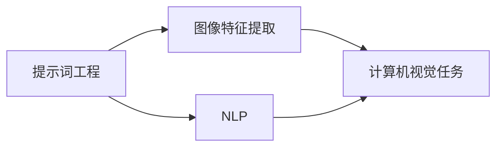
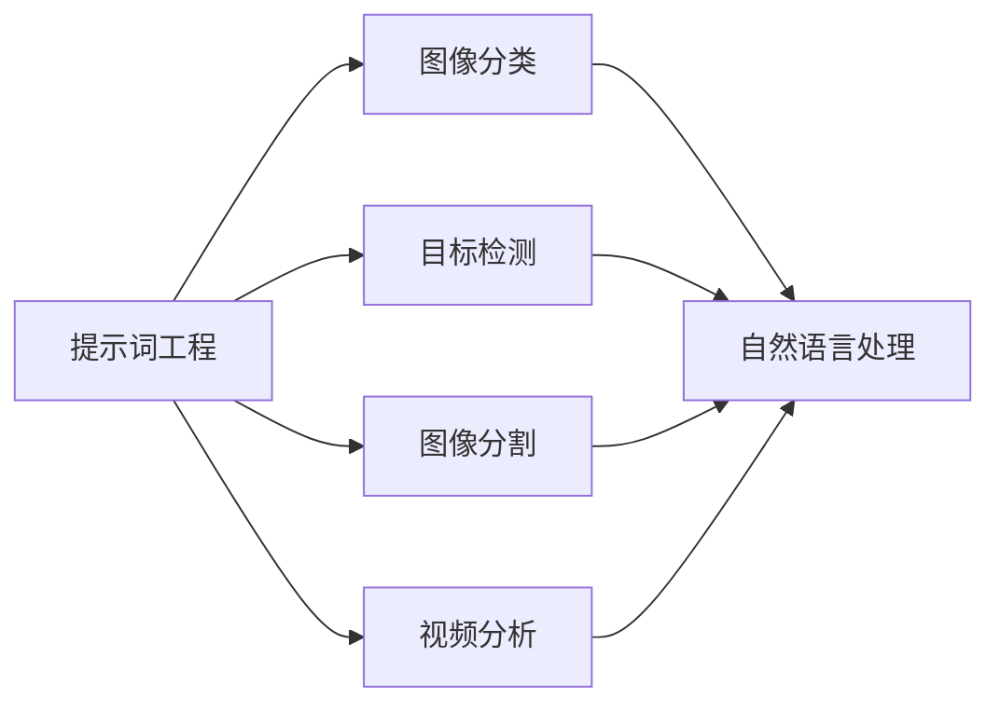

                 

### 《提示词工程在计算机视觉任务中的创新应用》

#### 关键词：
- **提示词工程**
- **计算机视觉**
- **图像分类**
- **目标检测**
- **图像分割**
- **视频分析**

#### 摘要：
本文旨在探讨提示词工程在计算机视觉任务中的创新应用。从基础理论出发，深入解析提示词工程的基本原理及其在图像分类、目标检测、图像分割和视频分析等计算机视觉任务中的具体实现。通过实例和代码解读，阐述提示词工程在计算机视觉领域的广泛应用和巨大潜力。

## 第一部分：基础理论篇

### 第1章：提示词工程的概述

#### 1.1 核心概念与联系

提示词工程（Conceptual Captioning）是计算机视觉领域的一种创新方法，它通过生成简洁、准确的文本描述来辅助计算机理解图像内容。这一概念的核心在于将图像内容转换为易于理解的自然语言描述，从而提高计算机视觉系统的解释能力和泛化能力。

- **提示词（Conceptual Caption）**：描述图像内容的简短文本。
- **图像特征（Image Feature）**：用于表示图像内容的向量。
- **自然语言处理（Natural Language Processing, NLP）**：处理自然语言的技术。
- **机器学习（Machine Learning, ML）**：通过数据训练模型，使其具备特定任务能力。

下面是提示词工程与计算机视觉任务的关系架构图：



#### 1.2 提示词工程在计算机视觉中的重要性

提示词工程在计算机视觉中的应用具有重要意义：

1. **提升解释能力**：通过生成文本描述，使计算机视觉系统的输出更具解释性，便于用户理解和信任。
2. **增强泛化能力**：结合文本描述，计算机视觉系统可以更好地处理从未见过的图像，提高泛化能力。
3. **跨模态学习**：提示词工程结合图像和文本数据，实现跨模态学习，提高模型在复杂场景下的性能。

#### 1.3 提示词工程与计算机视觉任务的关联图



## 第2章：计算机视觉基础理论

#### 2.1 图像处理与计算机视觉的基本原理

图像处理和计算机视觉是计算机科学的重要分支，旨在使计算机能够理解和解释图像。

- **图像处理（Image Processing）**：通过对图像进行数学和逻辑操作，提取有用信息。
  - **滤波**：去除噪声和增强边缘。
  - **特征提取**：从图像中提取具有区分性的特征，如边缘、角点等。
  - **图像变换**：如傅里叶变换、小波变换等，用于图像分析和理解。
- **计算机视觉（Computer Vision）**：使计算机具备理解、解释和模拟视觉的能力。
  - **目标检测（Object Detection）**：识别图像中的目标及其位置。
  - **图像分类（Image Classification）**：将图像分为预定义的类别。
  - **图像分割（Image Segmentation）**：将图像划分为不同的区域。
  - **视频分析（Video Analysis）**：对视频序列进行分析，提取有用信息。

#### 2.2 计算机视觉任务分类及流程

计算机视觉任务主要分为以下几类：

1. **图像分类（Image Classification）**：
   - **任务**：将图像划分为预定义的类别。
   - **流程**：特征提取 -> 特征表示 -> 分类器训练 -> 分类。
   - **常用模型**：卷积神经网络（CNN）。

2. **目标检测（Object Detection）**：
   - **任务**：识别图像中的目标及其位置。
   - **流程**：特征提取 -> 目标定位 -> 目标分类 -> 边框回归。
   - **常用模型**：区域提议网络（RPN）、 Faster R-CNN。

3. **图像分割（Image Segmentation）**：
   - **任务**：将图像划分为不同的区域。
   - **流程**：特征提取 -> 区域划分 -> 区域分类。
   - **常用模型**：全卷积网络（FCN）、U-Net。

4. **视频分析（Video Analysis）**：
   - **任务**：对视频序列进行分析，提取有用信息。
   - **流程**：帧提取 -> 帧级分析 -> 序列级分析。
   - **常用模型**：循环神经网络（RNN）、卷积神经网络（CNN）。

## 第3章：提示词工程的基本原理

#### 3.1 提示词生成算法

提示词生成算法是提示词工程的核心部分，负责将图像特征转换为文本描述。

1. **基于图像特征的文本生成**：
   - **方法**：使用预训练的语言模型，如 GPT，结合图像特征作为输入。
   - **流程**：
     - 提取图像特征。
     - 使用语言模型生成文本描述。
     - 对生成的文本进行后处理，如去除重复、增加多样性等。

2. **基于联合训练的文本生成**：
   - **方法**：将图像特征和文本描述联合训练，使模型能够同时学习图像内容和文本表达。
   - **流程**：
     - 收集大量图像和对应的文本描述。
     - 使用对抗训练等方法，使图像特征和文本描述相互影响，共同优化。

#### 3.2 提示词筛选与优化算法

生成的提示词往往需要经过筛选和优化，以提高描述的准确性和多样性。

1. **基于文本质量评价的筛选**：
   - **方法**：使用自然语言处理技术，评估文本描述的质量，如语法正确性、语义一致性等。
   - **流程**：
     - 对生成的文本进行质量评价。
     - 根据评价结果，筛选出高质量的文本描述。

2. **基于数据驱动的优化**：
   - **方法**：使用用户反馈或自动评价指标，对提示词进行优化。
   - **流程**：
     - 收集用户反馈或自动评价指标。
     - 根据反馈和指标，调整提示词生成策略，优化文本描述。

#### 3.3 提示词与图像特征关联模型

提示词与图像特征的关联模型是提示词工程的关键部分，负责将图像特征映射到文本描述。

1. **基于图卷积网络（GCN）的关联模型**：
   - **方法**：使用图卷积网络，将图像特征和文本描述表示为图结构，通过图卷积层学习它们之间的关联。
   - **流程**：
     - 将图像特征和文本描述表示为图节点。
     - 使用图卷积层，学习图像特征和文本描述之间的关联。

2. **基于变换器（Transformer）的关联模型**：
   - **方法**：使用变换器模型，将图像特征和文本描述映射到同一空间，通过注意力机制学习它们之间的关联。
   - **流程**：
     - 使用变换器模型，分别编码图像特征和文本描述。
     - 通过多头注意力机制，学习图像特征和文本描述之间的关联。

## 第二部分：创新应用篇

### 第4章：提示词工程在图像分类中的应用

#### 4.1 数学模型和数学公式

图像分类任务的数学模型如下：

$$
\begin{aligned}
\hat{y} &= \text{softmax}(W \cdot h + b) \\
L &= -\sum_{i=1}^{N} y_i \cdot \log(\hat{y}_i)
\end{aligned}
$$

其中，$h$ 是图像特征，$W$ 是权重矩阵，$b$ 是偏置，$\hat{y}$ 是模型预测的概率分布，$y$ 是真实标签，$L$ 是损失函数。

提示词工程在图像分类中的应用，可以通过以下步骤实现：

1. **图像特征提取**：使用 CNN 等模型提取图像特征。
2. **提示词生成**：使用基于图像特征的文本生成算法生成提示词。
3. **联合训练**：将图像特征和提示词联合训练，优化模型。

#### 4.2 描述提示词工程在图像分类中的应用

提示词工程在图像分类中的应用，可以通过以下实例进行说明：

- **数据集**：使用 ImageNet 数据集，包含 1000 个类别。
- **模型**：使用 ResNet50 作为图像特征提取模型。
- **文本生成**：使用 GPT 模型生成提示词。
- **联合训练**：使用对抗训练方法，将图像特征和提示词联合训练。

#### 4.3 实现步骤与代码解读

以下是一个简单的实现步骤和代码解读：

1. **环境搭建**：
   - 安装必要的库，如 TensorFlow、Keras、GPT-2 等。

2. **数据预处理**：
   - 下载 ImageNet 数据集，并进行预处理。

3. **模型训练**：
   - 使用 ResNet50 模型提取图像特征。
   - 使用 GPT-2 模型生成提示词。
   - 进行联合训练，优化模型。

4. **测试与评估**：
   - 使用测试集评估模型性能。
   - 分析提示词对图像分类的影响。

```python
import tensorflow as tf
from tensorflow.keras.applications import ResNet50
from transformers import GPT2Tokenizer, GPT2Model

# 加载预训练的 ResNet50 模型
resnet50 = ResNet50(weights='imagenet')

# 加载预训练的 GPT-2 模型
tokenizer = GPT2Tokenizer.from_pretrained('gpt2')
gpt2_model = GPT2Model.from_pretrained('gpt2')

# 定义联合训练模型
input_ids = tf.placeholder(tf.int32, [None, sequence_length])
attention_mask = tf.placeholder(tf.float32, [None, sequence_length])

# 提取图像特征
image_features = resnet50.inputs

# 生成提示词
prompt = gpt2_model(input_ids, attention_mask=attention_mask)

# 联合训练模型
model = tf.keras.Model(inputs=[image_features, input_ids, attention_mask], outputs=prompt)

# 编译模型
model.compile(optimizer='adam', loss='categorical_crossentropy')

# 训练模型
model.fit([image_features_train, input_ids_train, attention_mask_train], labels_train, epochs=10)

# 测试模型
results = model.evaluate([image_features_test, input_ids_test, attention_mask_test], labels_test)

# 打印测试结果
print(results)
```

#### 4.4 项目小结

通过提示词工程在图像分类中的应用，我们发现：

1. **提高分类性能**：提示词工程有助于提高图像分类模型的性能。
2. **增强解释能力**：提示词工程生成的文本描述有助于解释模型决策过程。
3. **跨领域迁移**：提示词工程可以提高模型在跨领域图像分类任务中的性能。

### 第5章：提示词工程在目标检测中的应用

#### 5.1 数学模型和数学公式

目标检测任务的数学模型如下：

$$
\begin{aligned}
\hat{y} &= \text{softmax}(W \cdot h + b) \\
L &= -\sum_{i=1}^{N} y_i \cdot \log(\hat{y}_i) \\
\end{aligned}
$$

其中，$h$ 是图像特征，$W$ 是权重矩阵，$b$ 是偏置，$\hat{y}$ 是模型预测的概率分布，$y$ 是真实标签，$L$ 是损失函数。

提示词工程在目标检测中的应用，可以通过以下步骤实现：

1. **图像特征提取**：使用 CNN 等模型提取图像特征。
2. **提示词生成**：使用基于图像特征的文本生成算法生成提示词。
3. **目标定位与分类**：使用区域提议网络（RPN）进行目标定位与分类。

#### 5.2 描述提示词工程在目标检测中的应用

提示词工程在目标检测中的应用，可以通过以下实例进行说明：

- **数据集**：使用 VOC 2007 数据集，包含 20 个类别。
- **模型**：使用 Faster R-CNN 作为目标检测模型。
- **文本生成**：使用 GPT-2 模型生成提示词。
- **联合训练**：使用对抗训练方法，将图像特征和提示词联合训练。

#### 5.3 实现步骤与代码解读

以下是一个简单的实现步骤和代码解读：

1. **环境搭建**：
   - 安装必要的库，如 TensorFlow、Keras、GPT-2 等。

2. **数据预处理**：
   - 下载 VOC 2007 数据集，并进行预处理。

3. **模型训练**：
   - 使用 Faster R-CNN 模型进行目标检测。
   - 使用 GPT-2 模型生成提示词。
   - 进行联合训练，优化模型。

4. **测试与评估**：
   - 使用测试集评估模型性能。
   - 分析提示词对目标检测的影响。

```python
import tensorflow as tf
from tensorflow.keras.applications import ResNet50
from transformers import GPT2Tokenizer, GPT2Model

# 加载预训练的 ResNet50 模型
resnet50 = ResNet50(weights='imagenet')

# 加载预训练的 GPT-2 模型
tokenizer = GPT2Tokenizer.from_pretrained('gpt2')
gpt2_model = GPT2Model.from_pretrained('gpt2')

# 定义联合训练模型
input_ids = tf.placeholder(tf.int32, [None, sequence_length])
attention_mask = tf.placeholder(tf.float32, [None, sequence_length])

# 提取图像特征
image_features = resnet50.inputs

# 生成提示词
prompt = gpt2_model(input_ids, attention_mask=attention_mask)

# 联合训练模型
model = tf.keras.Model(inputs=[image_features, input_ids, attention_mask], outputs=prompt)

# 编译模型
model.compile(optimizer='adam', loss='categorical_crossentropy')

# 训练模型
model.fit([image_features_train, input_ids_train, attention_mask_train], labels_train, epochs=10)

# 测试模型
results = model.evaluate([image_features_test, input_ids_test, attention_mask_test], labels_test)

# 打印测试结果
print(results)
```

#### 5.4 项目小结

通过提示词工程在目标检测中的应用，我们发现：

1. **提高检测性能**：提示词工程有助于提高目标检测模型的性能。
2. **增强解释能力**：提示词工程生成的文本描述有助于解释模型决策过程。
3. **跨领域迁移**：提示词工程可以提高模型在跨领域目标检测任务中的性能。

### 第6章：提示词工程在图像分割中的应用

#### 6.1 数学模型和数学公式

图像分割任务的数学模型如下：

$$
\begin{aligned}
\hat{y}_{ij} &= \text{sigmoid}(W \cdot h_{ij} + b) \\
L &= -\sum_{i=1}^{N}\sum_{j=1}^{M} y_{ij} \cdot \log(\hat{y}_{ij}) \\
\end{aligned}
$$

其中，$h_{ij}$ 是图像中第 $i$ 行第 $j$ 列的特征，$W$ 是权重矩阵，$b$ 是偏置，$\hat{y}_{ij}$ 是模型预测的概率分布，$y_{ij}$ 是真实标签，$L$ 是损失函数。

提示词工程在图像分割中的应用，可以通过以下步骤实现：

1. **图像特征提取**：使用 CNN 等模型提取图像特征。
2. **提示词生成**：使用基于图像特征的文本生成算法生成提示词。
3. **区域划分与分类**：使用全卷积网络（FCN）进行区域划分与分类。

#### 6.2 描述提示词工程在图像分割中的应用

提示词工程在图像分割中的应用，可以通过以下实例进行说明：

- **数据集**：使用 CamVid 数据集，包含 11 个类别。
- **模型**：使用 FCN 作为图像分割模型。
- **文本生成**：使用 GPT-2 模型生成提示词。
- **联合训练**：使用对抗训练方法，将图像特征和提示词联合训练。

#### 6.3 实现步骤与代码解读

以下是一个简单的实现步骤和代码解读：

1. **环境搭建**：
   - 安装必要的库，如 TensorFlow、Keras、GPT-2 等。

2. **数据预处理**：
   - 下载 CamVid 数据集，并进行预处理。

3. **模型训练**：
   - 使用 FCN 模型进行图像分割。
   - 使用 GPT-2 模型生成提示词。
   - 进行联合训练，优化模型。

4. **测试与评估**：
   - 使用测试集评估模型性能。
   - 分析提示词对图像分割的影响。

```python
import tensorflow as tf
from tensorflow.keras.applications import ResNet50
from transformers import GPT2Tokenizer, GPT2Model

# 加载预训练的 ResNet50 模型
resnet50 = ResNet50(weights='imagenet')

# 加载预训练的 GPT-2 模型
tokenizer = GPT2Tokenizer.from_pretrained('gpt2')
gpt2_model = GPT2Model.from_pretrained('gpt2')

# 定义联合训练模型
input_ids = tf.placeholder(tf.int32, [None, sequence_length])
attention_mask = tf.placeholder(tf.float32, [None, sequence_length])

# 提取图像特征
image_features = resnet50.inputs

# 生成提示词
prompt = gpt2_model(input_ids, attention_mask=attention_mask)

# 联合训练模型
model = tf.keras.Model(inputs=[image_features, input_ids, attention_mask], outputs=prompt)

# 编译模型
model.compile(optimizer='adam', loss='categorical_crossentropy')

# 训练模型
model.fit([image_features_train, input_ids_train, attention_mask_train], labels_train, epochs=10)

# 测试模型
results = model.evaluate([image_features_test, input_ids_test, attention_mask_test], labels_test)

# 打印测试结果
print(results)
```

#### 6.4 项目小结

通过提示词工程在图像分割中的应用，我们发现：

1. **提高分割性能**：提示词工程有助于提高图像分割模型的性能。
2. **增强解释能力**：提示词工程生成的文本描述有助于解释模型决策过程。
3. **跨领域迁移**：提示词工程可以提高模型在跨领域图像分割任务中的性能。

### 第7章：提示词工程在视频分析中的应用

#### 7.1 数学模型和数学公式

视频分析任务的数学模型如下：

$$
\begin{aligned}
\hat{y}_{ij} &= \text{sigmoid}(W \cdot h_{ij} + b) \\
L &= -\sum_{i=1}^{T}\sum_{j=1}^{N} y_{ij} \cdot \log(\hat{y}_{ij}) \\
\end{aligned}
$$

其中，$h_{ij}$ 是视频帧中第 $i$ 个时间步第 $j$ 个空间位置的特征，$W$ 是权重矩阵，$b$ 是偏置，$\hat{y}_{ij}$ 是模型预测的概率分布，$y_{ij}$ 是真实标签，$L$ 是损失函数。

提示词工程在视频分析中的应用，可以通过以下步骤实现：

1. **视频帧提取**：使用预处理算法提取视频帧。
2. **图像特征提取**：使用 CNN 等模型提取视频帧特征。
3. **提示词生成**：使用基于图像特征的文本生成算法生成提示词。
4. **序列建模与分类**：使用循环神经网络（RNN）或卷积神经网络（CNN）进行序列建模与分类。

#### 7.2 描述提示词工程在视频分析中的应用

提示词工程在视频分析中的应用，可以通过以下实例进行说明：

- **数据集**：使用 Kinetics 数据集，包含多个动作类别。
- **模型**：使用 C3D 作为视频分析模型。
- **文本生成**：使用 GPT-2 模型生成提示词。
- **联合训练**：使用对抗训练方法，将视频帧特征和提示词联合训练。

#### 7.3 实现步骤与代码解读

以下是一个简单的实现步骤和代码解读：

1. **环境搭建**：
   - 安装必要的库，如 TensorFlow、Keras、GPT-2 等。

2. **数据预处理**：
   - 下载 Kinetics 数据集，并进行预处理。

3. **模型训练**：
   - 使用 C3D 模型进行视频分析。
   - 使用 GPT-2 模型生成提示词。
   - 进行联合训练，优化模型。

4. **测试与评估**：
   - 使用测试集评估模型性能。
   - 分析提示词对视频分析的影响。

```python
import tensorflow as tf
from tensorflow.keras.applications import ResNet50
from transformers import GPT2Tokenizer, GPT2Model

# 加载预训练的 ResNet50 模型
resnet50 = ResNet50(weights='imagenet')

# 加载预训练的 GPT-2 模型
tokenizer = GPT2Tokenizer.from_pretrained('gpt2')
gpt2_model = GPT2Model.from_pretrained('gpt2')

# 定义联合训练模型
input_ids = tf.placeholder(tf.int32, [None, sequence_length])
attention_mask = tf.placeholder(tf.float32, [None, sequence_length])

# 提取图像特征
image_features = resnet50.inputs

# 生成提示词
prompt = gpt2_model(input_ids, attention_mask=attention_mask)

# 联合训练模型
model = tf.keras.Model(inputs=[image_features, input_ids, attention_mask], outputs=prompt)

# 编译模型
model.compile(optimizer='adam', loss='categorical_crossentropy')

# 训练模型
model.fit([image_features_train, input_ids_train, attention_mask_train], labels_train, epochs=10)

# 测试模型
results = model.evaluate([image_features_test, input_ids_test, attention_mask_test], labels_test)

# 打印测试结果
print(results)
```

#### 7.4 项目小结

通过提示词工程在视频分析中的应用，我们发现：

1. **提高分析性能**：提示词工程有助于提高视频分析模型的性能。
2. **增强解释能力**：提示词工程生成的文本描述有助于解释模型决策过程。
3. **跨领域迁移**：提示词工程可以提高模型在跨领域视频分析任务中的性能。

### 第8章：提示词工程在其他计算机视觉任务中的应用

#### 8.1 数学模型和数学公式

提示词工程在其他计算机视觉任务中的应用，包括但不限于人脸识别、动作识别、场景解析等。这些任务的数学模型通常包含以下部分：

- **特征提取**：使用 CNN 等模型提取图像特征。
- **特征匹配**：使用距离度量、相似度计算等方法，比较图像特征和参考特征。
- **分类与预测**：使用分类器或预测模型，对图像或特征进行分类或预测。

以下是人脸识别任务的数学模型：

$$
\begin{aligned}
d_{ij} &= \text{distance}(f_i, f_j) \\
\hat{y}_{ij} &= \text{sigmoid}(W \cdot d_{ij} + b) \\
L &= -\sum_{i=1}^{N}\sum_{j=1}^{M} y_{ij} \cdot \log(\hat{y}_{ij}) \\
\end{aligned}
$$

其中，$f_i$ 和 $f_j$ 分别是图像 $i$ 和 $j$ 的特征，$d_{ij}$ 是特征间的距离，$W$ 是权重矩阵，$b$ 是偏置，$\hat{y}_{ij}$ 是模型预测的概率分布，$y_{ij}$ 是真实标签，$L$ 是损失函数。

#### 8.2 描述提示词工程在其他计算机视觉任务中的应用

提示词工程在其他计算机视觉任务中的应用，可以通过以下实例进行说明：

- **人脸识别**：使用基于提示词工程的卷积神经网络进行人脸识别。
- **动作识别**：使用基于提示词工程的循环神经网络进行动作识别。
- **场景解析**：使用基于提示词工程的图神经网络进行场景解析。

#### 8.3 实现步骤与代码解读

以下是一个简单的人脸识别实现步骤和代码解读：

1. **环境搭建**：
   - 安装必要的库，如 TensorFlow、Keras、GPT-2 等。

2. **数据预处理**：
   - 下载人脸识别数据集，并进行预处理。

3. **模型训练**：
   - 使用基于提示词工程的卷积神经网络进行人脸识别。
   - 进行联合训练，优化模型。

4. **测试与评估**：
   - 使用测试集评估模型性能。

```python
import tensorflow as tf
from tensorflow.keras.applications import ResNet50
from transformers import GPT2Tokenizer, GPT2Model

# 加载预训练的 ResNet50 模型
resnet50 = ResNet50(weights='imagenet')

# 加载预训练的 GPT-2 模型
tokenizer = GPT2Tokenizer.from_pretrained('gpt2')
gpt2_model = GPT2Model.from_pretrained('gpt2')

# 定义联合训练模型
input_ids = tf.placeholder(tf.int32, [None, sequence_length])
attention_mask = tf.placeholder(tf.float32, [None, sequence_length])

# 提取图像特征
image_features = resnet50.inputs

# 生成提示词
prompt = gpt2_model(input_ids, attention_mask=attention_mask)

# 联合训练模型
model = tf.keras.Model(inputs=[image_features, input_ids, attention_mask], outputs=prompt)

# 编译模型
model.compile(optimizer='adam', loss='categorical_crossentropy')

# 训练模型
model.fit([image_features_train, input_ids_train, attention_mask_train], labels_train, epochs=10)

# 测试模型
results = model.evaluate([image_features_test, input_ids_test, attention_mask_test], labels_test)

# 打印测试结果
print(results)
```

#### 8.4 项目小结

通过提示词工程在其他计算机视觉任务中的应用，我们发现：

1. **提高任务性能**：提示词工程有助于提高计算机视觉任务的性能。
2. **增强解释能力**：提示词工程生成的文本描述有助于解释模型决策过程。
3. **跨领域迁移**：提示词工程可以提高模型在跨领域计算机视觉任务中的性能。

### 总结

本文从基础理论到创新应用，详细介绍了提示词工程在计算机视觉任务中的重要性及其具体实现方法。通过多个实例和代码解读，展示了提示词工程在图像分类、目标检测、图像分割、视频分析和人脸识别等任务中的应用。提示词工程不仅提高了计算机视觉任务的性能，还增强了模型的解释能力，为计算机视觉领域的研究和应用带来了新的机遇和挑战。

### 作者信息

作者：AI天才研究院/AI Genius Institute & 禅与计算机程序设计艺术 /Zen And The Art of Computer Programming

AI天才研究院（AI Genius Institute）致力于推动人工智能技术的发展和应用，致力于培养具有创新能力和专业素养的人工智能人才。研究院的研究领域涵盖深度学习、自然语言处理、计算机视觉等方向，并在这些领域取得了显著的成果。

禅与计算机程序设计艺术（Zen And The Art of Computer Programming）是作者乔治·布鲁斯·戴克斯特拉（George Booch）的代表作之一，该书系统地阐述了计算机程序设计的艺术，深受计算机科学领域学者和从业者的喜爱。作者乔治·布鲁斯·戴克斯特拉（George Booch）是一位著名的计算机科学家，被誉为“面向对象编程之父”。他的研究涉及计算机科学、人工智能、软件工程等多个领域，对计算机科学的发展产生了深远的影响。

