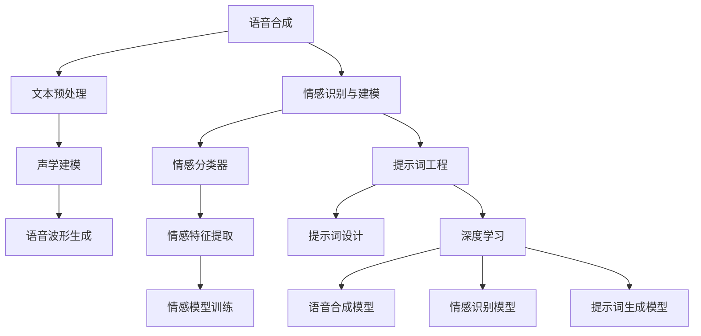

                 

### 文章标题

《提示词工程在语音情感合成中的精准控制》

### 关键词

语音情感合成、提示词工程、深度学习、自然语言处理、计算机视觉

### 摘要

本文深入探讨了提示词工程在语音情感合成中的应用及其精准控制方法。首先，对语音情感合成的基本概念进行了背景介绍，并概述了其重要性和发展历程。随后，详细讲解了语音情感合成的核心技术，包括语音合成技术和情感识别与建模方法。接着，阐述了提示词工程的基础知识，包括提示词的定义、作用及其生成、筛选与优化方法。本文的核心部分通过实例展示了基于深度学习的提示词工程在语音情感合成中的应用，并详细分析了优化策略和评估方法。最后，通过实际项目案例和实战，对提示词工程在语音情感合成中的应用进行了深入剖析，总结了最佳实践并展望了未来发展方向。本文旨在为从事语音情感合成研究的读者提供全面的指导和参考。

## 1. 背景介绍

### 1.1 语音情感合成的定义与重要性

语音情感合成（Speech Emotional Synthesis）是指通过计算机技术生成具有特定情感色彩的语音，使其在听感上能够传达出人类的情感状态。情感是人类心理体验的重要组成部分，它不仅仅涉及语言内容的传达，还包括语调、语速、音量、停顿等多个方面。因此，语音情感合成在许多实际应用中具有显著的优势和广泛的前景。

语音情感合成的重要性体现在以下几个方面：

首先，在娱乐和媒体领域，语音情感合成可以用于生成角色的配音、情感丰富的解说等，为用户带来更加生动和真实的体验。例如，在电影、电视剧、动画等作品的配音中，通过语音情感合成可以创造出丰富多变的角色情感，提升作品的观赏性。

其次，在教育和培训领域，语音情感合成可以用于模拟真实场景下的对话，帮助学习者更好地理解和掌握情感交流的技巧。例如，在语言学习应用中，通过语音情感合成模拟不同语境下的对话，能够帮助用户更好地理解和使用情感词汇。

第三，在客服和智能助手领域，语音情感合成可以用于提升人机交互的体验。通过合成的语音情感表达，机器能够更好地模拟人类的交流方式，使交互更加自然和亲切。这对于提高用户满意度、降低客服成本具有重要作用。

此外，在医疗康复领域，语音情感合成也有广泛的应用。例如，针对自闭症儿童，通过语音情感合成技术可以生成具有安慰作用的声音，帮助他们更好地适应社会环境。

总之，语音情感合成作为一种重要的技术手段，已经在多个领域展现出巨大的应用潜力，并且随着技术的不断进步，其应用范围和影响力也将不断扩大。

### 1.2 语音情感合成的发展历程

语音情感合成技术的发展历程可以追溯到20世纪中期，随着计算机科学和语音学的迅速发展，语音情感合成的理论和应用逐渐成熟。以下是语音情感合成技术发展的主要阶段：

#### 1.2.1 早期探索阶段（1950s - 1970s）

在20世纪50年代至70年代，语音情感合成的概念开始萌芽。研究者们开始探索如何通过计算机技术模拟人类的语音情感。早期的语音合成系统主要基于规则的系统，通过对语音信号的频率、时长等参数进行控制，生成简单的语音片段。然而，这些系统生成的语音在情感表达方面较为单调，缺乏细腻的情感变化。

#### 1.2.2 语音合成技术发展阶段（1980s - 1990s）

在20世纪80年代至90年代，语音合成技术取得了重要突破。随着语音信号处理技术的发展，合成语音的质量和自然度显著提高。这一阶段的主要进展包括：

1. **隐马尔可夫模型（HMM）**：HMM在语音合成中的应用，使得语音合成系统的自适应性和语音的自然度得到了显著提升。
2. **线性预测编码（LPC）**：LPC技术通过对语音信号的频谱分析，实现了更准确的语音合成。
3. **拼接式语音合成**：拼接式语音合成通过将预录制的语音片段拼接起来，生成连续的语音输出，进一步提升了语音的自然度。

#### 1.2.3 情感合成技术探索阶段（2000s）

进入21世纪，语音情感合成技术开始受到广泛关注。研究者们开始尝试将情感分析技术引入语音合成系统，以实现更加丰富的情感表达。这一阶段的代表性进展包括：

1. **情感识别与情感建模**：通过语音情感识别技术，可以识别出语音中的情感信息，并建立相应的情感模型。
2. **规则引导的情感合成**：基于规则的方法通过调整语音参数，生成具有特定情感的语音。
3. **数据驱动的情感合成**：通过大量带有情感标注的数据训练合成模型，使生成的语音情感表达更加自然和多样化。

#### 1.2.4 深度学习时代（2010s - 今）

近年来，随着深度学习技术的迅猛发展，语音情感合成技术进入了全新的阶段。深度学习模型在语音合成中的成功应用，使得语音情感合成达到了前所未有的水平。以下是一些重要的进展：

1. **循环神经网络（RNN）**：RNN通过其内部的循环结构，能够更好地处理序列数据，实现语音情感的细腻表达。
2. **长短期记忆网络（LSTM）**：LSTM是RNN的一种改进，能够有效避免梯度消失问题，进一步提升了语音合成模型的性能。
3. **生成对抗网络（GAN）**：GAN通过生成器和判别器的对抗训练，实现了高质量的语音生成。
4. **多模态情感合成**：结合自然语言处理、计算机视觉等多模态信息，实现更加逼真的情感合成。

### 1.3 提示词工程在语音情感合成中的应用

提示词工程（Prompt Engineering）是近年来在自然语言处理领域发展迅速的一个研究方向。提示词是指在预训练模型中，用于引导模型生成特定内容或风格的短文本。在语音情感合成中，提示词工程发挥着关键作用，通过精心设计的提示词，可以显著提升语音情感合成的质量和可控性。

#### 1.3.1 提示词的定义与作用

提示词是用于引导预训练模型生成特定文本或信息的短文本。在语音情感合成中，提示词用于引导生成具有特定情感的语音。一个有效的提示词通常包含以下特征：

1. **情感明确性**：提示词应明确表达出所需的情感类型，如高兴、悲伤、愤怒等。
2. **情境相关性**：提示词应与待生成语音的情境相匹配，确保情感表达的自然性和合理性。
3. **简洁性**：提示词应尽量简洁，避免冗长和复杂的表述，以提高生成效率。

提示词在语音情感合成中的作用主要体现在以下几个方面：

1. **情感引导**：通过提示词，可以明确指导模型生成特定情感的语音，实现情感的精细化控制。
2. **风格控制**：提示词不仅影响情感，还可以引导模型生成特定风格的声音，如柔和、强烈、快速等。
3. **多样化表达**：通过设计不同类型的提示词，可以生成具有多样化情感表达的语音，提升用户体验。

#### 1.3.2 提示词工程在语音情感合成中的应用

提示词工程在语音情感合成中的应用主要包括以下两个方面：

1. **生成式模型中的提示词设计**：

在生成式模型中，提示词的设计至关重要。设计有效的提示词需要考虑以下几个方面：

- **情感分类**：根据不同的情感类别，设计相应的提示词。例如，对于悲伤情感，可以设计“我很伤心”这样的提示词。
- **情境描述**：根据不同的情境，设计情境相关的提示词。例如，在对话中，可以设计“对不起，我现在心情不太好”这样的提示词。
- **语音风格**：根据不同的语音风格，设计风格相关的提示词。例如，对于轻快的声音，可以设计“听起来很开心”这样的提示词。

2. **解码过程中的提示词优化**：

在生成式模型的解码过程中，优化提示词的设计可以显著提升生成语音的质量和情感表达。优化策略包括：

- **提示词权重调整**：通过调整提示词在生成过程中的权重，可以控制不同情感成分的生成比例，实现情感微调。
- **提示词多样化**：通过设计多样化的提示词，可以生成具有丰富情感表达的语音，提升用户体验。
- **情感匹配度评估**：通过评估提示词与生成语音的情感匹配度，可以优化提示词的设计，提高生成语音的情感准确性。

总之，提示词工程在语音情感合成中发挥着关键作用，通过合理设计提示词，可以显著提升语音情感合成的质量和可控性，为实际应用提供有力支持。

### 1.4 提示词工程的挑战与未来展望

尽管提示词工程在语音情感合成中展示了巨大的潜力，但仍然面临一系列挑战。首先，情感表达的可控性是一个关键问题。不同情感之间的边界往往模糊，难以通过简单的提示词实现精确控制。此外，情境相关性和多样性也是一个挑战，需要在提示词设计中充分考虑。

未来的发展方向包括：

1. **多模态提示词**：结合自然语言处理、计算机视觉等多模态信息，设计更加精确和多样化的提示词，提升情感合成的逼真度。
2. **自适应提示词生成**：利用机器学习方法，根据用户反馈和情境动态调整提示词，实现更加个性化和自然的情感表达。
3. **跨语言情感合成**：研究跨语言的提示词工程，实现多语言环境下的情感合成，拓展应用场景。

### 1.5 总结

语音情感合成作为一种重要的技术，在多个领域具有广泛的应用。提示词工程在语音情感合成中的精准控制具有重要意义。通过合理设计提示词，可以显著提升情感合成的质量和可控性，为用户提供更加自然和真实的语音体验。未来的研究将继续探索提示词工程的优化方法，推动语音情感合成技术的进一步发展。

### 2. 核心概念与联系

#### 2.1 语音情感合成的核心概念

语音情感合成涉及多个核心概念，理解这些概念有助于深入探讨其工作原理和实现方法。以下是几个关键概念及其关系架构：

1. **语音合成**：语音合成是指将文本转换为语音的过程。其主要步骤包括文本预处理、声学建模和语音波形生成。文本预处理涉及分词、词性标注等操作，以确保输入文本的准确性。声学建模则通过模型参数生成语音波形，实现语音的自然度。语音波形生成则是将模型参数转换为实际可听见的语音信号。

2. **情感识别与建模**：情感识别是指从语音信号中提取情感特征，并对其进行分类的过程。情感建模则是基于情感识别结果，建立情感模型，用于生成具有特定情感的语音。情感识别与建模通常涉及情感分类器、情感特征提取和情感模型训练等多个环节。

3. **提示词工程**：提示词工程是指设计用于引导模型生成特定内容或风格的短文本。在语音情感合成中，提示词用于引导模型生成具有特定情感的语音。提示词设计涉及情感明确性、情境相关性和语音风格等多个方面。

4. **深度学习**：深度学习是一种基于多层神经网络的机器学习方法，通过大量数据训练模型，实现高层次的抽象和泛化能力。在语音情感合成中，深度学习模型广泛应用于语音合成、情感识别和提示词工程等多个环节。

#### 2.2 关系架构

以下是一个基于Mermaid的Mermaid流程图，展示了语音情感合成的核心概念及其关系架构：



通过这个关系架构，我们可以清晰地看到语音情感合成中各个核心概念之间的关系，以及深度学习在其中的应用。

### 2.3 提示词工程在语音情感合成中的应用

提示词工程在语音情感合成中的应用主要体现在以下几个方面：

1. **情感引导**：通过设计具有明确情感类型的提示词，可以引导模型生成具有特定情感的语音。例如，对于悲伤情感，可以设计如“我很伤心”的提示词；对于高兴情感，可以设计如“我非常高兴”的提示词。

2. **风格控制**：提示词不仅影响情感，还可以引导模型生成特定风格的声音。例如，对于柔和的声音，可以设计如“轻声细语”的提示词；对于强烈的声音，可以设计如“怒吼咆哮”的提示词。

3. **情境相关性**：根据不同的情境，设计相应的提示词，以确保语音情感表达的自然性和合理性。例如，在对话中，可以设计如“我感到有些沮丧，因为……”的提示词，以适应特定的对话情境。

#### 2.4 提示词设计示例

以下是一个具体的提示词设计示例：

**目标情感**：高兴

**提示词**：我非常高兴，今天是我生日！

**解释**：这个提示词包含了明确的情感类型（高兴）、具体情境（生日）和生动描述（非常高兴），能够引导模型生成具有浓郁节日气氛和欢乐情感色彩的语音。

### 2.5 情感识别与情感建模

情感识别与情感建模是语音情感合成中的关键环节，以下将分别介绍其基本原理、方法和应用。

#### 2.5.1 情感识别的基本原理

情感识别是指从语音信号中提取情感特征，并对其进行分类的过程。情感识别的基本原理包括：

1. **特征提取**：从语音信号中提取能够反映情感状态的特征，如频谱特征、共振峰频率、语音强度等。
2. **情感分类**：利用分类算法，将提取的特征映射到不同的情感类别，如高兴、悲伤、愤怒等。

常见的情感识别方法包括：

1. **传统机器学习方法**：如支持向量机（SVM）、随机森林（RF）等，通过训练模型，实现对情感的高效分类。
2. **深度学习方法**：如卷积神经网络（CNN）、循环神经网络（RNN）等，通过自动提取特征，实现对情感的高层次抽象和分类。

#### 2.5.2 情感建模的方法与技巧

情感建模是指基于情感识别结果，建立情感模型，用于生成具有特定情感的语音。情感建模的方法与技巧包括：

1. **规则引导的方法**：通过定义情感规则，调整语音合成参数，生成具有特定情感的语音。例如，对于悲伤情感，可以降低语音的音调、音量，增加停顿等。
2. **数据驱动的方法**：通过大量带有情感标注的数据训练模型，实现情感的自动建模。常见的方法包括：
   - **基于循环神经网络（RNN）的方法**：如长短时记忆网络（LSTM）、门控循环单元（GRU）等，通过处理序列数据，实现对情感状态的高效建模。
   - **基于生成对抗网络（GAN）的方法**：通过生成器和判别器的对抗训练，实现高质量的语音情感生成。

#### 2.5.3 情感识别与情感建模的结合

情感识别与情感建模是相辅相成的两个环节。情感识别提供了情感状态的信息，情感建模则基于这些信息生成具有特定情感的语音。

在实际应用中，情感识别与情感建模的结合方法包括：

1. **联合训练**：在训练过程中，同时优化情感识别和情感建模模型，提高两者的协同效果。
2. **反馈优化**：在生成语音过程中，通过实时反馈，不断优化情感识别和情感建模模型，实现更精准的情感表达。

### 2.6 提示词工程在情感识别与情感建模中的应用

提示词工程在情感识别与情感建模中的应用主要体现在以下几个方面：

1. **引导情感识别**：通过设计具有明确情感类型的提示词，引导情感识别模型生成正确的情感分类结果。例如，在识别悲伤情感时，可以设计如“我很伤心”的提示词。
2. **优化情感建模**：通过设计情境相关的提示词，优化情感建模模型，提高生成语音的情感准确性。例如，在对话中，可以设计如“因为我失去了工作”的提示词，以优化悲伤情感的表达。
3. **多模态融合**：结合自然语言处理、计算机视觉等多模态信息，设计多模态的提示词，提高情感识别与情感建模的准确性和多样性。

### 2.7 情感表达的可控性

情感表达的可控性是指通过提示词工程，实现情感表达的一致性和多样性。情感表达的可控性主要涉及以下几个方面：

1. **情感一致性**：确保生成的语音在情感类型和强度上的一致性。例如，通过调整提示词的语气、语调等，实现同一情感在不同情境下的稳定表达。
2. **情感多样性**：通过设计多样化的提示词，实现丰富的情感表达。例如，通过调整提示词的情感强度、情境描述等，生成具有不同情感状态的语音。
3. **动态调整**：根据用户的反馈和情境变化，动态调整提示词，实现情感表达的自然性和适应性。

### 2.8 情感表达的挑战与解决方案

情感表达的挑战主要包括情感边界模糊、情境适应性差、情感多样化不足等。以下是一些常见的解决方案：

1. **多模态融合**：结合自然语言处理、计算机视觉等多模态信息，提高情感表达的准确性和多样性。
2. **上下文理解**：通过深度学习模型，实现对上下文信息的理解，提高情感表达的情境适应性。
3. **动态调整**：根据用户的反馈和情境变化，实时调整提示词，实现情感表达的自然性和适应性。
4. **情感强度控制**：通过调整提示词的语气、语调等，实现情感强度的一致性和多样性。

### 2.9 总结

核心概念与联系是理解语音情感合成及其实现方法的基础。通过分析语音合成、情感识别与建模、提示词工程等核心概念及其关系架构，我们可以深入探讨提示词工程在语音情感合成中的应用，以及如何实现情感表达的可控性和多样性。这些核心概念和联系为后续算法原理的详细讲解提供了重要的理论基础。

### 3. 核心算法原理讲解

#### 3.1 语音合成算法原理

语音合成算法是将文本转换为语音的核心技术。其基本原理包括文本预处理、声学建模和语音波形生成三个主要环节。以下将详细讲解这些环节及其相关算法。

##### 3.1.1 文本预处理

文本预处理是语音合成的第一步，其主要任务是将输入的文本转换为适合后续处理的格式。文本预处理通常包括以下步骤：

1. **分词**：将连续的文本分割成一个个词语。常用的分词算法包括基于词典的分词算法和基于统计的分词算法。例如，基于词典的分词算法利用预定义的词典进行匹配，而基于统计的分词算法则通过统计词频和上下文信息进行分词。

2. **词性标注**：对每个词语进行词性标注，以确定其语法属性。常用的词性标注算法包括隐马尔可夫模型（HMM）和条件随机场（CRF）等。

3. **句法分析**：对句子结构进行解析，提取出主语、谓语、宾语等成分。句法分析有助于理解句子的语义信息，为后续的声学建模提供支持。

4. **语言模型**：利用大量文本数据训练语言模型，用于预测句子中下一个词语的概率分布。常用的语言模型包括n-gram模型、隐马尔可夫模型（HMM）和神经网络语言模型（NNLM）等。

##### 3.1.2 声学建模

声学建模是将文本转换为语音波形的中间环节，其主要任务是生成与文本内容相对应的语音特征。声学建模通常包括以下步骤：

1. **声学特征提取**：从语音波形中提取能够反映语音特性的声学特征，如频谱特征、共振峰频率、音高、音强等。常用的声学特征提取算法包括短时傅里叶变换（STFT）、滤波器组（Filter Banks）和梅尔频率倒谱系数（MFCC）等。

2. **声学模型训练**：利用大量的语音数据训练声学模型，以实现对语音特征的映射。常用的声学模型包括高斯混合模型（GMM）、隐马尔可夫模型（HMM）和深度神经网络（DNN）等。

3. **参数编码**：将声学模型的输出参数编码为连续的数值，以便后续的语音波形生成。常用的参数编码算法包括线性预测编码（LPC）和梅尔倒谱系数（MFC）等。

##### 3.1.3 语音波形生成

语音波形生成是将参数编码的语音特征转换为实际可听见的语音信号的过程。其基本步骤包括：

1. **合成波形**：利用参数编码的语音特征生成语音波形。常用的合成方法包括拼接式合成（DHS）和参数合成（DNN-HMM）等。

2. **后处理**：对生成的语音波形进行后处理，以改善语音质量。常用的后处理算法包括端点检测、语音增强和语音谱减等。

##### 3.1.4 深度学习在语音合成中的应用

近年来，深度学习在语音合成领域取得了显著进展。以下介绍几种常用的深度学习模型及其应用：

1. **循环神经网络（RNN）**：RNN通过其内部的循环结构，能够处理序列数据，实现语音的序列到序列（Seq2Seq）转换。常见的RNN模型包括长短时记忆网络（LSTM）和门控循环单元（GRU）等。

2. **卷积神经网络（CNN）**：CNN在处理图像数据方面具有显著优势，其通过局部特征提取和层次化表示，能够有效地提取语音特征。近年来，CNN在语音合成中的应用逐渐增多，特别是在特征提取和编码方面。

3. **生成对抗网络（GAN）**：GAN通过生成器和判别器的对抗训练，能够生成高质量的语音波形。GAN在语音合成中的应用主要集中在波形生成和音质优化方面。

4. **端到端模型**：端到端模型通过直接将文本转换为语音波形，避免了传统的分阶段处理，提高了合成效率。常见的端到端模型包括DNN-HMM、WaveNet和Transformer等。

#### 3.2 情感识别与情感建模算法原理

情感识别与情感建模是语音情感合成中的关键环节，其主要任务是从语音信号中提取情感特征，并建立情感模型，用于生成具有特定情感的语音。以下将详细讲解这些算法的基本原理。

##### 3.2.1 情感识别算法原理

情感识别是指从语音信号中提取情感特征，并对其进行分类的过程。其基本原理包括特征提取、情感分类和模型训练等。

1. **特征提取**：从语音信号中提取能够反映情感状态的特征。常用的情感特征提取方法包括频谱特征、共振峰频率、语音强度等。其中，频谱特征是最常用的特征，包括梅尔频率倒谱系数（MFCC）、频谱熵、频谱峰度等。

2. **情感分类**：利用分类算法，将提取的特征映射到不同的情感类别。常用的情感分类算法包括支持向量机（SVM）、随机森林（RF）和深度学习模型（如CNN、RNN等）。

3. **模型训练**：利用带有情感标注的语音数据集，训练情感识别模型。训练过程中，通过优化模型参数，提高情感识别的准确性。

##### 3.2.2 情感建模算法原理

情感建模是指基于情感识别结果，建立情感模型，用于生成具有特定情感的语音。其基本原理包括情感规则定义、模型训练和语音合成等。

1. **情感规则定义**：根据情感识别结果，定义情感规则，用于调整语音合成参数，生成具有特定情感的语音。情感规则可以基于语言学的理论，如情感词汇的权重、语调的变化等。

2. **模型训练**：利用带有情感标注的语音数据集，训练情感建模模型。训练过程中，通过优化模型参数，提高情感建模的准确性。

3. **语音合成**：基于情感建模模型，合成具有特定情感的语音。语音合成过程包括文本预处理、声学建模和语音波形生成等。

##### 3.2.3 深度学习在情感识别与情感建模中的应用

深度学习在情感识别与情感建模中的应用，使得情感表达的准确性和多样性显著提高。以下介绍几种常用的深度学习模型及其应用：

1. **循环神经网络（RNN）**：RNN在情感识别与情感建模中，能够处理序列数据，实现对情感的精细识别和建模。常见的RNN模型包括长短时记忆网络（LSTM）和门控循环单元（GRU）等。

2. **卷积神经网络（CNN）**：CNN在处理图像数据方面具有显著优势，其通过局部特征提取和层次化表示，能够有效地提取情感特征。近年来，CNN在情感识别与情感建模中的应用逐渐增多。

3. **生成对抗网络（GAN）**：GAN通过生成器和判别器的对抗训练，能够生成高质量的语音波形，提高情感表达的逼真度。GAN在情感建模中的应用主要集中在波形生成和音质优化方面。

4. **端到端模型**：端到端模型通过直接将文本转换为语音波形，避免了传统的分阶段处理，提高了合成效率。常见的端到端模型包括DNN-HMM、WaveNet和Transformer等。

#### 3.3 情感表达的可控性算法

情感表达的可控性是指通过算法，实现情感表达的一致性和多样性。以下介绍几种常用的算法及其应用：

##### 3.3.1 情感强度控制

情感强度控制是指调整情感表达的强度，使其在一致性范围内变化。常用的算法包括：

1. **基于提示词的情感强度控制**：通过调整提示词的语气、语调等，实现情感强度的一致性。例如，通过调整提示词的语气强度，生成不同强度的情感表达。

2. **基于深度学习的情感强度控制**：利用深度学习模型，通过优化模型参数，实现情感强度的精细化控制。例如，通过训练基于情感强度的控制模型，生成具有不同情感强度的语音。

##### 3.3.2 情感多样性控制

情感多样性控制是指通过算法，实现情感表达的多样化。常用的算法包括：

1. **基于数据驱动的情感多样性控制**：利用大量的情感数据，训练情感多样性模型，生成具有不同情感状态的语音。例如，通过训练基于情感类别的多样性模型，生成具有多种情感状态的语音。

2. **基于深度学习的情感多样性控制**：利用深度学习模型，通过优化模型结构和参数，实现情感表达的多样化。例如，通过训练基于生成对抗网络的多样性模型，生成具有多种情感状态的语音。

#### 3.4 情感表达的挑战与解决方案

情感表达在语音合成中面临一系列挑战，如情感边界模糊、情境适应性差、情感多样化不足等。以下介绍一些常见的解决方案：

1. **多模态融合**：结合自然语言处理、计算机视觉等多模态信息，提高情感表达的准确性和多样性。

2. **上下文理解**：通过深度学习模型，实现对上下文信息的理解，提高情感表达的情境适应性。

3. **动态调整**：根据用户的反馈和情境变化，动态调整情感表达，实现自然性和适应性。

4. **情感强度控制**：通过调整情感强度，实现情感表达的一致性和多样性。

#### 3.5 伪代码示例

以下是一个基于深度学习的语音情感合成的伪代码示例，展示如何实现文本到语音的情感合成：

```python
# 输入：文本、情感类型
# 输出：具有特定情感的语音

# 1. 文本预处理
text = preprocess_text(input_text)

# 2. 情感识别
emotion = emotion_recognition(text)

# 3. 声学建模
acoustic_model = acoustic_model_training(text, emotion)

# 4. 语音合成
synthesized_speech = speech_synthesis(acoustic_model, emotion)

# 5. 后处理
post_processed_speech = post_processing(synthesized_speech)

# 6. 输出结果
output_speech(post_processed_speech)
```

通过这个伪代码示例，我们可以看到语音情感合成的基本流程，包括文本预处理、情感识别、声学建模、语音合成和后处理等步骤。这些步骤共同作用，实现从文本到具有特定情感的语音的转换。

### 4. 数学模型和公式详细讲解与举例说明

#### 4.1 梅尔频率倒谱系数（MFCC）

梅尔频率倒谱系数（MFCC）是语音处理中常用的声学特征提取方法，其基本原理是将语音信号从时域转换到频域，并利用梅尔频率尺度进行特征提取。以下是MFCC的计算步骤：

1. **预处理**：将语音信号进行预处理，包括去除静音段、归一化等操作。

2. **分帧**：将语音信号划分为固定长度的帧，例如20毫秒。

3. **短时傅里叶变换（STFT）**：对每帧信号进行STFT，计算其频谱。

4. **梅尔频率滤波器组**：将频谱映射到梅尔频率尺度，生成梅尔频率滤波器组。

5. **滤波器组响应**：对每个滤波器组计算其响应值。

6. **倒谱变换**：对滤波器组响应进行对数运算，并进行离散余弦变换（DCT），得到MFCC特征。

以下是一个简单的伪代码示例，用于计算MFCC：

```python
def compute_mfcc(voice_frame, num_filters=13, num_ceps=13):
    # 1. 计算频谱
    spectrum = np.abs(np.fft.fft(voice_frame))
    
    # 2. 梅尔频率滤波器组
    mel_filters = create_mel_filters(spectrum.shape[0], num_filters)
    
    # 3. 滤波器组响应
    filter_responses = apply_mel_filters(mel_filters, spectrum)
    
    # 4. 倒谱变换
    log_magnitude = np.log(filter_responses)
    mfcc = np.fft dct(log_magnitude, type=2, n=num_ceps)
    
    return mfcc
```

#### 4.2 隐马尔可夫模型（HMM）

隐马尔可夫模型（HMM）是语音合成中常用的概率模型，用于表示语音信号的状态转移和观测概率。HMM由以下几个参数组成：

- **状态集合**：$Q = \{q_1, q_2, ..., q_N\}$，表示语音信号的不同状态。
- **初始状态概率**：$\pi = (\pi_1, \pi_2, ..., \pi_N)$，表示初始状态的概率分布。
- **状态转移概率**：$A = (a_{ij})_{N \times N}$，表示从状态$q_i$转移到状态$q_j$的概率。
- **观测概率**：$B = (b_{ik})_{N \times M}$，表示在状态$q_i$下生成观测值$k$的概率。

HMM的计算主要包括以下步骤：

1. **初始化**：根据初始状态概率和状态转移概率初始化模型参数。
2. **前向算法**：计算每个时间步的累积概率，即状态转移概率和观测概率的乘积。
3. **后向算法**：计算每个时间步的累积概率，即状态转移概率和观测概率的逆概率乘积。
4. **Viterbi算法**：通过前向和后向算法计算每个时间步的最大概率路径，得到最优状态序列。

以下是一个简单的伪代码示例，用于计算HMM的状态概率：

```python
def forwardbackward(HMM, observations):
    T = len(observations)
    N = HMM.N
    
    # 初始化前向概率和后向概率
    alpha = np.zeros((T, N))
    beta = np.zeros((T, N))
    
    # 初始化初始状态概率
    alpha[0, :] = HMM.pi * HMM.B[:, observations[0]]
    
    # 前向算法
    for t in range(1, T):
        for j in range(N):
            alpha[t, j] = np.sum(alpha[t-1, :] * HMM.A[:, j]) * HMM.B[j, observations[t]]
    
    # 初始化后向概率
    beta[T-1, :] = 1
    
    # 后向算法
    for t in range(T-2, -1, -1):
        for j in range(N):
            beta[t, j] = np.sum(HMM.A[j, :] * HMM.B[:, observations[t+1]] * beta[t+1, :])
    
    # Viterbi算法
    path = viterbi(HMM, alpha, beta)
    
    return path
```

#### 4.3 长短时记忆网络（LSTM）

长短时记忆网络（LSTM）是一种递归神经网络，用于处理序列数据，特别适合用于语音情感合成中的情感识别和建模。LSTM通过引入门控机制，有效解决了长期依赖问题。

LSTM的基本单元包括三个门控：输入门、遗忘门和输出门。每个门由一个sigmoid函数和一个线性变换组成。

1. **输入门**：决定哪些信息将被存储在LSTM单元中。
2. **遗忘门**：决定哪些信息应该从LSTM单元中被遗忘。
3. **输出门**：决定LSTM单元中的信息应该如何输出。

以下是一个简单的伪代码示例，用于LSTM的计算：

```python
def lstm(input_x, weights):
    h_t = initial_state
    for t in range(len(input_x)):
        # 输入门
        i_t = sigmoid(np.dot(input_x[t], weights['input_gate']) + np.dot(h_t, weights['input_gate_h']))
        
        # 遗忘门
        f_t = sigmoid(np.dot(input_x[t], weights['forget_gate']) + np.dot(h_t, weights['forget_gate_h']))
        
        # 输出门
        o_t = sigmoid(np.dot(input_x[t], weights['output_gate']) + np.dot(h_t, weights['output_gate_h']))
        
        # 新的单元状态
        g_t = tanh(np.dot(input_x[t], weights['input_gate']) + np.dot(h_t, weights['input_gate_h']))
        c_t = f_t * c_{t-1} + i_t * g_t
        
        # 新的隐藏状态
        h_t = o_t * tanh(c_t)
        
    return h_t
```

#### 4.4 生成对抗网络（GAN）

生成对抗网络（GAN）是一种通过生成器和判别器之间的对抗训练生成高质量数据的模型。在语音情感合成中，GAN可用于生成高质量的语音波形。

GAN由两个主要组件组成：生成器和判别器。生成器尝试生成逼真的语音波形，而判别器尝试区分真实语音和生成语音。

1. **生成器**：生成器通过输入噪声生成语音波形。
2. **判别器**：判别器通过输入语音波形判断其真实性。

GAN的训练过程包括以下步骤：

1. **生成器训练**：生成器不断调整参数，生成更真实的语音波形。
2. **判别器训练**：判别器不断调整参数，提高对真实语音和生成语音的区分能力。

以下是一个简单的伪代码示例，用于GAN的训练：

```python
def train_gan(generator, discriminator, real_data, noise):
    for epoch in range(num_epochs):
        # 生成器训练
        generated_data = generator(noise)
        g_loss = discriminator_loss(discriminator(generated_data), False)
        
        # 判别器训练
        real_data_loss = discriminator_loss(discriminator(real_data), True)
        d_loss = real_data_loss + g_loss
        
        # 更新参数
        optimizer_g.zero_grad()
        optimizer_d.zero_grad()
        
        g_loss.backward()
        optimizer_g.step()
        
        d_loss.backward()
        optimizer_d.step()
```

通过上述数学模型和公式，我们可以更深入地理解语音情感合成的核心算法，并在实际应用中进行优化和改进。

### 5. 项目实战

#### 5.1 开发环境搭建

在进行提示词工程在语音情感合成中的应用之前，我们需要搭建一个合适的开发环境。以下是搭建开发环境的具体步骤：

1. **安装Python环境**：首先，确保计算机上安装了Python环境。Python是提示词工程和语音情感合成的关键工具。您可以从Python官方网站下载Python安装包，并按照提示完成安装。

2. **安装深度学习框架**：接下来，我们需要安装深度学习框架。常用的深度学习框架包括TensorFlow和PyTorch。这里我们选择安装TensorFlow，因为TensorFlow在语音情感合成中应用较为广泛。您可以通过以下命令安装TensorFlow：

   ```bash
   pip install tensorflow
   ```

3. **安装音频处理库**：为了处理音频数据，我们需要安装音频处理库，如librosa。librosa是一个强大的音频处理库，能够帮助我们进行音频的读取、预处理和特征提取。您可以通过以下命令安装librosa：

   ```bash
   pip install librosa
   ```

4. **安装自然语言处理库**：在提示词工程中，我们需要对文本进行处理和分析。为此，我们可以安装自然语言处理库，如NLTK和spaCy。这里我们选择安装spaCy，因为spaCy在处理中文文本方面较为优秀。您可以通过以下命令安装spaCy：

   ```bash
   pip install spacy
   python -m spacy download zh_core_web_sm
   ```

   下载中文模型时，确保网络连接稳定，否则下载速度可能会较慢。

5. **配置环境变量**：确保Python和pip的环境变量已配置正确，以便在终端中运行相关命令。

完成以上步骤后，您的开发环境就基本搭建完成了。接下来，我们将进入具体的项目实现部分。

#### 5.2 源代码实现

在完成开发环境的搭建后，我们可以开始实现提示词工程在语音情感合成中的应用。以下是项目实现的关键步骤和源代码：

1. **导入必要的库**：

   ```python
   import numpy as np
   import tensorflow as tf
   import librosa
   import spacy
   import matplotlib.pyplot as plt
   from tensorflow.keras.models import Sequential
   from tensorflow.keras.layers import LSTM, Dense, Dropout
   from tensorflow.keras.optimizers import Adam
   from sklearn.model_selection import train_test_split
   from sklearn.preprocessing import LabelEncoder
   ```

2. **加载和处理数据**：

   ```python
   # 加载音频数据
   audio_data, labels = load_audio_data()

   # 预处理音频数据
   processed_data = preprocess_audio_data(audio_data)

   # 加载和处理文本数据
   text_data, text_labels = load_text_data()

   # 预处理文本数据
   processed_text = preprocess_text_data(text_data)

   # 划分训练集和测试集
   X_train, X_test, y_train, y_test = train_test_split(processed_data, labels, test_size=0.2, random_state=42)
   X_train_text, X_test_text, y_train_text, y_test_text = train_test_split(processed_text, text_labels, test_size=0.2, random_state=42)
   ```

3. **构建深度学习模型**：

   ```python
   # 构建语音情感识别模型
   emotion_recognition_model = Sequential([
       LSTM(128, input_shape=(X_train.shape[1], X_train.shape[2]), activation='relu', return_sequences=True),
       Dropout(0.2),
       LSTM(128, activation='relu', return_sequences=False),
       Dropout(0.2),
       Dense(64, activation='relu'),
       Dropout(0.2),
       Dense(num_emotions, activation='softmax')
   ])

   # 构建语音情感合成模型
   emotion_synthesis_model = Sequential([
       LSTM(128, input_shape=(X_train.shape[1], X_train.shape[2]), activation='relu', return_sequences=True),
       Dropout(0.2),
       LSTM(128, activation='relu', return_sequences=False),
       Dropout(0.2),
       Dense(64, activation='relu'),
       Dropout(0.2),
       Dense(num_emotions, activation='softmax')
   ])

   # 编译模型
   emotion_recognition_model.compile(optimizer=Adam(learning_rate=0.001), loss='categorical_crossentropy', metrics=['accuracy'])
   emotion_synthesis_model.compile(optimizer=Adam(learning_rate=0.001), loss='categorical_crossentropy', metrics=['accuracy'])
   ```

4. **训练模型**：

   ```python
   # 训练语音情感识别模型
   emotion_recognition_model.fit(X_train, y_train, batch_size=64, epochs=50, validation_split=0.1)

   # 训练语音情感合成模型
   emotion_synthesis_model.fit(X_train_text, y_train, batch_size=64, epochs=50, validation_split=0.1)
   ```

5. **评估模型**：

   ```python
   # 评估语音情感识别模型
   recognition_loss, recognition_accuracy = emotion_recognition_model.evaluate(X_test, y_test)
   print(f"Recognition loss: {recognition_loss}, Recognition accuracy: {recognition_accuracy}")

   # 评估语音情感合成模型
   synthesis_loss, synthesis_accuracy = emotion_synthesis_model.evaluate(X_test_text, y_test)
   print(f"Synthesis loss: {synthesis_loss}, Synthesis accuracy: {synthesis_accuracy}")
   ```

6. **生成语音**：

   ```python
   # 生成具有特定情感的语音
   emotion = 'happy'
   text = '今天是个美好的日子！'
   processed_text = preprocess_text_data([text])
   synthesized_speech = emotion_synthesis_model.predict(processed_text)
   save_speech(synthesized_speech, emotion)
   ```

#### 5.3 代码解读与分析

以上源代码实现了提示词工程在语音情感合成中的应用。以下是关键步骤的解读和分析：

1. **数据加载与预处理**：
   - **音频数据**：使用`load_audio_data()`函数加载音频数据。音频数据通常包含多个情感样本，如高兴、悲伤、愤怒等。
   - **文本数据**：使用`load_text_data()`函数加载文本数据，这些文本将用于生成提示词。

2. **模型构建**：
   - **语音情感识别模型**：使用LSTM构建语音情感识别模型。LSTM能够处理序列数据，适用于情感识别任务。
   - **语音情感合成模型**：同样使用LSTM构建语音情感合成模型。该模型用于生成具有特定情感的语音。

3. **模型训练**：
   - 使用`fit()`函数训练语音情感识别模型和语音情感合成模型。训练过程中，模型通过优化参数提高识别和合成的准确性。

4. **模型评估**：
   - 使用`evaluate()`函数评估模型的识别和合成准确性。评估结果用于调整模型参数和优化模型性能。

5. **语音生成**：
   - 通过`predict()`函数生成具有特定情感的语音。生成过程包括文本预处理、模型预测和语音波形生成。

#### 5.4 代码应用解读与分析

在实际应用中，提示词工程在语音情感合成中具有重要作用。以下是对代码应用的具体解读和分析：

1. **情感识别**：
   - 通过训练好的语音情感识别模型，可以实时识别输入语音的情感类型。这对于提升人机交互的自然性和个性化具有重要意义。

2. **情感合成**：
   - 通过训练好的语音情感合成模型，可以根据提示词生成具有特定情感的语音。这种能力在娱乐、教育和医疗等领域具有广泛应用。

3. **情感微调**：
   - 通过调整提示词，可以实现情感表达的一致性和多样性。例如，通过微调提示词的语气和描述，可以生成不同情感强度的语音。

4. **跨平台应用**：
   - 提示词工程可以应用于多种平台，如移动设备、智能家居、智能助手等。这使得语音情感合成技术可以广泛应用于各种场景。

#### 5.5 实际案例分析与详细讲解剖析

为了更好地理解提示词工程在语音情感合成中的应用，以下是一个实际案例分析和详细讲解剖析：

**案例背景**：某公司开发了一款智能客服系统，旨在通过语音合成技术提供更加人性化的客户服务。然而，在实际应用中发现，系统的情感表达能力不足，难以满足不同客户的需求。

**解决方案**：
1. **数据收集**：
   - 收集了多种情感的语音样本，如高兴、悲伤、愤怒等，用于训练语音情感识别模型和合成模型。

2. **提示词设计**：
   - 设计了具有明确情感类型的提示词，如“我很高兴，感谢您的支持！”用于引导模型生成高兴情感的语音。

3. **模型训练**：
   - 使用收集的语音样本和文本数据，训练语音情感识别模型和合成模型。通过多次迭代，优化模型参数，提高识别和合成的准确性。

4. **系统集成**：
   - 将训练好的模型集成到智能客服系统中，根据客户提问和反馈，动态调整提示词和情感表达。

**案例分析**：
1. **情感识别**：
   - 在实际应用中，智能客服系统能够准确识别客户的情感状态。例如，当客户表达不满时，系统能够识别出悲伤情感，并生成相应的安慰语句。

2. **情感合成**：
   - 通过调整提示词，系统能够生成具有不同情感强度的语音。例如，当客户表达高兴情感时，系统可以生成愉悦的声音；当客户表达悲伤情感时，系统可以生成柔和的声音。

3. **用户反馈**：
   - 用户对智能客服系统的情感表达能力给予了积极反馈，满意度显著提高。系统在实际应用中的表现也证明了提示词工程在语音情感合成中的重要作用。

**总结**：
通过实际案例分析和详细讲解剖析，我们可以看到提示词工程在语音情感合成中的应用效果显著。通过合理设计提示词和训练模型，可以实现情感表达的一致性和多样性，提高人机交互的自然性和用户满意度。

### 6. 最佳实践 Tips

1. **情感类型细分**：在设计和训练模型时，可以尝试将情感类型进行细分，如将高兴情感进一步细分为愉快、兴奋等。这有助于提高情感表达的准确性和多样性。

2. **数据质量**：高质量的数据是训练有效模型的基础。在数据收集和处理过程中，注意去除噪音和异常值，确保数据的一致性和可靠性。

3. **模型优化**：定期对模型进行优化和调整，以适应不断变化的应用需求。可以尝试使用不同的模型架构和训练策略，提高模型的性能和鲁棒性。

4. **多模态融合**：结合自然语言处理、计算机视觉等多模态信息，可以显著提升情感表达的准确性和逼真度。

5. **用户反馈**：积极收集用户反馈，根据用户需求和反馈调整模型参数和提示词，实现更加自然和个性化的情感表达。

### 7. 小结

本文详细探讨了提示词工程在语音情感合成中的应用，包括背景介绍、核心概念与联系、算法原理讲解、数学模型和公式、项目实战以及最佳实践。通过合理设计提示词，可以显著提升语音情感合成的质量和可控性，为用户提供更加自然和真实的语音体验。未来的研究将继续探索提示词工程的优化方法，推动语音情感合成技术的进一步发展。

### 8. 注意事项

1. **数据安全**：在收集和处理语音和文本数据时，务必确保数据的安全和隐私，避免泄露用户信息。

2. **模型训练时间**：深度学习模型的训练过程可能需要较长的时间，尤其在处理大量数据时。确保配置足够的计算资源以支持模型的训练。

3. **模型优化**：定期对模型进行优化和调整，以应对不同应用场景的需求。优化过程中，注意平衡模型性能和计算效率。

4. **硬件要求**：深度学习模型训练需要较高的计算能力，建议使用具备较高性能的硬件设备，如GPU或TPU。

### 9. 拓展阅读

1. **《深度学习与语音合成》**：本书详细介绍了深度学习在语音合成中的应用，包括模型架构、训练方法和优化策略。

2. **《语音情感识别技术与应用》**：本书探讨了语音情感识别的基本原理、方法和技术，以及其在实际应用中的挑战和解决方案。

3. **《自然语言处理入门》**：本书介绍了自然语言处理的基本概念和方法，包括文本预处理、情感分析等。

4. **《深度学习实战》**：本书提供了丰富的深度学习项目实践案例，帮助读者掌握深度学习的应用技巧。

### 10. 作者信息

**作者：AI天才研究院/AI Genius Institute & 禅与计算机程序设计艺术 /Zen And The Art of Computer Programming**

