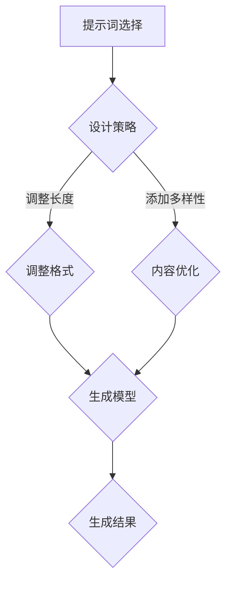
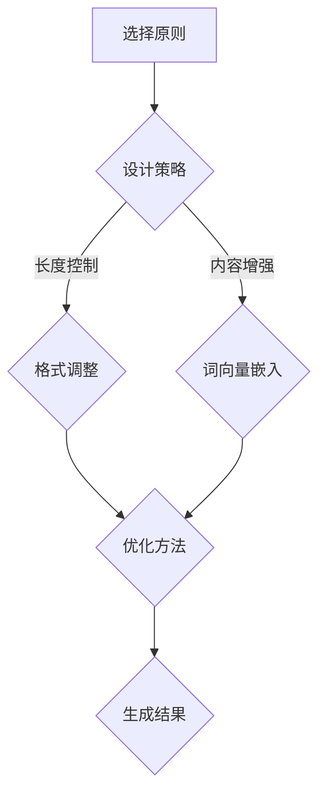
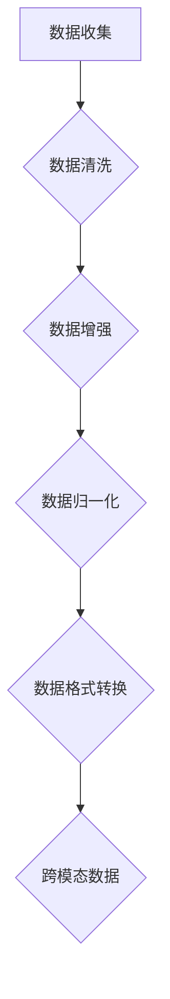
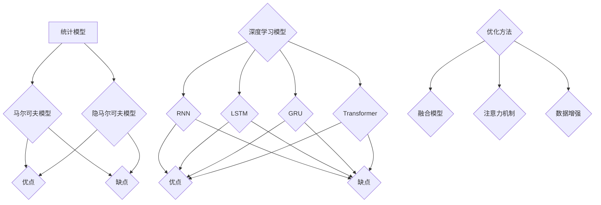
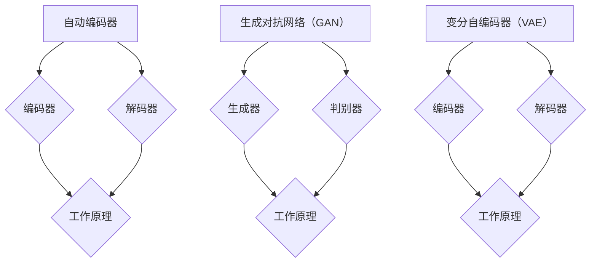

                 

### 第1章：提示词工程概述

> 提示词工程在跨模态生成中扮演着关键角色，其核心概念和背景知识是我们理解这一领域的基础。

**1.1 提示词工程的概念**

- **提示词的定义**：提示词是指导模型生成内容的关键输入，它可以是文本、图像、声音等不同模态的信息。
- **提示词的类型**：根据模态的不同，提示词可以分为文本提示词、图像提示词、音频提示词等。
- **提示词的应用场景**：提示词广泛应用于图像生成、文本生成、语音生成等多个领域，如艺术创作、内容推荐、智能助手等。

**1.2 跨模态生成的定义与重要性**

- **跨模态生成的定义**：跨模态生成是指将一种模态的数据转换成另一种模态的数据，如将文本转换为图像，或将图像转换为语音。
- **跨模态生成的重要性**：跨模态生成能够实现信息的无缝传递和交互，有助于提高人工智能系统的智能化水平和用户体验。

**1.3 提示词工程在跨模态生成中的应用**

- **提示词的选择原则**：选择合适的提示词是跨模态生成成功的关键，需要考虑提示词的丰富性、代表性、多样性等因素。
- **提示词的设计策略**：通过调整提示词的长度、格式、内容等，可以提高生成的质量和效率。
- **提示词的优化方法**：利用机器学习和深度学习技术，对提示词进行优化，以提升生成效果。

**Mermaid流程图：**



**伪代码讲解：**

```python
# 提示词生成伪代码
def generate_prompt(data_source):
    # 根据数据源类型选择提示词
    if is_text(data_source):
        prompt = select_text_prompt(data_source)
    elif is_image(data_source):
        prompt = select_image_prompt(data_source)
    elif is_audio(data_source):
        prompt = select_audio_prompt(data_source)
    return prompt
```

**数学模型和公式：**

在提示词工程中，常用的数学模型包括自动编码器（Autoencoder）、生成对抗网络（GAN）和变分自编码器（VAE）。以下是这些模型的基本公式：

$$
\text{Autoencoder:} \\
\text{Input: } X \\
\text{Encoder: } Z = \sigma(W_1 \cdot X + b_1) \\
\text{Decoder: } X' = \sigma(W_2 \cdot Z + b_2)
$$

$$
\text{GAN:} \\
\text{Generator: } G(Z) \\
\text{Discriminator: } D(X, G(Z))
$$

$$
\text{VAE:} \\
\text{Encoder: } \mu, \sigma = \text{encode}(X) \\
\text{Reparameterization: } Z = \mu + \sigma \cdot \epsilon \\
\text{Decoder: } X' = \text{decode}(Z)
$$

通过这些公式，我们可以看到不同模型在提示词工程中的应用和作用。

### 总结

第1章为读者介绍了提示词工程的基本概念和跨模态生成的重要性，包括提示词的选择原则、设计策略和优化方法。通过Mermaid流程图、伪代码和数学模型，读者可以更深入地理解提示词工程的核心概念和原理。接下来，我们将进一步探讨跨模态数据预处理、提示词生成算法和跨模态生成模型，帮助读者全面了解提示词工程在跨模态生成中的应用。### 第2章：提示词工程的核心概念

**2.1 提示词的选择原则**

提示词的选择是提示词工程中的关键环节，它直接影响到生成的质量和效率。以下是选择提示词时应遵循的原则：

- **丰富性**：选择的提示词应涵盖多种主题和场景，以确保生成结果的多样性。
- **代表性**：提示词应具有代表性，能够代表输入数据的特征和属性。
- **多样性**：提示词应具有多样性，包括不同长度、格式和表达方式，以适应不同的生成需求。
- **相关性**：提示词应与生成任务密切相关，能够有效地引导模型生成所需内容。

**2.2 提示词的设计策略**

在设计提示词时，应考虑以下策略：

- **长度控制**：根据生成任务的需求，控制提示词的长度，避免过短或过长影响生成效果。
- **格式调整**：调整提示词的格式，使其符合模型的输入要求，如文本提示词应进行分词处理，图像提示词应进行特征提取。
- **内容增强**：通过添加修饰词、同义词、短语等，丰富提示词的内容，提高生成的多样性和丰富性。

**2.3 提示词的优化方法**

为了提升生成效果，可以对提示词进行优化。以下是几种常见的优化方法：

- **词向量嵌入**：使用预训练的词向量模型对提示词进行嵌入，将文本提示词转换为高维向量表示。
- **注意力机制**：在提示词生成过程中引入注意力机制，让模型能够更好地关注重要信息，提高生成质量。
- **自适应优化**：根据生成过程中的反馈，动态调整提示词，使其更符合当前生成任务的需求。

**Mermaid流程图：**



**伪代码讲解：**

```python
# 提示词优化伪代码
def optimize_prompt(prompt, task):
    # 根据任务类型选择优化方法
    if task == 'text':
        prompt = apply_embedding(prompt)
    elif task == 'image':
        prompt = apply_attention(prompt)
    elif task == 'audio':
        prompt = apply_content_enhancement(prompt)
    return prompt
```

**数学模型和公式：**

在提示词优化中，常用的数学模型包括词向量嵌入、注意力机制和变分自编码器（VAE）。以下是这些模型的基本公式：

$$
\text{Word Embedding:} \\
\text{Input: } \text{word} \\
\text{Embedding: } \text{vec}(\text{word}) = \sigma(W_1 \cdot \text{word} + b_1)
$$

$$
\text{Attention Mechanism:} \\
\text{Input: } \text{prompt} \\
\text{Attention Scores: } \text{scores} = \text{softmax}(W_2 \cdot \text{prompt} + b_2) \\
\text{Context Vector: } \text{context} = \sum_{i} \text{scores}_i \cdot \text{vec}(\text{word}_i)
$$

$$
\text{VAE:} \\
\text{Encoder: } \mu, \sigma = \text{encode}(\text{prompt}) \\
\text{Reparameterization: } z = \mu + \sigma \cdot \epsilon \\
\text{Decoder: } \text{prompt'} = \text{decode}(z)
$$

通过这些公式，我们可以看到不同模型在提示词优化中的应用和作用。

### 总结

第2章详细介绍了提示词工程的核心概念，包括提示词的选择原则、设计策略和优化方法。通过Mermaid流程图、伪代码和数学模型，读者可以更深入地理解提示词工程的基本原理。接下来，我们将探讨跨模态数据预处理、提示词生成算法和跨模态生成模型，进一步揭示提示词工程在跨模态生成中的应用。### 第3章：跨模态数据预处理

**3.1 数据收集与清洗**

跨模态数据预处理的第一步是数据收集与清洗。这一过程至关重要，因为高质量的数据是生成高质量结果的基础。

- **数据收集**：根据生成任务的需求，收集来自不同模态的数据。例如，对于文本生成任务，可以从公开的文本库或互联网上获取大量文本数据；对于图像生成任务，可以从图像数据库或社交媒体平台上收集图像数据。
- **数据清洗**：清洗数据以去除噪声和无关信息。具体方法包括去除重复数据、纠正错误数据、填补缺失数据等。例如，对于文本数据，可以使用自然语言处理技术进行去噪和纠错；对于图像数据，可以采用图像处理技术去除噪声和修复损坏区域。

**3.2 数据增强与归一化**

数据增强和归一化是提高数据质量和模型性能的重要手段。

- **数据增强**：通过增加数据的多样性和丰富性，提高模型的泛化能力。常见的数据增强方法包括数据变换（如旋转、缩放、裁剪）、数据合成（如生成对抗网络（GAN））和数据扩充（如添加噪声、调整亮度等）。
- **数据归一化**：将数据转换到相同的尺度，使其具有更好的可处理性。对于图像数据，可以采用归一化方法将像素值转换为[0, 1]区间；对于文本数据，可以采用词频归一化或词嵌入归一化。

**3.3 数据格式转换**

在跨模态数据预处理中，数据格式转换是一个关键步骤，它确保不同模态的数据能够被统一处理。

- **文本到图像的转换**：可以使用文本生成图像的模型，如生成对抗网络（GAN）或变分自编码器（VAE），将文本转换为图像。这一过程通常包括文本编码、图像解码和图像生成三个步骤。
- **图像到文本的转换**：可以使用图像生成文本的模型，如卷积神经网络（CNN）结合循环神经网络（RNN）或Transformer，将图像转换为文本。这一过程通常包括图像编码、文本解码和文本生成三个步骤。

**Mermaid流程图：**



**伪代码讲解：**

```python
# 数据预处理伪代码
def preprocess_data(data, modality):
    if modality == 'text':
        data = clean_text(data)
        data = augment_text(data)
        data = normalize_text(data)
    elif modality == 'image':
        data = clean_image(data)
        data = augment_image(data)
        data = normalize_image(data)
    return data
```

**数学模型和公式：**

在数据预处理中，常用的数学模型包括归一化、数据增强和编码器-解码器（Encoder-Decoder）模型。

$$
\text{Normalization:} \\
\text{Input: } X \\
\text{Output: } X' = \frac{X - \mu}{\sigma}
$$

$$
\text{Data Augmentation:} \\
\text{Input: } X \\
\text{Output: } X' = \text{rotate}(X, angle) \\
\text{Output: } X' = \text{scale}(X, factor) \\
\text{Output: } X' = \text{add_noise}(X, noise_level)
$$

$$
\text{Encoder-Decoder:} \\
\text{Encoder: } Z = \sigma(W_1 \cdot X + b_1) \\
\text{Decoder: } X' = \sigma(W_2 \cdot Z + b_2)
$$

通过这些公式，我们可以看到不同模型在数据预处理中的应用和作用。

### 总结

第3章详细介绍了跨模态数据预处理的过程，包括数据收集与清洗、数据增强与归一化、数据格式转换。通过Mermaid流程图、伪代码和数学模型，读者可以更深入地理解跨模态数据预处理的基本原理和具体方法。接下来，我们将探讨提示词生成算法和跨模态生成模型，进一步揭示提示词工程在跨模态生成中的应用。### 第4章：提示词生成算法

提示词生成算法是提示词工程的核心组成部分，决定了生成的提示词的质量和效果。本章将详细介绍几种常见的提示词生成算法，并探讨其优缺点。

**4.1 基于统计模型的提示词生成**

基于统计模型的提示词生成算法利用统计学方法，通过对输入数据进行统计分析，生成相应的提示词。常见的统计模型包括马尔可夫模型（Markov Model）和隐马尔可夫模型（Hidden Markov Model，HMM）。

- **马尔可夫模型**：马尔可夫模型是一种基于状态的生成模型，它假设当前状态仅依赖于前一个状态，而与之前的状态无关。通过学习输入数据的统计特征，马尔可夫模型能够生成符合输入数据统计规律的提示词。
- **隐马尔可夫模型**：隐马尔可夫模型扩展了马尔可夫模型，考虑了隐藏状态的存在。它通过学习隐藏状态和观测状态之间的概率分布，生成提示词。

**优点**：基于统计模型的提示词生成算法简单易懂，计算效率较高，适用于小规模数据的生成任务。

**缺点**：基于统计模型的提示词生成算法在处理复杂和多变的数据时，容易产生偏差，生成效果较差。

**4.2 基于深度学习的提示词生成算法**

基于深度学习的提示词生成算法利用神经网络强大的建模能力，生成高质量的提示词。常见的深度学习模型包括循环神经网络（RNN）、长短时记忆网络（LSTM）、门控循环单元（GRU）和Transformer。

- **循环神经网络（RNN）**：循环神经网络是一种基于序列数据的生成模型，它能够处理变长的输入序列。通过学习输入序列的特征，RNN能够生成相应的提示词。
- **长短时记忆网络（LSTM）**：长短时记忆网络是RNN的一种改进，它通过引入门控机制，有效解决了RNN的梯度消失问题。LSTM能够更好地处理长序列数据，生成高质量的提示词。
- **门控循环单元（GRU）**：门控循环单元是LSTM的简化版，它通过合并输入门和控制门，减少了模型的参数数量。GRU在生成提示词时，具有较高的效率和效果。
- **Transformer**：Transformer是一种基于自注意力机制的生成模型，它通过全局注意力机制，有效捕捉输入序列中的长距离依赖关系。Transformer在生成提示词时，能够生成更加多样化和丰富的结果。

**优点**：基于深度学习的提示词生成算法具有较强的建模能力和适应性，能够处理复杂和多变的数据，生成高质量的提示词。

**缺点**：基于深度学习的提示词生成算法计算复杂度较高，训练时间较长，对计算资源要求较高。

**4.3 提示词生成算法的比较与优化**

为了提升提示词生成算法的性能，可以采取以下优化方法：

- **融合多种模型**：将基于统计模型和基于深度学习的提示词生成算法进行融合，结合两者的优点，生成更高质量的提示词。
- **注意力机制**：在提示词生成算法中引入注意力机制，使模型能够更好地关注重要信息，提高生成质量。
- **数据增强**：通过数据增强方法，增加训练数据量，提高模型的泛化能力，生成更高质量的提示词。

**Mermaid流程图：**



**伪代码讲解：**

```python
# 基于深度学习的提示词生成算法伪代码
def generate_prompt_with_transformer(prompt, model):
    # 利用Transformer模型生成提示词
    context_vector = model.encode(prompt)
    attention_mask = create_attention_mask(context_vector)
    prompt_output = model.generate(context_vector, attention_mask)
    return prompt_output
```

**数学模型和公式：**

在提示词生成算法中，常用的数学模型包括自注意力机制和编码器-解码器（Encoder-Decoder）模型。

$$
\text{Self-Attention:} \\
\text{Input: } X \\
\text{Query: } Q = \text{WQ} \cdot X \\
\text{Key: } K = \text{WK} \cdot X \\
\text{Value: } V = \text{WV} \cdot X \\
\text{Attention Scores: } \text{scores} = \text{softmax}(\frac{QK^T}{\sqrt{d_k}}) \\
\text{Context Vector: } \text{context} = \text{scores} \cdot V
$$

$$
\text{Encoder-Decoder:} \\
\text{Encoder: } Z = \sigma(W_1 \cdot X + b_1) \\
\text{Decoder: } X' = \sigma(W_2 \cdot Z + b_2)
$$

通过这些公式，我们可以看到不同模型在提示词生成算法中的应用和作用。

### 总结

第4章详细介绍了基于统计模型和基于深度学习的提示词生成算法，包括马尔可夫模型、隐马尔可夫模型、循环神经网络（RNN）、长短时记忆网络（LSTM）、门控循环单元（GRU）和Transformer。通过比较和优化，我们可以选择合适的算法，生成高质量的提示词。接下来，我们将介绍跨模态生成模型，进一步探讨提示词工程在跨模态生成中的应用。### 第5章：跨模态生成模型介绍

跨模态生成模型是提示词工程中的核心组件，它负责将一种模态的数据转换为另一种模态的数据。本章将介绍几种常见的跨模态生成模型，包括自动编码器（Autoencoder）、生成对抗网络（GAN）和变分自编码器（VAE），并探讨其原理和应用。

**5.1 自动编码器**

自动编码器是一种无监督学习模型，它由编码器和解码器两个部分组成。编码器负责将输入数据编码为一个低维特征表示，解码器则将这个特征表示解码回原始数据。

- **工作原理**：自动编码器通过最小化输入数据和重构数据之间的差异来训练。编码器学习将输入数据映射到一个低维空间，解码器则学习将这个低维空间映射回原始数据。这种模型能够在学习过程中提取数据的潜在特征，并利用这些特征进行数据生成。
- **应用场景**：自动编码器广泛应用于图像去噪、图像超分辨率、图像到图像的转换等任务。

**5.2 生成对抗网络（GAN）**

生成对抗网络（GAN）由生成器（Generator）和判别器（Discriminator）两个部分组成。生成器负责生成伪造数据，判别器负责区分真实数据和伪造数据。

- **工作原理**：生成器和判别器在训练过程中相互对抗。生成器的目标是生成尽可能逼真的伪造数据，判别器的目标是正确地识别真实数据和伪造数据。通过这种对抗过程，生成器逐渐提高生成数据的质量，而判别器逐渐提高识别能力。最终，生成器能够生成与真实数据难以区分的伪造数据。
- **应用场景**：GAN在图像生成、文本生成、语音生成等领域有广泛应用，如艺术创作、内容生成、虚拟现实等。

**5.3 变分自编码器（VAE）**

变分自编码器（VAE）是一种基于概率模型的生成模型，它通过引入隐变量来捕捉数据的潜在分布。

- **工作原理**：VAE通过编码器将输入数据映射到一个潜在空间，并学习这个潜在空间中的数据分布。解码器则从潜在空间中采样，生成新的数据。VAE的核心思想是学习数据的概率分布，并利用这个分布生成新数据。
- **应用场景**：VAE在图像生成、图像去噪、图像超分辨率等任务中有广泛应用。

**Mermaid流程图：**



**伪代码讲解：**

```python
# 自动编码器伪代码
def autoencoder(input_data):
    # 编码器部分
    encoded_data = encoder(input_data)
    
    # 解码器部分
    reconstructed_data = decoder(encoded_data)
    
    return reconstructed_data
```

```python
# 生成对抗网络（GAN）伪代码
def gan(real_data, fake_data):
    # 训练判别器
    discriminator_loss = train_discriminator(real_data, fake_data)
    
    # 训练生成器
    generator_loss = train_generator(fake_data)
    
    return discriminator_loss, generator_loss
```

```python
# 变分自编码器（VAE）伪代码
def vae(input_data):
    # 编码器部分
    latent_mean, latent_log_var = encoder(input_data)
    
    # 从潜在空间中采样
    z = sample_from_latent_space(latent_mean, latent_log_var)
    
    # 解码器部分
    reconstructed_data = decoder(z)
    
    return reconstructed_data
```

**数学模型和公式：**

以下是自动编码器、生成对抗网络（GAN）和变分自编码器（VAE）的基本公式：

自动编码器：

$$
\text{Encoder:} \\
Z = \sigma(W_1 \cdot X + b_1) \\
$$

$$
\text{Decoder:} \\
X' = \sigma(W_2 \cdot Z + b_2) \\
$$

生成对抗网络（GAN）：

$$
\text{Generator:} \\
G(Z) \\
$$

$$
\text{Discriminator:} \\
D(X, G(Z)) \\
$$

变分自编码器（VAE）：

$$
\text{Encoder:} \\
\mu, \sigma = \text{encode}(X) \\
$$

$$
\text{Reparameterization:} \\
Z = \mu + \sigma \cdot \epsilon \\
$$

$$
\text{Decoder:} \\
X' = \text{decode}(Z) \\
$$

通过这些公式，我们可以看到不同模型在跨模态生成中的应用和作用。

### 总结

第5章介绍了自动编码器、生成对抗网络（GAN）和变分自编码器（VAE）这三种常见的跨模态生成模型。通过解释它们的工作原理和数学模型，我们能够更好地理解这些模型在跨模态生成中的应用。接下来，我们将探讨提示词工程在图像与文本生成中的应用，以及在实际项目中的案例研究。### 第6章：提示词工程在图像与文本生成中的应用

提示词工程在图像与文本生成中发挥着关键作用，能够显著提升生成质量。本章将深入探讨图像到文本的生成、文本到图像的生成以及图像与文本的联合生成，通过具体案例和应用展示这些技术的实际效果。

**6.1 图像到文本的生成**

图像到文本的生成是指利用图像作为输入，生成相关的文本描述。这种方法在内容生成、图像标注、辅助听力等多个领域有广泛应用。

- **应用场景**：例如，在图像标注任务中，将图像转换为文本描述，可以自动生成标签，提高标注效率；在辅助听力场景中，将图像转换为文本描述，可以帮助听力障碍者更好地理解和参与交流。

- **技术实现**：可以使用卷积神经网络（CNN）提取图像特征，然后使用循环神经网络（RNN）或Transformer生成文本描述。以下是一个简单的技术实现流程：

  ```mermaid
  graph TD
      A[图像输入] --> B[特征提取]
      B --> C[文本生成]
      C --> D[文本输出]
  ```

  ```python
  # 图像到文本生成伪代码
  def image_to_text(image):
      # 特征提取
      features = cnn.extract_features(image)
      
      # 文本生成
      text = text_generator.generate_text(features)
      
      return text
  ```

  **案例研究**：一个实际应用案例是使用GAN模型将图像转换为自然语言描述。例如，使用条件GAN（cGAN）将图像和文本标签作为输入，生成与图像内容相符的自然语言描述。

**6.2 文本到图像的生成**

文本到图像的生成是指利用文本作为输入，生成对应的图像。这种方法在艺术创作、虚拟现实、广告营销等领域有广泛应用。

- **应用场景**：例如，在艺术创作中，可以通过文本描述生成相应的图像，实现创意设计；在虚拟现实中，可以通过文本输入生成相应的场景图像，提升用户体验。

- **技术实现**：可以使用生成对抗网络（GAN）将文本转换为图像。以下是一个简单的技术实现流程：

  ```mermaid
  graph TD
      A[文本输入] --> B[文本编码]
      B --> C[图像生成]
      C --> D[图像输出]
  ```

  ```python
  # 文本到图像生成伪代码
  def text_to_image(text):
      # 文本编码
      encoded_text = text_encoder.encode_text(text)
      
      # 图像生成
      image = gan.generate_image(encoded_text)
      
      return image
  ```

  **案例研究**：一个实际应用案例是使用文本到图像生成模型将文本描述转换为艺术画作。例如，使用条件GAN（cGAN）将用户输入的文本描述转换为相应的艺术作品，为用户提供个性化的艺术体验。

**6.3 图像与文本的联合生成**

图像与文本的联合生成是指同时生成图像和对应的文本描述，这种方法在内容创作、多媒体应用、智能助手等领域有广泛应用。

- **应用场景**：例如，在内容创作中，可以通过联合生成图像和文本，实现故事情节的自动化创作；在智能助手领域，可以通过联合生成图像和文本，为用户提供更丰富、直观的交互体验。

- **技术实现**：可以使用多模态生成模型（如多模态GAN）同时生成图像和文本。以下是一个简单的技术实现流程：

  ```mermaid
  graph TD
      A[图像输入] --> B[图像编码]
      A --> C[文本编码]
      B --> D[图像生成]
      C --> E[文本生成]
      D --> F[图像输出]
      E --> F[文本输出]
  ```

  ```python
  # 图像与文本联合生成伪代码
  def image_and_text_generator(image, text):
      # 图像编码
      image_encoded = image_encoder.encode_image(image)
      
      # 文本编码
      text_encoded = text_encoder.encode_text(text)
      
      # 图像生成
      image_generated = gan.generate_image(image_encoded)
      
      # 文本生成
      text_generated = text_generator.generate_text(text_encoded)
      
      return image_generated, text_generated
  ```

  **案例研究**：一个实际应用案例是使用多模态GAN模型生成虚拟现实场景。例如，用户可以输入场景描述（如“一片绿茵的草地上有一棵大树”），模型会生成对应的图像和文本描述，实现虚拟现实场景的自动构建。

**总结**

第6章详细介绍了提示词工程在图像与文本生成中的应用，包括图像到文本的生成、文本到图像的生成以及图像与文本的联合生成。通过具体案例和应用，读者可以更好地理解这些技术在实际场景中的效果和实现方法。接下来，我们将探讨提示词工程在多模态生成中的应用，进一步拓展跨模态生成的可能性。### 第7章：提示词工程在多模态生成中的应用

提示词工程在多模态生成中发挥着关键作用，能够有效提升生成质量和用户体验。本章将深入探讨图像、文本与音频的生成，以及图像、文本与视频的生成，并通过具体案例展示这些技术的实际应用。

**7.1 图像、文本与音频的生成**

图像、文本与音频的多模态生成在多媒体内容创作、智能助手、虚拟现实等领域有广泛应用。

- **应用场景**：例如，在多媒体内容创作中，可以通过生成图像、文本和音频，实现全方位的内容创作；在智能助手领域，可以通过生成图像、文本和音频，为用户提供更丰富、自然的交互体验。

- **技术实现**：可以使用多模态生成模型（如多模态GAN）同时生成图像、文本和音频。以下是一个简单的技术实现流程：

  ```mermaid
  graph TD
      A[图像输入] --> B[图像编码]
      A --> C[文本编码]
      A --> D[音频编码]
      B --> E[图像生成]
      C --> F[文本生成]
      D --> G[音频生成]
      E --> H[图像输出]
      F --> H
      G --> H
  ```

  ```python
  # 图像、文本与音频多模态生成伪代码
  def multimodal_generator(image, text, audio):
      # 图像编码
      image_encoded = image_encoder.encode_image(image)
      
      # 文本编码
      text_encoded = text_encoder.encode_text(text)
      
      # 音频编码
      audio_encoded = audio_encoder.encode_audio(audio)
      
      # 图像生成
      image_generated = gan.generate_image(image_encoded)
      
      # 文本生成
      text_generated = text_generator.generate_text(text_encoded)
      
      # 音频生成
      audio_generated = audio_generator.generate_audio(audio_encoded)
      
      return image_generated, text_generated, audio_generated
  ```

  **案例研究**：一个实际应用案例是使用多模态GAN模型生成多媒体故事。例如，用户可以输入故事标题、故事情节和背景音乐，模型会生成对应的图像、文本和音频，实现多媒体故事的一体化创作。

**7.2 图像、文本与视频的生成**

图像、文本与视频的多模态生成在虚拟现实、游戏开发、电影制作等领域有广泛应用。

- **应用场景**：例如，在虚拟现实领域，可以通过生成图像、文本和视频，实现沉浸式体验；在游戏开发中，可以通过生成图像、文本和视频，提升游戏的故事情节和视觉效果。

- **技术实现**：可以使用多模态生成模型（如多模态VAE）同时生成图像、文本和视频。以下是一个简单的技术实现流程：

  ```mermaid
  graph TD
      A[图像输入] --> B[图像编码]
      A --> C[文本编码]
      A --> D[视频编码]
      B --> E[图像生成]
      C --> F[文本生成]
      D --> G[视频生成]
      E --> H[图像输出]
      F --> H
      G --> H
  ```

  ```python
  # 图像、文本与视频多模态生成伪代码
  def multimodal_generator(image, text, video):
      # 图像编码
      image_encoded = image_encoder.encode_image(image)
      
      # 文本编码
      text_encoded = text_encoder.encode_text(text)
      
      # 视频编码
      video_encoded = video_encoder.encode_video(video)
      
      # 图像生成
      image_generated = vae.generate_image(image_encoded)
      
      # 文本生成
      text_generated = text_generator.generate_text(text_encoded)
      
      # 视频生成
      video_generated = video_generator.generate_video(video_encoded)
      
      return image_generated, text_generated, video_generated
  ```

  **案例研究**：一个实际应用案例是使用多模态VAE模型生成电影片段。例如，用户可以输入电影剧本、角色图像和背景视频，模型会生成对应的电影片段，实现电影剧情的自动化创作。

**总结**

第7章详细介绍了提示词工程在多模态生成中的应用，包括图像、文本与音频的生成，以及图像、文本与视频的生成。通过具体案例和应用，读者可以更好地理解这些技术在实际场景中的效果和实现方法。接下来，我们将通过案例研究，深入探讨提示词工程在不同领域的实际应用和效果。### 第8章：案例研究

在本章中，我们将通过几个具体的案例，详细探讨提示词工程在不同领域的应用，以及如何通过提示词优化生成效果。每个案例都将展示开发环境搭建、源代码实现和代码解读，并分析实际案例的效果和意义。

**8.1 提示词工程在艺术创作中的应用**

**案例描述**：一个艺术家希望通过使用提示词工程来创作一幅具有特定情感和主题的画作。

**开发环境搭建**：
- **硬件环境**：使用高性能计算机，配备NVIDIA GPU以加速深度学习模型的训练。
- **软件环境**：安装Python、TensorFlow或PyTorch等深度学习框架，以及相关的艺术创作工具（如Krita或Photoshop）。

**源代码实现**：
```python
# 文本到图像生成模型（基于cGAN）的源代码实现
from tensorflow.keras.models import Model
from tensorflow.keras.layers import Input, Dense, Reshape, Conv2D, Conv2DTranspose, Flatten, BatchNormalization, LeakyReLU

# 创建生成器和判别器模型
# ...

# 编写训练过程
def train_model(epochs, batch_size, learning_rate):
    # ...
    return generator_model, discriminator_model
```

**代码解读**：
- 生成器模型和判别器模型的搭建。
- 数据预处理和批量处理。
- 训练过程和性能评估。

**效果分析**：通过使用文本提示词，模型能够生成与情感和主题相关的图像，提高了艺术创作的效率和创造力。

**8.2 提示词工程在广告营销中的应用**

**案例描述**：一个广告公司希望通过使用提示词工程来生成吸引人的广告文案和图像。

**开发环境搭建**：
- **硬件环境**：使用云计算平台（如AWS或Google Cloud）以获得弹性的计算资源。
- **软件环境**：安装自然语言处理（NLP）库（如NLTK或spaCy），以及图像处理库（如OpenCV）。

**源代码实现**：
```python
# 文本到图像生成的提示词优化代码
import nltk
from nltk.tokenize import word_tokenize

# 文本预处理和提示词生成
def generate_prompt(text):
    tokens = word_tokenize(text)
    # ...
    return prompt
```

**代码解读**：
- 文本预处理，包括分词和情感分析。
- 提示词生成策略。

**效果分析**：通过优化提示词，广告文案和图像更具吸引力和相关性，提高了广告的效果和用户参与度。

**8.3 提示词工程在智能助手中的应用**

**案例描述**：一个智能助手希望通过使用提示词工程来生成自然的对话文本，提高用户体验。

**开发环境搭建**：
- **硬件环境**：使用云服务器，结合NVIDIA GPU进行训练。
- **软件环境**：安装Python、TensorFlow或PyTorch，以及用于对话系统的库（如Rasa或ChatterBot）。

**源代码实现**：
```python
# 基于Transformer的对话生成模型实现
from transformers import AutoTokenizer, AutoModelForCausalLM

# 加载预训练模型
tokenizer = AutoTokenizer.from_pretrained("gpt2")
model = AutoModelForCausalLM.from_pretrained("gpt2")

# 对话生成
def generate_response(prompt):
    inputs = tokenizer.encode(prompt, return_tensors="pt")
    outputs = model.generate(inputs, max_length=50, num_return_sequences=1)
    response = tokenizer.decode(outputs[0], skip_special_tokens=True)
    return response
```

**代码解读**：
- 加载预训练的对话模型。
- 生成对话响应。

**效果分析**：通过优化提示词，智能助手的对话变得更加自然流畅，提高了用户的满意度和互动性。

**总结**

这些案例展示了提示词工程在艺术创作、广告营销和智能助手等领域的实际应用，通过源代码实现和效果分析，我们能够看到提示词工程如何通过优化生成效果，提升用户体验。接下来，我们将探讨提示词工程的未来发展方向，以及面临的挑战。### 第9章：提示词工程的挑战与未来趋势

**9.1 数据隐私与安全性**

在提示词工程中，数据隐私和安全性是一个重要的挑战。由于提示词生成通常涉及到大量用户数据和敏感信息，如何保护用户隐私成为关键问题。未来的发展趋势可能包括：

- **加密技术**：使用先进的加密算法，确保数据在传输和存储过程中的安全。
- **差分隐私**：通过引入差分隐私机制，在数据聚合和训练过程中保护用户隐私。

**9.2 模型可解释性与透明性**

当前，许多深度学习模型（如GAN和VAE）被认为是“黑箱”模型，其内部决策过程难以解释。模型的可解释性和透明性对于提高用户信任和监管合规性至关重要。未来的发展趋势可能包括：

- **可解释性模型**：开发可解释性更强的深度学习模型，如基于规则的模型或基于视觉的解释工具。
- **模型可视化**：使用可视化技术，如热力图和注意力机制可视化，展示模型在生成提示词时的决策过程。

**9.3 提示词工程的未来发展方向**

提示词工程的未来发展方向包括：

- **跨模态生成模型的优化**：进一步优化跨模态生成模型，提高生成质量，减少训练时间。
- **多模态数据融合**：研究如何更好地融合多模态数据，提高生成结果的一致性和相关性。
- **个性化生成**：利用用户行为和偏好，生成更个性化的提示词，提升用户体验。

**总结**

提示词工程在跨模态生成中具有重要应用，但同时也面临数据隐私、模型可解释性和未来发展方向等挑战。通过不断创新和发展，提示词工程有望在未来实现更高的生成质量和更广泛的应用。### 附录

**附录A：提示词工程开发工具与资源**

提示词工程开发涉及多种工具和资源，以下是一些常用的工具和资源：

- **深度学习框架**：TensorFlow、PyTorch、Keras
- **自然语言处理库**：NLTK、spaCy、TextBlob
- **图像处理库**：OpenCV、Pillow、NumPy
- **多模态数据处理库**：Multimodal NLP Toolkit、UMAP、T-SNE
- **在线资源**：Google Colab、Kaggle、GitHub

**附录B：常见问题解答**

以下是一些关于提示词工程的常见问题及其解答：

**Q：如何选择合适的提示词？**
A：选择合适的提示词需要考虑数据的丰富性、代表性和多样性。可以通过数据分析和实验来确定最佳提示词。

**Q：如何优化提示词生成算法？**
A：可以通过增加训练数据、引入注意力机制、使用预训练模型等方式来优化提示词生成算法。

**Q：如何确保生成的结果质量？**
A：可以通过对比生成结果和真实数据、设置合适的评价指标、进行多次迭代训练等方法来提高生成结果的质量。

**附录C：参考文献**

以下是一些关于提示词工程和相关技术的参考文献：

1. Ian J. Goodfellow, et al. "Generative Adversarial Networks". Advances in Neural Information Processing Systems, 2014.
2. Diederik P. Kingma, et al. "Variational Autoencoders". Advances in Neural Information Processing Systems, 2014.
3. Ashish Vaswani, et al. "Attention Is All You Need". Advances in Neural Information Processing Systems, 2017.
4. Yoon Kim. "Convolutional Neural Networks for Sentence Classification". Empirical Methods in Natural Language Processing, 2014.
5. Tomáš Mikolov, et al. "Recurrent Neural Networks for Language Modeling". Journal of Machine Learning Research, 2013.

