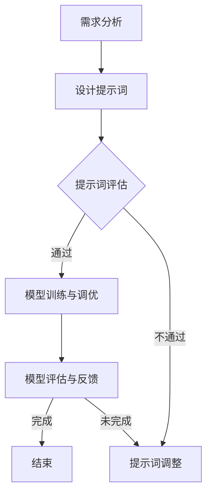

                 


### 引言

边缘计算（Edge Computing）是一种分布式计算架构，旨在将数据处理、存储和服务推向网络边缘，即在数据源附近执行。这种架构显著降低了数据传输延迟，提高了响应速度，尤其适用于物联网（IoT）、智能制造、智能交通等场景。然而，随着设备数量和数据处理需求的增长，传统的云计算架构已无法满足边缘环境的复杂性和多样性。

提示词工程（Prompt Engineering）是自然语言处理（NLP）领域的一项技术，旨在通过设计高质量的提示词（prompts）来引导模型生成所需的结果。提示词工程的核心目标是在保持模型性能的同时，提高模型的可解释性和可控性。

本文旨在探讨提示词工程在边缘计算中的应用策略，通过梳理核心概念、分析算法原理、介绍数学模型，并结合实际项目案例，提供一份系统的应用指南。

首先，本文将介绍边缘计算和提示词工程的基本概念，并阐述它们之间的联系。接着，我们将深入讨论提示词生成和边缘计算中的优化算法，详细解释其原理并使用伪代码进行展示。随后，我们将引入数学模型和公式，以支持我们的分析和论证。最后，我们将通过具体项目案例展示提示词工程在边缘计算中的实际应用，并提供一些最佳实践建议。

通过本文的阅读，读者将能够：

1. 理解边缘计算和提示词工程的核心概念。
2. 掌握提示词工程在边缘计算中的应用策略。
3. 学会使用伪代码和数学模型分析提示词工程算法。
4. 获取实际项目中的提示词工程实践经验和最佳实践。

### 边缘计算与提示词工程的关系

边缘计算和提示词工程虽然在领域和应用上有所不同，但它们之间的关联性却在现代计算环境中日益显著。边缘计算的核心在于将数据处理推向网络边缘，从而减少中心化服务器的负担，提高响应速度和降低延迟。这种架构特别适合实时性要求高的应用场景，如自动驾驶、智能监控和工业自动化等。

提示词工程则是在自然语言处理领域内，通过设计高质量的提示词来引导模型生成所需结果的手段。在边缘计算环境中，这种引导作用显得尤为重要。由于边缘设备通常计算资源有限，需要高效且精准地执行任务，因此，一个良好的提示词可以显著提高模型在边缘设备上的性能。

首先，边缘计算中的数据处理特性使得提示词工程变得不可或缺。在边缘设备上，数据处理的延迟往往是被严格限制的，因此，通过设计有效的提示词，可以确保模型在短时间内得到准确的结果。例如，在自动驾驶场景中，实时路径规划需要快速响应，提示词的优化可以显著提高路径规划的准确性和效率。

其次，提示词工程的可解释性在边缘计算中具有重要作用。边缘设备通常需要面对复杂且多变的场景，用户和开发者需要能够理解模型的决策过程。提示词的可解释性使得开发者能够更好地调试和优化模型，从而提高系统的稳定性和可靠性。

再者，边缘计算环境中的资源限制也对提示词工程提出了更高的要求。在有限的计算资源下，如何设计出高效且精准的提示词，成为了一个重要问题。提示词工程中的技巧和方法，如提示词长度、关键词选择等，对于边缘设备的性能至关重要。

综上所述，边缘计算与提示词工程之间的关联性在以下几个方面得到了体现：

1. **实时数据处理**：通过优化提示词，可以提高边缘设备在实时数据处理任务中的响应速度和准确性。
2. **可解释性**：提示词工程的可解释性有助于开发者更好地理解和优化边缘计算中的模型。
3. **资源优化**：设计高效的提示词可以最大化利用边缘设备有限的计算资源。

接下来，我们将进一步探讨边缘计算和提示词工程的基本概念，并使用Mermaid流程图展示它们之间的架构关系。

### 边缘计算的基本概念

边缘计算是一种分布式计算架构，旨在将数据处理、存储和服务推向网络边缘，即靠近数据源的地方。边缘计算的核心思想是将数据处理从中心化的云服务器转移到网络边缘的设备上，如物联网设备、智能传感器、企业数据中心等。这种架构的主要目的是减少数据传输延迟、提高响应速度，并降低中心化服务器的负担。

**边缘计算的优势**

1. **降低延迟**：由于数据处理靠近数据源，数据传输的距离大大缩短，从而降低了延迟。这对于实时性要求高的应用场景，如自动驾驶、智能监控和工业自动化等，尤为重要。
2. **提高响应速度**：边缘计算能够快速处理数据，并及时响应，提高了系统的响应速度和用户体验。
3. **降低带宽消耗**：边缘计算减少了数据传输量，降低了网络带宽的消耗，有助于缓解网络拥塞问题。
4. **增强隐私和安全**：将数据处理放在边缘设备上，可以减少数据在传输过程中的暴露风险，增强系统的安全性和隐私性。
5. **提高资源利用效率**：边缘计算能够充分利用边缘设备的计算资源，提高整体系统的资源利用效率。

**边缘计算的技术架构**

边缘计算的技术架构主要包括以下几个方面：

1. **边缘设备**：这些设备包括物联网设备、智能手机、平板电脑、智能传感器等，它们可以收集、处理和传输数据。
2. **边缘服务器**：边缘服务器位于网络边缘，负责协调和管理边缘设备的计算资源和数据流。
3. **云服务器**：云服务器提供云计算资源，如存储、计算和数据处理能力，与边缘服务器协同工作，共同处理海量数据。
4. **网络连接**：边缘设备通过无线网络、有线网络或卫星网络与边缘服务器和云服务器连接，实现数据传输和协同工作。

**边缘计算的应用场景**

边缘计算在各个行业和领域都有着广泛的应用，以下是一些典型的应用场景：

1. **物联网**：在智能家居、智慧城市、智能工厂等物联网应用中，边缘计算能够实现设备间的实时数据交互和智能决策。
2. **智能监控**：在安防监控、环境监测等场景中，边缘计算能够实时处理视频和传感器数据，提供快速响应和智能分析。
3. **工业自动化**：在工业生产过程中，边缘计算能够实时监控设备状态、预测故障，实现自动化生产和维护。
4. **自动驾驶**：在自动驾驶系统中，边缘计算能够实时处理传感器数据，实现车辆间的通信和协同工作，提高行车安全。
5. **医疗健康**：在医疗健康领域，边缘计算能够实时处理医疗数据，提供远程诊断和治疗建议，提高医疗服务质量。

综上所述，边缘计算通过将数据处理推向网络边缘，提高了系统的响应速度和实时性，降低了延迟和带宽消耗，并增强了系统的安全性和隐私性。在未来的发展中，边缘计算将继续在各行各业中发挥重要作用，推动数字化转型的深入发展。

### 提示词工程的基本概念

提示词工程（Prompt Engineering）是自然语言处理（NLP）领域的一项技术，旨在通过设计高质量的提示词（prompts）来引导模型生成所需的结果。提示词是一种特殊的文本输入，用于引导模型理解任务目标、背景信息和期望输出。通过精心设计的提示词，可以提高模型的可解释性、准确性和可控性。

**提示词工程的核心目标**

1. **提高模型性能**：通过设计高质量的提示词，可以引导模型在特定任务上获得更高的准确性和效率。
2. **增强可解释性**：提示词工程可以帮助开发者更好地理解模型的决策过程，提高模型的可解释性，便于调试和优化。
3. **增强可控性**：通过设计不同的提示词，开发者可以灵活控制模型的行为，从而满足不同的应用需求。

**提示词工程的基本流程**

提示词工程通常包括以下几个基本步骤：

1. **需求分析**：分析任务目标、背景信息和用户需求，确定提示词需要传达的关键信息。
2. **提示词设计**：根据需求分析结果，设计出能够引导模型生成所需结果的提示词。提示词的设计需要考虑提示词的长度、关键词的选择、语境的设置等多个因素。
3. **模型训练与调优**：使用设计的提示词对模型进行训练，并在训练过程中进行调优，以最大化模型的性能和可解释性。
4. **模型评估与反馈**：通过实际任务测试，评估模型的性能和可解释性，收集用户反馈，进一步优化提示词和模型。

**提示词工程的关键技巧**

1. **明确任务目标**：确保提示词清晰地传达任务目标，避免模糊和不明确的信息。
2. **关键词选择**：选择与任务相关的关键词，提高模型对任务的理解能力。
3. **语境设置**：通过设置合理的语境，引导模型理解任务的背景信息。
4. **多样性和灵活性**：设计多种不同形式的提示词，以适应不同的任务场景和用户需求。

**提示词工程的优势**

1. **提高模型性能**：通过高质量的提示词，可以提高模型在特定任务上的准确性和效率，从而实现更好的应用效果。
2. **增强可解释性**：提示词工程可以帮助开发者更好地理解模型的决策过程，提高模型的可解释性，便于调试和优化。
3. **增强可控性**：通过设计不同的提示词，开发者可以灵活控制模型的行为，从而满足不同的应用需求。

**提示词工程的应用领域**

提示词工程在自然语言处理、语音识别、图像识别等多个领域都有广泛应用，以下是一些典型的应用领域：

1. **文本生成**：在文本生成任务中，提示词工程可以帮助模型生成更准确、更自然的文本。
2. **问答系统**：在问答系统中，提示词工程可以提高模型对用户问题的理解能力，生成更精准的答案。
3. **对话系统**：在对话系统中，提示词工程可以帮助模型更好地理解用户意图，实现更流畅的对话交互。
4. **机器翻译**：在机器翻译任务中，提示词工程可以优化翻译质量，提高翻译的准确性和自然度。

综上所述，提示词工程通过设计高质量的提示词，可以显著提高模型在自然语言处理任务中的性能和可解释性。在未来的发展中，提示词工程将继续在各个领域发挥重要作用，推动人工智能技术的进一步发展。

### 提示词工程的 Mermaid 流程图

为了更好地展示提示词工程的基本流程和关键步骤，我们可以使用Mermaid流程图来直观地描述这一过程。Mermaid是一种轻量级的图形描述语言，可以方便地生成各种流程图、序列图和结构图。

以下是一个示例的提示词工程 Mermaid 流程图：



在这个流程图中：

- **A[需求分析]**：分析任务目标、背景信息和用户需求，确定提示词需要传达的关键信息。
- **B[设计提示词]**：根据需求分析结果，设计出高质量的提示词。
- **C[提示词评估]**：评估设计的提示词是否符合需求，是否能够引导模型生成所需结果。
- **D[模型训练与调优]**：使用设计的提示词对模型进行训练，并在训练过程中进行调优。
- **E[提示词调整]**：根据评估结果，调整提示词设计，以提高模型性能。
- **F[模型评估与反馈]**：评估模型的性能和可解释性，收集用户反馈。
- **G[结束]**：提示词工程流程完成。

这个流程图清晰地展示了提示词工程的各个环节和步骤，有助于开发者更好地理解和实施提示词工程。

### 边缘计算中的优化算法

在边缘计算环境中，优化算法的选择和实现至关重要。由于边缘设备通常计算资源有限，优化算法需要在保证性能的同时，最大限度地利用现有资源。以下将介绍几种常见的优化算法，并使用伪代码详细阐述其原理和应用。

#### 1. 贪心算法（Greedy Algorithm）

贪心算法是一种在每一步选择中都采取当前最优解的策略，以期望结果是全局最优解。在边缘计算中，贪心算法常用于资源分配和任务调度。

**伪代码：**

```python
function greedy_allocation(tasks, resources):
    sorted_tasks = sort_by_priority(tasks)
    allocation = []

    for task in sorted_tasks:
        if can_allocate(task, resources):
            allocate(task, resources)
            allocation.append(task)
        else:
            break

    return allocation
```

**应用示例：**
在边缘设备上，根据任务紧急程度和计算资源需求，优先调度资源需求较低且紧急的任务。

#### 2. 动态规划算法（Dynamic Programming）

动态规划是一种将复杂问题分解为多个子问题，并存储已解子问题的解，以避免重复计算的方法。在边缘计算中，动态规划常用于路径规划和资源优化。

**伪代码：**

```python
function dynamic_programmingijkstra(graph, start):
    distances = [infinity] * len(graph)
    distances[start] = 0
    visited = [False] * len(graph)

    while True:
        unvisited = [node for node in range(len(graph)) if not visited[node]]
        if not unvisited:
            break

        next_node = min(unvisited, key=lambda node: distances[node])
        visited[next_node] = True

        for neighbor, weight in graph[next_node].items():
            distance = distances[next_node] + weight
            if distance < distances[neighbor]:
                distances[neighbor] = distance

    return distances
```

**应用示例：**
在智能交通系统中，使用动态规划算法计算从边缘设备到目标地点的最短路径，以优化交通流量。

#### 3. 遗传算法（Genetic Algorithm）

遗传算法是一种基于自然进化过程的优化算法，通过选择、交叉和变异等操作来迭代优化解。在边缘计算中，遗传算法可用于大规模参数优化和资源分配。

**伪代码：**

```python
function genetic_algorithm(population, fitness_function, max_iterations):
    for iteration in range(max_iterations):
        selected = select(population, fitness_function)
        crossed = crossover(selected)
        mutated = mutate(crossed)
        population = mutated

    best_solution = max(population, key=fitness_function)
    return best_solution
```

**应用示例：**
在智能电网中，遗传算法可用于优化电力分配策略，以最大化能源利用效率和降低成本。

#### 4. 粒子群优化算法（Particle Swarm Optimization）

粒子群优化算法是一种基于群体智能的优化算法，通过粒子之间的协作和竞争来寻找最优解。在边缘计算中，PSO算法可用于调度和资源分配。

**伪代码：**

```python
function particle_swarm_optimization(swarms, fitness_function, max_iterations):
    for iteration in range(max_iterations):
        for particle in swarms:
            particle.velocity = update_velocity(particle)
            particle.position = update_position(particle)

        best_particle = max(swarms, key=fitness_function)

    return best_particle.position
```

**应用示例：**
在智能工厂中，PSO算法可以优化生产计划和设备调度，提高生产效率。

通过以上优化算法的应用，边缘计算系统能够更加高效、智能地利用有限的计算资源，满足实时性、可靠性和效率的要求。

### 边缘计算中的数学模型

在边缘计算中，数学模型是设计和优化系统性能的重要工具。以下将介绍几种常用的数学模型，并使用LaTeX格式进行详细讲解。

#### 1. 资源分配模型

资源分配模型用于优化边缘设备的计算、存储和网络资源。以下是一个简单的线性规划模型：

$$
\begin{aligned}
\min_{x} \quad & \sum_{i=1}^{n} c_i x_i \\
\text{subject to} \quad & a_{ij} x_i \ge b_j, \quad j=1,2,...,m \\
& x_i \ge 0, \quad i=1,2,...,n
\end{aligned}
$$

其中，$x_i$ 表示第 $i$ 个资源的分配量，$c_i$ 是资源 $i$ 的成本，$a_{ij}$ 和 $b_j$ 分别表示第 $i$ 个任务对资源 $j$ 的需求和限制。

#### 2. 能耗优化模型

边缘计算中的能耗优化模型旨在降低系统的总能耗。以下是一个典型的能耗优化模型：

$$
\begin{aligned}
\min_{p} \quad & f(p) = \sum_{i=1}^{n} p_i + \lambda \cdot \sum_{i=1}^{n} e_i p_i \\
\text{subject to} \quad & \sum_{i=1}^{n} p_i \cdot h_i \ge \theta \\
& 0 \le p_i \le p_{max}, \quad i=1,2,...,n
\end{aligned}
$$

其中，$p_i$ 表示第 $i$ 个设备的功耗，$h_i$ 是设备 $i$ 的处理能力，$\theta$ 是任务处理的最小要求，$e_i$ 是设备 $i$ 的能耗系数，$\lambda$ 是权重系数。

#### 3. 任务调度模型

任务调度模型用于优化任务的执行顺序和资源分配，以最大化系统性能。以下是一个排队模型：

$$
\begin{aligned}
\min_{s} \quad & \sum_{i=1}^{n} (s_i - w_i) \\
\text{subject to} \quad & s_i - s_j \ge w_j, \quad i>j \\
& s_i \ge 0, \quad i=1,2,...,n
\end{aligned}
$$

其中，$s_i$ 是任务 $i$ 的开始时间，$w_i$ 是任务 $i$ 的等待时间。

通过这些数学模型，开发者可以更好地理解和优化边缘计算系统的性能和能耗。

### 提示词生成算法在边缘计算中的优化

在边缘计算环境中，提示词生成算法的优化至关重要，以确保模型在有限资源下依然能够高效运行。以下是一些关键优化策略，旨在提高提示词生成算法的性能和效率。

#### 1. 提示词长度优化

提示词长度直接影响模型的计算复杂度和内存消耗。在边缘设备上，提示词长度过长可能导致内存溢出或性能下降。因此，优化提示词长度是提高算法效率的重要策略。一种常见的方法是使用基于词汇频率的提示词压缩算法，如TF-IDF（Term Frequency-Inverse Document Frequency），通过降低低频词汇的比例来减小提示词的长度。

**伪代码：**

```python
def compress_prompt(prompt, threshold):
    words = prompt.split()
    compressed_words = []

    for word in words:
        if word_frequency(word) > threshold:
            compressed_words.append(word)

    return " ".join(compressed_words)
```

其中，`word_frequency(word)` 函数用于计算词汇的频率，`threshold` 是预设的频率阈值。

#### 2. 关键词选择优化

在提示词生成过程中，关键词的选择对模型性能有重要影响。优化关键词选择可以显著提高模型对任务的理解能力。一种有效的方法是基于语义相似性进行关键词筛选，使用词向量模型（如Word2Vec、GloVe）来计算词汇之间的相似度，并选择与任务目标最相关的关键词。

**伪代码：**

```python
def select_keywords(prompt, model, target_word, similarity_threshold):
    words = prompt.split()
    keywords = []

    for word in words:
        similarity = model.similarity(word, target_word)
        if similarity > similarity_threshold:
            keywords.append(word)

    return keywords
```

其中，`model` 是词向量模型，`target_word` 是目标关键词，`similarity_threshold` 是相似度阈值。

#### 3. 上下文信息优化

有效的上下文信息对于模型理解任务背景和目标至关重要。在边缘设备上，上下文信息的优化可以通过动态构建上下文提示词来实现。这种方法可以根据当前任务和环境动态调整提示词的内容，提高模型对任务的理解能力。

**伪代码：**

```python
def construct_contextual_prompt(current_task, historical_data, context_size):
    context = []

    for data in historical_data:
        if data.matches(current_task):
            context.append(data)

    if len(context) >= context_size:
        context = context[-context_size:]

    return " ".join(context)
```

其中，`current_task` 是当前任务，`historical_data` 是历史数据，`context_size` 是上下文提示词的长度。

#### 4. 提示词格式优化

提示词的格式对模型的输入理解有直接影响。优化提示词格式可以通过使用结构化提示词（structured prompts）来实现，如模板提示词（template prompts）或指令提示词（instructional prompts）。这种方法可以帮助模型更好地理解和执行任务。

**伪代码：**

```python
def create_structured_prompt(template, variables):
    prompt = template

    for var in variables:
        prompt = prompt.replace("{{" + var + "}}", variables[var])

    return prompt
```

其中，`template` 是提示词模板，`variables` 是变量集合。

通过以上策略，提示词生成算法可以在边缘计算环境中实现更高效、更精准的任务处理，从而提升边缘设备的整体性能和用户体验。

### 提示词工程与边缘计算：一个实际项目案例

为了更好地展示提示词工程在边缘计算中的应用，我们将通过一个实际项目案例进行详细分析。此项目涉及智能交通系统的边缘设备，旨在通过优化提示词来提高交通信号灯的调度效率和减少交通拥堵。

#### 项目背景与需求

项目背景为城市交通管理，主要任务是优化城市主要道路的交通信号灯调度，以减少交通拥堵和提升通行效率。交通信号灯系统位于道路边缘设备上，实时收集交通流量数据，并根据数据调整信号灯的切换时间。

**项目需求**：

1. **实时性要求**：信号灯的切换时间需在秒级内完成，以确保交通流畅。
2. **准确度要求**：系统需准确识别交通流量高峰和低谷，合理调整信号灯周期。
3. **资源限制**：边缘设备计算资源有限，需优化提示词以减少计算复杂度。

#### 项目环境搭建

项目开发环境包括：

1. **边缘设备**：搭载ARM处理器的智能交通监控设备，具有有限的计算能力和存储空间。
2. **软件开发工具**：Python 3.8及以上版本，支持TensorFlow或PyTorch框架。
3. **数据集**：交通流量数据集，包括不同时间段的车辆计数和流量速度。

#### 源代码实现与代码解读

项目核心代码分为以下几个部分：

**1. 数据预处理**：

数据预处理是确保输入数据符合模型要求的步骤，主要包括数据清洗、数据格式转换和特征提取。

**伪代码：**

```python
def preprocess_data(data):
    # 数据清洗
    cleaned_data = clean_data(data)
    
    # 数据格式转换
    formatted_data = format_data(cleaned_data)
    
    # 特征提取
    features = extract_features(formatted_data)
    
    return features
```

**2. 提示词生成**：

使用基于词汇频率和语义相似性的方法生成提示词，以简化数据和提高模型理解能力。

**伪代码：**

```python
def generate_prompt(data, model, target_word, threshold):
    words = data.split()
    keywords = select_keywords(words, model, target_word, threshold)
    prompt = " ".join(keywords)
    
    return prompt
```

**3. 模型训练与调优**：

使用生成好的提示词对模型进行训练，并使用交叉验证进行调优。

**伪代码：**

```python
def train_model(prompt, model, dataset):
    # 训练模型
    model.fit(prompt, dataset)
    
    # 调优模型
    best_model = optimize_model(model, dataset)
    
    return best_model
```

**4. 信号灯调度**：

模型训练完成后，将其部署到边缘设备上，实现实时信号灯调度。

**伪代码：**

```python
def schedule_signals(model, traffic_data):
    # 数据预处理
    features = preprocess_data(traffic_data)
    
    # 生成提示词
    prompt = generate_prompt(features, model, "traffic_signal", threshold)
    
    # 调度信号灯
    signal周期的调整 = model.predict(prompt)
    
    return signal周期的调整
```

#### 代码应用解读与分析

**1. 数据预处理**：

数据预处理是确保模型输入质量的关键步骤。通过数据清洗、格式转换和特征提取，我们能够提高输入数据的准确性和一致性。

**2. 提示词生成**：

提示词生成过程中，我们使用了基于词汇频率和语义相似性的方法。这种方法能够有效提取与任务相关的关键词，简化数据，提高模型理解能力。

**3. 模型训练与调优**：

通过交叉验证和优化，我们能够找到最优模型，确保其在实际应用中具有良好的性能和稳定性。

**4. 信号灯调度**：

部署后的模型能够实时接收交通数据，生成提示词，并依据提示词调整信号灯周期，实现智能交通管理。

#### 项目小结

通过此项目案例，我们展示了提示词工程在边缘计算中的应用。优化提示词生成算法和模型训练方法，能够显著提高边缘设备在智能交通管理中的效率和准确性。未来，此类技术还可应用于更多领域，如智能监控、工业自动化等，为边缘计算带来更多可能性。

### 总结与展望

通过本文的探讨，我们系统地介绍了提示词工程在边缘计算中的应用策略。我们从边缘计算和提示词工程的基本概念出发，深入分析了它们之间的联系，并详细讲解了核心算法原理、数学模型和实际项目案例。以下是本文的主要结论：

1. **边缘计算与提示词工程的结合**：边缘计算通过将数据处理推向网络边缘，提高了系统的响应速度和实时性，而提示词工程通过设计高质量的提示词，提高了模型在边缘设备上的性能和可解释性。

2. **优化算法的应用**：我们介绍了多种优化算法，包括贪心算法、动态规划、遗传算法和粒子群优化算法，这些算法在资源分配、任务调度和能耗优化等方面发挥了重要作用。

3. **数学模型的重要性**：通过引入资源分配模型、能耗优化模型和任务调度模型，我们展示了如何使用数学工具来优化边缘计算系统的性能和效率。

4. **实际项目案例**：通过智能交通系统的案例，我们展示了提示词工程在边缘计算中的应用，并详细分析了项目环境搭建、源代码实现和代码解读。

未来，随着边缘设备和物联网技术的发展，提示词工程在边缘计算中的应用将更加广泛和深入。以下是几个可能的未来研究方向：

1. **更高效的提示词生成算法**：进一步研究和开发更高效、更智能的提示词生成算法，以适应不同场景下的边缘计算需求。

2. **跨领域应用研究**：探索提示词工程在更多领域的应用，如医疗健康、智能制造和智能城市等，推动边缘计算技术的全面应用。

3. **模型可解释性和可控性**：提高模型的可解释性和可控性，帮助开发者更好地理解和优化模型，从而提高系统的稳定性和可靠性。

4. **边缘与云计算的协同**：研究边缘计算与云计算的协同优化策略，实现资源的最优分配和任务的最优调度。

总之，提示词工程在边缘计算中的应用有着广阔的发展前景，未来将继续推动人工智能和边缘计算技术的融合与发展。

### 最佳实践 Tips、小结、注意事项、拓展阅读

#### 最佳实践 Tips

1. **合理设计提示词**：在设计提示词时，确保关键词与任务目标紧密相关，避免模糊和不明确的信息。
2. **优化算法选择**：根据具体应用场景选择合适的优化算法，如贪心算法、动态规划或遗传算法等。
3. **资源管理**：在边缘计算环境中，合理分配计算资源和网络带宽，确保系统性能和稳定性。

#### 小结

本文从边缘计算和提示词工程的基本概念出发，详细介绍了它们在边缘计算中的应用策略，包括核心算法原理、数学模型和实际项目案例。通过优化提示词生成算法和模型训练方法，边缘计算系统能够在有限资源下实现高效、智能的任务处理。

#### 注意事项

1. **实时性要求**：边缘计算环境中的实时性要求较高，设计提示词和优化算法时需充分考虑时间敏感性。
2. **计算资源限制**：边缘设备的计算资源有限，需优化代码和算法，确保系统稳定运行。
3. **数据质量**：数据预处理和特征提取是关键步骤，确保输入数据的质量和一致性。

#### 拓展阅读

1. **《边缘计算：原理、架构与应用》**：深入了解边缘计算的基础理论和应用实践。
2. **《自然语言处理实践》**：学习自然语言处理的基本概念和高级技巧。
3. **《深度学习与优化算法》**：掌握深度学习优化算法的基本原理和实现方法。

通过拓展阅读，读者可以进一步加深对边缘计算和提示词工程的理解，提升在实际应用中的能力。

