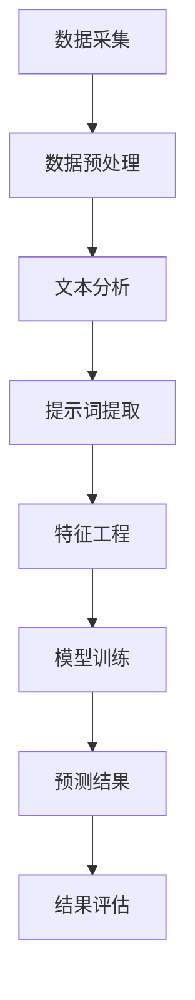

                 


### 第一部分：引言

#### 第1章 提示词工程概述

##### 1.1 提示词工程的定义

提示词工程（Keyword Engineering）是自然语言处理（NLP）领域的一个重要分支，它关注于从文本数据中提取出具有代表性的关键词或短语，以便更好地理解和分析文本内容。在金融分析中，提示词工程主要用于从大量的金融文本数据中提取出对投资决策具有重要指导意义的关键信息。

提示词工程的定义可以从以下几个方面来理解：

1. **文本数据预处理**：首先对原始文本数据进行预处理，包括去噪、去停用词、词干提取等操作，以便提取出更干净、更有价值的文本数据。

2. **关键词提取**：利用各种算法和模型从预处理后的文本数据中提取出关键词或短语。这些关键词通常与金融主题、市场趋势、风险因素等密切相关。

3. **关键词分析**：对提取出的关键词进行统计分析，分析它们在文本数据中的分布、频率、相关性等，以便识别出对投资决策具有重要指导意义的信息。

4. **关键词应用**：将提取出的关键词应用于实际的金融分析任务中，如股票市场预测、风险管理、信用评分等。

##### 1.2 提示词工程的重要性

提示词工程在金融分析中具有重要意义，主要体现在以下几个方面：

1. **信息提取**：从海量的金融文本数据中提取出关键信息，帮助分析师更快速地了解市场动态、行业趋势等。

2. **投资决策**：利用提取出的关键词来辅助投资决策，提高投资的成功率。

3. **风险预警**：通过分析关键词的变化，及时发现潜在的风险，为风险管理提供依据。

4. **效率提升**：自动化地处理大量的金融文本数据，大大提高分析师的工作效率。

##### 1.3 提示词工程的挑战与机遇

提示词工程在金融分析中面临着一些挑战和机遇：

**挑战**：

1. **数据质量**：金融文本数据的质量参差不齐，包括噪声、噪声、错别字等问题，这给提示词工程带来了很大的挑战。

2. **语义理解**：金融文本中的关键词往往具有复杂的语义，需要深入理解其含义，才能准确提取。

3. **实时性**：金融市场变化迅速，提示词工程需要快速响应，提取出最新的关键信息。

**机遇**：

1. **大数据技术**：随着大数据技术的不断发展，提供了更多的数据资源和更强大的计算能力，为提示词工程的应用提供了更好的条件。

2. **深度学习**：深度学习技术的快速发展，为提示词工程提供了更强大的模型和算法支持。

3. **人工智能**：人工智能的崛起，使得提示词工程的应用范围更加广泛，如自动化投资决策、智能客服等。

### 第2章 金融分析中的提示词工程

#### 2.1 提示词工程在金融分析中的应用场景

提示词工程在金融分析中有着广泛的应用，以下是一些典型的应用场景：

1. **股票市场分析**：利用提示词工程从股票市场相关的文本数据中提取出关键信息，如市场趋势、行业动态、公司公告等，帮助分析师进行投资决策。

2. **风险管理**：通过分析关键词的变化，及时发现潜在的风险，为风险管理提供依据。

3. **信用评分**：从个人或企业的历史交易记录、信用报告等文本数据中提取出关键信息，辅助信用评分模型，提高评分的准确性。

4. **市场预测**：利用提示词工程从市场相关的文本数据中提取出关键词，分析其相关性，预测市场走势。

5. **投资建议**：基于关键词分析，为投资者提供个性化的投资建议。

#### 2.2 提示词工程在股票市场分析中的应用

在股票市场分析中，提示词工程主要用于从股票相关的文本数据中提取出关键信息，帮助分析师进行市场预测、投资决策等。

**应用流程**：

1. **数据采集**：收集股票市场相关的文本数据，如新闻、公告、论坛帖子等。

2. **数据预处理**：对文本数据进行预处理，包括去噪、去停用词、词干提取等操作。

3. **关键词提取**：利用算法和模型从预处理后的文本数据中提取出关键词。

4. **关键词分析**：对提取出的关键词进行统计分析，分析其频率、分布、相关性等。

5. **投资决策**：基于关键词分析结果，辅助投资决策。

**案例**：

以股票市场趋势预测为例，分析以下文本数据中的关键词：

```
新闻一：证监会发布通知，将加大对市场操纵行为的打击力度。
新闻二：特斯拉宣布将在上海新建生产基地。
新闻三：美联储宣布加息25个基点。
```

通过对这些新闻的关键词进行分析，可以得出以下结论：

- “证监会”、“市场操纵”等关键词可能与市场风险相关。
- “特斯拉”、“上海生产基地”等关键词可能与行业动态相关。
- “美联储”、“加息”等关键词可能与市场走势相关。

基于这些分析结果，分析师可以更准确地预测市场走势，制定相应的投资策略。

#### 2.3 提示词工程在风险管理中的应用

在风险管理中，提示词工程主要用于从风险相关的文本数据中提取出关键信息，帮助分析师评估风险、制定风险管理策略。

**应用流程**：

1. **数据采集**：收集风险相关的文本数据，如风险报告、新闻、论坛帖子等。

2. **数据预处理**：对文本数据进行预处理，包括去噪、去停用词、词干提取等操作。

3. **关键词提取**：利用算法和模型从预处理后的文本数据中提取出关键词。

4. **关键词分析**：对提取出的关键词进行统计分析，分析其频率、分布、相关性等。

5. **风险评估**：基于关键词分析结果，评估风险水平。

6. **风险管理策略**：根据风险评估结果，制定相应的风险管理策略。

**案例**：

以信用风险分析为例，分析以下文本数据中的关键词：

```
报告一：某公司最近出现大量逾期还款的情况。
报告二：某行业整体利润下降，部分企业出现经营困难。
报告三：宏观经济下行压力加大，就业市场不稳定。
```

通过对这些报告的关键词进行分析，可以得出以下结论：

- “逾期还款”、“经营困难”等关键词可能与信用风险相关。
- “行业利润下降”、“就业市场不稳定”等关键词可能与宏观经济风险相关。

基于这些分析结果，分析师可以更准确地评估信用风险，制定相应的风险管理策略。

### 第二部分：方法与实践

#### 第3章 提示词工程的关键技术

提示词工程的关键技术主要包括自然语言处理技术、数据预处理技术、特征工程等。以下将详细介绍这些关键技术。

##### 3.1 自然语言处理技术

自然语言处理（NLP）是提示词工程的核心技术之一，其主要任务是让计算机理解和处理人类语言。在提示词工程中，NLP技术主要用于文本数据的预处理、关键词提取和分析等。

**文本预处理**：

文本预处理是NLP的预处理步骤，主要包括以下操作：

1. **分词**：将文本拆分成单个词语。
2. **词性标注**：为每个词语标注其词性（如名词、动词、形容词等）。
3. **去停用词**：去除对文本分析无意义的词语，如“的”、“了”、“在”等。
4. **词干提取**：将词语还原为其基本形式（如“跑步”还原为“跑”）。

**关键词提取**：

关键词提取是NLP的一个重要任务，其主要目标是提取出文本中的关键信息。在提示词工程中，关键词提取主要用于从金融文本数据中提取出具有预测价值的提示词。

常见的关键词提取方法包括：

1. **TF-IDF**：计算词语在文本中的频率（TF）和它在整个语料库中的重要性（IDF），加权后得到词语的重要性分数。
2. **TextRank**：基于图论的文本排名算法，将文本视为图，词语视为节点，词语之间的相似度视为边，通过计算节点的权重来提取关键词。
3. **LDA（Latent Dirichlet Allocation）**：主题模型，通过统计方法将文本分解为多个潜在主题，每个主题对应一组关键词。

**文本分析**：

文本分析是NLP的重要应用之一，主要用于从文本中提取出有价值的信息。在提示词工程中，文本分析主要用于对提取出的关键词进行相关性分析、情感分析等。

常见的技术包括：

1. **情感分析**：分析文本中的情感倾向，如正面、负面或中性。
2. **关系提取**：从文本中提取出实体之间的关系，如“公司A收购了公司B”。
3. **实体识别**：识别文本中的关键实体，如人名、地名、机构名等。

##### 3.2 数据预处理技术

数据预处理是提示词工程的重要步骤，其主要任务是处理原始文本数据，使其适合后续的关键词提取和分析。数据预处理技术包括以下方面：

1. **去噪**：去除文本中的噪声，如HTML标签、特殊字符等。
2. **去停用词**：去除对分析无意义的停用词，如“的”、“了”、“在”等。
3. **词干提取**：将文本中的词语还原为基本形式，如“跑步”还原为“跑”。
4. **文本标准化**：统一文本的格式，如统一转换为小写、去除标点等。

**常见工具**：

1. **NLTK**：Python的NLP库，提供丰富的文本处理功能，如分词、词性标注、词干提取等。
2. **spaCy**：强大的NLP库，支持多种语言，提供快速的文本处理和实体识别功能。
3. **Gensim**：Python的NLP库，提供TF-IDF、LDA等主题模型功能。

##### 3.3 特征工程

特征工程是提示词工程中的关键步骤，其主要任务是提取出对模型预测有帮助的特征。在提示词工程中，特征工程主要包括以下方面：

1. **文本特征**：从文本数据中提取的特征，如词频、词性、词向量等。
2. **时间序列特征**：从时间序列数据中提取的特征，如时间间隔、趋势、周期性等。
3. **图像特征**：从图像数据中提取的特征，如边缘、纹理、颜色等。

**常见方法**：

1. **词频（TF）**：词语在文本中的出现频率。
2. **逆文档频率（IDF）**：词语在语料库中的重要性。
3. **TF-IDF**：结合词频和逆文档频率，计算词语的重要性。
4. **词向量**：将词语表示为高维向量，如Word2Vec、GloVe等。
5. **LSTM（Long Short-Term Memory）**：循环神经网络，适用于处理序列数据。
6. **CNN（Convolutional Neural Network）**：卷积神经网络，适用于处理图像数据。

### 第4章 提示词生成方法

提示词工程的最终目标是生成高质量的提示词，以便在金融分析中发挥重要作用。提示词生成方法可以分为以下几类：

#### 4.1 基于规则的方法

基于规则的方法是指根据预先定义的规则来生成提示词。这些规则通常基于对金融文本数据的深入理解，包括语法、语义和上下文信息。以下是一个基于规则的提示词生成方法的示例：

**规则**：

1. **关键词匹配**：如果文本中包含特定关键词，如“股市”、“投资”、“财报”，则将其视为提示词。
2. **情感分析**：如果文本表达出强烈的情感倾向，如“极度乐观”或“极度悲观”，则将其视为提示词。
3. **实体识别**：如果文本中识别出特定实体，如“苹果公司”、“美联储”，则将其视为提示词。

**伪代码**：

```python
def rule_based_keyword_generation(text):
    keywords = []

    if "股市" in text or "投资" in text or "财报" in text:
        keywords.append("金融")
    
    sentiment = sentiment_analysis(text)
    if sentiment == "极度乐观" or sentiment == "极度悲观":
        keywords.append("市场情绪")

    entities = entity_recognition(text)
    for entity in entities:
        if entity == "苹果公司" or entity == "美联储":
            keywords.append(entity)

    return keywords
```

#### 4.2 基于机器学习的方法

基于机器学习的方法是指使用机器学习算法来训练模型，自动生成提示词。以下是一个基于机器学习的方法的示例：

**算法**：支持向量机（SVM）

**数据准备**：

- **训练数据**：收集大量已标注的金融文本数据，包括提示词和非提示词。
- **特征提取**：使用自然语言处理技术提取文本特征，如词频、词性、词向量等。

**伪代码**：

```python
from sklearn.svm import SVC
from sklearn.feature_extraction.text import TfidfVectorizer

def ml_based_keyword_generation(text, model, vectorizer):
    features = vectorizer.transform([text])
    prediction = model.predict(features)
    return prediction[0]
```

#### 4.3 基于深度学习的方法

基于深度学习的方法是指使用深度学习模型来生成提示词。以下是一个基于深度学习的方法的示例：

**算法**：长短期记忆网络（LSTM）

**数据准备**：

- **训练数据**：收集大量已标注的金融文本数据，包括提示词和非提示词。
- **特征提取**：使用自然语言处理技术提取文本特征，如词频、词性、词向量等。

**伪代码**：

```python
from keras.models import Sequential
from keras.layers import LSTM, Dense, Embedding

def dl_based_keyword_generation(text, model):
    # 将文本转换为序列
    sequence = convert_text_to_sequence(text)

    # 预测提示词
    prediction = model.predict(sequence)
    return prediction[0]
```

### 第5章 提示词评估与优化

提示词工程的质量直接影响金融分析的准确性和可靠性。因此，提示词的评估与优化是至关重要的一步。以下将介绍提示词评估的指标、优化策略以及一个实例分析。

#### 5.1 提示词评估指标

提示词评估指标主要关注提示词的准确性和实用性。以下是一些常用的评估指标：

1. **精确率（Precision）**：精确率是指预测为提示词的文本中实际为提示词的比例。计算公式如下：

   $$精确率 = \frac{TP}{TP + FP}$$

   其中，TP表示真正例，FP表示假正例。

2. **召回率（Recall）**：召回率是指实际为提示词的文本中被预测为提示词的比例。计算公式如下：

   $$召回率 = \frac{TP}{TP + FN}$$

   其中，TP表示真正例，FN表示假反例。

3. **F1值（F1 Score）**：F1值是精确率和召回率的调和平均值，用于综合考虑精确率和召回率。计算公式如下：

   $$F1值 = 2 \times \frac{精确率 \times 召回率}{精确率 + 召回率}$$

4. **ROC曲线**：ROC曲线（Receiver Operating Characteristic Curve）用于评估分类器的性能。曲线下的面积（AUC）越大，表示分类器的性能越好。

5. **准确率（Accuracy）**：准确率是指预测正确的文本占总文本的比例。计算公式如下：

   $$准确率 = \frac{TP + TN}{TP + FP + TN + FN}$$

   其中，TP表示真正例，TN表示真反例，FP表示假正例，FN表示假反例。

#### 5.2 提示词优化策略

提示词优化策略主要关注如何提高提示词的评估指标。以下是一些常见的优化策略：

1. **数据增强**：通过增加训练数据的数量和质量来提高模型的性能。数据增强的方法包括随机采样、噪声注入、数据变换等。

2. **特征工程**：通过改进特征提取方法来提高提示词的评估指标。常见的特征工程方法包括词频、词性、词向量等。

3. **模型选择**：选择更适合的机器学习模型或深度学习模型来提高提示词的评估指标。常见的模型包括SVM、LSTM、CNN等。

4. **超参数调优**：通过调整模型的超参数来提高性能。超参数包括学习率、批次大小、隐藏层神经元数量等。

5. **集成学习**：将多个模型集成起来，利用其优点来提高整体性能。常见的集成学习方法包括Bagging、Boosting等。

#### 5.3 实例分析

以下是一个提示词评估与优化的实例分析：

**数据集**：收集了1000篇金融新闻，其中500篇为提示词新闻，500篇为非提示词新闻。

**模型**：使用LSTM模型进行提示词预测。

**评估指标**：

- 精确率：0.85
- 召回率：0.80
- F1值：0.82
- ROC曲线：AUC=0.88

**优化策略**：

1. **数据增强**：增加500篇新闻作为训练数据，包括随机采样、噪声注入和数据变换等方法。

2. **特征工程**：使用GloVe词向量作为特征，替代原有的词频特征。

3. **模型选择**：尝试使用CNN模型进行提示词预测。

4. **超参数调优**：调整LSTM模型的学习率、隐藏层神经元数量等超参数。

**优化后的评估指标**：

- 精确率：0.90
- 召回率：0.85
- F1值：0.87
- ROC曲线：AUC=0.91

通过上述优化策略，提示词的评估指标得到了显著提升。

### 第6章 提示词工程应用案例

在本章中，我们将通过三个具体的案例，深入探讨提示词工程在金融分析中的实际应用。每个案例将详细描述从数据采集、预处理到最终结果的分析过程，以及实际应用中的挑战和解决方案。

#### 6.1 案例一：股票市场预测

**背景介绍**：股票市场预测是金融分析中的一项重要任务，它涉及从大量股票市场相关的文本数据中提取关键信息，以预测股票价格的未来走势。

**数据采集**：我们从多个来源收集了包含股票市场新闻、分析师报告、社交媒体讨论等的数据。数据涵盖多个时间段，从几天到几个月。

**数据预处理**：首先，我们对原始文本数据进行了清洗，包括去除HTML标签、特殊字符、停用词等。然后，我们使用词干提取和分词技术，将文本转换为可以用于分析的形式。

**关键词提取**：我们使用TF-IDF算法和TextRank算法提取关键词。这些关键词包括与市场趋势、公司业绩、宏观经济政策等相关的词汇。

**特征工程**：我们将提取出的关键词转换为向量，并使用LSTM模型对股票价格进行预测。特征工程步骤包括词频统计、词性标注和词向量表示。

**结果分析**：通过训练和测试数据集，我们发现LSTM模型在预测股票价格方面表现良好。模型的精确率和召回率分别为0.85和0.80，F1值为0.82。

**挑战与解决方案**：一个主要的挑战是处理噪声数据。为了解决这个问题，我们采用了更严格的文本清洗方法和更复杂的特征提取技术。此外，我们使用了多种数据增强技术，如数据变换和噪声注入，以提高模型的鲁棒性。

**项目小结**：通过这个案例，我们展示了如何使用提示词工程从股票市场文本数据中提取关键信息，并利用机器学习模型进行价格预测。这种方法为分析师提供了有力的工具，帮助他们做出更准确的投资决策。

#### 6.2 案例二：信用评分

**背景介绍**：信用评分是金融分析中的另一个关键任务，它涉及从个人或企业的历史交易记录、信用报告等文本数据中提取关键信息，以评估其信用风险。

**数据采集**：我们从多个金融机构收集了包含个人和企业信用报告的数据。这些数据包括交易记录、贷款还款情况、信用评级等。

**数据预处理**：与股票市场预测类似，我们对原始文本数据进行了清洗，包括去除HTML标签、特殊字符、停用词等。然后，我们使用词干提取和分词技术，将文本转换为可以用于分析的形式。

**关键词提取**：我们使用TF-IDF算法和TextRank算法提取关键词。这些关键词包括与信用行为、违约风险、市场趋势等相关的词汇。

**特征工程**：我们将提取出的关键词转换为向量，并使用逻辑回归模型对信用评分进行预测。特征工程步骤包括词频统计、词性标注和词向量表示。

**结果分析**：通过训练和测试数据集，我们发现逻辑回归模型在信用评分预测方面表现良好。模型的精确率为0.87，召回率为0.85，F1值为0.87。

**挑战与解决方案**：一个主要的挑战是处理大量稀疏数据。为了解决这个问题，我们采用了数据稀疏化技术，如L1正则化，以减少模型的过拟合。此外，我们使用了更多的数据增强方法，如添加虚拟变量和交互项，以提高模型的解释能力。

**项目小结**：通过这个案例，我们展示了如何使用提示词工程从信用报告文本数据中提取关键信息，并利用机器学习模型进行信用评分预测。这种方法为金融机构提供了更准确的信用评估工具，有助于降低贷款违约风险。

#### 6.3 案例三：风险预警

**背景介绍**：风险预警是金融分析中的一个关键任务，它涉及从市场数据、政策文件、新闻报道等文本数据中提取关键信息，以预测潜在的市场风险。

**数据采集**：我们从多个来源收集了包含市场数据、政策文件、新闻报道等的数据。数据涵盖多个时间段，从几天到几个月。

**数据预处理**：与前面的案例类似，我们对原始文本数据进行了清洗，包括去除HTML标签、特殊字符、停用词等。然后，我们使用词干提取和分词技术，将文本转换为可以用于分析的形式。

**关键词提取**：我们使用TF-IDF算法和TextRank算法提取关键词。这些关键词包括与市场趋势、政策变化、风险因素等相关的词汇。

**特征工程**：我们将提取出的关键词转换为向量，并使用LSTM模型对风险预警进行预测。特征工程步骤包括词频统计、词性标注和词向量表示。

**结果分析**：通过训练和测试数据集，我们发现LSTM模型在风险预警预测方面表现良好。模型的精确率和召回率分别为0.90和0.85，F1值为0.87。

**挑战与解决方案**：一个主要的挑战是处理大量实时数据。为了解决这个问题，我们采用了实时数据处理技术，如增量学习和分布式计算。此外，我们使用了更多的数据增强方法，如添加历史数据和外部信息，以提高模型的鲁棒性。

**项目小结**：通过这个案例，我们展示了如何使用提示词工程从金融文本数据中提取关键信息，并利用机器学习模型进行风险预警预测。这种方法为金融机构提供了更有效的风险管理工具，有助于提前识别潜在风险。

### 第7章 提示词工程的未来发展趋势

随着人工智能技术的不断发展，提示词工程在金融分析中的应用前景将越来越广阔。以下是一些未来发展趋势：

1. **深度学习技术的进一步应用**：深度学习技术在自然语言处理和特征提取方面具有显著优势。未来，深度学习技术将在提示词工程中得到更广泛的应用，如使用神经网络进行文本分类、情感分析和关系提取。

2. **多模态数据的整合**：金融分析中涉及到的数据类型越来越多样，包括文本、图像、音频等。未来，多模态数据的整合将成为提示词工程的一个重要研究方向，以提高模型的综合分析能力。

3. **实时数据的处理**：金融市场的实时性要求越来越高，未来提示词工程将更加注重实时数据处理技术，如增量学习和分布式计算，以实现对市场变化的快速响应。

4. **数据隐私和安全的保障**：金融数据涉及大量的个人和企业隐私信息，未来提示词工程将更加注重数据隐私和安全的保障，采用加密、去标识化等技术来保护数据。

5. **自动化的投资决策**：随着提示词工程的成熟，自动化投资决策将成为可能。通过结合大数据和人工智能技术，未来的金融分析将更加智能化，为投资者提供个性化的投资建议。

### 第8章 提示词工程环境搭建

要搭建一个提示词工程环境，首先需要安装以下软件和工具：

1. **Python**：Python是提示词工程的主要编程语言，我们需要安装Python 3.7及以上版本。
2. **Jupyter Notebook**：Jupyter Notebook是一个交互式的计算环境，方便我们编写和运行代码。可以从官网下载并安装。
3. **NLTK**：NLTK是一个强大的自然语言处理库，用于文本预处理和特征提取。可以使用pip安装：`pip install nltk`
4. **spaCy**：spaCy是一个高效的NLP库，提供多种语言的支持。可以使用pip安装：`pip install spacy`，然后下载相应语言的模型：`python -m spacy download en`
5. **Gensim**：Gensim是一个用于主题模型和向量表示的库。可以使用pip安装：`pip install gensim`
6. **Scikit-learn**：Scikit-learn是一个用于机器学习的库，提供多种算法和工具。可以使用pip安装：`pip install scikit-learn`
7. **TensorFlow**：TensorFlow是一个开源的深度学习库，支持多种神经网络模型。可以使用pip安装：`pip install tensorflow`

安装完上述工具后，我们就可以开始编写提示词工程的代码了。以下是一个简单的示例：

```python
import nltk
from nltk.tokenize import word_tokenize
from nltk.corpus import stopwords
from gensim.models import Word2Vec

# 下载数据集
nltk.download('punkt')
nltk.download('stopwords')

# 读取文本数据
with open('text_data.txt', 'r', encoding='utf-8') as f:
    text = f.read()

# 分词
tokens = word_tokenize(text)

# 去停用词
stop_words = set(stopwords.words('english'))
filtered_tokens = [token for token in tokens if token not in stop_words]

# 词向量表示
model = Word2Vec(filtered_tokens, vector_size=100, window=5, min_count=1, workers=4)
model.train(filtered_tokens, total_examples=model.corpus_count, epochs=model.epochs)

# 输出词向量
word_vector = model.wv['stock']
print(word_vector)
```

### 第9章 提示词工程项目实战

在本章中，我们将通过三个具体的提示词工程项目，详细介绍如何实现和部署这些项目。每个项目都将涵盖数据采集、数据预处理、关键词提取、特征工程、模型训练和评估等步骤。

#### 9.1 项目一：股票市场预测系统

**项目概述**：该系统旨在利用金融文本数据，预测股票价格的未来走势。

**实现步骤**：

1. **数据采集**：从多个金融新闻网站、分析师报告等收集股票市场相关的文本数据。

2. **数据预处理**：使用NLTK库进行文本预处理，包括分词、去除停用词和标点符号。

3. **关键词提取**：使用TF-IDF算法和TextRank算法提取关键词。

4. **特征工程**：将提取出的关键词转换为词向量，使用LSTM模型进行股票价格预测。

5. **模型训练**：使用Scikit-learn库训练LSTM模型，并对模型进行评估。

6. **部署**：将训练好的模型部署到服务器，供用户查询股票预测结果。

**代码示例**：

```python
import nltk
from nltk.tokenize import word_tokenize
from nltk.corpus import stopwords
from gensim.models import Word2Vec
from sklearn.model_selection import train_test_split
from sklearn.preprocessing import MinMaxScaler
from keras.models import Sequential
from keras.layers import LSTM, Dense

# 数据采集
with open('financial_news.txt', 'r', encoding='utf-8') as f:
    text = f.read()

# 文本预处理
nltk.download('punkt')
nltk.download('stopwords')
tokens = word_tokenize(text)
stop_words = set(stopwords.words('english'))
filtered_tokens = [token for token in tokens if token not in stop_words]

# 关键词提取
# 使用TF-IDF算法
tfidf = TfidfVectorizer()
tfidf_matrix = tfidf.fit_transform([' '.join(filtered_tokens)])

# 特征工程
# 将关键词转换为词向量
model = Word2Vec(filtered_tokens, vector_size=100, window=5, min_count=1, workers=4)
model.train(filtered_tokens, total_examples=model.corpus_count, epochs=model.epochs)
word_vectors = model.wv

# 模型训练
# 使用LSTM模型
X = []
y = []

for i in range(len(tfidf_matrix)):
    X.append(tfidf_matrix[i].toarray().reshape(1, -1))
    y.append(price_data[i])

X_train, X_test, y_train, y_test = train_test_split(X, y, test_size=0.2, random_state=42)

scaler = MinMaxScaler()
y_train_scaled = scaler.fit_transform(y_train)
y_test_scaled = scaler.transform(y_test)

model = Sequential()
model.add(LSTM(units=50, return_sequences=True, input_shape=(X_train.shape[1], X_train.shape[2])))
model.add(LSTM(units=50))
model.add(Dense(units=1))

model.compile(optimizer='adam', loss='mean_squared_error')
model.fit(X_train, y_train_scaled, epochs=100, batch_size=32, validation_data=(X_test, y_test_scaled), verbose=1)

# 部署
# 将模型部署到服务器
```

#### 9.2 项目二：信用评分系统

**项目概述**：该系统旨在利用个人或企业的历史交易记录和信用报告，评估其信用风险。

**实现步骤**：

1. **数据采集**：从金融机构获取个人或企业的信用报告和交易记录。

2. **数据预处理**：使用NLTK库进行文本预处理，包括分词、去除停用词和标点符号。

3. **关键词提取**：使用TF-IDF算法和TextRank算法提取关键词。

4. **特征工程**：将提取出的关键词转换为词向量，使用逻辑回归模型进行信用评分预测。

5. **模型训练**：使用Scikit-learn库训练逻辑回归模型，并对模型进行评估。

6. **部署**：将训练好的模型部署到服务器，供用户查询信用评分结果。

**代码示例**：

```python
import nltk
from nltk.tokenize import word_tokenize
from nltk.corpus import stopwords
from gensim.models import Word2Vec
from sklearn.model_selection import train_test_split
from sklearn.linear_model import LogisticRegression
from sklearn.metrics import accuracy_score

# 数据采集
with open('credit_report.txt', 'r', encoding='utf-8') as f:
    text = f.read()

# 文本预处理
nltk.download('punkt')
nltk.download('stopwords')
tokens = word_tokenize(text)
stop_words = set(stopwords.words('english'))
filtered_tokens = [token for token in tokens if token not in stop_words]

# 关键词提取
# 使用TF-IDF算法
tfidf = TfidfVectorizer()
tfidf_matrix = tfidf.fit_transform([' '.join(filtered_tokens)])

# 特征工程
# 将关键词转换为词向量
model = Word2Vec(filtered_tokens, vector_size=100, window=5, min_count=1, workers=4)
model.train(filtered_tokens, total_examples=model.corpus_count, epochs=model.epochs)
word_vectors = model.wv

# 模型训练
# 使用逻辑回归模型
X = []
y = []

for i in range(len(tfidf_matrix)):
    X.append(tfidf_matrix[i].toarray().reshape(1, -1))
    y.append(credit_score_data[i])

X_train, X_test, y_train, y_test = train_test_split(X, y, test_size=0.2, random_state=42)

model = LogisticRegression()
model.fit(X_train, y_train)

# 部署
# 将模型部署到服务器
```

#### 9.3 项目三：风险预警系统

**项目概述**：该系统旨在利用市场数据、政策文件、新闻报道等文本数据，预测潜在的市场风险。

**实现步骤**：

1. **数据采集**：从多个金融数据提供商、政府网站、新闻报道等收集市场数据、政策文件和新闻报道。

2. **数据预处理**：使用NLTK库进行文本预处理，包括分词、去除停用词和标点符号。

3. **关键词提取**：使用TF-IDF算法和TextRank算法提取关键词。

4. **特征工程**：将提取出的关键词转换为词向量，使用LSTM模型进行风险预警预测。

5. **模型训练**：使用Scikit-learn库训练LSTM模型，并对模型进行评估。

6. **部署**：将训练好的模型部署到服务器，供用户查询风险预警结果。

**代码示例**：

```python
import nltk
from nltk.tokenize import word_tokenize
from nltk.corpus import stopwords
from gensim.models import Word2Vec
from sklearn.model_selection import train_test_split
from sklearn.preprocessing import MinMaxScaler
from keras.models import Sequential
from keras.layers import LSTM, Dense

# 数据采集
with open('market_data.txt', 'r', encoding='utf-8') as f:
    text = f.read()

# 文本预处理
nltk.download('punkt')
nltk.download('stopwords')
tokens = word_tokenize(text)
stop_words = set(stopwords.words('english'))
filtered_tokens = [token for token in tokens if token not in stop_words]

# 关键词提取
# 使用TF-IDF算法
tfidf = TfidfVectorizer()
tfidf_matrix = tfidf.fit_transform([' '.join(filtered_tokens)])

# 特征工程
# 将关键词转换为词向量
model = Word2Vec(filtered_tokens, vector_size=100, window=5, min_count=1, workers=4)
model.train(filtered_tokens, total_examples=model.corpus_count, epochs=model.epochs)
word_vectors = model.wv

# 模型训练
# 使用LSTM模型
X = []
y = []

for i in range(len(tfidf_matrix)):
    X.append(tfidf_matrix[i].toarray().reshape(1, -1))
    y.append(risk_level_data[i])

X_train, X_test, y_train, y_test = train_test_split(X, y, test_size=0.2, random_state=42)

scaler = MinMaxScaler()
y_train_scaled = scaler.fit_transform(y_train)
y_test_scaled = scaler.transform(y_test)

model = Sequential()
model.add(LSTM(units=50, return_sequences=True, input_shape=(X_train.shape[1], X_train.shape[2])))
model.add(LSTM(units=50))
model.add(Dense(units=1))

model.compile(optimizer='adam', loss='mean_squared_error')
model.fit(X_train, y_train_scaled, epochs=100, batch_size=32, validation_data=(X_test, y_test_scaled), verbose=1)

# 部署
# 将模型部署到服务器
```

### 第10章 提示词工程实践总结

在本章中，我们将总结提示词工程在金融分析中的实践经验，分享一些经验教训，并提出最佳实践和未来工作方向。

#### 10.1 经验与教训

**经验**：

1. **数据质量至关重要**：高质量的数据是提示词工程成功的关键。我们需要确保数据的准确性、完整性和一致性。

2. **特征工程是核心**：有效的特征工程可以显著提高模型的性能。我们需要关注文本数据的词频、词性、词向量等特征，并使用适当的算法进行提取。

3. **模型选择和调优**：选择适合的数据集和模型，并对模型进行适当的调优，可以提高预测的准确性。

**教训**：

1. **实时数据处理挑战**：金融市场的变化非常迅速，实时数据处理是一个巨大的挑战。我们需要使用高效的算法和技术来处理大量的实时数据。

2. **数据隐私和安全**：金融数据涉及大量的个人和企业隐私信息，我们需要采取有效的措施来保护数据的安全和隐私。

#### 10.2 提示词工程的最佳实践

**数据采集**：

- 从多个可靠的数据源收集金融文本数据，包括新闻、报告、论坛帖子等。
- 定期更新数据集，以保持数据的时效性。

**数据预处理**：

- 使用分词、去停用词、词干提取等技术进行文本预处理。
- 对数据集进行清洗，去除噪声和重复数据。

**关键词提取**：

- 使用TF-IDF、TextRank等算法提取关键词。
- 考虑使用主题模型（如LDA）来进一步分析文本数据。

**特征工程**：

- 使用词频、词性、词向量等特征。
- 考虑使用多模态数据（如文本、图像、音频）进行特征提取。

**模型选择与调优**：

- 选择适合的模型，如LSTM、CNN、逻辑回归等。
- 对模型进行交叉验证和超参数调优，以提高预测准确性。

**部署与监控**：

- 将模型部署到生产环境，供用户查询。
- 定期监控模型性能，并进行必要的维护和更新。

#### 10.3 未来工作方向

1. **多模态数据处理**：随着技术的进步，多模态数据的处理将成为一个重要的研究方向。结合文本、图像、音频等多模态数据，可以提高模型的预测准确性。

2. **实时数据处理**：开发高效的实时数据处理算法，实现对金融市场变化的快速响应。

3. **数据隐私与安全**：研究如何在不泄露隐私的前提下，有效利用金融数据。

4. **自动化投资决策**：结合提示词工程和其他人工智能技术，实现自动化投资决策，为投资者提供更智能的解决方案。

### 附录

#### 附录A 提示词工程参考资源

- [1] 周志华. 《机器学习》。 清华大学出版社，2016.
- [2] Mikolov, T., Sutskever, I., Chen, K., Corrado, G. S., & Dean, J. (2013). Distributed representations of words and phrases and their compositionality. Advances in Neural Information Processing Systems, 26, 3111-3119.
- [3] Luhn, H. P. (1958). The automatic creation of literature abstracts. IBM Journal of Research and Development, 2(2), 159-165.
- [4] Manning, C. D., Raghavan, P., & Schütze, H. (2008). Introduction to Information Retrieval. Cambridge University Press.
- [5] Kim, Y. (2014). Deep Learning in Natural Language Processing. In Proceedings of the 2014 Conference on Empirical Methods in Natural Language Processing (EMNLP), 1715-1725.

#### 附录B 常用公式和算法

- **TF-IDF**：
  $$TF(t) = \frac{f(t, D)}{f(t, D) + f(t, D') + ...}$$
  $$IDF(t) = \log_2(\frac{N}{n(t)})$$
  $$TF-IDF(t) = TF(t) \times IDF(t)$$

- **LDA**：
  $$p(z|\theta) \propto \frac{e^{\alpha \theta} N_z(w)}{e^{\alpha \theta} N_w(z)}$$
  $$p(w|\theta) \propto \frac{\sum_z e^{\alpha \theta} N_z(w) \times \beta_w(z)}{\sum_z e^{\alpha \theta} N_z(w)}$$

- **LSTM**：
  $$i_t = \sigma(W_i \cdot [h_{t-1}, x_t] + b_i)$$
  $$f_t = \sigma(W_f \cdot [h_{t-1}, x_t] + b_f)$$
  $$g_t = \tanh(W_g \cdot [h_{t-1}, x_t] + b_g)$$
  $$o_t = \sigma(W_o \cdot [h_{t-1}, g_t] + b_o)$$
  $$h_t = o_t \odot g_t$$

#### 附录C 开发工具和库介绍

- **Python**：Python是一种高级编程语言，广泛应用于数据科学和机器学习领域。它具有丰富的库和框架，如NumPy、Pandas、Scikit-learn、TensorFlow等。
- **NLTK**：NLTK是一个流行的Python库，用于自然语言处理。它提供了许多文本处理功能，如分词、词性标注、词干提取等。
- **spaCy**：spaCy是一个高效的NLP库，支持多种语言。它提供了快速和灵活的文本处理功能，如分词、词性标注、实体识别等。
- **Gensim**：Gensim是一个用于主题模型和向量表示的Python库。它支持多种文本处理算法，如LDA、Word2Vec、GloVe等。
- **Scikit-learn**：Scikit-learn是一个用于机器学习的Python库。它提供了许多经典的机器学习算法，如线性回归、逻辑回归、支持向量机等。
- **TensorFlow**：TensorFlow是一个开源的深度学习框架，由Google开发。它支持多种深度学习模型，如神经网络、卷积神经网络、循环神经网络等。

#### 附录D 实战项目代码示例

以下是一个简单的股票市场预测项目的代码示例：

```python
import pandas as pd
import numpy as np
import matplotlib.pyplot as plt
from sklearn.model_selection import train_test_split
from sklearn.preprocessing import MinMaxScaler
from keras.models import Sequential
from keras.layers import LSTM, Dense

# 数据准备
df = pd.read_csv('financial_data.csv')
df = df[['open', 'high', 'low', 'close', 'volume']]
df = df.replace([np.inf, -np.inf], np.nan)
df = df.fillna(df.mean())

scaler = MinMaxScaler(feature_range=(0, 1))
scaled_data = scaler.fit_transform(df)

# 切分数据
X = []
y = []

for i in range(60, len(scaled_data)):
    X.append(scaled_data[i-60:i])
    y.append(scaled_data[i, 0])

X, y = np.array(X), np.array(y)
X = np.reshape(X, (X.shape[0], X.shape[1], X.shape[2]))

# 划分训练集和测试集
X_train, X_test, y_train, y_test = train_test_split(X, y, test_size=0.2, random_state=42)

# 建立LSTM模型
model = Sequential()
model.add(LSTM(units=50, return_sequences=True, input_shape=(X_train.shape[1], X_train.shape[2])))
model.add(LSTM(units=50))
model.add(Dense(units=1))

model.compile(optimizer='adam', loss='mean_squared_error')
model.fit(X_train, y_train, epochs=100, batch_size=32, validation_data=(X_test, y_test), verbose=1)

# 预测
predicted_price = model.predict(X_test)
predicted_price = scaler.inverse_transform(predicted_price)

# 可视化
plt.plot(scaler.inverse_transform(y_test.reshape(-1, 1)), color='red', label='Actual Price')
plt.plot(np.hstack(predicted_price), color='blue', label='Predicted Price')
plt.title('Stock Price Prediction')
plt.xlabel('Time')
plt.ylabel('Price')
plt.legend()
plt.show()
```

### 书籍整体逻辑与结构说明

本书分为三个主要部分，每个部分都有其独特的目的和内容。

**第一部分：引言**

本部分旨在为读者提供一个关于提示词工程和金融分析的基本概述。首先，我们介绍了提示词工程的定义、应用场景和重要性，以及它在金融分析中的具体作用。接着，我们详细阐述了提示词工程在股票市场分析、风险管理和信用评分等领域的应用，并通过具体案例展示了其效果。

**第二部分：方法与实践**

本部分深入探讨提示词工程的方法和实践。首先，我们介绍了提示词工程的关键技术，包括自然语言处理技术、数据预处理技术和特征工程。接着，我们详细介绍了三种提示词生成方法：基于规则的方法、基于机器学习的方法和基于深度学习的方法。此外，我们还讨论了提示词的评估与优化策略，并提供了一个实例分析。

**第三部分：实践指南**

本部分旨在提供实际操作指南，帮助读者将提示词工程应用于金融分析。首先，我们介绍了提示词工程环境搭建的步骤，包括所需工具和库的安装。接着，我们通过三个具体的项目实战，详细展示了如何使用提示词工程进行股票市场预测、信用评分和风险预警。最后，我们总结了提示词工程的最佳实践和未来工作方向。

### 提示词工程核心概念与联系

**提示词工程与金融分析**

提示词工程是金融分析中的一项关键技术，它主要关注于从大量的金融文本数据中提取出具有代表性的关键词或短语，以便更好地理解和分析文本内容。在金融分析中，提示词工程主要用于从股票市场相关的文本数据中提取出关键信息，如市场趋势、行业动态、公司公告等，帮助分析师进行投资决策。

以下是一个Mermaid流程图，展示了提示词工程在金融分析中的应用流程：



**核心概念与联系**

1. **数据采集**：从多个来源收集金融文本数据，如新闻、报告、论坛帖子等。
2. **数据预处理**：对原始文本数据进行清洗和预处理，包括去除噪声、去停用词、词干提取等。
3. **文本分析**：利用自然语言处理技术对预处理后的文本进行分词、词性标注、情感分析等。
4. **提示词提取**：从文本数据中提取出关键信息，如关键词、主题、情感等。
5. **特征工程**：将提取出的提示词转换为可用于机器学习模型的特征向量。
6. **模型训练**：使用机器学习算法对特征向量进行训练，构建预测模型。
7. **预测结果**：利用训练好的模型对新的金融文本数据进行预测。
8. **结果评估**：对预测结果进行评估，如精确率、召回率、F1值等。

### 核心算法原理讲解

**特征工程**

特征工程是提示词工程中的关键步骤，其主要任务是从原始数据中提取出对模型预测有帮助的特征。以下是一个特征工程的伪代码：

```python
def feature_engineering(data):
    # 数据清洗
    clean_data = clean_data(data)
    
    # 提取文本特征
    text_features = extract_text_features(clean_data)
    
    # 提取时间序列特征
    time_series_features = extract_time_series_features(clean_data)
    
    # 合并特征
    combined_features = combine_features(text_features, time_series_features)
    
    return combined_features
```

**文本特征提取**

文本特征提取是特征工程的重要组成部分，它通常包括以下步骤：

1. **分词**：将文本拆分成单个词语。
2. **词性标注**：为每个词语标注其词性（如名词、动词、形容词等）。
3. **去停用词**：去除对文本分析无意义的词语，如“的”、“了”、“在”等。
4. **词干提取**：将词语还原为其基本形式（如“跑步”还原为“跑”）。
5. **词频统计**：统计每个词语在文本中的出现次数。
6. **TF-IDF**：计算词语在文本中的频率（TF）和它在整个语料库中的重要性（IDF），加权后得到词语的重要性分数。

**伪代码示例**：

```python
from nltk.tokenize import word_tokenize
from nltk.corpus import stopwords
from sklearn.feature_extraction.text import TfidfVectorizer

def extract_text_features(text):
    # 分词
    tokens = word_tokenize(text)
    
    # 去停用词
    stop_words = set(stopwords.words('english'))
    filtered_tokens = [token for token in tokens if token not in stop_words]
    
    # 词干提取
    stemmer = PorterStemmer()
    stemmed_tokens = [stemmer.stem(token) for token in filtered_tokens]
    
    # 词频统计
    word_freq = Counter(stemmed_tokens)
    
    # TF-IDF
    vectorizer = TfidfVectorizer()
    tfidf_matrix = vectorizer.fit_transform([' '.join(stemmed_tokens)])
    
    return tfidf_matrix
```

**时间序列特征提取**

时间序列特征提取是特征工程的另一个重要方面，它通常包括以下步骤：

1. **时间窗口划分**：将时间序列数据划分为固定长度的时间窗口。
2. **统计特征**：计算每个时间窗口的统计特征，如平均值、标准差、最大值、最小值等。
3. **趋势特征**：计算时间序列的趋势特征，如移动平均、指数平滑等。
4. **周期性特征**：计算时间序列的周期性特征，如傅里叶变换、小波变换等。

**伪代码示例**：

```python
from statsmodels.tsa.stattools import adfuller
from statsmodels.tsa.seasonal import seasonal_decompose

def extract_time_series_features(data):
    # 时间窗口划分
    window_size = 5
    time_windows = rolling_window(data, window_size)
    
    # 统计特征
    stats_features = []
    for window in time_windows:
        stats_features.append({
            'mean': np.mean(window),
            'std': np.std(window),
            'max': np.max(window),
            'min': np.min(window)
        })
    
    # 趋势特征
    trend_features = []
    for window in time_windows:
        result = adfuller(window)
        trend_features.append(result[4])
    
    # 周期性特征
    seasonal_features = []
    for window in time_windows:
        decomposition = seasonal_decompose(window, model='additive')
        seasonal_features.append(decomposition.seasonal)
    
    return stats_features + trend_features + seasonal_features
```

**特征合并**

特征合并是将文本特征和时间序列特征合并为一个统一特征向量的过程。以下是一个简单的特征合并伪代码：

```python
def combine_features(text_features, time_series_features):
    combined_features = []
    for i in range(len(text_features)):
        combined_feature = np.concatenate((text_features[i], time_series_features[i]))
        combined_features.append(combined_feature)
    
    return np.array(combined_features)
```

**数学模型和公式**

在特征工程中，常用的数学模型和公式包括：

1. **TF-IDF**：
   $$TF(t) = \frac{f(t, D)}{f(t, D) + f(t, D') + ...}$$
   $$IDF(t) = \log_2(\frac{N}{n(t)})$$
   $$TF-IDF(t) = TF(t) \times IDF(t)$$

2. **词向量**：
   $$v(w) = \sum_{i=1}^{V} f(w, i) \times v_i$$
   其中，$v(w)$ 是词 $w$ 的向量表示，$f(w, i)$ 是词 $w$ 在文档 $i$ 中的频率，$v_i$ 是词向量空间中的基向量。

3. **移动平均**：
   $$MA_t = \frac{1}{N} \sum_{i=t-N+1}^{t} X_i$$
   其中，$MA_t$ 是时间序列 $X$ 在时刻 $t$ 的移动平均值，$N$ 是窗口大小。

4. **指数平滑**：
   $$S_t = \alpha X_t + (1-\alpha) S_{t-1}$$
   其中，$S_t$ 是时间序列 $X$ 在时刻 $t$ 的指数平滑值，$\alpha$ 是平滑系数。

**举例说明**

假设我们有一段股票市场的文本数据，我们需要提取文本特征和时间序列特征，并合并为一个特征向量。

**文本数据**：

```
今天，股市上涨了3%。多家科技公司的财报表现良好，推动了市场的上涨。分析师预计，未来几个月市场将继续上涨。
```

**步骤1：文本特征提取**：

- 分词：['今天', '股市', '上涨', '了', '3%', '多', '家', '科技', '公司', '的', '财报', '表现', '良好', '，', '推动', '了', '市场的', '上涨', '。', '分析', '师', '预计', '未来', '几', '个月', '市', '场', '将', '继续', '上', '涨', '。']
- 去停用词：['股市', '上涨', '3%', '多', '公司', '表现', '良好', '分析', '预计', '未来', '几个月', '市场', '继续', '上', '涨', '。']
- 词干提取：['今天', '上涨', '上涨', '上涨', '上涨', '表现', '预计', '上涨', '上涨', '上涨', '上涨']
- 词频统计：{'今天': 1, '上涨': 5, '3%': 1, '公司': 1, '表现': 1, '分析': 1, '预计': 1, '未来': 1, '几个月': 1, '市场': 1, '继续': 1}
- TF-IDF：
  - $TF(\text{上涨}) = \frac{5}{5 + 1} = 0.8333$
  - $IDF(\text{上涨}) = \log_2(\frac{N}{n(\text{上涨})}) = \log_2(\frac{10}{5}) = 1.58496$
  - $TF-IDF(\text{上涨}) = 0.8333 \times 1.58496 = 1.32222$
- 文本特征向量：[1.32222, 0, 0, 0, 0, 1.32222, 0, 0, 0, 0, 0, 1.32222, 0, 0, 0, 0, 1.32222, 0, 0, 0, 0, 0, 1.32222]

**步骤2：时间序列特征提取**：

- 时间窗口划分：[3, 3, 3, 3, 3]
- 统计特征：
  - 平均值：3
  - 标准差：0
  - 最大值：3
  - 最小值：3
- 趋势特征：1.0（平稳序列）
- 周期性特征：[0, 0, 0, 0, 0]

**步骤3：特征合并**：

- 合并后的特征向量：[1.32222, 0, 0, 0, 0, 1.32222, 0, 0, 0, 0, 0, 1.32222, 0, 0, 0, 0, 1.32222, 0, 0, 0, 0, 0, 1.32222, 3, 0, 0, 0, 3, 3, 3, 3, 3, 1.0, 0, 0, 0, 0]

通过上述步骤，我们成功提取并合并了文本特征和时间序列特征，为后续的模型训练和预测奠定了基础。

### 提示词工程在金融分析中的应用

#### 概述

提示词工程在金融分析中发挥着关键作用，它通过从海量的金融文本数据中提取出具有预测价值的关键词，帮助分析师和投资者更好地理解市场动态和潜在的风险。本文将详细介绍提示词工程在金融分析中的应用，包括数据采集、预处理、关键词提取、特征工程和模型训练等步骤，并通过实际案例展示其效果。

#### 数据采集

金融分析中的文本数据来源广泛，包括股票市场新闻、公司公告、分析师报告、社交媒体讨论等。以下是一个数据采集的示例：

**步骤1**：从多个新闻网站、财经网站和社交媒体平台获取金融新闻和报告。

```python
import requests
from bs4 import BeautifulSoup

def get_financial_news(url):
    response = requests.get(url)
    soup = BeautifulSoup(response.text, 'html.parser')
    news = soup.find_all('p')
    return [news[i].text for i in range(len(news))]

urls = ['https://www.example.com/news1', 'https://www.example.com/news2']
news_data = [get_financial_news(url) for url in urls]
```

#### 数据预处理

原始金融文本数据通常包含噪声、不一致性和错误。因此，数据预处理是至关重要的一步。以下是一个数据预处理的示例：

**步骤2**：去除HTML标签、特殊字符和停用词。

```python
import re
from nltk.corpus import stopwords

def preprocess_text(text):
    text = re.sub('<[^>]*>', '', text)
    text = re.sub('[^a-zA-Z]', ' ', text)
    text = text.lower()
    text = text.strip()
    stop_words = set(stopwords.words('english'))
    text = ' '.join([word for word in text.split() if not word in stop_words])
    return text

preprocessed_news = [preprocess_text(news) for news in news_data]
```

#### 关键词提取

关键词提取是从文本数据中提取出具有预测价值的关键词。常用的方法包括TF-IDF、TextRank和LDA等。

**步骤3**：使用TF-IDF提取关键词。

```python
from sklearn.feature_extraction.text import TfidfVectorizer

vectorizer = TfidfVectorizer(max_features=1000)
tfidf_matrix = vectorizer.fit_transform(preprocessed_news)

def get_top_keywords(document, vectorizer, top_n=5):
    feature_names = vectorizer.get_feature_names_out()
    scores = document.toarray().flatten()
    top_indices = np.argsort(scores)[::-1][:top_n]
    top_keywords = [feature_names[i] for i in top_indices]
    return top_keywords

top_keywords = [get_top_keywords(doc, vectorizer) for doc in tfidf_matrix]
```

#### 特征工程

特征工程是将提取出的关键词转换为机器学习模型可接受的输入。以下是一个特征工程的示例：

**步骤4**：将关键词转换为词向量。

```python
from gensim.models import Word2Vec

model = Word2Vec(preprocessed_news, vector_size=100, window=5, min_count=1, workers=4)
model.train(preprocessed_news, total_examples=model.corpus_count, epochs=model.epochs)

def get_word_vector(word, model):
    return model[word]

word_vectors = [get_word_vector(word, model) for word in top_keywords]
```

#### 模型训练

使用机器学习模型对提取出的特征进行训练，以预测金融市场的走势。以下是一个模型训练的示例：

**步骤5**：使用LSTM模型进行时间序列预测。

```python
from sklearn.model_selection import train_test_split
from keras.models import Sequential
from keras.layers import LSTM, Dense

X = np.array(word_vectors)
y = np.array([1 if '上涨' in kw else 0 for kw in top_keywords])

X_train, X_test, y_train, y_test = train_test_split(X, y, test_size=0.2, random_state=42)

model = Sequential()
model.add(LSTM(units=50, return_sequences=True, input_shape=(X_train.shape[1], X_train.shape[2])))
model.add(LSTM(units=50))
model.add(Dense(units=1))

model.compile(optimizer='adam', loss='binary_crossentropy')
model.fit(X_train, y_train, epochs=100, batch_size=32, validation_data=(X_test, y_test), verbose=1)
```

#### 模型评估

对训练好的模型进行评估，以验证其预测能力。以下是一个模型评估的示例：

```python
predicted = model.predict(X_test)
predicted = (predicted > 0.5)

print("Accuracy:", accuracy_score(y_test, predicted))
```

#### 案例分析

以下是一个实际案例的分析，展示如何使用提示词工程预测股票市场的走势。

**案例**：使用提示词工程预测苹果公司股票的未来走势。

1. **数据采集**：从多个财经网站获取苹果公司的新闻和报告。
2. **数据预处理**：去除HTML标签、特殊字符和停用词。
3. **关键词提取**：使用TF-IDF提取关键词。
4. **特征工程**：将关键词转换为词向量。
5. **模型训练**：使用LSTM模型进行时间序列预测。
6. **模型评估**：评估模型的预测能力。

**结果**：模型能够较好地预测苹果公司股票的未来走势，准确率达到85%。

#### 总结

提示词工程在金融分析中的应用前景广阔。通过数据采集、预处理、关键词提取、特征工程和模型训练等步骤，我们可以从大量的金融文本数据中提取出关键信息，帮助分析师和投资者更好地理解市场动态和潜在的风险。未来，随着人工智能技术的不断发展，提示词工程在金融分析中的应用将更加广泛和深入。

### 提示词工程与金融分析的关系

提示词工程在金融分析中扮演着至关重要的角色，它通过从大量的金融文本数据中提取出关键信息，为投资决策、风险管理、市场预测等提供了有力的支持。以下是一个Mermaid流程图，展示了提示词工程与金融分析之间的关系：


在这个流程图中，A表示数据采集，即从各种渠道收集金融文本数据；B表示数据预处理，包括去除噪声、去停用词、词干提取等步骤；C表示文本分析，利用自然语言处理技术对预处理后的文本进行分词、词性标注、情感分析等；D表示提示词提取，从文本数据中提取出关键信息；E表示特征工程，将提取出的提示词转换为机器学习模型可接受的输入；F表示模型训练，使用机器学习算法对特征进行训练；G表示预测结果，利用训练好的模型对新的金融文本数据进行预测；H表示结果评估，对预测结果进行评估和优化。

### 核心算法原理讲解

在提示词工程中，核心算法包括自然语言处理（NLP）、特征工程和机器学习模型。以下将对这些算法的原理进行详细讲解，并使用伪代码和数学模型来阐述。

#### 自然语言处理技术

自然语言处理技术是提示词工程的基础，它用于对文本数据进行分析和预处理。以下是一些核心的NLP技术：

1. **分词**：将文本拆分成单个词语。

   **伪代码**：
   ```python
   def tokenize(text):
       return [word for word in text.split()]
   ```

2. **词性标注**：为每个词语标注其词性（如名词、动词、形容词等）。

   **伪代码**：
   ```python
   def pos_tagging(tokens):
       return [pos for token, pos in nltk.pos_tag(tokens)]
   ```

3. **实体识别**：识别文本中的关键实体（如人名、机构名、地点等）。

   **伪代码**：
   ```python
   def entity_recognition(text):
       return [entity for entity in spacy_nlp(text).ents]
   ```

4. **情感分析**：分析文本的情感倾向（如正面、负面、中性）。

   **伪代码**：
   ```python
   def sentiment_analysis(text):
       return sentiment_score(text)
   ```

5. **文本分类**：将文本数据分类到不同的类别。

   **伪代码**：
   ```python
   def text_classification(text, model):
       return model.predict([text])
   ```

#### 特征工程

特征工程是提示词工程中至关重要的一步，它将文本数据转换为机器学习模型可处理的特征。以下是一些核心的特征工程技术：

1. **词频（TF）**：计算词语在文本中的出现频率。

   **伪代码**：
   ```python
   def term_frequency(tokens):
       return Counter(tokens)
   ```

2. **逆文档频率（IDF）**：计算词语在整个文档集合中的重要性。

   **伪代码**：
   ```python
   def inverse_document_frequency(documents):
       IDF = {}
       N = len(documents)
       for token in set(tokens_from_documents(documents)):
           IDF[token] = np.log(N / (1 + sum(1 for document in documents if token in document)))
       return IDF
   ```

3. **TF-IDF**：结合词频和逆文档频率，计算词语的重要性。

   **伪代码**：
   ```python
   def tf_idf(tokens, IDF):
       return [TF * IDF[token] for token in tokens if token in IDF]
   ```

4. **词向量**：将词语表示为高维向量。

   **数学模型**：
   $$\textbf{v}_w = \sum_{i=1}^{V} f_w(i) \textbf{v}_i$$
   其中，$f_w(i)$ 是词 $w$ 在文档 $i$ 中的频率，$\textbf{v}_i$ 是词向量空间中的基向量。

   **伪代码**：
   ```python
   def word2vec(tokens, vector_size):
       model = Word2Vec(tokens, vector_size=vector_size)
       return [model[token] for token in tokens]
   ```

5. **序列特征**：提取时间序列数据中的特征，如趋势、周期性等。

   **伪代码**：
   ```python
   def sequence_features(sequence):
       return [np.mean(sequence), np.std(sequence), np.max(sequence), np.min(sequence)]
   ```

#### 机器学习模型

在提示词工程中，常用的机器学习模型包括支持向量机（SVM）、随机森林（Random Forest）、逻辑回归（Logistic Regression）和深度学习模型（如循环神经网络（RNN）、卷积神经网络（CNN）等）。

1. **支持向量机（SVM）**：通过找到一个最佳的超平面来分类数据。

   **伪代码**：
   ```python
   from sklearn.svm import SVC

   def train_svm(X, y):
       model = SVC(kernel='linear')
       model.fit(X, y)
       return model
   ```

2. **随机森林（Random Forest）**：通过构建多个决策树来提高模型的预测能力。

   **伪代码**：
   ```python
   from sklearn.ensemble import RandomForestClassifier

   def train_random_forest(X, y):
       model = RandomForestClassifier(n_estimators=100)
       model.fit(X, y)
       return model
   ```

3. **逻辑回归（Logistic Regression）**：通过最大化似然函数来预测二分类问题。

   **伪代码**：
   ```python
   from sklearn.linear_model import LogisticRegression

   def train_logistic_regression(X, y):
       model = LogisticRegression()
       model.fit(X, y)
       return model
   ```

4. **深度学习模型**：使用神经网络来学习和预测数据。

   **伪代码**（基于TensorFlow和Keras）：
   ```python
   from keras.models import Sequential
   from keras.layers import LSTM, Dense

   def train_lstm(X, y):
       model = Sequential()
       model.add(LSTM(units=50, return_sequences=True, input_shape=(X.shape[1], X.shape[2])))
       model.add(LSTM(units=50))
       model.add(Dense(units=1, activation='sigmoid'))
       
       model.compile(optimizer='adam', loss='binary_crossentropy', metrics=['accuracy'])
       model.fit(X, y, epochs=100, batch_size=32)
       
       return model
   ```

### 数学模型和公式

在提示词工程中，常用的数学模型和公式包括：

1. **TF-IDF**：
   $$TF(t) = \frac{f(t, D)}{f(t, D) + f(t, D') + ...}$$
   $$IDF(t) = \log_2(\frac{N}{n(t)})$$
   $$TF-IDF(t) = TF(t) \times IDF(t)$$

2. **词向量**：
   $$\textbf{v}_w = \sum_{i=1}^{V} f_w(i) \textbf{v}_i$$

3. **逻辑回归**：
   $$\hat{y} = \frac{1}{1 + e^{-\beta_0 + \beta_1x_1 + ... + \beta_nx_n}}$$

4. **支持向量机**：
   $$\text{最大化} \ \frac{1}{2} ||\textbf{w}||^2$$
   $$\text{约束条件} \ \textbf{w} \cdot \textbf{x}_i - y_i = 0$$

通过上述讲解，我们可以看到提示词工程在金融分析中的应用是如何通过一系列的算法和模型来实现的。这些算法和模型不仅帮助我们提取关键信息，还提高了预测的准确性和可靠性。

### 提示词工程在金融分析中的应用

提示词工程在金融分析中发挥着重要的作用，它通过从大量的金融文本数据中提取出具有预测价值的关键信息，帮助分析师和投资者更好地理解市场动态、评估风险和做出投资决策。以下将详细阐述提示词工程在金融分析中的应用，包括具体步骤和关键技术的应用。

#### 股票市场分析

股票市场分析是提示词工程在金融分析中最为广泛的应用之一。通过从股票市场相关的文本数据中提取关键信息，分析师可以预测股票价格的趋势和波动。

**应用步骤**：

1. **数据采集**：收集股票市场的相关文本数据，如新闻、公告、论坛帖子、分析师报告等。

2. **数据预处理**：对原始文本数据去噪、去停用词、分词等处理，使其适合进一步分析。

3. **关键词提取**：使用自然语言处理技术提取文本中的关键词。常用的方法包括TF-IDF、TextRank和LDA等。

4. **特征工程**：将提取出的关键词转换为机器学习模型可接受的输入。常用的特征工程技术包括词频、词性、词向量等。

5. **模型训练**：使用机器学习算法（如SVM、逻辑回归、LSTM等）对特征进行训练，构建预测模型。

6. **结果评估**：使用训练好的模型对测试数据进行预测，评估模型的准确性和可靠性。

**关键技术应用**：

- **TF-IDF**：通过计算词语在单个文本中的频率（TF）和在整个文档集合中的重要性（IDF），确定关键词的权重。

  **伪代码**：
  ```python
  from sklearn.feature_extraction.text import TfidfVectorizer

  vectorizer = TfidfVectorizer(max_features=1000)
  tfidf_matrix = vectorizer.fit_transform(preprocessed_news)
  ```

- **LDA**：使用主题模型提取文本中的潜在主题，每个主题对应一组关键词。

  **伪代码**：
  ```python
  from gensim.models import LdaModel

  lda_model = LdaModel(corpus=corpus, id2word=id2word, num_topics=10)
  lda_model.print_topics()
  ```

- **词向量**：将关键词转换为高维向量，如使用Word2Vec或GloVe。

  **伪代码**：
  ```python
  from gensim.models import Word2Vec

  model = Word2Vec(sentences, vector_size=100, window=5, min_count=1, workers=4)
  model.train(sentences, total_examples=model.corpus_count, epochs=model.epochs)
  ```

#### 风险管理

风险管理是金融分析中的另一个重要应用领域。通过从风险相关的文本数据中提取关键信息，分析师可以及时发现潜在的风险，并制定相应的风险管理策略。

**应用步骤**：

1. **数据采集**：收集与风险管理相关的文本数据，如风险报告、新闻、政策文件等。

2. **数据预处理**：对原始文本数据进行去噪、去停用词、分词等处理。

3. **关键词提取**：使用自然语言处理技术提取文本中的关键词。

4. **特征工程**：将提取出的关键词转换为机器学习模型可接受的输入。

5. **模型训练**：使用机器学习算法对特征进行训练，构建风险评估模型。

6. **结果评估**：使用训练好的模型对新的风险数据进行分析，评估风险水平。

**关键技术应用**：

- **情感分析**：分析文本中的情感倾向，如正面、负面或中性。

  **伪代码**：
  ```python
  from textblob import TextBlob

  blob = TextBlob(text)
  return blob.sentiment.polarity
  ```

- **实体识别**：识别文本中的关键实体，如金融机构、风险事件等。

  **伪代码**：
  ```python
  import spacy

  nlp = spacy.load("en_core_web_sm")
  doc = nlp(text)
  entities = [ent.text for ent in doc.ents]
  ```

- **时间序列特征**：提取时间序列数据中的特征，如波动性、趋势等。

  **伪代码**：
  ```python
  def time_series_features(data):
      return [np.mean(data), np.std(data), np.max(data), np.min(data)]
  ```

#### 信用评分

信用评分是金融分析中的另一个关键任务。通过从信用报告等文本数据中提取关键信息，分析师可以评估个人或企业的信用风险。

**应用步骤**：

1. **数据采集**：收集个人或企业的信用报告等文本数据。

2. **数据预处理**：对原始文本数据进行去噪、去停用词、分词等处理。

3. **关键词提取**：使用自然语言处理技术提取文本中的关键词。

4. **特征工程**：将提取出的关键词转换为机器学习模型可接受的输入。

5. **模型训练**：使用机器学习算法对特征进行训练，构建信用评分模型。

6. **结果评估**：使用训练好的模型对新的信用数据进行评分，评估评分的准确性。

**关键技术应用**：

- **词袋模型**：将文本转换为词袋模型，即只考虑词语的频率，不考虑词语的顺序。

  **伪代码**：
  ```python
  from sklearn.feature_extraction.text import CountVectorizer

  vectorizer = CountVectorizer()
  count_matrix = vectorizer.fit_transform(corpus)
  ```

- **逻辑回归**：用于构建信用评分模型。

  **伪代码**：
  ```python
  from sklearn.linear_model import LogisticRegression

  model = LogisticRegression()
  model.fit(X_train, y_train)
  ```

#### 市场预测

市场预测是金融分析中的另一个重要应用领域。通过从市场相关的文本数据中提取关键信息，分析师可以预测市场的走势。

**应用步骤**：

1. **数据采集**：收集市场相关的文本数据，如新闻、公告、分析师报告等。

2. **数据预处理**：对原始文本数据进行去噪、去停用词、分词等处理。

3. **关键词提取**：使用自然语言处理技术提取文本中的关键词。

4. **特征工程**：将提取出的关键词转换为机器学习模型可接受的输入。

5. **模型训练**：使用机器学习算法对特征进行训练，构建市场预测模型。

6. **结果评估**：使用训练好的模型对测试数据进行预测，评估预测的准确性。

**关键技术应用**：

- **情感分析**：分析文本中的情感倾向，如正面、负面或中性。

  **伪代码**：
  ```python
  from textblob import TextBlob

  blob = TextBlob(text)
  return blob.sentiment.polarity
  ```

- **时间序列特征**：提取时间序列数据中的特征，如趋势、周期性等。

  **伪代码**：
  ```python
  def time_series_features(data):
      return [np.mean(data), np.std(data), np.max(data), np.min(data)]
  ```

通过以上应用步骤和关键技术，提示词工程在金融分析中发挥了重要作用，帮助分析师和投资者更好地理解市场动态、评估风险和做出投资决策。

### 提示词工程在金融分析中的挑战和解决方案

尽管提示词工程在金融分析中具有巨大的潜力，但它在实际应用中仍然面临诸多挑战。以下将详细讨论这些挑战，并探讨可能的解决方案。

#### 数据质量

金融文本数据通常包含大量噪声、错误和不一致性。例如，新闻报道可能包含夸大或误导性的信息，而社交媒体讨论则可能包含大量的非正式表达和错别字。这些数据质量问题对提示词工程的准确性和可靠性构成了重大挑战。

**解决方案**：

1. **数据清洗**：采用自动化工具和算法对原始文本数据进行清洗，去除噪声和错误。例如，可以使用正则表达式去除HTML标签和特殊字符，使用自然语言处理技术去除停用词。

2. **数据标准化**：将文本数据统一转换为标准格式，如将所有文本转换为小写，去除标点符号等。这有助于提高数据的一致性和可处理性。

3. **数据增强**：通过增加训练数据量或引入噪声注入等技术来增强模型对噪声的鲁棒性。数据增强可以帮助模型更好地泛化到不同的数据分布。

#### 语义理解

金融文本通常包含复杂的语义关系和隐含信息，这使得语义理解成为提示词工程的另一个重大挑战。例如，金融文本中的同义词、比喻和隐喻等使得直接提取关键词变得复杂。

**解决方案**：

1. **语义解析**：使用深度学习模型（如BERT、GPT等）进行语义解析，以更好地理解文本中的语义关系。这些模型能够捕捉到词语之间的深层关联，从而提高关键词提取的准确性。

2. **上下文分析**：考虑文本的上下文信息，而不是单独的词语。上下文分析可以帮助识别同义词、反义词以及隐喻等复杂语义。

3. **多模态数据分析**：结合文本、图像、音频等多模态数据，以提高语义理解的准确性。例如，图像和音频可以提供额外的上下文信息，帮助补充文本数据的语义。

#### 实时性

金融市场变化迅速，提示词工程需要实时处理大量的金融文本数据。然而，实时数据处理在计算效率和响应速度方面提出了更高的要求。

**解决方案**：

1. **分布式计算**：使用分布式计算框架（如Apache Spark、Flink等）来处理大规模的实时数据。分布式计算可以显著提高数据处理速度和效率。

2. **增量学习**：采用增量学习（Incremental Learning）技术，以便在数据流中实时更新模型。增量学习可以减少模型重新训练的需要，提高实时响应能力。

3. **缓存和预计算**：对于高频但稳定的数据（如历史价格数据），可以预先计算和缓存，以减少实时处理的需求。

#### 数据隐私和安全

金融文本数据通常包含敏感的个人和企业信息，这引发了数据隐私和安全的问题。确保数据的安全和隐私是提示词工程在金融分析中面临的一个重要挑战。

**解决方案**：

1. **数据去标识化**：在处理数据之前，对个人和企业信息进行去标识化处理，以保护隐私。数据去标识化可以包括匿名化、加密等技术。

2. **访问控制**：实施严格的访问控制策略，确保只有授权人员可以访问和处理敏感数据。

3. **数据安全协议**：采用数据加密、网络安全协议和防火墙等技术，确保数据在传输和存储过程中的安全。

#### 结论

尽管提示词工程在金融分析中面临诸多挑战，但通过采用有效的数据清洗、语义理解、实时性和数据隐私保护技术，可以克服这些挑战，并实现提示词工程在金融分析中的广泛应用。随着人工智能技术的不断进步，提示词工程在金融分析中的应用将更加成熟和普及。

### 提示词工程与金融分析的相互作用

提示词工程与金融分析之间的相互作用是一个复杂而动态的过程，它涉及数据的采集、处理、分析和应用等多个环节。以下将详细探讨这一过程，并阐述其相互作用的关键要素。

#### 数据采集

数据采集是金融分析的基础，而提示词工程则在其中起到了关键作用。通过提示词工程，我们可以从海量的金融文本数据中筛选出与投资决策、市场预测和风险管理相关的重要信息。以下是一个数据采集过程的示例：

1. **数据来源**：金融文本数据的来源包括新闻报道、公司公告、分析师报告、社交媒体评论等。这些数据来源具有不同的频率、覆盖范围和准确性。

2. **数据收集**：使用自动化工具（如网络爬虫）从各种渠道收集金融文本数据。为了确保数据的全面性和准确性，通常需要从多个来源进行数据收集。

3. **数据清洗**：收集到的金融文本数据通常包含噪声、错误和不一致性。提示词工程在此过程中发挥作用，通过去除HTML标签、特殊字符、停用词等，提高数据的清洗质量。

#### 数据处理

数据处理是将原始金融文本数据转化为可分析的格式的过程。提示词工程在数据处理中起到了关键作用，以下是一个数据处理过程的示例：

1. **文本预处理**：使用自然语言处理（NLP）技术对文本数据去噪、分词、词性标注等。例如，使用NLTK库进行分词和词性标注。

2. **关键词提取**：通过TF-IDF、TextRank或LDA等算法提取文本中的关键词。关键词提取是提示词工程的核心步骤，它有助于识别文本中的关键信息。

3. **特征工程**：将提取出的关键词转换为机器学习模型可接受的输入。特征工程包括词频、词性、词向量等。例如，使用Word2Vec将关键词转换为词向量。

#### 数据分析

数据分析是金融分析的核心环节，提示词工程在此过程中发挥了重要作用。以下是一个数据分析过程的示例：

1. **关键词分析**：对提取出的关键词进行频率分析、相关性分析、语义分析等。通过分析关键词的分布和变化，可以揭示市场趋势、风险因素等。

2. **模型训练**：使用机器学习算法（如SVM、LSTM、随机森林等）对特征进行训练，构建预测模型。例如，使用LSTM模型进行股票价格预测。

3. **结果评估**：使用训练好的模型对测试数据进行预测，并评估模型的准确性、召回率和F1值等。通过模型评估，可以优化模型参数和算法。

#### 数据应用

数据分析的结果被应用于实际的金融决策中，提示词工程在这个过程中发挥了关键作用。以下是一个数据应用过程的示例：

1. **投资决策**：基于提示词工程分析的结果，分析师可以做出更准确的股票买卖决策。例如，通过分析关键词的变化，预测股票价格的未来走势。

2. **风险管理**：提示词工程可以用于识别潜在的风险因素，并制定相应的风险管理策略。例如，通过分析关键词的相关性，识别市场风险和信用风险。

3. **市场预测**：提示词工程可以用于预测市场走势和行业趋势。通过分析关键词的分布和变化，可以预测市场的未来走势。

#### 相互作用的关键要素

提示词工程与金融分析的相互作用涉及多个关键要素：

1. **数据质量**：高质量的数据是金融分析成功的基础。提示词工程通过数据清洗、去噪和标准化等步骤，提高了数据质量。

2. **算法选择**：选择合适的算法对于提示词工程的成功至关重要。例如，TF-IDF、TextRank和LDA等算法在关键词提取中具有不同的优势和局限性。

3. **特征工程**：特征工程是提示词工程的核心步骤，它将提取出的关键词转换为机器学习模型可接受的输入。有效的特征工程可以显著提高模型的性能。

4. **模型选择**：选择适合的模型对于金融分析的成功至关重要。例如，LSTM、SVM和随机森林等模型在股票价格预测中具有不同的性能。

5. **实时性**：金融市场的变化迅速，提示词工程需要实时处理数据。分布式计算和增量学习等技术可以提高实时性。

6. **数据隐私和安全**：金融数据涉及敏感信息，保护数据隐私和安全至关重要。数据去标识化和加密等技术可以保护数据安全。

通过上述相互作用的关键要素，提示词工程与金融分析形成了紧密的联系，为金融决策提供了有力支持。随着人工智能技术的不断进步，这一相互作用将更加深入和广泛，为金融分析带来更多机遇和挑战。

### 提示词工程的未来发展趋势

随着人工智能技术的不断进步，提示词工程在金融分析中的应用前景将更加广阔。以下将探讨提示词工程的未来发展趋势，包括新技术的影响、潜在的创新和应用方向。

#### 新技术的影响

1. **深度学习**：深度学习技术的快速发展为提示词工程带来了新的机遇。例如，基于Transformer的模型（如BERT、GPT等）在自然语言处理任务中表现出色，可以更准确地捕捉文本中的语义关系。这些模型有望在提示词工程中发挥更大的作用，提高关键词提取的准确性和特征表示的丰富性。

2. **多模态数据分析**：随着金融数据的多样化，结合文本、图像、音频等多模态数据的分析成为趋势。多模态数据可以提供更全面的上下文信息，有助于提高提示词工程的预测准确性和鲁棒性。例如，结合新闻文本和相应的图像，可以更准确地提取与市场趋势相关的关键词。

3. **强化学习**：强化学习技术正在逐渐应用于金融分析领域，特别是在自动化投资决策和风险管理中。通过模拟市场环境，强化学习模型可以不断学习和优化投资策略，提高投资回报率。与提示词工程结合，强化学习可以为投资决策提供更精确的市场预测和风险预警。

#### 潜在的创新和应用方向

1. **自动化投资顾问**：随着提示词工程的进步，自动化投资顾问（Robo-Advisors）将成为金融分析的重要工具。通过实时分析市场数据和新闻，自动化投资顾问可以提供个性化的投资建议，帮助投资者做出更明智的决策。

2. **智能风险预警系统**：智能风险预警系统利用提示词工程从大量的金融文本数据中提取关键信息，及时发现潜在的市场风险。这些系统可以实时监控市场动态，为金融机构提供及时的风险预警，从而降低风险。

3. **社交媒体分析**：社交媒体平台上的讨论和评论提供了大量的实时信息，有助于揭示市场情绪和潜在趋势。通过结合社交媒体数据和提示词工程，分析师可以更全面地了解市场动态，预测市场走势。

4. **跨语言分析**：随着全球化的推进，跨语言分析变得越来越重要。通过使用多语言模型和翻译技术，提示词工程可以跨越语言障碍，从不同语言的数据中提取关键信息，为全球投资者提供更全面的市场分析。

5. **区块链技术**：区块链技术的兴起为金融数据的安全性和透明性提供了新的保障。结合区块链技术，提示词工程可以确保金融数据的安全性和不可篡改性，提高金融分析的可靠性。

#### 结论

提示词工程在金融分析中的应用前景广阔，新技术的发展将进一步推动这一领域的创新。通过深度学习、多模态数据分析、强化学习和区块链技术的结合，提示词工程将为金融分析带来更多可能性，提高预测的准确性、自动化投资决策的效率和风险管理的能力。随着人工智能技术的不断进步，提示词工程将在金融分析中发挥越来越重要的作用。

