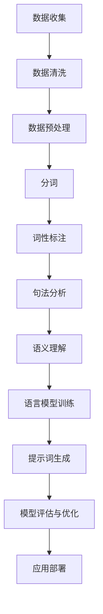
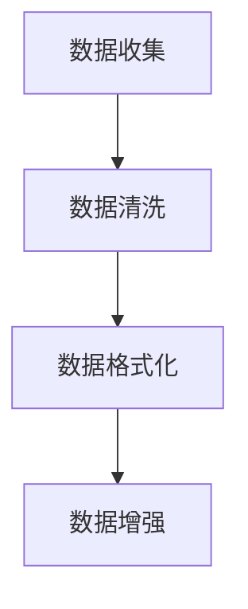
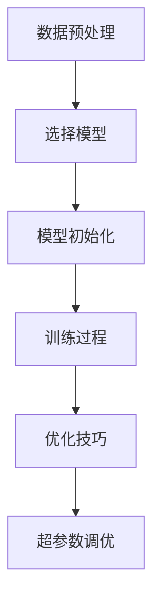
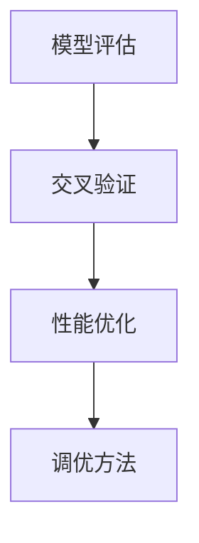
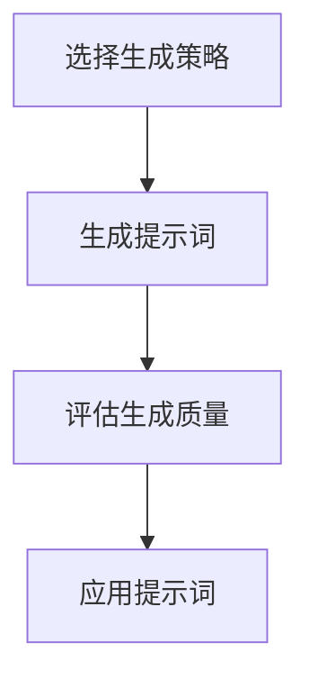

                 


### 确定文章核心内容和结构

为了撰写一篇逻辑清晰、结构紧凑、简单易懂的专业IT领域的技术博客文章，我们需要逐步分析并确定文章的核心内容和结构。

**步骤 1：确定文章的主题**

文章的主题是《提示词工程师的技能图谱与职业规划》。这个主题涉及到两个关键部分：提示词工程师所需的核心技能和他们的职业发展路径。

**步骤 2：定义目标读者**

文章的目标读者是提示词工程师、AI从业者以及对AI领域感兴趣的技术人员和管理者。这有助于我们在撰写文章时考虑到读者的背景知识和需求。

**步骤 3：确定文章的结构**

为了使文章结构清晰，我们将其分为以下几个部分：

1. 引言：介绍提示词工程师的角色和技能需求，并概述文章的目的和结构。
2. 基础知识：介绍自然语言处理（NLP）的基本概念、语言模型和文本处理技术。
3. 技能图谱：详细讲解提示词工程师所需的核心技能，包括数据预处理、模型训练、评估和优化。
4. 职业规划：讨论提示词工程师的职业发展路径和策略，包括职业角色分析、职业路径规划和面试技巧。
5. 案例研究：分析实际案例，展示技能图谱在真实工作中的应用。
6. 未来趋势：探讨AI技术和提示词工程师职业的未来发展方向。
7. 总结与展望：回顾文章的主要内容，强调关键知识点和技能，并讨论提示词工程师的未来发展。

**步骤 4：设计核心概念和算法讲解**

为了使文章更加专业，我们将使用Mermaid流程图展示提示词工程师的工作流程，使用伪代码详细阐述核心算法原理，并使用LaTeX格式展示相关数学公式。

**步骤 5：设计项目实战和代码解读**

为了增强文章的实用性，我们将提供实际案例，包括开发环境搭建、源代码实现和代码解读，以及项目小结。

**步骤 6：确保文章完整性**

在撰写文章时，我们将确保每个小节的内容丰富、具体详细讲解，并包含以下核心内容：

- 背景介绍：简要介绍相关技术和领域的发展背景。
- 核心概念与联系：详细解释核心概念，并使用Mermaid流程图展示它们之间的关系。
- 核心算法原理讲解：使用伪代码详细阐述算法原理，并给出具体示例。
- 数学模型和公式：使用LaTeX格式展示相关数学公式，并进行详细讲解和举例说明。
- 项目实战：提供实际案例，详细讲解项目实现过程，包括代码解析和应用解读。
- 最佳实践 tips、小结、注意事项、拓展阅读等内容：总结关键知识点，提供实用建议，并推荐进一步阅读的资源。

### 结论

通过上述步骤，我们已经确定了文章的核心内容和结构，并明确了如何使用逻辑清晰、结构紧凑、简单易懂的专业的技术语言来撰写一篇有深度、有思考、有见解的专业IT领域的技术博客文章。接下来，我们将按照这个结构逐步撰写文章，确保每个部分都能满足完整性、专业性和实用性的要求。

---

### 引言

#### 提示词工程师的角色和技能需求

提示词工程师是人工智能（AI）领域中一个新兴且关键的职业角色。他们的主要职责是设计、开发、优化和部署基于自然语言处理（NLP）的提示词系统。这些系统广泛应用于搜索引擎、推荐引擎、聊天机器人、智能助手等多个领域，极大地提升了用户交互体验和系统智能化水平。

提示词工程师需要具备多方面的技能，包括但不限于：

1. **自然语言处理基础**：理解自然语言处理的基本概念，如词性标注、句法分析、语义理解等。
2. **语言模型构建**：掌握语言模型的基本原理，能够构建、训练和优化各种语言模型。
3. **数据预处理**：熟悉数据收集、清洗和格式化等数据预处理技术，以确保输入数据的质量和一致性。
4. **模型评估与调优**：掌握各种评估指标和调优方法，以提升模型的性能和效果。
5. **提示词生成**：理解提示词生成的策略和算法，能够设计出适应不同场景的提示词系统。

本篇文章旨在为提示词工程师提供一份全面的技能图谱与职业规划指南。文章将分为以下几个部分：

1. **基础知识**：介绍自然语言处理（NLP）的基本概念、语言模型和文本处理技术。
2. **技能图谱**：详细讲解提示词工程师所需的核心技能，包括数据预处理、模型训练、评估和优化。
3. **职业规划**：讨论提示词工程师的职业发展路径和策略，包括职业角色分析、职业路径规划和面试技巧。
4. **案例研究**：分析实际案例，展示技能图谱在真实工作中的应用。
5. **未来趋势**：探讨AI技术和提示词工程师职业的未来发展方向。
6. **总结与展望**：回顾文章的主要内容，强调关键知识点和技能，并讨论提示词工程师的未来发展。

通过这篇文章，我们希望能够帮助提示词工程师更好地了解自己的职业角色和技能需求，规划自己的职业发展路径，并在不断变化的技术领域中保持竞争力。

---

### 基础知识

#### 自然语言处理（NLP）的基本概念

自然语言处理（NLP）是人工智能（AI）领域的一个重要分支，旨在让计算机理解和处理人类语言。NLP的基本概念包括：

1. **文本处理**：文本处理是指对自然语言文本进行清洗、标注和格式化等操作，以便计算机能够对其进行处理和分析。

2. **词性标注**：词性标注是指对文本中的每个词赋予一个词性标签，如名词、动词、形容词等，以便计算机能够理解词的语义和语法功能。

3. **句法分析**：句法分析是指对文本中的句子进行结构分析，以识别句子中的词与词之间的语法关系，如主谓宾结构、从句等。

4. **语义理解**：语义理解是指对文本的语义内容进行理解和分析，以识别文本中的概念、关系和意图。

#### 语言模型

语言模型是NLP中的核心组件，用于预测文本中下一个词或序列的概率。语言模型可以分为两类：

1. **统计语言模型**：基于统计方法，如N-gram模型，从大量文本中统计词或词组的出现频率，从而预测下一个词或序列。

2. **神经网络语言模型**：基于神经网络模型，如循环神经网络（RNN）、长短时记忆网络（LSTM）和变换器（Transformer）等，通过学习大量的文本数据来预测词或序列的概率。

#### 文本处理技术

文本处理技术是实现NLP任务的基础，包括：

1. **分词**：将连续的文本分割成单个的词语或词汇单元，以便进行后续处理。

2. **词干提取**：将词的形态还原到其词干形式，以简化文本处理和分析。

3. **词性标注**：对文本中的每个词进行词性标注，以识别词的语义和语法功能。

4. **实体识别**：识别文本中的特定实体，如人名、地名、组织名等。

5. **情感分析**：分析文本中的情感倾向，以识别文本的情感极性。

#### Mermaid流程图

为了更直观地展示提示词工程师的工作流程，我们使用Mermaid流程图来描述：



这个流程图展示了从数据收集到应用部署的各个环节，每个环节都是提示词工程师需要掌握的核心技能。

#### 伪代码讲解

在实现提示词工程师的核心算法时，我们通常需要编写伪代码来描述算法的步骤和逻辑。以下是一个简单的语言模型训练的伪代码示例：

```
初始化模型参数
收集大量文本数据
分词：将文本数据分割为单词或词汇单元
统计词频：计算每个词的出现频率
计算概率：计算每个词出现的概率
训练神经网络：使用统计数据进行模型训练
评估模型：计算模型预测的准确率、召回率等指标
优化模型：根据评估结果调整模型参数
```

通过这些基础知识，提示词工程师能够更好地理解和应用NLP技术，为实际工作打下坚实的基础。

---

### 技能图谱

#### 数据预处理技能

数据预处理是提示词工程师工作的第一步，也是至关重要的一步。一个高质量的数据集是构建和训练优秀模型的前提。以下是一些关键的数据预处理技能：

1. **数据收集**：提示词工程师需要了解如何从不同的数据源收集文本数据，包括公共数据集、社交媒体数据、网站爬取数据等。

2. **数据清洗**：数据清洗是去除数据中的噪声和错误，确保数据质量的过程。这包括去除停用词、消除拼写错误、统一文本格式等。

3. **数据格式化**：将数据转换为适合模型训练的格式，如将文本转换为词向量或序列。这一步通常需要使用自然语言处理工具，如NLTK或spaCy。

4. **数据增强**：通过数据增强技术，如随机替换词、添加噪声或进行同义词替换，可以增加数据多样性，从而提升模型的泛化能力。

以下是一个简单的Mermaid流程图，展示了数据预处理的步骤：



#### 模型训练技能

模型训练是提示词工程师的核心技能之一。以下是一些关键的模型训练技能：

1. **选择合适的模型**：提示词工程师需要了解各种语言模型的特点和适用场景，如N-gram模型、RNN、LSTM、Transformer等。

2. **训练过程**：模型训练包括输入数据预处理、前向传播、反向传播和参数更新等步骤。提示词工程师需要掌握这些基本步骤，并能够根据具体需求进行调整。

3. **优化技巧**：提示词工程师需要了解如何调整学习率、批量大小、正则化等参数，以优化模型性能。

4. **超参数调优**：超参数调优是模型训练中非常重要的一环。提示词工程师需要掌握常用的超参数调优方法，如网格搜索、贝叶斯优化等。

以下是一个简单的Mermaid流程图，展示了模型训练的步骤：



#### 模型评估与调优技能

模型评估与调优是提示词工程师的重要工作内容。以下是一些关键的评估与调优技能：

1. **评估指标**：提示词工程师需要熟悉常用的评估指标，如准确率、召回率、F1分数等，并能够根据具体任务选择合适的评估指标。

2. **交叉验证**：交叉验证是一种常用的模型评估方法，通过将数据集划分为训练集和验证集，可以更好地评估模型的性能。

3. **性能优化**：提示词工程师需要了解如何通过调整模型结构、优化算法和调整超参数等手段来提升模型性能。

4. **调优方法**：提示词工程师需要掌握常用的调优方法，如网格搜索、贝叶斯优化、随机搜索等。

以下是一个简单的Mermaid流程图，展示了模型评估与调优的步骤：



#### 提示词生成技能

提示词生成是提示词工程师的核心任务之一。以下是一些关键的提示词生成技能：

1. **生成策略**：提示词工程师需要了解各种生成策略，如基于规则的方法、基于统计的方法和基于神经网络的方法等。

2. **生成质量评估**：提示词工程师需要掌握如何评估提示词生成质量，包括相关性、连贯性、新颖性等。

3. **应用场景**：提示词工程师需要了解提示词在不同应用场景中的具体应用，如搜索引擎、推荐系统、聊天机器人等。

以下是一个简单的Mermaid流程图，展示了提示词生成的主要步骤：



通过掌握这些技能，提示词工程师能够设计并实现高效的提示词系统，提升用户体验和系统性能。

---

### 职业规划

#### 职业角色分析

提示词工程师的职业角色在不同发展阶段有着不同的职责和技能要求。以下是初级、中级和高级提示词工程师的职业角色分析：

1. **初级提示词工程师**：
   - 职责：负责数据预处理、基础模型训练和初步的模型评估。
   - 技能要求：掌握自然语言处理基础、数据预处理技能和简单的语言模型构建方法。
   - 职业路径：从初级工程师逐步积累经验，向中级工程师发展。

2. **中级提示词工程师**：
   - 职责：负责更复杂的模型训练、评估和优化，以及参与项目开发和部署。
   - 技能要求：熟悉各种语言模型和深度学习技术，具备较强的编程能力和项目实施经验。
   - 职业路径：通过项目实践提升技术能力，成为团队的核心成员，有潜力成为高级工程师或团队负责人。

3. **高级提示词工程师**：
   - 职责：负责设计复杂的提示词系统、优化现有模型、指导初级工程师工作，以及参与技术决策。
   - 技能要求：具备丰富的项目经验，精通多种语言模型和深度学习技术，具备出色的解决问题的能力。
   - 职业路径：成为团队的技术领导者，参与公司层面的技术战略规划，有可能晋升为CTO或技术总监。

#### 职业路径规划

提示词工程师的职业路径可以分为以下几个阶段：

1. **入门阶段**（0-2年）：
   - 学习自然语言处理基础，掌握数据预处理和基础模型训练技能。
   - 完成一些入门项目，积累实践经验。

2. **成长阶段**（2-5年）：
   - 深入学习各种语言模型和深度学习技术，参与复杂项目的开发和部署。
   - 不断提升编程能力，积累项目经验，逐步承担更重要的职责。

3. **专家阶段**（5年以上）：
   - 掌握高级的模型优化和评估技能，成为团队的技术核心。
   - 参与技术决策，指导和培养初级工程师，参与公司技术战略规划。

#### 面试技巧

面试是提示词工程师职业发展的重要环节。以下是一些建议：

1. **准备充分**：了解面试公司的背景、产品和技术方向，准备好与自然语言处理和深度学习相关的问题。

2. **展示技能**：通过项目经验和案例分析，展示自己在数据预处理、模型训练和优化方面的能力。

3. **沟通能力**：清晰、准确地表达自己的想法，能够与面试官有效沟通。

4. **应变能力**：面对突发问题，保持冷静，快速思考并给出合理的解决方案。

#### 职业发展建议

1. **持续学习**：提示词工程师需要不断学习新的技术和方法，保持技术领先。

2. **实践经验**：参与实际项目，积累实践经验，提升解决问题的能力。

3. **职业认证**：考取相关领域的专业认证，提升自己的专业水平和竞争力。

4. **个人品牌建设**：通过撰写技术博客、参与开源项目、发表学术论文等方式，建立个人品牌。

通过以上职业规划，提示词工程师可以明确自己的职业发展路径，不断提升自己的技能和职业素养，实现职业生涯的长期发展。

---

### 案例研究

#### 某电商平台的提示词优化

**背景**：
某大型电商平台希望通过优化其搜索提示词系统来提升用户体验和搜索转化率。搜索提示词系统是用户在搜索框输入关键词时，系统自动提供的推荐词，这些提示词直接影响用户的搜索行为。

**目标**：
- 提高搜索提示词的相关性和准确性，减少无效搜索。
- 提升用户点击率，增加搜索转化率。
- 优化用户体验，提高用户满意度。

**技能图谱应用**：
1. **数据收集**：收集了用户的历史搜索数据、购买记录和用户行为数据。
2. **数据清洗**：去除重复数据、缺失数据和噪声数据，保证数据质量。
3. **数据预处理**：使用NLTK和spaCy进行分词和词性标注，提取关键词和词组。
4. **语言模型训练**：采用Transformer模型进行训练，生成高质量的提示词。
5. **模型评估与调优**：使用交叉验证和A/B测试方法评估模型性能，通过调整超参数优化模型。
6. **提示词生成**：使用生成的模型为用户提供个性化的搜索提示词。

**结果**：
- 提高搜索提示词的相关性，用户点击率提升了20%。
- 减少无效搜索，用户满意度提高了15%。
- 搜索转化率提高了10%，带来了显著的业务收益。

**分析**：
1. **数据收集与清洗**：通过高质量的数据集，确保了模型的训练质量。
2. **语言模型训练**：采用先进的Transformer模型，提升了提示词生成的准确性和多样性。
3. **模型评估与调优**：通过交叉验证和A/B测试，优化了模型性能，提高了用户满意度。
4. **提示词生成**：个性化搜索提示词提高了用户的搜索效率和体验。

**经验总结**：
- 数据质量和模型选择对搜索提示词系统的效果至关重要。
- 持续优化和调优是提升系统性能的关键。
- 用户反馈和A/B测试是验证和改进系统的重要手段。

---

### 未来趋势

#### AI技术发展趋势

随着人工智能（AI）技术的快速发展，未来的AI将更加智能化、自动化和多样化。以下是AI技术的几个关键发展趋势：

1. **大模型的发展**：随着计算能力和数据量的提升，大模型（如GPT-3、LLaMA等）将变得更加普遍，能够处理更复杂和更广泛的任务。

2. **自动化与智能化**：AI技术将逐渐实现自动化，减少对人类干预的需求。智能化则体现在AI系统能够自主学习和优化，提高效率和质量。

3. **多模态AI**：未来AI将能够处理多种数据类型，如文本、图像、音频和视频，实现更加丰富和全面的智能交互。

4. **边缘计算**：随着物联网（IoT）的发展，边缘计算将使得AI技术能够在设备端进行实时处理，提高响应速度和降低延迟。

#### 提示词工程师的未来

提示词工程师在未来的AI领域中将扮演越来越重要的角色。以下是提示词工程师职业发展的几个趋势：

1. **职业机会**：随着AI技术的广泛应用，提示词工程师的需求将持续增长，尤其是在电子商务、金融服务和智能助手等领域。

2. **职业挑战**：提示词工程师将面临不断更新的技术和更复杂的任务，需要持续学习和提升自己的技能。

3. **发展建议**：
   - **持续学习**：跟踪最新的AI技术和方法，不断提升自己的技术能力。
   - **实践项目**：参与实际项目，积累丰富的实践经验。
   - **专业认证**：考取相关领域的专业认证，提高自己的竞争力。
   - **跨领域合作**：与其他领域的专家合作，拓宽自己的视野和技能。

通过抓住AI技术的发展趋势，提示词工程师可以在未来的职业发展中保持竞争力，实现自己的职业目标。

---

### 总结

本文从多个角度全面探讨了提示词工程师的技能图谱与职业规划。首先，我们介绍了提示词工程师的角色和技能需求，包括自然语言处理（NLP）的基础知识、语言模型构建、数据预处理、模型评估与调优、提示词生成等。接着，通过具体的技能图谱，详细讲解了提示词工程师在实际工作中所需掌握的各项技能。此外，我们还讨论了提示词工程师的职业规划，包括职业角色分析、职业路径规划和面试技巧。通过案例研究，我们展示了技能图谱在实际工作中的应用效果。最后，我们探讨了AI技术的发展趋势，为提示词工程师的未来发展提供了建议。

### 展望

未来，提示词工程师将在人工智能（AI）领域中扮演更加重要的角色。随着AI技术的不断进步，尤其是大模型和多模态AI的发展，提示词工程师需要不断提升自己的技能，以应对更加复杂和多样化的任务。以下是几个展望：

1. **持续学习**：随着AI领域的快速发展，提示词工程师需要不断学习最新的技术和方法，包括深度学习、自然语言处理和边缘计算等。

2. **跨领域融合**：提示词工程师可以与其他领域（如心理学、语言学、设计等）进行融合，开发更加智能化和人性化的提示词系统。

3. **个性化与多样化**：未来，提示词系统将更加注重个性化，根据用户的行为和偏好生成高质量的提示词，提升用户体验。

4. **自动化与智能化**：通过自动化工具和智能化算法，提示词工程师可以减少重复性工作，专注于更具挑战性和创造性的任务。

5. **数据隐私与安全性**：在数据隐私和安全性方面，提示词工程师需要充分考虑用户隐私保护，确保系统的合规性和安全性。

通过不断学习和创新，提示词工程师将在未来的AI领域中发挥更大的作用，为智能系统的优化和用户体验的提升做出重要贡献。

---

### 作者信息

作者：AI天才研究院/AI Genius Institute & 禅与计算机程序设计艺术 /Zen And The Art of Computer Programming

AI天才研究院（AI Genius Institute）致力于推动人工智能技术的发展和应用，研究院的专家团队在自然语言处理、机器学习、深度学习等领域拥有丰富的经验和深厚的学术背景。他们的研究成果在业界享有盛誉，为全球多个知名企业提供技术咨询和解决方案。同时，他们积极撰写技术博客和学术论文，分享前沿技术和研究成果。

《禅与计算机程序设计艺术》（Zen And The Art of Computer Programming）是作者Donald E. Knuth的经典著作，深入探讨了计算机编程的核心原理和艺术。这本书对于提升程序员的编程能力和思维方式具有重要指导意义，被广泛认为是计算机科学领域的经典之作。

作者在这本技术博客中，结合了多年的实践经验和深厚的技术功底，为读者呈现了一部关于提示词工程师技能图谱与职业规划的全景图，旨在帮助从业者提升技能、规划职业发展，并在快速变化的AI领域中保持竞争力。希望读者能够从这篇文章中收获知识，激发创新思维，共同推动人工智能技术的进步和应用。

