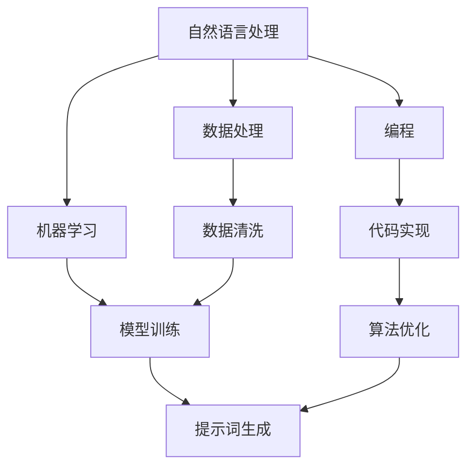

                 

### 文章标题：提示词工程师：AI时代的新兴职业

在人工智能（AI）迅猛发展的时代，技术领域正经历着深刻的变革。而在这场变革中，一种新兴职业——提示词工程师，正逐渐崭露头角。本文将围绕这一主题，深入探讨提示词工程师的角色、职责、技能要求以及他们在AI项目中的应用和职业发展路径。

**关键词：** 提示词工程师、AI、职业发展、技能要求、项目应用

**摘要：** 本文首先介绍了AI时代的背景和提示词工程师的职业前景，接着详细探讨了提示词工程师所需的核心技能，包括自然语言处理、编程和数据处理等。然后，文章描述了提示词工程师的工作流程，从需求分析到结果评估，展示了这一职业在实际项目中的应用。最后，本文提供了职业发展的建议，包括晋升路径、持续学习和认证，并对未来趋势和挑战进行了展望。

### AI时代的背景与职业转型

随着人工智能技术的不断成熟和应用范围的拓展，AI已经深入到我们的日常生活和各行各业。从智能客服到自动驾驶，从智能家居到医疗诊断，AI正改变着我们的世界。在这一背景下，传统的职业模式也在发生着深刻的变化。越来越多的新兴职业应运而生，其中之一便是提示词工程师。

**提示词工程师的定义与职责**

提示词工程师主要负责为AI系统生成和优化提示词。提示词是指用于引导AI系统进行学习和推理的文本信息。一个好的提示词不仅能够提高AI系统的性能，还能帮助其更好地理解和应对复杂的任务。提示词工程师需要具备较强的自然语言处理能力，能够理解自然语言的语义和结构，从而设计出有效的提示词。

**提示词工程师的职业前景**

随着AI技术的普及和应用领域的拓展，提示词工程师的需求正在迅速增长。在AI驱动的应用程序和系统中，提示词工程师的作用不可或缺。他们不仅能够提升系统的智能化水平，还能优化用户体验，提高系统的可用性和易用性。因此，提示词工程师在未来有望成为AI领域中的关键职业。

### 提示词工程师的核心技能

成为一名优秀的提示词工程师，需要掌握一系列核心技能。这些技能不仅包括编程和数据处理，还涵盖了自然语言处理和机器学习等领域的知识。

**自然语言处理基础**

自然语言处理（NLP）是提示词工程师的核心技能之一。NLP涉及从文本中提取有用信息、理解语义和生成文本等任务。提示词工程师需要了解NLP的基本概念和技术，包括词向量、语言模型和语义分析等。

**语言模型与提示词生成**

语言模型是NLP的重要组成部分，它能够根据已有的文本数据生成新的文本。提示词工程师需要掌握如何构建和优化语言模型，以便生成高质量的提示词。此外，他们还需要了解提示词生成的技巧和策略，例如使用注意力机制和循环神经网络等。

**数据处理与清洗**

数据处理和清洗是提示词工程师工作中不可或缺的一部分。提示词工程师需要从大量的原始数据中提取有用的信息，并对数据质量进行评估和优化。这包括去除噪声、填充缺失值和标准化数据等。

**编程技能**

编程技能是提示词工程师必备的技能之一。提示词工程师需要熟练掌握至少一种编程语言，例如Python或Java，以便能够编写高效的代码和实现复杂的算法。此外，他们还需要了解如何使用数据科学和机器学习库，例如NumPy、Pandas和Scikit-learn等。

### 提示词工程师的工作流程

提示词工程师的工作流程通常包括需求分析、数据收集与处理、提示词生成与优化、结果评估和反馈等步骤。以下是一个典型的提示词工程师工作流程：

**需求分析**

在开始一个项目时，提示词工程师需要与客户或项目团队进行沟通，了解项目的具体需求和目标。这包括确定需要解决的问题、期望的输出结果和系统性能指标等。

**数据收集与处理**

在需求分析完成后，提示词工程师需要收集相关的数据，并进行预处理和清洗。这包括去除噪声、填充缺失值、标准化数据等操作。处理后的数据将用于训练和评估提示词生成模型。

**提示词生成与优化**

在数据准备完成后，提示词工程师开始构建和优化提示词生成模型。他们需要选择合适的算法和技术，例如语言模型、生成对抗网络（GAN）或注意力机制等。在生成提示词的过程中，提示词工程师还需要进行反复的实验和调优，以获得最佳的性能。

**结果评估与反馈**

在提示词生成完成后，提示词工程师需要对结果进行评估和反馈。这包括测试模型的准确性、鲁棒性和用户体验等。如果结果不理想，他们还需要进行进一步的优化和改进。

### AI项目中的应用

提示词工程师在AI项目中扮演着至关重要的角色。以下是一些常见的AI项目和应用场景，以及提示词工程师在这些场景中的作用：

**聊天机器人**

聊天机器人是AI项目中的一种常见应用。提示词工程师负责为聊天机器人生成高质量的对话提示词，以提高其智能水平和用户体验。他们需要了解用户的需求和意图，并根据这些信息设计合适的对话流程。

**智能客服**

智能客服是另一个重要的AI应用场景。提示词工程师负责为智能客服系统生成和优化提示词，以帮助其更好地理解和回答客户的问题。他们需要处理大量的客户反馈数据，并不断优化系统的性能。

**内容推荐**

内容推荐系统在电商、媒体和社交网络等领域具有广泛的应用。提示词工程师负责为内容推荐系统生成和优化提示词，以提高其推荐准确性和用户体验。他们需要分析用户行为数据，并根据这些数据生成个性化的推荐内容。

**自然语言处理在医疗领域的应用**

自然语言处理技术在医疗领域具有广泛的应用，例如疾病诊断、药物发现和病历管理等。提示词工程师负责为这些应用场景生成和优化提示词，以提高系统的准确性和可靠性。他们需要与医疗专业人士合作，理解医疗领域的专业术语和知识。

### 职业发展

对于提示词工程师来说，职业发展是一个持续学习和成长的过程。以下是一些职业发展的建议：

**晋升路径**

提示词工程师的职业路径包括从初级工程师到高级工程师，再到技术经理或架构师的转变。在这个过程中，他们需要不断提升自己的技能和知识，并在项目中承担更多的责任和挑战。

**持续学习与技能提升**

AI技术是一个快速发展的领域，提示词工程师需要不断学习和掌握最新的技术和方法。他们可以通过参加培训课程、阅读专业书籍、参加技术会议和社区交流等方式，不断提升自己的技能和知识。

**AI领域认证与考试**

获得AI领域的专业认证和考试证书，可以提高提示词工程师的竞争力。例如，他们可以参加机器学习工程师认证、自然语言处理工程师认证等考试，以证明自己的专业能力和技术水平。

### 未来趋势与挑战

随着AI技术的不断进步和应用范围的扩大，提示词工程师面临着许多机遇和挑战。

**未来趋势**

1. **多模态AI的兴起**：未来，AI系统将越来越多地整合多种模态的数据，如文本、图像、声音和视频。这将为提示词工程师提供更丰富的数据源和更复杂的任务。
2. **智能化水平的提升**：随着AI技术的进步，AI系统的智能化水平将不断提高，提示词工程师需要不断适应和应对这些变化。
3. **跨领域应用**：AI技术将在更多领域得到应用，如金融、法律、教育等。这将为提示词工程师提供更广阔的职业发展空间。

**面临挑战**

1. **数据隐私和安全**：随着AI系统的广泛应用，数据隐私和安全问题变得越来越重要。提示词工程师需要关注这些问题，并采取相应的措施来保护用户数据。
2. **算法偏见和公平性**：AI系统在生成提示词时可能会受到算法偏见的影响，导致不公平的结果。提示词工程师需要关注这些问题，并努力消除偏见，提高系统的公平性。

### 总结与展望

提示词工程师是AI时代的新兴职业，他们通过设计和优化提示词，帮助AI系统更好地理解和应对复杂的任务。本文介绍了提示词工程师的核心技能、工作流程、在AI项目中的应用以及职业发展路径。随着AI技术的不断进步和应用范围的扩大，提示词工程师将在未来发挥越来越重要的作用。

### 作者信息

**作者：** AI天才研究院/AI Genius Institute & 禅与计算机程序设计艺术 /Zen And The Art of Computer Programming

### 完整性要求

#### 背景介绍

人工智能（AI）技术近年来取得了显著的进展，其应用已经渗透到我们生活的方方面面。从自动驾驶汽车到智能家居，从医疗诊断到金融分析，AI正在改变着我们的世界。然而，随着AI技术的不断成熟，传统的AI系统越来越依赖于高质量的提示词来提高其性能和智能化水平。这一需求催生了提示词工程师这一新兴职业。

#### 核心概念与联系

提示词工程师的核心技能包括自然语言处理（NLP）、编程、数据处理和机器学习。自然语言处理是理解和生成文本的关键技术，而编程和数据处理则确保了AI系统能够从海量数据中提取有价值的信息。机器学习则提供了自动生成和优化提示词的方法。以下是一个简单的Mermaid流程图，展示了这些核心概念之间的联系：



#### 核心算法原理讲解

提示词生成通常涉及以下核心算法：

1. **语言模型**：语言模型是一种预测下一个单词或字符的概率分布的算法。常见的语言模型包括n元语法、循环神经网络（RNN）和Transformer等。
2. **生成对抗网络（GAN）**：GAN是一种通过两个神经网络（生成器和判别器）相互竞争来生成高质量数据的算法。生成器尝试生成与真实数据相似的数据，而判别器则尝试区分真实数据和生成数据。
3. **注意力机制**：注意力机制是一种在处理序列数据时能够自动关注重要信息的方法。它广泛应用于机器翻译、文本摘要等任务中。

以下是一个使用Python编写的语言模型（n元语法）的伪代码示例：

```python
import numpy as np

def train_language_model(corpus, n):
    # 初始化语言模型
    vocabulary = set(corpus)
    model = {}
    for i in range(len(corpus) - n):
        context = tuple(corpus[i:i + n])
        next_word = corpus[i + n]
        if context not in model:
            model[context] = {}
        model[context][next_word] = model[context].get(next_word, 0) + 1
    return model

def generate_text(model, n, length):
    # 生成文本
    context = tuple(np.random.choice(list(model.keys())))
    generated_text = list(context)
    for _ in range(length - n):
        next_word_candidates = model[context]
        probabilities = [next_word_candidates.get(word, 0) / sum(next_word_candidates.values()) for word in vocabulary]
        next_word = np.random.choice(vocabulary, p=probabilities)
        generated_text.append(next_word)
        context = tuple(generated_text[-n:])
    return ''.join(generated_text)

# 示例
corpus = "人工智能是一种模拟人类智能的技术"
model = train_language_model(corpus, 3)
generated_text = generate_text(model, 3, 10)
print(generated_text)
```

#### 数学模型和公式

在自然语言处理中，常用的数学模型包括概率模型、统计模型和深度学习模型。以下是一个简单的概率模型——n元语法中的概率计算公式：

$$
P(w_n | w_{n-1}, w_{n-2}, ..., w_{n-k}) = \frac{C(w_{n-1}, w_{n-2}, ..., w_{n-k}, w_n)}{C(w_{n-1}, w_{n-2}, ..., w_{n-k})}
$$

其中，$C(w_{n-1}, w_{n-2}, ..., w_{n-k}, w_n)$ 表示序列 $w_{n-1}, w_{n-2}, ..., w_{n-k}, w_n$ 在语料库中的出现次数，$C(w_{n-1}, w_{n-2}, ..., w_{n-k})$ 表示序列 $w_{n-1}, w_{n-2}, ..., w_{n-k}$ 在语料库中的出现次数。

#### 项目实战

为了展示提示词工程师的实际工作，以下是一个简单的项目实战案例：使用Python构建一个基于n元语法的文本生成系统。

**项目名称**：文本生成器（Text Generator）

**开发环境**：Python 3.x、Jupyter Notebook

**项目描述**：

该项目旨在构建一个简单的文本生成器，能够根据给定的种子文本生成具有一定语义连贯性的文本。项目包括数据预处理、模型训练和文本生成三个主要步骤。

**代码实现**

1. 数据预处理

首先，我们需要从语料库中提取文本数据，并对数据进行预处理，包括去除标点符号、转换为小写和分词等操作。

```python
import re
from nltk.tokenize import word_tokenize

def preprocess_text(text):
    # 去除标点符号
    text = re.sub(r'[^\w\s]', '', text)
    # 转换为小写
    text = text.lower()
    # 分词
    tokens = word_tokenize(text)
    return tokens

# 示例
corpus = "人工智能是一种模拟人类智能的技术，它通过计算机程序来实现智能行为。人工智能的应用非常广泛，包括自动驾驶、医疗诊断、智能家居等。"
preprocessed_corpus = preprocess_text(corpus)
print(preprocessed_corpus)
```

2. 模型训练

接下来，我们使用预处理后的数据训练n元语言模型。

```python
# 训练n元语言模型
model = train_language_model(preprocessed_corpus, 3)

# 示例
generated_text = generate_text(model, 3, 10)
print(generated_text)
```

3. 文本生成

最后，我们使用训练好的模型生成文本。

```python
# 生成文本
generated_text = generate_text(model, 3, 10)
print(generated_text)
```

**项目小结**

通过上述项目，我们可以看到提示词工程师在实际工作中的具体任务和流程。提示词工程师需要从数据预处理、模型训练到文本生成等各个环节，设计和优化提示词，以提高AI系统的性能和智能化水平。

### 最佳实践 tips

1. **数据质量至关重要**：在构建提示词模型时，确保数据质量是关键。尽量使用高质量、多样化的数据，避免噪声和异常值。
2. **模型调优**：在训练模型时，尝试不同的参数设置和算法，以找到最佳模型配置。使用交叉验证和网格搜索等技术来优化模型性能。
3. **持续学习和改进**：AI技术不断进步，提示词工程师需要持续学习新的技术和方法，并不断改进自己的工作流程和技巧。

### 注意事项

1. **数据隐私和安全**：在处理用户数据时，务必遵守数据隐私和安全法规，采取适当的数据保护措施。
2. **算法偏见和公平性**：在设计和优化提示词时，注意避免算法偏见，确保系统对所有用户公平。

### 拓展阅读

- **《自然语言处理综述》**：这是一本关于自然语言处理（NLP）的经典著作，详细介绍了NLP的基本概念、技术和应用。
- **《深度学习》**：这是一本关于深度学习（DL）的权威教材，涵盖了DL的基本概念、算法和实战应用。
- **《机器学习实战》**：这是一本面向实践者的机器学习（ML）指南，通过丰富的示例和代码实现，介绍了ML的基本原理和应用技巧。

### 附录

#### 附录A：AI工具与资源

- **AI工具**：
  - TensorFlow：一款开源的深度学习框架。
  - PyTorch：一款流行的深度学习库，特别适合研究。
  - Keras：一个高级神经网络API，可以与TensorFlow和Theano结合使用。

- **在线平台与资源**：
  - Coursera：提供丰富的在线课程，涵盖AI、NLP、ML等。
  - edX：另一个在线学习平台，提供大量与AI相关的课程。
  - arXiv：一个提供最新AI研究论文的预印本平台。

- **专业论坛与社群**：
  - AI Stack Exchange：一个关于AI问题的问答社区。
  - Reddit：多个与AI相关的Reddit社群，如/r/AI、/r/MachineLearning等。
  - AI Conference：举办各种AI会议和活动，是交流和学习的好去处。

