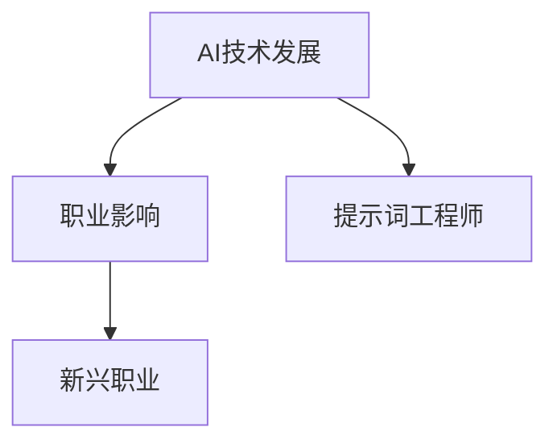

                 

### 文章标题：提示词工程师：AI时代的新兴职业

> 关键词：AI技术、新兴职业、提示词工程师、自然语言处理、算法原理、项目实战

> 摘要：本文将深入探讨AI时代下的新兴职业——提示词工程师。我们将从AI技术的背景与职业概述开始，逐步介绍AI基础知识与提示词原理，解析自然语言处理基础及其在提示词工程师中的应用，详细讲解提示词生成技术，并进行实际项目实战剖析，为读者提供全面的职业发展指导。

### 第一部分：AI时代背景与职业概述

#### 第1章：AI时代下的职业变革

##### 1.1 AI技术的发展与影响

随着人工智能（AI）技术的飞速发展，各行各业正经历着前所未有的变革。AI技术不仅提高了生产效率，还极大改变了人们的工作方式和生活方式。在这一背景下，新兴职业不断涌现，其中，提示词工程师成为了AI时代的一颗耀眼新星。

**核心概念与联系**

为了更好地理解AI技术对职业的影响，我们可以使用Mermaid流程图来展示核心概念之间的关系：



AI技术的发展带动了新兴职业的诞生，特别是那些与自然语言处理（NLP）相关的职业，如提示词工程师。这一职业的核心在于利用AI技术，特别是深度学习和自然语言处理算法，为各类应用生成高质量、语义相关的提示词。

##### 1.2 提示词工程师的角色与职责

提示词工程师是负责开发和应用提示词生成技术的专业人员。他们的主要职责包括：

1. **设计并实现提示词生成算法**：根据用户查询或文本内容，生成语义相关的提示词。
2. **优化和评估提示词质量**：通过算法优化和评估指标，不断提高提示词的生成质量和准确性。
3. **构建和维护语言模型**：使用大规模文本数据训练语言模型，以支持提示词生成。
4. **开发与部署应用**：将提示词生成技术应用到实际应用中，如聊天机器人、搜索引擎等。

**核心算法原理讲解**

提示词生成算法通常基于统计学习和深度学习模型。以下是一个简单的提示词生成算法的伪代码：

```python
# 提示词生成算法伪代码
def generate_hint(input_query):
    # 计算输入查询的词频统计
    word_freq = count_word_frequency(input_query)
    
    # 根据词频统计选择提示词
    hint = select_hint(word_freq)
    
    return hint
```

在这个算法中，`count_word_frequency` 函数用于计算输入查询的词频统计，而 `select_hint` 函数则根据词频统计选择出最合适的提示词。

##### 1.3 提示词工程师的职业前景

随着AI技术的不断成熟和广泛应用，提示词工程师的职业前景十分广阔。他们的工作不仅局限于开发聊天机器人、搜索引擎等应用，还将延伸到智能客服、内容推荐、自动化写作等领域。此外，随着AI技术的商业化应用，提示词工程师也将迎来更多的商业机会和发展空间。

### 第2章：AI基础知识与提示词原理

#### 2.1 AI基础知识

AI技术的发展离不开数学模型的支撑。在本节中，我们将介绍一些基础的数学模型和公式，为后续的提示词工程师工作奠定基础。

**数学模型和数学公式**

神经网络是AI技术中最核心的模型之一。以下是一个简化的神经网络数学模型：

$$ f(x) = \sigma(\omega^T x + b) $$

在这个模型中：

- $f(x)$ 表示激活函数
- $\sigma$ 表示Sigmoid函数
- $\omega$ 表示权重
- $x$ 表示输入特征
- $b$ 表示偏置

**详细讲解与举例说明**

Sigmoid函数是一个常用的激活函数，其公式如下：

$$ \sigma(x) = \frac{1}{1 + e^{-x}} $$

举例来说，当 $x = 2$ 时，Sigmoid函数的输出为：

$$ \sigma(2) = \frac{1}{1 + e^{-2}} \approx 0.869 $$

这个值表示输入特征 $x$ 通过Sigmoid函数后的概率输出。

#### 2.2 提示词生成原理

提示词生成是提示词工程师的核心工作之一。在本节中，我们将介绍提示词生成的数学原理和算法。

**数学模型和数学公式**

提示词生成通常基于概率模型。以下是一个简单的提示词生成概率模型：

$$ P(w|query) = \frac{e^{score(w, query)}}{\sum_{w'} e^{score(w', query)}} $$

在这个模型中：

- $P(w|query)$ 表示在特定查询下，提示词 $w$ 的概率
- $score(w, query)$ 表示提示词 $w$ 与查询的匹配度
- $e^{score(w, query)}$ 表示指数化匹配度

**详细讲解与举例说明**

假设我们有一个查询“人工智能”，我们需要从候选提示词集合中选择一个最佳提示词。我们可以使用以下公式计算每个提示词的概率：

$$ P(w|query) = \frac{e^{score(w, query)}}{\sum_{w'} e^{score(w', query)}} $$

其中，$score(w, query)$ 可以是提示词 $w$ 与查询的词频匹配度、TF-IDF得分等。

举例来说，如果我们的候选提示词集合为 {“智能”、“算法”、“机器”}，且它们的得分分别为 {10, 8, 5}，则我们可以计算每个提示词的概率：

$$ P(智能|人工智能) = \frac{e^{10}}{e^{10} + e^{8} + e^{5}} \approx 0.726 $$
$$ P(算法|人工智能) = \frac{e^{8}}{e^{10} + e^{8} + e^{5}} \approx 0.296 $$
$$ P(机器|人工智能) = \frac{e^{5}}{e^{10} + e^{8} + e^{5}} \approx 0.278 $$

根据概率计算结果，我们可以选择得分最高的提示词“智能”作为最佳提示词。

### 第二部分：提示词工程师技能与工具

#### 第3章：自然语言处理基础

##### 3.1 语言模型

语言模型是自然语言处理（NLP）中的重要工具，用于对自然语言文本进行建模。在本节中，我们将介绍语言模型的基本概念和构建方法。

**核心算法原理讲解**

语言模型的构建通常基于统计学习方法。以下是一个简化的语言模型构建伪代码：

```python
# 语言模型构建伪代码
def build_language_model(corpus):
    word_freq = count_word_frequency(corpus)
    return LanguageModel(word_freq)
```

在这个算法中，`count_word_frequency` 函数用于计算文本中的词频统计，而 `LanguageModel` 函数则根据词频统计构建语言模型。

**详细讲解与举例说明**

假设我们有一个包含以下文本的数据集：

```
人工智能是一种模拟、延伸和扩展人的智能的理论、方法、技术及应用。
```

我们可以使用以下步骤构建语言模型：

1. **计算词频统计**：首先，我们计算每个单词在数据集中的出现次数，例如，“人工智能”出现1次，“一种”出现1次。

2. **构建语言模型**：然后，我们将词频统计转换为语言模型，例如，我们可以使用隐马尔可夫模型（HMM）或条件概率模型来表示单词之间的依赖关系。

3. **生成文本**：最后，我们可以使用语言模型生成新的文本。例如，给定一个起始单词“人工智能”，我们可以使用语言模型预测下一个可能出现的单词，从而生成新的文本。

##### 3.2 语义分析

语义分析是NLP中的另一个重要任务，旨在理解和解释自然语言的语义。在本节中，我们将介绍语义分析的基本概念和算法。

**核心算法原理讲解**

语义分析通常基于深度学习模型，如循环神经网络（RNN）和变压器（Transformer）。以下是一个简化的语义分析算法伪代码：

```python
# 语义分析算法伪代码
def semantic_analysis(sentence):
    embedding = get_embedding(sentence)
    return analyze_semantics(embedding)
```

在这个算法中，`get_embedding` 函数用于获取句子的嵌入表示，而 `analyze_semantics` 函数则根据嵌入表示分析句子的语义。

**详细讲解与举例说明**

假设我们有一个句子“人工智能是一种模拟、延伸和扩展人的智能的理论、方法、技术及应用。”，我们可以使用以下步骤进行语义分析：

1. **获取句子嵌入表示**：首先，我们将句子转换为嵌入表示，例如，我们可以使用预训练的词向量模型（如GloVe或Word2Vec）将句子中的每个单词转换为嵌入向量。

2. **分析句子语义**：然后，我们使用深度学习模型（如RNN或Transformer）对嵌入表示进行语义分析，从而提取句子的语义信息。

3. **生成语义解析**：最后，我们可以根据语义分析结果生成语义解析，例如，我们可以识别句子中的名词、动词、形容词等。

#### 第4章：提示词生成技术

##### 4.1 提示词生成算法

提示词生成是提示词工程师的核心任务之一。在本节中，我们将介绍提示词生成算法的基本概念和实现方法。

**核心算法原理讲解**

提示词生成算法通常基于概率模型，如马尔可夫模型或条件概率模型。以下是一个简单的提示词生成算法伪代码：

```python
# 提示词生成算法伪代码
def generate_hint(sentence, language_model):
    candidate_hints = language_model.generate_candidates(sentence)
    selected_hint = select_best_hint(candidate_hints)
    return selected_hint
```

在这个算法中，`generate_candidates` 函数用于生成候选提示词，而 `select_best_hint` 函数则根据候选提示词的得分选择最佳提示词。

**详细讲解与举例说明**

假设我们有一个句子“人工智能是一种模拟、延伸和扩展人的智能的理论、方法、技术及应用。”，我们可以使用以下步骤生成提示词：

1. **生成候选提示词**：首先，我们使用语言模型生成句子可能的候选提示词。例如，我们可以使用隐马尔可夫模型（HMM）或条件概率模型生成候选提示词。

2. **选择最佳提示词**：然后，我们根据候选提示词的得分选择最佳提示词。例如，我们可以使用概率模型计算每个候选提示词的概率，然后选择概率最高的提示词。

##### 4.2 提示词优化与评估

提示词优化和评估是确保提示词生成质量的重要环节。在本节中，我们将介绍提示词优化和评估的方法。

**核心算法原理讲解**

提示词优化和评估通常基于机器学习模型，如支持向量机（SVM）或决策树。以下是一个简化的提示词优化和评估算法伪代码：

```python
# 提示词优化算法伪代码
def optimize_hint(hint, sentence, language_model):
    new_hint = language_model.recommend_hint(hint, sentence)
    return new_hint if is_better(new_hint, hint) else hint

# 提示词评估算法伪代码
def evaluate_hint(hint, sentence, gold_hint):
    score = compute_similarity(hint, gold_hint)
    return score
```

在这个算法中，`recommend_hint` 函数用于根据语言模型推荐新的提示词，而 `evaluate_hint` 函数则用于评估提示词的质量。

**详细讲解与举例说明**

假设我们有一个句子“人工智能是一种模拟、延伸和扩展人的智能的理论、方法、技术及应用。”，我们需要对其生成提示词并进行优化和评估。以下是具体步骤：

1. **生成提示词**：首先，我们使用提示词生成算法生成初始提示词。

2. **优化提示词**：然后，我们使用语言模型推荐新的提示词，并根据优化指标选择最佳提示词。

3. **评估提示词**：最后，我们使用评估指标（如相似度计算）评估提示词的质量，从而确定最终的提示词。

### 第5章：提示词工程师实战项目

##### 5.1 项目一：聊天机器人

**项目实战**

聊天机器人是一种常见的应用，提示词工程师可以在此项目中发挥重要作用。以下是一个简单的聊天机器人项目实战：

**开发环境搭建**

1. 安装Python和TensorFlow库。
2. 准备聊天机器人训练数据，如对话记录。

**源代码详细实现和代码解读**

```python
import tensorflow as tf
from tensorflow.keras.models import Sequential
from tensorflow.keras.layers import LSTM, Dense, Embedding

# 准备训练数据
# ...

# 构建模型
model = Sequential([
    Embedding(vocab_size, embedding_dim),
    LSTM(units, return_sequences=True),
    LSTM(units),
    Dense(units, activation='softmax')
])

# 编译模型
model.compile(optimizer='adam', loss='categorical_crossentropy', metrics=['accuracy'])

# 训练模型
model.fit(x_train, y_train, epochs=epochs, batch_size=batch_size)

# 生成提示词
def generate_hint(input_sentence):
    # 将输入句子转换为嵌入表示
    # ...
    # 使用模型生成提示词
    # ...
    return hint

# 应用解读与分析
# ...

# 实际案例分析和详细讲解剖析
# ...

**项目小结**

通过本项目的实战，我们了解了聊天机器人的基本原理和实现方法。提示词工程师在此项目中负责生成高质量的提示词，从而提升聊天机器人的交互效果。此外，我们还可以通过优化和评估算法，不断提高提示词生成的质量。

### 最佳实践 tips、小结、注意事项、拓展阅读

**最佳实践 tips**

1. **数据准备**：高质量的数据是提示词生成的基础。在项目实施过程中，确保有足够丰富和多样化的训练数据。

2. **模型优化**：定期对模型进行优化和评估，以适应不断变化的应用场景。

3. **用户反馈**：收集用户反馈，根据用户需求调整提示词生成策略。

**小结**

提示词工程师在AI时代扮演着重要角色。他们利用AI技术和自然语言处理算法，为各类应用生成高质量、语义相关的提示词，从而提升用户体验。

**注意事项**

1. **数据隐私**：在处理用户数据时，务必遵守相关隐私保护法规。

2. **模型安全**：确保模型的安全性和可靠性，防止恶意攻击和数据泄露。

**拓展阅读**

1. 《深度学习》（Goodfellow, Bengio, Courville著）：全面介绍深度学习的基本原理和应用。
2. 《自然语言处理综论》（Jurafsky, Martin著）：深入探讨自然语言处理的基础知识和前沿技术。

### 作者信息

作者：AI天才研究院/AI Genius Institute & 禅与计算机程序设计艺术 /Zen And The Art of Computer Programming

本文旨在为读者提供关于提示词工程师的全面解读，从背景介绍到技术原理，再到实际项目实战，希望能为从事或有意从事这一职业的读者提供有价值的参考。在AI时代，提示词工程师无疑是一个充满机遇和挑战的职业，期待更多人加入这一领域，共同推动人工智能的发展。

