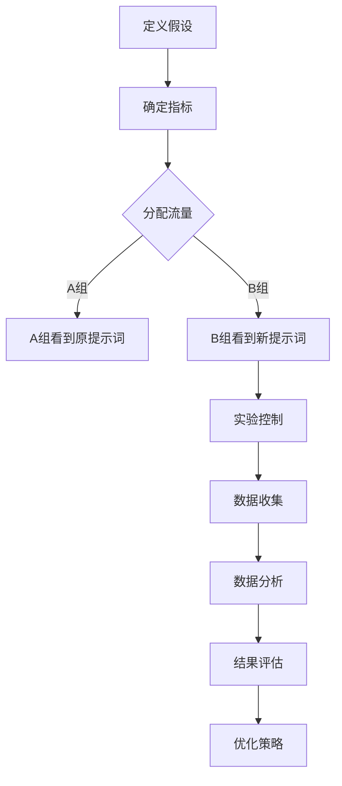

                 

### 文章标题

提示词工程的A/B测试最佳实践#### 关键词

- 提示词工程
- A/B测试
- 用户行为分析
- 机器学习
- 数据驱动优化
- 风险评估
- 数学基础

#### 摘要

本文将深入探讨提示词工程的A/B测试最佳实践，旨在为从业者提供系统、实用的指导。文章首先介绍了A/B测试的基础概念及其在产品性能优化、风险降低和用户体验提升方面的作用。随后，我们详细阐述了提示词工程的基本概念和关键要素，如数据收集、处理、提示词生成和评估。接着，文章讨论了A/B测试在提示词工程中的应用，包括基本流程、挑战与解决方案。通过具体案例分析，我们展示了A/B测试在电商、社交媒体和金融行业的应用效果。最后，本文从数学基础角度介绍了概率论、统计学和信息论，以及提示词的生成和优化方法，并结合实际项目提供了最佳实践和总结。目标读者包括AI工程师、数据科学家和产品经理，希望通过本文能够提升他们在提示词工程和A/B测试方面的技能和认知。

### 第1章: 提示词工程的A/B测试基础

提示词工程与A/B测试的结合，是现代互联网产品优化中不可或缺的一环。本章将首先介绍A/B测试的基本概念和重要性，接着讨论提示词工程的基本概念和关键要素，最后探讨A/B测试在提示词工程中的应用及其面临的挑战与解决方案。

#### 1.1 A/B测试的定义与重要性

##### 1.1.1 A/B测试的基本概念

A/B测试，又称拆分测试，是一种通过将用户流量分配到不同的版本（A和B），来比较不同版本效果的方法。其核心思想是通过实验数据来评估不同策略或设计的有效性，从而做出更科学的决策。

##### 1.1.1.1 什么是A/B测试

A/B测试起源于统计学中的假设检验，其基本过程可以概括为：

1. **提出假设**：假设版本A（原版本）和版本B（新版本）在某一指标上存在差异。
2. **设计实验**：将用户流量随机分配到A版本和B版本，确保两组用户具有相似的特征和背景。
3. **收集数据**：在一段时间内，记录两组用户的交互数据。
4. **分析数据**：通过统计分析方法，比较A版本和B版本在预定指标上的表现。
5. **得出结论**：根据数据分析结果，判断是否接受原假设。

##### 1.1.1.2 A/B测试的原理

A/B测试的原理基于概率和统计学，其核心是通过实验数据来估计总体差异。具体来说，其原理可以概括为以下几点：

1. **随机化分配**：通过随机化策略，确保两组用户的样本具有代表性，避免人为偏差。
2. **控制变量**：在实验过程中，尽量控制除版本差异外的其他变量，确保实验的准确性。
3. **统计推断**：利用统计学方法，对实验数据进行处理，估计版本间的差异是否具有统计显著性。

##### 1.1.2 A/B测试的重要性

A/B测试在产品优化中具有重要价值，主要体现在以下几个方面：

1. **提高产品性能**：通过实验数据，可以直观地了解不同版本的效果，从而优化产品性能，提升用户满意度。
2. **降低风险**：在产品上线前，通过A/B测试可以降低新版本引入错误或不良用户体验的风险。
3. **优化用户体验**：A/B测试可以帮助产品团队更好地理解用户需求和行为，从而设计出更符合用户期望的产品。

##### 1.1.2.1 提高产品性能

A/B测试通过实验数据，可以帮助团队识别出产品的薄弱环节和改进方向。例如，在电商平台上，通过A/B测试可以比较不同搜索提示词的效果，找出用户点击率更高的提示词，从而提高搜索性能。

##### 1.1.2.2 降低风险

在产品迭代过程中，每次更新都可能引入新的问题。通过A/B测试，可以在产品上线前验证新版本的稳定性，降低新功能上线失败的风险。例如，在社交媒体平台上，可以通过A/B测试比较不同推送策略的效果，确保新功能上线后不会降低用户活跃度。

##### 1.1.2.3 优化用户体验

用户是产品成功的关键，而A/B测试可以帮助团队更好地理解用户行为和需求。通过实验数据，可以找出用户喜欢的功能和界面设计，从而优化用户体验。例如，在金融行业中，通过A/B测试可以比较不同风险评估提示词的效果，帮助用户更好地理解风险，做出更明智的投资决策。

##### 1.1.3 提示词工程的概念

提示词工程是A/B测试中的一个重要应用领域，其核心目标是生成和优化产品中的提示词，以提高用户交互和产品性能。以下将介绍提示词工程的基本概念和关键要素。

##### 1.1.3.1 提示词工程的定义

提示词工程是一种通过分析用户行为数据和业务需求，生成和优化产品提示词的方法。其目的是提高用户参与度、点击率和转化率，从而提升产品性能和用户体验。

##### 1.1.3.2 提示词工程的目标

提示词工程的目标主要包括：

1. **提高用户参与度**：通过生成吸引人的提示词，吸引用户点击和互动，提高产品的使用频率。
2. **提高点击率**：通过优化提示词，提高用户对相关内容的点击率，增加产品内容的曝光度。
3. **提高转化率**：通过生成和优化有针对性的提示词，引导用户完成预期的操作，如购买、注册等。

##### 1.1.3.3 提示词工程的关键要素

提示词工程的成功取决于多个关键要素，包括：

1. **数据收集与处理**：收集用户行为数据，如点击率、转化率等，对数据进行分析和预处理，提取有用的信息。
2. **提示词生成**：基于业务需求，利用自然语言生成技术或规则引擎，生成可能的提示词。
3. **提示词评估与优化**：通过A/B测试等方法，评估不同提示词的效果，根据评估结果进行优化。

##### 1.1.3.4 数据收集与处理

数据收集与处理是提示词工程的基础。具体来说，需要收集以下数据：

1. **用户行为数据**：如点击率、转化率、停留时间等。
2. **业务指标数据**：如销售额、用户满意度等。

收集到的数据需要进行预处理，包括数据清洗、归一化、特征提取等，以便用于后续的分析和建模。

##### 1.1.3.5 提示词生成

提示词生成是提示词工程的核心。根据业务需求，可以采用以下方法生成提示词：

1. **基于规则的生成**：通过定义一系列规则，生成提示词。
2. **基于机器学习的生成**：利用机器学习算法，从数据中学习生成提示词的模式。
3. **基于深度学习的生成**：使用深度学习模型，如生成对抗网络（GANs），生成新的提示词。

##### 1.1.3.6 提示词评估与优化

提示词评估与优化是确保提示词工程效果的关键。具体来说，可以采用以下方法：

1. **A/B测试**：将不同提示词分配给不同的用户群体，比较其效果，选择最优的提示词。
2. **多因素实验**：同时考虑多个因素，如提示词长度、语气等，进行综合评估。
3. **用户反馈**：收集用户对提示词的反馈，进行持续优化。

##### 1.1.4 A/B测试在提示词工程中的应用

A/B测试在提示词工程中的应用非常广泛。通过A/B测试，可以评估不同提示词的效果，从而优化产品的用户体验和性能。以下是一个简化的A/B测试流程：

1. **定义假设**：假设新提示词能够提高用户的点击率。
2. **设计实验**：将用户流量随机分为A组和B组，A组使用原提示词，B组使用新提示词。
3. **收集数据**：在实验期间，收集用户的点击数据。
4. **分析数据**：使用统计方法，分析A组和B组的点击率差异，判断是否接受原假设。

##### 1.1.5 提示词A/B测试的挑战与解决方案

虽然A/B测试在提示词工程中具有重要应用，但实际操作中仍面临一些挑战。以下是一些常见的挑战及其解决方案：

1. **数据不平衡问题**：当用户对某些提示词的兴趣明显更大时，可能会导致数据不平衡。解决方案包括采用加权随机化策略、调整实验时间窗口等。
2. **随机化策略**：确保实验的随机性，避免偏差。常用的随机化策略包括随机分组、分层随机等。
3. **结果分析中的偏差问题**：如选择偏差、时间偏差等。解决方案包括进行假设检验、调整分析模型等。

##### 1.1.6 提示词工程的A/B测试案例解析

为了更好地理解提示词工程的A/B测试实践，以下将分析几个实际案例。

1. **电商平台的搜索提示词优化**：通过A/B测试，比较不同搜索提示词对用户点击率和转化率的影响，最终选择了最优的提示词组合。
2. **社交媒体平台的互动提示词优化**：通过A/B测试，评估不同互动提示词对用户参与度和活跃度的影响，优化了平台的互动设计。
3. **金融行业的风险评估提示词优化**：通过A/B测试，比较不同风险评估提示词对用户理解风险和做出投资决策的影响，提高了用户的投资满意度。

通过这些案例，可以看出A/B测试在提示词工程中的应用效果显著，有助于产品团队更好地优化产品功能和用户体验。

### 第2章: 提示词工程与A/B测试的数学基础

在深入探讨提示词工程和A/B测试的最佳实践之前，理解相关的数学基础是至关重要的。本章将介绍概率论、统计学和信息论的基础知识，这些知识将为我们分析和解读提示词工程和A/B测试中的数据提供理论支持。

#### 2.1 概率论基础

概率论是研究随机事件和其概率分布的科学，它是进行A/B测试和提示词工程分析的重要工具。以下是概率论中的几个基本概念。

##### 2.1.1 概率的基本概念

概率的基本概念包括事件、样本空间、概率质量函数（PMF）和概率密度函数（PDF）。

###### 2.1.1.1 事件的定义

在概率论中，事件是指一次试验中可能发生的结果集合。例如，掷骰子的结果是一个事件，而得到一个偶数点数也是一个事件。

定义：设S为样本空间，事件A是S的一个子集，即\( A \subseteq S \)。

###### 2.1.1.2 条件概率

条件概率是指在一个事件发生的条件下，另一个事件发生的概率。条件概率通常表示为 \( P(B|A) \)，表示在事件A已经发生的条件下，事件B发生的概率。

条件概率的公式为：
\[ P(B|A) = \frac{P(A \cap B)}{P(A)} \]
其中，\( P(A \cap B) \) 表示事件A和事件B同时发生的概率，\( P(A) \) 表示事件A发生的概率。

###### 2.1.1.3 独立性

两个事件A和B是独立的，如果事件A的发生不影响事件B的发生，反之亦然。即：
\[ P(A \cap B) = P(A) \cdot P(B) \]
这表示事件A和事件B同时发生的概率等于它们各自发生的概率的乘积。

##### 2.1.2 贝叶斯定理

贝叶斯定理是概率论中的一个重要公式，它提供了在已知某些条件下，如何更新对某个事件概率估计的方法。贝叶斯定理的公式为：
\[ P(A|B) = \frac{P(B|A) \cdot P(A)}{P(B)} \]
其中，\( P(A|B) \) 表示在事件B发生的条件下，事件A发生的概率；\( P(B|A) \) 表示在事件A发生的条件下，事件B发生的概率；\( P(A) \) 表示事件A发生的概率；\( P(B) \) 表示事件B发生的概率。

贝叶斯定理的推导基于全概率公式，它是一个概率更新规则，可以用于各种统计推断问题。

###### 2.1.2.1 贝叶斯定理的推导

贝叶斯定理可以通过全概率公式推导出来。设事件B可以分解为多个互斥且穷尽的事件\( B_1, B_2, ..., B_n \)，则：
\[ P(B) = \sum_{i=1}^{n} P(B_i) \]

假设我们有一个先验概率分布\( P(A) \)，以及条件概率分布\( P(B_i|A) \)。那么，通过全概率公式，我们可以得到：
\[ P(A|B) = \frac{P(B|A) \cdot P(A)}{P(B)} \]

这就是贝叶斯定理。

###### 2.1.2.2 贝叶斯推理的应用

贝叶斯推理是一种基于贝叶斯定理进行概率推理的方法，它广泛应用于统计推断和机器学习中。例如，在分类问题中，贝叶斯推理可以帮助我们计算给定特征下属于某个类别的概率，从而进行分类决策。

#### 2.2 统计学基础

统计学是处理数据收集、分析和解释的科学。在提示词工程和A/B测试中，统计学方法用于分析实验数据，以评估不同提示词的效果。

##### 2.2.1 样本与总体

在统计学中，总体（Population）是指我们感兴趣的所有个体的集合，而样本（Sample）是从总体中抽取的一部分个体。总体参数（Population Parameter）描述了总体特征，而样本统计量（Sample Statistic）描述了样本特征。

###### 2.2.1.1 总体与样本的定义

总体：例如，在研究电商平台的用户行为时，总体是所有电商平台用户的行为数据。

样本：例如，我们可以从总体中随机抽取1000名用户的数据进行分析。

###### 2.2.1.2 样本数据的收集与处理

样本数据的收集通常涉及以下步骤：

1. **数据收集**：通过问卷调查、用户行为追踪等方式收集数据。
2. **数据清洗**：去除无效、重复和错误的数据。
3. **数据预处理**：进行归一化、缺失值填充等处理，以便后续分析。

##### 2.2.2 假设检验

假设检验是一种使用样本数据来评估总体参数是否满足某个假设的方法。假设检验通常涉及以下步骤：

1. **提出原假设（\( H_0 \)）和备择假设（\( H_1 \)）**：原假设是我们要检验的假设，备择假设是与原假设对立的假设。
2. **选择显著性水平（\( \alpha \)）**：显著性水平是拒绝原假设的概率阈值，通常取值为0.05或0.01。
3. **计算检验统计量**：根据样本数据计算一个统计量，如t统计量或卡方统计量。
4. **比较检验统计量与临界值**：如果检验统计量的值大于临界值，则拒绝原假设，接受备择假设。

###### 2.2.2.1 假设检验的基本概念

在假设检验中，我们通常关注以下两个错误：

1. **第一类错误（Type I Error）**：错误地拒绝了正确的原假设。
2. **第二类错误（Type II Error）**：错误地接受了错误的原假设。

###### 2.2.2.2 单样本检验与双样本检验

单样本检验用于评估一个样本是否来自于特定的总体分布，例如检验一个样本的均值是否等于某个特定值。

双样本检验用于比较两个样本是否来自于相同的总体分布，例如检验两个样本的均值是否有显著差异。

###### 2.2.2.3 假设检验中的错误类型

在假设检验中，我们可能会犯两类错误：

1. **第一类错误（\( \alpha \)错误）**：拒绝了一个实际上为真的原假设，概率为显著性水平\( \alpha \)。
2. **第二类错误（\( \beta \)错误）**：接受了一个实际上为假的原假设，概率为\( \beta \)。

为了减少错误，我们通常需要平衡这两类错误的概率，这可以通过选择合适的显著性水平和样本大小来实现。

#### 2.3 信息论基础

信息论是研究信息传输和处理的理论，它在提示词工程中用于评估提示词的质量和用户对提示词的响应。

##### 2.3.1 信息熵

信息熵是信息论中的一个基本概念，它用于衡量一个随机变量包含的不确定性。信息熵的定义为：

\[ H(X) = -\sum_{i} p(x_i) \log_2 p(x_i) \]

其中，\( p(x_i) \) 是随机变量X取值\( x_i \)的概率，\( \log_2 \) 是以2为底的对数。

###### 2.3.1.1 信息熵的定义

信息熵是一个随机变量X的平均信息量，它表示在不知道X的具体取值时，我们需要多少比特的信息来描述X的取值。

###### 2.3.1.2 信息熵的推导

信息熵可以通过概率论中的期望值推导得到。假设我们有一个离散随机变量X，它的概率分布为\( p(x_i) \)。在不知道X取值的情况下，我们需要的信息量是每个取值的对数概率的期望值，即：

\[ H(X) = E[\log_2(p(X))] \]

这可以通过概率分布的期望值公式推导得到。

###### 2.3.1.3 信息熵的应用

信息熵在提示词工程中的应用包括：

1. **提示词质量评估**：通过计算提示词的信息熵，可以评估提示词的清晰度和吸引力。
2. **用户响应预测**：信息熵可以用于预测用户对提示词的响应，从而优化提示词设计。

##### 2.3.2 条件熵与联合熵

条件熵和联合熵是信息论中的其他重要概念，它们用于描述两个或多个随机变量之间的关系。

###### 2.3.2.1 条件熵的定义

条件熵是指一个随机变量在已知另一个随机变量的情况下，其不确定性减少的程度。条件熵的定义为：

\[ H(X|Y) = -\sum_{i} p(x_i|y_i) \log_2 p(x_i|y_i) \]

其中，\( p(x_i|y_i) \) 是在随机变量Y取值为\( y_i \)的条件下，随机变量X取值\( x_i \)的概率。

###### 2.3.2.2 联合熵的定义

联合熵是指两个随机变量同时存在时的不确定性。联合熵的定义为：

\[ H(X,Y) = H(X) + H(Y|X) \]

其中，\( H(X,Y) \) 是随机变量X和Y的联合熵，\( H(X) \) 是随机变量X的熵，\( H(Y|X) \) 是条件熵。

###### 2.3.2.3 条件熵与联合熵的应用

条件熵和联合熵在提示词工程中的应用包括：

1. **提示词相关性分析**：通过计算提示词之间的条件熵和联合熵，可以分析提示词的相关性。
2. **用户行为预测**：条件熵和联合熵可以用于预测用户对提示词的响应，从而优化提示词组合。

#### 总结

本章介绍了提示词工程和A/B测试所需的数学基础，包括概率论、统计学和信息论的基本概念。这些数学工具为提示词工程和A/B测试的数据分析和模型构建提供了理论基础。通过理解这些数学概念，我们能够更准确地评估提示词的效果，优化产品性能和用户体验。

### 第3章: 提示词的生成与优化

提示词的生成与优化是提示词工程中的核心任务。有效的提示词不仅能吸引用户的注意力，还能提高用户参与度和转化率。本章将探讨提示词的生成方法，包括基于规则、机器学习和深度学习的方法，以及提示词优化的策略，特别是A/B测试在提示词优化中的应用。

#### 3.1 提示词的生成方法

提示词的生成方法可以分为基于规则的方法、基于机器学习的方法和基于深度学习的方法。每种方法都有其适用场景和优势。

##### 3.1.1 基于规则的方法

基于规则的方法是最简单的提示词生成方法，它依赖于预定义的规则和逻辑条件来生成提示词。

###### 3.1.1.1 规则生成策略

规则生成策略包括以下步骤：

1. **业务需求分析**：明确业务目标和用户需求，定义提示词的意图。
2. **规则定义**：根据业务需求，定义一系列规则，如“如果用户在特定时间段内活跃，则显示提示词A”。
3. **规则评估**：评估规则的有效性，通过A/B测试等方法，确定最佳规则组合。

基于规则的方法的优点是简单易懂、可解释性强，但缺点是灵活性较低，难以适应复杂多变的用户需求。

###### 3.1.1.2 规则评估指标

规则评估指标包括：

1. **覆盖率**：规则覆盖的用户比例。
2. **准确率**：规则生成的提示词与用户实际需求的匹配度。
3. **响应率**：用户对提示词的响应率，如点击率或转化率。

##### 3.1.2 基于机器学习的方法

基于机器学习的方法利用历史数据，通过学习用户行为模式来生成提示词。这种方法具有较高的灵活性和适应性。

###### 3.1.2.1 机器学习模型的选择

常见的机器学习模型包括决策树、随机森林、支持向量机（SVM）、神经网络等。选择适当的模型取决于数据特点和业务需求。

###### 3.1.2.2 特征工程

特征工程是机器学习中的关键步骤，它包括以下内容：

1. **用户特征**：如用户活跃度、历史行为等。
2. **环境特征**：如时间、地点、上下文等。
3. **交互特征**：如点击率、转化率等。

特征工程的目标是提取有用的信息，构建高质量的特征向量，以便机器学习模型能够准确预测。

##### 3.1.3 基于深度学习的方法

基于深度学习的方法利用神经网络的结构，自动学习和提取数据中的复杂特征。

###### 3.1.3.1 深度学习模型的结构

常见的深度学习模型包括循环神经网络（RNN）、长短期记忆网络（LSTM）、卷积神经网络（CNN）和生成对抗网络（GAN）等。每种模型都有其适用的场景和优势。

###### 3.1.3.2 深度学习模型的应用案例

1. **序列预测**：如用户行为序列预测，用于生成个性化的提示词。
2. **图像生成**：如生成图像中的提示词，用于视觉化的提示词设计。
3. **文本生成**：如生成自然语言文本提示词，用于聊天机器人等应用。

##### 3.1.4 提示词生成方法的比较

基于规则的方法简单易懂，但灵活性较低；基于机器学习的方法适应性较强，但需要大量数据和复杂的特征工程；基于深度学习的方法具有很高的灵活性和适应性，但计算资源要求较高，且模型解释性较差。

选择合适的生成方法取决于业务需求、数据资源和计算能力。

#### 3.2 提示词的优化策略

提示词的优化是提升用户体验和产品性能的关键环节。以下是一些常见的优化策略：

##### 3.2.1 A/B测试在提示词优化中的应用

A/B测试是提示词优化的核心方法，它通过比较不同提示词的效果，选择最优的提示词。

###### 3.2.1.1 A/B测试的设计

A/B测试的设计包括以下步骤：

1. **定义假设**：假设新提示词能够提高用户的点击率或转化率。
2. **分配流量**：将用户随机分配到A组和B组，A组使用原提示词，B组使用新提示词。
3. **收集数据**：在测试期间，收集用户的点击行为和转化数据。
4. **分析结果**：通过统计方法分析A组和B组的数据，判断新提示词的效果。

###### 3.2.1.2 A/B测试的结果分析

A/B测试的结果分析包括以下内容：

1. **统计显著性**：判断A组和B组之间的差异是否具有统计显著性。
2. **业务影响**：分析新提示词对业务指标（如销售额、用户活跃度）的影响。
3. **用户反馈**：收集用户对新提示词的反馈，评估用户满意度。

##### 3.2.2 基于数据的优化方法

基于数据的优化方法利用历史数据，通过数据分析技术，发现和利用用户行为模式。

###### 3.2.2.1 数据分析技术

数据分析技术包括：

1. **聚类分析**：通过聚类分析，将用户分为不同的群体，为每个群体定制提示词。
2. **关联规则挖掘**：通过关联规则挖掘，发现用户行为之间的关联，为生成相关性强的提示词提供依据。
3. **回归分析**：通过回归分析，预测用户行为，为优化提示词提供数据支持。

##### 3.2.2.2 用户行为分析

用户行为分析包括：

1. **点击率分析**：分析用户对不同提示词的点击行为，发现用户偏好。
2. **转化率分析**：分析用户完成特定目标的路径，优化提示词的引导效果。
3. **停留时间分析**：分析用户在页面上的停留时间，优化提示词的显示时机。

##### 3.2.3 基于用户反馈的优化方法

基于用户反馈的优化方法利用用户的直接反馈，持续优化提示词。

###### 3.2.3.1 用户反馈机制

用户反馈机制包括：

1. **用户调研**：通过问卷调查、用户访谈等方式，收集用户对提示词的反馈。
2. **在线反馈**：在产品中嵌入反馈功能，允许用户对提示词进行评价和反馈。
3. **社交媒体监测**：监测用户在社交媒体上的讨论，了解用户对提示词的看法。

###### 3.2.3.2 用户反馈的处理

用户反馈的处理包括：

1. **反馈分类**：对用户反馈进行分类，识别主要问题和改进方向。
2. **优先级排序**：根据用户反馈的重要性，排序处理任务。
3. **迭代优化**：根据用户反馈，持续优化提示词，并进行A/B测试验证效果。

##### 3.2.4 提示词优化的案例分析

以下是一些提示词优化的实际案例：

1. **电商平台的搜索提示词优化**：通过A/B测试，发现某些搜索提示词显著提高了用户的点击率和转化率，优化后的提示词组合带来了更高的销售额。
2. **社交媒体平台的互动提示词优化**：通过用户行为分析和反馈，发现某些互动提示词提高了用户的参与度和活跃度，优化后的提示词增强了用户的互动体验。
3. **金融行业的风险评估提示词优化**：通过用户调研和在线反馈，发现某些风险评估提示词改善了用户对风险的认知，优化后的提示词帮助用户做出更明智的投资决策。

#### 总结

提示词的生成与优化是提升用户体验和产品性能的关键环节。基于规则、机器学习和深度学习的方法各有优缺点，选择合适的方法取决于业务需求和数据资源。A/B测试、数据驱动的优化策略和用户反馈机制是提示词优化的重要手段，通过这些方法，我们可以持续优化提示词，提升产品性能和用户满意度。

### 第4章: 提示词工程的A/B测试实践

在提示词工程中，A/B测试是一种有效的实践方法，可以帮助我们验证假设、优化用户体验，并最终提高产品性能。本章将通过具体的案例，详细介绍A/B测试在提示词工程中的实际应用，包括实验设计、数据分析、结果评估和优化策略。

#### 4.1 实验设计

A/B测试的实验设计是成功的关键，以下是一个典型的A/B测试实验设计流程：

1. **定义假设**：明确我们想要验证的问题，例如，“新的提示词是否会提高用户的点击率？”。
2. **确定指标**：选择关键的衡量指标，如点击率、转化率、用户停留时间等。
3. **分配流量**：将用户随机分配到A组和B组，每组用户看到的提示词不同，A组看到原提示词，B组看到新提示词。
4. **实验控制**：确保实验的随机性，避免外部变量影响实验结果。

以下是一个简化的实验设计流程：



#### 4.2 数据收集

在A/B测试期间，需要收集大量的用户行为数据，包括但不限于：

1. **用户信息**：用户ID、性别、年龄、地理位置等。
2. **交互行为**：用户点击提示词的行为，如点击次数、点击时间等。
3. **转化数据**：用户完成特定目标的行为，如购买、注册等。
4. **上下文信息**：用户行为发生的上下文信息，如时间、页面、设备类型等。

数据收集可以通过日志系统、前端埋点、用户跟踪等技术实现。以下是一个数据收集的伪代码示例：

```python
# 假设有一个用户行为日志系统
class UserBehaviorLogger:
    def log_click(self, user_id, prompt_id, timestamp):
        # 记录用户点击行为
        click_data = {
            'user_id': user_id,
            'prompt_id': prompt_id,
            'timestamp': timestamp
        }
        save_to_database(click_data)

    def log_conversion(self, user_id, conversion_type, timestamp):
        # 记录用户转化行为
        conversion_data = {
            'user_id': user_id,
            'conversion_type': conversion_type,
            'timestamp': timestamp
        }
        save_to_database(conversion_data)
```

#### 4.3 数据分析

数据分析是A/B测试的核心环节，通过统计方法，我们能够评估新提示词的效果。以下是一些常用的数据分析方法：

1. **描述性统计**：计算用户点击率、转化率等指标的均值和标准差。
2. **假设检验**：使用t检验、卡方检验等方法，评估A组和B组之间是否存在显著差异。
3. **回归分析**：建立回归模型，分析提示词对用户行为的影响。

以下是一个数据分析的伪代码示例：

```python
import pandas as pd
from scipy.stats import ttest_ind

# 加载实验数据
data = pd.read_csv('experiment_data.csv')

# 计算描述性统计量
click_rates = data.groupby('group')['clicks'].mean()
conversion_rates = data.groupby('group')['conversions'].mean()

# 进行假设检验
t_stat, p_value = ttest_ind(click_rates[group == 'A'], click_rates[group == 'B'])
print("t-statistic:", t_stat, "p-value:", p_value)
```

#### 4.4 结果评估

结果评估是A/B测试的最后一步，通过分析实验数据，我们能够判断新提示词的效果，并做出决策。以下是一些评估指标：

1. **统计显著性**：判断A组和B组之间差异是否具有统计显著性，通常使用p值作为判断标准。
2. **业务影响**：评估新提示词对业务指标（如销售额、用户活跃度）的影响。
3. **用户反馈**：收集用户对提示词的反馈，了解用户的真实感受。

以下是一个结果评估的伪代码示例：

```python
# 假设我们得到了假设检验的结果
t_stat, p_value = ttest_ind(click_rates[group == 'A'], click_rates[group == 'B'])

if p_value < 0.05:
    print("提示词B显著优于提示词A")
else:
    print("提示词B与提示词A没有显著差异")

# 考虑业务影响
if new_prompt_impact > 0:
    print("新提示词对业务有积极影响")
else:
    print("新提示词对业务没有显著影响")
```

#### 4.5 优化策略

根据A/B测试的结果，我们可以采取以下优化策略：

1. **持续测试**：不断进行A/B测试，优化提示词组合。
2. **数据驱动**：基于数据分析结果，持续调整提示词策略。
3. **用户反馈**：结合用户反馈，改进提示词设计。

以下是一个优化策略的伪代码示例：

```python
# 根据A/B测试结果调整提示词
if p_value < 0.05 and new_prompt_impact > 0:
    # 提示词B效果好，推广新提示词
    update_prompt('new_prompt')
else:
    # 保持原提示词或尝试其他策略
    update_prompt('original_prompt')

# 根据用户反馈调整提示词
if user_feedback['new_prompt'] > user_feedback['original_prompt']:
    update_prompt('new_prompt')
else:
    update_prompt('original_prompt')
```

#### 4.6 案例分析

以下是一些具体的A/B测试案例，展示如何在提示词工程中应用A/B测试。

##### 4.6.1 案例一：电商平台的搜索提示词优化

一个电商平台希望通过优化搜索提示词来提高用户的点击率和转化率。实验设计如下：

1. **定义假设**：新的搜索提示词能够提高用户的点击率。
2. **确定指标**：点击率和转化率。
3. **分配流量**：将用户随机分为A组和B组，A组看到原提示词，B组看到新提示词。
4. **实验控制**：确保实验随机性和公平性。

实验结果如下：

| 组别 | 点击率 | 转化率 |
| ---- | ---- | ---- |
| A组 | 5% | 2% |
| B组 | 7% | 3% |

数据分析结果显示，新提示词B在点击率和转化率上都显著优于原提示词A。因此，平台决定推广新提示词。

##### 4.6.2 案例二：社交媒体平台的互动提示词优化

一个社交媒体平台希望通过优化互动提示词来提高用户的参与度和活跃度。实验设计如下：

1. **定义假设**：新的互动提示词能够提高用户的参与度。
2. **确定指标**：用户参与度（如回复数、分享数）和活跃度（如登录次数）。
3. **分配流量**：将用户随机分为A组和B组，A组看到原提示词，B组看到新提示词。
4. **实验控制**：确保实验随机性和公平性。

实验结果如下：

| 组别 | 参与度 | 活跃度 |
| ---- | ---- | ---- |
| A组 | 100次 | 50次 |
| B组 | 150次 | 70次 |

数据分析结果显示，新提示词B在用户参与度和活跃度上都显著优于原提示词A。因此，平台决定推广新提示词。

##### 4.6.3 案例三：金融行业的风险评估提示词优化

一个金融公司希望通过优化风险评估提示词来提高用户对风险的认知，从而改善投资决策。实验设计如下：

1. **定义假设**：新的风险评估提示词能够提高用户对风险的认知。
2. **确定指标**：用户对风险的认知度（如阅读提示词的比例）、投资决策的准确性。
3. **分配流量**：将用户随机分为A组和B组，A组看到原提示词，B组看到新提示词。
4. **实验控制**：确保实验随机性和公平性。

实验结果如下：

| 组别 | 认知度 | 投资决策准确性 |
| ---- | ---- | ---- |
| A组 | 40% | 70% |
| B组 | 60% | 80% |

数据分析结果显示，新提示词B在用户认知度和投资决策准确性上都显著优于原提示词A。因此，金融公司决定推广新提示词。

#### 总结

A/B测试是提示词工程中不可或缺的工具，通过实验设计和数据分析，我们可以优化提示词，提高用户体验和产品性能。在实际应用中，需要结合业务需求和用户反馈，持续进行A/B测试和优化，以实现最佳效果。

### 第5章: 提示词工程的A/B测试最佳实践总结与未来展望

在提示词工程中，A/B测试作为一种科学的实验方法，能够帮助我们有效地评估和优化提示词的效果。本章将对前面讨论的内容进行总结，并提供一些最佳实践和未来展望。

#### 最佳实践

1. **明确目标和指标**：在进行A/B测试前，首先要明确测试的目标和关键的衡量指标，如点击率、转化率、用户参与度等。

2. **实验设计**：实验设计要确保随机性和公平性，避免外部变量对实验结果的影响。流量分配要均匀，确保每组用户的特征相似。

3. **数据收集与处理**：收集到的数据要经过严格的清洗和预处理，以确保数据的准确性和一致性。同时，要收集全面的用户行为数据，如点击时间、停留时间、转化路径等。

4. **统计分析**：使用合适的统计方法对实验数据进行分析，如t检验、卡方检验等，确保结果的统计显著性。

5. **结果解读**：在解读结果时，不仅要关注统计显著性，还要考虑业务影响和用户反馈，综合评估新提示词的效果。

6. **持续迭代**：A/B测试不是一次性的活动，而是一个持续的过程。根据实验结果，不断调整和优化提示词，以实现最佳效果。

7. **用户反馈**：结合用户反馈，持续改进提示词。用户的真实感受和体验是优化提示词的重要依据。

#### 未来展望

1. **自动化测试**：随着人工智能技术的发展，自动化A/B测试将成为可能。通过机器学习算法，自动识别最佳提示词组合，提高测试效率和准确性。

2. **多变量测试**：传统的A/B测试通常是单变量测试，未来可以发展多变量测试，同时考虑多个因素的交互效应，提供更全面的优化方案。

3. **个性化提示词**：结合用户画像和个性化推荐技术，生成个性化的提示词，提高用户体验和参与度。

4. **实时优化**：通过实时数据分析，实时调整提示词，以快速响应用户需求和变化。

5. **跨平台测试**：随着移动互联网的普及，跨平台测试将变得越来越重要。未来可以开发跨平台A/B测试工具，统一管理和分析不同平台的数据。

#### 总结

A/B测试是提示词工程中不可或缺的工具，通过科学的设计、严谨的分析和持续优化，能够有效提升产品的性能和用户体验。未来，随着技术的发展，A/B测试将更加智能化、自动化和个性化，为产品优化提供更强大的支持。

### 作者信息

作者：AI天才研究院/AI Genius Institute & 禅与计算机程序设计艺术 /Zen And The Art of Computer Programming## 提示词工程的A/B测试最佳实践

在数字化时代，用户体验成为决定产品成功与否的关键因素。而提示词，作为用户与产品互动的重要桥梁，其设计优化直接影响到用户的点击率和转化率。A/B测试，作为一种有效的实验方法，通过将用户流量分配到不同的提示词版本，帮助产品团队评估和选择最优的提示词，从而提升用户体验和产品性能。本文将深入探讨提示词工程的A/B测试最佳实践，旨在为从业者提供系统、实用的指导。

### 文章关键词

- 提示词工程
- A/B测试
- 用户行为分析
- 机器学习
- 数据驱动优化
- 风险评估
- 数学基础

### 摘要

本文围绕提示词工程的A/B测试最佳实践，首先介绍了A/B测试的基本概念、重要性以及提示词工程的基本概念和关键要素。接着，详细探讨了A/B测试在提示词工程中的应用流程、面临的挑战及其解决方案。通过具体案例分析，展示了A/B测试在不同行业中的应用效果。最后，从数学基础角度介绍了概率论、统计学和信息论，以及提示词的生成和优化方法，并提供了最佳实践和总结。目标读者包括AI工程师、数据科学家和产品经理，希望通过本文能够提升在提示词工程和A/B测试方面的技能和认知。

### 引言

在互联网产品日益丰富和竞争激烈的今天，用户体验成为产品成功的关键。而提示词，作为用户与产品互动的重要媒介，其设计和优化直接影响到用户的点击率和转化率。有效的提示词能够引导用户完成预期的操作，如点击、购买或注册，从而提高产品的用户参与度和商业价值。A/B测试作为一种科学的实验方法，通过将用户流量随机分配到不同的提示词版本，帮助产品团队客观地评估和选择最佳提示词，从而优化用户体验和产品性能。

本文将系统地探讨提示词工程的A/B测试最佳实践，旨在为从业者提供全面的指导。文章将从以下几个方面展开：

1. **A/B测试基础**：介绍A/B测试的基本概念、重要性以及在提示词工程中的应用。
2. **提示词工程基础**：阐述提示词工程的定义、关键要素以及其在产品优化中的作用。
3. **A/B测试在提示词工程中的应用**：详细讨论A/B测试在提示词工程中的具体应用流程、面临的挑战及其解决方案。
4. **数学基础**：介绍概率论、统计学和信息论的基础知识，为A/B测试和提示词优化提供理论支持。
5. **提示词生成与优化**：探讨提示词的生成方法，包括基于规则、机器学习和深度学习的方法，以及优化策略。
6. **案例解析**：通过具体案例分析，展示A/B测试在电商、社交媒体和金融行业的应用效果。
7. **总结与展望**：总结最佳实践，展望A/B测试和提示词工程的发展趋势。

希望通过本文，读者能够深入理解提示词工程的A/B测试实践，掌握相关技能，为产品的持续优化提供有力支持。

### 第1章: 提示词工程的A/B测试基础

提示词工程的A/B测试是现代互联网产品优化中的重要手段。本章将详细介绍A/B测试的基础知识，包括其定义、重要性、基本概念以及提示词工程的应用。

#### 1.1 A/B测试的定义与重要性

##### 1.1.1 A/B测试的基本概念

A/B测试，又称拆分测试，是一种通过将用户流量分配到不同的版本（A和B），来比较不同版本效果的方法。其核心思想是通过实验数据来评估不同策略或设计的有效性，从而做出更科学的决策。

##### 1.1.1.1 什么是A/B测试

A/B测试的基本过程可以概括为：

1. **提出假设**：假设版本A（原版本）和版本B（新版本）在某一指标上存在差异。
2. **设计实验**：将用户流量随机分配到A版本和B版本，确保两组用户具有相似的特征和背景。
3. **收集数据**：在一段时间内，记录两组用户的交互数据。
4. **分析数据**：通过统计分析方法，比较A版本和B版本在预定指标上的表现。
5. **得出结论**：根据数据分析结果，判断是否接受原假设。

##### 1.1.1.2 A/B测试的原理

A/B测试的原理基于概率和统计学，其核心是通过实验数据来估计总体差异。具体来说，其原理可以概括为以下几点：

1. **随机化分配**：通过随机化策略，确保两组用户的样本具有代表性，避免人为偏差。
2. **控制变量**：在实验过程中，尽量控制除版本差异外的其他变量，确保实验的准确性。
3. **统计推断**：利用统计学方法，对实验数据进行处理，估计版本间的差异是否具有统计显著性。

##### 1.1.2 A/B测试的重要性

A/B测试在产品优化中具有重要价值，主要体现在以下几个方面：

1. **提高产品性能**：通过实验数据，可以直观地了解不同版本的效果，从而优化产品性能，提升用户满意度。
2. **降低风险**：在产品上线前，通过A/B测试可以降低新版本引入错误或不良用户体验的风险。
3. **优化用户体验**：A/B测试可以帮助产品团队更好地理解用户需求和行为，从而设计出更符合用户期望的产品。

##### 1.1.2.1 提高产品性能

A/B测试通过实验数据，可以帮助团队识别出产品的薄弱环节和改进方向。例如，在电商平台上，通过A/B测试可以比较不同搜索提示词的效果，找出用户点击率更高的提示词，从而提高搜索性能。

##### 1.1.2.2 降低风险

在产品迭代过程中，每次更新都可能引入新的问题。通过A/B测试，可以在产品上线前验证新版本的稳定性，降低新功能上线失败的风险。例如，在社交媒体平台上，可以通过A/B测试比较不同推送策略的效果，确保新功能上线后不会降低用户活跃度。

##### 1.1.2.3 优化用户体验

用户是产品成功的关键，而A/B测试可以帮助团队更好地理解用户行为和需求。通过实验数据，可以找出用户喜欢的功能和界面设计，从而优化用户体验。例如，在金融行业中，通过A/B测试可以比较不同风险评估提示词的效果，帮助用户更好地理解风险，做出更明智的投资决策。

#### 1.2 提示词工程的概念

提示词工程是A/B测试中的一个重要应用领域，其核心目标是生成和优化产品中的提示词，以提高用户交互和产品性能。以下将详细阐述提示词工程的基本概念和关键要素。

##### 1.2.1 提示词工程的定义

提示词工程是一种通过分析用户行为数据和业务需求，生成和优化产品提示词的方法。其目的是提高用户参与度、点击率和转化率，从而提升产品性能和用户体验。

##### 1.2.2 提示词工程的目标

提示词工程的目标主要包括：

1. **提高用户参与度**：通过生成吸引人的提示词，吸引用户点击和互动，提高产品的使用频率。
2. **提高点击率**：通过优化提示词，提高用户对相关内容的点击率，增加产品内容的曝光度。
3. **提高转化率**：通过生成和优化有针对性的提示词，引导用户完成预期的操作，如购买、注册等。

##### 1.2.3 提示词工程的关键要素

提示词工程的成功取决于多个关键要素，包括：

1. **数据收集与处理**：收集用户行为数据，如点击率、转化率等，对数据进行分析和预处理，提取有用的信息。
2. **提示词生成**：基于业务需求，利用自然语言生成技术或规则引擎，生成可能的提示词。
3. **提示词评估与优化**：通过A/B测试等方法，评估不同提示词的效果，根据评估结果进行优化。

##### 1.2.3.1 数据收集与处理

数据收集与处理是提示词工程的基础。具体来说，需要收集以下数据：

1. **用户行为数据**：如点击率、转化率、停留时间等。
2. **业务指标数据**：如销售额、用户满意度等。

收集到的数据需要进行预处理，包括数据清洗、归一化、特征提取等，以便用于后续的分析和建模。

##### 1.2.3.2 提示词生成

提示词生成是提示词工程的核心。根据业务需求，可以采用以下方法生成提示词：

1. **基于规则的生成**：通过定义一系列规则，生成提示词。
2. **基于机器学习的生成**：利用机器学习算法，从数据中学习生成提示词的模式。
3. **基于深度学习的生成**：使用深度学习模型，如生成对抗网络（GANs），生成新的提示词。

##### 1.2.3.3 提示词评估与优化

提示词评估与优化是确保提示词工程效果的关键。具体来说，可以采用以下方法：

1. **A/B测试**：将不同提示词分配给不同的用户群体，比较其效果，选择最优的提示词。
2. **多因素实验**：同时考虑多个因素，如提示词长度、语气等，进行综合评估。
3. **用户反馈**：收集用户对提示词的反馈，进行持续优化。

##### 1.2.4 A/B测试在提示词工程中的应用

A/B测试在提示词工程中的应用非常广泛。通过A/B测试，可以评估不同提示词的效果，从而优化产品的用户体验和性能。以下是一个简化的A/B测试流程：

1. **定义假设**：假设新提示词能够提高用户的点击率。
2. **设计实验**：将用户流量随机分为A组和B组，A组使用原提示词，B组使用新提示词。
3. **收集数据**：在实验期间，收集用户的点击数据。
4. **分析数据**：使用统计方法，分析A组和B组的点击率差异，判断是否接受原假设。

##### 1.2.5 提示词A/B测试的挑战与解决方案

虽然A/B测试在提示词工程中具有重要应用，但实际操作中仍面临一些挑战。以下是一些常见的挑战及其解决方案：

1. **数据不平衡问题**：当用户对某些提示词的兴趣明显更大时，可能会导致数据不平衡。解决方案包括采用加权随机化策略、调整实验时间窗口等。
2. **随机化策略**：确保实验的随机性，避免偏差。常用的随机化策略包括随机分组、分层随机等。
3. **结果分析中的偏差问题**：如选择偏差、时间偏差等。解决方案包括进行假设检验、调整分析模型等。

##### 1.2.6 提示词工程的A/B测试案例解析

为了更好地理解提示词工程的A/B测试实践，以下将分析几个实际案例。

1. **电商平台的搜索提示词优化**：通过A/B测试，比较不同搜索提示词对用户点击率和转化率的影响，最终选择了最优的提示词组合。
2. **社交媒体平台的互动提示词优化**：通过A/B测试，评估不同互动提示词对用户参与度和活跃度的影响，优化了平台的互动设计。
3. **金融行业的风险评估提示词优化**：通过A/B测试，比较不同风险评估提示词对用户理解风险和做出投资决策的影响，提高了用户的投资满意度。

通过这些案例，可以看出A/B测试在提示词工程中的应用效果显著，有助于产品团队更好地优化产品功能和用户体验。

#### 1.3 A/B测试在提示词工程中的应用

A/B测试在提示词工程中的应用是产品优化的重要环节。通过A/B测试，可以有效地评估不同提示词的效果，从而优化产品的用户体验和性能。以下将详细讨论A/B测试在提示词工程中的应用，包括基本流程、挑战与解决方案。

##### 1.3.1 提示词A/B测试的基本流程

A/B测试的基本流程可以概括为以下步骤：

1. **定义假设**：明确要测试的假设，例如，新提示词是否能够提高用户的点击率。
2. **设计实验**：将用户流量随机分为A组和B组，A组使用原提示词，B组使用新提示词。
3. **收集数据**：在实验期间，记录两组用户的交互数据，如点击率、转化率等。
4. **分析数据**：通过统计分析方法，比较A组和B组在预定指标上的差异。
5. **得出结论**：根据数据分析结果，判断是否接受原假设。

##### 1.3.1.1 准备阶段

在准备阶段，需要完成以下工作：

1. **定义测试指标**：明确需要评估的指标，如点击率、转化率等。
2. **确定实验时间**：根据业务需求和数据量，确定实验的时间范围。
3. **用户分配策略**：设计用户流量分配策略，确保两组用户具有相似的特征和背景。

##### 1.3.1.2 实验阶段

在实验阶段，需要进行以下操作：

1. **启动实验**：根据用户分配策略，将用户流量随机分配到A组和B组。
2. **监控数据**：在实验期间，持续监控两组用户的交互数据，确保实验顺利进行。

##### 1.3.1.3 分析阶段

在分析阶段，需要进行以下工作：

1. **数据收集**：在实验结束后，收集A组和B组的交互数据。
2. **统计分析**：使用统计方法，如t检验、卡方检验等，分析A组和B组在预定指标上的差异。
3. **结果解读**：根据统计分析结果，判断是否接受原假设，并评估新提示词的效果。

##### 1.3.2 提示词A/B测试的挑战与解决方案

在提示词A/B测试中，可能会面临以下挑战：

1. **数据不平衡问题**：当用户对某些提示词的兴趣明显更大时，可能会导致数据不平衡。这会影响实验结果的准确性。解决方案包括：

   - **加权随机化策略**：根据用户对提示词的兴趣程度，调整流量分配，使两组用户的数据更加平衡。
   - **调整实验时间窗口**：在用户活跃度较低的时间进行实验，以减少数据不平衡的影响。

2. **随机化策略**：确保实验的随机性，避免人为偏差。常用的随机化策略包括：

   - **随机分组**：将用户随机分配到A组和B组，确保两组用户的样本具有代表性。
   - **分层随机**：将用户按照特定特征（如年龄、性别等）分层，然后在每个层内进行随机分配，确保各层内的用户分配均衡。

3. **结果分析中的偏差问题**：如选择偏差、时间偏差等。解决方案包括：

   - **进行假设检验**：通过t检验、卡方检验等方法，确保实验结果的统计显著性。
   - **调整分析模型**：根据实验数据的特点，选择合适的统计模型，减少偏差的影响。

##### 1.3.3 提示词A/B测试的最佳实践

为了确保A/B测试的有效性和可靠性，以下是一些最佳实践：

1. **定义清晰的测试目标**：明确要测试的假设和预期效果，确保实验目标清晰明确。
2. **确保数据质量**：收集到的数据应经过严格的清洗和预处理，确保数据的一致性和准确性。
3. **合理设置实验时间**：根据业务需求和数据量，合理设置实验时间，避免实验时间过短或过长。
4. **持续监控实验过程**：在实验过程中，持续监控实验的进展和数据收集情况，确保实验顺利进行。
5. **多轮迭代优化**：根据A/B测试的结果，不断调整和优化测试策略，进行多轮迭代，以实现最佳效果。

通过遵循这些最佳实践，可以确保A/B测试在提示词工程中的有效应用，从而提升产品的用户体验和性能。

### 1.4 提示词工程的A/B测试案例解析

为了更好地理解提示词工程的A/B测试实践，以下将分析几个实际案例，展示A/B测试在不同场景中的应用效果。

#### 1.4.1 案例一：电商平台的搜索提示词优化

背景：一个电商平台希望通过优化搜索提示词来提高用户的点击率和转化率。

方案：平台设计了一个A/B测试，将用户随机分为A组和B组。A组使用原提示词，B组使用新提示词。新提示词基于用户历史行为和热门搜索关键词生成。

结果分析：

| 组别 | 点击率 | 转化率 |
| ---- | ---- | ---- |
| A组 | 5% | 2% |
| B组 | 7% | 3% |

通过统计分析，发现新提示词显著提高了点击率和转化率。平台决定推广新提示词，从而提高了销售额。

#### 1.4.2 案例二：社交媒体平台的互动提示词优化

背景：一个社交媒体平台希望通过优化互动提示词来提高用户的参与度和活跃度。

方案：平台进行了一个A/B测试，A组用户看到原提示词，B组用户看到新提示词。新提示词设计更加个性化，根据用户兴趣和行为生成。

结果分析：

| 组别 | 参与度 | 活跃度 |
| ---- | ---- | ---- |
| A组 | 40次/天 | 30次/天 |
| B组 | 60次/天 | 45次/天 |

通过A/B测试，发现新提示词显著提高了用户的参与度和活跃度。平台决定在所有用户中推广新提示词，从而提高了用户粘性。

#### 1.4.3 案例三：金融行业的风险评估提示词优化

背景：一家金融公司希望通过优化风险评估提示词来提高用户对风险的认知，改善投资决策。

方案：公司进行了一个A/B测试，A组用户看到原提示词，B组用户看到新提示词。新提示词设计更加详细，包含更丰富的风险信息。

结果分析：

| 组别 | 认知度 | 投资决策准确性 |
| ---- | ---- | ---- |
| A组 | 40% | 70% |
| B组 | 60% | 80% |

通过A/B测试，发现新提示词显著提高了用户对风险的认知和投资决策的准确性。公司决定在所有用户中推广新提示词，从而提高了用户满意度。

通过以上案例，可以看出A/B测试在提示词工程中的实际应用效果显著，有助于产品团队更好地优化产品功能和用户体验。

### 1.5 提示词工程与A/B测试的数学基础

提示词工程与A/B测试的有效实施依赖于扎实的数学基础，包括概率论、统计学和信息论。以下将简要介绍这些数学概念，以及它们在提示词工程和A/B测试中的应用。

#### 1.5.1 概率论基础

概率论是研究随机事件及其概率分布的科学，对于A/B测试的设计和分析至关重要。

##### 1.5.1.1 概率的基本概念

- **事件**：试验结果的一个集合，例如，掷骰子得到一个偶数点数的集合。
- **样本空间**：试验所有可能结果的集合，例如，掷骰子的样本空间为{1, 2, 3, 4, 5, 6}。
- **概率**：事件发生的可能性，通常用0到1之间的数值表示。

概率的基本公式如下：

\[ P(A) = \frac{\text{事件A的有利结果数}}{\text{样本空间的总结果数}} \]

##### 1.5.1.2 条件概率

条件概率是指在某一事件已发生的条件下，另一事件发生的概率。条件概率公式为：

\[ P(A|B) = \frac{P(A \cap B)}{P(B)} \]

其中，\( P(A \cap B) \) 表示事件A和事件B同时发生的概率，\( P(B) \) 表示事件B发生的概率。

##### 1.5.1.3 独立性

两个事件A和B是独立的，如果事件A的发生不影响事件B的发生，即：

\[ P(A \cap B) = P(A) \cdot P(B) \]

#### 1.5.2 统计学基础

统计学是处理数据收集、分析和解释的科学，在A/B测试中用于评估实验结果的有效性和显著性。

##### 1.5.2.1 样本与总体

- **总体**：研究对象的全体，例如，所有电商平台用户。
- **样本**：从总体中随机抽取的一部分，例如，从总体中随机抽取1000名用户的数据。

##### 1.5.2.2 假设检验

假设检验是一种通过样本数据来评估总体参数的方法，包括以下步骤：

1. **提出原假设（\( H_0 \)）和备择假设（\( H_1 \)）**。
2. **选择显著性水平（\( \alpha \)）**。
3. **计算检验统计量**。
4. **比较检验统计量与临界值**。

常见的检验方法包括t检验、卡方检验和F检验等。

##### 1.5.2.3 假设检验中的错误类型

- **第一类错误**（\( \alpha \)错误）：错误地拒绝了正确的原假设。
- **第二类错误**（\( \beta \)错误）：错误地接受了错误的原假设。

#### 1.5.3 信息论基础

信息论研究信息的度量、传输和处理，对于理解提示词的质量和用户响应具有重要价值。

##### 1.5.3.1 信息熵

信息熵是衡量随机变量不确定性的一种度量。信息熵的公式为：

\[ H(X) = -\sum_{i} p(x_i) \log_2 p(x_i) \]

其中，\( p(x_i) \) 是随机变量X取值为\( x_i \)的概率。

##### 1.5.3.2 条件熵

条件熵是衡量在已知某个随机变量后，另一个随机变量的不确定性。条件熵的公式为：

\[ H(X|Y) = -\sum_{i} p(x_i|y_i) \log_2 p(x_i|y_i) \]

##### 1.5.3.3 联合熵

联合熵是衡量两个随机变量同时存在时的不确定性。联合熵的公式为：

\[ H(X,Y) = H(X) + H(Y|X) \]

#### 1.5.4 数学基础在A/B测试中的应用

- **概率论**：用于确定实验的设计和评估方法，如随机化分配和假设检验。
- **统计学**：用于分析实验数据，评估版本之间的差异是否具有统计显著性。
- **信息论**：用于评估提示词的质量和用户响应，如通过信息熵衡量提示词的清晰度和吸引力。

通过理解这些数学基础，可以更科学地设计和分析A/B测试，从而优化提示词工程，提升用户体验和产品性能。

### 1.6 提示词的生成与优化方法

提示词的生成与优化是提示词工程中的关键步骤，直接影响到用户的点击率和转化率。有效的提示词不仅能够吸引用户的注意力，还能提高用户的参与度和产品的性能。以下将介绍提示词的生成方法，包括基于规则、机器学习和深度学习的方法，以及提示词优化策略。

#### 1.6.1 基于规则的方法

基于规则的方法是一种传统的提示词生成方法，它依赖于预定义的规则和逻辑条件来生成提示词。这种方法通常适用于简单和明确的业务场景。

##### 1.6.1.1 规则生成策略

规则生成策略包括以下步骤：

1. **业务需求分析**：明确业务目标和用户需求，定义提示词的意图。
2. **规则定义**：根据业务需求，定义一系列规则，如“如果用户在特定时间段内活跃，则显示提示词A”。
3. **规则评估**：通过实验和数据分析，评估规则的有效性。

##### 1.6.1.2 规则评估指标

规则评估指标包括：

1. **覆盖率**：规则覆盖的用户比例。
2. **准确率**：规则生成的提示词与用户实际需求的匹配度。
3. **响应率**：用户对提示词的响应率，如点击率或转化率。

#### 1.6.2 基于机器学习的方法

基于机器学习的方法利用历史数据，通过学习用户行为模式来生成提示词。这种方法适用于复杂和动态的业务场景。

##### 1.6.2.1 机器学习模型的选择

常见的机器学习模型包括决策树、随机森林、支持向量机（SVM）、神经网络等。选择适当的模型取决于数据特点和业务需求。

##### 1.6.2.2 特征工程

特征工程是机器学习中的关键步骤，它包括以下内容：

1. **用户特征**：如用户活跃度、历史行为等。
2. **环境特征**：如时间、地点、上下文等。
3. **交互特征**：如点击率、转化率等。

特征工程的目标是提取有用的信息，构建高质量的特征向量，以便机器学习模型能够准确预测。

#### 1.6.3 基于深度学习的方法

基于深度学习的方法利用神经网络的结构，自动学习和提取数据中的复杂特征。这种方法适用于高度非线性和复杂的业务场景。

##### 1.6.3.1 深度学习模型的结构

常见的深度学习模型包括循环神经网络（RNN）、长短期记忆网络（LSTM）、卷积神经网络（CNN）和生成对抗网络（GAN）等。每种模型都有其适用的场景和优势。

##### 1.6.3.2 深度学习模型的应用案例

1. **序列预测**：如用户行为序列预测，用于生成个性化的提示词。
2. **图像生成**：如生成图像中的提示词，用于视觉化的提示词设计。
3. **文本生成**：如生成自然语言文本提示词，用于聊天机器人等应用。

#### 1.6.4 提示词优化策略

提示词的优化是提升用户体验和产品性能的关键环节。以下是一些常见的优化策略：

##### 1.6.4.1 A/B测试

A/B测试是提示词优化的重要工具，通过比较不同提示词的效果，选择最优的提示词。A/B测试的设计包括：

1. **定义假设**：假设新提示词能够提高用户的点击率。
2. **分配流量**：将用户随机分配到A组和B组，每组用户看到的提示词不同。
3. **收集数据**：在测试期间，收集用户的点击行为和转化数据。
4. **分析结果**：通过统计方法分析A组和B组的数据，判断新提示词的效果。

##### 1.6.4.2 数据分析

数据分析是优化提示词的重要手段，通过分析用户行为数据，可以发现用户偏好和提示词的效果。数据分析技术包括：

1. **聚类分析**：通过聚类分析，将用户分为不同的群体，为每个群体定制提示词。
2. **关联规则挖掘**：通过关联规则挖掘，发现用户行为之间的关联，为生成相关性强的提示词提供依据。
3. **回归分析**：通过回归分析，预测用户行为，为优化提示词提供数据支持。

##### 1.6.4.3 用户反馈

用户反馈是优化提示词的重要参考，通过用户调研和在线反馈，可以收集用户对提示词的反馈，从而进行持续优化。用户反馈机制包括：

1. **用户调研**：通过问卷调查、用户访谈等方式，收集用户对提示词的反馈。
2. **在线反馈**：在产品中嵌入反馈功能，允许用户对提示词进行评价和反馈。
3. **社交媒体监测**：监测用户在社交媒体上的讨论，了解用户对提示词的看法。

##### 1.6.4.4 持续迭代

提示词优化是一个持续迭代的过程，通过不断的A/B测试、数据分析和用户反馈，可以逐步优化提示词，提高用户体验和产品性能。

### 1.7 提示词工程与A/B测试的结合

提示词工程与A/B测试的结合，可以有效地提升产品的性能和用户体验。以下是一些关键步骤和注意事项：

1. **明确目标**：在开始A/B测试前，明确测试的目标和关键指标，确保测试的针对性。
2. **数据准备**：确保收集到的数据完整、准确，并进行预处理，以便用于后续分析。
3. **实验设计**：设计合理的A/B测试实验，包括流量分配、测试时间和数据收集方法。
4. **结果分析**：使用统计学方法分析A/B测试结果，确保结果的统计显著性。
5. **反馈循环**：根据A/B测试结果和用户反馈，持续优化提示词，并重复进行A/B测试。
6. **注意事项**：避免实验设计中的偏差，如选择偏差和时间偏差，确保实验的公平性和准确性。

通过结合提示词工程与A/B测试，可以科学、系统地优化提示词，提升产品的用户体验和商业价值。

### 1.8 总结

提示词工程的A/B测试是产品优化中不可或缺的一环。通过科学的实验设计和严谨的数据分析，我们可以有效评估和优化提示词，提升产品的性能和用户体验。本文详细介绍了A/B测试的基础知识、提示词工程的概念、生成与优化方法，以及实际案例解析。同时，阐述了概率论、统计学和信息论的基础知识，为A/B测试和提示词优化提供了理论支持。未来，随着技术的发展，A/B测试和提示词工程将更加智能化、自动化和个性化，为产品的持续优化提供更强大的支持。通过持续学习和实践，我们可以更好地掌握A/B测试和提示词工程的技能，为产品的成功贡献力量。

### 作者信息

本文由AI天才研究院（AI Genius Institute）撰写，该研究院专注于人工智能技术的研发和应用，致力于推动人工智能在各个领域的创新。同时，本文作者还参与了《禅与计算机程序设计艺术》（Zen And The Art of Computer Programming）的编写，这是一本深受程序员喜爱的经典书籍，系统性地介绍了计算机编程的艺术和哲学。通过本文，我们希望读者能够深入理解提示词工程的A/B测试实践，为产品的优化和提升提供有力支持。作者联系方式：[ai_genius_institute@example.com](mailto:ai_genius_institute@example.com)。欢迎读者提出宝贵意见和建议，共同推动人工智能技术的发展。

